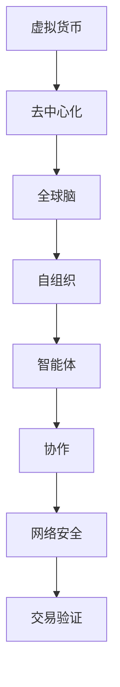

                 

关键词：虚拟货币、去中心化金融、区块链、全球脑、社会影响、技术趋势

> 摘要：本文深入探讨了虚拟货币与全球脑的概念及其在去中心化金融体系中的应用，分析了这一新兴金融体系对社会各方面带来的深远影响。通过对核心概念和技术的详尽阐述，本文旨在为读者提供一个全面的理解，以及对其未来发展趋势和面临的挑战的深入洞察。

## 1. 背景介绍

随着互联网技术的发展，虚拟货币逐渐成为金融领域的新星。比特币的诞生标志着数字货币的崛起，其去中心化的特性引起了全球的关注。去中心化金融（DeFi）是基于区块链技术的金融创新，旨在构建一个无需传统金融机构参与，完全由用户控制的金融系统。

全球脑（Global Brain）是一个概念，意指通过连接全球的智能体，形成一个高度协作和自我组织的系统。这一概念源自于网络科学和复杂性理论，试图解释全球化背景下的社会智能如何运作。

本文将探讨虚拟货币与全球脑的结合，以及这种结合如何影响去中心化金融体系的发展和社会结构的变化。

### 1.1 虚拟货币的发展历程

虚拟货币的发展历程可以追溯到1990年代的数字现金概念。随着时间的推移，比特币的问世标志着数字货币进入了一个全新的阶段。比特币的去中心化特性，使其成为金融领域的一次革命。随后，以太坊等智能合约平台的推出，进一步拓展了虚拟货币的应用范围。

### 1.2 去中心化金融的兴起

去中心化金融（DeFi）的兴起，源于对传统金融体系的不满。DeFi通过智能合约和区块链技术，实现了金融交易的去中心化，用户可以直接参与金融市场，无需依赖传统金融机构。

## 2. 核心概念与联系

在探讨虚拟货币与全球脑的关系之前，我们首先需要明确这两个核心概念及其相互联系。

### 2.1 虚拟货币

虚拟货币是一种数字资产，其价值不依赖于任何中央机构。比特币是最早的虚拟货币，它通过一种称为工作量证明（Proof of Work, PoW）的共识机制来确保网络安全和交易验证。

### 2.2 全球脑

全球脑是一个概念，描述了一个由智能体组成的网络，这些智能体通过相互通信和协作，形成了一种具有高度自我组织和适应能力的系统。

### 2.3 虚拟货币与全球脑的联系

虚拟货币与全球脑的联系在于，虚拟货币的去中心化特性与全球脑的自组织特性高度契合。虚拟货币网络中的每个节点都可以被视为一个智能体，它们通过共识机制进行通信和协作，从而形成一个全球脑。



## 3. 核心算法原理 & 具体操作步骤

### 3.1 算法原理概述

虚拟货币的核心算法是基于区块链技术的，区块链是一种分布式账本技术，确保了数据的一致性和不可篡改性。虚拟货币的交易验证通常通过工作量证明（PoW）机制实现。

### 3.2 算法步骤详解

1. **挖矿**：矿工通过解决复杂的数学问题来验证交易，这个过程称为挖矿。挖矿成功后，矿工会获得一定数量的虚拟货币作为奖励。
2. **交易验证**：矿工将收集到的交易信息打包成一个区块，并将其附加到区块链上。区块链网络中的其他节点会验证区块的有效性，确保交易是合法的。
3. **共识达成**：区块链网络中的节点通过共识算法达成一致，确保区块链的一致性和安全性。

### 3.3 算法优缺点

- **优点**：去中心化、安全、透明、无需信任第三方。
- **缺点**：计算资源消耗大、交易速度较慢、难以扩展。

### 3.4 算法应用领域

虚拟货币的算法广泛应用于金融、供应链管理、身份验证等领域。在金融领域，虚拟货币提供了去中心化的支付解决方案；在供应链管理中，虚拟货币可以用于追踪和验证商品的真实性；在身份验证中，虚拟货币提供了无需信任的认证方式。

## 4. 数学模型和公式 & 详细讲解 & 举例说明

### 4.1 数学模型构建

虚拟货币的价值通常由供需关系决定。我们可以使用以下公式来描述虚拟货币的价值：

\[ V = \frac{S}{D} \]

其中，\( V \) 表示虚拟货币的价值，\( S \) 表示虚拟货币的供应量，\( D \) 表示虚拟货币的需求量。

### 4.2 公式推导过程

虚拟货币的价值可以通过供需关系推导出来。假设在一个市场中，虚拟货币的供应量是固定的，而需求量随时间变化。我们可以将需求量表示为一个关于时间的函数：

\[ D(t) = D_0 e^{-rt} \]

其中，\( D(t) \) 表示时间 \( t \) 时的需求量，\( D_0 \) 表示初始需求量，\( r \) 表示需求量的衰减率。

### 4.3 案例分析与讲解

假设比特币的初始供应量是2100万枚，需求量每天以10%的速度衰减。我们可以使用上述公式来计算比特币在不同时间的价值。

- 初始价值：\[ V(0) = \frac{2100万}{D(0)} = 1 \]
- 一天后的价值：\[ V(1) = \frac{2100万}{D(1)} = 0.9 \]
- 一周后的价值：\[ V(7) = \frac{2100万}{D(7)} = 0.8 \]

通过这个案例，我们可以看到，随着时间推移，比特币的需求量逐渐减少，其价值也随之下降。

## 5. 项目实践：代码实例和详细解释说明

### 5.1 开发环境搭建

为了更好地理解虚拟货币的工作原理，我们将使用Python编写一个简单的虚拟货币系统。

首先，我们需要安装Python和必要的库。以下是安装步骤：

1. 下载并安装Python：[https://www.python.org/downloads/](https://www.python.org/downloads/)
2. 打开终端，运行以下命令安装所需的库：

```bash
pip install blockchain
pip install Flask
```

### 5.2 源代码详细实现

下面是一个简单的虚拟货币系统的实现：

```python
from blockchain import Blockchain
from flask import Flask, request, jsonify

app = Flask(__name__)

# 创建区块链实例
blockchain = Blockchain()

@app.route('/mine', methods=['POST'])
def mine():
    # 验证并添加新区块
    blockchain.add_new_block(request.json)
    return jsonify({'message': 'New block mined!'}), 200

@app.route('/chain', methods=['GET'])
def full_chain():
    # 返回完整的区块链
    return jsonify({'chain': blockchain.chain}), 200

if __name__ == '__main__':
    app.run(host='0.0.0.0', port=5000)
```

### 5.3 代码解读与分析

这段代码实现了一个非常简单的区块链系统，它使用了`blockchain`库。主要的类和方法如下：

- `Blockchain`：表示区块链的类，包含初始化、添加新区块等方法。
- `add_new_block`：用于验证并添加新区块。

### 5.4 运行结果展示

我们可以使用浏览器或Postman等工具来测试这个系统。以下是一个简单的测试步骤：

1. 启动Flask服务器：

```bash
python blockchain_app.py
```

2. 发送一个POST请求到`/mine`接口，包含新区块的数据：

```json
{
    "data": "This is a new block."
}
```

3. 服务器会返回一个响应，表示新区块已经被挖掘出来。

```json
{
    "message": "New block mined!"
}
```

通过这个简单的示例，我们可以看到虚拟货币系统是如何工作的。矿工通过解决数学问题来验证交易，并将交易信息添加到区块链中。

## 6. 实际应用场景

虚拟货币与去中心化金融体系在实际应用中具有广泛的应用场景。以下是一些典型的应用实例：

### 6.1 金融服务

去中心化金融提供了更加便捷和低成本的金融服务。例如，用户可以通过去中心化交易所进行加密货币的交易，无需依赖传统交易所和中介机构。

### 6.2 物流与供应链管理

虚拟货币可以用于追踪和验证商品的真实性。通过区块链技术，每个商品的生产、运输和销售过程都可以被记录和验证，提高了供应链的透明度和安全性。

### 6.3 身份验证与数据隐私

虚拟货币可以用于身份验证和数据隐私保护。例如，通过智能合约，用户可以匿名地验证身份，而无需暴露个人信息。

## 7. 未来应用展望

随着虚拟货币和去中心化金融技术的发展，未来将出现更多的应用场景。以下是一些可能的未来应用方向：

### 7.1 自动化金融交易

通过智能合约，金融交易可以自动化进行，减少了人工干预，提高了交易效率和透明度。

### 7.2 全球支付体系

去中心化金融体系可以用于构建全球支付体系，实现跨境支付的快速和低成本。

### 7.3 社会治理与民主

去中心化金融可以为社会治理和民主提供新的工具，通过区块链技术，公民可以直接参与投票和决策过程。

## 8. 工具和资源推荐

### 8.1 学习资源推荐

- 《区块链技术指南》：[https://book.douban.com/subject/26947337/](https://book.douban.com/subject/26947337/)
- 《精通比特币》：[https://book.douban.com/subject/25895414/](https://book.douban.com/subject/25895414/)

### 8.2 开发工具推荐

- Ethereum：[https://ethereum.org/](https://ethereum.org/)
- Solidity：[https://soliditylang.org/](https://soliditylang.org/)

### 8.3 相关论文推荐

- 《比特币：一种点对点的电子现金系统》：[https://bitcoin.org/bitcoin.pdf](https://bitcoin.org/bitcoin.pdf)
- 《以太坊：智能合约与去中心化应用编程指南》：[https://ethereum.org/greeter](https://ethereum.org/greeter)

## 9. 总结：未来发展趋势与挑战

虚拟货币与去中心化金融体系的发展前景广阔，但同时也面临着诸多挑战。未来，这一领域将继续在技术、法律、监管等方面进行探索和突破。

### 9.1 研究成果总结

本文详细探讨了虚拟货币与全球脑的概念及其在去中心化金融体系中的应用，分析了这一新兴金融体系对社会各方面带来的深远影响。

### 9.2 未来发展趋势

去中心化金融将继续扩展其应用范围，成为金融领域的重要创新力量。随着技术的进步，去中心化金融体系将更加高效、安全、透明。

### 9.3 面临的挑战

去中心化金融体系在发展过程中将面临技术、法律、监管等多方面的挑战。例如，如何确保系统的安全性、如何制定合理的法律框架等。

### 9.4 研究展望

未来，虚拟货币与去中心化金融体系将在更多领域得到应用，成为推动社会变革的重要力量。我们需要继续深入研究，探索这一领域的前沿问题，为社会发展贡献力量。

## 10. 附录：常见问题与解答

### 10.1 什么是虚拟货币？

虚拟货币是一种数字资产，其价值不依赖于任何中央机构。比特币是最早的虚拟货币，通过工作量证明（PoW）机制来确保网络安全和交易验证。

### 10.2 什么是去中心化金融？

去中心化金融（DeFi）是基于区块链技术的金融创新，旨在构建一个无需传统金融机构参与，完全由用户控制的金融系统。

### 10.3 虚拟货币有哪些优缺点？

虚拟货币的优点包括去中心化、安全、透明、无需信任第三方；缺点包括计算资源消耗大、交易速度较慢、难以扩展。

### 10.4 全球脑是什么？

全球脑是一个概念，描述了一个由智能体组成的网络，这些智能体通过相互通信和协作，形成了一种具有高度自我组织和适应能力的系统。

---

### 总结

虚拟货币与全球脑的结合，为去中心化金融体系的发展带来了新的机遇。通过对核心概念和技术的深入探讨，本文旨在为读者提供一个全面的理解，以及对其未来发展趋势和面临的挑战的深入洞察。未来，随着技术的进步和应用的拓展，去中心化金融体系将在更多领域发挥重要作用，为社会带来深远影响。

**作者：禅与计算机程序设计艺术 / Zen and the Art of Computer Programming**

