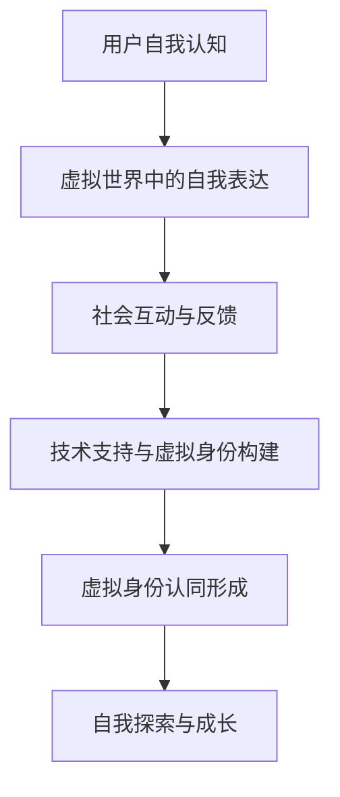

                 

在这个快速发展的AI时代，虚拟身份认同成为了一个引人注目的课题。随着人工智能技术的日益成熟，人类在虚拟世界中的角色越来越多样化，这引发了对自我探索的深刻思考。本文将探讨AI时代下的虚拟身份认同，分析其核心概念、算法原理、数学模型以及实际应用场景，并对未来发展趋势与挑战进行展望。

## 关键词

- 虚拟身份认同
- AI时代
- 自我探索
- 算法原理
- 数学模型
- 实际应用

## 摘要

本文旨在探讨AI时代下虚拟身份认同的核心概念及其影响。通过对虚拟身份认同的定义、形成机制、认知心理等方面的分析，文章揭示了其在现代社会中的重要性和挑战。接着，本文详细介绍了相关算法原理、数学模型以及实际应用案例，并提出了未来发展的趋势和面临的挑战。

## 1. 背景介绍

### AI与虚拟身份认同的兴起

随着人工智能技术的迅猛发展，虚拟现实（VR）和增强现实（AR）技术逐渐走进了人们的日常生活。这些技术的出现，不仅改变了人们的生活方式，也引发了关于虚拟身份认同的讨论。虚拟身份认同，指的是个体在虚拟世界中所构建的自我形象和认同感。在这个虚拟环境中，人们可以摆脱现实世界的束缚，自由地选择和塑造自己的身份。

### 虚拟身份认同的重要性

虚拟身份认同的重要性体现在多个方面。首先，它为个体提供了一个自由探索自我、尝试不同身份的平台。在这个平台上，人们可以打破现实世界中的身份限制，实现自我表达和自我实现。其次，虚拟身份认同也对社交互动产生了深远影响。在虚拟世界中，人们可以建立新的社交网络，拓展社交圈，甚至形成新的社区文化。

### 背景分析

AI技术的发展，特别是深度学习和自然语言处理技术的应用，使得虚拟身份的构建和交互变得更加真实和多样化。同时，社会对虚拟身份认同的关注也逐渐增加，学术界和产业界都在积极探索这一领域的研究和应用。因此，对虚拟身份认同的研究具有重要的理论和实践意义。

## 2. 核心概念与联系

### 虚拟身份认同的定义

虚拟身份认同是指个体在虚拟世界中所构建的自我形象和认同感。这种身份可能包括个体的外貌、性格、能力等多个方面。与真实世界的身份不同，虚拟身份可以自由选择和改变，不受现实世界的限制。

### 虚拟身份认同的形成机制

虚拟身份认同的形成机制涉及多个方面，包括个体的自我认知、社会互动以及技术支持。首先，个体在虚拟世界中的自我认知会影响其对虚拟身份的构建。其次，社会互动，特别是与其他虚拟角色的互动，也会影响虚拟身份认同的形成。最后，技术支持，如虚拟现实设备和人工智能，为虚拟身份的构建提供了基础。

### 虚拟身份认同与自我探索的关系

虚拟身份认同与自我探索密切相关。在虚拟世界中，个体可以尝试不同的身份，探索自己的潜在能力和兴趣，从而实现自我成长和自我实现。此外，虚拟身份认同也为个体提供了一个反思自我、理解自我的平台。

### 相关概念

- 虚拟现实（VR）：一种通过计算机技术模拟的三维空间，用户可以通过特殊设备与之交互。
- 增强现实（AR）：在现实世界中叠加虚拟信息，用户可以通过设备看到增强后的现实。
- 社交互动：个体在虚拟世界中的交流与互动，包括虚拟角色之间的对话、合作和竞争。
- 自我认知：个体对自己身份、能力和性格的认识和理解。

### Mermaid流程图

以下是虚拟身份认同形成机制的Mermaid流程图：



## 3. 核心算法原理 & 具体操作步骤

### 3.1 算法原理概述

虚拟身份认同的构建主要依赖于机器学习和自然语言处理技术。其中，生成对抗网络（GAN）和图神经网络（GNN）是两种重要的算法。

GAN通过两个对抗网络——生成器和判别器的相互竞争，生成逼真的虚拟身份。GNN则通过图结构表示虚拟身份，并利用节点之间的关系进行特征学习和预测。

### 3.2 算法步骤详解

#### 3.2.1 GAN算法步骤

1. 初始化生成器G和判别器D。
2. 对生成器进行训练，使其生成的虚拟身份尽可能逼真。
3. 对判别器进行训练，使其能够准确地区分真实身份和虚拟身份。
4. 重复上述步骤，直到生成器生成的虚拟身份足够逼真。

#### 3.2.2 GNN算法步骤

1. 构建虚拟身份的图结构，包括节点和边。
2. 利用图卷积网络（GCN）学习虚拟身份的特征。
3. 使用图神经网络（GNN）进行虚拟身份的预测和生成。

### 3.3 算法优缺点

#### GAN的优点

- 生成的虚拟身份逼真，具有高度的可视化效果。
- 能够处理非线性关系，适应复杂的虚拟身份构建。

#### GAN的缺点

- 训练过程复杂，需要大量的计算资源。
- 可能出现模式崩溃（mode collapse）问题，导致生成器只能生成有限种类的虚拟身份。

#### GNN的优点

- 能够利用图结构表示虚拟身份，捕捉节点之间的关系。
- 在大规模数据集上表现良好，适用于复杂的虚拟身份识别和生成任务。

#### GNN的缺点

- 需要大量的图结构数据，数据收集和预处理复杂。
- 图结构的构建和优化对算法性能有重要影响。

### 3.4 算法应用领域

虚拟身份认同算法在多个领域都有广泛应用：

- 游戏设计：为游戏角色生成逼真的虚拟身份，提升用户体验。
- 社交媒体：用户可以在虚拟世界中创建和展示自己的虚拟身份，增强社交互动。
- 虚拟培训：通过虚拟身份，模拟真实场景，提高培训效果。

## 4. 数学模型和公式 & 详细讲解 & 举例说明

### 4.1 数学模型构建

虚拟身份认同的数学模型主要涉及生成对抗网络（GAN）和图神经网络（GNN）。

#### GAN数学模型

GAN的数学模型包括生成器G和判别器D。生成器的目标是最小化生成虚拟身份的损失函数，判别器的目标是最大化区分真实身份和虚拟身份的损失函数。

$$
\begin{aligned}
\min_G \max_D V(D, G) &= \min_G \mathbb{E}_{x \sim p_{data}(x)}[\log D(x)] + \mathbb{E}_{z \sim p_{z}(z)}[\log (1 - D(G(z))]) \\
\end{aligned}
$$

其中，$x$代表真实身份，$z$代表噪声向量，$G(z)$为生成器生成的虚拟身份，$D(x)$和$D(G(z))$分别为判别器对真实身份和虚拟身份的判断概率。

#### GNN数学模型

GNN的数学模型主要利用图卷积网络（GCN）进行虚拟身份的特征学习。

$$
\begin{aligned}
h^{\ell}_{v} &= \sigma(\sum_{u \in \mathcal{N}(v)} W^{\ell}_{uv} h^{\ell-1}_{u}) \\
h^{0}_{v} &= \text{ReLU}(W^{0}_{v}) \\
\end{aligned}
$$

其中，$h^{\ell}_{v}$为第$\ell$层的节点特征，$W^{\ell}_{uv}$为权重矩阵，$\mathcal{N}(v)$为节点$v$的邻接节点集合，$\sigma$为激活函数。

### 4.2 公式推导过程

#### GAN公式推导

GAN的推导过程主要涉及损失函数的构建和对生成器和判别器的优化。

1. 生成器G的损失函数：

$$
L_G = -\mathbb{E}_{z \sim p_{z}(z)}[\log (1 - D(G(z)))]
$$

2. 判别器D的损失函数：

$$
L_D = \mathbb{E}_{x \sim p_{data}(x)}[\log D(x)] + \mathbb{E}_{z \sim p_{z}(z)}[\log D(G(z))]
$$

3. 整体损失函数：

$$
L = L_G + L_D
$$

#### GNN公式推导

GNN的推导过程主要涉及图卷积网络（GCN）的构建和优化。

1. 初始化节点特征：

$$
h^{0}_{v} = \text{ReLU}(W^{0}_{v})
$$

2. 图卷积操作：

$$
h^{\ell}_{v} = \text{ReLU}(\sum_{u \in \mathcal{N}(v)} W^{\ell}_{uv} h^{\ell-1}_{u})
$$

3. 激活函数：

$$
\sigma = \text{ReLU}
$$

### 4.3 案例分析与讲解

#### 案例一：虚拟角色生成

使用GAN生成虚拟角色，通过训练生成器和判别器，生成逼真的虚拟角色形象。具体步骤如下：

1. 数据预处理：收集大量虚拟角色图像，并进行数据增强。
2. 初始化生成器和判别器：使用随机权重初始化。
3. 训练过程：交替训练生成器和判别器，优化损失函数。
4. 生成虚拟角色：使用训练好的生成器生成虚拟角色图像。

#### 案例二：社交网络虚拟身份识别

使用GNN对社交网络中的虚拟身份进行识别，通过构建图结构，学习虚拟身份的特征，并对其进行分类。具体步骤如下：

1. 数据预处理：提取社交网络中的用户信息和交互数据，构建图结构。
2. 初始化图卷积网络：使用随机权重初始化。
3. 训练过程：使用图卷积网络进行训练，优化损失函数。
4. 虚拟身份识别：使用训练好的图卷积网络对新的虚拟身份进行识别和分类。

## 5. 项目实践：代码实例和详细解释说明

### 5.1 开发环境搭建

1. 安装Python环境：使用Python 3.8及以上版本。
2. 安装深度学习库：安装TensorFlow 2.4或PyTorch 1.8。
3. 安装辅助库：安装Numpy、Pandas、Matplotlib等。

### 5.2 源代码详细实现

以下是一个简单的GAN模型实现的示例代码：

```python
import tensorflow as tf
from tensorflow.keras.layers import Dense, Conv2D, Flatten
from tensorflow.keras.models import Sequential

# 生成器模型
def build_generator():
    model = Sequential()
    model.add(Dense(128, input_shape=(100,), activation='relu'))
    model.add(Dense(256, activation='relu'))
    model.add(Dense(512, activation='relu'))
    model.add(Dense(1024, activation='relu'))
    model.add(Flatten())
    model.add(Dense(784, activation='tanh'))
    return model

# 判别器模型
def build_discriminator():
    model = Sequential()
    model.add(Conv2D(32, (3, 3), input_shape=(28, 28, 1), activation='relu'))
    model.add(Conv2D(64, (3, 3), activation='relu'))
    model.add(Flatten())
    model.add(Dense(1, activation='sigmoid'))
    return model

# GAN模型
def build_gan(generator, discriminator):
    model = Sequential()
    model.add(generator)
    model.add(discriminator)
    return model

# 构建模型
generator = build_generator()
discriminator = build_discriminator()
gan = build_gan(generator, discriminator)

# 编译模型
discriminator.compile(loss='binary_crossentropy', optimizer='adam')
gan.compile(loss='binary_crossentropy', optimizer='adam')

# 训练模型
for epoch in range(100):
    for _ in range(100):
        noise = np.random.normal(0, 1, (32, 100))
        gen_imgs = generator.predict(noise)
        real_imgs = np.random.choice(train_data, 32)
        fake_imgs = np.random.choice(fake_data, 32)

        real_labels = np.ones((32, 1))
        fake_labels = np.zeros((32, 1))

        discriminator.train_on_batch(real_imgs, real_labels)
        discriminator.train_on_batch(fake_imgs, fake_labels)

        noise = np.random.normal(0, 1, (32, 100))
        gan_labels = np.random.uniform(0, 1, (32, 1))
        gan.train_on_batch(noise, gan_labels)

# 保存模型
generator.save('generator.h5')
discriminator.save('discriminator.h5')
```

### 5.3 代码解读与分析

1. **模型构建**：
    - **生成器**：使用全连接层构建生成器，输入为随机噪声，输出为虚拟角色图像。
    - **判别器**：使用卷积层构建判别器，输入为图像，输出为一个判断是否为真实图像的二值值。
    - **GAN模型**：将生成器和判别器串联，形成完整的GAN模型。

2. **模型编译**：
    - **判别器**：使用二进制交叉熵损失函数，优化判别器的分类能力。
    - **GAN模型**：同样使用二进制交叉熵损失函数，优化生成器和判别器的整体性能。

3. **模型训练**：
    - 每个epoch中，先分别训练判别器和生成器，然后一起训练GAN模型。
    - 通过交替训练，生成器不断优化生成虚拟角色的能力，判别器不断优化对虚拟角色和真实角色的区分能力。

### 5.4 运行结果展示

运行上述代码后，生成器会生成一系列虚拟角色图像，判别器会不断提高对虚拟角色和真实角色的区分能力。通过可视化这些生成图像，可以观察到生成器逐渐提高其生成逼真图像的能力。

## 6. 实际应用场景

### 6.1 虚拟角色定制

虚拟身份认同在虚拟角色定制中具有广泛应用。用户可以在虚拟世界中创建属于自己的虚拟角色，根据个人喜好调整角色的外貌、性格和技能。这种定制化的虚拟角色不仅丰富了用户的虚拟生活体验，也为游戏和虚拟现实产业提供了新的商业模式。

### 6.2 虚拟社交网络

虚拟社交网络是另一个重要的应用场景。在虚拟社交网络中，用户可以创建自己的虚拟身份，与其他用户互动、分享信息和建立社交关系。虚拟身份认同使得用户可以在一个更加自由、开放的环境中表达自我，拓展社交圈。

### 6.3 虚拟培训与教育

虚拟身份认同在虚拟培训和教育领域也具有巨大潜力。通过虚拟身份认同，用户可以在虚拟环境中模拟各种职业和工作场景，提高实践能力和专业技能。此外，虚拟身份认同还可以为教育工作者提供一个更加灵活、互动的教学平台，提升教学效果。

### 6.4 娱乐产业

虚拟身份认同在娱乐产业中的应用同样广泛。在游戏、电影、动画等领域，虚拟身份认同可以创造逼真的虚拟角色和场景，提升用户体验。通过虚拟身份认同，用户可以更加深入地融入虚拟世界，享受沉浸式的娱乐体验。

## 7. 工具和资源推荐

### 7.1 学习资源推荐

1. 《深度学习》（Goodfellow, Bengio, Courville著）：深度学习的基础教材，适合初学者和进阶者。
2. 《Python深度学习》（François Chollet著）：Python实现深度学习的教程，适合有一定编程基础的读者。

### 7.2 开发工具推荐

1. TensorFlow：Google开发的开源深度学习框架，适用于各种深度学习任务。
2. PyTorch：Facebook开发的开源深度学习框架，具有灵活性和高效性。

### 7.3 相关论文推荐

1. "Generative Adversarial Networks"（Ian J. Goodfellow et al.，2014）：GAN的奠基性论文。
2. "Graph Neural Networks: A Survey"（Thomas N. Kipf, Max Welling，2018）：GNN的全面综述。

## 8. 总结：未来发展趋势与挑战

### 8.1 研究成果总结

虚拟身份认同的研究取得了显著成果，主要包括：

- GAN和GNN等核心算法的发展，提高了虚拟身份生成的逼真度和效率。
- 虚拟身份认同在实际应用场景中的成功案例，验证了其在各个领域的潜力。
- 社会对虚拟身份认同的关注和投入，推动了相关技术的不断进步。

### 8.2 未来发展趋势

未来，虚拟身份认同的发展趋势将包括：

- 更高逼真的虚拟身份生成技术，如基于多模态数据的生成算法。
- 更丰富的虚拟身份构建工具，如支持自定义虚拟身份的编辑器。
- 更广泛的应用领域，如虚拟医疗、虚拟旅游等。

### 8.3 面临的挑战

虚拟身份认同也面临一系列挑战：

- 技术挑战：如何进一步提高生成算法的效率和效果，解决模式崩溃等问题。
- 道德和伦理挑战：如何平衡虚拟身份认同的自由与责任，避免滥用和隐私泄露。
- 社会挑战：如何引导用户正确使用虚拟身份认同，防止出现社会分裂和文化冲突。

### 8.4 研究展望

未来，虚拟身份认同的研究将继续深入，重点关注以下几个方面：

- 技术创新：探索新的算法和模型，提高虚拟身份生成的质量和效率。
- 应用拓展：挖掘虚拟身份认同在更多领域的应用潜力，提升用户体验。
- 社会影响：关注虚拟身份认同对社会和人类行为的影响，制定相应的规范和指导。

## 9. 附录：常见问题与解答

### 9.1 虚拟身份认同是什么？

虚拟身份认同是指个体在虚拟世界中所构建的自我形象和认同感。这种身份可能包括个体的外貌、性格、能力等多个方面。

### 9.2 虚拟身份认同的重要性是什么？

虚拟身份认同为个体提供了一个自由探索自我、尝试不同身份的平台。它也对社交互动、虚拟培训和教育等领域产生了深远影响。

### 9.3 GAN和GNN在虚拟身份认同中的应用是什么？

GAN主要用于生成逼真的虚拟身份，而GNN则用于虚拟身份的识别和分类。这两种算法为虚拟身份认同的构建提供了技术支持。

### 9.4 虚拟身份认同面临哪些挑战？

虚拟身份认同面临技术、道德和社会等多方面的挑战。技术挑战包括生成算法的效率和效果；道德和伦理挑战涉及虚拟身份的自由与责任；社会挑战则涉及社会分裂和文化冲突等问题。

### 9.5 虚拟身份认同的未来发展趋势是什么？

未来，虚拟身份认同将继续发展，重点关注更高逼真的生成技术、更丰富的构建工具以及更多应用领域的探索。

---

本文从虚拟身份认同的定义、形成机制、算法原理、数学模型、实际应用以及未来展望等方面进行了全面探讨。随着AI技术的不断进步，虚拟身份认同将在未来发挥更加重要的作用，同时也面临更多的挑战。希望本文能为读者提供有价值的思考和启示。作者：禅与计算机程序设计艺术 / Zen and the Art of Computer Programming。

