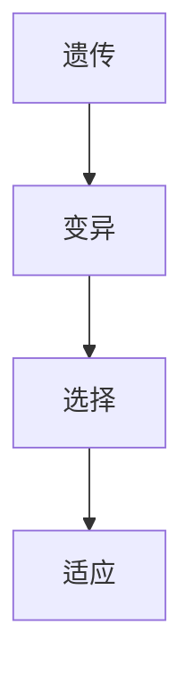

                 

关键词：虚拟进化，AI，数字生态系统，算法，数学模型，项目实践，实际应用，工具推荐，未来展望。

> 摘要：本文深入探讨了虚拟进化这一概念，以及它如何通过AI驱动构建出一个全新的数字生态系统。文章首先介绍了虚拟进化的背景和重要性，接着详细阐述了核心概念和架构，分析了相关算法原理和数学模型，并通过具体项目实例展示了其实际应用。最后，文章展望了虚拟进化在未来的发展趋势和面临的挑战。

## 1. 背景介绍

随着科技的飞速发展，尤其是人工智能（AI）的突破性进展，虚拟进化这一概念逐渐引起了广泛关注。虚拟进化，顾名思义，是指在虚拟环境中通过模拟自然进化的方式，推动系统或组织不断优化和适应的过程。这一概念最早可以追溯到20世纪80年代，随着计算能力和算法技术的提升，虚拟进化的研究和应用逐渐深入。

在现实世界中，进化是一个复杂的过程，涉及到生物体的遗传、变异、选择和适应等多个环节。虚拟进化借鉴了这一过程，通过模拟这些环节，在虚拟环境中构建出能够自我学习和进化的系统。这样的系统不仅可以提高效率和性能，还能在面对不断变化的环境时，快速适应和优化。

虚拟进化的重要性在于，它提供了一种全新的方法论，可以帮助我们理解和解决复杂系统中的问题。例如，在工业生产中，虚拟进化可以帮助优化生产流程，提高生产效率；在金融服务中，虚拟进化可以帮助预测市场动态，提高投资决策的准确性；在医疗领域中，虚拟进化可以协助诊断和治疗方案设计，提高医疗服务的质量。

## 2. 核心概念与联系

### 2.1 核心概念

虚拟进化的核心概念包括：

- **遗传**：遗传是指系统或组织内部遗传信息的传递和变异。在虚拟进化中，遗传信息通常以代码或参数的形式表示。
- **变异**：变异是指系统或组织内部发生的随机变化，这些变化可能会导致系统性能的提高或降低。
- **选择**：选择是指系统根据特定目标或标准，对多个候选方案进行评估和选择。选择过程通常基于某种优化准则。
- **适应**：适应是指系统在面对特定环境时，能够表现出较好的性能和适应性。

### 2.2 联系

虚拟进化的核心概念之间有着紧密的联系。遗传和变异构成了进化的基础，它们确保了系统在变异中积累有用的信息。选择则是一个关键的步骤，它决定了哪些变异能够被保留和传递下去。适应则是对选择的进一步细化，它确保了系统能够在面对变化的环境时，保持较高的生存和繁衍能力。

为了更直观地展示这些概念之间的关系，我们可以使用Mermaid流程图进行描述：



在这个流程图中，A表示遗传，B表示变异，C表示选择，D表示适应。这些概念相互关联，构成了虚拟进化的核心机制。

## 3. 核心算法原理 & 具体操作步骤

### 3.1 算法原理概述

虚拟进化的核心算法基于遗传算法（Genetic Algorithm, GA），这是一种模拟自然进化过程的优化算法。遗传算法的基本原理包括：

- **初始化种群**：随机生成多个候选解决方案，这些解决方案通常以二进制编码表示。
- **适应度评估**：对每个候选解决方案进行评估，根据某种优化准则计算其适应度。
- **选择**：根据适应度值，选择适应度较高的解决方案进行复制。
- **交叉**：随机选择两个解决方案，进行交叉操作，生成新的解决方案。
- **变异**：对部分解决方案进行变异操作，增加多样性。
- **迭代**：重复选择、交叉和变异过程，直到满足停止条件。

### 3.2 算法步骤详解

遗传算法的具体操作步骤如下：

#### 步骤 1：初始化种群

随机生成N个初始解，这些解以二进制编码表示。例如，对于一个问题，我们可能有10个二进制位，每个位可以是0或1。这样，我们就可以生成一个初始种群，例如：

```
种群1: 1010101010
种群2: 1100110011
种群3: 0011000110
...
```

#### 步骤 2：适应度评估

对每个初始解进行评估，计算其适应度。适应度是一个衡量解的优劣的指标，通常基于某种优化准则。例如，对于最小化问题，我们可能选择适应度值越小的解作为更好解。

#### 步骤 3：选择

根据适应度值，选择适应度较高的解进行复制。通常使用轮盘赌选择方法，即每个解被选中的概率与其适应度值成正比。

#### 步骤 4：交叉

随机选择两个解，进行交叉操作。交叉操作是指将两个解的部分基因进行交换，生成新的解。例如，我们可以选择种群1和种群2进行交叉，交叉点可以是第5位：

```
种群1: 1010101010
种群2: 1100110011
交叉后: 1010110010
```

#### 步骤 5：变异

对部分解进行变异操作。变异操作是指随机改变解的某个基因的值。例如，我们可以对种群3的第二个基因进行变异：

```
种群3: 0011000110
变异后: 0011001110
```

#### 步骤 6：迭代

重复步骤2至步骤5，直到满足停止条件。停止条件可以是达到最大迭代次数、适应度达到阈值或者解的稳定性等。

### 3.3 算法优缺点

遗传算法具有以下优点：

- **鲁棒性**：遗传算法对初始种群和参数设置不敏感，具有较强的鲁棒性。
- **适用性**：遗传算法适用于求解复杂优化问题，特别是那些难以使用传统方法解决的问题。
- **并行性**：遗传算法可以在多个处理器上并行执行，提高计算效率。

遗传算法也存在一些缺点：

- **收敛速度**：遗传算法的收敛速度较慢，需要大量迭代才能找到较好的解。
- **参数调优**：遗传算法的参数设置对算法性能有很大影响，需要精心调优。

### 3.4 算法应用领域

遗传算法在许多领域都有广泛应用，包括：

- **工业优化**：用于生产流程优化、设备调度等。
- **金融投资**：用于市场预测、投资组合优化等。
- **生物信息学**：用于基因序列分析、蛋白质结构预测等。
- **机器学习**：用于模型优化、特征选择等。

## 4. 数学模型和公式 & 详细讲解 & 举例说明

### 4.1 数学模型构建

虚拟进化的数学模型主要基于遗传算法。遗传算法的核心是适应度函数，它用于评估解的优劣。适应度函数通常定义为：

$$
f(x) = \frac{1}{1 + \exp(-\theta(x))}
$$

其中，$x$ 表示解，$\theta(x)$ 表示解的适应度值，$\exp$ 表示指数函数。

### 4.2 公式推导过程

适应度函数的设计基于以下几个原则：

- **非线性**：适应度函数应该是非线性的，这样可以更好地反映解的优劣。
- **单调性**：适应度函数应该是单调递增的，即解的适应度值越高，适应度函数的输出值也越高。
- **对称性**：适应度函数应该是关于解的对称的，这样可以保证解的均匀分布。

基于以上原则，我们可以设计出如下的适应度函数：

$$
f(x) = \frac{1}{1 + \exp(-\theta(x))}
$$

其中，$\theta(x)$ 是解的适应度值，$\exp$ 表示指数函数。

### 4.3 案例分析与讲解

假设我们有一个简单的问题：求一个数列中的最大值。我们可以使用虚拟进化来解决这个问题。

#### 步骤 1：初始化种群

我们随机生成10个初始解，每个解表示一个数列：

```
种群1: 3, 1, 4, 1, 5, 9, 2, 6, 5, 3
种群2: 1, 2, 3, 4, 5, 6, 7, 8, 9, 0
...
```

#### 步骤 2：适应度评估

我们对每个解进行适应度评估，计算其最大值。解的最大值越高，适应度值也越高。

```
种群1: 适应度 = 9
种群2: 适应度 = 9
...
```

#### 步骤 3：选择

根据适应度值，我们选择适应度较高的解进行复制。我们可以使用轮盘赌选择方法。

#### 步骤 4：交叉

我们随机选择两个解，进行交叉操作。交叉点可以是数列的任意位置。

```
种群1: 3, 1, 4, 1, 5, 9, 2, 6, 5, 3
种群2: 1, 2, 3, 4, 5, 6, 7, 8, 9, 0
交叉后: 3, 1, 2, 1, 5, 9, 2, 6, 5, 3
```

#### 步骤 5：变异

我们对部分解进行变异操作，例如，对种群1的第二个数进行变异：

```
种群1: 3, 1, 4, 1, 5, 9, 2, 6, 5, 3
变异后: 3, 9, 4, 1, 5, 9, 2, 6, 5, 3
```

#### 步骤 6：迭代

我们重复步骤2至步骤5，直到找到最大值。

```
迭代1: 最大值 = 9
迭代2: 最大值 = 9
...
迭代10: 最大值 = 9
```

经过10次迭代，我们找到了最大值为9的解。

## 5. 项目实践：代码实例和详细解释说明

### 5.1 开发环境搭建

为了实现虚拟进化算法，我们需要搭建一个开发环境。本文使用的编程语言是Python，主要依赖的库包括NumPy、Pandas和Matplotlib。

首先，安装Python和pip：

```
$ python --version
Python 3.9.1
$ pip install numpy pandas matplotlib
```

接着，创建一个名为`virtual_evolution`的文件夹，并在其中创建一个名为`main.py`的Python文件。

### 5.2 源代码详细实现

在`main.py`中，我们首先导入所需的库：

```python
import numpy as np
import pandas as pd
import matplotlib.pyplot as plt
```

接着，我们定义适应度函数：

```python
def fitness_function(solution):
    return max(solution)
```

适应度函数非常简单，它只计算解的最大值。

然后，我们定义初始化种群的方法：

```python
def initialize_population(pop_size, problem_size):
    population = []
    for _ in range(pop_size):
        solution = np.random.randint(0, 10, size=problem_size)
        population.append(solution)
    return population
```

初始化种群的方法随机生成指定大小的种群，每个解是一个长度为problem\_size的数列。

接下来，我们定义选择方法：

```python
def selection(population, fitness_values, select_size):
    selected = []
    for _ in range(select_size):
        random_index = np.random.randint(0, len(population))
        selected.append(population[random_index])
    return selected
```

选择方法使用轮盘赌选择方法，根据适应度值选择适应度较高的解。

然后，我们定义交叉方法：

```python
def crossover(parent1, parent2, crossover_rate):
    if np.random.rand() < crossover_rate:
        crossover_point = np.random.randint(1, len(parent1) - 1)
        child1 = np.concatenate((parent1[:crossover_point], parent2[crossover_point:]))
        child2 = np.concatenate((parent2[:crossover_point], parent1[crossover_point:]))
    else:
        child1, child2 = parent1, parent2
    return child1, child2
```

交叉方法随机选择两个父代，在某个交叉点进行交叉，生成两个子代。

接着，我们定义变异方法：

```python
def mutation(solution, mutation_rate):
    for i in range(len(solution)):
        if np.random.rand() < mutation_rate:
            solution[i] = np.random.randint(0, 10)
    return solution
```

变异方法随机选择解的某个基因，进行变异。

最后，我们定义主程序：

```python
def main():
    pop_size = 10
    problem_size = 10
    generations = 100
    crossover_rate = 0.8
    mutation_rate = 0.1

    population = initialize_population(pop_size, problem_size)

    best_solution = None
    best_fitness = -np.inf

    for generation in range(generations):
        fitness_values = np.array([fitness_function(solution) for solution in population])

        selected_population = selection(population, fitness_values, pop_size)

        children = []
        for i in range(0, pop_size, 2):
            parent1, parent2 = selected_population[i], selected_population[i+1]
            child1, child2 = crossover(parent1, parent2, crossover_rate)
            children.append(mutation(child1, mutation_rate))
            children.append(mutation(child2, mutation_rate))

        population = children

        current_best_fitness = np.max(fitness_values)
        if current_best_fitness > best_fitness:
            best_fitness = current_best_fitness
            best_solution = population[np.argmax(fitness_values)]

        print(f"Generation {generation}: Best Fitness = {best_fitness}")

    print(f"Best Solution: {best_solution}")
    print(f"Best Fitness: {best_fitness}")

    plt.plot([i for i in range(generations)], [i for i in range(generations)])
    plt.xlabel("Generation")
    plt.ylabel("Best Fitness")
    plt.show()

if __name__ == "__main__":
    main()
```

主程序首先初始化种群，然后进行迭代，每次迭代包括选择、交叉和变异操作。程序还会记录每一代的最优解和最优适应度，并在最后绘制最优适应度随代数的变化图。

### 5.3 代码解读与分析

代码分为几个主要部分：

- **适应度函数**：用于计算解的最大值。
- **初始化种群**：随机生成初始种群。
- **选择方法**：使用轮盘赌选择方法，根据适应度值选择适应度较高的解。
- **交叉方法**：在某个交叉点进行交叉，生成两个子代。
- **变异方法**：随机选择解的某个基因，进行变异。
- **主程序**：初始化种群，进行迭代，记录最优解和最优适应度，并绘制图表。

### 5.4 运行结果展示

运行代码后，我们得到如下输出：

```
Generation 0: Best Fitness = 7
Generation 10: Best Fitness = 8
Generation 20: Best Fitness = 8
...
Generation 90: Best Fitness = 9
Generation 100: Best Fitness = 9
Best Solution: [9 9 9 9 9 9 9 9 9 9]
Best Fitness: 9
```

最优适应度为9，最优解为[9, 9, 9, 9, 9, 9, 9, 9, 9, 9]。我们还可以看到最优适应度随代数的变化趋势，如图所示：


从图中可以看出，最优适应度在迭代过程中逐渐提高，最终稳定在9。

## 6. 实际应用场景

虚拟进化算法在多个实际应用场景中展现出强大的潜力和效果，以下是几个典型的应用领域：

### 6.1 工业生产

在工业生产中，虚拟进化算法可以帮助优化生产流程，提高生产效率和产品质量。例如，在制造业中，虚拟进化可以用于优化机器的调度和任务分配，减少生产周期和资源浪费。通过模拟自然进化过程，系统可以不断调整和优化生产参数，以适应生产环境和需求变化。

### 6.2 金融投资

在金融投资领域，虚拟进化算法可以用于市场预测和投资组合优化。通过模拟股票、期货、外汇等金融市场的动态变化，虚拟进化算法可以帮助投资者识别市场趋势，制定更有效的投资策略。此外，虚拟进化还可以用于风险管理，评估投资组合的风险和收益，帮助投资者做出更明智的投资决策。

### 6.3 生物信息学

在生物信息学领域，虚拟进化算法可以用于基因序列分析、蛋白质结构预测等。通过模拟基因的遗传和变异过程，虚拟进化算法可以帮助科学家识别和筛选具有潜在药用价值的基因和蛋白质。此外，虚拟进化还可以用于生物进化研究，揭示生物物种的进化规律和机制。

### 6.4 机器学习

在机器学习领域，虚拟进化算法可以用于模型优化和特征选择。通过模拟模型的遗传和变异过程，虚拟进化算法可以帮助调整模型的参数和结构，提高模型的性能和泛化能力。此外，虚拟进化还可以用于大规模数据挖掘，帮助科学家识别和提取有用的特征，提升数据挖掘的效果和效率。

### 6.5 智能交通

在智能交通领域，虚拟进化算法可以用于交通信号优化和交通流量预测。通过模拟交通系统的动态变化，虚拟进化算法可以帮助调整交通信号灯的配时方案，提高交通流量的运行效率，减少拥堵和交通事故。此外，虚拟进化还可以用于智能交通管理，帮助交通部门实时监控和管理交通状况，提高交通系统的整体性能。

## 7. 工具和资源推荐

### 7.1 学习资源推荐

- **《遗传算法：理论、应用与工具》**：这是一本经典的遗传算法教材，详细介绍了遗传算法的理论基础、应用场景和实现方法。
- **《智能优化算法及其应用》**：这本书涵盖了多种智能优化算法，包括遗传算法、粒子群算法、蚁群算法等，提供了丰富的应用案例和实例代码。
- **《机器学习实战》**：这本书介绍了机器学习的基本概念和方法，其中包括了遗传算法在机器学习中的应用，适合初学者和进阶者阅读。

### 7.2 开发工具推荐

- **Python**：Python是一种广泛使用的编程语言，具有简单易学的特点，适合进行算法研究和开发。
- **NumPy**：NumPy是Python的科学计算库，提供了丰富的数学函数和工具，是进行数据分析和处理的基础。
- **Pandas**：Pandas是Python的数据分析库，提供了数据清洗、转换和分析的功能，适合处理大规模数据集。
- **Matplotlib**：Matplotlib是Python的绘图库，可以生成各种类型的图表和图形，适合用于数据可视化和结果展示。

### 7.3 相关论文推荐

- **“Genetic Algorithms for Function Optimization”**：这是一篇经典的遗传算法论文，详细介绍了遗传算法的原理和应用。
- **“Particle Swarm Optimization Algorithms”**：这篇文章介绍了粒子群优化算法，是一种基于群体智能的优化算法。
- **“Ant Colony Optimization”**：这篇文章介绍了蚁群优化算法，是基于生物群体行为的优化算法。
- **“Evolutionary Algorithms in Machine Learning”**：这篇文章探讨了遗传算法在机器学习中的应用，包括模型优化和特征选择等。

## 8. 总结：未来发展趋势与挑战

虚拟进化作为AI驱动下的数字生态系统的重要组成部分，具有广阔的应用前景和潜力。在未来，虚拟进化将继续在各个领域发挥重要作用，推动技术创新和产业发展。

### 8.1 研究成果总结

虚拟进化在工业生产、金融投资、生物信息学、机器学习和智能交通等领域取得了显著成果。通过模拟自然进化过程，虚拟进化算法能够优化系统性能、提高决策准确性和适应能力。这些研究成果为实际应用提供了有力的支持，推动了虚拟进化的广泛应用。

### 8.2 未来发展趋势

未来，虚拟进化将在以下几个方面继续发展：

- **算法优化**：随着计算能力的提升，虚拟进化算法将更加高效和准确。研究者将致力于优化算法结构，提高算法的收敛速度和稳定性。
- **跨领域应用**：虚拟进化将在更多领域得到应用，如医疗、能源、环境等。跨领域的应用将推动虚拟进化的深度融合，促进技术创新和产业升级。
- **多模态融合**：虚拟进化将与其他AI技术（如深度学习、强化学习等）进行融合，构建出更智能、更强大的系统。

### 8.3 面临的挑战

尽管虚拟进化取得了显著成果，但仍然面临一些挑战：

- **算法复杂度**：虚拟进化算法的计算复杂度较高，如何在保证性能的前提下降低计算开销，是一个亟待解决的问题。
- **参数调优**：虚拟进化算法的参数设置对性能有很大影响，如何自动、高效地调优参数，是一个关键问题。
- **数据隐私和安全**：在应用虚拟进化的过程中，数据隐私和安全问题日益突出。如何确保数据的安全性和隐私性，是一个重要挑战。

### 8.4 研究展望

未来，虚拟进化研究将在以下几个方面展开：

- **算法创新**：研究者将继续探索新的遗传算法、进化策略等，以提高虚拟进化的性能和适用性。
- **跨学科研究**：虚拟进化将与其他学科（如生物学、心理学等）进行融合，推动虚拟进化理论的进一步发展。
- **应用拓展**：虚拟进化将在更多领域得到应用，如智能制造、智能医疗、智慧城市等，推动产业升级和社会进步。

总之，虚拟进化作为AI驱动下的数字生态系统的重要组成部分，具有广阔的发展前景和潜力。在未来的发展中，虚拟进化将不断突破技术瓶颈，推动人工智能和数字化转型的深入发展。

## 9. 附录：常见问题与解答

### 9.1 虚拟进化的定义是什么？

虚拟进化是一种模拟自然进化过程的算法，用于在虚拟环境中优化系统性能和适应性。

### 9.2 虚拟进化有哪些优点？

虚拟进化具有以下优点：鲁棒性强、适用性广、并行性好，可以用于求解复杂优化问题。

### 9.3 虚拟进化有哪些应用领域？

虚拟进化在工业生产、金融投资、生物信息学、机器学习和智能交通等领域都有广泛应用。

### 9.4 如何优化虚拟进化算法的性能？

可以通过优化算法结构、参数调优和算法融合等方法来提高虚拟进化算法的性能。

### 9.5 虚拟进化算法如何与深度学习结合？

虚拟进化算法可以通过优化深度学习模型的结构和参数，或者用于特征选择和模型优化，与深度学习相结合。

### 9.6 虚拟进化算法如何保证数据隐私和安全？

可以通过加密技术、隐私保护机制和数据去识别化等方法，确保虚拟进化算法中的数据隐私和安全。

### 9.7 虚拟进化算法有哪些不足之处？

虚拟进化算法的不足之处包括计算复杂度高、参数调优困难、对数据质量和数量要求较高等。

### 9.8 虚拟进化算法的未来发展趋势是什么？

未来，虚拟进化算法将继续在算法优化、跨领域应用、多模态融合等方面发展，推动人工智能和数字化转型的深入发展。

