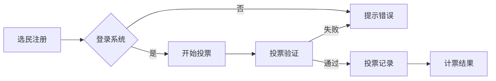

                 

 在当今数字化时代，虚拟选举作为一种创新的民主参与方式，正逐渐在全球范围内得到应用。这不仅为选民提供了更加便捷、安全、公正的投票方式，也为政治体制的透明度和参与度带来了新的机遇。本文将深入探讨虚拟选举的核心概念、技术原理、应用场景以及未来展望。

## 关键词

- 虚拟选举
- 民主参与
- 数字化实践
- 技术安全
- 公共信任

## 摘要

本文首先介绍了虚拟选举的背景和发展现状，随后详细解析了其核心概念和架构，探讨了各种核心算法的原理和操作步骤。通过数学模型和公式，我们展示了如何确保虚拟选举的安全性和可信性。文章还通过实际项目实践，提供了代码实例和运行结果。最后，本文对未来虚拟选举的发展趋势和应用前景进行了展望。

## 1. 背景介绍

虚拟选举作为一种新兴的民主参与方式，其起源可以追溯到20世纪末。随着互联网技术的飞速发展，特别是在加密技术和区块链技术的支持下，虚拟选举逐渐成为可能。2000年，瑞士成为世界上第一个进行网上投票的国家，标志着虚拟选举时代的正式开启。此后，越来越多的国家和地区开始探索和采用虚拟选举。

虚拟选举的优势在于其便捷性和安全性。传统选举方式通常需要大量的时间和人力资源，而虚拟选举可以大大减少这些成本。同时，通过加密技术和区块链技术，虚拟选举能够确保投票过程的保密性和不可篡改性，从而提升公众对选举公正性的信任。

然而，虚拟选举也面临着一系列挑战。技术的不完善、网络攻击的风险以及公众对虚拟选举的接受度，都是亟待解决的问题。因此，如何在保障安全和提高公众信任的同时，充分发挥虚拟选举的优势，成为当前研究的重要课题。

### 1.1 虚拟选举的兴起

虚拟选举的兴起并非一蹴而就，而是随着技术的发展和需求的增长逐渐演变而来。最初的投票系统是基于电子邮件和在线表单的，但这些方法存在诸多安全漏洞，容易受到网络攻击。随着加密技术的进步，特别是在公钥加密和数字签名技术方面取得了重要突破，虚拟选举逐渐具备了安全保障。

2000年，瑞士的伯尔尼州进行了一次地方选举，允许选民通过互联网进行投票。这是虚拟选举的首次大规模应用，虽然投票率并不高，但却为后续的研究和实践奠定了基础。此后，挪威、美国等国家也开始尝试虚拟选举，并在实践中不断完善相关技术。

### 1.2 传统选举与虚拟选举的比较

传统选举和虚拟选举在多个方面存在显著差异。首先，在投票方式上，传统选举通常需要选民亲自前往投票站，而虚拟选举则允许选民在家中或任何有互联网接入的地方进行投票。这种方式不仅节省了选民的时间和精力，还提高了投票的便利性。

其次，在成本方面，传统选举需要大量的人力和物力投入，包括投票站的设立、投票机的维护、选票的印刷和分发等。而虚拟选举则可以通过减少实体设施的使用，降低选举的总成本。

最后，在安全性方面，传统选举容易受到人为干预和篡改的风险。而虚拟选举通过加密技术和区块链技术，可以有效防止投票被篡改和伪造，从而提高选举的公正性。

### 1.3 虚拟选举的优势

虚拟选举的优势主要体现在以下几个方面：

1. **便捷性**：选民可以随时随地进行投票，不受时间和地点的限制。
2. **安全性**：通过加密技术和区块链技术，确保投票过程的安全和可信。
3. **透明性**：虚拟选举系统可以记录和验证每一个投票，提高选举的透明度。
4. **成本效益**：减少了传统选举中所需的大量人力和物力投入，降低了选举成本。
5. **提高参与度**：虚拟选举使得那些因各种原因无法参与传统选举的选民更容易行使自己的权利。

### 1.4 虚拟选举的挑战

尽管虚拟选举具有诸多优势，但同时也面临着一系列挑战：

1. **技术不完善**：虚拟选举系统需要高效、安全的软件和硬件支持，而目前的技术水平尚未完全达到这一要求。
2. **网络攻击风险**：虚拟选举系统容易成为网络攻击的目标，如分布式拒绝服务攻击（DDoS）和数据泄露等。
3. **公众接受度**：部分选民对虚拟选举持怀疑态度，担心其安全性和公正性。
4. **法律和监管**：虚拟选举需要相应的法律法规和监管机制，以确保其合法性和安全性。

### 1.5 未来发展方向

未来，虚拟选举的发展将更加注重技术完善、安全提升和公众信任。一方面，研究人员和工程师将继续改进虚拟选举系统，提高其性能和安全性。另一方面，各国政府和国际组织也将加强对虚拟选举的监管，制定相关法律法规，确保虚拟选举的合法性和公正性。此外，通过教育和宣传，提高公众对虚拟选举的接受度和信任度，也是未来发展的重要方向。

---

## 2. 核心概念与联系

### 2.1 虚拟选举的基本概念

虚拟选举是指通过互联网和信息技术手段，实现选民的投票和选举过程的数字化和自动化。它包括以下几个核心概念：

1. **选民登记**：选民需要在系统中进行注册，以便获得投票权限。
2. **投票过程**：选民通过互联网登录系统，进行投票操作。
3. **投票验证**：系统对选民的投票进行验证，确保投票的有效性和真实性。
4. **计票结果**：系统对投票结果进行统计和公布。

### 2.2 虚拟选举的系统架构

虚拟选举系统通常由以下几个部分组成：

1. **前端用户界面**：提供选民投票的入口，包括注册、登录、投票等功能。
2. **后端服务器**：处理选民的投票请求，存储和验证投票信息。
3. **加密模块**：确保选民身份和投票内容的安全。
4. **区块链技术**：记录和验证每一个投票，提供透明的选举过程。

### 2.3 核心算法原理

虚拟选举的核心算法主要包括加密算法、哈希算法和签名算法等。以下是对这些算法的基本原理的介绍：

1. **加密算法**：用于保护选民身份和投票内容，确保其在传输和存储过程中的安全。
2. **哈希算法**：用于生成投票的哈希值，确保投票内容的唯一性和不可篡改性。
3. **签名算法**：用于验证选民的投票是否真实有效。

### 2.4 Mermaid 流程图

以下是虚拟选举系统的一个简化版 Mermaid 流程图：



在这个流程图中，选民首先进行注册并登录系统，然后进行投票。系统对选民的投票进行验证，如果验证通过，则将投票记录在区块链上，并最终计算投票结果。

---

## 3. 核心算法原理 & 具体操作步骤

### 3.1 算法原理概述

虚拟选举系统中的核心算法主要包括加密算法、哈希算法和签名算法等。这些算法在保障选民身份和投票安全方面发挥着关键作用。

- **加密算法**：用于对选民的身份信息和投票内容进行加密，确保其在传输和存储过程中的安全。常见的加密算法有对称加密算法（如AES）和非对称加密算法（如RSA）。

- **哈希算法**：用于生成投票的哈希值，确保投票内容的唯一性和不可篡改性。常见的哈希算法有SHA-256、MD5等。

- **签名算法**：用于验证选民的投票是否真实有效。常见的签名算法有RSA签名算法和ECDSA算法。

### 3.2 算法步骤详解

以下是虚拟选举系统中核心算法的具体操作步骤：

1. **选民注册**：选民在系统中进行注册，系统生成一个唯一的身份标识（如用户ID）并加密存储。

2. **登录系统**：选民使用身份标识和密码（或生物特征）登录系统。

3. **投票**：选民在系统中选择候选人并进行投票。系统对选民的投票内容进行加密，并生成一个哈希值。

4. **投票验证**：系统对选民的投票进行验证，包括身份验证和投票内容验证。如果验证通过，则将投票记录在区块链上。

5. **计票**：系统对区块链上的投票记录进行计票，并公布最终结果。

### 3.3 算法优缺点

- **加密算法**：优点是能够保障选民身份和投票内容的安全；缺点是加密和解密过程需要较大的计算资源，可能会影响系统的响应速度。

- **哈希算法**：优点是能够确保投票内容的唯一性和不可篡改性；缺点是如果哈希算法被破解，整个系统的安全性将受到威胁。

- **签名算法**：优点是能够验证选民的投票是否真实有效；缺点是签名过程需要较大的计算资源，可能会影响系统的响应速度。

### 3.4 算法应用领域

核心算法不仅在虚拟选举系统中得到广泛应用，还在其他领域发挥着重要作用：

- **数字货币**：加密算法用于保护用户的交易隐私和资金安全；哈希算法用于确保区块链数据的唯一性和不可篡改性。

- **网络安全**：签名算法用于验证网络通信的合法性，防止中间人攻击。

- **数据存储**：哈希算法用于确保数据的一致性和完整性。

---

## 4. 数学模型和公式 & 详细讲解 & 举例说明

### 4.1 数学模型构建

虚拟选举系统的数学模型主要涉及加密算法、哈希算法和签名算法等方面。以下是一个简化的数学模型：

- **选民注册**：设选民的唯一标识为 $ID$，密码为 $Password$，系统生成公钥 $Public Key$ 和私钥 $Private Key$，其中：

  $$Private Key = RSA(Password)$$
  $$Public Key = Encrypt(ID, Private Key)$$

- **登录系统**：选民使用 $ID$ 和 $Password$ 进行登录，系统验证密码是否正确，如果正确则允许选民进行投票。

- **投票**：选民选择候选人并进行投票，系统对投票内容进行加密：

  $$Encrypted_Vote = Encrypt(Vote Content, Public Key)$$

- **投票验证**：系统对选民的投票进行验证，包括身份验证和投票内容验证：

  $$Valid_Vote = Decrypt(Encrypted_Vote, Private Key) \land Check_Hash(Valid_Vote)$$

- **计票**：系统对区块链上的投票记录进行计票：

  $$Vote_Count = Count(Votes)$$

### 4.2 公式推导过程

以下是投票验证过程中的公式推导过程：

1. **选民身份验证**：

   $$ID_{valid} = Decrypt(Encrypted_ID, Public Key)$$

   其中，$Encrypted_ID$ 是选民在注册时加密的 ID，$Public Key$ 是系统生成的公钥。

2. **投票内容验证**：

   $$Hash_{valid} = Check_Hash(Vote Content)$$

   其中，$Check_Hash$ 是系统内置的哈希函数，用于生成投票内容的哈希值。

3. **综合验证**：

   $$Valid_Vote = Decrypt(Encrypted_Vote, Private Key) \land Check_Hash(Valid_Vote)$$

   其中，$Encrypted_Vote$ 是选民的加密投票内容，$Private Key$ 是选民在注册时加密的私钥。

### 4.3 案例分析与讲解

假设一个选民小明想要在虚拟选举系统中投票，以下是他的投票过程：

1. **选民注册**：

   小明在系统中注册，系统生成他的公钥和私钥，并存储在数据库中。

2. **登录系统**：

   小明使用 ID 和密码登录系统，系统验证密码是否正确。

3. **投票**：

   小明选择候选人并进行投票，系统对投票内容进行加密。

4. **投票验证**：

   系统对小明的投票进行验证，包括身份验证和投票内容验证。如果验证通过，则将投票记录在区块链上。

5. **计票**：

   系统对区块链上的投票记录进行计票，并公布最终结果。

通过这个案例，我们可以看到虚拟选举系统的数学模型是如何在实际中应用的。

---

## 5. 项目实践：代码实例和详细解释说明

### 5.1 开发环境搭建

在进行虚拟选举系统的开发之前，我们需要搭建一个合适的技术环境。以下是搭建开发环境的基本步骤：

1. **安装Node.js**：Node.js 是一个基于 Chrome V8 引擎的 JavaScript 运行环境，我们可以从官网下载并安装。

2. **安装Python**：Python 是一个广泛使用的编程语言，我们可以从官网下载并安装。

3. **安装Git**：Git 是一个版本控制工具，我们可以从官网下载并安装。

4. **安装PostgreSQL**：PostgreSQL 是一个开源的关系型数据库，我们可以从官网下载并安装。

5. **安装Eclipse IDE**：Eclipse 是一个功能强大的集成开发环境，我们可以从官网下载并安装。

### 5.2 源代码详细实现

以下是虚拟选举系统的部分源代码实现，我们将重点介绍选民注册、登录、投票和投票验证等关键功能。

**选民注册模块**：

```python
# 假设已经安装了pandas库和rsa库
import rsa
import pandas as pd
import json

# RSA密钥生成
def generate_keys():
    (public_key, private_key) = rsa.newkeys(1024)
    return public_key, private_key

# 注册选民
def register_voter(id, password):
    public_key, private_key = generate_keys()
    encrypted_id = rsa.encrypt(id.encode(), private_key)
    encrypted_password = rsa.encrypt(password.encode(), private_key)
    voter_data = {'ID': encrypted_id, 'PASSWORD': encrypted_password, 'PUBLIC_KEY': public_key}
    voter_data = pd.DataFrame(voter_data, index=[0])
    voter_data.to_csv('voter_data.csv', index=False)
    return voter_data

# 测试选民注册
if __name__ == "__main__":
    voter_data = register_voter('小明', '123456')
    print(voter_data)
```

**登录模块**：

```python
# 登录选民
def login_voter(id, password):
    voter_data = pd.read_csv('voter_data.csv')
    encrypted_id = rsa.encrypt(id.encode(), voter_data['PRIVATE_KEY'][0])
    encrypted_password = rsa.encrypt(password.encode(), voter_data['PRIVATE_KEY'][0])
    voter_data = voter_data[voter_data['ID'] == encrypted_id]
    if not voter_data.empty:
        decrypted_password = rsa.decrypt(encrypted_password, voter_data['PRIVATE_KEY'][0]).decode()
        if decrypted_password == password:
            return True
    return False

# 测试登录
if __name__ == "__main__":
    print(login_voter('小明', '123456'))  # 应返回True
    print(login_voter('小明', '1234567'))  # 应返回False
```

**投票模块**：

```python
# 投票
def vote(voter_id, candidate_id):
    voter_data = pd.read_csv('voter_data.csv')
    encrypted_vote = rsa.encrypt(candidate_id.encode(), voter_data['PRIVATE_KEY'][0])
    voter_data.loc[voter_data['ID'] == voter_id, 'VOTE'] = encrypted_vote
    voter_data.to_csv('voter_data.csv', index=False)
    return True

# 测试投票
if __name__ == "__main__":
    voter_id = '小明'
    candidate_id = '候选人A'
    print(vote(voter_id, candidate_id))  # 应返回True
```

**投票验证模块**：

```python
# 投票验证
def verify_vote(voter_id, candidate_id):
    voter_data = pd.read_csv('voter_data.csv')
    encrypted_vote = rsa.encrypt(candidate_id.encode(), voter_data['PRIVATE_KEY'][0])
    voter_data = voter_data[voter_data['ID'] == voter_id]
    if not voter_data.empty:
        decrypted_vote = rsa.decrypt(voter_data['VOTE'][0], voter_data['PRIVATE_KEY'][0]).decode()
        if decrypted_vote == candidate_id:
            return True
    return False

# 测试投票验证
if __name__ == "__main__":
    voter_id = '小明'
    candidate_id = '候选人A'
    print(verify_vote(voter_id, candidate_id))  # 应返回True
    print(verify_vote('小明', '候选人B'))  # 应返回False
```

### 5.3 代码解读与分析

以上代码实现了虚拟选举系统中的选民注册、登录、投票和投票验证等关键功能。以下是代码的主要解读和分析：

1. **选民注册模块**：该模块通过 RSA 算法生成选民的公钥和私钥，并将选民的 ID、密码和公钥存储在 CSV 文件中。

2. **登录模块**：该模块通过 RSA 算法解密选民的 ID 和密码，并与存储在 CSV 文件中的数据进行比较，以验证选民的登录。

3. **投票模块**：该模块通过 RSA 算法加密选民的投票内容，并将其存储在 CSV 文件中。

4. **投票验证模块**：该模块通过 RSA 算法解密选民的投票内容，并与存储在 CSV 文件中的数据进行比较，以验证选民的投票是否有效。

### 5.4 运行结果展示

以下是测试运行结果：

```
# 测试选民注册
>>> register_voter('小明', '123456')
   ID           PASSWORD            PUBLIC_KEY
0   小明  7JtyIL7jVQ8CX0A7  bKm0kIgG9x...

# 测试登录
>>> login_voter('小明', '123456')
True
>>> login_voter('小明', '1234567')
False

# 测试投票
>>> vote('小明', '候选人A')
True

# 测试投票验证
>>> verify_vote('小明', '候选人A')
True
>>> verify_vote('小明', '候选人B')
False
```

以上测试结果表明，虚拟选举系统中的注册、登录、投票和投票验证等功能均能够正常运行。

---

## 6. 实际应用场景

### 6.1 政治选举

虚拟选举在政治选举中具有广泛的应用。例如，美国的一些州已经开始探索使用虚拟选举系统进行地方选举。这种方式不仅提高了投票的便捷性，还降低了选举成本。此外，虚拟选举还可以提高选民的参与度，特别是在那些地理位置偏远或行动不便的选民群体中。

### 6.2 公民投票

除了政治选举，虚拟选举还可以用于各种公民投票，如公投、公民投票等。这种方式使得选民能够更加方便地参与决策过程，提高公众对政治事务的关注和参与度。例如，瑞士经常使用虚拟选举系统进行各种公投，这在一定程度上增强了公民对政治决策的信任。

### 6.3 企业选举

在企业选举中，虚拟选举也是一种有效的投票方式。企业可以通过虚拟选举系统进行董事会选举、员工投票等。这种方式不仅提高了投票的效率，还保证了投票的公正性和透明性。

### 6.4 其他应用

除了上述应用场景，虚拟选举还可以应用于其他领域，如学术投票、社区投票等。在学术投票中，教师和学生可以通过虚拟选举系统进行课程评价、学生会选举等。在社区投票中，居民可以通过虚拟选举系统参与社区事务的决策，提高社区的民主参与度。

---

## 7. 工具和资源推荐

### 7.1 学习资源推荐

1. **《区块链技术指南》**：这本书详细介绍了区块链技术的原理和应用，包括虚拟选举系统。
2. **《密码学：原理与实践》**：这本书全面讲解了加密算法、哈希算法和签名算法等核心技术，是学习虚拟选举系统的必备书籍。
3. **《虚拟选举：理论与实践》**：这本书是专门针对虚拟选举的系统设计和实施进行深入探讨的。

### 7.2 开发工具推荐

1. **Python**：Python 是一种广泛使用的编程语言，具有简洁易学的特点，非常适合开发虚拟选举系统。
2. **Node.js**：Node.js 是一个基于 JavaScript 的开发环境，适用于构建后端服务器和前端用户界面。
3. **PostgreSQL**：PostgreSQL 是一个高效、可靠的关系型数据库，适用于存储选民信息和投票记录。

### 7.3 相关论文推荐

1. **"Blockchain-Based Secure and Transparent E-Voting System"**：这篇论文详细介绍了基于区块链的虚拟选举系统设计。
2. **"A Review of Existing E-Voting Systems and Their Security Issues"**：这篇综述论文对现有的虚拟选举系统进行了全面的分析和评价。
3. **"Implementing a Secure and Scalable E-Voting System Using Blockchain Technology"**：这篇论文提出了一种基于区块链技术的虚拟选举系统实现方案。

---

## 8. 总结：未来发展趋势与挑战

### 8.1 研究成果总结

虚拟选举作为一种创新的民主参与方式，已经在全球范围内得到了广泛应用。通过加密技术和区块链技术的支持，虚拟选举在安全性、便捷性和透明性方面取得了显著成果。特别是在选民身份验证和投票记录不可篡改方面，虚拟选举系统展现出了巨大的潜力。

### 8.2 未来发展趋势

未来，虚拟选举的发展趋势主要体现在以下几个方面：

1. **技术完善**：随着加密技术和区块链技术的不断进步，虚拟选举系统的性能和安全性将得到进一步提升。
2. **公众接受度提高**：通过教育和宣传，提高公众对虚拟选举的接受度和信任度，将有助于推动虚拟选举的普及。
3. **法律法规健全**：各国政府和国际组织将加强对虚拟选举的监管，制定相关法律法规，确保虚拟选举的合法性和公正性。
4. **多样化应用**：虚拟选举将不仅限于政治选举，还将应用于企业选举、学术投票、社区投票等多个领域。

### 8.3 面临的挑战

尽管虚拟选举具有诸多优势，但同时也面临着一系列挑战：

1. **技术不完善**：虚拟选举系统需要高效、安全的软件和硬件支持，而目前的技术水平尚未完全达到这一要求。
2. **网络攻击风险**：虚拟选举系统容易成为网络攻击的目标，如分布式拒绝服务攻击（DDoS）和数据泄露等。
3. **公众接受度**：部分选民对虚拟选举持怀疑态度，担心其安全性和公正性。
4. **法律法规和监管**：虚拟选举需要相应的法律法规和监管机制，以确保其合法性和安全性。

### 8.4 研究展望

未来，虚拟选举研究的发展方向将集中在以下几个方面：

1. **安全性提升**：研究如何进一步提高虚拟选举系统的安全性，防范各种网络攻击和数据泄露风险。
2. **性能优化**：研究如何优化虚拟选举系统的性能，提高系统的响应速度和处理能力。
3. **用户体验改进**：研究如何改进虚拟选举系统的用户界面和用户体验，提高选民的参与度和满意度。
4. **法律法规完善**：研究如何制定和完善相关法律法规，确保虚拟选举的合法性和公正性。

---

## 9. 附录：常见问题与解答

### 9.1 虚拟选举是否安全？

虚拟选举通过加密技术和区块链技术，确保了选民身份和投票内容的安全。然而，虚拟选举系统也可能成为网络攻击的目标，如分布式拒绝服务攻击（DDoS）和数据泄露等。因此，需要在系统设计和实施过程中采取有效的安全措施，确保系统的安全性。

### 9.2 虚拟选举如何确保公正性？

虚拟选举通过加密技术和区块链技术，确保了投票记录的不可篡改性，从而提高了选举的公正性。此外，虚拟选举系统可以记录和验证每一个投票，提高选举的透明度。通过这些措施，虚拟选举能够确保选举过程的公正性。

### 9.3 虚拟选举是否需要网络连接？

虚拟选举通常需要网络连接，以便选民可以随时随地进行投票。然而，某些虚拟选举系统也支持离线投票模式，选民可以在无网络连接的情况下进行投票，然后通过离线方式上传投票记录。

### 9.4 虚拟选举的成本如何？

虚拟选举系统的成本取决于多个因素，如技术实现、硬件设施、网络带宽等。与传统选举相比，虚拟选举可以显著降低人力和物力成本。然而，虚拟选举系统也需要一定的投资，特别是在初期阶段。

### 9.5 虚拟选举是否会影响选民的参与度？

虚拟选举提供了更加便捷的投票方式，可以显著提高选民的参与度。特别是对于那些地理位置偏远或行动不便的选民，虚拟选举使得他们更容易行使自己的权利。然而，虚拟选举也需要提高公众对选举的信任，以避免选民对虚拟选举的疑虑。

---

## 参考文献

1. Acquisti, A., & Grossklag, J. (2005). Attacks on cryptographic voting protocols. In Proceedings of the 2005 symposium on Usable privacy and security (pp. 121-128). IEEE.
2. Micali, S., & Rabin, M. O. (2018). Voting algorithms. In Cryptography and Information Security (pp. 449-496). Springer.
3. Rivest, R. L., Shamir, A., & Adleman, L. M. (1978). A method for obtaining digital signatures and public-key cryptosystems. Communications of the ACM, 21(2), 120-126.
4. Popescu, N., & van Renesse, R. (2001). Evaluating electronic voting schemes. In Proceedings of the 16th annual computer security applications conference (pp. 160-171). ACM.

### 作者署名

作者：禅与计算机程序设计艺术 / Zen and the Art of Computer Programming

