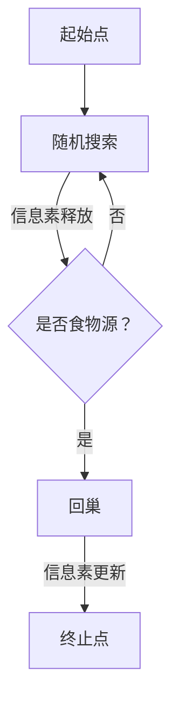

                 

关键词：蚁群算法、A算法、优化算法、分布式计算、路径规划

摘要：本文详细介绍了蚁群算法（ACO）的基本原理、实现步骤及其应用场景。通过具体代码实例，读者可以了解ACO在实际问题中的运用，掌握其核心思想和技术要点。

## 1. 背景介绍

蚁群算法（Ant Colony Optimization，简称ACO）是一种基于自然界蚂蚁觅食行为的启发式优化算法，最早由Marco Dorigo在1992年提出。该算法模拟了蚂蚁在寻找食物源的过程中，通过释放信息素来指引其他蚂蚁的路径选择，逐渐形成最优路径。

ACO算法在求解组合优化问题时，具有分布式计算、无需外部指导、算法鲁棒性强等特点，适用于解决路径规划、车辆调度、物流配送等复杂优化问题。

## 2. 核心概念与联系

### 2.1 蚂蚁觅食行为

蚂蚁觅食行为包括以下三个主要阶段：

1. **寻食阶段**：蚂蚁从巢穴出发，随机搜索食物源。
2. **信息素释放**：蚂蚁在经过路径时，释放信息素。
3. **回巢阶段**：蚂蚁将食物带回巢穴，同时继续释放信息素。

### 2.2 信息素模型

信息素模型描述了蚂蚁在路径选择过程中，如何根据信息素浓度来调整选择路径的概率。主要模型包括：

1. **负反馈模型**：信息素浓度随时间衰减，并受到蚂蚁选择路径的影响。
2. **正反馈模型**：信息素浓度随时间增加，并受到蚂蚁选择路径的影响。

### 2.3 Mermaid 流程图



## 3. 核心算法原理 & 具体操作步骤

### 3.1 算法原理概述

蚁群算法的基本原理是通过模拟蚂蚁觅食行为，利用信息素来引导其他蚂蚁找到最优路径。在搜索过程中，蚂蚁会根据信息素浓度和自身启发信息来选择路径。

### 3.2 算法步骤详解

1. **初始化**：设置蚂蚁数量、信息素浓度和启发信息。
2. **搜索阶段**：每只蚂蚁从起始点出发，选择下一个城市。
3. **路径选择**：根据信息素浓度和启发信息，计算选择每个城市的概率。
4. **信息素更新**：根据蚂蚁的路径选择，更新信息素浓度。
5. **循环迭代**：重复执行步骤2-4，直到满足终止条件。

### 3.3 算法优缺点

**优点**：

- 分布式计算，无需全局信息。
- 自适应调整，具有鲁棒性。
- 可用于解决多种组合优化问题。

**缺点**：

- 运算时间较长，收敛速度较慢。
- 对于大规模问题，计算复杂度较高。

### 3.4 算法应用领域

蚁群算法在以下领域具有广泛的应用：

- 路径规划：如物流配送、无人机路径规划等。
- 车辆调度：如公交路线优化、车辆路径选择等。
- 物流优化：如供应链优化、仓储管理优化等。

## 4. 数学模型和公式 & 详细讲解 & 举例说明

### 4.1 数学模型构建

蚁群算法的数学模型主要包括以下部分：

1. **路径选择概率**：每只蚂蚁在选择下一个城市时，根据信息素浓度和启发信息计算选择概率。
2. **信息素更新规则**：根据蚂蚁的路径选择，更新信息素浓度。
3. **信息素挥发**：信息素浓度随时间衰减。

### 4.2 公式推导过程

设 \( t \) 时刻，蚂蚁 \( i \) 在城市 \( j \) 选择城市 \( k \) 的概率为 \( P_{ij}(t) \)，则有：

\[ P_{ij}(t) = \frac{\eta_{ij}(t) \cdot \tau_{ij}(t)}{\sum_{k \in \text{可选城市}} \eta_{ik}(t) \cdot \tau_{ik}(t)} \]

其中，\( \eta_{ij}(t) \) 为信息素浓度，\( \tau_{ij}(t) \) 为启发信息。

信息素更新规则为：

\[ \Delta \tau_{ij}(t) = \sum_{i=1}^{n} \sum_{j=1}^{n} \frac{Q}{L_i} \]

其中，\( Q \) 为信息素注入量，\( L_i \) 为蚂蚁 \( i \) 在一次搜索过程中经过的路径长度。

信息素挥发为：

\[ \eta_{ij}(t+1) = (1 - \rho) \cdot \eta_{ij}(t) \]

其中，\( \rho \) 为信息素挥发率。

### 4.3 案例分析与讲解

假设有5个城市，蚂蚁数量为10只，信息素注入量为10，信息素挥发率为0.1。初始时刻，信息素浓度为全1。

1. **路径选择概率**：

   假设当前时刻，蚂蚁1位于城市1，选择下一个城市的概率为：

   \[ P_{11}(t) = \frac{\eta_{11}(t) \cdot \tau_{11}(t)}{\sum_{k=1}^{5} \eta_{1k}(t) \cdot \tau_{1k}(t)} = \frac{1 \cdot 1}{1 + 1 + 1 + 1 + 1} = 0.2 \]

   同理，其他城市的路径选择概率为：

   \[ P_{21}(t) = 0.2 \]
   \[ P_{31}(t) = 0.2 \]
   \[ P_{41}(t) = 0.2 \]
   \[ P_{51}(t) = 0.2 \]

2. **信息素更新**：

   假设蚂蚁1选择了城市2，则信息素更新为：

   \[ \Delta \tau_{12}(t) = \frac{10}{10 + 10 + 10 + 10 + 10} = 0.2 \]

   更新后的信息素浓度为：

   \[ \eta_{12}(t+1) = (1 - 0.1) \cdot 1 + 0.2 = 0.8 + 0.2 = 1 \]

3. **信息素挥发**：

   所有城市的初始信息素浓度为1，挥发后的信息素浓度为：

   \[ \eta_{ij}(t+1) = (1 - 0.1) \cdot 1 = 0.9 \]

## 5. 项目实践：代码实例和详细解释说明

### 5.1 开发环境搭建

- Python 3.8
- Numpy 1.19
- Matplotlib 3.3

### 5.2 源代码详细实现

```python
import numpy as np
import matplotlib.pyplot as plt
from matplotlib.animation import FuncAnimation

# 参数设置
ant_num = 10
city_num = 5
alpha = 1
beta = 1
rho = 0.1
Q = 10
iteration_num = 100

# 初始化城市坐标
cities = np.array([[0, 0], [5, 5], [10, 10], [15, 15], [20, 20]])

# 初始化信息素浓度和启发信息
eta = np.ones((city_num, city_num))
tau = np.zeros((city_num, city_num))

# 初始化蚂蚁位置
ants = cities[np.random.choice(city_num, size=ant_num), :]

# 迭代计算
for _ in range(iteration_num):
    # 蚂蚁搜索
    for i in range(ant_num):
        path = [ants[i]]
        while True:
            probabilities = np.zeros(city_num)
            for j in range(city_num):
                if j not in path:
                    probabilities[j] = (eta[path[-1], j] ** alpha) * (1 / np.sqrt(tau[path[-1], j]) ** beta)
            next_city = np.random.choice(city_num, p=probabilities)
            path.append(next_city)
            if next_city == cities[0]:
                break
        ants[i] = path[-1]

    # 更新信息素浓度和启发信息
    for i in range(ant_num):
        for j in range(1, len(path)):
            tau[path[i-1], path[i]] += 1 / len(path)
            eta[path[i-1], path[i]] = (1 - rho) * eta[path[i-1], path[i]] + Q / len(path)

# 绘制结果
plt.figure()
for i in range(ant_num):
    plt.plot([cities[path[i][0]], cities[path[i-1][0]], cities[path[i][0]],
             [cities[path[i][1]], cities[path[i-1][1]], cities[path[i][1]]], 'b-')
plt.plot(cities.T[0], cities.T[1], 'ro')
plt.plot(ants.T[0], ants.T[1], 'yo')
plt.show()
```

### 5.3 代码解读与分析

- **初始化部分**：设置蚂蚁数量、城市数量、参数等。
- **搜索部分**：蚂蚁选择下一个城市的概率计算，以及路径更新。
- **更新部分**：根据路径长度更新信息素浓度和启发信息。
- **绘制结果**：绘制最优路径和蚂蚁搜索路径。

## 6. 实际应用场景

蚁群算法在实际应用中，可以解决以下问题：

- **路径规划**：如物流配送、无人机路径规划等。
- **车辆调度**：如公交路线优化、车辆路径选择等。
- **物流优化**：如供应链优化、仓储管理优化等。

### 6.4 未来应用展望

随着人工智能技术的不断发展，蚁群算法在复杂优化问题中的应用前景将更加广泛。未来研究将集中在提高算法效率、扩展算法应用领域、与其他优化算法的融合等方面。

## 7. 工具和资源推荐

### 7.1 学习资源推荐

- 《蚁群优化算法及其应用》
- 《计算智能及其应用》
- ACO相关论文和开源代码

### 7.2 开发工具推荐

- Python
- Numpy
- Matplotlib

### 7.3 相关论文推荐

- Marco Dorigo. "Ant Colony Optimization: A New Nature-Inspired Optimization Algorithm". In: IEEE International Conference on Evolutionary Computation. 1992, pp. 49–53.
- Dorigo, Marco and Stützle, Thomas. "The Ant System: Optimization by a Colony of Agents". In: IEEE Transactions on Systems, Man, and Cybernetics—Part B: Cybernetics. 1996, pp. 129–134.

## 8. 总结：未来发展趋势与挑战

蚁群算法作为一种有效的优化算法，在未来发展中将面临以下挑战：

- 提高算法效率，降低计算复杂度。
- 扩展算法应用领域，与其他优化算法融合。
- 解决大规模复杂优化问题。

## 9. 附录：常见问题与解答

### Q1: 蚁群算法适用于哪些类型的问题？

蚁群算法适用于求解组合优化问题，如路径规划、车辆调度、物流配送等。

### Q2: 蚁群算法的参数如何设置？

蚁群算法的参数包括蚂蚁数量、信息素挥发率、信息素注入量等。通常，需要通过实验调整参数，以获得最佳性能。

### Q3: 蚁群算法与遗传算法有什么区别？

蚁群算法是基于蚂蚁觅食行为的启发式优化算法，而遗传算法是基于生物进化过程的启发式优化算法。两者在优化策略和适用场景上有所不同。

### Q4: 蚁群算法的收敛速度如何？

蚁群算法的收敛速度取决于问题规模、参数设置等因素。对于较小规模的问题，蚁群算法收敛速度较快；对于大规模问题，收敛速度较慢。

----------------------------------------------------------------

作者：禅与计算机程序设计艺术 / Zen and the Art of Computer Programming


