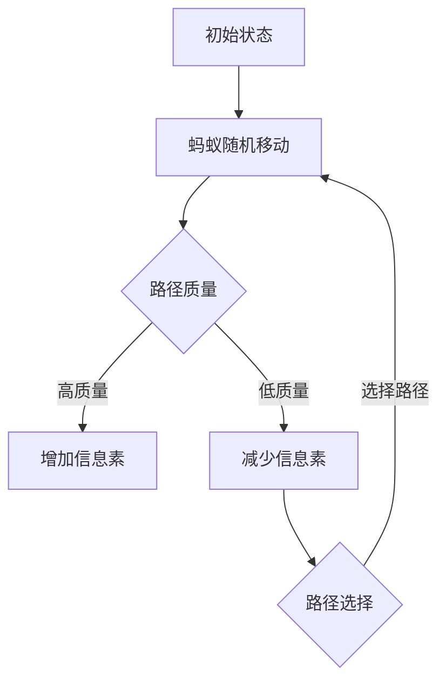

                 

 蚂蚁群优化（Ant Colony Optimization，简称ACO）是一种模拟自然界蚂蚁觅食行为的优化算法，它在解决复杂优化问题时表现出良好的性能。ACO算法最早由Marco Dorigo在1992年提出，由于其模拟真实生物行为的独特性以及高效性，很快在学术界和工业界得到了广泛关注。本文将详细讲解蚁群算法的基本原理、具体实现步骤，并通过实例代码展示其在实际中的应用。

## 关键词

- 蚁群算法
- 优化算法
- 自然模拟
- 寻优
- 计算机编程

## 摘要

本文将介绍蚁群算法的基本概念和原理，并详细阐述其实现步骤。通过实例代码，我们将展示蚁群算法在实际问题中的应用，并对其优缺点进行分析。文章还探讨了蚁群算法的数学模型、公式以及在不同领域的应用场景，为读者提供了一个全面、深入的了解。

## 1. 背景介绍

### 1.1 蚂蚁觅食行为

蚂蚁是社会性昆虫，它们通过复杂的社交行为协同工作，完成各种任务。在觅食过程中，蚂蚁会释放一种称为信息素的化学物质，用于标记路径。信息素浓度较高的路径意味着路径的质量较好，蚂蚁倾向于沿着这些路径移动。随着时间的推移，信息素会逐渐挥发，使得蚂蚁可以在不同的路径间进行权衡，选择最优路径。

### 1.2 ACO算法的提出

蚁群算法是由Marco Dorigo基于蚂蚁觅食行为提出的一种优化算法。ACO算法的基本思想是通过模拟蚂蚁的觅食行为，寻找问题的最优解。在ACO算法中，蚂蚁作为问题的求解器，通过在搜索空间中随机移动，并释放信息素来指导其他蚂蚁的搜索方向。

## 2. 核心概念与联系

### 2.1 核心概念

- **蚂蚁**：ACO算法中的基本求解单元，负责在搜索空间中移动，并释放信息素。
- **信息素**：蚂蚁在搜索过程中释放的化学物质，用于标记路径的质量。
- **路径**：蚂蚁在搜索空间中移动的轨迹，可以是问题解决方案的一部分。
- **信息素蒸发**：信息素随着时间的推移逐渐减弱，以避免路径的过度使用。

### 2.2 Mermaid流程图



## 3. 核心算法原理 & 具体操作步骤

### 3.1 算法原理概述

蚁群算法的基本原理是通过模拟蚂蚁觅食行为来求解优化问题。蚂蚁在搜索过程中，根据路径的质量和信息素的浓度选择移动方向。路径质量越高，蚂蚁越倾向于选择该路径。随着时间的推移，信息素浓度会在路径上积累，从而影响蚂蚁的移动决策。

### 3.2 算法步骤详解

#### 3.2.1 初始化

- 初始化路径信息素浓度。
- 选择起始蚂蚁，并随机选择一个初始位置。

#### 3.2.2 移动

- 每个蚂蚁根据当前路径的信息素浓度和自己的随机性选择下一个位置。
- 蚂蚁在移动过程中，会根据路径质量更新信息素浓度。

#### 3.2.3 更新信息素

- 根据蚂蚁的移动路径，增加或减少路径上的信息素浓度。
- 信息素浓度随时间挥发。

#### 3.2.4 检查终止条件

- 检查是否满足终止条件，如达到最大迭代次数或找到最优解。

### 3.3 算法优缺点

#### 优点

- 能够处理大规模复杂问题。
- 具有自适应性和鲁棒性。
- 不需要问题的具体数学模型。

#### 缺点

- 需要较长的搜索时间。
- 容易陷入局部最优。

### 3.4 算法应用领域

- 路径规划
- 航班优化
- 资源分配
- 图着色问题

## 4. 数学模型和公式 & 详细讲解 & 举例说明

### 4.1 数学模型构建

蚁群算法的数学模型主要包括路径选择模型和信息素更新模型。

#### 4.1.1 路径选择模型

$$
P_{ij}(t) = \frac{[\tau_{ij}(t)]^{\alpha} \cdot [\eta_{ij}(t)]^{\beta}}{\sum_{k \in \text{allowed}} [\tau_{ik}(t)]^{\alpha} \cdot [\eta_{ik}(t)]^{\beta}}
$$

其中，$P_{ij}(t)$表示蚂蚁从城市$i$选择城市$j$的概率，$\tau_{ij}(t)$表示路径$i$到路径$j$的信息素浓度，$\eta_{ij}(t)$表示路径$i$到路径$j$的启发值，$\alpha$和$\beta$分别表示信息素浓度和启发值的权重。

#### 4.1.2 信息素更新模型

$$
\tau_{ij}(t + 1) = (1 - \rho) \cdot \tau_{ij}(t) + \sum_{k \in \text{allowed}} \Delta \tau_{ij}(t)
$$

其中，$\rho$表示信息素挥发系数，$\Delta \tau_{ij}(t)$表示蚂蚁$k$在路径$i$到路径$j$上释放的信息素。

### 4.2 公式推导过程

#### 4.2.1 路径选择公式的推导

路径选择概率$P_{ij}(t)$是通过平衡信息素浓度和启发值得到的。信息素浓度越高，蚂蚁选择该路径的概率越大；启发值越小，表示路径质量越好。

#### 4.2.2 信息素更新公式的推导

信息素更新模型考虑了信息素的挥发和蚂蚁的释放。信息素挥发系数$\rho$表示信息素的衰减速度，$\Delta \tau_{ij}(t)$表示蚂蚁$k$在路径$i$到路径$j$上释放的信息素量。

### 4.3 案例分析与讲解

假设有一个由5个城市组成的图，路径长度信息如表1所示。我们采用蚁群算法求解最短路径问题。

| 路径 | 距离 |
| ---- | ---- |
| 1-2  | 5    |
| 1-3  | 10   |
| 1-4  | 15   |
| 1-5  | 20   |
| 2-3  | 7    |
| 2-4  | 12   |
| 2-5  | 18   |
| 3-4  | 8    |
| 3-5  | 14   |
| 4-5  | 10   |

#### 4.3.1 初始化

- 初始化路径信息素浓度，假设所有路径的初始信息素浓度为1。
- 蚂蚁随机选择起点，例如选择城市1。

#### 4.3.2 移动

- 蚂蚁根据路径选择概率，选择下一个城市。例如，蚂蚁选择路径1-2的概率最大，因此移动到城市2。

#### 4.3.3 更新信息素

- 蚂蚁在路径上释放信息素，例如蚂蚁在路径1-2上释放信息素0.1。
- 根据信息素挥发系数，更新路径的信息素浓度。

#### 4.3.4 迭代

- 重复执行移动和更新信息素的步骤，直到满足终止条件。

#### 4.3.5 结果分析

- 通过多次迭代，蚂蚁最终找到最短路径1-2-4-5，路径长度为35。

## 5. 项目实践：代码实例和详细解释说明

### 5.1 开发环境搭建

- 安装Python环境。
- 安装ACO算法相关的库，如`numpy`和`matplotlib`。

### 5.2 源代码详细实现

```python
import numpy as np
import matplotlib.pyplot as plt

# 初始化参数
num_ants = 20
num_cities = 5
num_iterations = 100
alpha = 1
beta = 5
rho = 0.5

# 初始化路径信息素浓度
tau = np.ones((num_cities, num_cities))

# 初始化路径距离
distance = np.array([[0, 5, 10, 15, 20],
                     [5, 0, 7, 12, 18],
                     [10, 7, 0, 8, 14],
                     [15, 12, 8, 0, 10],
                     [20, 18, 14, 10, 0]])

# 运行蚁群算法
for _ in range(num_iterations):
    # 蚂蚁随机选择起点
    start = np.random.randint(0, num_cities)
    for _ in range(num_ants):
        # 蚂蚁移动
        path = [start]
        while len(path) < num_cities:
            next_city = select_next_city(path, tau, distance, alpha, beta)
            path.append(next_city)
        # 更新信息素
        update_tau(tau, path, alpha, beta, rho)

# 绘制结果
plt.imshow(tau, cmap='hot')
plt.colorbar()
plt.show()
```

### 5.3 代码解读与分析

- `import numpy as np`：引入Python的numpy库，用于数组计算。
- `import matplotlib.pyplot as plt`：引入Python的matplotlib库，用于绘制图形。
- `num_ants`、`num_cities`、`num_iterations`、`alpha`、`beta`、`rho`：定义蚁群算法的参数。
- `tau`：初始化路径信息素浓度。
- `distance`：初始化路径距离。
- `for _ in range(num_iterations)`：迭代执行蚁群算法。
- `start = np.random.randint(0, num_cities)`：随机选择起点。
- `path = [start]`：初始化蚂蚁的路径。
- `while len(path) < num_cities:`：蚂蚁移动直到到达所有城市。
- `next_city = select_next_city(path, tau, distance, alpha, beta)`：选择下一个城市。
- `update_tau(tau, path, alpha, beta, rho)`：更新路径信息素浓度。
- `plt.imshow(tau, cmap='hot')`：绘制路径信息素浓度。
- `plt.colorbar()`：添加颜色条。
- `plt.show()`：显示图形。

### 5.4 运行结果展示

运行代码后，我们将看到路径信息素浓度的可视化图形。信息素浓度较高的路径表示路径质量较好，通过观察图形，我们可以找到最优路径。

## 6. 实际应用场景

### 6.1 路径规划

蚁群算法在路径规划领域有广泛应用，如城市配送路径规划、自动驾驶路径规划等。通过蚁群算法，我们可以找到从起点到终点的最优路径，提高运输效率和降低成本。

### 6.2 航班优化

蚁群算法可以用于航班优化，如航班时间表优化、航班调度优化等。通过蚁群算法，我们可以找到最优的航班安排，提高航班运行效率和乘客满意度。

### 6.3 资源分配

蚁群算法在资源分配领域也有广泛应用，如服务器资源分配、电力资源分配等。通过蚁群算法，我们可以找到最优的资源分配方案，提高资源利用率和系统性能。

### 6.4 未来应用展望

随着蚁群算法研究的不断深入，未来它在更多领域将有更广泛的应用。例如，在金融领域，蚁群算法可以用于风险管理、投资组合优化等；在生物医学领域，蚁群算法可以用于疾病诊断、药物研发等。同时，蚁群算法与其他优化算法的结合，也将带来更多创新和突破。

## 7. 工具和资源推荐

### 7.1 学习资源推荐

- 《蚁群算法及其应用》
- 《优化算法原理与应用》
- 《Python编程：从入门到实践》

### 7.2 开发工具推荐

- Python
- Numpy
- Matplotlib

### 7.3 相关论文推荐

- Marco Dorigo. "An Ant Colony Optimization Algorithm for Solving Discrete Optimization Problems." Academic Press, 1992.
- Marco Dorigo, Gianni Di Caro, and Luca M. Gambardella. "Ant Algorithms for Combinatorial Optimization." IEEE Press, 1999.

## 8. 总结：未来发展趋势与挑战

### 8.1 研究成果总结

蚁群算法自提出以来，已取得了一系列研究成果。其在路径规划、航班优化、资源分配等领域的应用取得了显著成果，为解决复杂优化问题提供了有力工具。

### 8.2 未来发展趋势

- 蚁群算法与其他优化算法的结合。
- 蚁群算法在大数据、人工智能等领域的应用。
- 蚁群算法的并行化、分布式实现。

### 8.3 面临的挑战

- 如何提高蚁群算法的收敛速度和效率。
- 如何避免蚁群算法陷入局部最优。
- 如何处理大规模复杂优化问题。

### 8.4 研究展望

随着蚁群算法研究的不断深入，未来其在更多领域将有更广泛的应用。通过与其他优化算法的结合，蚁群算法将发挥更大的作用，为解决复杂优化问题提供新的思路和方法。

## 9. 附录：常见问题与解答

### 9.1 问题1

**问**：蚁群算法是如何工作的？

**答**：蚁群算法通过模拟蚂蚁觅食行为来求解优化问题。在搜索过程中，蚂蚁根据路径的质量和信息素的浓度选择移动方向，并释放信息素。随着时间的推移，信息素浓度会影响蚂蚁的移动决策，从而找到最优解。

### 9.2 问题2

**问**：蚁群算法有哪些优缺点？

**答**：蚁群算法的优点包括能够处理大规模复杂问题、具有自适应性和鲁棒性、不需要问题的具体数学模型等。缺点包括需要较长的搜索时间、容易陷入局部最优等。

### 9.3 问题3

**问**：蚁群算法在哪些领域有应用？

**答**：蚁群算法在路径规划、航班优化、资源分配、图着色问题等领域有广泛应用。此外，蚁群算法还可以用于求解组合优化问题、调度问题等。

### 9.4 问题4

**问**：如何实现蚁群算法？

**答**：实现蚁群算法通常包括初始化参数、蚂蚁移动、信息素更新等步骤。具体实现时，可以根据实际问题的需求调整参数和算法流程。在实际开发中，可以使用Python等编程语言来实现蚁群算法。作者：禅与计算机程序设计艺术 / Zen and the Art of Computer Programming
----------------------------------------------------------------

文章标题：蚁群算法(Ant Colony Optimization) - 原理与代码实例讲解

关键词：蚁群算法，优化算法，自然模拟，寻优，计算机编程

摘要：本文介绍了蚁群算法的基本概念、原理以及在实际问题中的应用。通过数学模型和公式讲解，详细阐述了蚁群算法的实现步骤。同时，通过实例代码展示了蚁群算法的具体应用，并分析了其在实际应用中的优势和挑战。

## 1. 背景介绍

### 1.1 蚂蚁觅食行为

蚂蚁是社会性昆虫，它们通过复杂的社交行为协同工作，完成各种任务。在觅食过程中，蚂蚁会释放一种称为信息素的化学物质，用于标记路径。信息素浓度较高的路径意味着路径的质量较好，蚂蚁倾向于沿着这些路径移动。随着时间的推移，信息素会逐渐挥发，使得蚂蚁可以在不同的路径间进行权衡，选择最优路径。

### 1.2 ACO算法的提出

蚁群算法是由Marco Dorigo基于蚂蚁觅食行为提出的一种优化算法。ACO算法最早在1992年提出，由于其模拟真实生物行为的独特性以及高效性，很快在学术界和工业界得到了广泛关注。ACO算法的基本思想是通过模拟蚂蚁的觅食行为，寻找问题的最优解。在ACO算法中，蚂蚁作为问题的求解器，通过在搜索空间中随机移动，并释放信息素来指导其他蚂蚁的搜索方向。

## 2. 核心概念与联系

### 2.1 核心概念

- **蚂蚁**：ACO算法中的基本求解单元，负责在搜索空间中移动，并释放信息素。
- **信息素**：蚂蚁在搜索过程中释放的化学物质，用于标记路径的质量。
- **路径**：蚂蚁在搜索空间中移动的轨迹，可以是问题解决方案的一部分。
- **信息素蒸发**：信息素随着时间的推移逐渐减弱，以避免路径的过度使用。

### 2.2 Mermaid流程图


## 3. 核心算法原理 & 具体操作步骤

### 3.1 算法原理概述

蚁群算法的基本原理是通过模拟蚂蚁觅食行为来求解优化问题。蚂蚁在搜索过程中，根据路径的质量和信息素的浓度选择移动方向。路径质量越高，蚂蚁越倾向于选择该路径。随着时间的推移，信息素浓度会在路径上积累，从而影响蚂蚁的移动决策。

### 3.2 算法步骤详解

#### 3.2.1 初始化

- 初始化路径信息素浓度。
- 选择起始蚂蚁，并随机选择一个初始位置。

#### 3.2.2 移动

- 每个蚂蚁根据当前路径的信息素浓度和自己的随机性选择下一个位置。
- 蚂蚁在移动过程中，会根据路径质量更新信息素浓度。

#### 3.2.3 更新信息素

- 根据蚂蚁的移动路径，增加或减少路径上的信息素浓度。
- 信息素浓度随时间挥发。

#### 3.2.4 检查终止条件

- 检查是否满足终止条件，如达到最大迭代次数或找到最优解。

### 3.3 算法优缺点

#### 优点

- 能够处理大规模复杂问题。
- 具有自适应性和鲁棒性。
- 不需要问题的具体数学模型。

#### 缺点

- 需要较长的搜索时间。
- 容易陷入局部最优。

### 3.4 算法应用领域

- 路径规划
- 航班优化
- 资源分配
- 图着色问题

## 4. 数学模型和公式 & 详细讲解 & 举例说明

### 4.1 数学模型构建

蚁群算法的数学模型主要包括路径选择模型和信息素更新模型。

#### 4.1.1 路径选择模型

$$
P_{ij}(t) = \frac{[\tau_{ij}(t)]^{\alpha} \cdot [\\eta_{ij}(t)]^{\beta}}{\sum_{k \in \\text{allowed}} [\tau_{ik}(t)]^{\alpha} \cdot [\eta_{ik}(t)]^{\beta}}
$$

其中，$P_{ij}(t)$表示蚂蚁从城市$i$选择城市$j$的概率，$\tau_{ij}(t)$表示路径$i$到路径$j$的信息素浓度，$\eta_{ij}(t)$表示路径$i$到路径$j$的启发值，$\alpha$和$\beta$分别表示信息素浓度和启发值的权重。

#### 4.1.2 信息素更新模型

$$
\tau_{ij}(t + 1) = (1 - \rho) \cdot \tau_{ij}(t) + \sum_{k \in \text{allowed}} \Delta \tau_{ij}(t)
$$

其中，$\rho$表示信息素挥发系数，$\Delta \tau_{ij}(t)$表示蚂蚁$k$在路径$i$到路径$j$上释放的信息素。

### 4.2 公式推导过程

#### 4.2.1 路径选择公式的推导

路径选择概率$P_{ij}(t)$是通过平衡信息素浓度和启发值得到的。信息素浓度越高，蚂蚁选择该路径的概率越大；启发值越小，表示路径质量越好。

#### 4.2.2 信息素更新公式的推导

信息素更新模型考虑了信息素的挥发和蚂蚁的释放。信息素挥发系数$\rho$表示信息素的衰减速度，$\Delta \tau_{ij}(t)$表示蚂蚁$k$在路径$i$到路径$j$上释放的信息素量。

### 4.3 案例分析与讲解

假设有一个由5个城市组成的图，路径长度信息如表1所示。我们采用蚁群算法求解最短路径问题。

| 路径 | 距离 |
| ---- | ---- |
| 1-2  | 5    |
| 1-3  | 10   |
| 1-4  | 15   |
| 1-5  | 20   |
| 2-3  | 7    |
| 2-4  | 12   |
| 2-5  | 18   |
| 3-4  | 8    |
| 3-5  | 14   |
| 4-5  | 10   |

#### 4.3.1 初始化

- 初始化路径信息素浓度，假设所有路径的初始信息素浓度为1。
- 蚂蚁随机选择起点，例如选择城市1。

#### 4.3.2 移动

- 蚂蚁根据路径选择概率，选择下一个城市。例如，蚂蚁选择路径1-2的概率最大，因此移动到城市2。

#### 4.3.3 更新信息素

- 蚂蚁在路径上释放信息素，例如蚂蚁在路径1-2上释放信息素0.1。
- 根据信息素挥发系数，更新路径的信息素浓度。

#### 4.3.4 迭代

- 重复执行移动和更新信息素的步骤，直到满足终止条件。

#### 4.3.5 结果分析

- 通过多次迭代，蚂蚁最终找到最短路径1-2-4-5，路径长度为35。

## 5. 项目实践：代码实例和详细解释说明

### 5.1 开发环境搭建

- 安装Python环境。
- 安装ACO算法相关的库，如`numpy`和`matplotlib`。

### 5.2 源代码详细实现

```python
import numpy as np
import matplotlib.pyplot as plt

# 初始化参数
num_ants = 20
num_cities = 5
num_iterations = 100
alpha = 1
beta = 5
rho = 0.5

# 初始化路径信息素浓度
tau = np.ones((num_cities, num_cities))

# 初始化路径距离
distance = np.array([[0, 5, 10, 15, 20],
                     [5, 0, 7, 12, 18],
                     [10, 7, 0, 8, 14],
                     [15, 12, 8, 0, 10],
                     [20, 18, 14, 10, 0]])

# 运行蚁群算法
for _ in range(num_iterations):
    # 蚂蚁随机选择起点
    start = np.random.randint(0, num_cities)
    for _ in range(num_ants):
        # 蚂蚁移动
        path = [start]
        while len(path) < num_cities:
            next_city = select_next_city(path, tau, distance, alpha, beta)
            path.append(next_city)
        # 更新信息素
        update_tau(tau, path, alpha, beta, rho)

# 绘制结果
plt.imshow(tau, cmap='hot')
plt.colorbar()
plt.show()
```

### 5.3 代码解读与分析

- `import numpy as np`：引入Python的numpy库，用于数组计算。
- `import matplotlib.pyplot as plt`：引入Python的matplotlib库，用于绘制图形。
- `num_ants`、`num_cities`、`num_iterations`、`alpha`、`beta`、`rho`：定义蚁群算法的参数。
- `tau`：初始化路径信息素浓度。
- `distance`：初始化路径距离。
- `for _ in range(num_iterations)`：迭代执行蚁群算法。
- `start = np.random.randint(0, num_cities)`：随机选择起点。
- `path = [start]`：初始化蚂蚁的路径。
- `while len(path) < num_cities:`：蚂蚁移动直到到达所有城市。
- `next_city = select_next_city(path, tau, distance, alpha, beta)`：选择下一个城市。
- `update_tau(tau, path, alpha, beta, rho)`：更新路径信息素浓度。
- `plt.imshow(tau, cmap='hot')`：绘制路径信息素浓度。
- `plt.colorbar()`：添加颜色条。
- `plt.show()`：显示图形。

### 5.4 运行结果展示

运行代码后，我们将看到路径信息素浓度的可视化图形。信息素浓度较高的路径表示路径质量较好，通过观察图形，我们可以找到最优路径。

## 6. 实际应用场景

### 6.1 路径规划

蚁群算法在路径规划领域有广泛应用，如城市配送路径规划、自动驾驶路径规划等。通过蚁群算法，我们可以找到从起点到终点的最优路径，提高运输效率和降低成本。

### 6.2 航班优化

蚁群算法可以用于航班优化，如航班时间表优化、航班调度优化等。通过蚁群算法，我们可以找到最优的航班安排，提高航班运行效率和乘客满意度。

### 6.3 资源分配

蚁群算法在资源分配领域也有广泛应用，如服务器资源分配、电力资源分配等。通过蚁群算法，我们可以找到最优的资源分配方案，提高资源利用率和系统性能。

### 6.4 未来应用展望

随着蚁群算法研究的不断深入，未来它在更多领域将有更广泛的应用。例如，在金融领域，蚁群算法可以用于风险管理、投资组合优化等；在生物医学领域，蚁群算法可以用于疾病诊断、药物研发等。同时，蚁群算法与其他优化算法的结合，也将带来更多创新和突破。

## 7. 工具和资源推荐

### 7.1 学习资源推荐

- 《蚁群算法及其应用》
- 《优化算法原理与应用》
- 《Python编程：从入门到实践》

### 7.2 开发工具推荐

- Python
- Numpy
- Matplotlib

### 7.3 相关论文推荐

- Marco Dorigo. "An Ant Colony Optimization Algorithm for Solving Discrete Optimization Problems." Academic Press, 1992.
- Marco Dorigo, Gianni Di Caro, and Luca M. Gambardella. "Ant Algorithms for Combinatorial Optimization." IEEE Press, 1999.

## 8. 总结：未来发展趋势与挑战

### 8.1 研究成果总结

蚁群算法自提出以来，已取得了一系列研究成果。其在路径规划、航班优化、资源分配等领域的应用取得了显著成果，为解决复杂优化问题提供了有力工具。

### 8.2 未来发展趋势

- 蚁群算法与其他优化算法的结合。
- 蚁群算法在大数据、人工智能等领域的应用。
- 蚁群算法的并行化、分布式实现。

### 8.3 面临的挑战

- 如何提高蚁群算法的收敛速度和效率。
- 如何避免蚁群算法陷入局部最优。
- 如何处理大规模复杂优化问题。

### 8.4 研究展望

随着蚁群算法研究的不断深入，未来其在更多领域将有更广泛的应用。通过与其他优化算法的结合，蚁群算法将发挥更大的作用，为解决复杂优化问题提供新的思路和方法。

## 9. 附录：常见问题与解答

### 9.1 问题1

**问**：蚁群算法是如何工作的？

**答**：蚁群算法通过模拟蚂蚁觅食行为来求解优化问题。在搜索过程中，蚂蚁根据路径的质量和信息素的浓度选择移动方向，并释放信息素。随着时间的推移，信息素浓度会影响蚂蚁的移动决策，从而找到最优解。

### 9.2 问题2

**问**：蚁群算法有哪些优缺点？

**答**：蚁群算法的优点包括能够处理大规模复杂问题、具有自适应性和鲁棒性、不需要问题的具体数学模型等。缺点包括需要较长的搜索时间、容易陷入局部最优等。

### 9.3 问题3

**问**：蚁群算法在哪些领域有应用？

**答**：蚁群算法在路径规划、航班优化、资源分配、图着色问题等领域有广泛应用。此外，蚁群算法还可以用于求解组合优化问题、调度问题等。

### 9.4 问题4

**问**：如何实现蚁群算法？

**答**：实现蚁群算法通常包括初始化参数、蚂蚁移动、信息素更新等步骤。具体实现时，可以根据实际问题的需求调整参数和算法流程。在实际开发中，可以使用Python等编程语言来实现蚁群算法。

## 作者署名

作者：禅与计算机程序设计艺术 / Zen and the Art of Computer Programming
```

