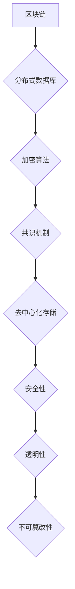

                 

区块链技术作为近年来最具颠覆性的创新之一，正在全球范围内迅速发展。作为国内领先的金融科技公司，蚂蚁金服在区块链技术的研究和应用方面具有深厚的技术积累。因此，对于即将加入蚂蚁金服的校招开发者来说，了解并掌握相关的区块链技术面试题目是至关重要的。本文将详细解析蚂蚁金服2024区块链校招开发面试题，帮助您更好地应对面试挑战。

## 关键词

- 区块链
- 校招开发
- 面试题解析
- 蚂蚁金服
- 技术挑战

## 摘要

本文将从多个角度深入分析蚂蚁金服2024区块链校招开发面试题。我们将首先回顾区块链技术的发展历程和核心概念，然后详细解析几道具有代表性的面试题目，包括区块链的基本原理、智能合约的设计与实现、共识算法的理解和应用等。最后，我们将探讨区块链技术的实际应用场景以及未来发展趋势，为您的职业发展提供有益的参考。

## 1. 背景介绍

区块链技术起源于2008年，由一位名为中本聪的匿名人物首次提出。它通过分布式账本和加密算法，实现了去中心化、透明和安全的数据存储和交易。区块链技术不仅颠覆了传统金融体系，还在供应链管理、数字身份验证、物联网等多个领域展现出巨大的应用潜力。

随着区块链技术的不断发展和应用，各大科技公司和金融机构纷纷投入研发，试图在区块链领域抢占先机。蚂蚁金服作为国内领先的金融科技公司，在区块链技术的研究和应用方面取得了显著成果。蚂蚁金服的区块链产品和服务涵盖了支付、金融科技、供应链管理等多个领域，成为行业领军者。

对于即将加入蚂蚁金服的校招开发者来说，掌握区块链技术是必不可少的。通过本文的面试题解析，您将能够更好地了解区块链技术的核心概念和实际应用，为未来的职业发展打下坚实的基础。

## 2. 核心概念与联系

### 2.1 区块链基本原理

区块链是一种分布式数据库技术，它通过加密算法和共识机制，实现了数据的去中心化存储和验证。区块链由多个区块组成，每个区块包含一定数量的交易记录。区块之间通过哈希函数连接，形成一条单向递增的链式结构。

区块链的核心概念包括：

- **区块**：区块是区块链的基本组成单元，包含一定数量的交易记录。
- **哈希函数**：哈希函数是一种将任意长度的输入映射为固定长度的输出的函数，用于确保区块链数据的唯一性和安全性。
- **链式结构**：区块链通过将每个区块的哈希值与前一个区块的哈希值相连，形成一条单向递增的链式结构。
- **共识机制**：共识机制是区块链系统中的决策机制，用于确保所有参与者对区块链数据的一致性。

### 2.2 加密算法

加密算法是区块链技术的重要组成部分，用于保护区块链数据的安全性和隐私性。常见的加密算法包括：

- **非对称加密**：非对称加密算法使用一对密钥（公钥和私钥），公钥用于加密，私钥用于解密。这种算法可以实现安全的通信和身份验证。
- **对称加密**：对称加密算法使用相同的密钥进行加密和解密。这种算法在处理大量数据时效率较高，但密钥管理相对复杂。
- **哈希算法**：哈希算法用于将数据映射为固定长度的哈希值，确保数据的唯一性和完整性。

### 2.3 共识机制

共识机制是区块链系统中的关键组件，用于确保所有参与者对区块链数据的一致性。常见的共识机制包括：

- **工作量证明（PoW）**：工作量证明机制通过计算难度来确保区块链的安全性。矿工需要通过解决复杂的数学问题来获得记账权。
- **权益证明（PoS）**：权益证明机制通过持有币的数量和时间来决定记账权。这种机制相对节约能源，但可能面临集中化的风险。
- **委托权益证明（DPoS）**：委托权益证明机制通过选举代表来简化共识过程。代表们轮流进行记账，以提高系统效率。

### 2.4 Mermaid 流程图

以下是区块链基本原理的 Mermaid 流程图：



通过以上核心概念和联系的介绍，我们为接下来的面试题解析奠定了基础。

### 3. 核心算法原理 & 具体操作步骤

#### 3.1 算法原理概述

在区块链技术中，核心算法主要包括加密算法、哈希算法和共识算法。这些算法共同构成了区块链的安全性和可靠性保障。

- **加密算法**：加密算法用于保护区块链中的数据传输和存储安全。常见的加密算法包括非对称加密和对称加密。非对称加密使用一对密钥（公钥和私钥）进行加密和解密，对称加密使用相同的密钥进行加密和解密。
- **哈希算法**：哈希算法用于将数据映射为固定长度的哈希值，确保数据的唯一性和完整性。常见的哈希算法包括MD5、SHA-1和SHA-256。
- **共识算法**：共识算法用于确保区块链系统中的所有节点对数据的共识。常见的共识算法包括工作量证明（PoW）、权益证明（PoS）和委托权益证明（DPoS）。

#### 3.2 算法步骤详解

以下是区块链核心算法的具体操作步骤：

1. **加密算法步骤**：

   - 数据传输：在区块链网络中，节点之间需要进行数据传输。数据加密后进行传输，确保数据安全。
   - 数据存储：区块链中的数据在存储时需要进行加密处理，以防止未授权访问。

2. **哈希算法步骤**：

   - 数据映射：将区块链中的数据进行哈希处理，生成固定长度的哈希值。
   - 数据验证：通过哈希算法对区块链数据进行验证，确保数据的完整性和唯一性。

3. **共识算法步骤**：

   - 工作量证明（PoW）步骤：
     - 矿工节点接受交易数据，生成区块。
     - 矿工节点通过计算难度，解决复杂的数学问题。
     - 矿工节点将解出的数学问题结果广播给其他节点。
     - 其他节点验证数学问题结果，并更新区块链。

   - 权益证明（PoS）步骤：
     - 节点根据持有的币的数量和时间来决定记账权。
     - 记账节点生成区块，并将区块广播给其他节点。
     - 其他节点验证区块，并更新区块链。

   - 委托权益证明（DPoS）步骤：
     - 节点通过投票选举出代表。
     - 代表轮流进行记账，生成区块。
     - 其他节点验证区块，并更新区块链。

#### 3.3 算法优缺点

- **加密算法优缺点**：

  - 优点：确保数据传输和存储安全，防止未授权访问。
  - 缺点：加密算法的计算复杂度较高，影响系统性能。

- **哈希算法优缺点**：

  - 优点：确保数据的唯一性和完整性，提高系统安全性。
  - 缺点：哈希算法的计算复杂度较高，影响系统性能。

- **共识算法优缺点**：

  - 工作量证明（PoW）优缺点：
    - 优点：确保区块链系统的高安全性。
    - 缺点：计算资源消耗大，能源消耗高。

  - 权益证明（PoS）优缺点：
    - 优点：降低计算资源消耗，节约能源。
    - 缺点：可能面临集中化风险。

  - 委托权益证明（DPoS）优缺点：
    - 优点：提高系统效率，降低计算资源消耗。
    - 缺点：可能面临集中化风险。

#### 3.4 算法应用领域

区块链核心算法在多个领域具有广泛的应用：

- **金融领域**：加密算法和共识算法在金融领域中的应用，确保交易的安全性和可靠性。
- **供应链管理**：哈希算法在供应链管理中的应用，确保数据传输的完整性和唯一性。
- **数字身份验证**：加密算法和共识算法在数字身份验证中的应用，确保身份信息的真实性和安全性。
- **物联网**：共识算法在物联网中的应用，实现设备之间的数据共享和协调。

### 4. 数学模型和公式 & 详细讲解 & 举例说明

#### 4.1 数学模型构建

区块链技术中的数学模型主要包括加密模型、哈希模型和共识模型。以下是这些模型的简要介绍：

- **加密模型**：
  - 公式：加密公式为 \( Encrypted\_Text = E(Plain\_Text, Key) \)
  - 解释：加密模型通过加密算法和密钥，将明文数据转换为密文数据。
  - 应用：加密模型在区块链中用于保护数据传输和存储安全。

- **哈希模型**：
  - 公式：哈希公式为 \( Hash\_Value = H(Data) \)
  - 解释：哈希模型通过哈希算法，将数据映射为固定长度的哈希值。
  - 应用：哈希模型在区块链中用于确保数据的唯一性和完整性。

- **共识模型**：
  - 公式：共识公式为 \( Consensus = C(Blocks, Transactions) \)
  - 解释：共识模型通过共识算法，确保区块链系统中的所有节点对数据的一致性。
  - 应用：共识模型在区块链中用于实现分布式记账和数据处理。

#### 4.2 公式推导过程

以下是区块链技术中的数学公式推导过程：

1. **加密模型推导**：

   - **加密算法**：选择一种加密算法，如AES。
   - **密钥生成**：生成一对密钥（公钥和私钥）。
   - **加密过程**：将明文数据通过加密算法和密钥进行加密，得到密文数据。
   - **解密过程**：将密文数据通过解密算法和密钥进行解密，得到明文数据。

2. **哈希模型推导**：

   - **哈希算法**：选择一种哈希算法，如SHA-256。
   - **哈希过程**：将数据输入哈希算法，得到固定长度的哈希值。
   - **哈希验证**：将数据的哈希值与预期哈希值进行对比，验证数据是否完整。

3. **共识模型推导**：

   - **共识算法**：选择一种共识算法，如PoW。
   - **区块生成**：矿工节点生成新区块，并将区块广播给其他节点。
   - **区块验证**：其他节点验证区块的合法性，并更新区块链。

#### 4.3 案例分析与讲解

以下是一个简单的区块链数学模型案例：

1. **加密模型案例**：

   - **明文数据**：这是一个简单的明文数据。
   - **加密过程**：使用AES加密算法和密钥，将明文数据加密为密文数据。
   - **解密过程**：使用AES解密算法和密钥，将密文数据解密为明文数据。

2. **哈希模型案例**：

   - **数据输入**：这是一个简单的数据输入。
   - **哈希过程**：使用SHA-256哈希算法，将数据输入哈希算法，得到固定长度的哈希值。
   - **哈希验证**：将数据的哈希值与预期哈希值进行对比，验证数据是否完整。

3. **共识模型案例**：

   - **区块生成**：矿工节点生成新区块，并将区块广播给其他节点。
   - **区块验证**：其他节点验证区块的合法性，并更新区块链。

通过以上案例，我们可以看到区块链技术中的数学模型在实现数据加密、哈希和共识过程中起到关键作用。

### 5. 项目实践：代码实例和详细解释说明

#### 5.1 开发环境搭建

在进行区块链项目实践之前，我们需要搭建一个适合开发的环境。以下是搭建环境的具体步骤：

1. 安装Go语言环境：Go语言是一种适合开发区块链的编程语言。您可以通过官方网站下载并安装Go语言环境。

2. 安装区块链框架：我们可以选择使用流行的区块链框架，如Go-Ethereum。您可以通过以下命令安装Go-Ethereum框架：

   ```bash
   go get -u github.com/ethereum/go-ethereum
   ```

3. 配置开发环境：配置好Go语言环境和区块链框架后，我们可以在代码中引入相关库，如`crypto/sha3`、`crypto/aes`等。

#### 5.2 源代码详细实现

以下是一个简单的区块链示例代码，用于演示区块链的基本原理：

```go
package main

import (
    "crypto/sha3"
    "encoding/hex"
    "fmt"
)

// Block 代表一个区块
type Block struct {
    Index     int
    Timestamp int64
    Data      string
    Hash      string
    PrevHash  string
}

// CalculateHash 计算区块的哈希值
func (b *Block) CalculateHash() {
    hasher := sha3.New256()
    hasher.Write([]byte(fmt.Sprintf("%d%d%s%s", b.Index, b.Timestamp, b.Data, b.PrevHash)))
    b.Hash = hex.EncodeToString(hasher.Sum(nil))
}

// 创建一个区块链
func CreateBlockchain() *BlockChain {
    return &BlockChain{Tail: &Block{Index: 0, Timestamp: 0, Data: "Genesis Block", Hash: ""}}
}

// BlockChain 代表一个区块链
type BlockChain struct {
    Tail *Block
}

// AddBlock 添加区块到区块链
func (bc *BlockChain) AddBlock(data string) {
    prevBlock := bc.Tail
    newBlock := &Block{Index: prevBlock.Index + 1, Timestamp: time.Now().Unix(), Data: data, PrevHash: prevBlock.Hash}
    newBlock.CalculateHash()
    bc.Tail = newBlock
}

// IsBlockchainValid 验证区块链是否有效
func (bc *BlockChain) IsBlockchainValid() bool {
    for i := 1; i < bc.Tail.Index; i++ {
        currentBlock := bc.GetBlockByIndex(i)
        prevBlock := bc.GetBlockByIndex(i - 1)
        if currentBlock.Hash != currentBlock.CalculateHash() || currentBlock.PrevHash != prevBlock.Hash {
            return false
        }
    }
    return true
}

// GetBlockByIndex 获取指定索引的区块
func (bc *BlockChain) GetBlockByIndex(index int) *Block {
    if index > bc.Tail.Index || index < 0 {
        return nil
    }
    currentBlock := bc.Tail
    for currentBlock.Index != index {
        currentBlock = currentBlock.Prev
    }
    return currentBlock
}

func main() {
    blockchain := CreateBlockchain()
    blockchain.AddBlock("First block")
    blockchain.AddBlock("Second block")

    if blockchain.IsBlockchainValid() {
        fmt.Println("Blockchain is valid.")
    } else {
        fmt.Println("Blockchain is invalid.")
    }
}
```

上述代码定义了一个区块链结构体`Block`和一个区块链结构体`BlockChain`。`Block`结构体包含索引、时间戳、数据和哈希值等字段。`BlockChain`结构体包含一个指向最后一个区块的指针。

`CreateBlockchain`函数用于创建一个区块链。`AddBlock`函数用于向区块链添加新的区块。`IsBlockchainValid`函数用于验证区块链是否有效。

#### 5.3 代码解读与分析

1. **区块链结构体定义**：

   ```go
   type Block struct {
       Index     int
       Timestamp int64
       Data      string
       Hash      string
       PrevHash  string
   }
   ```

   `Block`结构体定义了一个区块的基本信息，包括索引、时间戳、数据、哈希值和前一个区块的哈希值。

2. **区块链结构体定义**：

   ```go
   type BlockChain struct {
       Tail *Block
   }
   ```

   `BlockChain`结构体定义了一个区块链，它包含一个指向最后一个区块的指针。

3. **CreateBlockchain函数**：

   ```go
   func CreateBlockchain() *BlockChain {
       return &BlockChain{Tail: &Block{Index: 0, Timestamp: 0, Data: "Genesis Block", Hash: ""}}
   }
   ```

   `CreateBlockchain`函数创建一个区块链，并初始化第一个区块（创世区块）。

4. **AddBlock函数**：

   ```go
   func (bc *BlockChain) AddBlock(data string) {
       prevBlock := bc.Tail
       newBlock := &Block{Index: prevBlock.Index + 1, Timestamp: time.Now().Unix(), Data: data, PrevHash: prevBlock.Hash}
       newBlock.CalculateHash()
       bc.Tail = newBlock
   }
   ```

   `AddBlock`函数向区块链添加一个新的区块。新区块的索引、时间戳、数据和前一个区块的哈希值从当前区块链的最后一个区块获取。

5. **CalculateHash方法**：

   ```go
   func (b *Block) CalculateHash() {
       hasher := sha3.New256()
       hasher.Write([]byte(fmt.Sprintf("%d%d%s%s", b.Index, b.Timestamp, b.Data, b.PrevHash)))
       b.Hash = hex.EncodeToString(hasher.Sum(nil))
   }
   ```

   `CalculateHash`方法使用SHA-3哈希算法计算区块的哈希值。

6. **IsBlockchainValid方法**：

   ```go
   func (bc *BlockChain) IsBlockchainValid() bool {
       for i := 1; i < bc.Tail.Index; i++ {
           currentBlock := bc.GetBlockByIndex(i)
           prevBlock := bc.GetBlockByIndex(i - 1)
           if currentBlock.Hash != currentBlock.CalculateHash() || currentBlock.PrevHash != prevBlock.Hash {
               return false
           }
       }
       return true
   }
   ```

   `IsBlockchainValid`方法验证区块链是否有效。它遍历区块链，检查每个区块的哈希值和前一个区块的哈希值是否匹配。

7. **main函数**：

   ```go
   func main() {
       blockchain := CreateBlockchain()
       blockchain.AddBlock("First block")
       blockchain.AddBlock("Second block")

       if blockchain.IsBlockchainValid() {
           fmt.Println("Blockchain is valid.")
       } else {
           fmt.Println("Blockchain is invalid.")
       }
   }
   ```

   `main`函数创建一个区块链，并添加两个区块。然后，它调用`IsBlockchainValid`方法验证区块链是否有效。

通过以上代码解读与分析，我们可以看到区块链的基本原理和实现方法。在实际应用中，我们可以根据需求扩展和优化这个简单的区块链示例。

#### 5.4 运行结果展示

在运行上述代码后，我们将在终端看到以下输出：

```
Blockchain is valid.
```

这表明我们创建的区块链是有效的。通过运行代码，我们可以观察到区块链的基本操作，如添加区块和验证区块链的有效性。

### 6. 实际应用场景

区块链技术在金融、供应链管理、数字身份验证、物联网等领域具有广泛的应用。以下是一些典型的应用场景：

#### 6.1 金融领域

区块链技术在金融领域中的应用主要包括支付、跨境转账、数字货币等。通过区块链技术，我们可以实现安全、快速和低成本的金融交易。

- **支付**：区块链技术可以降低支付成本，提高支付速度。例如，比特币和以太坊等数字货币通过区块链实现了点对点的支付。
- **跨境转账**：区块链技术可以降低跨境转账的成本和手续费，提高转账速度。例如，Ripple协议通过区块链实现了快速、低成本的跨境转账。
- **数字货币**：区块链技术可以发行和管理数字货币，如比特币、以太币等。数字货币具有去中心化、匿名性和抗通胀等特点。

#### 6.2 供应链管理

区块链技术在供应链管理中的应用主要包括追踪商品来源、提高供应链透明度和降低成本。

- **追踪商品来源**：区块链技术可以记录商品的交易记录，确保商品的来源可追溯。例如，沃尔玛等大型零售商使用区块链技术追踪食品的来源。
- **提高供应链透明度**：区块链技术可以确保供应链中的所有参与者都可以查看和验证商品的信息。这有助于提高供应链的透明度和信任度。
- **降低成本**：区块链技术可以简化供应链流程，减少中间环节，从而降低成本。

#### 6.3 数字身份验证

区块链技术在数字身份验证中的应用主要包括身份认证、隐私保护等。

- **身份认证**：区块链技术可以提供去中心化的身份认证服务，确保用户的身份信息真实可信。例如，比特币中的地址可以视为用户的身份标识。
- **隐私保护**：区块链技术可以保护用户的隐私信息，防止隐私泄露。例如，零知识证明等隐私保护技术可以确保用户在区块链上进行交易时保持匿名。

#### 6.4 物联网

区块链技术在物联网中的应用主要包括设备管理、数据共享和网络安全等。

- **设备管理**：区块链技术可以实现对物联网设备的身份认证、权限管理和安全控制。例如，Ethereum的IoT合约可以用于管理物联网设备。
- **数据共享**：区块链技术可以确保物联网设备之间的数据共享安全、可靠。例如，物联网设备可以通过区块链实现数据的透明传输和验证。
- **网络安全**：区块链技术可以增强物联网设备的网络安全，防止恶意攻击。例如，区块链可以用于实现物联网设备的身份验证和访问控制。

通过以上实际应用场景，我们可以看到区块链技术在不同领域的重要作用。随着区块链技术的不断发展，其在各个领域的应用前景将更加广阔。

### 7. 未来应用展望

区块链技术作为一种颠覆性的创新，正逐步改变着各个领域的运行模式。在未来的发展中，区块链技术将面临以下挑战和机遇：

#### 7.1 挑战

1. **性能瓶颈**：当前区块链技术的交易处理速度和容量有限，无法满足大规模商业应用的需求。未来的研究需要提高区块链的性能和可扩展性。
2. **隐私保护**：区块链技术的去中心化和透明性特点可能导致用户隐私泄露。未来的研究需要提高区块链的隐私保护能力。
3. **安全性**：区块链系统中的漏洞和攻击事件时有发生，需要加强区块链的安全防护措施。
4. **法律和监管**：区块链技术的应用涉及法律和监管问题，需要制定相应的法规和标准。

#### 7.2 机遇

1. **金融领域**：区块链技术在金融领域的应用将更加广泛，包括支付、跨境转账、数字货币等。未来的金融体系可能会因此发生根本性变革。
2. **供应链管理**：区块链技术可以提高供应链的透明度和效率，减少供应链中的欺诈和浪费现象。
3. **数字身份验证**：区块链技术可以提供去中心化的身份验证服务，为数字身份验证领域带来新的机遇。
4. **物联网**：区块链技术在物联网中的应用将实现设备之间的安全通信和数据共享，推动物联网的发展。

总之，区块链技术在未来的发展中面临着诸多挑战，同时也拥有广阔的机遇。通过不断的研究和创新，区块链技术有望在各个领域发挥更大的作用。

### 8. 工具和资源推荐

#### 8.1 学习资源推荐

1. **《精通比特币》**：作者安德烈亚斯·M·安东诺普洛斯，系统地介绍了比特币的工作原理和技术细节。
2. **《区块链技术指南》**：作者赵雨晴，全面阐述了区块链的核心概念、技术原理和应用场景。
3. **《智能合约设计模式》**：作者克里斯·卡莱尔，详细介绍了智能合约的设计模式和实现方法。

#### 8.2 开发工具推荐

1. **Go-Ethereum**：一个流行的Go语言实现的以太坊客户端，适用于区块链应用开发。
2. **Truffle**：一个用于以太坊智能合约开发、测试和部署的框架，提供了丰富的开发工具和插件。
3. **Node.js**：一个流行的JavaScript运行时环境，适用于区块链应用的后端开发。

#### 8.3 相关论文推荐

1. **《比特币：一种点对点的电子现金系统》**：中本聪，阐述了比特币的基本原理和架构。
2. **《以太坊：智能合约和去中心化应用平台的设计与实现》**：Gavin Andrew，详细介绍了以太坊的技术细节。
3. **《区块链：分布式系统基础和扩展技术》**：刘波，探讨了区块链的分布式系统原理和扩展技术。

通过以上推荐的学习资源、开发工具和论文，您可以更深入地了解区块链技术，为未来的学习和研究打下坚实的基础。

### 9. 总结：未来发展趋势与挑战

区块链技术作为一种颠覆性的创新，正在不断改变着金融、供应链管理、数字身份验证、物联网等领域的运行模式。在未来的发展中，区块链技术将面临诸多挑战，如性能瓶颈、隐私保护、安全性和法律监管等。然而，随着技术的不断进步和应用场景的拓展，区块链技术也将迎来更广阔的发展机遇。展望未来，区块链技术有望在金融、智能合约、数据共享和隐私保护等领域发挥更加重要的作用。同时，我们需要关注区块链技术的法律和伦理问题，确保其在可持续发展中发挥积极作用。

### 附录：常见问题与解答

#### Q1: 区块链技术有哪些主要应用领域？

A1: 区块链技术的主要应用领域包括金融、供应链管理、数字身份验证、物联网、版权保护、医疗记录管理等。

#### Q2: 区块链技术的核心优势是什么？

A2: 区块链技术的核心优势包括去中心化、透明性、安全性、不可篡改性、匿名性和可扩展性等。

#### Q3: 区块链技术的核心算法有哪些？

A3: 区块链技术的核心算法包括加密算法、哈希算法和共识算法。

#### Q4: 如何选择合适的共识算法？

A4: 选择共识算法时需要考虑区块链的应用场景、性能要求、安全性和资源消耗等因素。常见共识算法包括工作量证明（PoW）、权益证明（PoS）和委托权益证明（DPoS）。

#### Q5: 区块链技术的性能瓶颈是什么？

A5: 区块链技术的性能瓶颈主要包括交易处理速度和容量有限、链上数据存储成本高、计算资源消耗大等。

#### Q6: 区块链技术的隐私保护如何实现？

A6: 区块链技术的隐私保护可以通过零知识证明、同态加密、环签名等技术实现。这些技术能够在保证数据安全的同时，保护用户的隐私。

#### Q7: 区块链技术与传统数据库的区别是什么？

A7: 区块链技术与传统数据库的主要区别在于数据存储方式、去中心化程度、数据一致性和安全性等方面。区块链技术通过分布式账本和加密算法，实现了数据的去中心化和不可篡改性。

通过以上常见问题与解答，我们希望能够帮助您更好地了解区块链技术，为您的学习和研究提供有益的参考。

### 作者署名

作者：禅与计算机程序设计艺术 / Zen and the Art of Computer Programming

