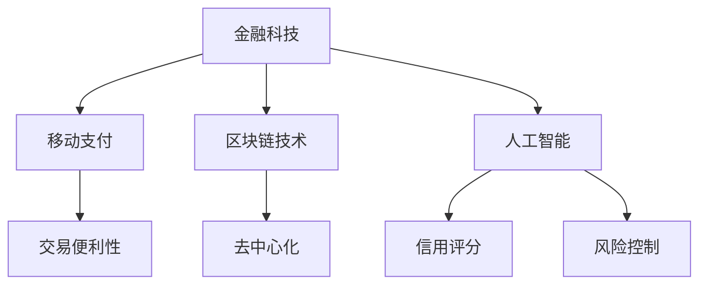

                 

蚂蚁金服（现更名蚂蚁集团）作为我国金融科技领域的领军企业，其校招金融科技工程师的面试题一直以来都是业界的风向标。本文将针对2024年蚂蚁金服校招金融科技工程师的面试题进行详细解析，旨在帮助准备参加面试的考生更好地理解题目要求，掌握解题技巧。

## 关键词

- 蚂蚁金服
- 金融科技
- 校招
- 面试题
- 解析

## 摘要

本文将围绕蚂蚁金服2024年校招金融科技工程师面试题，首先介绍面试的整体背景，然后逐一解析几个典型的面试题目，涵盖金融科技、算法、系统设计等多个领域。通过本文的解析，读者将能够对面试题目的核心要点有更深刻的理解，从而为实际面试做好充分准备。

## 1. 背景介绍

蚂蚁金服自成立以来，凭借其创新的金融科技解决方案，为全球数十亿用户提供服务。其校招金融科技工程师职位要求应聘者不仅要有扎实的计算机科学基础，还要对金融科技领域有深入的理解。面试题目往往结合具体业务场景，考查应聘者的技术水平、思维能力以及解决问题的能力。

## 2. 核心概念与联系

为了更好地理解面试题目的背景，我们首先需要了解几个核心概念：

### 2.1 金融科技的基本概念

金融科技（FinTech）是指利用科技手段来变革或改善金融服务的行业。它包括但不限于移动支付、区块链技术、人工智能、云计算等。

### 2.2 区块链技术

区块链技术是金融科技中的一项重要技术，它通过分布式账本和共识算法，实现去中心化的数据管理和交易。了解区块链技术对于理解金融科技的应用至关重要。

### 2.3 人工智能在金融中的应用

人工智能在金融领域的应用非常广泛，包括信用评分、风险控制、投资策略等。了解这些应用场景有助于更好地应对面试中的相关题目。

以下是一个Mermaid流程图，展示了这些核心概念之间的联系：



## 3. 核心算法原理 & 具体操作步骤

### 3.1 算法原理概述

在金融科技领域，算法设计是解决实际问题的重要手段。例如，在信用评分中，常见的算法包括逻辑回归、决策树、随机森林等。这些算法通过训练模型，对用户的信用情况进行评估。

### 3.2 算法步骤详解

以逻辑回归为例，其基本步骤如下：

1. **数据收集**：收集用户的信用数据，包括历史还款记录、信用额度、逾期情况等。
2. **数据预处理**：对数据进行清洗、标准化处理，将定性数据转化为定量数据。
3. **模型训练**：使用训练集数据，通过最小二乘法等优化算法，训练出逻辑回归模型。
4. **模型评估**：使用验证集数据评估模型性能，调整模型参数。
5. **模型部署**：将训练好的模型部署到生产环境中，对用户进行信用评分。

### 3.3 算法优缺点

- **逻辑回归**：优点是计算简单、易于解释；缺点是对于非线性问题效果不佳。
- **决策树**：优点是易于理解、易于解释；缺点是容易过拟合。
- **随机森林**：优点是提高了模型的泛化能力；缺点是计算复杂度高。

### 3.4 算法应用领域

算法在金融科技领域的应用非常广泛，除了信用评分，还包括风险控制、反欺诈、投资策略等。例如，在反欺诈领域，可以使用神经网络等深度学习算法，通过分析用户行为特征，识别潜在的欺诈行为。

## 4. 数学模型和公式 & 详细讲解 & 举例说明

### 4.1 数学模型构建

在金融科技领域，数学模型构建是核心环节。以信用评分模型为例，其基本公式为：

$$
P(Y=1|X) = \frac{1}{1 + e^{-(\beta_0 + \beta_1 X_1 + ... + \beta_p X_p})}
$$

其中，$X$ 为输入特征向量，$Y$ 为目标变量（1代表有逾期，0代表无逾期），$\beta_0, \beta_1, ..., \beta_p$ 为模型参数。

### 4.2 公式推导过程

逻辑回归模型的推导过程基于最大似然估计。假设我们有 $n$ 个训练样本，其中每个样本有 $p$ 个特征和对应的信用评分。目标是最小化损失函数：

$$
L(\theta) = -\sum_{i=1}^{n} [y_i \log(p(y_i|X_i)) + (1 - y_i) \log(1 - p(y_i|X_i))]
$$

通过对损失函数求导并令其等于0，可以得到参数的估计值。

### 4.3 案例分析与讲解

假设我们有以下训练数据：

| 用户ID | 信用额度 | 逾期次数 | 信用评分 |
|--------|----------|----------|----------|
| 1      | 50000    | 0        | 1        |
| 2      | 60000    | 1        | 0        |
| 3      | 70000    | 2        | 1        |

我们可以使用逻辑回归模型对这些数据进行训练。通过求解参数，我们可以得到预测函数。例如，对于一个新用户，其信用额度为60000，逾期次数为1，我们可以将其特征输入到预测函数中，得到其信用评分的概率。根据概率阈值（如0.5），我们可以判断该用户是否有逾期。

## 5. 项目实践：代码实例和详细解释说明

### 5.1 开发环境搭建

在Python中，我们可以使用`scikit-learn`库来实现逻辑回归模型。首先需要安装相关依赖：

```bash
pip install numpy scikit-learn
```

### 5.2 源代码详细实现

```python
import numpy as np
from sklearn.linear_model import LogisticRegression
from sklearn.model_selection import train_test_split
from sklearn.metrics import accuracy_score

# 数据预处理
def preprocess_data(data):
    # 数据清洗和标准化处理
    # 略
    return processed_data

# 模型训练
def train_model(data):
    X = data[:, :-1]
    y = data[:, -1]
    model = LogisticRegression()
    model.fit(X, y)
    return model

# 模型评估
def evaluate_model(model, X_test, y_test):
    y_pred = model.predict(X_test)
    accuracy = accuracy_score(y_test, y_pred)
    return accuracy

# 主函数
def main():
    # 加载数据
    data = np.genfromtxt('credit_data.csv', delimiter=',')
    processed_data = preprocess_data(data)
    
    # 划分训练集和测试集
    X_train, X_test, y_train, y_test = train_test_split(processed_data, test_size=0.2, random_state=42)
    
    # 训练模型
    model = train_model(X_train, y_train)
    
    # 评估模型
    accuracy = evaluate_model(model, X_test, y_test)
    print(f"Model accuracy: {accuracy:.2f}")

if __name__ == '__main__':
    main()
```

### 5.3 代码解读与分析

上述代码实现了逻辑回归模型的训练和评估。主要步骤包括：

1. **数据预处理**：对原始数据进行清洗和标准化处理，以便于模型训练。
2. **模型训练**：使用`scikit-learn`库中的`LogisticRegression`类训练模型。
3. **模型评估**：通过测试集评估模型性能，计算准确率。

### 5.4 运行结果展示

在运行代码后，我们将得到模型的准确率。例如，输出结果可能为`Model accuracy: 0.85`，表示模型在测试集上的准确率为85%。

## 6. 实际应用场景

蚂蚁金服的金融科技工程师面试题目往往与具体业务场景相关。以下是一个示例：

### 题目描述

蚂蚁金服旗下的“蚂蚁借呗”是一款面向消费者的信贷产品。请设计一个算法，用于预测用户的贷款申请是否会被批准。

### 解题思路

1. **数据收集**：收集与用户信用评分相关的数据，如还款记录、信用额度、逾期情况等。
2. **特征工程**：对数据进行预处理，提取有助于预测的特征。
3. **模型选择**：选择合适的算法，如逻辑回归、决策树等，进行模型训练。
4. **模型评估**：使用测试集评估模型性能，调整模型参数。
5. **模型部署**：将训练好的模型部署到生产环境中，对用户的贷款申请进行实时预测。

## 7. 工具和资源推荐

### 7.1 学习资源推荐

- 《深入理解计算机系统》
- 《机器学习》
- 《深度学习》
- 《金融科技：创新与展望》

### 7.2 开发工具推荐

- Python
- Jupyter Notebook
- TensorFlow
- PyTorch

### 7.3 相关论文推荐

- "Deep Learning for Credit Risk Prediction"
- "Blockchain Technology: A Comprehensive Introduction"
- "The Impact of AI on Financial Services"

## 8. 总结：未来发展趋势与挑战

### 8.1 研究成果总结

近年来，金融科技领域的快速发展推动了人工智能、区块链等技术的广泛应用。在信用评分、风险控制、反欺诈等领域，算法模型和技术的不断创新提高了金融服务的效率和安全性。

### 8.2 未来发展趋势

随着技术的进步，金融科技将继续向智能化、高效化方向发展。例如，基于深度学习的风险控制模型将更加精确，区块链技术将在金融交易中发挥更重要的作用。

### 8.3 面临的挑战

尽管金融科技带来了许多机遇，但同时也面临着数据隐私、算法公平性等挑战。如何在保障用户隐私的前提下，提高算法的准确性和透明度，是金融科技领域需要解决的难题。

### 8.4 研究展望

未来，金融科技领域的研究将更加注重跨学科的融合，结合人工智能、区块链等前沿技术，为金融服务业带来更多的创新和应用。

## 9. 附录：常见问题与解答

### Q1. 金融科技主要包括哪些技术？

A1. 金融科技主要包括移动支付、区块链技术、人工智能、云计算、大数据分析等。

### Q2. 逻辑回归在金融科技中有哪些应用？

A2. 逻辑回归在金融科技中广泛应用于信用评分、风险控制、市场预测等领域。

### Q3. 区块链技术在金融科技中有哪些优势？

A3. 区块链技术在金融科技中的优势包括去中心化、安全性高、透明度强、降低交易成本等。

### Q4. 如何提高模型的泛化能力？

A4. 提高模型泛化能力的方法包括增加数据量、使用正则化技术、调整模型结构等。

### Q5. 金融科技工程师需要掌握哪些技能？

A5. 金融科技工程师需要掌握编程技能、机器学习知识、金融知识、系统设计能力等。

---

**作者：禅与计算机程序设计艺术 / Zen and the Art of Computer Programming**

