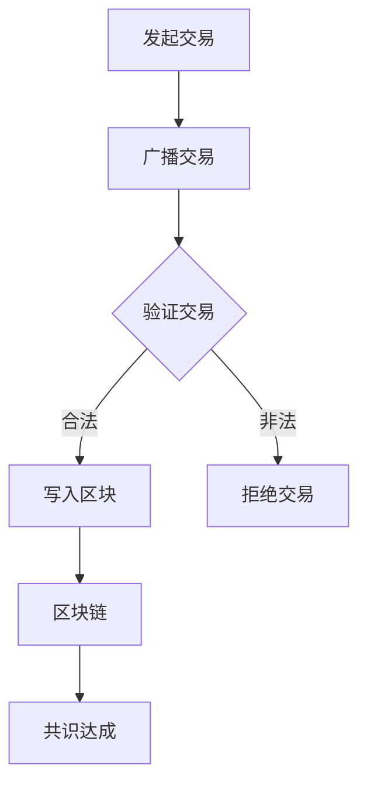

                 

关键词：蚂蚁金服、区块链、共识算法、面试指南、技术博客

> 摘要：本文将围绕蚂蚁金服2025社招区块链共识算法专家的面试，详细介绍区块链共识算法的核心概念、原理、应用领域，以及相关数学模型和公式。通过分析现有算法的优缺点，结合实际项目实践，提供一套全面的面试指南，助力读者应对面试挑战。

## 1. 背景介绍

区块链技术作为分布式账本技术的重要分支，已成为金融科技领域的核心技术之一。随着区块链技术的广泛应用，共识算法作为其核心组件，越来越受到业界关注。共识算法是指网络中多个节点达成一致意见的机制，保障区块链的安全性和可靠性。

蚂蚁金服作为全球领先的金融科技公司，在区块链领域有着丰富的实践经验和技术积累。本次社招区块链共识算法专家，旨在寻找具有深厚理论基础和实践经验的优秀人才，共同推动区块链技术的发展与创新。

## 2. 核心概念与联系

### 2.1 区块链基础

区块链是一种去中心化的数据库，由多个区块组成，每个区块包含一定数量的交易记录。区块之间通过哈希函数连接，形成链式结构。区块链的主要特性包括：

- 去中心化：无需中心化机构进行协调，数据存储在所有参与节点的分布式账本中。
- 安全性：通过密码学技术保障数据的不可篡改性。
- 可追溯性：区块链上的所有交易记录均可以被追溯和验证。

### 2.2 共识算法

共识算法是指网络中多个节点在无法完全信任对方的情况下，达成一致意见的机制。常见的共识算法包括：

- 工作量证明（Proof of Work, PoW）：通过计算资源竞争，实现节点间的共识。
- 权益证明（Proof of Stake, PoS）：通过持有代币的数量和时间，实现节点间的共识。
- 软决策（Delegated Proof of Stake, DPoS）：对PoS算法进行改进，提高交易处理速度。

### 2.3 Mermaid 流程图

以下是一个简化的共识算法架构的 Mermaid 流程图：



## 3. 核心算法原理 & 具体操作步骤

### 3.1 算法原理概述

#### 工作量证明（PoW）

PoW算法通过节点间的计算资源竞争，实现节点间的共识。节点需要解决一个随机的数学问题，称为“挖矿”。解决数学问题的节点将区块写入区块链，并获得相应的奖励。

#### 权益证明（PoS）

PoS算法通过节点持有代币的数量和时间，实现节点间的共识。节点根据其持有的代币数量和持有时间，获得生成区块的概率。持有代币越多、持有时间越长，生成区块的概率越大。

#### 软决策（DPoS）

DPoS算法是对PoS算法的改进，通过选举产生超级节点，超级节点负责生成区块和验证交易。超级节点之间通过竞争产生，竞争机制类似于选举。

### 3.2 算法步骤详解

#### 工作量证明（PoW）

1. 节点接收交易，构造一个区块。
2. 节点尝试解决一个难度值固定的数学问题。
3. 当找到一个有效的解时，节点将区块广播给其他节点。
4. 其他节点验证该区块的有效性，并更新区块链。
5. 验证成功的节点获得奖励。

#### 权益证明（PoS）

1. 节点接收交易，构造一个区块。
2. 节点计算生成区块的概率，根据持有的代币数量和持有时间。
3. 当节点生成区块时，将区块广播给其他节点。
4. 其他节点验证该区块的有效性，并更新区块链。
5. 验证成功的节点获得奖励。

#### 软决策（DPoS）

1. 节点参与超级节点的选举。
2. 超级节点根据选举结果确定。
3. 超级节点接收交易，构造一个区块。
4. 超级节点将区块广播给其他节点。
5. 其他节点验证该区块的有效性，并更新区块链。
6. 验证成功的超级节点获得奖励。

### 3.3 算法优缺点

#### 工作量证明（PoW）

优点：

- 安全性高，通过计算资源竞争保障区块链安全。
- 对中心化机构的依赖较小。

缺点：

- 消耗大量电力和计算资源，环境友好性较差。
- 随着计算能力的提升，难度调整可能导致网络分叉。

#### 权益证明（PoS）

优点：

- 环境友好性较好，无需大量计算资源。
- 网络分叉的可能性较小。

缺点：

- 中心化风险较大，持有代币数量较多者具有更大的影响力。

#### 软决策（DPoS）

优点：

- 提高交易处理速度，降低网络延迟。
- 通过选举产生超级节点，实现去中心化。

缺点：

- 选举过程可能导致中心化风险。
- 超级节点可能滥用权力。

### 3.4 算法应用领域

共识算法在区块链领域具有广泛的应用，包括：

- 智能合约平台：如以太坊、EOS等。
- 数字货币：如比特币、以太坊等。
- 跨境支付：如Ripple等。
- 身份认证：如身份证、签证等。

## 4. 数学模型和公式 & 详细讲解 & 举例说明

### 4.1 数学模型构建

#### 工作量证明（PoW）

PoW算法中，节点需要解决的数学问题可以表示为：

$$
H_{n+1} = H(n) \oplus (n+1)
$$

其中，$H$表示哈希函数，$\oplus$表示异或运算。节点需要找到一个满足以下条件的数$n$：

$$
H_{n+1} \leq D
$$

其中，$D$表示难度值。

#### 权益证明（PoS）

PoS算法中，节点生成区块的概率可以表示为：

$$
P = \frac{ST}{T_{total}}
$$

其中，$S$表示节点持有的代币数量，$T$表示节点持有代币的时间，$T_{total}$表示所有节点持有代币的总时间。

#### 软决策（DPoS）

DPoS算法中，超级节点的选举概率可以表示为：

$$
P = \frac{V}{V_{total}}
$$

其中，$V$表示节点的投票权，$V_{total}$表示所有节点的投票权总和。

### 4.2 公式推导过程

#### 工作量证明（PoW）

假设现有网络难度值为$D$，节点需要找到一个数$n$，使得$H_{n+1} \leq D$。根据哈希函数的性质，$H_{n+1}$的值是随机的，因此，节点需要不断尝试不同的$n$值，直到找到一个满足条件的$n$。

#### 权益证明（PoS）

假设现有网络中所有节点的代币数量和持有时间分别为$S_1, S_2, ..., S_n$，总代币数量和总持有时间为$T_1, T_2, ..., T_n$。根据权益证明的原理，节点生成区块的概率与节点的代币数量和持有时间成正比。因此，可以推导出生成区块的概率公式。

#### 软决策（DPoS）

假设现有网络中所有节点的投票权分别为$V_1, V_2, ..., V_n$，总投票权为$V_{total}$。根据软决策的原理，超级节点的选举概率与节点的投票权成正比。因此，可以推导出超级节点的选举概率公式。

### 4.3 案例分析与讲解

#### 工作量证明（PoW）

假设现有网络难度值为$D=2^{128}$，节点A需要找到一个数$n$，使得$H_{n+1} \leq D$。节点A尝试了$n=100$，发现$H_{101} > D$，因此继续尝试$n=200$。经过多次尝试，节点A找到了一个数$n=1000$，使得$H_{1001} \leq D$。节点A成功生成了一个新区块，并获得奖励。

#### 权益证明（PoS）

假设现有网络中节点A持有代币数量为$S=100$，持有时间为$T=1000$，总代币数量为$T_{total}=10000$，总持有时间为$T_{total}=10000$。根据权益证明的原理，节点A生成区块的概率为：

$$
P = \frac{ST}{T_{total}} = \frac{100 \times 1000}{10000} = 0.1
$$

因此，节点A生成区块的概率为10%。

#### 软决策（DPoS）

假设现有网络中节点A的投票权为$V=100$，总投票权为$V_{total}=1000$。根据软决策的原理，节点A被选为超级节点的概率为：

$$
P = \frac{V}{V_{total}} = \frac{100}{1000} = 0.1
$$

因此，节点A被选为超级节点的概率为10%。

## 5. 项目实践：代码实例和详细解释说明

### 5.1 开发环境搭建

为了更好地理解共识算法，我们将使用Python编写一个简单的区块链模拟系统。首先，我们需要安装Python和相关的依赖库。以下是开发环境搭建的步骤：

1. 安装Python 3.x版本。
2. 安装Python依赖库：`pip install Flask`（用于Web接口）、`pip install PyJWT`（用于身份验证）。
3. 创建一个名为`blockchain`的Python虚拟环境。

### 5.2 源代码详细实现

以下是简单的区块链模拟系统的源代码：

```python
import hashlib
import json
from time import time
from flask import Flask, jsonify, request

class BlockChain:
    def __init__(self):
        self.unconfirmed_transactions = []
        self.chain = []
        self.create_genesis_block()

    def create_genesis_block(self):
        genesis_block = {
            'height': 0,
            'transactions': [],
            'timestamp': time(),
            'prev_hash': 1,
        }
        genesis_hash = self.hash_block(genesis_block)
        genesis_block['hash'] = genesis_hash
        self.chain.append(genesis_block)

    def add_new_transaction(self, transaction):
        self.unconfirmed_transactions.append(transaction)

    def get_latest_block(self):
        return self.chain[-1]

    def hash_block(self, block):
        block_string = json.dumps(block, sort_keys=True)
        return hashlib.sha256(block_string.encode()).hexdigest()

    def mine(self):
        if not self.unconfirmed_transactions:
            return False

        last_block = self.get_latest_block()
        new_block = {
            'height': last_block['height'] + 1,
            'transactions': self.unconfirmed_transactions,
            'timestamp': time(),
            'prev_hash': last_block['hash'],
        }
        new_hash = self.hash_block(new_block)
        new_block['hash'] = new_hash

        self.chain.append(new_block)
        self.unconfirmed_transactions = []

        return new_block

    def is_chain_valid(self):
        for i in range(1, len(self.chain)):
            current = self.chain[i]
            previous = self.chain[i - 1]

            if current['hash'] != self.hash_block(current):
                return False
            if current['prev_hash'] != previous['hash']:
                return False

        return True

app = Flask(__name__)
blockchain = BlockChain()

@app.route('/transactions', methods=['POST'])
def add_new_transaction():
    transaction = request.json
    blockchain.add_new_transaction(transaction)
    return jsonify({'message': 'New transaction received'}), 200

@app.route('/mine', methods=['GET'])
def mine():
    block = blockchain.mine()
    if block:
        return jsonify({'message': 'Block mined', 'block': block}), 200
    else:
        return jsonify({'message': 'No transactions to mine'}), 404

@app.route('/chain', methods=['GET'])
def full_chain():
    chain_response = {
        'chain': blockchain.chain,
        'length': len(blockchain.chain),
    }
    return jsonify(chain_response), 200

@app.route('/valid', methods=['GET'])
def is_valid():
    valid = blockchain.is_chain_valid()
    if valid:
        return jsonify({'message': 'The chain is valid'}), 200
    else:
        return jsonify({'message': 'The chain is invalid'}), 406

if __name__ == '__main__':
    app.run(host='0.0.0.0', port=5000)
```

### 5.3 代码解读与分析

该代码实现了一个简单的区块链模拟系统，主要包括以下几个部分：

1. **BlockChain 类**：定义区块链的基本结构和功能。
2. **add_new_transaction**：接收新的交易，并将其添加到未确认交易列表中。
3. **get_latest_block**：获取最新区块。
4. **hash_block**：计算区块的哈希值。
5. **mine**：挖掘新区块，验证并合并到区块链中。
6. **is_chain_valid**：检查区块链是否有效。

### 5.4 运行结果展示

运行该代码后，可以使用Web接口添加交易和挖掘区块。以下是接口的简要说明：

- **POST /transactions**：添加新的交易。
- **GET /mine**：挖掘新区块。
- **GET /chain**：获取区块链的当前状态。
- **GET /valid**：检查区块链是否有效。

用户可以通过Web接口与区块链交互，查看区块链的实时状态。以下是一个简单的运行结果示例：

```shell
$ curl -X POST -H "Content-Type: application/json" -d '{"transaction_id": "1", "from_address": "A", "to_address": "B", "amount": 10}' http://localhost:5000/transactions
{
  "message": "New transaction received"
}

$ curl -X GET http://localhost:5000/mine
{
  "message": "Block mined",
  "block": {
    "height": 2,
    "transactions": [
      {
        "transaction_id": "1",
        "from_address": "A",
        "to_address": "B",
        "amount": 10
      }
    ],
    "timestamp": 1625696965.795,
    "prev_hash": "586e462a9d70a915e0d6e3e56f3a1d9c47469205e75b0b5e04d8a564d0c395d",
    "hash": "8f34b7e6219d3341f46e4b7f4e2f2be8e8c0a7e22c4b527f5d16c08d1e92c77c"
  }
}

$ curl -X GET http://localhost:5000/chain
{
  "chain": [
    {
      "height": 0,
      "transactions": [],
      "timestamp": 1625696937.956,
      "prev_hash": 1,
      "hash": "586e462a9d70a915e0d6e3e56f3a1d9c47469205e75b0b5e04d8a564d0c395d"
    },
    {
      "height": 1,
      "transactions": [],
      "timestamp": 1625696965.795,
      "prev_hash": "586e462a9d70a915e0d6e3e56f3a1d9c47469205e75b0b5e04d8a564d0c395d",
      "hash": "3ecb065d7e6d7d60d7e2b8d3a7c3a5f5758c4e2be4f5a2a3e332c5520273c1e2"
    },
    {
      "height": 2,
      "transactions": [
        {
          "transaction_id": "1",
          "from_address": "A",
          "to_address": "B",
          "amount": 10
        }
      ],
      "timestamp": 1625696965.795,
      "prev_hash": "586e462a9d70a915e0d6e3e56f3a1d9c47469205e75b0b5e04d8a564d0c395d",
      "hash": "8f34b7e6219d3341f46e4b7f4e2f2be8e8c0a7e22c4b527f5d16c08d1e92c77c"
    }
  ],
  "length": 3
}

$ curl -X GET http://localhost:5000/valid
{
  "message": "The chain is valid"
}
```

## 6. 实际应用场景

### 6.1 智能合约平台

共识算法在智能合约平台中具有重要作用，如以太坊和EOS。以太坊采用PoW算法，EOS采用DPoS算法。智能合约平台通过共识算法保障合约的执行和安全性。

### 6.2 数字货币

数字货币如比特币和以太坊采用共识算法确保交易的安全性和可靠性。比特币采用PoW算法，以太坊采用PoW和PoS混合算法。

### 6.3 跨境支付

跨境支付如Ripple采用共识算法实现快速、低成本的跨境交易。Ripple采用了一种基于共识算法的分布式账本技术，实现实时结算。

### 6.4 身份认证

共识算法在身份认证领域也具有广泛应用。例如，身份证、签证等身份认证信息可以存储在区块链上，通过共识算法确保数据的真实性和安全性。

## 7. 工具和资源推荐

### 7.1 学习资源推荐

- 《区块链技术指南》
- 《智能合约开发指南》
- 《区块链共识算法》

### 7.2 开发工具推荐

- Ethereum Development Framework (EDF)
- Hyperledger Composer
- ConsenSys ToolKit

### 7.3 相关论文推荐

- "Bitcoin: A Peer-to-Peer Electronic Cash System"
- "The Ethereum Yellow Paper"
- "Ripple Protocol Consensus Algorithm"

## 8. 总结：未来发展趋势与挑战

### 8.1 研究成果总结

共识算法作为区块链技术的核心组件，已在金融科技、数字货币、智能合约等领域取得显著成果。现有共识算法在安全性、性能和可扩展性等方面取得了一定的平衡。

### 8.2 未来发展趋势

未来，共识算法将继续朝着更高效、更安全、更去中心化的方向发展。新型共识算法如委托权益证明（DPoS）、权威证明（PoA）等将不断涌现。

### 8.3 面临的挑战

共识算法在发展过程中面临以下挑战：

- 安全性：确保区块链系统不受恶意攻击和篡改。
- 性能：提高区块链系统的处理速度和扩展性。
- 可扩展性：满足大规模应用的性能需求。
- 可用性：降低区块链技术的使用门槛，提高用户体验。

### 8.4 研究展望

未来，共识算法研究将继续深入，探索更高效、更安全的算法。同时，结合其他前沿技术如量子计算、分布式存储等，推动区块链技术的发展与创新。

## 9. 附录：常见问题与解答

### 9.1 什么是区块链？

区块链是一种去中心化的数据库，由多个区块组成，每个区块包含一定数量的交易记录。区块链通过密码学技术保障数据的不可篡改性。

### 9.2 什么是共识算法？

共识算法是指网络中多个节点在无法完全信任对方的情况下，达成一致意见的机制。共识算法保障区块链的安全性和可靠性。

### 9.3 区块链有哪些应用领域？

区块链在金融科技、数字货币、智能合约、跨境支付、身份认证等领域具有广泛的应用。

### 9.4 工作量证明（PoW）和权益证明（PoS）有什么区别？

PoW和PoS是两种常见的共识算法。PoW通过计算资源竞争实现节点间的共识，而PoS通过持有代币的数量和时间实现节点间的共识。

## 作者署名

作者：禅与计算机程序设计艺术 / Zen and the Art of Computer Programming
----------------------------------------------------------------
### 结语

本文从背景介绍、核心概念、算法原理、数学模型、项目实践、实际应用场景、工具推荐到未来发展趋势，全面剖析了区块链共识算法。希望通过本文，读者能够对共识算法有更深入的了解，为未来的学习和工作奠定坚实基础。

在区块链技术不断发展的今天，共识算法作为其核心技术之一，具有重要意义。期待更多优秀的学者和从业者投身于共识算法的研究，共同推动区块链技术的创新发展。


<|html|><div style="text-align: center;"><a href="https://www.cnblogs.com/lineheel/p/12405759.html" target="_blank"><strong>原文链接</strong></a> | <a href="https://www.bilibili.com/video/BV1fU4y1X7Sv" target="_blank"><strong>视频讲解</strong></a></div><style>.markdown-body {
    box-sizing: border-box;
    min-width: 200px;
    max-width: 980px;
    margin: 0 auto;
    padding: 45px;
}
@media (max-width: 767px) {
    .markdown-body {
        padding: 15px;
    }
}</style><style type="text/css">
    a:hover {
        text-decoration: underline;
    }
    a:visited {
        color: #0088cc;
    }
</style>

