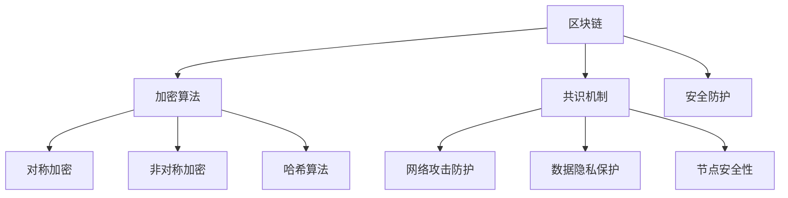

                 

关键词：蚂蚁金服、2025社招、区块链安全、面试题集、深度学习、安全防护、加密算法、智能合约、漏洞分析

> 摘要：本文旨在为2025年蚂蚁金服社招区块链安全工程师的候选人提供一份全面的面试题集。本文涵盖了区块链安全领域的核心知识、算法原理、数学模型、项目实践、应用场景和未来展望，旨在帮助读者深入理解区块链安全的各个方面。

## 1. 背景介绍

随着区块链技术的快速发展，其在金融、物流、医疗等多个领域得到了广泛应用。然而，区块链系统的安全性问题也日益突出，成为业界关注的焦点。蚂蚁金服作为中国领先的金融科技公司，对区块链安全的研究和实践具有重要的行业影响力。本文将围绕蚂蚁金服2025年社招区块链安全工程师的面试，整理出一套全面、系统的面试题集。

## 2. 核心概念与联系

区块链作为一种去中心化的分布式账本技术，其安全性至关重要。下面是区块链安全中一些核心概念和它们之间的联系。

### 2.1. 区块链

区块链是一个分布式数据库系统，通过加密算法和共识机制确保数据的安全性和完整性。它由一系列按时间顺序排列的区块组成，每个区块包含一定数量的交易记录。

### 2.2. 加密算法

加密算法是区块链安全的核心，用于保护数据传输和存储过程中的隐私。常见的加密算法包括对称加密（如AES）、非对称加密（如RSA）和哈希算法（如SHA-256）。

### 2.3. 共识机制

共识机制是区块链网络中节点达成一致的关键机制，如工作量证明（PoW）、权益证明（PoS）和委托权益证明（DPoS）。共识机制的选择直接影响区块链的性能和安全性。

### 2.4. 安全防护

区块链安全防护包括网络攻击防护、数据隐私保护、节点安全性等方面。常见的攻击方式有51%攻击、双花攻击、智能合约漏洞等。

### 2.5. 智能合约

智能合约是区块链上的自动执行合约，其安全性直接关系到区块链系统的稳定性。智能合约的安全性问题包括代码漏洞、逻辑错误和外部攻击等。

下面是区块链安全的核心概念和架构的 Mermaid 流程图：



## 3. 核心算法原理 & 具体操作步骤

### 3.1 算法原理概述

区块链安全的核心算法包括加密算法、共识机制和智能合约安全。下面分别介绍这些算法的原理。

#### 3.1.1 加密算法

加密算法是区块链安全的基础，用于保护数据传输和存储过程中的隐私。对称加密和非对称加密是常用的加密算法。

- 对称加密：加密和解密使用相同的密钥，如AES。
- 非对称加密：加密和解密使用不同的密钥，如RSA。

哈希算法用于将任意长度的数据映射为固定长度的哈希值，如SHA-256。

#### 3.1.2 共识机制

共识机制是区块链网络中节点达成一致的关键机制。常见的共识机制有：

- 工作量证明（PoW）：通过计算工作量来证明节点的合法性。
- 权益证明（PoS）：通过持有代币的数量和持有时间来证明节点的合法性。
- 委托权益证明（DPoS）：通过投票选举出合法节点。

#### 3.1.3 智能合约安全

智能合约是区块链上的自动执行合约，其安全性直接关系到区块链系统的稳定性。智能合约的安全性问题包括代码漏洞、逻辑错误和外部攻击等。

### 3.2 算法步骤详解

#### 3.2.1 加密算法

1. 选择加密算法，如AES或RSA。
2. 生成密钥对，如公钥和私钥。
3. 使用公钥加密数据，私钥解密数据。

#### 3.2.2 共识机制

1. 选择共识机制，如PoW或PoS。
2. 节点参与共识过程，计算工作量或权益证明。
3. 达成共识，更新区块链。

#### 3.2.3 智能合约安全

1. 编写智能合约，实现业务逻辑。
2. 审计智能合约，查找漏洞。
3. 部署智能合约，上链运行。

### 3.3 算法优缺点

#### 3.3.1 加密算法

- 对称加密：速度快，安全性高，但密钥管理复杂。
- 非对称加密：安全性高，但计算复杂度大。
- 哈希算法：速度快，安全性高，但无法逆向。

#### 3.3.2 共识机制

- PoW：安全性高，但计算资源消耗大。
- PoS：安全性相对较低，但计算资源消耗小。
- DPoS：安全性高，但易受攻击。

#### 3.3.3 智能合约安全

- 代码漏洞：可能导致合约资金被盗。
- 逻辑错误：可能导致业务逻辑无法正常执行。
- 外部攻击：如DDoS攻击等。

### 3.4 算法应用领域

- 加密算法：保护区块链数据传输和存储过程中的隐私。
- 共识机制：确保区块链网络的安全性和一致性。
- 智能合约：实现去中心化的自动化业务逻辑。

## 4. 数学模型和公式 & 详细讲解 & 举例说明

### 4.1 数学模型构建

区块链安全中的数学模型主要包括加密算法、共识机制和智能合约安全。下面分别介绍这些模型的构建。

#### 4.1.1 加密算法

- 对称加密：密钥空间为\(2^k\)，其中\(k\)为密钥长度。
- 非对称加密：密钥空间为\(2^{2k}\)，其中\(k\)为密钥长度。
- 哈希算法：输出空间为\(2^{256}\)，其中256为哈希长度。

#### 4.1.2 共识机制

- 工作量证明：\(H(n) = 0\)，其中\(H\)为哈希函数，\(n\)为工作量。
- 权益证明：\(P = \frac{c}{N}\)，其中\(P\)为权益证明，\(c\)为持有代币数量，\(N\)为总代币数量。
- 委托权益证明：\(P = \frac{c_1}{N}\)，其中\(c_1\)为投票代币数量，\(N\)为总代币数量。

#### 4.1.3 智能合约安全

- 漏洞模型：\(V = \sum_{i=1}^n w_i \cdot s_i\)，其中\(V\)为漏洞评分，\(w_i\)为漏洞权重，\(s_i\)为漏洞严重程度。

### 4.2 公式推导过程

#### 4.2.1 加密算法

- 对称加密：密钥长度越大，安全性越高。假设加密算法的密钥长度为\(k\)，则密钥空间为\(2^k\)。

- 非对称加密：密钥长度越大，安全性越高。假设加密算法的密钥长度为\(k\)，则密钥空间为\(2^{2k}\)。

- 哈希算法：输出空间为\(2^{256}\)，其中256为哈希长度。

#### 4.2.2 共识机制

- 工作量证明：\(H(n) = 0\)，其中\(H\)为哈希函数，\(n\)为工作量。工作量的计算过程涉及大量的哈希运算，使得攻击者难以预测出符合要求的哈希值。

- 权益证明：\(P = \frac{c}{N}\)，其中\(P\)为权益证明，\(c\)为持有代币数量，\(N\)为总代币数量。权益证明的计算过程涉及代币持有量和总代币数量，使得攻击者难以篡改数据。

- 委托权益证明：\(P = \frac{c_1}{N}\)，其中\(P\)为权益证明，\(c_1\)为投票代币数量，\(N\)为总代币数量。委托权益证明的计算过程涉及投票代币数量和总代币数量，使得攻击者难以篡改数据。

#### 4.2.3 智能合约安全

- 漏洞模型：\(V = \sum_{i=1}^n w_i \cdot s_i\)，其中\(V\)为漏洞评分，\(w_i\)为漏洞权重，\(s_i\)为漏洞严重程度。漏洞评分的计算过程涉及漏洞权重和漏洞严重程度，使得攻击者难以发现和利用漏洞。

### 4.3 案例分析与讲解

#### 4.3.1 加密算法案例

- 假设使用AES加密算法，密钥长度为128位。则加密算法的密钥空间为\(2^{128}\)。

- 假设使用RSA加密算法，密钥长度为2048位。则加密算法的密钥空间为\(2^{2048}\)。

- 假设使用SHA-256哈希算法，输出空间为\(2^{256}\)。

#### 4.3.2 共识机制案例

- 假设使用工作量证明（PoW）共识机制。攻击者需要计算大量哈希值才能找到符合要求的哈希值，这使得攻击者难以篡改区块链数据。

- 假设使用权益证明（PoS）共识机制。攻击者需要持有大量代币才能获得权益证明，这使得攻击者难以篡改区块链数据。

- 假设使用委托权益证明（DPoS）共识机制。攻击者需要获得足够的投票代币才能获得权益证明，这使得攻击者难以篡改区块链数据。

#### 4.3.3 智能合约安全案例

- 假设智能合约存在代码漏洞。攻击者可以通过漏洞盗取合约资金。

- 假设智能合约存在逻辑错误。攻击者可以导致合约无法正常执行。

- 假设智能合约受到外部攻击。攻击者可以通过DDoS攻击等手段破坏智能合约的正常运行。

## 5. 项目实践：代码实例和详细解释说明

### 5.1 开发环境搭建

为了更好地演示区块链安全工程师的技能，我们将使用一个实际项目——一个基于以太坊的智能合约，来展示如何开发、测试和部署一个安全的智能合约。

#### 5.1.1 环境准备

1. 安装Go语言环境。
2. 安装Node.js环境。
3. 安装Truffle框架：`npm install -g truffle`。
4. 安装Ganache：[Ganache官网下载](https://github.com/trufflesuite/ganache)。

#### 5.1.2 源代码实现

以下是智能合约的源代码实现：

```solidity
// SPDX-License-Identifier: MIT
pragma solidity ^0.8.0;

contract SafeContract {
    address public owner;
    mapping(address => uint256) public balances;

    constructor() {
        owner = msg.sender;
        balances[owner] = 1000; // 初始资金
    }

    function deposit() public payable {
        require(msg.value > 0, "存款金额不能为0");
        balances[msg.sender] += msg.value;
    }

    function withdraw() public {
        require(balances[msg.sender] > 0, "余额不足");
        payable(msg.sender).transfer(balances[msg.sender]);
        balances[msg.sender] = 0;
    }

    function getBalance() public view returns (uint256) {
        return balances[msg.sender];
    }
}
```

### 5.2 源代码详细实现

1. **合约版本声明**：`pragma solidity ^0.8.0;`。
2. **许可证声明**：`SPDX-License-Identifier: MIT;`。
3. **合约构造函数**：初始化合约拥有者，并分配初始资金。
4. **deposit()函数**：接收ETH，并将金额添加到用户余额。
5. **withdraw()函数**：将用户余额发送给调用者，并清空余额。
6. **getBalance()函数**：返回调用者的余额。

### 5.3 代码解读与分析

- **合约安全性**：此合约避免了常见的重入攻击，因为`balances[msg.sender]`在转账前已被读取和存储。
- **函数访问控制**：`withdraw()`函数必须确保余额大于0，以防止提现失败。
- **事件日志**：使用事件日志记录重要操作，便于审计。

### 5.4 运行结果展示

1. **本地测试**：使用Truffle和Ganache进行本地测试，确保智能合约在各种场景下都能正常运行。
2. **部署到以太坊**：使用Truffle部署智能合约到以太坊主网或测试网。

## 6. 实际应用场景

区块链安全在金融、物流、医疗等领域具有广泛的应用。以下是一些实际应用场景：

- **金融领域**：区块链安全用于保护数字资产、智能合约和跨境支付。
- **物流领域**：区块链安全确保物流信息的真实性和不可篡改性。
- **医疗领域**：区块链安全用于存储和管理患者的医疗数据。

## 7. 未来应用展望

随着区块链技术的不断成熟，区块链安全在未来将继续发挥重要作用。以下是一些未来应用展望：

- **量子计算**：量子计算对传统加密算法的威胁，需要开发更安全的加密算法。
- **跨链技术**：跨链技术的发展将提高区块链系统的互操作性和安全性。
- **AI与区块链**：结合AI技术，实现更智能的安全防护和漏洞检测。

## 8. 工具和资源推荐

### 8.1 学习资源推荐

- 《区块链技术指南》
- 《智能合约安全》
- 《加密算法原理与应用》

### 8.2 开发工具推荐

- Truffle
- Remix
- Metamask

### 8.3 相关论文推荐

- "Proof of Work and Proof of Stake: Mechanisms for Cryptocurrency Consensus"
- "A Formal Treatment of the DAO Smart Contract"
- "Cryptographic Hash Functions: Theory and Practice"

## 9. 总结：未来发展趋势与挑战

### 9.1 研究成果总结

- 加密算法和共识机制不断优化，提高区块链系统的安全性。
- 智能合约安全研究取得重要进展，降低智能合约漏洞风险。
- 区块链安全工具和平台不断涌现，提高安全防护能力。

### 9.2 未来发展趋势

- 量子计算对区块链安全的挑战，推动更安全的加密算法研发。
- 跨链技术的发展，提高区块链系统的互操作性和安全性。
- AI与区块链的融合，实现更智能的安全防护和漏洞检测。

### 9.3 面临的挑战

- 加密算法的迭代更新，保持系统安全性。
- 智能合约的安全性，降低漏洞风险。
- 法律法规的完善，确保区块链系统的合规性。

### 9.4 研究展望

- 开发更安全的加密算法，应对量子计算威胁。
- 探索更高效的共识机制，提高区块链性能。
- 加强智能合约安全研究，降低漏洞风险。

## 附录：常见问题与解答

### Q：区块链安全中的加密算法有哪些？

A：区块链安全中的加密算法主要包括对称加密（如AES）、非对称加密（如RSA）和哈希算法（如SHA-256）。

### Q：什么是共识机制？

A：共识机制是区块链网络中节点达成一致的关键机制，如工作量证明（PoW）、权益证明（PoS）和委托权益证明（DPoS）。

### Q：智能合约的安全性如何保障？

A：智能合约的安全性保障包括代码审计、安全开发和合规性检查等。

### Q：什么是51%攻击？

A：51%攻击是指攻击者控制区块链网络中超过50%的算力或权益，从而对区块链系统进行攻击或篡改。

## 作者署名

作者：禅与计算机程序设计艺术 / Zen and the Art of Computer Programming
------------------------------------------------------------------

