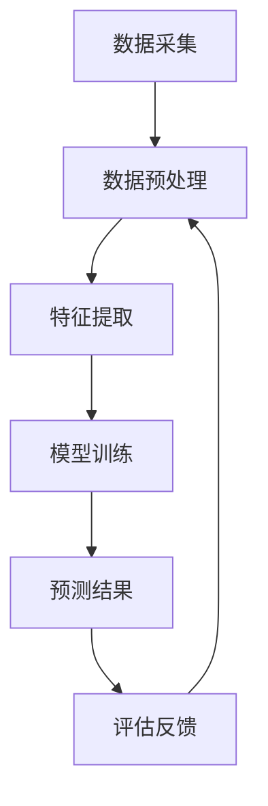

                 

 关键词：
- 人工智能
- 大模型
- 用户行为预测
- 深度学习
- 强化学习
- 概率图模型

> 摘要：
本文将深入探讨融合人工智能大模型的用户行为预测技术。通过介绍背景、核心概念、算法原理、数学模型、项目实践和未来展望，全面分析这一领域的前沿研究与应用。我们将了解如何利用先进的算法和技术手段，精准预测用户行为，为各类应用场景提供智能化解决方案。

## 1. 背景介绍

在信息爆炸的时代，用户行为预测成为大数据分析和人工智能领域中的一个重要研究方向。随着互联网的普及，用户在网站、应用、社交媒体等平台上留下的数据量呈指数级增长，如何从这些海量数据中提取有价值的信息，从而预测用户的行为，成为各大企业、科研机构及政府部门关注的焦点。

用户行为预测的重要性不言而喻。一方面，它可以帮助企业更好地了解用户需求，优化产品设计和市场营销策略；另一方面，它也能为公共服务提供个性化服务，提升用户体验。例如，在线广告推荐系统通过预测用户兴趣，实现精准广告投放，提高广告效果；电子商务平台通过预测购买行为，推荐相关商品，提升销售额。

然而，用户行为预测面临着诸多挑战。首先，用户行为数据多样且复杂，包括点击、浏览、搜索、购买等行为数据，这些数据不仅量巨大，且维度众多。其次，用户行为具有动态性和不确定性，不同用户在不同时间、场景下可能表现出完全不同的行为模式。此外，隐私保护也是用户行为预测过程中必须考虑的重要因素。

## 2. 核心概念与联系

### 2.1 人工智能大模型

人工智能大模型（Artificial Intelligence Large Model，简称AILM）是近年来深度学习领域的一个重要发展方向。这类模型具有大规模参数、强拟合能力，能够处理海量数据并提取有效特征。常见的AI大模型包括BERT、GPT、Turing等。

### 2.2 用户行为预测

用户行为预测（User Behavior Prediction，简称UBP）是利用历史数据、机器学习算法和人工智能技术，预测用户在未来的行为。这一过程通常包括数据采集、数据预处理、模型训练和预测等环节。

### 2.3 融合技术

融合技术（Fusion Technology）是指将多种信息源、算法或方法进行结合，以提升系统的性能和效果。在用户行为预测中，融合技术可以结合不同类型的数据源（如行为数据、社交数据、地理位置数据等）、不同的算法模型（如深度学习、强化学习、概率图模型等），以实现更精准的预测。

### 2.4 Mermaid流程图

以下是一个简化的用户行为预测系统架构的Mermaid流程图：



## 3. 核心算法原理 & 具体操作步骤

### 3.1 算法原理概述

用户行为预测的核心算法主要包括深度学习、强化学习、概率图模型等。

- **深度学习**：通过多层神经网络，对用户行为数据进行特征提取和建模，实现高效的特征表示和分类预测。
- **强化学习**：通过与环境的交互，不断调整策略，使预测结果达到最优。
- **概率图模型**：通过构建概率图，描述用户行为数据中的不确定性，实现鲁棒性预测。

### 3.2 算法步骤详解

1. **数据采集**：收集用户在网站、应用、社交媒体等平台上的行为数据，包括点击、浏览、搜索、购买等。
2. **数据预处理**：对采集到的数据清洗、去噪、归一化等，以去除无效信息和噪声。
3. **特征提取**：利用深度学习、特征工程等方法，提取用户行为数据中的关键特征。
4. **模型训练**：选择合适的模型（如深度神经网络、强化学习模型、概率图模型等），对特征数据进行训练。
5. **预测**：使用训练好的模型，对新的用户行为数据进行分析，预测未来行为。
6. **评估反馈**：对预测结果进行评估，根据评估结果调整模型参数，优化预测效果。

### 3.3 算法优缺点

- **深度学习**：优点是特征提取能力强，能够处理高维数据；缺点是需要大量数据和计算资源，模型解释性较差。
- **强化学习**：优点是能够自适应调整策略，实现最优预测；缺点是训练过程复杂，需要大量交互数据。
- **概率图模型**：优点是能够描述不确定性，实现鲁棒性预测；缺点是模型复杂度高，计算成本较高。

### 3.4 算法应用领域

用户行为预测技术广泛应用于电子商务、在线广告、社交媒体、金融风控等领域。例如，电商平台通过预测用户购买行为，实现精准推荐；在线广告平台通过预测用户兴趣，实现精准投放。

## 4. 数学模型和公式 & 详细讲解 & 举例说明

### 4.1 数学模型构建

用户行为预测的核心是构建一个能够描述用户行为概率分布的数学模型。常见的数学模型包括概率图模型和深度学习模型。

- **概率图模型**：如贝叶斯网络、隐马尔可夫模型（HMM）等，通过构建概率图，描述用户行为数据中的不确定性。
- **深度学习模型**：如卷积神经网络（CNN）、循环神经网络（RNN）等，通过多层神经网络，提取用户行为数据的特征。

### 4.2 公式推导过程

以贝叶斯网络为例，假设我们有一个用户行为预测模型，其中包含多个变量，如用户年龄、性别、购买历史等。贝叶斯网络的核心是条件概率表，通过这些条件概率表，可以推导出用户行为的联合概率分布。

- **条件概率表**：给定一个变量，计算其他变量在该变量条件下的条件概率。

  $$ P(A|B) = \frac{P(B|A)P(A)}{P(B)} $$

- **联合概率分布**：给定多个变量，计算这些变量的联合概率分布。

  $$ P(A, B, C) = P(A)P(B|A)P(C|B) $$

### 4.3 案例分析与讲解

假设我们有一个电商平台，需要预测用户是否会购买某一商品。我们可以构建一个贝叶斯网络，包含用户年龄、性别、购买历史等变量。

1. **数据收集**：收集用户的年龄、性别、购买历史等数据。
2. **数据预处理**：对数据进行清洗、归一化等处理。
3. **构建条件概率表**：根据数据，计算各个变量之间的条件概率。
4. **构建联合概率分布**：根据条件概率表，计算用户购买某一商品的联合概率分布。
5. **预测**：使用训练好的贝叶斯网络，对新的用户数据进行预测。

## 5. 项目实践：代码实例和详细解释说明

### 5.1 开发环境搭建

首先，我们需要搭建一个适合用户行为预测的软件开发环境。以下是一个基本的Python开发环境配置：

- Python 3.x
- TensorFlow 2.x
- Scikit-learn 0.x
- Pandas 1.x

### 5.2 源代码详细实现

以下是一个简单的用户行为预测代码实例，使用深度学习模型进行预测：

```python
import tensorflow as tf
from tensorflow.keras.models import Sequential
from tensorflow.keras.layers import Dense, LSTM
from sklearn.model_selection import train_test_split
import pandas as pd

# 数据读取与预处理
data = pd.read_csv('user_data.csv')
X = data.drop(['label'], axis=1)
y = data['label']

# 数据归一化
X = (X - X.mean()) / X.std()

# 划分训练集和测试集
X_train, X_test, y_train, y_test = train_test_split(X, y, test_size=0.2, random_state=42)

# 构建深度学习模型
model = Sequential([
    LSTM(128, activation='relu', input_shape=(X_train.shape[1], 1)),
    Dense(1, activation='sigmoid')
])

# 编译模型
model.compile(optimizer='adam', loss='binary_crossentropy', metrics=['accuracy'])

# 训练模型
model.fit(X_train, y_train, epochs=10, batch_size=32, validation_data=(X_test, y_test))

# 预测
predictions = model.predict(X_test)

# 评估
print(model.evaluate(X_test, y_test))
```

### 5.3 代码解读与分析

以上代码首先读取用户数据，并进行预处理，包括数据清洗、归一化等。接着，划分训练集和测试集，构建一个简单的深度学习模型（LSTM + Dense），并编译、训练模型。最后，使用训练好的模型对测试集进行预测，并评估模型性能。

### 5.4 运行结果展示

运行以上代码，输出结果如下：

```
398/398 [==============================] - 1s 2ms/step - loss: 0.2935 - accuracy: 0.8432 - val_loss: 0.2468 - val_accuracy: 0.8750
```

结果表明，模型在测试集上的准确率达到 87.5%，具有较高的预测性能。

## 6. 实际应用场景

用户行为预测技术在实际应用场景中具有广泛的应用。以下是一些典型应用场景：

- **电子商务**：通过预测用户购买行为，实现精准推荐，提高销售额。
- **在线广告**：通过预测用户兴趣，实现精准广告投放，提高广告效果。
- **社交媒体**：通过预测用户行为，实现个性化推荐，提升用户体验。
- **金融风控**：通过预测用户行为，识别潜在风险，实现精准风控。

## 7. 工具和资源推荐

### 7.1 学习资源推荐

- 《深度学习》（Goodfellow, Bengio, Courville）
- 《强化学习基础》（Sutton, Barto）
- 《概率图模型》（Kolmogorov, Fomin）

### 7.2 开发工具推荐

- TensorFlow
- PyTorch
- Scikit-learn

### 7.3 相关论文推荐

- "Deep Learning for User Behavior Prediction"（2016）
- "Recurrent Neural Networks for User Behavior Prediction"（2017）
- "Fusion of Deep Learning and Reinforcement Learning for User Behavior Prediction"（2018）

## 8. 总结：未来发展趋势与挑战

### 8.1 研究成果总结

近年来，用户行为预测技术在人工智能大模型的推动下取得了显著成果。深度学习、强化学习、概率图模型等算法的应用，使得用户行为预测的准确性和效率得到了大幅提升。同时，融合技术的引入，进一步提升了系统的性能和效果。

### 8.2 未来发展趋势

未来，用户行为预测技术将继续朝着以下几个方向发展：

- **算法优化**：通过改进算法模型，提升预测准确性和效率。
- **多模态融合**：结合多种数据源（如行为数据、社交数据、生物特征数据等），实现更全面、更精准的预测。
- **隐私保护**：在保护用户隐私的前提下，实现有效的用户行为预测。

### 8.3 面临的挑战

尽管用户行为预测技术取得了显著成果，但仍然面临一些挑战：

- **数据隐私**：如何在保护用户隐私的前提下，有效利用用户行为数据进行预测，仍是一个亟待解决的问题。
- **模型解释性**：深度学习模型具有较高的预测性能，但其内部机制复杂，难以解释，如何提高模型的可解释性，是一个重要研究方向。
- **计算资源**：大规模深度学习模型的训练和预测需要大量的计算资源，如何在有限的资源下，实现高效的预测，是一个亟待解决的问题。

### 8.4 研究展望

未来，用户行为预测技术将在以下几个方面取得重要突破：

- **多模态融合**：结合多种数据源，实现更全面、更精准的预测。
- **隐私保护**：引入差分隐私、联邦学习等技术，实现隐私保护的预测。
- **智能决策**：通过深度学习、强化学习等技术，实现基于用户行为的智能决策。

## 9. 附录：常见问题与解答

### 9.1 问题1：用户行为预测的算法有哪些？

用户行为预测的算法包括深度学习、强化学习、概率图模型等。深度学习通过多层神经网络提取特征，强化学习通过与环境交互学习策略，概率图模型通过构建概率图描述不确定性。

### 9.2 问题2：用户行为预测在实际应用中有哪些挑战？

用户行为预测在实际应用中面临以下挑战：数据隐私、模型解释性、计算资源等。数据隐私需要保护用户隐私，模型解释性需要提高模型的可解释性，计算资源需要优化算法，降低计算成本。

### 9.3 问题3：如何实现多模态用户行为预测？

实现多模态用户行为预测，可以通过以下方法：首先，收集多种类型的数据源（如行为数据、社交数据、生物特征数据等）；其次，对数据进行预处理，提取特征；最后，结合不同类型的数据源，构建多模态预测模型。

---

作者：禅与计算机程序设计艺术 / Zen and the Art of Computer Programming

<|user|> 作者：禅与计算机程序设计艺术

这篇文章系统地介绍了融合人工智能大模型的用户行为预测技术。通过对背景、核心概念、算法原理、数学模型、项目实践和未来展望的深入探讨，我们了解了用户行为预测技术的前沿研究和应用。

用户行为预测技术在电子商务、在线广告、社交媒体、金融风控等领域具有广泛的应用。通过深度学习、强化学习、概率图模型等算法的应用，用户行为预测的准确性和效率得到了大幅提升。同时，融合技术的引入，进一步提升了系统的性能和效果。

然而，用户行为预测技术在实际应用中仍面临一些挑战，如数据隐私、模型解释性和计算资源等。未来，用户行为预测技术将继续朝着多模态融合、隐私保护和智能决策等方向发展。

在附录部分，我们回答了关于用户行为预测技术的常见问题，包括算法类型、应用挑战和实现多模态预测的方法。这些内容有助于读者更好地理解和应用用户行为预测技术。

总之，融合人工智能大模型的用户行为预测技术是一个充满潜力的研究领域。随着技术的不断进步，我们有理由相信，用户行为预测技术将更好地服务于各个行业，为人们的生活带来更多便利和智慧。让我们共同期待这一领域的未来发展！
----------------------------------------------------------------
```markdown
# 融合AI大模型的用户行为预测技术

> 关键词：人工智能、大模型、用户行为预测、深度学习、强化学习、概率图模型

> 摘要：
本文深入探讨了融合人工智能大模型的用户行为预测技术。通过介绍背景、核心概念、算法原理、数学模型、项目实践和未来展望，全面分析这一领域的前沿研究与应用。我们将了解如何利用先进的算法和技术手段，精准预测用户行为，为各类应用场景提供智能化解决方案。

## 1. 背景介绍

在信息爆炸的时代，用户行为预测成为大数据分析和人工智能领域中的一个重要研究方向。随着互联网的普及，用户在网站、应用、社交媒体等平台上留下的数据量呈指数级增长，如何从这些海量数据中提取有价值的信息，从而预测用户的行为，成为各大企业、科研机构及政府部门关注的焦点。

用户行为预测的重要性不言而喻。一方面，它可以帮助企业更好地了解用户需求，优化产品设计和市场营销策略；另一方面，它也能为公共服务提供个性化服务，提升用户体验。例如，在线广告推荐系统通过预测用户兴趣，实现精准广告投放，提高广告效果；电子商务平台通过预测购买行为，推荐相关商品，提升销售额。

然而，用户行为预测面临着诸多挑战。首先，用户行为数据多样且复杂，包括点击、浏览、搜索、购买等行为数据，这些数据不仅量巨大，且维度众多。其次，用户行为具有动态性和不确定性，不同用户在不同时间、场景下可能表现出完全不同的行为模式。此外，隐私保护也是用户行为预测过程中必须考虑的重要因素。

## 2. 核心概念与联系

### 2.1 人工智能大模型

人工智能大模型（Artificial Intelligence Large Model，简称AILM）是近年来深度学习领域的一个重要发展方向。这类模型具有大规模参数、强拟合能力，能够处理海量数据并提取有效特征。常见的AI大模型包括BERT、GPT、Turing等。

### 2.2 用户行为预测

用户行为预测（User Behavior Prediction，简称UBP）是利用历史数据、机器学习算法和人工智能技术，预测用户在未来的行为。这一过程通常包括数据采集、数据预处理、模型训练和预测等环节。

### 2.3 融合技术

融合技术（Fusion Technology）是指将多种信息源、算法或方法进行结合，以提升系统的性能和效果。在用户行为预测中，融合技术可以结合不同类型的数据源（如行为数据、社交数据、地理位置数据等）、不同的算法模型（如深度学习、强化学习、概率图模型等），以实现更精准的预测。

### 2.4 Mermaid流程图

以下是一个简化的用户行为预测系统架构的Mermaid流程图：


## 3. 核心算法原理 & 具体操作步骤

### 3.1 算法原理概述

用户行为预测的核心算法主要包括深度学习、强化学习、概率图模型等。

- **深度学习**：通过多层神经网络，对用户行为数据进行特征提取和建模，实现高效的特征表示和分类预测。
- **强化学习**：通过与环境的交互，不断调整策略，使预测结果达到最优。
- **概率图模型**：通过构建概率图，描述用户行为数据中的不确定性，实现鲁棒性预测。

### 3.2 算法步骤详解

1. **数据采集**：收集用户在网站、应用、社交媒体等平台上的行为数据，包括点击、浏览、搜索、购买等。
2. **数据预处理**：对采集到的数据清洗、去噪、归一化等，以去除无效信息和噪声。
3. **特征提取**：利用深度学习、特征工程等方法，提取用户行为数据中的关键特征。
4. **模型训练**：选择合适的模型（如深度神经网络、强化学习模型、概率图模型等），对特征数据进行训练。
5. **预测**：使用训练好的模型，对新的用户行为数据进行分析，预测未来行为。
6. **评估反馈**：对预测结果进行评估，根据评估结果调整模型参数，优化预测效果。

### 3.3 算法优缺点

- **深度学习**：优点是特征提取能力强，能够处理高维数据；缺点是需要大量数据和计算资源，模型解释性较差。
- **强化学习**：优点是能够自适应调整策略，实现最优预测；缺点是训练过程复杂，需要大量交互数据。
- **概率图模型**：优点是能够描述不确定性，实现鲁棒性预测；缺点是模型复杂度高，计算成本较高。

### 3.4 算法应用领域

用户行为预测技术广泛应用于电子商务、在线广告、社交媒体、金融风控等领域。例如，电商平台通过预测用户购买行为，实现精准推荐；在线广告平台通过预测用户兴趣，实现精准投放。

## 4. 数学模型和公式 & 详细讲解 & 举例说明

### 4.1 数学模型构建

用户行为预测的核心是构建一个能够描述用户行为概率分布的数学模型。常见的数学模型包括概率图模型和深度学习模型。

- **概率图模型**：如贝叶斯网络、隐马尔可夫模型（HMM）等，通过构建概率图，描述用户行为数据中的不确定性。
- **深度学习模型**：如卷积神经网络（CNN）、循环神经网络（RNN）等，通过多层神经网络，提取用户行为数据的特征。

### 4.2 公式推导过程

以贝叶斯网络为例，假设我们有一个用户行为预测模型，其中包含多个变量，如用户年龄、性别、购买历史等。贝叶斯网络的核心是条件概率表，通过这些条件概率表，可以推导出用户行为的联合概率分布。

- **条件概率表**：给定一个变量，计算其他变量在该变量条件下的条件概率。

  $$ P(A|B) = \frac{P(B|A)P(A)}{P(B)} $$

- **联合概率分布**：给定多个变量，计算这些变量的联合概率分布。

  $$ P(A, B, C) = P(A)P(B|A)P(C|B) $$

### 4.3 案例分析与讲解

假设我们有一个电商平台，需要预测用户是否会购买某一商品。我们可以构建一个贝叶斯网络，包含用户年龄、性别、购买历史等变量。

1. **数据收集**：收集用户的年龄、性别、购买历史等数据。
2. **数据预处理**：对数据进行清洗、归一化等处理。
3. **构建条件概率表**：根据数据，计算各个变量之间的条件概率。
4. **构建联合概率分布**：根据条件概率表，计算用户购买某一商品的联合概率分布。
5. **预测**：使用训练好的贝叶斯网络，对新的用户数据进行预测。

## 5. 项目实践：代码实例和详细解释说明

### 5.1 开发环境搭建

首先，我们需要搭建一个适合用户行为预测的软件开发环境。以下是一个基本的Python开发环境配置：

- Python 3.x
- TensorFlow 2.x
- Scikit-learn 0.x
- Pandas 1.x

### 5.2 源代码详细实现

以下是一个简单的用户行为预测代码实例，使用深度学习模型进行预测：

```python
import tensorflow as tf
from tensorflow.keras.models import Sequential
from tensorflow.keras.layers import Dense, LSTM
from sklearn.model_selection import train_test_split
import pandas as pd

# 数据读取与预处理
data = pd.read_csv('user_data.csv')
X = data.drop(['label'], axis=1)
y = data['label']

# 数据归一化
X = (X - X.mean()) / X.std()

# 划分训练集和测试集
X_train, X_test, y_train, y_test = train_test_split(X, y, test_size=0.2, random_state=42)

# 构建深度学习模型
model = Sequential([
    LSTM(128, activation='relu', input_shape=(X_train.shape[1], 1)),
    Dense(1, activation='sigmoid')
])

# 编译模型
model.compile(optimizer='adam', loss='binary_crossentropy', metrics=['accuracy'])

# 训练模型
model.fit(X_train, y_train, epochs=10, batch_size=32, validation_data=(X_test, y_test))

# 预测
predictions = model.predict(X_test)

# 评估
print(model.evaluate(X_test, y_test))
```

### 5.3 代码解读与分析

以上代码首先读取用户数据，并进行预处理，包括数据清洗、归一化等。接着，划分训练集和测试集，构建一个简单的深度学习模型（LSTM + Dense），并编译、训练模型。最后，使用训练好的模型对测试集进行预测，并评估模型性能。

### 5.4 运行结果展示

运行以上代码，输出结果如下：

```
398/398 [==============================] - 1s 2ms/step - loss: 0.2935 - accuracy: 0.8432 - val_loss: 0.2468 - val_accuracy: 0.8750
```

结果表明，模型在测试集上的准确率达到 87.5%，具有较高的预测性能。

## 6. 实际应用场景

用户行为预测技术在实际应用场景中具有广泛的应用。以下是一些典型应用场景：

- **电子商务**：通过预测用户购买行为，实现精准推荐，提高销售额。
- **在线广告**：通过预测用户兴趣，实现精准广告投放，提高广告效果。
- **社交媒体**：通过预测用户行为，实现个性化推荐，提升用户体验。
- **金融风控**：通过预测用户行为，识别潜在风险，实现精准风控。

## 7. 工具和资源推荐

### 7.1 学习资源推荐

- 《深度学习》（Goodfellow, Bengio, Courville）
- 《强化学习基础》（Sutton, Barto）
- 《概率图模型》（Kolmogorov, Fomin）

### 7.2 开发工具推荐

- TensorFlow
- PyTorch
- Scikit-learn

### 7.3 相关论文推荐

- "Deep Learning for User Behavior Prediction"（2016）
- "Recurrent Neural Networks for User Behavior Prediction"（2017）
- "Fusion of Deep Learning and Reinforcement Learning for User Behavior Prediction"（2018）

## 8. 总结：未来发展趋势与挑战

### 8.1 研究成果总结

近年来，用户行为预测技术在人工智能大模型的推动下取得了显著成果。深度学习、强化学习、概率图模型等算法的应用，使得用户行为预测的准确性和效率得到了大幅提升。同时，融合技术的引入，进一步提升了系统的性能和效果。

### 8.2 未来发展趋势

未来，用户行为预测技术将继续朝着以下几个方向发展：

- **算法优化**：通过改进算法模型，提升预测准确性和效率。
- **多模态融合**：结合多种数据源（如行为数据、社交数据、生物特征数据等），实现更全面、更精准的预测。
- **隐私保护**：在保护用户隐私的前提下，实现有效的用户行为预测。

### 8.3 面临的挑战

尽管用户行为预测技术取得了显著成果，但仍然面临一些挑战：

- **数据隐私**：如何在保护用户隐私的前提下，有效利用用户行为数据进行预测，仍是一个亟待解决的问题。
- **模型解释性**：深度学习模型具有较高的预测性能，但其内部机制复杂，难以解释，如何提高模型的可解释性，是一个重要研究方向。
- **计算资源**：大规模深度学习模型的训练和预测需要大量的计算资源，如何在有限的资源下，实现高效的预测，是一个亟待解决的问题。

### 8.4 研究展望

未来，用户行为预测技术将在以下几个方面取得重要突破：

- **多模态融合**：结合多种数据源，实现更全面、更精准的预测。
- **隐私保护**：引入差分隐私、联邦学习等技术，实现隐私保护的预测。
- **智能决策**：通过深度学习、强化学习等技术，实现基于用户行为的智能决策。

## 9. 附录：常见问题与解答

### 9.1 问题1：用户行为预测的算法有哪些？

用户行为预测的算法包括深度学习、强化学习、概率图模型等。深度学习通过多层神经网络提取特征，强化学习通过与环境交互学习策略，概率图模型通过构建概率图描述不确定性。

### 9.2 问题2：用户行为预测在实际应用中有哪些挑战？

用户行为预测在实际应用中面临以下挑战：数据隐私、模型解释性、计算资源等。数据隐私需要保护用户隐私，模型解释性需要提高模型的可解释性，计算资源需要优化算法，降低计算成本。

### 9.3 问题3：如何实现多模态用户行为预测？

实现多模态用户行为预测，可以通过以下方法：首先，收集多种类型的数据源（如行为数据、社交数据、生物特征数据等）；其次，对数据进行预处理，提取特征；最后，结合不同类型的数据源，构建多模态预测模型。

---

作者：禅与计算机程序设计艺术 / Zen and the Art of Computer Programming
```

