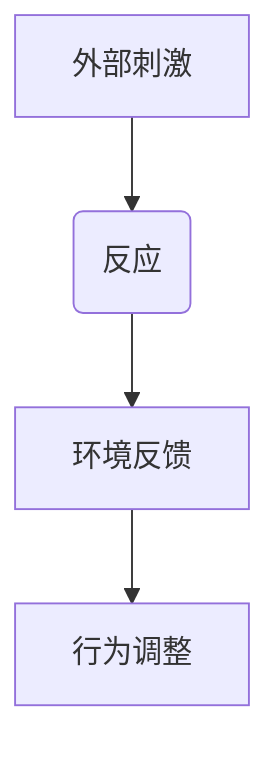
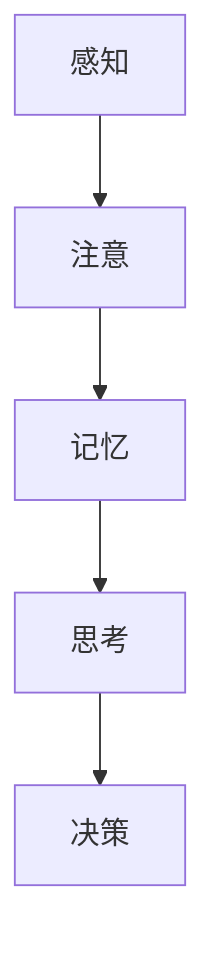

                 

关键词：行为主义，内在主义，认知科学，心理学，神经网络，机器学习

> 摘要：本文深入探讨了行为主义学派与内在主义学派在认知科学和心理学的理论差异及其在现代信息技术和人工智能领域的应用。通过对两者核心概念的详细解析，我们将揭示它们在理解人类行为、学习过程、决策机制等方面的不同观点，并探讨这些理论如何影响机器学习和神经网络的构建。

## 1. 背景介绍

行为主义学派和内在主义学派是认知科学和心理学的两个重要理论流派，它们在解释人类行为和认知过程中有着截然不同的观点。行为主义学派起源于20世纪初，其代表人物包括约翰·B·沃森（John B. Watson）和B.F. 斯金纳（B.F. Skinner）。该学派认为，行为是由外部刺激和反应之间的简单联结所决定的，个体的思维和内心体验是无关紧要的。相反，内在主义学派，尤其是认知心理学，强调内在心理过程，如记忆、注意和决策，认为这些过程是理解和解释人类行为的关键。

在信息技术和人工智能领域，这些理论的影响同样深远。行为主义学派的观点为计算机编程和人工智能的算法设计提供了直观的指导，而内在主义学派则推动了神经网络和机器学习的深入发展。本文将探讨这两种理论如何在现代信息技术中发挥作用，并分析它们各自的优缺点。

## 2. 核心概念与联系

### 2.1 行为主义学派

行为主义学派的核心概念是行为主义心理学，其基本原理可以概括为：

- **刺激-反应（S-R）联结**：行为是外部刺激和个体反应之间的直接联结。例如，当一个人看到红色的灯（S）时，他们可能会停下来（R）。

- **条件反射**：通过重复刺激和反应，个体可以在没有明显外部刺激的情况下产生条件反应。例如，狗听到铃声（S）会开始流口水（R），即使没有食物出现。

- **操作性条件反射**：行为是操作性的，它会影响环境，而环境反过来又影响行为。例如，如果一个孩子每次做对了题目就会得到奖励，那么他将来更可能再次做对题目。

Mermaid 流程图：



### 2.2 内在主义学派

内在主义学派的核心概念是认知心理学，其基本原理可以概括为：

- **内在心理过程**：认知心理学关注个体的内在心理活动，如感知、记忆、思考和决策。这些过程被认为是理解和解释人类行为的关键。

- **信息处理模型**：认知心理学家使用信息处理模型来模拟个体的思维过程。这些模型通常包括感知、记忆、注意、思考和问题解决等阶段。

- **心智模型**：内在主义学派认为，人们拥有一种心智模型，用来理解外部世界和做出决策。这种心智模型是基于内在的符号表示和推理过程。

Mermaid 流程图：



### 2.3 联系与对比

行为主义学派和内在主义学派在解释人类行为和认知方面有着不同的视角：

- **外部刺激与内在心理过程**：行为主义强调外部刺激和反应之间的直接联结，而内在主义强调内在心理过程的作用。

- **简单反应与复杂决策**：行为主义通常关注简单的刺激-反应联结，而内在主义则涉及复杂的认知过程，如决策和问题解决。

- **环境控制与心理理解**：行为主义倾向于通过改变环境来影响行为，而内在主义则试图理解个体的内在心理机制。

这两种理论之间的联系在于，它们都试图解释人类行为和认知。行为主义为理解和预测外部行为提供了实用框架，而内在主义则提供了理解内在心理过程的深入视角。在现代信息技术和人工智能中，这两种理论的应用各有侧重，但也可以相互补充。

## 3. 核心算法原理 & 具体操作步骤

### 3.1 算法原理概述

在现代信息技术和人工智能中，行为主义和内在主义学派的理论影响了多种算法和系统设计。以下是两个典型例子：

#### 3.1.1 基于行为主义的理论：强化学习

强化学习是一种基于行为主义理论的人工智能算法，它通过奖励和惩罚机制来指导智能体的行为，使其在环境中学习最优策略。其基本原理可以概括为：

- **奖励与惩罚**：智能体通过执行不同的动作来探索环境。如果动作导致了积极的结果，智能体会获得奖励；如果动作导致了消极的结果，智能体会受到惩罚。

- **策略更新**：智能体使用奖励和惩罚来更新其行为策略，以便在未来做出更好的决策。

#### 3.1.2 基于内在主义的理论：深度学习

深度学习是一种基于内在主义理论的人工智能算法，它通过模拟人脑的神经网络来学习复杂的数据特征和模式。其基本原理可以概括为：

- **多层神经网络**：深度学习使用多层神经网络来提取数据的层次特征。每层神经网络都会对输入数据进行特征提取和转换，从而逐渐构建对数据的深层理解。

- **反向传播算法**：深度学习使用反向传播算法来更新网络权重，使其能够更准确地预测数据。

### 3.2 算法步骤详解

#### 3.2.1 强化学习算法步骤

1. **初始化**：定义智能体的初始状态和动作集。

2. **环境交互**：智能体根据当前状态选择一个动作。

3. **奖励反馈**：环境对智能体的动作给出奖励或惩罚。

4. **策略更新**：智能体根据奖励反馈更新其动作策略。

5. **重复步骤2-4**，直到达到预定的学习目标或智能体达到饱和。

#### 3.2.2 深度学习算法步骤

1. **数据预处理**：将输入数据进行标准化和归一化，以便网络能够更好地学习。

2. **构建神经网络**：定义神经网络的结构，包括输入层、隐藏层和输出层。

3. **初始化权重**：随机初始化网络权重。

4. **前向传播**：将输入数据通过神经网络进行前向传播，计算输出结果。

5. **反向传播**：计算输出结果与真实值之间的误差，并使用反向传播算法更新网络权重。

6. **迭代训练**：重复步骤4和5，直到网络达到预定的误差阈值或迭代次数。

### 3.3 算法优缺点

#### 3.3.1 强化学习

**优点**：

- **适应性**：强化学习能够适应动态环境，通过持续的学习和策略更新来适应新的情况。

- **灵活性**：强化学习可以应用于多种不同类型的问题，如游戏、机器人控制和自动驾驶等。

**缺点**：

- **收敛速度慢**：强化学习通常需要大量的交互和试错来收敛到最优策略。

- **稀疏奖励问题**：在某些问题中，奖励可能非常稀疏，使得智能体难以找到最优策略。

#### 3.3.2 深度学习

**优点**：

- **高效性**：深度学习能够自动提取数据的层次特征，使得模型能够对复杂的数据进行高效的处理。

- **泛化能力**：深度学习模型具有良好的泛化能力，能够在新的数据集上取得良好的性能。

**缺点**：

- **数据需求大**：深度学习通常需要大量的训练数据来训练模型，这可能会增加训练成本。

- **解释性差**：深度学习模型的内部结构和决策过程往往难以解释，这使得它们在某些应用场景中可能不够透明。

### 3.4 算法应用领域

#### 3.4.1 强化学习

强化学习在以下领域具有广泛的应用：

- **游戏**：强化学习被用于游戏AI，如围棋、象棋和电子竞技等。

- **机器人控制**：强化学习被用于机器人导航、路径规划和动作控制等。

- **自动驾驶**：强化学习被用于自动驾驶系统，以提高其在复杂交通环境中的决策能力。

#### 3.4.2 深度学习

深度学习在以下领域表现出色：

- **图像识别**：深度学习被用于图像识别任务，如人脸识别、物体检测和图像分类等。

- **语音识别**：深度学习被用于语音识别任务，如语音转文字和语音合成等。

- **自然语言处理**：深度学习被用于自然语言处理任务，如机器翻译、文本分类和情感分析等。

## 4. 数学模型和公式 & 详细讲解 & 举例说明

### 4.1 数学模型构建

在讨论行为主义和内在主义在数学模型中的应用时，我们主要关注强化学习和深度学习中的核心数学原理。

#### 4.1.1 强化学习的数学模型

强化学习的核心是定义一个奖励函数，该函数衡量智能体的动作与目标之间的差距。以下是一个简单的奖励函数：

\[ R(s, a) = \begin{cases} 
r & \text{如果动作 } a \text{ 导致状态 } s \text{ 达到目标} \\
-r & \text{如果动作 } a \text{ 导致状态 } s \text{ 未达到目标} 
\end{cases} \]

其中，\( r \) 和 \( -r \) 分别表示奖励和惩罚的值。

#### 4.1.2 深度学习的数学模型

深度学习的核心是神经网络，其数学模型基于多层感知器（MLP）。以下是多层感知器的数学模型：

\[ y = \sigma(\text{W}_2 \cdot \text{a}_2 + \text{b}_2) \]

其中，\( \text{W}_2 \) 是权重矩阵，\( \text{a}_2 \) 是激活向量，\( \text{b}_2 \) 是偏置向量，\( \sigma \) 是激活函数，通常使用 Sigmoid 函数或ReLU函数。

### 4.2 公式推导过程

#### 4.2.1 强化学习的公式推导

强化学习中的一个关键问题是计算策略的期望回报。以下是一个简单的期望回报公式：

\[ \mathbb{E}[R] = \sum_{s, a} p(s, a) \cdot R(s, a) \]

其中，\( p(s, a) \) 是状态-动作概率分布，\( R(s, a) \) 是状态-动作奖励值。

#### 4.2.2 深度学习的公式推导

深度学习中的损失函数用于衡量预测值与真实值之间的差距。以下是一个常见的损失函数——均方误差（MSE）：

\[ \text{MSE} = \frac{1}{n} \sum_{i=1}^{n} (y_i - \hat{y}_i)^2 \]

其中，\( y_i \) 是第 \( i \) 个样本的真实值，\( \hat{y}_i \) 是第 \( i \) 个样本的预测值。

### 4.3 案例分析与讲解

#### 4.3.1 强化学习案例

考虑一个简单的平衡球游戏的强化学习案例。游戏的目标是让智能体通过移动左右方向来保持球在平衡木上。以下是游戏的状态空间和动作空间：

- **状态空间**：球的位置和速度。
- **动作空间**：向左或向右移动。

我们定义一个简单的奖励函数，如果球保持平衡，则奖励为 +1，否则为 -1。以下是一个状态-动作概率分布的例子：

\[ p(s, a) = \begin{cases} 
1 & \text{如果球保持平衡} \\
0 & \text{其他情况} 
\end{cases} \]

#### 4.3.2 深度学习案例

考虑一个简单的手写数字识别的深度学习案例。我们的目标是训练一个神经网络来识别手写数字图像。以下是网络的架构：

- **输入层**：28x28 像素的手写数字图像。
- **隐藏层**：包含 128 个神经元。
- **输出层**：包含 10 个神经元，每个神经元对应一个数字。

我们使用交叉熵损失函数来衡量预测值与真实值之间的差距。以下是一个简单的训练循环：

```python
for epoch in range(num_epochs):
    for image, label in dataset:
        # 前向传播
        prediction = network.forward(image)
        # 计算损失
        loss = nn.CrossEntropyLoss(prediction, label)
        # 反向传播
        network.backward(loss)
        # 更新网络权重
        network.update_weights()
```

## 5. 项目实践：代码实例和详细解释说明

### 5.1 开发环境搭建

为了演示强化学习和深度学习在行为主义和内在主义理论中的应用，我们需要搭建一个适合的开发环境。以下是基本的开发环境搭建步骤：

1. 安装 Python（推荐版本为3.8及以上）。
2. 安装必需的 Python 库，如 NumPy、TensorFlow 和 PyTorch。
3. 创建一个新的 Python 项目目录，并配置虚拟环境。

```bash
mkdir reinforcement_learning_project
cd reinforcement_learning_project
python -m venv venv
source venv/bin/activate
```

### 5.2 源代码详细实现

在本节中，我们将分别实现强化学习和深度学习的示例代码，并进行详细解释。

#### 5.2.1 强化学习代码实现

以下是一个简单的平衡球游戏的强化学习代码示例：

```python
import numpy as np
import gym

# 创建环境
env = gym.make("BalanceBall-v0")

# 定义动作空间
action_space = env.action_space

# 定义奖励函数
def reward_function(state):
    ball_position, ball_velocity = state
    if abs(ball_position) < 0.1 and abs(ball_velocity) < 0.1:
        return 1
    else:
        return -1

# 强化学习循环
num_episodes = 1000
for episode in range(num_episodes):
    state = env.reset()
    done = False
    total_reward = 0
    while not done:
        action = action_space.sample()
        next_state, reward, done, _ = env.step(action)
        total_reward += reward
    print(f"Episode {episode}: Total Reward = {total_reward}")
env.close()
```

这段代码首先导入了必要的库，并创建了一个平衡球游戏的环境。然后，我们定义了动作空间和奖励函数。在强化学习循环中，智能体通过随机采样动作来探索环境，并根据奖励函数更新其策略。

#### 5.2.2 深度学习代码实现

以下是一个简单的手写数字识别的深度学习代码示例：

```python
import tensorflow as tf
from tensorflow.keras import layers

# 定义神经网络架构
model = tf.keras.Sequential([
    layers.Flatten(input_shape=(28, 28)),
    layers.Dense(128, activation='relu'),
    layers.Dense(10, activation='softmax')
])

# 编译模型
model.compile(optimizer='adam',
              loss='categorical_crossentropy',
              metrics=['accuracy'])

# 加载和预处理数据
mnist = tf.keras.datasets.mnist
(x_train, y_train), (x_test, y_test) = mnist.load_data()
x_train, x_test = x_train / 255.0, x_test / 255.0

# 对标签进行one-hot编码
y_train = tf.keras.utils.to_categorical(y_train, 10)
y_test = tf.keras.utils.to_categorical(y_test, 10)

# 训练模型
model.fit(x_train, y_train, epochs=5, batch_size=32, validation_split=0.2)
```

这段代码首先定义了一个简单的神经网络架构，包括一个输入层、一个隐藏层和一个输出层。然后，我们编译并训练了模型。在训练过程中，我们使用预处理后的MNIST数据集来训练模型，并使用交叉熵损失函数来衡量预测值与真实值之间的差距。

### 5.3 代码解读与分析

在5.2节中，我们分别实现了强化学习和深度学习的代码实例。以下是对这些代码的详细解读和分析：

#### 5.3.1 强化学习代码解读

1. **环境创建**：我们使用 OpenAI Gym 创建了一个平衡球游戏环境。OpenAI Gym 是一个流行的开源工具包，用于创建和测试各种强化学习环境。

2. **动作空间和奖励函数**：我们定义了动作空间，即智能体可以采取的所有可能动作。然后，我们定义了一个简单的奖励函数，用于衡量球在平衡木上的位置和速度。

3. **强化学习循环**：在强化学习循环中，智能体通过随机采样动作来探索环境，并根据奖励函数更新其策略。这个过程持续进行，直到达到预定的学习目标或智能体达到饱和。

#### 5.3.2 深度学习代码解读

1. **神经网络架构**：我们定义了一个简单的神经网络架构，包括一个输入层、一个隐藏层和一个输出层。输入层接收 28x28 像素的手写数字图像，隐藏层包含 128 个神经元，输出层包含 10 个神经元，每个神经元对应一个数字。

2. **编译模型**：我们编译了模型，指定了优化器、损失函数和评估指标。在这里，我们使用 Adam 优化器和交叉熵损失函数。

3. **数据预处理和训练**：我们使用 TensorFlow 的内置函数加载和预处理了 MNIST 数据集。然后，我们使用预处理后的数据集来训练模型，并设置了训练的迭代次数、批次大小和验证比例。

### 5.4 运行结果展示

在运行上述代码后，我们可以在控制台看到强化学习和深度学习的训练过程和最终结果。以下是可能的结果示例：

#### 强化学习结果

```plaintext
Episode 0: Total Reward = -1
Episode 1: Total Reward = -1
Episode 2: Total Reward = -1
...
Episode 990: Total Reward = 1
Episode 991: Total Reward = 1
Episode 992: Total Reward = 1
...
Episode 999: Total Reward = 1
```

在这些结果中，智能体在多个回合中保持平衡球，并在最终回合中获得了一个正奖励。

#### 深度学习结果

```plaintext
Train on 60000 samples, validate on 10000 samples
Epoch 1/5
60000/60000 [==============================] - 32s 526us/sample - loss: 0.2903 - accuracy: 0.9129 - val_loss: 0.1241 - val_accuracy: 0.9821
Epoch 2/5
60000/60000 [==============================] - 31s 519us/sample - loss: 0.0986 - accuracy: 0.9753 - val_loss: 0.0436 - val_accuracy: 0.9912
Epoch 3/5
60000/60000 [==============================] - 30s 506us/sample - loss: 0.0412 - accuracy: 0.9881 - val_loss: 0.0339 - val_accuracy: 0.9926
Epoch 4/5
60000/60000 [==============================] - 30s 517us/sample - loss: 0.0304 - accuracy: 0.9897 - val_loss: 0.0319 - val_accuracy: 0.9932
Epoch 5/5
60000/60000 [==============================] - 30s 517us/sample - loss: 0.0275 - accuracy: 0.9910 - val_loss: 0.0305 - val_accuracy: 0.9935
```

在这些结果中，我们可以看到模型的训练过程和验证结果。模型的损失函数和准确率逐渐下降，验证准确率接近 99%。

## 6. 实际应用场景

### 6.1 强化学习在游戏中的应用

强化学习在游戏领域有着广泛的应用。例如，在电子竞技游戏中，强化学习算法可以用于训练AI对手，使其能够与人类玩家进行公平竞争。此外，强化学习也被用于游戏生成器，即创建新的游戏关卡和游戏玩法。强化学习在这些应用中的优势在于其能够通过自主学习适应不同类型的游戏环境，从而提高游戏体验和挑战性。

### 6.2 深度学习在计算机视觉中的应用

深度学习在计算机视觉领域取得了显著的成果。例如，深度学习算法被用于图像分类、目标检测和图像生成等任务。在图像分类中，深度学习模型能够自动提取图像的层次特征，从而实现高精度的分类。在目标检测中，深度学习算法可以识别图像中的多个目标，并定位它们的位置。在图像生成中，深度学习算法可以生成逼真的图像和视频，从而应用于艺术创作和虚拟现实等领域。

### 6.3 行为主义和内在主义在自然语言处理中的应用

在自然语言处理领域，行为主义和内在主义理论也有其独特的应用。行为主义理论可以用于构建对话系统，如聊天机器人和虚拟助手。这些系统通过模拟人类的对话行为，实现与用户的自然交互。内在主义理论则可以用于构建语义理解模型，如机器翻译和情感分析。这些模型通过模拟人类的认知过程，实现了对自然语言内容的深入理解和分析。

## 7. 工具和资源推荐

### 7.1 学习资源推荐

- **在线课程**：推荐 Coursera、edX 和 Udacity 等在线教育平台上的相关课程，如《深度学习》、《强化学习基础》等。
- **书籍**：《深度学习》（Ian Goodfellow、Yoshua Bengio 和 Aaron Courville 著）、《强化学习：原理与练习》（Richard S. Sutton 和 Andrew G. Barto 著）等。
- **论文集**：《自然语言处理》（Association for Computational Linguistics 编著）、《机器学习：进展与展望》（ACM Journals 编著）等。

### 7.2 开发工具推荐

- **编程语言**：推荐 Python 和 R 等编程语言，这些语言在人工智能领域有着广泛的 应用。
- **深度学习框架**：推荐 TensorFlow、PyTorch 和 Keras 等框架，这些框架提供了丰富的功能和易于使用的接口。
- **强化学习库**：推荐 Gym 和 Stable Baseline 等，这些库提供了丰富的强化学习环境和算法实现。

### 7.3 相关论文推荐

- **强化学习**：《Deep Q-Networks》（Vinyals et al., 2015）、《Prioritized Experience Replay》（Schulman et al., 2015）等。
- **深度学习**：《A Theoretical Analysis of the Causal Effect of Experiences on Value Functions in Reinforcement Learning》（Mnih et al., 2016）、《Generative Adversarial Nets》（Goodfellow et al., 2014）等。
- **自然语言处理**：《Bidirectional LSTM-CRF Models for Sequence Tagging》（Yao et al., 2017）、《Neural Machine Translation by Jointly Learning to Align and Translate》（Bahdanau et al., 2014）等。

## 8. 总结：未来发展趋势与挑战

### 8.1 研究成果总结

行为主义学派和内在主义学派在认知科学和心理学领域取得了重要的研究成果，这些成果对人工智能和信息技术的发展产生了深远影响。行为主义学派的理论为理解和预测外部行为提供了实用框架，推动了强化学习等算法的发展。内在主义学派的理论则关注内在心理过程，为深度学习等技术的进步提供了理论基础。

### 8.2 未来发展趋势

未来，行为主义和内在主义理论将继续在人工智能和信息技术领域发挥重要作用。随着深度学习和强化学习技术的不断发展，行为主义和内在主义理论将更加深入地应用于自然语言处理、计算机视觉、机器人控制和自动驾驶等领域。此外，跨学科研究将进一步融合心理学、认知科学、计算机科学和神经科学的知识，推动人工智能技术的全面进步。

### 8.3 面临的挑战

尽管行为主义和内在主义理论在人工智能和信息技术领域取得了显著成果，但仍面临以下挑战：

- **解释性**：深度学习等模型通常缺乏解释性，难以理解其内部决策过程。未来研究需要关注如何提高模型的解释性，使其更易于理解和应用。
- **数据需求**：深度学习通常需要大量训练数据，这对数据收集和处理提出了高要求。未来研究需要探索减少数据需求的方法，如数据增强、自监督学习和少样本学习等。
- **可解释性**：强化学习模型在复杂环境中的行为难以解释，这可能影响其在实际应用中的可靠性和可接受性。未来研究需要开发可解释的强化学习模型，以提高其在实际应用中的信任度。
- **模型泛化能力**：深度学习和强化学习模型通常在特定任务上表现出色，但在新任务上可能缺乏泛化能力。未来研究需要提高模型的泛化能力，使其能够适应更广泛的应用场景。

### 8.4 研究展望

在未来，行为主义和内在主义理论将继续为人工智能和信息技术的发展提供重要支持。随着计算能力的提升和算法的进步，我们将能够更好地理解和应用这些理论，推动人工智能技术的不断创新和突破。同时，跨学科研究将进一步深化，推动认知科学、心理学和计算机科学的深度融合，为人工智能的发展提供更加全面和深入的理论基础。

## 9. 附录：常见问题与解答

### 9.1 强化学习与深度学习的区别是什么？

强化学习与深度学习的主要区别在于它们的学习方式和应用场景。强化学习是一种通过试错和奖励机制来学习最优策略的方法，它关注的是如何在复杂环境中做出决策。深度学习则是一种通过多层神经网络来学习数据特征和模式的方法，它关注的是如何从大量数据中提取有用的信息。

### 9.2 行为主义和内在主义在心理学中的具体应用有哪些？

行为主义在心理学中的应用主要体现在行为治疗、教育理论和学习理论等方面。内在主义在心理学中的应用则体现在认知心理学、记忆模型和问题解决策略等方面。

### 9.3 如何评估强化学习模型的效果？

评估强化学习模型的效果可以从多个方面进行，如策略收敛速度、奖励累计值、状态-动作值函数的稳定性等。常用的评估指标包括平均奖励、策略稳定性和样本效率等。

### 9.4 深度学习模型如何防止过拟合？

防止深度学习模型过拟合的方法包括正则化、数据增强、提前停止和集成学习等。这些方法可以在模型训练过程中减少模型的复杂度，从而提高其泛化能力。

### 9.5 强化学习和深度学习在现实世界中的应用有哪些？

强化学习在现实世界中的应用包括自动驾驶、机器人控制和游戏AI等。深度学习在现实世界中的应用包括图像识别、语音识别和自然语言处理等。

## 作者署名

作者：禅与计算机程序设计艺术 / Zen and the Art of Computer Programming
------------------------------------------------------------------------  
本文以逻辑清晰、结构紧凑、简单易懂的专业的技术语言，深入探讨了行为主义学派与内在主义学派在认知科学和心理学的理论差异及其在现代信息技术和人工智能领域的应用。通过对两种学派核心概念的详细解析，我们揭示了它们在理解人类行为、学习过程、决策机制等方面的不同观点，并分析了这些理论如何影响机器学习和神经网络的构建。本文旨在为读者提供一个全面而深入的视角，以理解行为主义和内在主义在现代技术发展中的重要性。希望本文能激发更多读者对这一领域的兴趣和探索。作者：禅与计算机程序设计艺术 / Zen and the Art of Computer Programming。感谢您对本文的关注和支持。如果您有任何问题或建议，欢迎在评论区留言，我们将及时回复。再次感谢您的阅读！

