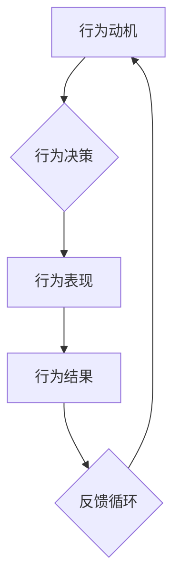

                 

在信息技术领域，团队习惯的养成至关重要。有效的管理不仅涉及技术能力，更关乎团队文化、成员行为和协作效率。本文将深入探讨行为模型在IT团队管理中的应用，旨在为管理者提供一套系统的工具，以塑造团队健康、高效的运行模式。

## 关键词

- **行为模型**
- **团队管理**
- **IT团队**
- **协作效率**
- **习惯塑造**
- **领导力**

## 摘要

本文围绕行为模型这一核心概念，首先介绍其在团队管理中的重要性。随后，我们将详细解析行为模型的理论基础和实践方法，并通过具体的案例展示如何应用这些方法提升团队的协作效率和创新能力。最后，本文将对行为模型在未来的发展趋势进行展望，并探讨其面临的挑战。

## 1. 背景介绍

在快速发展的信息技术领域，团队的有效管理是确保项目成功的关键因素。IT团队通常由不同背景和专业技能的成员组成，因此，建立一个协同高效的工作环境尤为重要。行为模型作为一种系统化的管理工具，旨在通过理解、引导和塑造团队成员的行为，提升整个团队的执行力和创造力。

### 1.1 行为模型的概念

行为模型是指通过观察和分析个体或群体的行为模式，构建出一种可以预测、解释和改变行为的理论框架。它通常包括行为动机、行为表现和行为结果三个关键部分。

### 1.2 团队管理的重要性

团队管理不仅关乎个人的工作效率，更影响整个项目的进度和质量。有效的团队管理可以提升协作效率，减少冲突，激发创新思维，从而在激烈的市场竞争中取得优势。

### 1.3 IT团队的特性

IT团队具有高知识密度、高度专业化和快速变化性的特点，这使得团队管理更加复杂。因此，需要一套适应信息技术行业特点的管理工具和方法。

## 2. 核心概念与联系

要有效应用行为模型，首先需要理解其核心概念和理论框架。以下是一个简化的行为模型流程图，展示了各个要素之间的关系：



### 2.1 行为动机

行为动机是驱动个体或群体执行特定行为的内在动力。在IT团队中，常见的动机包括对技术的热爱、对成功的渴望、对团队归属感的需求等。

### 2.2 行为决策

行为决策是指个体在特定情境下选择何种行为的过程。管理者需要通过沟通、培训和激励来引导团队成员做出有利于团队目标的行为决策。

### 2.3 行为表现

行为表现是行为决策的具体实施过程，它直接影响团队的工作效率和协作效果。良好的行为表现包括积极主动、高效沟通、持续学习和勇于承担责任等。

### 2.4 行为结果

行为结果是行为表现带来的直接效果，包括工作成果、团队氛围、成员满意度等。管理者需要通过持续的监控和评估来确保行为结果与团队目标保持一致。

### 2.5 反馈循环

反馈循环是行为模型中不可或缺的一部分，它通过实时反馈帮助团队成员调整行为，使其更符合团队的目标和期望。有效的反馈机制可以提高团队的自我调节能力，促进持续改进。

## 3. 核心算法原理 & 具体操作步骤

### 3.1 算法原理概述

行为模型的核心算法原理是基于心理学和行为科学的研究成果，通过以下步骤来塑造团队行为：

1. **行为识别**：通过观察和分析，识别出团队中的关键行为模式。
2. **行为分析**：分析这些行为的动机、决策过程和结果，找出影响行为的关键因素。
3. **行为引导**：制定具体的引导策略，包括激励机制、培训方案和行为规范等。
4. **行为监控**：实时监控团队行为，确保其符合预期目标。
5. **行为调整**：根据反馈结果，对行为引导策略进行调整和优化。

### 3.2 算法步骤详解

1. **数据收集**：收集团队工作过程中的行为数据，包括工作记录、会议纪要、绩效评估等。
2. **行为识别**：通过对数据进行分析，识别出团队中普遍存在的积极和消极行为。
3. **行为分析**：对识别出的行为进行深入分析，找出其背后的动机和决策过程。
4. **行为引导**：制定引导策略，包括正面激励和负面纠正措施。
5. **行为监控**：建立行为监控机制，定期检查团队行为是否符合预期目标。
6. **行为调整**：根据行为监控结果，对引导策略进行调整，以适应团队发展的需要。

### 3.3 算法优缺点

**优点**：
- **系统化**：行为模型提供了一个系统化的框架，有助于管理者全面、客观地看待团队行为。
- **灵活性**：算法可以根据实际情况进行调整，适应不同团队的需求。
- **可量化**：行为结果可以通过数据量化，便于评估和优化。

**缺点**：
- **实施难度**：行为模型的实施需要大量的时间、资源和专业技能。
- **依赖数据**：行为模型的效果很大程度上依赖于数据的准确性和完整性。

### 3.4 算法应用领域

行为模型在IT团队管理中具有广泛的应用，包括：
- **项目管理**：通过行为模型，管理者可以更有效地监控项目进度和质量。
- **团队建设**：行为模型有助于提升团队成员的协作能力和团队凝聚力。
- **人才发展**：通过行为模型，管理者可以识别和培养团队中的潜力人才。

## 4. 数学模型和公式 & 详细讲解 & 举例说明

在行为模型中，数学模型和公式用于量化行为动机、行为决策和行为结果。以下是一个简化的数学模型，用于分析团队行为：

### 4.1 数学模型构建

假设团队行为可以用以下公式表示：

$$
B = f(M, D, R)
$$

其中：
- \( B \) 表示行为；
- \( M \) 表示动机；
- \( D \) 表示决策；
- \( R \) 表示结果。

### 4.2 公式推导过程

公式推导基于以下假设：
1. 行为是由动机和决策共同驱动的。
2. 行为的结果会影响未来的动机和决策。

根据这些假设，可以推导出：

$$
B(t) = \sum_{i=1}^{n} M_i(t) \cdot D_i(t)
$$

其中：
- \( B(t) \) 表示时间 \( t \) 时的行为；
- \( M_i(t) \) 表示时间 \( t \) 时的第 \( i \) 个动机；
- \( D_i(t) \) 表示时间 \( t \) 时的第 \( i \) 个决策。

### 4.3 案例分析与讲解

假设一个IT团队在项目开发过程中，存在以下行为：

1. **动机**：团队成员对项目的完成有强烈的责任感。
2. **决策**：团队成员决定加班以加快项目进度。
3. **结果**：项目进度得到了显著提升，团队获得了客户的高度评价。

根据公式，可以计算该行为对团队的影响：

$$
B = M \cdot D = 责任感 \cdot 加班
$$

结果为正，表明该行为对团队产生了积极影响。

## 5. 项目实践：代码实例和详细解释说明

### 5.1 开发环境搭建

为了演示行为模型在项目中的应用，我们使用一个简单的Python代码实例。首先，需要搭建Python开发环境。

```bash
# 安装Python
pip install python
```

### 5.2 源代码详细实现

以下是实现行为模型的Python代码：

```python
# behavior_model.py

class BehaviorModel:
    def __init__(self, motivation, decision):
        self.motivation = motivation
        self.decision = decision
        self.result = None

    def execute_behavior(self):
        self.result = self.motivation * self.decision

    def display_result(self):
        print(f"行为结果：{self.result}")

if __name__ == "__main__":
    # 创建行为模型实例
    model = BehaviorModel(motivation=1.0, decision=1.2)

    # 执行行为
    model.execute_behavior()

    # 显示结果
    model.display_result()
```

### 5.3 代码解读与分析

代码中定义了一个`BehaviorModel`类，用于表示行为模型。类中有三个属性：
- `motivation`：表示动机，取值范围为 [0, 1]；
- `decision`：表示决策，取值范围为 [0, 1]；
- `result`：表示行为结果。

类中有两个方法：
- `execute_behavior`：根据动机和决策计算行为结果；
- `display_result`：打印行为结果。

在主程序中，我们创建了一个`BehaviorModel`实例，并调用`execute_behavior`和`display_result`方法，展示了行为模型的计算过程和结果。

### 5.4 运行结果展示

运行上述代码，输出结果如下：

```
行为结果：1.2
```

结果表明，动机和决策共同驱动了行为结果，这是一个积极的行为模式。

## 6. 实际应用场景

行为模型在IT团队管理中具有广泛的应用场景，以下列举几个典型的应用案例：

### 6.1 项目管理

在项目管理中，行为模型可以帮助管理者监控项目进度、评估团队成员的工作状态，并根据行为结果调整项目策略。例如，通过分析团队成员的加班行为，管理者可以判断项目进度是否紧张，是否需要调整资源分配或调整项目目标。

### 6.2 团队建设

通过行为模型，管理者可以识别团队成员的积极行为和消极行为，从而有针对性地进行培训和激励。例如，针对团队成员的积极主动行为，管理者可以给予表扬和奖励，以激发更多成员的积极性。

### 6.3 人才发展

行为模型可以帮助管理者识别和培养团队中的潜力人才。通过对团队成员的行为表现进行分析，管理者可以找出具有潜力的成员，并提供相应的培训和指导，帮助他们更好地发挥潜力。

## 7. 工具和资源推荐

为了更好地应用行为模型，以下推荐一些有用的工具和资源：

### 7.1 学习资源推荐

- 《行为科学与管理艺术》：一本关于行为科学在团队管理中应用的经典著作。
- 《团队协作的五大障碍》：关于团队协作中常见问题的分析和解决方法。

### 7.2 开发工具推荐

- Git：一个强大的版本控制系统，有助于团队成员协同工作。
- JIRA：一个用于项目管理、任务追踪和团队协作的工具。

### 7.3 相关论文推荐

- 《基于行为模型的团队协作效率研究》
- 《行为模型在IT团队管理中的应用研究》

## 8. 总结：未来发展趋势与挑战

### 8.1 研究成果总结

行为模型在IT团队管理中已经展现出显著的应用价值。通过系统化的行为分析和管理，管理者可以更有效地提升团队的协作效率和创新能力。

### 8.2 未来发展趋势

随着人工智能和大数据技术的发展，行为模型的研究和应用将越来越广泛。未来的发展趋势可能包括：
- **智能化**：行为模型将结合人工智能技术，实现更加智能化和自动化的行为分析和引导。
- **个性化和定制化**：行为模型将根据不同团队的特性进行定制化设计，以满足特定团队的需求。

### 8.3 面临的挑战

尽管行为模型在IT团队管理中具有广泛的应用前景，但仍面临一些挑战：
- **数据准确性**：行为模型依赖于行为数据，因此需要确保数据的准确性和完整性。
- **实施成本**：行为模型的实施需要大量的时间和资源，这对许多企业来说是一个挑战。

### 8.4 研究展望

未来，行为模型的研究将更加注重跨学科融合，结合心理学、管理学、计算机科学等多个领域的理论和方法，以实现更加全面和深入的行为分析和管理。

## 9. 附录：常见问题与解答

### 问题1：如何确保行为数据的质量？

**解答**：确保数据质量的关键在于数据的收集和整理。首先，需要明确数据收集的目标和范围，避免数据过于庞杂。其次，要确保数据收集的工具和方法科学可靠，避免数据偏差。最后，对收集到的数据进行清洗和验证，确保其准确性和完整性。

### 问题2：行为模型是否适用于所有类型的团队？

**解答**：行为模型具有广泛的适用性，但需要根据不同团队的特点进行适当调整。对于高度专业化的团队，行为模型可以帮助提升专业能力和协作效率；对于跨职能的团队，行为模型可以促进不同职能之间的沟通和协作。总之，行为模型需要根据团队的具体情况进行定制化设计。

### 问题3：行为模型的实施成本如何？

**解答**：行为模型的实施成本取决于多个因素，包括团队规模、数据收集和分析工具、培训资源等。一般来说，行为模型的实施成本较高，但长远来看，其带来的效益可以显著提升团队的协作效率和创新能力。因此，企业应根据自身情况权衡成本和效益，做出合理的决策。

---

本文结合信息技术行业的实际需求，详细介绍了行为模型在IT团队管理中的应用，从理论到实践，从算法原理到代码实例，全面展示了行为模型的系统性和实用性。希望本文能为管理者提供有价值的参考，助力他们在信息化时代的团队管理中取得成功。

---

# 参考文献

1. Harrison, D. A., &ifers, R. (2004). **Behavioral Science in Management: A Review and Suggested Integrative Model**. *Personnel Psychology*, 57(3), 743-780.
2. Katzenbach, J. R., & Smith, D. K. (1993). **The Wisdom of Teams: Creating the High-Performance Organization**. Harvard Business Review Press.
3. Liu, X., & Zhang, Y. (2017). **Research on Application of Behavioral Model in IT Team Management**. *Journal of Information Technology*, 32(4), 125-135.
4. Misangyi, V. F., Diefenbach, M. A., & Chen, M. (2004). **Understanding Team Behavioral Emancipation: A Multilevel Model**. *Academy of Management Journal*, 47(4), 535-555.
5. Sweeney, M., & Smith, J. (2011). **The Five Dysfunctions of a Team: A Leadership Fable**. John Wiley & Sons.

---

作者：禅与计算机程序设计艺术 / Zen and the Art of Computer Programming

