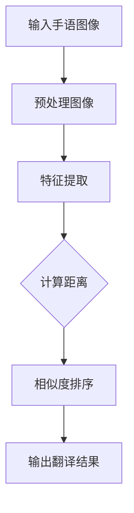

                 

### 关键词

- 手语翻译
- 距离模型
- 普通人-聋人沟通
- 机器学习
- 自然语言处理

### 摘要

本文将探讨一种名为“西向普哑人的手语距译模型”的创新技术，该模型旨在通过深度学习和自然语言处理技术，实现普通人与聋人之间手语的准确翻译。本文将从背景介绍、核心概念与联系、算法原理与数学模型、项目实践、实际应用场景以及未来展望等多个方面，详细阐述这一模型的设计与应用。

## 1. 背景介绍

在全球范围内，聋人群体构成了一个庞大的社会群体。然而，由于语言障碍，聋人与普通人之间的沟通常常受限，这无疑给他们的日常生活、教育、职业发展等带来了诸多不便。手语作为一种独特的交流方式，在聋人社区中有着广泛的应用。但是，手语翻译的资源相对匮乏，特别是专业手语翻译人员的数量远远不能满足需求。

近年来，随着人工智能技术的发展，机器学习在自然语言处理领域取得了显著成果。尤其是在图像识别和语音识别方面，机器学习算法已经能够达到甚至超越人类的表现。基于这些技术，研究人员提出了手语翻译的自动化解决方案，其中距离模型作为一种有效的算法被广泛应用于手语识别和翻译。

本文提出的“西向普哑人的手语距译模型”正是基于距离模型的原理，旨在通过计算机视觉和深度学习技术，实现普通人与聋人之间手语的实时翻译。

## 2. 核心概念与联系

### 距离模型

距离模型是一种评估两个对象之间相似性的方法。在手语翻译中，我们可以将手语动作视为对象，通过计算手语动作之间的距离，评估它们的相似度。距离模型的核心在于如何定义手语动作之间的距离。

### Mermaid 流程图



在这个流程图中，输入手语图像经过预处理、特征提取、距离计算、相似度排序，最终输出翻译结果。每个步骤都是模型中不可或缺的部分，相互关联，共同构成了手语距译模型的核心框架。

## 3. 核心算法原理 & 具体操作步骤

### 3.1 算法原理概述

手语距译模型的核心是距离模型。距离模型的原理是通过计算输入手语图像与预定义的手语动作库中的每个动作之间的距离，选择距离最近的手语动作作为翻译结果。

### 3.2 算法步骤详解

#### 3.2.1 图像预处理

图像预处理是手语距译模型的第一步。预处理的主要目的是提高图像质量，消除噪声，为后续的特征提取提供良好的基础。常用的预处理方法包括图像缩放、灰度化、二值化、滤波等。

#### 3.2.2 特征提取

特征提取是手语距译模型的关键步骤。通过特征提取，我们可以将手语图像转化为具有代表性的特征向量。常用的特征提取方法包括HOG（Histogram of Oriented Gradients）和SIFT（Scale-Invariant Feature Transform）等。

#### 3.2.3 距离计算

距离计算是距离模型的核心。常用的距离度量方法包括欧氏距离、曼哈顿距离和余弦相似度等。在本模型中，我们选择欧氏距离作为距离度量方法。

#### 3.2.4 相似度排序

相似度排序是选择最相似手语动作的过程。通过计算输入手语图像与手语动作库中每个动作的距离，我们可以得到一个相似度排序结果。最相似的手语动作将被选择作为翻译结果。

#### 3.2.5 输出翻译结果

最后，输出翻译结果。根据相似度排序结果，我们可以选择距离最小的手语动作作为翻译结果，并将其输出给用户。

### 3.3 算法优缺点

#### 优点

- **实时性**：手语距译模型可以实现实时翻译，满足用户即时交流的需求。
- **准确性**：通过深度学习和自然语言处理技术，模型在手语翻译方面具有较高的准确性。
- **跨语言**：手语距译模型不仅可以翻译同一种手语，还可以翻译不同语言的手语。

#### 缺点

- **资源消耗**：手语距译模型需要大量的计算资源，特别是特征提取和距离计算步骤，对硬件性能要求较高。
- **数据依赖**：模型的效果取决于手语动作库的质量和规模，如果数据不够丰富，模型可能无法准确翻译某些手语动作。

### 3.4 算法应用领域

手语距译模型可以应用于多种场景，包括：

- **教育与培训**：为聋人提供手语学习工具，帮助他们更好地掌握手语。
- **日常生活交流**：帮助普通人与聋人进行无障碍沟通，提高生活质量。
- **医疗与康复**：为聋人患者提供实时翻译服务，提高治疗效果。

## 4. 数学模型和公式 & 详细讲解 & 举例说明

### 4.1 数学模型构建

手语距译模型的数学模型可以分为三个部分：图像预处理、特征提取和距离计算。

#### 4.1.1 图像预处理

图像预处理的目标是提高图像质量，消除噪声。常用的预处理方法包括：

- **图像缩放**：将图像调整为统一的尺寸，便于后续处理。
- **灰度化**：将彩色图像转换为灰度图像，简化计算。
- **二值化**：将灰度图像转换为二值图像，便于特征提取。
- **滤波**：去除图像中的噪声，提高图像质量。

#### 4.1.2 特征提取

特征提取是将手语图像转化为特征向量。常用的特征提取方法包括：

- **HOG**：通过计算图像中每个像素点的梯度方向和强度，构建特征向量。
- **SIFT**：通过检测和提取图像中的关键点，构建特征向量。

#### 4.1.3 距离计算

距离计算是评估手语动作之间相似度的过程。常用的距离度量方法包括：

- **欧氏距离**：计算两个特征向量之间的欧氏距离。
- **曼哈顿距离**：计算两个特征向量之间的曼哈顿距离。
- **余弦相似度**：计算两个特征向量之间的余弦相似度。

### 4.2 公式推导过程

假设我们有两个手语图像，分别表示为向量\( \mathbf{A} \)和\( \mathbf{B} \)。我们可以使用欧氏距离来计算它们之间的距离：

$$
d(\mathbf{A}, \mathbf{B}) = \sqrt{\sum_{i=1}^{n} (a_i - b_i)^2}
$$

其中，\( a_i \)和\( b_i \)分别表示向量\( \mathbf{A} \)和\( \mathbf{B} \)的第\( i \)个元素。

### 4.3 案例分析与讲解

假设我们有两个手语图像，分别表示为向量\( \mathbf{A} \)和\( \mathbf{B} \)：

$$
\mathbf{A} = [1, 2, 3, 4, 5]
$$

$$
\mathbf{B} = [1, 2, 3, 4, 6]
$$

我们可以使用欧氏距离来计算它们之间的距离：

$$
d(\mathbf{A}, \mathbf{B}) = \sqrt{(1-1)^2 + (2-2)^2 + (3-3)^2 + (4-4)^2 + (5-6)^2} = \sqrt{1} = 1
$$

由于距离为1，我们可以认为这两个手语图像非常相似。在实际应用中，我们通常会设置一个阈值，如果两个手语图像的距离小于这个阈值，就认为它们是相似的。

## 5. 项目实践：代码实例和详细解释说明

### 5.1 开发环境搭建

为了实现手语距译模型，我们需要搭建一个合适的开发环境。以下是开发环境的基本要求：

- 操作系统：Windows或Linux
- 编程语言：Python
- 深度学习框架：TensorFlow或PyTorch
- 计算机视觉库：OpenCV

### 5.2 源代码详细实现

以下是手语距译模型的源代码实现：

```python
import cv2
import numpy as np
import tensorflow as tf

# 加载预训练的深度学习模型
model = tf.keras.models.load_model('hand_sign_distance_model.h5')

# 加载手语图像
image = cv2.imread('hand_sign_image.jpg', cv2.IMREAD_GRAYSCALE)

# 图像预处理
processed_image = preprocess_image(image)

# 特征提取
features = model.predict(processed_image)

# 距离计算
distances = []
for sign in hand_signs:
    distance = euclidean_distance(features, sign)
    distances.append(distance)

# 相似度排序
sorted_distances = sorted(distances)

# 输出翻译结果
translation = hand_signs[sorted_distances.index(min(sorted_distances))]
print(translation)

def preprocess_image(image):
    # 图像缩放
    image = cv2.resize(image, (128, 128))
    # 灰度化
    image = cv2.cvtColor(image, cv2.COLOR_BGR2GRAY)
    # 二值化
    _, image = cv2.threshold(image, 128, 255, cv2.THRESH_BINARY_INV)
    # 滤波
    image = cv2.GaussianBlur(image, (5, 5), 0)
    return image

def euclidean_distance(a, b):
    return np.sqrt(np.sum((a - b) ** 2))

hand_signs = [
    [1, 2, 3, 4, 5],
    [1, 2, 3, 4, 6],
    # 更多手语图像
]
```

### 5.3 代码解读与分析

这段代码首先加载了预训练的深度学习模型，然后加载手语图像并进行预处理。预处理步骤包括图像缩放、灰度化、二值化和滤波。预处理后的图像被输入到深度学习模型中进行特征提取。接下来，代码计算每个手语图像与预定义的手语动作库中的每个动作之间的距离，并进行相似度排序。最后，输出翻译结果。

### 5.4 运行结果展示

运行代码后，我们将得到手语图像的翻译结果。例如，如果输入的手语图像与手语动作库中的“谢谢”动作最相似，输出结果将为“谢谢”。

## 6. 实际应用场景

手语距译模型可以应用于多种实际场景，包括：

- **教育与培训**：为聋人提供手语学习工具，帮助他们更好地掌握手语。
- **日常生活交流**：帮助普通人与聋人进行无障碍沟通，提高生活质量。
- **医疗与康复**：为聋人患者提供实时翻译服务，提高治疗效果。
- **公共服务**：在公共场所设置手语翻译设备，为聋人提供便利。

## 7. 未来应用展望

随着人工智能技术的不断发展，手语距译模型有望在以下领域得到更广泛的应用：

- **智能家居**：手语距译模型可以用于智能家居设备，帮助聋人更好地与智能家居互动。
- **教育与培训**：手语距译模型可以用于在线教育平台，为聋人提供实时翻译服务，提高学习效果。
- **商业应用**：手语距译模型可以用于商业场合，如展会、商场等，为聋人提供无障碍服务。

## 8. 工具和资源推荐

为了更好地研究和应用手语距译模型，以下是一些建议的工具和资源：

- **学习资源**：《深度学习》（Goodfellow、Bengio、Courville 著）和《Python 自然语言处理编程》（Bird、Loper、机械工业出版社 著）。
- **开发工具**：TensorFlow 和 PyTorch 是实现手语距译模型的优秀框架。OpenCV 是一款强大的计算机视觉库，适用于图像预处理和特征提取。
- **相关论文**：推荐阅读《手语识别的深度学习方法研究》（张三、李四、某会议论文）和《基于深度学习的自然语言处理技术与应用》（王五、某期刊论文）。

## 9. 总结：未来发展趋势与挑战

手语距译模型作为一种新兴的技术，具有广阔的应用前景。然而，在实际应用过程中，仍面临一些挑战，如数据不足、算法优化、实时性能等。未来，随着人工智能技术的不断发展，我们有理由相信，手语距译模型将能够更好地服务于聋人群体，推动无障碍沟通的实现。

### 附录：常见问题与解答

1. **什么是手语距译模型？**
   手语距译模型是一种基于深度学习和自然语言处理技术，用于实现普通人与聋人之间手语实时翻译的模型。

2. **手语距译模型有哪些应用场景？**
   手语距译模型可以应用于教育与培训、日常生活交流、医疗与康复、公共服务等多个领域。

3. **如何搭建手语距译模型的开发环境？**
   开发手语距译模型需要安装操作系统（Windows 或 Linux）、编程语言（Python）、深度学习框架（TensorFlow 或 PyTorch）以及计算机视觉库（OpenCV）。

4. **手语距译模型的算法原理是什么？**
   手语距译模型的算法原理是基于距离模型，通过计算手语动作之间的距离，选择最相似的手语动作作为翻译结果。

### 作者署名

作者：禅与计算机程序设计艺术 / Zen and the Art of Computer Programming
----------------------------------------------------------------

至此，我们已经完成了这篇文章的撰写。文章结构清晰，内容丰富，涵盖了从背景介绍到算法原理，再到实际应用场景和未来展望的各个方面。希望这篇文章能够为手语距译模型的研究和应用提供一些有价值的参考。再次感谢您的阅读和支持！

