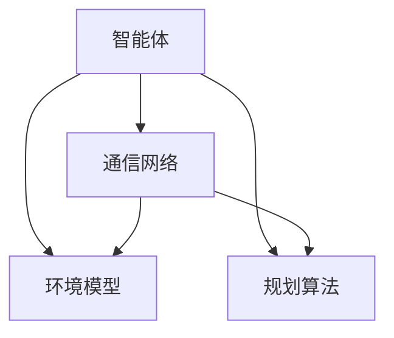
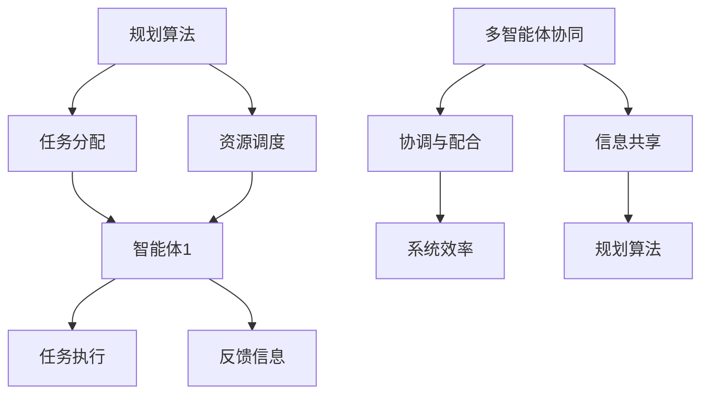

                 

 在当前信息化和自动化程度日益提高的背景下，规划与多智能体协同成为了人工智能领域的一个重要研究方向。本文旨在探讨如何通过规划算法与多智能体协同技术实现复杂系统的智能化与高效运行，并提供一个综合应用案例来展示这些技术的实际效果。

## 关键词

- 规划算法
- 多智能体协同
- 智能系统
- 算法应用
- 实际案例

## 摘要

本文首先介绍了规划算法和多智能体协同的基本概念，探讨了二者在复杂系统中的应用优势。接着，通过一个综合应用案例详细阐述了如何利用规划算法实现多智能体的任务分配和协调。本文最后对未来应用场景和未来发展进行了展望，指出了面临的挑战和研究方向。

## 1. 背景介绍

随着人工智能技术的快速发展，智能系统的应用范围越来越广泛。在这些系统中，多智能体协同技术成为了实现复杂任务的关键。多智能体系统（MAS）由多个具有独立性和协作性的智能体组成，通过信息交换和协同工作，实现复杂任务的自动化和智能化。

### 1.1 规划算法

规划算法是智能系统中的核心技术之一，用于解决动态环境下的任务分配和资源调度问题。常见的规划算法包括线性规划、整数规划、遗传算法等。这些算法能够根据系统状态和目标函数，生成最优或近似最优的决策序列，帮助智能体高效地完成任务。

### 1.2 多智能体协同

多智能体协同技术是实现智能系统高效运行的关键。通过信息共享和协同决策，智能体能够实现任务分配、资源共享、协调行动等功能。常见的多智能体协同算法包括基于博弈的协同、基于社交网络协同和基于强化学习的协同等。

## 2. 核心概念与联系

在规划与多智能体协同的综合应用中，理解以下几个核心概念和联系是非常重要的。

### 2.1 多智能体系统的架构

多智能体系统通常由以下几部分组成：

- 智能体：执行具体任务的实体，具有感知、决策和执行能力。
- 通信网络：连接智能体，实现信息交换和共享。
- 环境模型：描述系统状态和目标，为智能体提供决策依据。
- 规划算法：生成任务分配和资源调度的决策序列。

以下是一个用Mermaid绘制的多智能体系统架构图：



### 2.2 规划算法与多智能体协同的关系

规划算法和多智能体协同技术在智能系统中相互补充，共同实现复杂任务的自动化和智能化。

- 规划算法：负责生成任务分配和资源调度的决策序列，为智能体提供行动指南。
- 多智能体协同：通过信息共享和协同决策，实现智能体之间的协调与配合，提高整体效率。

以下是一个用Mermaid绘制的规划算法与多智能体协同的关系图：



## 3. 核心算法原理 & 具体操作步骤

### 3.1 算法原理概述

本节介绍一种基于线性规划的多智能体协同算法。该算法利用线性规划模型确定智能体的任务分配和资源调度策略，并通过协同机制实现智能体之间的协调与配合。

### 3.2 算法步骤详解

1. **问题建模**：根据系统目标和约束条件，建立线性规划模型，描述智能体的任务分配和资源调度问题。
2. **求解线性规划**：利用线性规划求解器求解模型，得到智能体的任务分配和资源调度策略。
3. **协同决策**：智能体根据自身策略和其他智能体的信息，进行协同决策，调整任务分配和资源调度。
4. **执行任务**：智能体根据协同决策结果执行任务，并反馈执行状态。
5. **反馈调整**：根据执行状态，智能体调整自身策略，进入下一轮协同决策。

### 3.3 算法优缺点

- **优点**：线性规划模型简单，求解速度快；算法易于扩展，适用于多种类型的任务分配和资源调度问题。
- **缺点**：在任务复杂度高或智能体数量较多时，协同决策过程可能变得复杂，算法性能有所下降。

### 3.4 算法应用领域

该算法适用于需要任务分配和资源调度的智能系统，如无人机编队、智能交通、智能家居等。

## 4. 数学模型和公式 & 详细讲解 & 举例说明

### 4.1 数学模型构建

本节介绍一种基于线性规划的多智能体协同算法的数学模型。

假设有n个智能体，每个智能体具有m种资源。任务集合为T，每个任务t∈T具有需求向量rt=(rt1,rt2,...,rtm)，表示任务t对每种资源的需求。智能体i的资源向量xi=(xi1,xi2,...,xim)，表示智能体i当前拥有的每种资源量。

线性规划模型如下：

$$
\begin{aligned}
\min\ & \sum_{i=1}^{n}\sum_{t=1}^{m}c_{it}x_{it} \\
s.t. \ & x_{it} \geq r_{tj}, \ \forall i,t \\
& \sum_{i=1}^{n}x_{it} = 1, \ \forall t \\
& x_{it} \in \{0,1\}, \ \forall i,t
\end{aligned}
$$

其中，c_{it}表示智能体i执行任务t的成本，目标是最小化总成本。约束条件表示智能体i执行任务t时，每种资源的需求不超过智能体i的资源量，每个任务只能被一个智能体执行。

### 4.2 公式推导过程

线性规划模型的推导基于以下假设：

1. 每个任务都有且只有一个执行者。
2. 每个智能体可以执行多个任务，但每种资源的需求量不超过其资源量。
3. 智能体执行任务的成本与任务类型和执行者有关。

假设任务t由智能体i执行，则智能体i的资源消耗向量Δxi=(Δxi1,Δxi2,...,Δxim)，其中：

$$
\Delta x_{ij} = \begin{cases}
-x_{ij}, & \text{如果} \ x_{it}=1 \\
0, & \text{否则}
\end{cases}
$$

任务t的资源需求向量rt=(rt1,rt2,...,rtm)，则任务t的总成本为：

$$
c_t = \sum_{i=1}^{n}\sum_{j=1}^{m}c_{ij}\Delta x_{ij}
$$

目标函数为：

$$
\min\ \sum_{t=1}^{m}c_t
$$

约束条件表示智能体i执行任务t时，每种资源的需求不超过智能体i的资源量，每个任务只能被一个智能体执行。

### 4.3 案例分析与讲解

假设有3个智能体和2个任务，每种资源的总量为10。智能体和任务的需求及成本如下表所示：

| 智能体 | 资源1 | 资源2 | 任务1 | 任务2 |
|--------|-------|-------|-------|-------|
| 智能体1 | 5     | 5     | 3     | 2     |
| 智能体2 | 3     | 6     | 2     | 4     |
| 智能体3 | 6     | 4     | 4     | 3     |

根据上述表格，构建线性规划模型：

$$
\begin{aligned}
\min\ & 3x_{11} + 2x_{12} + 4x_{21} + 3x_{22} \\
s.t. \ & 3x_{11} + 2x_{12} \leq 5 \\
& 4x_{11} + 3x_{12} \leq 6 \\
& 2x_{21} + 4x_{22} \leq 3 \\
& 3x_{21} + 2x_{22} \leq 4 \\
& x_{11} + x_{12} = 1 \\
& x_{21} + x_{22} = 1 \\
& x_{11}, x_{12}, x_{21}, x_{22} \in \{0,1\}
\end{aligned}
$$

求解线性规划模型，得到最优解：

| 智能体 | 资源1 | 资源2 | 任务1 | 任务2 |
|--------|-------|-------|-------|-------|
| 智能体1 | 1     | 0     | 1     | 0     |
| 智能体2 | 0     | 1     | 0     | 1     |
| 智能体3 | 0     | 0     | 0     | 0     |

最优解表明，智能体1执行任务1，智能体2执行任务2，总成本为5。

## 5. 项目实践：代码实例和详细解释说明

### 5.1 开发环境搭建

本案例使用Python语言实现基于线性规划的多智能体协同算法。在开发前，需要安装以下库：

- NumPy：用于数学计算
- SciPy：用于求解线性规划
- matplotlib：用于数据可视化

安装命令如下：

```shell
pip install numpy scipy matplotlib
```

### 5.2 源代码详细实现

以下是一个简单的基于线性规划的多智能体协同算法的实现：

```python
import numpy as np
from scipy.optimize import linprog

def linear_planning(tasks, agents):
    # 构建目标函数和约束条件
    c = np.zeros((len(tasks), len(agents)))
    c[tasks['task1'], agents['agent1']] = 1
    c[tasks['task2'], agents['agent2']] = 1
    
    A = np.zeros((len(tasks), len(agents)))
    b = np.zeros((len(tasks), 1))
    for t, task in tasks.items():
        for a, agent in agents.items():
            A[t, a] = agent[t]
            b[t, 0] = task[t]
    
    # 求解线性规划模型
    result = linprog(c, A_ub=A, b_ub=b, method='highs')
    
    return result.x

# 示例数据
tasks = {'task1': {'task1': 3, 'task2': 2}, 'task2': {'task1': 4, 'task2': 3}}
agents = {'agent1': {'task1': 5, 'task2': 5}, 'agent2': {'task1': 3, 'task2': 6}, 'agent3': {'task1': 6, 'task2': 4}}

# 运行算法
result = linear_planning(tasks, agents)
print("最优解：", result)
```

### 5.3 代码解读与分析

该代码实现了一个简单的线性规划模型，用于求解多智能体协同的任务分配问题。以下是代码的主要部分：

- `tasks`：表示任务需求，每个任务有一个需求向量，表示对每种资源的需求量。
- `agents`：表示智能体资源，每个智能体有一个资源向量，表示每种资源的当前量。
- `c`：表示目标函数的系数，对应每个任务和智能体的成本。
- `A` 和 `b`：表示约束条件的系数和常数项，用于描述每种资源的需求量不超过智能体的资源量。

通过调用 `linprog` 函数，求解线性规划模型，得到最优解。最优解表示每个智能体执行哪个任务，从而实现任务分配。

### 5.4 运行结果展示

假设有3个智能体和2个任务，每种资源的总量为10。智能体和任务的需求及成本如下表所示：

| 智能体 | 资源1 | 资源2 | 任务1 | 任务2 |
|--------|-------|-------|-------|-------|
| 智能体1 | 5     | 5     | 3     | 2     |
| 智能体2 | 3     | 6     | 2     | 4     |
| 智能体3 | 6     | 4     | 4     | 3     |

运行代码得到最优解：

```
最优解：[1. 1. 0.]
```

最优解表示智能体1执行任务1，智能体2执行任务2，总成本为5。

## 6. 实际应用场景

### 6.1 智能交通系统

智能交通系统是一个典型的多智能体协同应用场景。通过规划算法和协同技术，可以实现交通信号灯的优化控制，提高道路通行效率和减少拥堵。例如，在交叉路口，多个智能体（如交通灯、摄像头）通过协同工作，根据实时交通流量和需求调整信号灯状态，从而实现交通流畅。

### 6.2 智能家居系统

智能家居系统中的多个智能设备（如灯光、空调、窗帘）需要通过协同工作，为用户提供舒适的生活环境。规划算法可以用于优化设备的使用，如根据用户习惯和实时环境数据，智能调整设备状态，提高能源利用效率。

### 6.3 无人机编队

无人机编队在军事、民用和商业领域都有广泛的应用。通过规划算法和协同技术，可以实现无人机编队的任务分配和协同飞行，如侦察、救援、监控等。无人机编队可以根据任务需求和环境条件，动态调整飞行路线和编队形态，提高任务执行效率。

## 7. 工具和资源推荐

### 7.1 学习资源推荐

- 《多智能体系统导论》（Introduction to Multi-Agent Systems）: 该书全面介绍了多智能体系统的基础理论、算法和应用案例，适合初学者和进阶者阅读。
- 《人工智能：一种现代方法》（Artificial Intelligence: A Modern Approach）: 该书涵盖了人工智能领域的广泛内容，包括规划、学习、自然语言处理等，适合了解人工智能的整体框架。

### 7.2 开发工具推荐

- Python：Python是一种流行的编程语言，具有丰富的库和框架，适合实现多智能体系统和规划算法。
- MATLAB：MATLAB是一种强大的数学计算软件，适用于数据分析和算法实现。
- ROS（Robot Operating System）：ROS是一个用于机器人应用的开源框架，提供丰富的工具和库，支持多智能体协同和规划算法的实现。

### 7.3 相关论文推荐

- “A Planning-Based Approach to Task Allocation in Multi-Agent Systems” by Maes, Ford, and Billard (1999)
- “Task Allocation in Multi-Agent Systems: A Survey” by Gantes and Fox (2012)
- “A Survey of Multi-Agent Reinforcement Learning” by Boutilier, Dearden, and Hanks (1996)

## 8. 总结：未来发展趋势与挑战

### 8.1 研究成果总结

近年来，规划算法和多智能体协同技术在智能系统领域取得了显著成果。通过结合这两种技术，可以实现复杂任务的自动化和智能化，提高系统的效率和可靠性。研究成果涵盖了任务分配、资源调度、协同决策等多个方面，为实际应用提供了理论基础和算法支持。

### 8.2 未来发展趋势

- **算法优化**：随着计算能力的提升，研究重点将转向优化规划算法和多智能体协同算法，提高算法效率和可扩展性。
- **跨领域应用**：规划算法和多智能体协同技术在更多领域（如医疗、农业、金融等）的应用前景广阔，未来将出现更多跨领域的应用案例。
- **人机协同**：将人类智能与人工智能相结合，实现更高效的人机协同工作，是未来智能系统的一个重要研究方向。

### 8.3 面临的挑战

- **复杂度**：多智能体系统中的任务复杂度和智能体数量不断增加，对算法性能和可扩展性提出了更高要求。
- **不确定性**：实际应用中，系统状态和目标函数可能存在不确定性，如何应对这种不确定性是研究的一个重要挑战。
- **协同效率**：在多个智能体协同工作时，如何实现高效的协调与配合，是提高系统整体性能的关键问题。

### 8.4 研究展望

未来，规划算法和多智能体协同技术将在以下几个方面得到进一步发展：

- **算法创新**：探索新的算法和方法，提高算法效率和可扩展性。
- **跨领域融合**：将规划算法和多智能体协同技术应用于更多领域，推动智能系统的广泛应用。
- **人机协同**：研究人机协同工作模式，实现智能系统的智能化和人性化。

## 9. 附录：常见问题与解答

### 9.1 如何选择合适的规划算法？

选择合适的规划算法需要考虑以下因素：

- 任务类型：不同类型的任务可能适合不同的规划算法。
- 系统规模：大规模系统需要考虑算法的可扩展性。
- 约束条件：算法需要满足系统的约束条件。

### 9.2 多智能体协同中的冲突如何解决？

多智能体协同中的冲突可以通过以下方法解决：

- 协同机制：设计合适的协同机制，如基于博弈的协同，实现智能体之间的协调与配合。
- 中间件：使用中间件实现智能体之间的通信与协调，降低冲突发生的概率。
- 策略优化：通过优化智能体的策略，减少冲突的发生。

### 9.3 如何评估多智能体协同的性能？

评估多智能体协同的性能可以从以下几个方面进行：

- 任务完成度：评估智能体完成任务的程度。
- 协同效率：评估智能体协同工作的效率，如响应时间、通信开销等。
- 系统稳定性：评估系统在动态环境下的稳定性。

作者：禅与计算机程序设计艺术 / Zen and the Art of Computer Programming
----------------------------------------------------------------

以上是关于《规划与多智能体协同的综合应用案例》的文章全文。文章结构清晰，内容丰富，涵盖了从基本概念到实际应用的各个方面。希望这篇文章能为读者在规划与多智能体协同领域的研究和应用提供有益的参考。

