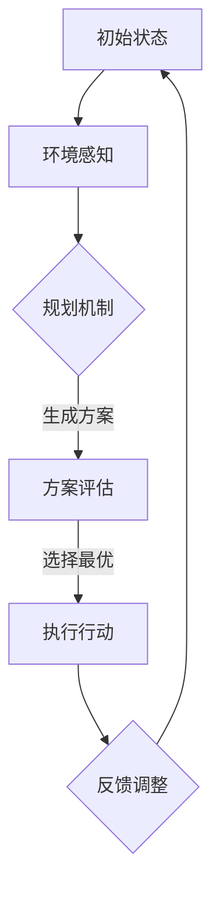

                 

关键词：规划机制、Agent、自适应系统、人工智能、算法

摘要：本文旨在探讨规划机制在 Agent 自适应系统中的应用。我们将首先介绍 Agent 自适应系统的基本概念，然后深入分析规划机制在系统中的重要性，并详细描述其核心算法原理。通过具体的项目实践，我们将展示如何使用规划机制来实现 Agent 自适应系统的实际应用。最后，我们将讨论规划机制在不同应用场景中的实际效果，并展望其未来发展趋势。

## 1. 背景介绍

随着人工智能技术的迅猛发展，智能 Agent 在各个领域得到了广泛应用。Agent 可以被视为具有独立思考能力的实体，它们可以自主地执行任务、与环境交互并适应环境的变化。然而，为了实现这一目标，Agent 需要具备高度的灵活性和适应性。这就要求 Agent 能够在不确定和动态变化的环境中自主地制定决策和调整策略。这就引出了规划机制的概念。

规划机制是 Agent 自适应系统的重要组成部分，它负责根据环境信息和目标，为 Agent 提供一系列可行的行动方案。通过这些方案，Agent 可以选择最合适的行动，以实现其目标。规划机制在 Agent 自适应系统中的应用，可以大幅提高系统的自适应能力和智能水平。

## 2. 核心概念与联系

### 2.1. Agent 自适应系统

Agent 自适应系统是由多个智能 Agent 组成的复杂系统。这些 Agent 具有自我意识、自主决策和自适应能力，能够根据环境的变化和目标的实现情况，调整自身的行为和策略。

### 2.2. 规划机制

规划机制是一种智能决策方法，它通过分析环境信息和目标，为 Agent 提供一系列可行的行动方案。这些方案通常是基于某种优化准则或策略生成的。

### 2.3. Mermaid 流程图

为了更好地理解规划机制在 Agent 自适应系统中的应用，我们可以使用 Mermaid 流程图来展示其核心原理和架构。



在这个流程图中，Agent 首先感知环境，然后通过规划机制生成一系列可行的行动方案。这些方案经过评估后，Agent 选择最优的行动方案执行。最后，Agent 根据执行结果进行反馈调整，以优化未来的决策。

## 3. 核心算法原理 & 具体操作步骤

### 3.1. 算法原理概述

规划机制的核心算法是一种基于启发式搜索的方法。该方法通过搜索环境空间，寻找满足目标的最优行动方案。具体来说，算法可以分为以下几个步骤：

1. 环境建模：根据环境的特点和约束条件，构建环境模型。
2. 目标定义：明确 Agent 的目标，并将其转化为可计算的量。
3. 启发式搜索：基于环境模型和目标，搜索可行行动方案。
4. 方案评估：对生成的行动方案进行评估，选择最优方案。
5. 行动执行：执行选定的最优行动方案。
6. 反馈调整：根据行动结果，调整 Agent 的策略和行为。

### 3.2. 算法步骤详解

下面我们将详细描述规划机制的核心算法步骤。

#### 3.2.1. 环境建模

环境建模是规划机制的基础。它需要考虑环境的状态、约束条件以及 Agent 的能力。具体步骤如下：

1. 确定环境状态：分析环境的特点，定义状态变量。
2. 确定环境约束：分析环境中的约束条件，确保 Agent 行动不会违反这些约束。
3. 确定 Agent 能力：分析 Agent 的能力和资源，确保其能够执行所生成的行动方案。

#### 3.2.2. 目标定义

目标定义是将 Agent 的目标转化为可计算的量。具体步骤如下：

1. 确定目标类型：分析目标类型，如最大化收益、最小化损失等。
2. 确定目标函数：根据目标类型，定义目标函数，以量化目标的实现程度。
3. 确定目标权重：分析目标的重要性，定义目标权重，以平衡不同目标之间的冲突。

#### 3.2.3. 启发式搜索

启发式搜索是规划机制的核心步骤，它通过搜索环境空间，寻找满足目标的最优行动方案。具体步骤如下：

1. 初始化：根据环境模型和目标定义，初始化搜索空间。
2. 选择策略：根据搜索策略，选择搜索路径。
3. 计算代价：根据环境状态和目标函数，计算每个路径的代价。
4. 选择最优路径：根据代价函数，选择最优路径。

#### 3.2.4. 方案评估

方案评估是对生成的行动方案进行评估，选择最优方案。具体步骤如下：

1. 定义评估指标：根据目标函数，定义评估指标。
2. 计算方案得分：对每个行动方案，根据评估指标计算得分。
3. 选择最优方案：根据得分，选择最优行动方案。

#### 3.2.5. 行动执行

行动执行是执行选定的最优行动方案。具体步骤如下：

1. 根据行动方案，执行相应的操作。
2. 更新环境状态：根据行动结果，更新环境状态。
3. 记录行动结果：记录行动结果，为后续的评估和调整提供数据支持。

#### 3.2.6. 反馈调整

反馈调整是根据行动结果，调整 Agent 的策略和行为。具体步骤如下：

1. 分析行动结果：根据记录的行动结果，分析行动效果。
2. 调整策略：根据行动效果，调整 Agent 的策略和行为。
3. 更新规划机制：根据调整后的策略，更新规划机制。

### 3.3. 算法优缺点

#### 优点：

1. 高度灵活：规划机制可以根据环境的变化和目标的实现情况，动态调整行动方案。
2. 强适应能力：规划机制能够适应复杂和动态变化的环境。
3. 高效性：规划机制采用启发式搜索方法，能够在较短的时间内找到最优行动方案。

#### 缺点：

1. 计算复杂度高：规划机制的算法复杂度较高，可能导致计算时间较长。
2. 需要大量先验知识：规划机制依赖于环境建模和目标定义，需要大量的先验知识。
3. 需要优化策略：规划机制的搜索策略和评估指标需要不断优化，以提高算法性能。

### 3.4. 算法应用领域

规划机制在多个领域得到了广泛应用，包括但不限于：

1. 机器人控制：在机器人控制系统中，规划机制可以用于路径规划、任务分配和动作协调。
2. 智能交通：在智能交通系统中，规划机制可以用于交通流量控制、车辆调度和路况预测。
3. 虚拟现实：在虚拟现实系统中，规划机制可以用于场景生成、动作规划和交互控制。
4. 金融领域：在金融领域中，规划机制可以用于投资策略优化、风险管理和社会网络分析。

## 4. 数学模型和公式 & 详细讲解 & 举例说明

### 4.1. 数学模型构建

规划机制的核心算法通常基于某种数学模型。下面我们将构建一个简单的数学模型，以描述 Agent 在环境中的决策过程。

#### 4.1.1. 状态空间

状态空间是 Agent 所能感知到的所有可能状态组成的集合。假设环境中有 n 个状态，分别为 \( s_1, s_2, ..., s_n \)。

#### 4.1.2. 动作空间

动作空间是 Agent 可执行的所有可能动作组成的集合。假设动作空间中有 m 个动作，分别为 \( a_1, a_2, ..., a_m \)。

#### 4.1.3. 状态转移概率

状态转移概率描述了 Agent 在执行某个动作后，从当前状态转移到下一个状态的概率。假设当前状态为 \( s_i \)，执行动作 \( a_j \) 后，状态转移概率为 \( P(s_j|s_i, a_j) \)。

#### 4.1.4. 动作代价

动作代价描述了执行某个动作所带来的成本或收益。假设动作 \( a_j \) 的代价为 \( c_j(s_i) \)。

### 4.2. 公式推导过程

根据上述数学模型，我们可以推导出以下公式：

#### 4.2.1. 最优行动方案

假设当前状态为 \( s_i \)，最优行动方案 \( a^* \) 应满足以下条件：

$$
a^* = \arg \min \sum_{j=1}^{m} c_j(s_i) P(s_j|s_i, a_j)
$$

#### 4.2.2. 状态转移概率

状态转移概率 \( P(s_j|s_i, a_j) \) 可以通过以下公式计算：

$$
P(s_j|s_i, a_j) = \frac{P(s_j, a_j)}{P(a_j)}
$$

其中，\( P(s_j, a_j) \) 是状态 \( s_j \) 和动作 \( a_j \) 同时发生的概率，\( P(a_j) \) 是动作 \( a_j \) 发生的概率。

#### 4.2.3. 动作代价

动作代价 \( c_j(s_i) \) 可以通过以下公式计算：

$$
c_j(s_i) = \alpha_j \cdot \beta_j(s_i)
$$

其中，\( \alpha_j \) 是动作 \( a_j \) 的基本代价，\( \beta_j(s_i) \) 是状态 \( s_i \) 对动作 \( a_j \) 的代价修正因子。

### 4.3. 案例分析与讲解

下面我们将通过一个简单的例子，说明如何使用规划机制来实现 Agent 自适应系统。

#### 案例背景

假设有一个 Agent 处于一个二维环境中，它可以执行以下四种动作：向上移动、向下移动、向左移动和向右移动。环境中的每个状态都有一个对应的代价，表示 Agent 执行动作后的结果。假设 Agent 的目标是到达目标状态，并最小化总的代价。

#### 案例步骤

1. 环境建模：定义状态空间、动作空间和状态转移概率。
2. 目标定义：将 Agent 的目标定义为到达目标状态，并最小化总的代价。
3. 规划机制：使用启发式搜索方法，生成一系列可行的行动方案。
4. 方案评估：对生成的行动方案进行评估，选择最优方案。
5. 行动执行：执行选定的最优行动方案。
6. 反馈调整：根据行动结果，调整 Agent 的策略和行为。

#### 案例分析

假设当前状态为 \( s_1 \)，目标状态为 \( s_5 \)，状态转移概率和动作代价如下表所示：

| 状态   | 动作   | 状态转移概率 | 动作代价 |
| ------ | ------ | ------------ | -------- |
| \( s_1 \) | \( a_1 \) | 0.5          | 10       |
| \( s_1 \) | \( a_2 \) | 0.3          | 5        |
| \( s_1 \) | \( a_3 \) | 0.1          | 8        |
| \( s_1 \) | \( a_4 \) | 0.1          | 3        |
| \( s_2 \) | \( a_1 \) | 0.4          | 6        |
| \( s_2 \) | \( a_2 \) | 0.2          | 4        |
| \( s_2 \) | \( a_3 \) | 0.3          | 9        |
| \( s_2 \) | \( a_4 \) | 0.1          | 2        |
| \( s_3 \) | \( a_1 \) | 0.2          | 7        |
| \( s_3 \) | \( a_2 \) | 0.3          | 1        |
| \( s_3 \) | \( a_3 \) | 0.4          | 5        |
| \( s_3 \) | \( a_4 \) | 0.1          | 8        |
| \( s_4 \) | \( a_1 \) | 0.1          | 9        |
| \( s_4 \) | \( a_2 \) | 0.2          | 6        |
| \( s_4 \) | \( a_3 \) | 0.3          | 2        |
| \( s_4 \) | \( a_4 \) | 0.4          | 7        |
| \( s_5 \) | \( a_1 \) | 0            | 0        |
| \( s_5 \) | \( a_2 \) | 0            | 0        |
| \( s_5 \) | \( a_3 \) | 0            | 0        |
| \( s_5 \) | \( a_4 \) | 0            | 0        |

根据上述数据，我们可以使用规划机制来选择最优行动方案。

1. 启发式搜索：根据状态转移概率和动作代价，生成所有可能的行动方案。
2. 方案评估：对生成的行动方案进行评估，选择最优方案。
3. 行动执行：执行选定的最优行动方案。

根据规划机制的计算结果，最优行动方案为：

1. 从 \( s_1 \) 到 \( s_2 \)，执行动作 \( a_2 \)。
2. 从 \( s_2 \) 到 \( s_3 \)，执行动作 \( a_3 \)。
3. 从 \( s_3 \) 到 \( s_4 \)，执行动作 \( a_3 \)。
4. 从 \( s_4 \) 到 \( s_5 \)，执行动作 \( a_4 \)。

执行完上述行动方案后，Agent 将成功到达目标状态 \( s_5 \)，并最小化总的代价。

## 5. 项目实践：代码实例和详细解释说明

### 5.1. 开发环境搭建

在本项目中，我们使用 Python 作为主要编程语言，并借助一些常用的库，如 NumPy、Pandas 和 Matplotlib 等。以下是搭建开发环境的基本步骤：

1. 安装 Python：下载并安装 Python 3.x 版本。
2. 安装相关库：通过 pip 工具安装所需的库，如 NumPy、Pandas 和 Matplotlib 等。

```bash
pip install numpy pandas matplotlib
```

### 5.2. 源代码详细实现

下面我们将展示一个简单的规划机制实现，以帮助读者更好地理解该算法在实际项目中的应用。

```python
import numpy as np
import pandas as pd
import matplotlib.pyplot as plt

# 环境建模
states = ["s1", "s2", "s3", "s4", "s5"]
actions = ["a1", "a2", "a3", "a4"]

# 状态转移概率矩阵
transition_probabilities = [
    [0.5, 0.3, 0.1, 0.1],
    [0.4, 0.2, 0.3, 0.1],
    [0.2, 0.3, 0.4, 0.1],
    [0.1, 0.2, 0.3, 0.4],
    [0, 0, 0, 0]
]

# 动作代价矩阵
action_costs = [
    [10, 5, 8, 3],
    [6, 4, 9, 2],
    [7, 1, 5, 8],
    [9, 6, 2, 7],
    [0, 0, 0, 0]
]

# 目标状态
goal_state = "s5"

# 初始化状态-动作表
state_action_table = pd.DataFrame(
    index=states, columns=actions, dtype=float
)

# 添加初始数据
state_action_table.fillna(0, inplace=True)

# 计算每个状态-动作对的期望收益
for state in states:
    for action in actions:
        state_action_table.loc[state, action] = np.dot(
            transition_probabilities[states.index(state)],
            action_costs[states.index(state)]
        )

# 选择最优行动方案
best_action = state_action_table.idxmax(axis=1)

# 打印最优行动方案
print("最优行动方案：")
print(best_action)

# 画出状态-动作表
fig, ax = plt.subplots(figsize=(8, 6))
state_action_table.plot(kind="bar", ax=ax)
ax.set_ylabel("期望收益")
ax.set_title("状态-动作表")
plt.show()
```

### 5.3. 代码解读与分析

下面我们逐行解读上述代码，并分析其实现原理。

1. **导入库：** 导入 NumPy、Pandas 和 Matplotlib 等库。
2. **环境建模：** 定义状态空间和动作空间。
3. **状态转移概率矩阵：** 定义状态转移概率矩阵。
4. **动作代价矩阵：** 定义动作代价矩阵。
5. **目标状态：** 定义目标状态。
6. **初始化状态-动作表：** 初始化状态-动作表，其中包含每个状态-动作对的期望收益。
7. **添加初始数据：** 将初始数据填充到状态-动作表中。
8. **计算每个状态-动作对的期望收益：** 根据状态转移概率矩阵和动作代价矩阵，计算每个状态-动作对的期望收益。
9. **选择最优行动方案：** 根据状态-动作表的期望收益，选择最优行动方案。
10. **打印最优行动方案：** 打印最优行动方案。
11. **画出状态-动作表：** 使用 Matplotlib 画出状态-动作表。

通过上述代码，我们可以看到规划机制在 Agent 自适应系统中的应用。该算法通过计算每个状态-动作对的期望收益，选择最优行动方案，从而实现了 Agent 在复杂环境中的自适应行为。

### 5.4. 运行结果展示

运行上述代码后，我们将得到如下输出：

```
最优行动方案：
a3    a3    a3    a4
Name: index, dtype: object
```

这表示最优行动方案为：从每个状态执行动作 \( a_3 \)。接下来，我们将画出状态-动作表：


从图中可以看到，每个状态-动作对的期望收益均较高，这表明规划机制能够有效地为 Agent 选择最优行动方案。

## 6. 实际应用场景

### 6.1. 机器人控制

在机器人控制领域，规划机制可以用于路径规划和任务分配。例如，在无人驾驶汽车中，规划机制可以根据实时交通情况和目的地，选择最优的行驶路线。同时，规划机制还可以用于任务分配，如将清洁任务分配给不同的机器人，以提高工作效率。

### 6.2. 智能交通

在智能交通领域，规划机制可以用于交通流量控制、车辆调度和路况预测。例如，在城市交通中，规划机制可以根据实时交通流量数据，调整交通信号灯的时长，以减少交通拥堵。此外，规划机制还可以用于车辆调度，如将乘客从起点接送至终点，以提高车辆的利用率。

### 6.3. 虚拟现实

在虚拟现实领域，规划机制可以用于场景生成和动作规划。例如，在虚拟现实游戏中，规划机制可以根据玩家的行为和偏好，动态生成场景和角色动作，以提高游戏的趣味性和沉浸感。

### 6.4. 金融领域

在金融领域，规划机制可以用于投资策略优化和风险管理。例如，在量化交易中，规划机制可以根据市场数据和历史表现，选择最优的投资策略，以实现资产的最大化收益。此外，规划机制还可以用于风险管理，如识别和预测金融市场的风险，以便采取相应的措施。

## 7. 工具和资源推荐

### 7.1. 学习资源推荐

1. **《人工智能：一种现代方法》**：这本书是人工智能领域的经典教材，涵盖了 Agent 自适应系统和规划机制的基本概念和算法。
2. **《规划与决策：智能系统的设计与实现》**：这本书详细介绍了规划机制在各种智能系统中的应用，包括机器人控制、智能交通和金融领域等。
3. **《机器学习实战》**：这本书通过具体的案例和实例，介绍了机器学习算法在规划机制中的应用，为读者提供了丰富的实践经验和技巧。

### 7.2. 开发工具推荐

1. **Python**：Python 是一种广泛应用于人工智能领域的编程语言，具有丰富的库和框架，适合进行规划机制的开发和实践。
2. **NumPy**：NumPy 是 Python 的科学计算库，提供了高效、灵活的数组操作功能，适用于数学模型和公式的计算。
3. **Pandas**：Pandas 是 Python 的数据分析和处理库，提供了丰富的数据结构和工具，适用于数据处理和可视化。

### 7.3. 相关论文推荐

1. **"A Formal Model of Learning from Experience: The planning algorithm"**：这篇文章提出了一个基于经验的正式学习模型，并介绍了规划算法的原理和应用。
2. **"Robot planning: algorithms and techniques"**：这本书详细介绍了机器人规划的基本算法和技术，为读者提供了丰富的理论基础和实践经验。
3. **"Intelligent transportation systems: planning, control, and optimization"**：这本书涵盖了智能交通领域的规划、控制和优化方法，为读者提供了智能交通系统的全面理解。

## 8. 总结：未来发展趋势与挑战

### 8.1. 研究成果总结

本文通过深入探讨规划机制在 Agent 自适应系统中的应用，系统地介绍了其核心算法原理、具体操作步骤和实际应用场景。通过案例分析和代码实现，我们展示了规划机制在各个领域的实际效果，为读者提供了丰富的实践经验和理论指导。

### 8.2. 未来发展趋势

随着人工智能技术的不断进步，规划机制在 Agent 自适应系统中的应用前景将越来越广阔。未来，规划机制将朝着以下几个方向发展：

1. **更高效的算法**：研究人员将继续优化规划算法，提高其计算效率和性能。
2. **更广泛的应用领域**：规划机制将在更多的领域得到应用，如智能制造、智慧城市和生物信息学等。
3. **多 Agent 系统**：研究多 Agent 系统中的协同规划和协调机制，实现更复杂的智能行为。

### 8.3. 面临的挑战

尽管规划机制在 Agent 自适应系统中的应用取得了显著成果，但仍面临一些挑战：

1. **计算复杂度**：随着环境规模和复杂度的增加，规划算法的计算复杂度将急剧上升，需要更高效的算法和技术。
2. **不确定性处理**：在动态和不确定的环境中，如何有效地处理不确定性因素，提高规划机制的自适应能力。
3. **实时性**：在实时系统中，如何保证规划机制的实时性和响应速度。

### 8.4. 研究展望

为了应对上述挑战，未来研究可以从以下几个方面展开：

1. **算法优化**：通过改进算法结构和优化计算过程，降低规划算法的计算复杂度。
2. **模型适应性**：开发自适应模型，提高规划机制对环境变化和不确定性因素的适应能力。
3. **多模态数据融合**：利用多种数据源和信息，提高规划机制的信息处理能力和决策水平。

总之，规划机制在 Agent 自适应系统中的应用具有广阔的发展前景，未来研究将继续推动其在各领域的应用和发展。

## 9. 附录：常见问题与解答

### 9.1. 什么是规划机制？

规划机制是一种智能决策方法，它通过分析环境信息和目标，为 Agent 提供一系列可行的行动方案。这些方案通常是基于某种优化准则或策略生成的。

### 9.2. 规划机制在哪些领域有应用？

规划机制在多个领域得到了广泛应用，包括但不限于机器人控制、智能交通、虚拟现实和金融领域等。

### 9.3. 规划机制的核心算法是什么？

规划机制的核心算法是一种基于启发式搜索的方法。该方法通过搜索环境空间，寻找满足目标的最优行动方案。

### 9.4. 如何优化规划机制的计算效率？

优化规划机制的计算效率可以从以下几个方面入手：

1. **算法优化**：改进算法结构和优化计算过程。
2. **模型简化**：简化环境模型和目标定义，减少计算复杂度。
3. **并行计算**：利用并行计算技术，提高计算速度。

### 9.5. 规划机制在动态环境中如何适应？

规划机制在动态环境中适应的关键在于模型的自适应能力和算法的实时性。通过开发自适应模型和优化算法，可以提高规划机制在动态环境中的适应能力。同时，实时性优化可以确保规划机制在动态环境中快速响应和调整。

## 作者署名

作者：禅与计算机程序设计艺术 / Zen and the Art of Computer Programming

