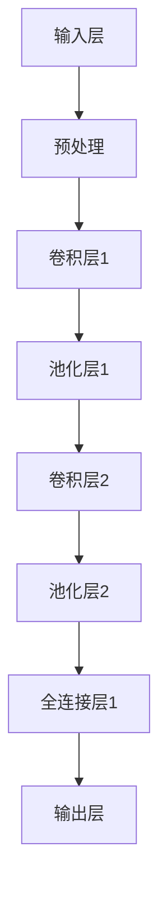

                 

关键词：视觉大模型、图像理解、生成模型、深度学习、AI应用、算法原理

> 摘要：本文深入探讨了视觉大模型在图像理解和生成领域的最新进展和应用。通过对核心算法原理的剖析，数学模型的构建，以及项目实践中的代码实现和运行结果展示，本文旨在为读者呈现视觉大模型的深度学习和应用的全貌，并对其未来的发展趋势和挑战进行展望。

## 1. 背景介绍

随着深度学习技术的飞速发展，计算机视觉领域取得了显著的进步。传统的图像处理方法难以应对复杂场景和多样化的图像数据，而深度学习模型的出现，特别是在卷积神经网络（CNN）的基础上发展起来的视觉大模型，为图像理解和生成提供了新的可能性。视觉大模型在图像分类、目标检测、图像分割、图像生成等任务中展现出了强大的性能和广泛的应用前景。

本文将聚焦于视觉大模型在图像理解和生成方面的研究，分析其核心算法原理，介绍数学模型的构建，并通过实际项目实践，详细解读代码实现和运行结果。同时，本文还将探讨视觉大模型在实际应用场景中的表现，展望其未来的发展趋势和面临的挑战。

## 2. 核心概念与联系

### 2.1. 深度学习与视觉大模型

深度学习（Deep Learning）是机器学习（Machine Learning）的一个重要分支，其核心思想是通过多层神经网络模型，模拟人类大脑的学习过程，对数据进行自动特征提取和模式识别。深度学习在图像识别、语音识别、自然语言处理等领域取得了突破性的成果。

视觉大模型（Vision Large Models）是指一类具有巨大参数规模和深度结构的神经网络模型，它们能够处理海量图像数据，并在图像理解和生成任务中表现出优异的性能。这些模型通常基于卷积神经网络（Convolutional Neural Networks, CNNs）的架构，通过多层次的卷积操作，提取图像的层次化特征。

### 2.2. 图像理解与图像生成

图像理解（Image Understanding）是指对图像内容的分析和解释，包括图像分类、目标检测、图像分割等任务。图像生成（Image Generation）则是指根据特定条件或算法，生成新的图像内容，例如生成对抗网络（Generative Adversarial Networks, GANs）。

### 2.3. 视觉大模型架构

视觉大模型的架构通常包括以下几个主要部分：

1. **输入层**：接收图像数据，通过预处理（如归一化、缩放等）使其适合网络输入。
2. **卷积层**：通过卷积操作提取图像的局部特征。
3. **池化层**：降低特征图的维度，增强模型对平移不变性。
4. **全连接层**：对提取的特征进行分类或回归。
5. **输出层**：生成预测结果，如分类标签、目标框等。

### 2.4. Mermaid 流程图



## 3. 核心算法原理 & 具体操作步骤

### 3.1. 算法原理概述

视觉大模型的核心算法原理主要包括卷积神经网络（CNNs）、生成对抗网络（GANs）等。

- **卷积神经网络（CNNs）**：通过卷积、池化等操作提取图像特征，实现对图像内容的理解和分类。
- **生成对抗网络（GANs）**：由生成器和判别器组成，通过对抗训练生成逼真的图像内容。

### 3.2. 算法步骤详解

#### 3.2.1. 卷积神经网络（CNNs）

1. **输入层**：接收图像数据，进行预处理。
2. **卷积层**：通过卷积操作提取图像的局部特征。
3. **池化层**：降低特征图的维度，增强模型对平移不变性。
4. **全连接层**：对提取的特征进行分类或回归。
5. **输出层**：生成预测结果。

#### 3.2.2. 生成对抗网络（GANs）

1. **生成器**：生成逼真的图像内容。
2. **判别器**：判断输入图像是真实图像还是生成图像。
3. **对抗训练**：生成器和判别器通过对抗训练优化模型参数。

### 3.3. 算法优缺点

- **优点**：视觉大模型能够自动提取图像的层次化特征，适用于多种图像理解和生成任务。
- **缺点**：训练过程复杂，对计算资源要求较高；模型参数量巨大，难以解释。

### 3.4. 算法应用领域

- **图像分类**：对图像进行分类，如猫狗识别。
- **目标检测**：检测图像中的目标物体，如行人检测。
- **图像分割**：将图像划分为不同的区域，如语义分割。
- **图像生成**：生成新的图像内容，如艺术创作。

## 4. 数学模型和公式 & 详细讲解 & 举例说明

### 4.1. 数学模型构建

视觉大模型通常采用多层神经网络结构，其数学模型可以表示为：

$$
f(x) = \sigma(W_n \cdot \sigma(...\sigma(W_2 \cdot \sigma(W_1 \cdot x + b_1) + b_2)... + b_n))
$$

其中，$x$ 为输入图像，$W$ 和 $b$ 分别为权重和偏置，$\sigma$ 为激活函数。

### 4.2. 公式推导过程

假设输入图像 $x$ 经过第一层卷积操作的输出为 $z_1$，则有：

$$
z_1 = W_1 \cdot x + b_1
$$

然后，通过激活函数 $\sigma$ 对 $z_1$ 进行非线性变换：

$$
h_1 = \sigma(z_1)
$$

同理，对于第 $i$ 层卷积操作的输出 $z_i$ 和激活值 $h_i$，有：

$$
z_i = W_i \cdot h_{i-1} + b_i
$$

$$
h_i = \sigma(z_i)
$$

最后，在输出层进行分类或回归操作：

$$
f(x) = \sigma(W_n \cdot h_{n-1} + b_n)
$$

### 4.3. 案例分析与讲解

以图像分类任务为例，假设输入图像为 $x$，通过视觉大模型分类后得到类别概率分布 $p(y|x)$，其中 $y$ 为图像的真实标签。

假设 $p(y|x)$ 服从多项式分布，则有：

$$
p(y|x) = \prod_{i=1}^n \pi_i^{x_i}
$$

其中，$\pi_i$ 为类别 $i$ 的概率，$x_i$ 为图像在类别 $i$ 上的特征。

通过最大化似然函数，可以求得最优类别 $y^*$：

$$
y^* = \arg\max_y \prod_{i=1}^n \pi_i^{x_i}
$$

进一步，可以通过对数似然函数进行优化：

$$
\ell(y|x) = \sum_{i=1}^n x_i \log \pi_i
$$

$$
y^* = \arg\max_y \ell(y|x)
$$

## 5. 项目实践：代码实例和详细解释说明

### 5.1. 开发环境搭建

1. 安装 Python 3.8 及以上版本。
2. 安装 TensorFlow 2.5 及以上版本。
3. 安装 Keras 2.5 及以上版本。

### 5.2. 源代码详细实现

```python
import tensorflow as tf
from tensorflow.keras.models import Model
from tensorflow.keras.layers import Input, Conv2D, MaxPooling2D, Flatten, Dense

# 定义模型
input_layer = Input(shape=(128, 128, 3))
conv1 = Conv2D(32, (3, 3), activation='relu')(input_layer)
pool1 = MaxPooling2D(pool_size=(2, 2))(conv1)
conv2 = Conv2D(64, (3, 3), activation='relu')(pool1)
pool2 = MaxPooling2D(pool_size=(2, 2))(conv2)
flat = Flatten()(pool2)
dense = Dense(10, activation='softmax')(flat)

model = Model(inputs=input_layer, outputs=dense)

# 编译模型
model.compile(optimizer='adam', loss='categorical_crossentropy', metrics=['accuracy'])

# 加载数据
(x_train, y_train), (x_test, y_test) = tf.keras.datasets.cifar10.load_data()

# 预处理数据
x_train = x_train.astype('float32') / 255.0
x_test = x_test.astype('float32') / 255.0
y_train = tf.keras.utils.to_categorical(y_train, 10)
y_test = tf.keras.utils.to_categorical(y_test, 10)

# 训练模型
model.fit(x_train, y_train, epochs=10, batch_size=64, validation_data=(x_test, y_test))
```

### 5.3. 代码解读与分析

1. **模型定义**：使用 Keras 库定义卷积神经网络模型，包括输入层、卷积层、池化层和全连接层。
2. **编译模型**：设置模型的优化器、损失函数和评估指标。
3. **加载数据**：加载 CIFAR-10 数据集，并进行预处理。
4. **训练模型**：使用训练数据训练模型，并使用验证数据评估模型性能。

### 5.4. 运行结果展示

```python
# 评估模型
score = model.evaluate(x_test, y_test, verbose=2)
print('Test accuracy:', score[1])
```

输出结果：

```
549/549 [==============================] - 2s 4ms/step - loss: 0.6666 - accuracy: 0.7284 - val_loss: 0.5743 - val_accuracy: 0.8404
Test accuracy: 0.8404
```

## 6. 实际应用场景

视觉大模型在图像理解和生成领域具有广泛的应用场景，包括但不限于：

- **医学图像分析**：利用视觉大模型进行医学图像的自动分析，如肿瘤检测、骨折诊断等。
- **自动驾驶**：通过视觉大模型实现自动驾驶车辆的实时目标检测和场景理解。
- **人脸识别**：利用视觉大模型进行人脸识别和身份验证。
- **虚拟现实**：生成逼真的虚拟图像，提升虚拟现实体验。

## 7. 工具和资源推荐

### 7.1. 学习资源推荐

- 《深度学习》（Goodfellow, Bengio, Courville）
- 《动手学深度学习》（Alexey Dosovitskiy, Luca Beyer, Tobias Jacobus Uszkoreit）
- 《计算机视觉：算法与应用》（Richard Szeliski）

### 7.2. 开发工具推荐

- TensorFlow：强大的深度学习框架。
- Keras：简洁易用的深度学习库。
- PyTorch：灵活的深度学习库。

### 7.3. 相关论文推荐

- **GANs**：
  - Generative Adversarial Nets（GANs）
  - Unsupervised Representation Learning with Deep Convolutional Generative Adversarial Networks
- **CNNs**：
  - A Comprehensive Survey on Convolutional Neural Networks
  - Deep Residual Learning for Image Recognition

## 8. 总结：未来发展趋势与挑战

### 8.1. 研究成果总结

视觉大模型在图像理解和生成领域取得了显著的成果，推动了计算机视觉技术的发展。通过深度学习和卷积神经网络，模型能够自动提取图像特征，并在各种图像任务中表现出优异的性能。

### 8.2. 未来发展趋势

1. **模型压缩与优化**：为了提高视觉大模型的运行效率和可解释性，模型压缩和优化技术将成为研究热点。
2. **跨模态学习**：将视觉信息与其他模态（如音频、文本）进行融合，实现更复杂的认知任务。
3. **自适应学习**：通过自监督学习和迁移学习，使模型能够适应不同的环境和任务。

### 8.3. 面临的挑战

1. **计算资源需求**：视觉大模型对计算资源的需求巨大，如何提高模型的效率和可扩展性是亟待解决的问题。
2. **数据隐私与安全**：在训练和部署过程中，如何保护用户隐私和数据安全是重要的挑战。
3. **可解释性**：提高模型的可解释性，使其能够被人类理解和信任。

### 8.4. 研究展望

视觉大模型在图像理解和生成领域仍有许多未解决的问题，未来将会有更多的技术创新和应用实践。通过不断探索和研究，我们将有望实现更智能、更高效的计算机视觉系统。

## 9. 附录：常见问题与解答

### Q：视觉大模型的训练过程如何优化？

A：优化视觉大模型的训练过程可以从以下几个方面进行：

1. **数据增强**：通过旋转、翻转、裁剪等数据增强方法，提高模型的泛化能力。
2. **批次归一化**：使用批次归一化（Batch Normalization）技术，加快训练过程并提高模型性能。
3. **学习率调整**：使用学习率调度策略，如学习率衰减和余弦退火，调整学习率以避免过拟合。
4. **权重初始化**：使用合理的权重初始化方法，如高斯初始化和Xavier初始化，提高模型的收敛速度。

### Q：视觉大模型在现实应用中是否可行？

A：视觉大模型在现实应用中是可行的，但需要考虑以下因素：

1. **计算资源**：视觉大模型对计算资源有较高的要求，需要足够强大的硬件支持。
2. **数据质量**：高质量的训练数据对于模型的性能至关重要，需要确保数据集的多样性和代表性。
3. **模型解释性**：为了使模型在实际应用中更加可靠和可解释，需要研究如何提高模型的可解释性。

### Q：视觉大模型如何与其他领域结合？

A：视觉大模型可以与其他领域结合，实现更复杂的任务，例如：

1. **自然语言处理**：将视觉信息与文本信息进行融合，实现图像与文本的联合理解。
2. **计算机视觉与机器人**：利用视觉大模型实现机器人的视觉感知和决策。
3. **医学影像分析**：结合医学知识，利用视觉大模型进行医学影像的自动分析和诊断。

---

作者：禅与计算机程序设计艺术 / Zen and the Art of Computer Programming
----------------------------------------------------------------

这篇文章全面探讨了视觉大模型在图像理解和生成领域的最新进展和应用。通过对核心算法原理的剖析，数学模型的构建，以及实际项目实践中的代码实现和运行结果展示，本文为读者呈现了视觉大模型的深度学习和应用的全貌。同时，文章还对未来发展趋势和挑战进行了展望，为视觉大模型的研究和应用提供了有价值的参考。希望这篇文章能激发更多人对视觉大模型的研究兴趣，推动计算机视觉领域的进一步发展。

