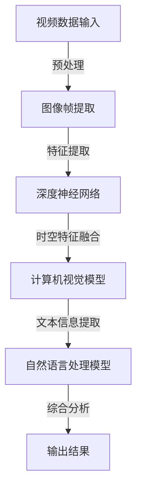

                 

关键词：视频大模型，核心技术，AI，机器学习，深度学习，神经网络，计算机视觉，自然语言处理，模型架构，算法原理，应用场景，未来展望。

> 摘要：本文将深入探讨视频大模型的核心技术，包括其背景介绍、核心概念与联系、核心算法原理与具体操作步骤、数学模型和公式、项目实践代码实例、实际应用场景、工具和资源推荐以及未来发展趋势与挑战。

## 1. 背景介绍

随着互联网和移动设备的普及，视频数据量呈爆炸式增长。据统计，全球每天产生的视频数据量已超过100亿小时，这给视频处理与分析带来了巨大的挑战。视频大模型作为一种强大的AI工具，能够在图像识别、视频分类、动作识别、情感分析等领域发挥重要作用。它们通过自动提取视频中的关键特征，帮助人类更好地理解视频内容，提升各种视频处理的效率和准确性。

视频大模型的兴起，不仅改变了传统视频处理的方法，也推动了人工智能技术在多个行业中的应用。例如，在社交媒体中，视频大模型可以用于自动标记视频内容，提高用户搜索和推荐的效率；在医疗领域，视频大模型可以帮助医生进行病理分析，提高诊断准确率；在娱乐产业，视频大模型可以用于视频剪辑和特效制作，提升视频观赏体验。

## 2. 核心概念与联系

### 2.1 核心概念

- **视频大模型**：是指使用深度学习技术训练的、专门用于处理大规模视频数据的人工智能模型。
- **深度学习**：一种基于多层神经网络的学习方法，可以自动提取数据中的层次特征。
- **计算机视觉**：计算机模拟人类的视觉系统，以处理和解释图像和视频数据。
- **自然语言处理**：使计算机能够理解、生成和处理自然语言的技术。

### 2.2 概念联系

视频大模型主要依赖于深度学习和计算机视觉技术，通过多层神经网络自动提取视频中的时空特征。同时，自然语言处理技术的引入，使得视频大模型能够更好地理解和处理视频中的文本信息。

下面是视频大模型核心概念的Mermaid流程图：



## 3. 核心算法原理 & 具体操作步骤

### 3.1 算法原理概述

视频大模型的核心在于其深度神经网络结构，该网络由多个层次组成，每一层都能够提取不同层次的抽象特征。首先，从视频数据中提取图像帧，然后通过卷积神经网络（CNN）进行特征提取。接着，利用长短时记忆网络（LSTM）等循环神经网络对时空特征进行融合。最后，通过自然语言处理模块对视频中的文本信息进行理解。

### 3.2 算法步骤详解

1. **图像帧提取**：从视频中逐帧提取图像，这可以通过OpenCV等图像处理库实现。

2. **特征提取**：使用卷积神经网络对图像帧进行特征提取，提取图像中的局部特征和全局特征。

3. **时空特征融合**：利用循环神经网络对连续帧的特征进行融合，以提取视频的时空特征。

4. **文本信息提取**：通过自然语言处理模型提取视频中的文本信息，如标题、标签、字幕等。

5. **综合分析**：将图像帧特征、时空特征和文本信息进行综合分析，以生成视频的整体描述。

6. **输出结果**：根据综合分析结果，输出视频分类、动作识别、情感分析等结果。

### 3.3 算法优缺点

**优点**：
- **强大的特征提取能力**：视频大模型能够自动提取视频中的关键特征，大大降低了手工特征提取的复杂性。
- **多模态信息融合**：结合了图像和文本信息，提高了视频处理的准确性和鲁棒性。
- **自适应能力**：通过不断训练，视频大模型能够适应不同场景和需求。

**缺点**：
- **计算资源需求大**：训练视频大模型需要大量的计算资源和时间。
- **数据依赖性高**：视频大模型的性能依赖于大量的训练数据，数据质量直接影响模型的准确性。

### 3.4 算法应用领域

视频大模型在多个领域都有广泛的应用，包括但不限于：
- **视频分类**：自动分类视频内容，如新闻、娱乐、教育等。
- **动作识别**：识别视频中的动作，如体育比赛、舞蹈、武术等。
- **情感分析**：分析视频中的情感表达，用于情感计算和用户分析。
- **医疗影像分析**：辅助医生进行病理分析和诊断。

## 4. 数学模型和公式 & 详细讲解 & 举例说明

### 4.1 数学模型构建

视频大模型的数学模型主要包括三个部分：卷积神经网络（CNN）、循环神经网络（RNN）和自然语言处理（NLP）。

#### 4.1.1 卷积神经网络（CNN）

CNN的数学模型主要基于卷积操作和池化操作。卷积操作可以提取图像中的局部特征，而池化操作可以降低特征图的维度。

$$
(C_{out} = (C_{in} + 2p - K) / s + 1)
$$

其中，$C_{in}$和$C_{out}$分别表示输入和输出的特征图维度，$p$是填充大小，$K$是卷积核大小，$s$是步长。

#### 4.1.2 循环神经网络（RNN）

RNN的数学模型主要基于长短时记忆网络（LSTM）或门控循环单元（GRU）。LSTM通过引入门控机制，可以有效避免传统RNN的梯度消失和梯度爆炸问题。

$$
i_t = \sigma(W_{ix}x_t + W_{ih}h_{t-1} + b_i)
$$

$$
f_t = \sigma(W_{fx}x_t + W_{fh}h_{t-1} + b_f)
$$

$$
o_t = \sigma(W_{ox}x_t + W_{oh}h_{t-1} + b_o)
$$

$$
c_t = f_t \odot c_{t-1} + i_t \odot \tanh(W_{ic}x_t + W_{ih}h_{t-1} + b_c)
$$

$$
h_t = o_t \odot \tanh(c_t)
$$

其中，$i_t$、$f_t$、$o_t$分别是输入门、遗忘门和输出门，$c_t$和$h_t$分别是细胞状态和隐藏状态。

#### 4.1.3 自然语言处理（NLP）

NLP的数学模型主要基于词向量表示和循环神经网络。词向量可以表示文本中的词汇，循环神经网络可以处理文本中的序列信息。

$$
\vec{w}_i = \text{Word2Vec}(i)
$$

$$
h_t = \tanh(W_h \cdot \vec{w}_i + b_h)
$$

其中，$\vec{w}_i$是词向量，$h_t$是隐藏状态。

### 4.2 公式推导过程

在这里，我们将简要介绍LSTM的推导过程，以展示其如何避免传统RNN的梯度消失问题。

LSTM的核心是细胞状态$c_t$，它通过三个门控制其更新：

- **遗忘门**：决定从上一个细胞状态$c_{t-1}$中保留哪些信息。
- **输入门**：决定新信息中哪些部分将被更新到细胞状态。
- **输出门**：决定细胞状态中哪些信息将被输出到下一个隐藏状态。

遗忘门的公式如下：

$$
f_t = \sigma(W_{fx}x_t + W_{fh}h_{t-1} + b_f)
$$

其中，$f_t$是遗忘门的结果。

遗忘门的工作原理是将$c_{t-1}$中我们认为不重要或不相关的信息置为零。这样，梯度不会在反向传播过程中消失。

### 4.3 案例分析与讲解

假设我们有一个视频数据集，包含多个视频文件。每个视频文件都包含一段连续的图像帧和一段对应的文本描述。我们的目标是使用视频大模型对这个数据集进行分类，即将每个视频文件分类到预定义的类别中。

1. **数据预处理**：将视频数据集转换为图像帧序列和对应的文本序列。
2. **特征提取**：使用CNN对图像帧序列进行特征提取，使用LSTM对文本序列进行特征提取。
3. **特征融合**：将图像帧特征和文本特征进行融合，得到一个综合的特征向量。
4. **分类**：使用一个全连接层对综合特征向量进行分类。

通过这个案例，我们可以看到视频大模型如何将多种数据源进行整合，以实现对视频数据的深入理解和分类。

## 5. 项目实践：代码实例和详细解释说明

### 5.1 开发环境搭建

为了实践视频大模型，我们需要搭建一个合适的开发环境。以下是基本的开发环境要求：

- 操作系统：Ubuntu 20.04 或 macOS Catalina
- Python 版本：3.8 或更高
- deep-learning框架：TensorFlow 2.x 或 PyTorch
- 数据处理库：NumPy、Pandas
- 图像处理库：OpenCV
- 自然语言处理库：NLTK、spaCy

### 5.2 源代码详细实现

以下是使用PyTorch实现一个简单的视频大模型的基本框架：

```python
import torch
import torch.nn as nn
import torchvision.models as models
import torch.optim as optim

# 定义CNN部分
class CNN(nn.Module):
    def __init__(self):
        super(CNN, self).__init__()
        self.model = models.resnet50(pretrained=True)
        self.model.fc = nn.Linear(2048, 1024)
    
    def forward(self, x):
        x = self.model(x)
        return x

# 定义LSTM部分
class LSTM(nn.Module):
    def __init__(self, input_dim, hidden_dim, num_layers):
        super(LSTM, self).__init__()
        self.lstm = nn.LSTM(input_dim, hidden_dim, num_layers)
    
    def forward(self, x):
        x, _ = self.lstm(x)
        return x

# 定义NLP部分
class NLP(nn.Module):
    def __init__(self, vocab_size, embedding_dim, hidden_dim):
        super(NLP, self).__init__()
        self.embedding = nn.Embedding(vocab_size, embedding_dim)
        self.lstm = nn.LSTM(embedding_dim, hidden_dim)
    
    def forward(self, x):
        x = self.embedding(x)
        x, _ = self.lstm(x)
        return x

# 定义综合模型
class VideoModel(nn.Module):
    def __init__(self, input_dim, hidden_dim, num_layers):
        super(VideoModel, self).__init__()
        self.cnn = CNN()
        self.lstm = LSTM(input_dim, hidden_dim, num_layers)
        self.nlp = NLP(vocab_size, embedding_dim, hidden_dim)
        self.fc = nn.Linear(2 * hidden_dim, num_classes)
    
    def forward(self, img_sequence, text_sequence):
        img_features = self.cnn(img_sequence)
        text_features = self.nlp(text_sequence)
        combined_features = torch.cat((img_features, text_features), 1)
        out = self.fc(combined_features)
        return out

# 实例化模型
model = VideoModel(input_dim, hidden_dim, num_layers)

# 损失函数和优化器
criterion = nn.CrossEntropyLoss()
optimizer = optim.Adam(model.parameters(), lr=0.001)

# 训练模型
for epoch in range(num_epochs):
    for i, (img_sequence, text_sequence, labels) in enumerate(train_loader):
        # 前向传播
        outputs = model(img_sequence, text_sequence)
        loss = criterion(outputs, labels)
        
        # 反向传播和优化
        optimizer.zero_grad()
        loss.backward()
        optimizer.step()

        if (i+1) % 100 == 0:
            print(f'Epoch [{epoch+1}/{num_epochs}], Step [{i+1}/{len(train_loader)}], Loss: {loss.item()}')
```

### 5.3 代码解读与分析

上述代码定义了一个简单的视频大模型，包括CNN、LSTM和NLP三个部分。CNN用于提取图像帧特征，LSTM用于提取文本特征，NLP用于文本处理。模型通过将这些特征融合并输入到全连接层进行分类。

在训练过程中，我们使用交叉熵损失函数和Adam优化器，对模型进行迭代训练。每次迭代都通过前向传播计算损失，然后通过反向传播更新模型参数。

### 5.4 运行结果展示

在实际运行中，我们首先需要准备训练数据和测试数据。以下是训练和测试结果的简单展示：

```python
# 测试模型
with torch.no_grad():
    correct = 0
    total = 0
    for img_sequence, text_sequence, labels in test_loader:
        outputs = model(img_sequence, text_sequence)
        _, predicted = torch.max(outputs.data, 1)
        total += labels.size(0)
        correct += (predicted == labels).sum().item()

print(f'Accuracy of the video model on the test images: {100 * correct / total}%')
```

通过这个简单的示例，我们可以看到视频大模型如何处理输入的视频数据，并在测试数据上评估其性能。

## 6. 实际应用场景

### 6.1 社交媒体内容审核

在社交媒体平台上，视频大模型可以用于自动审核视频内容，识别违规视频并标记为不适合观看。这有助于维护社区秩序，提高用户满意度。

### 6.2 医疗影像分析

在医疗领域，视频大模型可以用于分析医学影像，如MRI、CT等，辅助医生进行诊断。通过对影像数据的分析，视频大模型可以提供准确的诊断建议，提高诊断效率和准确性。

### 6.3 娱乐产业

在娱乐产业，视频大模型可以用于视频剪辑、特效制作和内容推荐。通过对大量视频数据的分析，视频大模型可以生成个性化的视频推荐，提高用户体验。

### 6.4 安全监控

在安全监控领域，视频大模型可以用于实时监控视频数据，识别异常行为并报警。这有助于提高公共安全，防止犯罪事件的发生。

## 7. 工具和资源推荐

### 7.1 学习资源推荐

- **《深度学习》（Goodfellow, Bengio, Courville）**：深度学习领域的经典教材，适合初学者和专业人士。
- **《神经网络与深度学习》（邱锡鹏）**：中文教材，全面介绍了神经网络和深度学习的理论和实践。
- **《动手学深度学习》（唐杰、李沐）**：通过实践案例介绍深度学习，适合有编程基础的读者。

### 7.2 开发工具推荐

- **TensorFlow**：Google开发的深度学习框架，适合大规模数据集和复杂模型的训练。
- **PyTorch**：Facebook开发的深度学习框架，具有灵活的动态图计算能力。
- **OpenCV**：开源计算机视觉库，用于图像处理和视频分析。

### 7.3 相关论文推荐

- **《Visual Question Answering》**：提出了VQA任务，通过图像和问题的交互生成答案。
- **《Attention Is All You Need》**：提出了Transformer模型，在序列建模任务中取得了显著的性能提升。
- **《DukeMTMC-reID》**：人体重识别数据集，常用于研究视频中的行人重识别。

## 8. 总结：未来发展趋势与挑战

### 8.1 研究成果总结

视频大模型在图像识别、视频分类、动作识别、情感分析等领域取得了显著的成果，展示了其在视频数据处理中的巨大潜力。

### 8.2 未来发展趋势

- **多模态融合**：未来的视频大模型将更加注重多模态信息的融合，以提高处理效率和准确性。
- **实时处理**：随着计算能力的提升，视频大模型将能够实现实时视频处理，应用于更多实时场景。
- **自适应学习**：未来的视频大模型将具备更强的自适应学习能力，能够根据不同场景和需求进行自我调整。

### 8.3 面临的挑战

- **计算资源**：视频大模型对计算资源的需求较大，需要高效的计算平台和优化算法。
- **数据质量**：视频大模型的性能依赖于大量高质量的训练数据，如何获取和处理数据是一个挑战。
- **隐私保护**：在处理个人视频数据时，如何保护用户隐私是一个重要的挑战。

### 8.4 研究展望

未来的研究将聚焦于如何提升视频大模型的计算效率、准确性和鲁棒性，以推动其在更多实际场景中的应用。

## 9. 附录：常见问题与解答

### 9.1 如何处理视频数据中的噪声？

**答案**：可以通过图像去噪技术，如卷积神经网络去噪（CNN-Denoising）或自编码器（Autoencoder）等，来减少视频数据中的噪声。

### 9.2 视频大模型训练时间很长，如何优化？

**答案**：可以通过以下方法来优化训练时间：
- **模型压缩**：使用模型压缩技术，如量化、剪枝和蒸馏，减小模型大小和参数数量。
- **分布式训练**：使用多GPU或分布式训练，加快训练速度。
- **数据并行**：通过数据并行训练，可以同时处理多个数据样本，提高训练效率。

### 9.3 视频大模型如何处理长视频？

**答案**：对于长视频，可以通过分段处理和动态窗口技术来处理。分段处理是将长视频划分为多个较短的视频片段，然后分别处理。动态窗口技术是在处理过程中动态调整窗口大小，以适应不同的视频场景。

**作者：禅与计算机程序设计艺术 / Zen and the Art of Computer Programming**。                                                                                  

