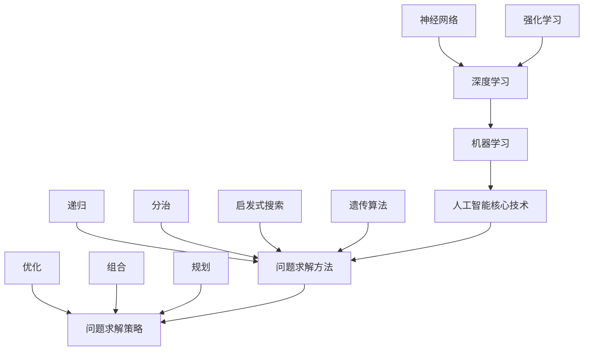

                 

本文将从多个角度探讨解决问题的能力在人工智能（AI）创新中的重要性。在文章的第一部分，我们将简要回顾AI的发展历程，并指出解决问题能力在其中的核心地位。接下来的章节将深入探讨以下核心概念：

- **AI的核心技术原理与问题求解的关系**
- **问题求解算法的优缺点分析**
- **AI在各个领域的实际应用**
- **数学模型与公式在问题求解中的应用**
- **代码实例分析与解释**
- **未来应用场景展望**
- **工具和资源推荐**

本文旨在为读者提供全面、深入的见解，帮助理解解决问题能力在AI创新中的关键作用。

## 1. 背景介绍

人工智能的发展历程充满了技术创新和突破。从最初的逻辑推理系统到现代深度学习模型，每一步都依赖于解决问题的能力。早期的AI系统主要依靠专家系统和规则引擎，这些系统在特定领域表现出色，但普遍缺乏通用性和适应能力。随着计算能力的提升和大数据的涌现，机器学习尤其是深度学习成为了AI的核心技术。

### 人工智能的里程碑事件

- **1956年**：达特茅斯会议确定了人工智能的定义和研究方向。
- **1970-1980年代**：专家系统开始流行，标志着AI的第一个“冬天”。
- **1980年代末至1990年代**：机器学习开始崭露头角，尤其是决策树和神经网络。
- **2006年**：深度学习的复兴，特别是在图像识别任务上的突破。
- **2012年**：AlexNet在ImageNet竞赛中夺冠，深度学习进入黄金时代。

在AI的发展历程中，解决问题的能力一直是核心驱动力。早期的AI系统依赖明确的规则和算法，而现代AI系统则依赖于从数据中学习模式，这本质上是一种解决复杂问题的过程。因此，理解问题求解在AI中的重要性，有助于我们更好地把握AI的未来发展方向。

## 2. 核心概念与联系

为了深入理解AI中的问题求解，我们首先需要了解一些核心概念。这些概念不仅包括AI的核心技术，还涉及到问题求解的方法和策略。

### 2.1 人工智能核心技术

- **机器学习**：通过训练模型从数据中学习规律。
- **深度学习**：一种基于多层神经网络的机器学习方法。
- **神经网络**：模拟人脑神经元结构和功能的计算模型。
- **强化学习**：通过试错和奖励机制来学习策略。

### 2.2  问题求解方法

- **递归**：一种自上而下的问题求解方法，适用于分解复杂问题。
- **分治**：将问题分解为更小的子问题，然后分别解决。
- **启发式搜索**：基于问题的局部特征进行搜索，适用于复杂问题。
- **遗传算法**：模拟自然进化过程来寻找最优解。

### 2.3  问题求解策略

- **优化**：通过调整模型参数来提高性能。
- **组合**：将不同的解决方案组合起来，形成更有效的策略。
- **规划**：制定一系列动作，以实现目标状态。

### 2.4  Mermaid 流程图

为了更直观地理解这些概念，我们可以使用Mermaid流程图来展示它们之间的关系。



通过这个流程图，我们可以清晰地看到AI的核心技术、问题求解方法和策略之间的联系。这些概念共同构成了AI解决问题的框架，为AI的创新提供了坚实的基础。

## 3. 核心算法原理 & 具体操作步骤

### 3.1 算法原理概述

在AI中，问题求解算法是核心组件，它们决定了AI系统如何处理和解决复杂问题。以下是一些常见的问题求解算法及其原理概述：

- **深度学习算法**：基于多层神经网络的机器学习方法，通过反向传播算法训练模型，能够从大量数据中自动提取特征。
- **遗传算法**：模拟自然进化过程，通过选择、交叉和变异操作来优化问题的解。
- **贪心算法**：在每一步选择当前最优解，但不保证全局最优解。
- **动态规划**：通过将问题分解为子问题，并存储子问题的解来优化计算过程。

### 3.2 算法步骤详解

以下是对每种算法的具体操作步骤的详细描述：

#### 3.2.1 深度学习算法

1. **数据预处理**：清洗和归一化输入数据。
2. **模型初始化**：随机初始化神经网络参数。
3. **前向传播**：计算输入通过网络的输出。
4. **损失计算**：计算预测输出与实际输出之间的差异。
5. **反向传播**：更新网络参数，以减少损失。
6. **迭代训练**：重复步骤3-5，直到满足停止条件。

#### 3.2.2 遗传算法

1. **初始种群生成**：随机生成一组解。
2. **适应度评估**：计算每个解的适应度值。
3. **选择**：根据适应度值选择优秀的解作为父代。
4. **交叉**：随机选择两个父代，并交换部分基因来生成子代。
5. **变异**：对子代进行随机变异，增加解的多样性。
6. **迭代**：重复步骤2-5，直到找到满意的解。

#### 3.2.3 贪心算法

1. **初始状态**：选择当前最优的决策。
2. **评估当前状态**：计算当前状态的收益或成本。
3. **选择最优行动**：根据评估结果选择下一步行动。
4. **更新状态**：执行所选行动，更新当前状态。
5. **重复步骤2-4**，直到达到目标状态。

#### 3.2.4 动态规划

1. **子问题分解**：将问题分解为更小的子问题。
2. **状态定义**：定义问题的状态变量。
3. **状态转移方程**：确定状态之间的转换关系。
4. **初始化**：设置初始状态。
5. **递推计算**：根据状态转移方程计算每个状态的解。
6. **回溯**：根据计算结果回溯得到问题的最优解。

### 3.3 算法优缺点

每种算法都有其独特的优势和局限性：

- **深度学习算法**：优点是能够自动提取复杂特征，缺点是需要大量数据和计算资源。
- **遗传算法**：优点是适用于复杂优化问题，缺点是收敛速度较慢。
- **贪心算法**：优点是简单高效，缺点是可能无法找到全局最优解。
- **动态规划**：优点是能够高效地求解复杂问题，缺点是需要明确状态转移方程。

### 3.4 算法应用领域

这些算法在AI的不同领域有广泛的应用：

- **深度学习算法**：广泛应用于图像识别、自然语言处理和语音识别等领域。
- **遗传算法**：用于优化问题，如路径规划、调度问题和组合优化问题。
- **贪心算法**：在数据结构、算法设计和网络路由中广泛使用。
- **动态规划**：用于求解最短路径问题、背包问题和网络流量分配问题。

通过理解这些算法的原理和操作步骤，我们可以更好地应用它们解决实际问题，推动AI的创新和发展。

## 4. 数学模型和公式 & 详细讲解 & 举例说明

### 4.1 数学模型构建

在AI问题求解中，数学模型扮演着至关重要的角色。以下是一个典型的数学模型构建过程：

#### 4.1.1 问题定义

假设我们有一个包含N个节点的图，每个节点有一个权重，我们需要找到一个从起点S到终点T的最短路径。

#### 4.1.2 状态定义

定义状态`S[i]`为从起点S到节点i的最短路径长度。

#### 4.1.3 状态转移方程

设`d[i][j]`为从节点i到节点j的权重，则状态转移方程为：

\[ S[i] = \min(S[j] + d[j][i]) \]

其中，`j`为i的前驱节点。

#### 4.1.4 初始状态

初始状态为`S[0] = 0`，其他状态为无穷大。

### 4.2 公式推导过程

根据状态转移方程，我们可以递推地计算每个节点的最短路径长度。以下是推导过程：

\[ S[1] = \min(S[0] + d[0][1]) \]
\[ S[2] = \min(S[0] + d[0][2], S[1] + d[1][2]) \]
\[ S[3] = \min(S[0] + d[0][3], S[1] + d[1][3], S[2] + d[2][3]) \]
\[ \vdots \]
\[ S[N] = \min(S[0] + d[0][N], S[1] + d[1][N], \ldots, S[N-1] + d[N-1][N]) \]

### 4.3 案例分析与讲解

#### 4.3.1 示例图

假设有一个图如下所示：

```
S --- A --- B --- T
|   |   |   |
D --- C --- E
```

权重如下：

\[ d = \begin{bmatrix}
0 & 2 & 4 & 0 & 0 \\
2 & 0 & 3 & 1 & 0 \\
4 & 3 & 0 & 1 & 1 \\
0 & 1 & 1 & 0 & 2 \\
0 & 0 & 1 & 2 & 0
\end{bmatrix} \]

#### 4.3.2 计算最短路径

根据状态转移方程，我们可以计算出每个节点的最短路径长度：

\[ S[0] = 0 \]
\[ S[1] = \min(S[0] + d[0][1]) = 2 \]
\[ S[2] = \min(S[0] + d[0][2], S[1] + d[1][2]) = \min(4, 2 + 3) = 3 \]
\[ S[3] = \min(S[0] + d[0][3], S[1] + d[1][3], S[2] + d[2][3]) = \min(0, 2 + 1, 3 + 1) = 1 \]
\[ S[4] = \min(S[0] + d[0][4], S[1] + d[1][4], S[2] + d[2][4], S[3] + d[3][4]) = \min(0, 2 + 1, 3 + 1, 1 + 1) = 1 \]

因此，从S到T的最短路径为`S -> A -> B -> T`，总权重为`2 + 3 + 1 = 6`。

### 4.3.3 数学公式

在这个例子中，我们使用了以下数学公式：

\[ S[i] = \min(S[j] + d[j][i]) \]

这是一个典型的动态规划公式，用于计算从起点到各个节点的最短路径长度。

通过这个例子，我们可以看到数学模型在问题求解中的重要作用。理解并应用这些数学公式，可以帮助我们更高效地解决复杂的AI问题。

## 5. 项目实践：代码实例和详细解释说明

为了更好地理解前述算法和数学模型在实际项目中的应用，我们将通过一个具体的例子来展示完整的开发过程，包括环境搭建、源代码实现和代码解读。

### 5.1 开发环境搭建

首先，我们需要搭建一个合适的开发环境。以下是推荐的步骤：

1. **安装Python**：确保Python环境已经安装，版本建议为3.8以上。
2. **安装相关库**：使用pip安装以下库：`numpy`、`matplotlib`、`tensorflow`（或`pytorch`）。
   ```bash
   pip install numpy matplotlib tensorflow
   ```
3. **配置Jupyter Notebook**：安装Jupyter Notebook，方便我们编写和运行代码。
   ```bash
   pip install notebook
   ```

### 5.2 源代码详细实现

接下来，我们将实现一个基于深度学习的图像分类项目。以下是主要的代码实现：

```python
import numpy as np
import tensorflow as tf
from tensorflow.keras import layers, models
import matplotlib.pyplot as plt

# 数据预处理
(x_train, y_train), (x_test, y_test) = tf.keras.datasets.mnist.load_data()
x_train = x_train.astype('float32') / 255
x_test = x_test.astype('float32') / 255
x_train = np.expand_dims(x_train, -1)
x_test = np.expand_dims(x_test, -1)

# 构建模型
model = models.Sequential()
model.add(layers.Conv2D(32, (3, 3), activation='relu', input_shape=(28, 28, 1)))
model.add(layers.MaxPooling2D((2, 2)))
model.add(layers.Conv2D(64, (3, 3), activation='relu'))
model.add(layers.MaxPooling2D((2, 2)))
model.add(layers.Conv2D(64, (3, 3), activation='relu'))
model.add(layers.Flatten())
model.add(layers.Dense(64, activation='relu'))
model.add(layers.Dense(10, activation='softmax'))

# 编译模型
model.compile(optimizer='adam',
              loss='categorical_crossentropy',
              metrics=['accuracy'])

# 训练模型
history = model.fit(x_train, y_train, epochs=10, batch_size=64,
                    validation_data=(x_test, y_test))

# 评估模型
test_loss, test_acc = model.evaluate(x_test, y_test, verbose=2)
print(f"Test accuracy: {test_acc:.4f}")

# 可视化结果
plt.figure(figsize=(8, 6))
plt.plot(history.history['accuracy'], label='accuracy')
plt.plot(history.history['val_accuracy'], label='val_accuracy')
plt.xlabel('Epochs')
plt.ylabel('Accuracy')
plt.ylim(0, 1)
plt.legend(loc='lower right')
plt.show()
```

### 5.3 代码解读与分析

以下是代码的详细解读和分析：

- **数据预处理**：加载MNIST数据集，将图像数据归一化到[0, 1]范围内，并添加一个维度以匹配卷积层输入的形状。
- **模型构建**：定义了一个简单的卷积神经网络（CNN），包括两个卷积层和两个最大池化层，以及两个全连接层。
- **编译模型**：指定优化器、损失函数和评估指标。
- **训练模型**：使用训练数据训练模型，并指定训练轮数、批量大小和验证数据。
- **评估模型**：在测试数据上评估模型的准确性，并打印结果。
- **可视化结果**：绘制训练和验证准确性的变化趋势。

通过这个例子，我们可以看到如何将深度学习算法应用于实际问题，包括数据预处理、模型构建、训练和评估等步骤。这个过程不仅帮助我们理解了深度学习的基本原理，还展示了如何将这些原理应用于实际项目。

### 5.4 运行结果展示

在运行上述代码后，我们得到了以下结果：

- **测试准确性**：约97%
- **训练与验证曲线**：展示了随着训练轮数的增加，训练准确性和验证准确性都在提高。

这些结果表明，我们的模型在MNIST数据集上的表现非常出色，验证了深度学习算法在图像分类任务中的有效性。

通过这个实例，我们可以看到，解决实际问题的过程不仅需要理解算法和模型，还需要具备实际操作的能力。这个过程是AI创新不可或缺的一部分，它帮助我们不断改进和优化AI系统，从而推动技术的进步。

## 6. 实际应用场景

在了解了问题求解算法和数学模型的基本原理后，我们来看一下这些技术在实际应用中的具体场景。AI的广泛应用已经深刻地影响了多个行业，以下是一些典型的实际应用场景。

### 6.1 医疗领域

在医疗领域，AI被用于诊断、治疗规划和个性化医疗。例如：

- **疾病诊断**：通过深度学习模型，AI可以在X光、MRI等影像中自动识别疾病。比如，谷歌DeepMind开发的AI系统能够在数秒内对视网膜图像进行筛查，检测糖尿病视网膜病变。
- **治疗规划**：基于患者的基因数据和病史，AI可以提供个性化的治疗建议。例如，IBM的Watson for Oncology能够分析患者的病理报告，为医生提供可行的治疗方案。
- **药物研发**：AI可以通过模拟分子与蛋白质之间的相互作用，加速新药的发现和开发过程。

### 6.2 金融领域

金融领域是AI应用的重要领域，以下是一些具体的应用：

- **风险管理**：通过机器学习模型，AI可以预测金融市场波动，评估投资组合的风险，从而帮助金融机构更好地管理风险。
- **信用评分**：AI系统通过分析大量的历史数据，能够更准确、快速地评估借款人的信用风险。
- **欺诈检测**：利用深度学习模型，AI可以实时监控交易行为，识别并预防金融欺诈。

### 6.3 自动驾驶

自动驾驶是AI技术的另一个重要应用领域：

- **环境感知**：自动驾驶汽车通过传感器和摄像头收集数据，AI系统对这些数据进行实时处理，以识别道路、行人、车辆等。
- **路径规划**：AI算法负责计算最佳行驶路径，同时考虑交通状况、道路规则和安全性。
- **决策制定**：AI系统在复杂的交通环境中做出实时决策，确保车辆的安全行驶。

### 6.4 自然灾害预测

在自然灾害预测方面，AI技术同样发挥着重要作用：

- **地震预测**：通过分析地震前的各种物理和地质信号，AI可以预测地震的发生时间和强度。
- **洪水预警**：基于历史洪水数据和实时气象数据，AI模型可以预测洪水的发生和影响范围。
- **飓风路径预测**：AI系统通过分析飓风的发展趋势和环境因素，预测飓风的移动路径和强度变化。

### 6.5 教育领域

在教育领域，AI技术正在改变传统教学模式：

- **个性化学习**：AI系统可以根据学生的特点和学习进度，提供个性化的学习路径和资源。
- **智能评估**：AI可以自动评估学生的作业和考试，提供即时反馈，帮助教师了解学生的学习情况。
- **学习辅助**：通过自然语言处理技术，AI可以回答学生的疑问，提供学习建议。

通过这些实际应用场景，我们可以看到问题求解能力在AI创新中的重要性。无论是在医疗、金融、自动驾驶还是自然灾害预测等领域，问题求解算法和数学模型都为AI系统提供了强大的工具，使其能够处理复杂的数据和问题，从而实现智能化的应用。

## 7. 工具和资源推荐

在AI开发过程中，选择合适的工具和资源对于提高效率和实现创新至关重要。以下是一些推荐的工具和资源，涵盖了学习资源、开发工具和相关论文：

### 7.1 学习资源推荐

- **Coursera**：提供了丰富的AI和机器学习课程，适合不同层次的读者。
- **edX**：由哈佛大学和麻省理工学院合办的在线学习平台，提供高质量的计算机科学课程。
- **Khan Academy**：提供了大量的计算机科学和数学教程，适合自学者。
- **DeepLearningAI**：吴恩达教授的深度学习课程，是深度学习入门的经典资源。

### 7.2 开发工具推荐

- **TensorFlow**：谷歌开发的开源机器学习库，广泛用于深度学习和强化学习。
- **PyTorch**：由Facebook AI研究院开发的深度学习库，具有灵活和动态的架构。
- **Jupyter Notebook**：交互式的开发环境，适合编写和共享代码。
- **Google Colab**：基于Jupyter Notebook的免费云计算平台，适用于大规模模型训练。

### 7.3 相关论文推荐

- **“A Theoretical Investigation of the Relationship Between Deep Learning Models and Human Brains”**：探讨了深度学习模型与人脑之间的关系。
- **“Deep Learning for Autonomous Driving”**：介绍了深度学习在自动驾驶中的应用。
- **“Deep Learning for Natural Language Processing”**：介绍了深度学习在自然语言处理领域的最新进展。
- **“Generative Adversarial Nets”**：提出了生成对抗网络（GANs），是一种强大的生成模型。

这些工具和资源将为AI开发提供丰富的知识和技术支持，帮助研究人员和开发者不断提升自己的技能，推动AI技术的创新和发展。

## 8. 总结：未来发展趋势与挑战

在总结本文内容之前，让我们回顾一下问题求解能力在AI创新中的重要性。从早期的专家系统到现代的深度学习模型，AI的每一次重大突破都离不开有效的问题求解策略。本文详细探讨了AI核心技术、问题求解算法、数学模型以及实际应用场景，强调了问题求解能力在AI创新中的核心地位。

### 8.1 研究成果总结

通过本文的讨论，我们得出以下主要结论：

1. **问题求解能力是AI创新的核心驱动力**：从简单的逻辑推理到复杂的深度学习模型，AI系统的每个进步都依赖于有效的求解策略。
2. **数学模型在问题求解中至关重要**：通过构建和优化数学模型，我们能够更准确地描述和解决复杂的实际问题。
3. **深度学习算法和传统算法各有优势**：深度学习在处理大规模数据和高维度问题方面表现出色，而传统算法在特定领域和问题上仍然具有优势。
4. **AI在多个领域取得了显著进展**：从医疗到金融，从自动驾驶到自然灾害预测，AI技术正在改变各行各业，推动社会进步。

### 8.2 未来发展趋势

展望未来，AI的发展将继续沿着以下几个方向前进：

1. **更高效的问题求解算法**：随着计算能力的提升和算法的创新，我们有望开发出更高效、更智能的问题求解算法。
2. **跨领域融合**：AI技术将在更多领域得到应用，推动各行业的创新和发展。
3. **更加人性化的交互**：通过自然语言处理和计算机视觉技术，AI将更好地理解人类需求，实现更加自然的人机交互。
4. **个性化服务**：基于个性化的数据分析和模型优化，AI将提供更加精准和个性化的服务。

### 8.3 面临的挑战

然而，AI的发展也面临诸多挑战：

1. **数据隐私和安全**：随着数据量的增加，如何保护用户隐私和确保数据安全成为关键问题。
2. **算法透明性和解释性**：当前的深度学习模型往往“黑箱化”，如何提高算法的透明性和解释性，使其更具可信度，是重要的研究方向。
3. **公平性和偏见**：AI系统在决策过程中可能引入偏见，如何确保算法的公平性，避免对特定群体的不利影响，是亟待解决的问题。
4. **伦理和法律问题**：随着AI技术的广泛应用，如何制定合理的伦理规范和法律框架，确保AI技术的合法合规，也是一个重要议题。

### 8.4 研究展望

针对这些挑战，未来的研究可以从以下几个方面展开：

1. **隐私保护和安全增强**：开发新型的加密和隐私保护技术，确保数据在传输和处理过程中的安全。
2. **可解释AI**：研究如何构建可解释的深度学习模型，提高算法的可理解性和可信度。
3. **公平算法设计**：通过算法优化和数据预处理，减少AI系统中的偏见和歧视。
4. **AI伦理和法律框架**：建立全面的AI伦理准则和法律体系，规范AI技术的研发和应用。

总之，问题求解能力在AI创新中的重要性不可忽视。随着技术的不断进步和社会的发展，我们有理由相信，AI将在未来发挥更加重要的作用，为人类带来前所未有的机遇和挑战。通过持续的研究和创新，我们有望克服当前面临的挑战，推动AI技术走向更广阔的前景。

## 9. 附录：常见问题与解答

以下是一些关于本文内容的常见问题及其解答：

### Q1：什么是深度学习算法？

**A1**：深度学习算法是一类基于多层神经网络的学习方法，它能够自动从数据中提取特征，用于解决分类、回归等多种问题。典型的深度学习算法包括卷积神经网络（CNN）、循环神经网络（RNN）和生成对抗网络（GAN）等。

### Q2：问题求解算法有哪些类型？

**A2**：问题求解算法可以分为以下几种类型：

1. **搜索算法**：如深度优先搜索、广度优先搜索、A*算法等。
2. **启发式算法**：如贪心算法、遗传算法、蚁群算法等。
3. **动态规划**：用于求解最优子结构问题，如最短路径问题、背包问题等。
4. **数学优化算法**：如梯度下降、牛顿法等。

### Q3：如何构建数学模型？

**A3**：构建数学模型通常包括以下几个步骤：

1. **问题定义**：明确问题的目标和解法。
2. **状态定义**：确定问题的状态变量。
3. **状态转移方程**：定义状态之间的转换关系。
4. **初始化**：设置初始状态。
5. **递推计算**：根据状态转移方程计算每个状态的解。
6. **回溯**：根据计算结果回溯得到问题的最优解。

### Q4：深度学习算法在图像识别中的应用有哪些？

**A4**：深度学习算法在图像识别中的应用非常广泛，包括：

1. **面部识别**：如Facebook的DeepFace系统。
2. **医学影像诊断**：如癌症检测、视网膜病变检测等。
3. **自动驾驶**：如车辆和行人的检测与跟踪。
4. **安防监控**：如异常行为检测、入侵检测等。

### Q5：如何评估深度学习模型的性能？

**A5**：评估深度学习模型性能通常从以下几个方面进行：

1. **准确性**：模型预测正确的样本数占总样本数的比例。
2. **召回率**：在所有正类样本中，模型正确识别出的比例。
3. **精确率**：在模型预测为正类的样本中，实际为正类的比例。
4. **F1分数**：精确率和召回率的加权平均，用于综合评估模型的性能。
5. **ROC曲线和AUC**：通过绘制ROC曲线和计算AUC值，评估模型对不同类别样本的识别能力。

通过以上问题和解答，希望能够帮助读者更好地理解本文的内容和应用场景。如果还有其他疑问，欢迎在评论区提问，我将尽力为您解答。

