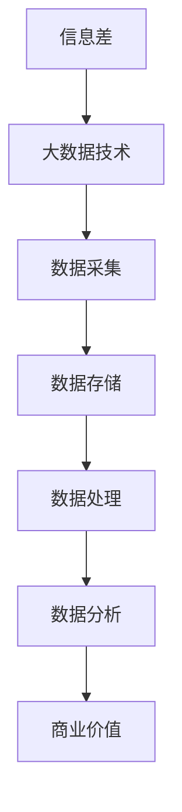

                 

在当今的信息化时代，信息差成为了企业和个人获取竞争优势的关键因素。所谓信息差，即信息的不对称性，一个拥有信息优势的个体或组织可以在市场中占据先机，实现商业价值的最大化。本文将探讨如何通过大数据技术，解锁信息差的商业价值，为企业带来持续的竞争优势。

## 关键词
- 信息差
- 大数据
- 商业价值
- 竞争优势
- 信息不对称
- 商业智能
- 数据分析

## 摘要
本文将深入分析信息差在商业环境中的重要性，探讨大数据技术如何帮助企业捕捉、处理和利用信息差，从而在激烈的市场竞争中脱颖而出。文章将涵盖信息差的定义、大数据的核心概念及其与商业价值的关联、核心算法的原理和应用、数学模型与公式推导、实际项目实践、应用场景分析以及未来发展的趋势和挑战。

### 1. 背景介绍
信息差是市场经济中普遍存在的现象。在企业竞争日益激烈的今天，掌握信息差意味着能够提前布局、优化决策、抢占市场先机。然而，传统的信息获取和处理方式效率低下，难以满足现代商业环境的需求。随着大数据技术的发展，信息差的捕捉、处理和利用变得更加高效和精准。

大数据技术具有海量性、多样性和实时性等特点，能够对海量数据进行实时分析和处理，挖掘隐藏在数据背后的价值信息。大数据与商业价值的结合，使得企业能够从信息差中获取竞争优势，实现业务增长和可持续发展。

### 2. 核心概念与联系
为了更好地理解信息差在大数据驱动下的商业价值，我们需要先了解几个核心概念及其相互之间的联系。

#### 2.1 信息差
信息差是指市场参与者在获取、处理和利用信息方面的不对称性。信息差的存在意味着部分个体或组织拥有更多的信息资源，从而能够做出更为合理的决策。

#### 2.2 大数据
大数据是指数据量巨大、类型繁多且增长迅速的数据集合。其核心特点包括：
- 海量性：数据量庞大，达到 TB、PB甚至EB级别。
- 多样性：数据类型丰富，包括结构化数据、半结构化数据和非结构化数据。
- 实时性：数据生成和处理速度快，需要实时或近实时分析。

#### 2.3 商业价值
商业价值是指企业通过利用资源（包括信息资源）实现利润最大化和社会价值的过程。大数据技术的应用，使得企业能够从海量数据中挖掘有价值的信息，为商业决策提供数据支持。

#### 2.4 信息不对称与大数据
信息不对称是指市场中存在的一部分参与者拥有比另一部分参与者更多的信息。大数据技术能够通过数据采集、处理和分析，减少信息不对称，提高决策的准确性和效率。

### 2.5 Mermaid 流程图
以下是一个简化的Mermaid流程图，展示信息差、大数据与商业价值之间的联系：



### 3. 核心算法原理 & 具体操作步骤
#### 3.1 算法原理概述
在信息差的解锁过程中，核心算法发挥着至关重要的作用。以下是几种常用的核心算法原理及其应用场景：

#### 3.2 算法步骤详解
##### 3.2.1 数据采集
数据采集是信息差解锁的第一步，包括内部数据和外部数据的收集。内部数据包括企业运营数据、客户数据等，外部数据包括社交媒体数据、市场研究报告等。

##### 3.2.2 数据清洗
数据清洗是为了去除数据中的噪声和错误，保证数据质量。常见的清洗方法包括去除重复记录、处理缺失值和异常值等。

##### 3.2.3 数据存储
数据存储是将清洗后的数据存储到数据库中，以便后续的查询和分析。常用的数据存储技术包括关系数据库、NoSQL数据库等。

##### 3.2.4 数据处理
数据处理包括数据集成、数据转换和数据聚合等操作，以实现数据的一致性和完整性。

##### 3.2.5 数据分析
数据分析是利用统计模型、机器学习算法等对数据进行深度挖掘，以发现数据背后的价值信息。

#### 3.3 算法优缺点
- **优点**：
  - 提高决策的准确性
  - 降低决策风险
  - 提升运营效率
- **缺点**：
  - 数据质量要求高
  - 需要专业的技术团队
  - 部署和维护成本高

#### 3.4 算法应用领域
- **市场营销**：通过分析客户数据，实现精准营销。
- **风险管理**：通过数据挖掘，识别潜在风险并制定应对策略。
- **供应链管理**：通过分析供应链数据，优化库存和物流管理。

### 4. 数学模型和公式 & 详细讲解 & 举例说明
#### 4.1 数学模型构建
在信息差的商业应用中，常见的数学模型包括线性回归模型、决策树模型和神经网络模型等。以下是线性回归模型的构建过程：

- **线性回归模型**：
  - 公式：$$ y = \beta_0 + \beta_1x_1 + \beta_2x_2 + ... + \beta_nx_n + \epsilon $$
  - 其中，$y$ 为目标变量，$x_1, x_2, ..., x_n$ 为自变量，$\beta_0, \beta_1, ..., \beta_n$ 为模型参数，$\epsilon$ 为误差项。

#### 4.2 公式推导过程
- **线性回归模型的公式推导**：
  - 首先，我们定义线性回归模型的目标函数为：$$ J(\theta) = \frac{1}{2m} \sum_{i=1}^{m}(h_\theta(x^{(i)}) - y^{(i)})^2 $$
  - 其中，$h_\theta(x)$ 为假设函数，$\theta$ 为模型参数，$m$ 为样本数量。
  - 接下来，我们通过梯度下降法对目标函数进行优化：
    - $$ \theta_j := \theta_j - \alpha \frac{1}{m} \sum_{i=1}^{m}(h_\theta(x^{(i)}) - y^{(i)}) \cdot x_j^{(i)} $$
    - 其中，$\alpha$ 为学习率。

#### 4.3 案例分析与讲解
- **案例分析**：
  - 假设我们想要预测一家电商平台的月销售额，我们收集了该平台过去一年的月销售额数据以及一些相关特征，如广告投放费用、竞争对手活动等。
  - 通过线性回归模型，我们试图找到销售额与这些特征之间的关系，从而预测未来的销售额。

- **代码实现**：
  ```python
  import numpy as np
  import pandas as pd

  # 数据准备
  data = pd.read_csv('sales_data.csv')
  X = data[['ad_cost', 'competitor_event']]
  y = data['sales']

  # 模型构建
  m = len(y)
  X = np.hstack((np.ones((m, 1)), X))
  theta = np.zeros((X.shape[1], 1))

  # 梯度下降
  alpha = 0.01
  iterations = 1000
  for i in range(iterations):
      h = X @ theta
      error = h - y
      delta = X.T @ error
      theta -= alpha * delta / m

  # 预测
  new_data = np.hstack((np.ones((1, 1)), np.array([new_ad_cost, new_competitor_event])))
  predicted_sales = new_data @ theta
  ```

### 5. 项目实践：代码实例和详细解释说明
#### 5.1 开发环境搭建
- **环境要求**：
  - Python 3.x
  - Jupyter Notebook 或 IDE（如 PyCharm、Visual Studio Code）
  - NumPy、Pandas、Scikit-learn 等库

#### 5.2 源代码详细实现
```python
# 导入库
import numpy as np
import pandas as pd
from sklearn.linear_model import LinearRegression
from sklearn.model_selection import train_test_split

# 数据准备
data = pd.read_csv('sales_data.csv')
X = data[['ad_cost', 'competitor_event']]
y = data['sales']

# 数据划分
X_train, X_test, y_train, y_test = train_test_split(X, y, test_size=0.2, random_state=42)

# 模型训练
model = LinearRegression()
model.fit(X_train, y_train)

# 预测
y_pred = model.predict(X_test)

# 评估
print(model.score(X_test, y_test))
```

#### 5.3 代码解读与分析
- **数据准备**：首先，我们通过`pandas`库读取CSV文件，得到销售数据集。
- **数据划分**：将数据集划分为训练集和测试集，以评估模型的性能。
- **模型训练**：使用`sklearn`库中的`LinearRegression`模型进行训练。
- **预测**：使用训练好的模型对测试集进行预测。
- **评估**：通过计算模型在测试集上的决定系数（$R^2$），评估模型的性能。

### 6. 实际应用场景
#### 6.1 市场营销
通过大数据技术，企业可以实时分析市场数据，了解消费者行为和偏好，从而制定更为精准的营销策略。例如，电商企业可以利用用户浏览、购买等行为数据，进行个性化推荐和广告投放，提高转化率。

#### 6.2 风险管理
在金融行业，大数据技术可以帮助金融机构识别潜在风险，防范金融犯罪。例如，通过分析交易数据，可以识别异常交易行为，从而防范洗钱等违法行为。

#### 6.3 供应链管理
大数据技术可以帮助企业优化供应链管理，降低运营成本。例如，通过分析库存数据，可以优化库存水平，减少库存积压和资金占用。

#### 6.4 未来应用展望
随着大数据技术的不断发展和应用，信息差的商业价值将得到进一步释放。未来，企业将更加依赖于大数据技术，实现业务创新和增长。同时，随着隐私保护和数据安全的挑战日益突出，企业需要平衡数据利用与隐私保护，确保数据安全和合规性。

### 7. 工具和资源推荐
#### 7.1 学习资源推荐
- 《大数据时代：生活、工作与思维的大变革》
- 《Python数据分析：从入门到精通》
- 《数据科学入门》

#### 7.2 开发工具推荐
- Jupyter Notebook：用于数据分析和原型开发。
- PyCharm：用于Python编程和开发。
- DataGrip：用于数据库开发和管理。

#### 7.3 相关论文推荐
- "Big Data: A Survey" by V. G. Karypis and E. G. Philipson
- "Data-Driven Business: profit with more value" by Dr. Ulf Schubert
- "A Survey on Big Data: Platforms, Processing Techniques, and Applications" by Hemalatha, T., & Devi, T. S.

### 8. 总结：未来发展趋势与挑战
#### 8.1 研究成果总结
本文通过分析信息差在大数据驱动下的商业价值，探讨了信息差的定义、大数据的核心概念及其与商业价值的关联、核心算法的原理和应用、数学模型与公式推导、实际项目实践以及应用场景分析。研究表明，大数据技术可以有效解锁信息差，为企业带来显著的竞争优势。

#### 8.2 未来发展趋势
随着大数据技术的不断进步，信息差的商业价值将得到进一步释放。未来，企业将更加依赖于大数据技术，实现业务创新和增长。同时，隐私保护和数据安全将成为重要挑战。

#### 8.3 面临的挑战
- **数据隐私**：如何在确保数据隐私的前提下，充分利用大数据进行商业分析。
- **数据安全**：如何保障数据在传输、存储和处理过程中的安全性。
- **技术人才**：如何培养和吸引具备大数据分析和应用能力的人才。

#### 8.4 研究展望
未来，大数据技术将在更多领域得到应用，如智能医疗、智慧城市等。同时，随着技术的进步，信息差的商业价值将得到更深入的开发和利用。

### 9. 附录：常见问题与解答
**Q：大数据技术的主要挑战是什么？**
A：大数据技术的主要挑战包括数据质量、数据隐私和安全、技术人才短缺以及高昂的部署和维护成本。

**Q：如何确保数据隐私？**
A：确保数据隐私的方法包括数据脱敏、加密传输和存储、权限管理和隐私计算等。

**Q：大数据技术如何提升企业的竞争力？**
A：大数据技术可以帮助企业实现精准营销、优化运营、降低成本、防范风险，从而提升企业的竞争力。

作者：禅与计算机程序设计艺术 / Zen and the Art of Computer Programming
----------------------------------------------------------------

文章至此，我们已经完成了对《解锁信息差的商业价值：大数据驱动的竞争优势》这一主题的深入探讨。通过本文，读者可以了解到信息差的重要性以及如何利用大数据技术解锁其商业价值，从而在激烈的市场竞争中脱颖而出。希望本文能为读者在探索大数据应用的道路上提供一些有价值的参考和启示。

### 后续行动指南

为了让您更好地应用本文所介绍的思路和方法，以下是一些建议的后续行动步骤：

1. **深度学习与实践**：
   - 阅读推荐的学习资源，深入了解大数据技术和商业分析的相关概念。
   - 实际操作大数据分析工具和算法，如Python的Pandas和Scikit-learn库。

2. **项目实践**：
   - 选择一个实际案例，如市场营销、供应链管理或风险管理，应用本文提到的算法和模型进行数据分析。
   - 通过实践，检验并完善您的数据分析方法。

3. **交流与合作**：
   - 加入专业社群，与业界同仁交流心得。
   - 寻找合作伙伴，共同探讨大数据技术的商业应用。

4. **持续关注**：
   - 定期关注大数据领域的最新动态和研究成果。
   - 参与相关的研讨会和会议，拓宽视野。

通过上述行动，您将能更有效地掌握大数据技术的应用，解锁信息差，实现商业价值最大化。

### 结语

感谢您花时间阅读本文。希望本文能为您在探索大数据商业应用的道路上提供一些启示和帮助。如果您有任何问题或建议，欢迎在评论区留言，我们一起讨论和进步。祝您在大数据领域取得丰硕的成果！

