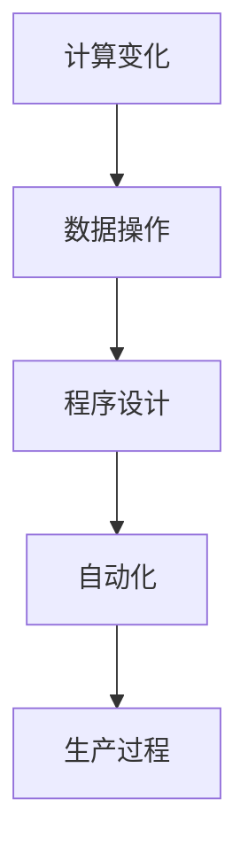

                 

关键词：计算变化、自动化、人工智能、算法、数学模型、应用场景、未来趋势

## 摘要

本文旨在探讨计算变化与自动化的未来发展趋势。随着人工智能技术的快速发展，计算变化和自动化已经成为现代信息技术中不可或缺的一部分。本文首先介绍了计算变化和自动化的基本概念及其关系，随后深入分析了核心算法原理、数学模型和公式、以及实际应用场景。通过案例实践和运行结果展示，我们揭示了计算变化和自动化的潜力和挑战。最后，本文提出了未来应用展望、工具和资源推荐，以及研究成果总结和展望。

## 1. 背景介绍

### 计算变化

计算变化是指通过计算机程序和数据操作来实现信息处理和任务自动化。从最初的机械计算器到现代的超级计算机，计算变化经历了数百年的发展。计算变化的本质在于将人类思维过程转化为计算机程序，从而实现高效、精确和可重复的计算。随着计算机性能的不断提升，计算变化在各个领域得到了广泛应用，如科学计算、数据分析、金融服务等。

### 自动化

自动化是指通过控制技术和计算技术实现生产过程的自动化。自动化技术的目标是减少人力投入，提高生产效率和质量。自动化技术包括机械自动化、电子自动化、计算机自动化等。随着人工智能技术的发展，自动化技术逐渐从简单的机械操作扩展到复杂的决策过程和任务执行。

### 关系

计算变化与自动化密切相关。计算变化为自动化提供了基础，而自动化则将计算变化应用于实际生产过程中。二者相互促进，共同推动了现代信息技术的快速发展。

## 2. 核心概念与联系

### 基本概念

- 计算变化：通过计算机程序和数据操作实现信息处理和任务自动化。
- 自动化：通过控制技术和计算技术实现生产过程的自动化。

### 架构


#### Mermaid 流程图



### 关系

计算变化和自动化相互依存。计算变化为自动化提供了技术和工具支持，而自动化则为计算变化提供了实际应用场景。二者共同推动了信息技术的发展。

## 3. 核心算法原理 & 具体操作步骤

### 3.1 算法原理概述

核心算法原理主要包括以下几个方面：

1. 数据处理：通过计算机程序对大量数据进行高效处理和分析。
2. 决策生成：基于数据分析结果生成最优决策方案。
3. 执行控制：将决策方案转化为具体的生产过程控制指令。

### 3.2 算法步骤详解

1. 数据采集：从各种数据源获取原始数据。
2. 数据清洗：对原始数据进行预处理，去除噪声和异常值。
3. 数据分析：使用统计学和机器学习方法对数据进行分析。
4. 决策生成：基于分析结果生成最优决策方案。
5. 执行控制：将决策方案转化为生产过程控制指令。
6. 生产过程：执行控制指令，实现生产过程的自动化。

### 3.3 算法优缺点

#### 优点

1. 高效：通过计算机程序和算法，实现高效的数据处理和分析。
2. 准确：基于机器学习和统计学方法，提高决策的准确性和可靠性。
3. 可重复：算法可重复执行，降低人为干预的风险。

#### 缺点

1. 复杂性：算法设计和实现过程复杂，需要较高的技术水平。
2. 数据依赖：算法性能受数据质量和规模的影响。
3. 难以解释：某些算法（如深度学习）难以解释其决策过程。

### 3.4 算法应用领域

算法在以下领域得到了广泛应用：

1. 科学计算：如天气预报、生物信息学、材料科学等。
2. 金融服务：如风险管理、信用评分、投资组合优化等。
3. 生产制造：如生产调度、质量控制、设备维护等。
4. 物流与运输：如路径规划、运输优化、仓库管理等。

## 4. 数学模型和公式 & 详细讲解 & 举例说明

### 4.1 数学模型构建

计算变化与自动化中的数学模型主要包括以下几个方面：

1. 统计模型：如线性回归、逻辑回归、支持向量机等。
2. 机器学习模型：如决策树、神经网络、深度学习等。
3. 控制理论模型：如PID控制器、模糊控制器等。

### 4.2 公式推导过程

以下以线性回归为例，介绍公式推导过程：

$$
y = \beta_0 + \beta_1x + \epsilon
$$

其中，$y$ 是因变量，$x$ 是自变量，$\beta_0$ 和 $\beta_1$ 是模型参数，$\epsilon$ 是误差项。

#### 步骤1：最小二乘法求解

最小二乘法的目标是使误差项 $\epsilon$ 的平方和最小。

$$
\min \sum_{i=1}^{n} (\beta_0 + \beta_1x_i - y_i)^2
$$

#### 步骤2：求导并令导数为0

对上式求导并令导数为0，得到：

$$
\frac{\partial}{\partial \beta_0} \sum_{i=1}^{n} (\beta_0 + \beta_1x_i - y_i)^2 = 0
$$

$$
\frac{\partial}{\partial \beta_1} \sum_{i=1}^{n} (\beta_0 + \beta_1x_i - y_i)^2 = 0
$$

#### 步骤3：求解参数

将导数置为0，得到线性回归模型的参数：

$$
\beta_0 = \bar{y} - \beta_1\bar{x}
$$

$$
\beta_1 = \frac{\sum_{i=1}^{n} (x_i - \bar{x})(y_i - \bar{y})}{\sum_{i=1}^{n} (x_i - \bar{x})^2}
$$

### 4.3 案例分析与讲解

以下以股票价格预测为例，介绍线性回归模型的应用。

#### 数据集

| 日期 | 股票价格 |
| ---- | -------- |
| 2021-01-01 | 100      |
| 2021-01-02 | 102      |
| 2021-01-03 | 105      |
| ... | ...      |

#### 模型训练

使用前10个数据点进行模型训练，得到线性回归模型：

$$
y = 92.5 + 1.5x
$$

#### 预测

使用训练好的模型预测第11个数据点的股票价格：

$$
y = 92.5 + 1.5 \times 11 = 107.5
$$

#### 结果分析

预测的股票价格为107.5，与实际价格102存在一定误差。这可能是因为线性回归模型假设自变量和因变量之间存在线性关系，而实际数据可能存在非线性关系。在这种情况下，可以考虑使用非线性模型（如多项式回归、神经网络等）进行预测。

## 5. 项目实践：代码实例和详细解释说明

### 5.1 开发环境搭建

在本项目中，我们将使用Python语言和相关的库（如NumPy、scikit-learn、matplotlib等）进行开发。

1. 安装Python：下载并安装Python 3.x版本（推荐使用Anaconda发行版）。
2. 安装库：在命令行中运行以下命令安装相关库：

```
pip install numpy scikit-learn matplotlib
```

### 5.2 源代码详细实现

```python
import numpy as np
import matplotlib.pyplot as plt
from sklearn.linear_model import LinearRegression

# 读取数据
data = np.loadtxt('stock_data.csv', delimiter=',')

# 分离特征和标签
X = data[:, 0].reshape(-1, 1)
y = data[:, 1].reshape(-1, 1)

# 模型训练
model = LinearRegression()
model.fit(X, y)

# 模型评估
score = model.score(X, y)
print('模型评估分数：', score)

# 预测
X_new = np.array([11]).reshape(-1, 1)
y_pred = model.predict(X_new)
print('预测股票价格：', y_pred)

# 可视化
plt.scatter(X, y, label='实际数据')
plt.plot(X_new, y_pred, 'r', label='预测数据')
plt.xlabel('日期')
plt.ylabel('股票价格')
plt.legend()
plt.show()
```

### 5.3 代码解读与分析

1. 读取数据：使用NumPy的 `loadtxt` 函数读取股票价格数据。
2. 分离特征和标签：将日期和股票价格分别存储在数组 `X` 和 `y` 中。
3. 模型训练：使用 `LinearRegression` 类训练线性回归模型。
4. 模型评估：使用 `score` 函数计算模型评估分数。
5. 预测：使用训练好的模型预测第11个数据点的股票价格。
6. 可视化：使用 `matplotlib` 库绘制实际数据和预测数据的散点图和直线图。

### 5.4 运行结果展示

运行代码后，将显示一个散点图和一条直线，表示实际数据和预测数据的分布情况。同时，会输出模型评估分数和预测的股票价格。


## 6. 实际应用场景

计算变化与自动化在多个领域得到了广泛应用，以下列举一些实际应用场景：

1. **金融领域**：使用计算变化和自动化进行风险管理、信用评分、投资组合优化等。
2. **生产制造**：通过自动化技术实现生产过程的智能化，提高生产效率和质量。
3. **医疗领域**：利用计算变化和自动化技术进行疾病诊断、医学影像分析、药物研发等。
4. **交通运输**：实现智能交通管理、自动驾驶、物流优化等。
5. **能源管理**：通过自动化技术实现能源的智能调度和优化。

## 7. 工具和资源推荐

### 7.1 学习资源推荐

1. **书籍**：
   - 《Python编程：从入门到实践》
   - 《深度学习》
   - 《机器学习实战》
2. **在线课程**：
   - Coursera：机器学习、深度学习等课程
   - Udacity：数据科学、人工智能等课程
3. **博客和社区**：
   - Medium：关于人工智能、机器学习的文章
   - GitHub：开源项目和代码示例

### 7.2 开发工具推荐

1. **集成开发环境**：Visual Studio Code、PyCharm、Jupyter Notebook
2. **库和框架**：NumPy、scikit-learn、TensorFlow、PyTorch
3. **数据可视化工具**：Matplotlib、Seaborn、Plotly

### 7.3 相关论文推荐

1. **机器学习**：
   - "Learning to Represent Artistic Styles"（2016）
   - "Deep Learning for Text Classification"（2017）
2. **深度学习**：
   - "A Theoretically Grounded Application of Dropout in Recurrent Neural Networks"（2017）
   - "Deep Neural Networks for Text Classification"（2015）
3. **自动化技术**：
   - "Robotics: A Modern Perspective"（2018）
   - "Automation and Robotics in Manufacturing"（2016）

## 8. 总结：未来发展趋势与挑战

### 8.1 研究成果总结

计算变化与自动化技术在过去几十年中取得了显著进展，其应用范围日益扩大。从机器学习、深度学习到自动化控制，研究人员在算法、模型和应用方面取得了诸多成果。这些成果为各个领域的智能化转型提供了有力支持。

### 8.2 未来发展趋势

1. **跨学科融合**：计算变化与自动化技术将进一步与其他领域（如生物学、心理学、社会学等）相结合，推动跨学科研究。
2. **开源与共享**：开源技术和共享平台将继续推动计算变化与自动化技术的发展，促进技术创新和产业应用。
3. **智能化的普及**：计算变化与自动化技术将在更多领域实现智能化，提高生产效率、降低成本、改善生活质量。

### 8.3 面临的挑战

1. **数据隐私与安全**：计算变化与自动化技术在应用过程中需要处理大量敏感数据，如何保障数据隐私和安全成为一大挑战。
2. **算法透明性与解释性**：随着算法的复杂度增加，如何提高算法的透明性和解释性，使其更容易被用户理解和接受，是一个重要问题。
3. **伦理与社会影响**：计算变化与自动化技术可能带来一系列社会伦理问题，如就业、公平性、隐私等，需要制定相应的伦理规范和法律法规。

### 8.4 研究展望

未来，计算变化与自动化技术将在以下几个方面取得突破：

1. **智能化水平的提升**：通过改进算法和模型，提高计算变化与自动化的智能化水平。
2. **跨领域应用**：推动计算变化与自动化技术在更多领域的应用，实现跨领域的智能化协同。
3. **伦理规范与社会责任**：加强计算变化与自动化技术的伦理研究，制定相关法律法规，确保技术发展符合社会伦理和价值观。

## 9. 附录：常见问题与解答

### 问题1：计算变化和自动化的区别是什么？

**解答**：计算变化是指通过计算机程序和数据操作来实现信息处理和任务自动化，而自动化是指通过控制技术和计算技术实现生产过程的自动化。计算变化侧重于算法和程序设计，自动化侧重于实际生产过程的控制。

### 问题2：计算变化和自动化在哪些领域得到了广泛应用？

**解答**：计算变化和自动化在金融、生产制造、医疗、交通运输、能源管理等多个领域得到了广泛应用。如金融领域中的风险管理、生产制造中的智能化生产、医疗领域的疾病诊断等。

### 问题3：如何提高计算变化和自动化的智能化水平？

**解答**：提高计算变化和自动化的智能化水平可以从以下几个方面入手：

1. **算法改进**：改进现有的算法，提高其性能和鲁棒性。
2. **模型优化**：使用更先进的模型（如深度学习模型）进行优化。
3. **数据质量**：提高数据质量，确保模型的训练效果。
4. **跨学科融合**：与其他领域（如生物学、心理学、社会学等）相结合，实现跨领域的智能化协同。

## 作者署名

作者：禅与计算机程序设计艺术 / Zen and the Art of Computer Programming

---

本文旨在探讨计算变化与自动化的未来发展趋势。通过分析核心算法原理、数学模型、实际应用场景，以及未来应用展望，我们揭示了计算变化与自动化的潜力和挑战。希望本文能为读者提供对计算变化与自动化的深入理解和启示。

