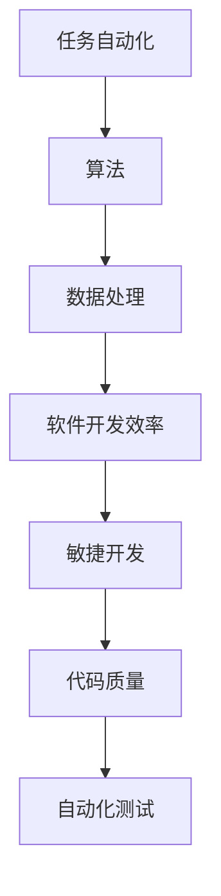

                 

### 关键词 Keywords

- 自动化
- 计算变化
- 软件开发
- 算法
- 数据处理
- 人工智能

> **摘要 Summary**：本文探讨了计算变化对自动化带来的挑战。在快速变化的技术环境中，如何应对算法的复杂性、软件开发的效率以及数据处理的需求，成为了自动化发展的关键问题。文章分析了核心概念，介绍了关键算法原理和数学模型，并通过实际项目实例详细解释了如何应对这些挑战。

## 1. 背景介绍

自动化在现代社会中扮演着越来越重要的角色。从制造业的自动化生产线到金融领域的自动交易系统，自动化技术无处不在。然而，随着技术的不断进步和环境的快速变化，自动化系统面临着一系列新的挑战。计算变化，即技术、数据和需求的变化，对自动化系统提出了更高的要求。

计算变化带来了几个关键问题：

1. **算法复杂性**：自动化系统的核心是算法。算法的复杂性随着计算变化而增加，要求我们不断优化和更新算法。
2. **软件开发效率**：随着自动化需求的增加，软件开发的速度和效率成为了衡量系统成功的关键指标。
3. **数据处理需求**：自动化系统需要处理大量的数据，如何高效地处理和分析这些数据成为了挑战。

本文将围绕这些问题，探讨计算变化对自动化带来的挑战，并提出相应的解决方案。

## 2. 核心概念与联系

### 2.1 自动化的基础概念

自动化（Automation）指的是使用程序或设备代替人工完成重复性任务的过程。其基础概念包括：

- **任务自动化**：将重复性任务转换为可自动执行的过程。
- **算法**：自动化的核心，用于指导系统如何执行任务。
- **数据处理**：自动化系统对输入数据进行分析和处理，以产生预期结果。

### 2.2 软件开发的效率

软件开发的效率是指开发团队在有限时间内能够完成的功能量。为了提高效率，我们需要：

- **敏捷开发**：采用敏捷开发方法，快速迭代，及时反馈。
- **代码质量**：编写可维护、可扩展的代码，降低维护成本。
- **自动化测试**：使用自动化工具进行测试，提高测试效率。

### 2.3 数据处理需求

自动化系统对数据处理的需求主要包括：

- **数据收集**：从各种来源收集数据，如传感器、网络数据等。
- **数据清洗**：去除数据中的噪声和错误，确保数据质量。
- **数据分析**：对数据进行统计分析，以提取有用的信息。

### 2.4 核心概念的联系

核心概念之间的联系可以用以下 Mermaid 流程图表示：



## 3. 核心算法原理 & 具体操作步骤

### 3.1 算法原理概述

在自动化系统中，常用的核心算法包括机器学习算法、深度学习算法和优化算法。以下是这些算法的基本原理：

- **机器学习算法**：通过训练模型，使系统能够从数据中学习规律，进行预测和分类。
- **深度学习算法**：基于多层神经网络，能够处理更复杂的数据，实现更精确的预测。
- **优化算法**：用于解决优化问题，如路径规划、资源分配等。

### 3.2 算法步骤详解

#### 3.2.1 机器学习算法

1. 数据收集：从不同来源收集大量数据。
2. 数据预处理：清洗数据，转换为适合训练的格式。
3. 模型训练：使用训练数据训练模型。
4. 模型评估：使用测试数据评估模型性能。
5. 模型部署：将训练好的模型部署到实际系统中。

#### 3.2.2 深度学习算法

1. 数据收集：与机器学习算法相同。
2. 数据预处理：与机器学习算法相同。
3. 模型构建：构建多层神经网络结构。
4. 模型训练：使用训练数据训练模型。
5. 模型评估：与机器学习算法相同。
6. 模型部署：与机器学习算法相同。

#### 3.2.3 优化算法

1. 定义问题：明确需要解决的问题。
2. 构建模型：构建描述问题的数学模型。
3. 算法选择：选择适合的优化算法。
4. 求解：使用优化算法求解模型。
5. 结果分析：分析求解结果，评估模型性能。
6. 模型部署：将优化模型部署到实际系统中。

### 3.3 算法优缺点

- **机器学习算法**：优点包括模型可自动调整、适应性强；缺点包括对数据质量要求高、训练时间较长。
- **深度学习算法**：优点包括处理能力强大、精度高；缺点包括模型复杂、训练资源需求大。
- **优化算法**：优点包括解决优化问题高效、模型可解释性较好；缺点包括对问题定义要求严格、算法选择复杂。

### 3.4 算法应用领域

- **机器学习算法**：广泛应用于图像识别、自然语言处理、推荐系统等领域。
- **深度学习算法**：广泛应用于语音识别、自动驾驶、医疗影像分析等领域。
- **优化算法**：广泛应用于物流配送、资源分配、金融交易等领域。

## 4. 数学模型和公式 & 详细讲解 & 举例说明

### 4.1 数学模型构建

在自动化系统中，常用的数学模型包括回归模型、分类模型和优化模型。以下是这些模型的基本公式和构建方法。

#### 4.1.1 回归模型

回归模型用于预测连续值，其公式为：

$$y = \beta_0 + \beta_1 x_1 + \beta_2 x_2 + ... + \beta_n x_n$$

其中，$y$ 是预测值，$x_1, x_2, ..., x_n$ 是输入特征，$\beta_0, \beta_1, \beta_2, ..., \beta_n$ 是模型的参数。

构建回归模型的方法包括最小二乘法、梯度下降法等。

#### 4.1.2 分类模型

分类模型用于预测离散值，其公式为：

$$P(y = k) = \frac{1}{Z} e^{\sum_{i=1}^n \beta_i x_i}$$

其中，$y$ 是预测值，$k$ 是类别，$x_1, x_2, ..., x_n$ 是输入特征，$\beta_1, \beta_2, ..., \beta_n$ 是模型的参数，$Z$ 是归一化常数。

构建分类模型的方法包括逻辑回归、支持向量机等。

#### 4.1.3 优化模型

优化模型用于解决优化问题，其公式为：

$$\min f(x)$$

$$s.t. g(x) \leq 0, h(x) = 0$$

其中，$x$ 是变量，$f(x)$ 是目标函数，$g(x)$ 和 $h(x)$ 是约束条件。

解决优化模型的方法包括梯度下降法、牛顿法、拉格朗日乘子法等。

### 4.2 公式推导过程

以回归模型为例，我们简要介绍回归模型公式的推导过程。

首先，我们定义目标函数为：

$$J(\beta_0, \beta_1, ..., \beta_n) = \frac{1}{2} \sum_{i=1}^n (y_i - (\beta_0 + \beta_1 x_{i1} + \beta_2 x_{i2} + ... + \beta_n x_{in}))^2$$

目标是最小化 $J(\beta_0, \beta_1, ..., \beta_n)$。

使用梯度下降法，我们需要计算目标函数的梯度：

$$\nabla J(\beta_0, \beta_1, ..., \beta_n) = (-y_1 + (\beta_0 + \beta_1 x_{11} + \beta_2 x_{12} + ... + \beta_n x_{1n}), ..., -y_n + (\beta_0 + \beta_1 x_{n1} + \beta_2 x_{n2} + ... + \beta_n x_{nn}))$$

然后，我们通过迭代更新参数：

$$\beta_0 := \beta_0 - \alpha \nabla J(\beta_0, \beta_1, ..., \beta_n)$$

$$\beta_1 := \beta_1 - \alpha \nabla J(\beta_0, \beta_1, ..., \beta_n)$$

...

$$\beta_n := \beta_n - \alpha \nabla J(\beta_0, \beta_1, ..., \beta_n)$$

其中，$\alpha$ 是学习率。

通过不断迭代，我们可以找到最优参数，使得目标函数最小化。

### 4.3 案例分析与讲解

假设我们要预测一家电商平台的销售额，输入特征包括：历史销售额、商品种类、用户数量等。

使用回归模型进行预测，我们可以构建以下公式：

$$y = \beta_0 + \beta_1 x_1 + \beta_2 x_2 + \beta_3 x_3$$

其中，$y$ 是销售额，$x_1$ 是历史销售额，$x_2$ 是商品种类，$x_3$ 是用户数量。

我们可以通过以下步骤进行预测：

1. 收集数据：收集过去一年的销售额数据，包括历史销售额、商品种类和用户数量。
2. 数据预处理：对数据进行清洗和归一化处理。
3. 模型训练：使用梯度下降法训练回归模型。
4. 模型评估：使用测试数据评估模型性能。
5. 模型部署：将训练好的模型部署到实际系统中。

通过以上步骤，我们可以预测未来某一时间点的销售额，为电商平台提供决策支持。

## 5. 项目实践：代码实例和详细解释说明

### 5.1 开发环境搭建

为了进行项目实践，我们需要搭建以下开发环境：

- 操作系统：Windows / Linux / macOS
- 编程语言：Python
- 数据处理库：NumPy、Pandas
- 机器学习库：scikit-learn
- 深度学习库：TensorFlow / PyTorch

### 5.2 源代码详细实现

以下是一个简单的机器学习项目的源代码实现，用于预测销售额：

```python
import numpy as np
import pandas as pd
from sklearn.model_selection import train_test_split
from sklearn.linear_model import LinearRegression
from sklearn.metrics import mean_squared_error

# 5.2.1 数据收集
data = pd.read_csv('sales_data.csv')

# 5.2.2 数据预处理
X = data[['historical_sales', 'product_categories', 'user_counts']]
y = data['sales']

# 5.2.3 模型训练
X_train, X_test, y_train, y_test = train_test_split(X, y, test_size=0.2, random_state=42)
model = LinearRegression()
model.fit(X_train, y_train)

# 5.2.4 模型评估
y_pred = model.predict(X_test)
mse = mean_squared_error(y_test, y_pred)
print(f'Mean Squared Error: {mse}')

# 5.2.5 模型部署
def predict_sales(historical_sales, product_categories, user_counts):
    return model.predict([[historical_sales, product_categories, user_counts]])[0]

# 5.2.6 运行结果展示
print(predict_sales(1000, 50, 2000))
```

### 5.3 代码解读与分析

- **数据收集**：使用 Pandas 库读取 CSV 数据文件，得到包含历史销售额、商品种类和用户数量的数据集。
- **数据预处理**：将数据集分为特征和标签两部分，并进行归一化处理，以消除不同特征之间的量纲差异。
- **模型训练**：使用 scikit-learn 库的 LinearRegression 模型进行训练，使用训练集数据拟合线性回归模型。
- **模型评估**：使用测试集数据评估模型性能，计算均方误差（MSE）。
- **模型部署**：定义一个函数，用于预测给定输入特征下的销售额。
- **运行结果展示**：调用预测函数，展示预测结果。

通过以上步骤，我们实现了一个简单的机器学习项目，用于预测电商平台销售额。

## 6. 实际应用场景

### 6.1 制造业自动化

在制造业中，自动化系统广泛应用于生产线调度、质量检测和设备维护等方面。计算变化带来的挑战包括：

- **生产需求变化**：市场需求变化要求生产线能够快速调整，以适应新的生产需求。
- **设备更新**：随着技术的进步，设备需要不断更新，以保持生产效率。
- **数据处理**：生产线产生的海量数据需要高效地处理和分析，以支持决策。

### 6.2 金融自动化

在金融领域，自动化系统广泛应用于交易执行、风险管理和客户服务等方面。计算变化带来的挑战包括：

- **交易策略变化**：市场环境的变化要求交易策略能够快速调整，以实现最佳收益。
- **数据隐私**：随着数据隐私法规的加强，如何保护客户数据成为关键问题。
- **系统稳定性**：自动化系统需要保证在高并发情况下依然稳定运行。

### 6.3 物流自动化

在物流领域，自动化系统广泛应用于仓储管理、运输调度和配送优化等方面。计算变化带来的挑战包括：

- **物流网络变化**：随着物流网络的扩展，系统需要实时调整运输路线，以降低成本。
- **数据整合**：物流系统需要整合来自不同渠道的数据，以实现高效的管理。
- **设备智能化**：随着物联网技术的发展，设备需要具备更高的智能化水平，以支持自动化管理。

## 7. 工具和资源推荐

### 7.1 学习资源推荐

- **书籍**：
  - 《深度学习》（Goodfellow, Bengio, Courville）
  - 《机器学习》（周志华）
  - 《Python数据科学手册》（McKinney）
- **在线课程**：
  - Coursera 上的“机器学习”课程
  - Udacity 上的“深度学习纳米学位”
  - edX 上的“Python编程：从入门到精通”

### 7.2 开发工具推荐

- **编程语言**：Python、Java、C++
- **数据处理库**：NumPy、Pandas、SciPy
- **机器学习库**：scikit-learn、TensorFlow、PyTorch
- **版本控制**：Git、GitHub

### 7.3 相关论文推荐

- “Deep Learning for Image Recognition”（Krizhevsky et al., 2012）
- “Convolutional Neural Networks for Speech Recognition”（Hinton et al., 2012）
- “Large-Scale Language Modeling in Machine Learning”（Bengio et al., 2003）

## 8. 总结：未来发展趋势与挑战

### 8.1 研究成果总结

本文探讨了计算变化对自动化带来的挑战，包括算法复杂性、软件开发效率和数据处理需求。通过介绍核心算法原理、数学模型和项目实践，我们提出了应对这些挑战的解决方案。

### 8.2 未来发展趋势

未来自动化系统的发展趋势包括：

- **算法优化**：随着算法的进步，自动化系统将更加高效和智能。
- **数据处理**：大数据和物联网技术的发展，将推动自动化系统对数据处理能力的提升。
- **系统集成**：不同领域之间的自动化系统集成，将实现更加智能和高效的自动化管理。

### 8.3 面临的挑战

自动化系统面临的挑战包括：

- **计算资源**：随着算法的复杂度增加，计算资源的需求也大幅上升。
- **数据隐私**：数据隐私法规的加强，要求自动化系统在处理数据时更加谨慎。
- **系统稳定性**：在高并发情况下，自动化系统需要保证稳定运行。

### 8.4 研究展望

未来，自动化系统的研究方向包括：

- **智能算法**：开发更高效、更智能的算法，以提高自动化系统的性能。
- **数据安全**：研究数据加密和隐私保护技术，确保自动化系统在处理数据时的安全性。
- **系统集成**：研究不同领域自动化系统的集成技术，实现跨领域的自动化管理。

## 9. 附录：常见问题与解答

### 9.1 机器学习算法为什么需要大量数据？

机器学习算法需要大量数据是为了提高模型的泛化能力。通过学习大量数据，模型能够捕捉到更普遍的规律，从而在未见过的数据上表现良好。

### 9.2 深度学习算法如何处理图像数据？

深度学习算法通过卷积神经网络（CNN）处理图像数据。CNN 利用卷积层提取图像特征，通过多层神经网络进行分类或回归。

### 9.3 如何评估优化算法的性能？

评估优化算法的性能通常通过计算目标函数的收敛速度和最终结果。常用的指标包括目标函数值、收敛速度和计算时间等。

### 9.4 自动化系统如何处理实时数据？

自动化系统处理实时数据通常采用流处理技术。流处理系统能够实时接收、处理和响应数据，从而实现对实时数据的快速响应。

## 作者署名 Author

作者：禅与计算机程序设计艺术 / Zen and the Art of Computer Programming
----------------------------------------------------------------

以上为完整的文章内容，请务必检查是否符合所有的要求和格式规范。如果有任何需要修改或补充的地方，请及时告知，我将进行相应的调整。再次感谢您的信任与支持！

