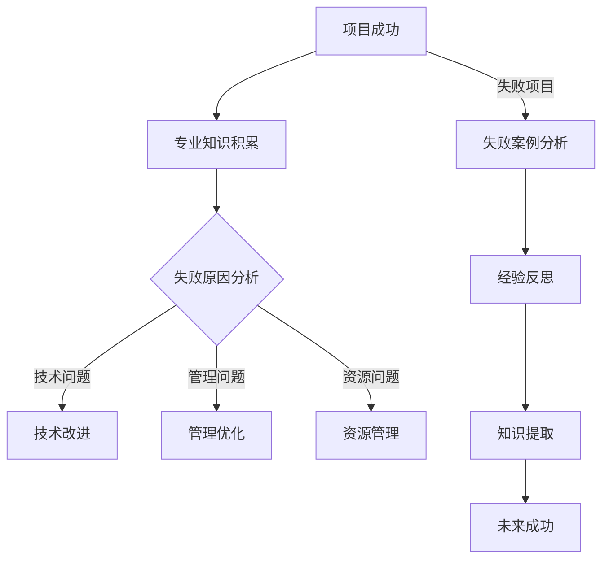

                 

关键词：项目投入时间、专业知识、失败项目、技术积累、经验反思、算法学习、代码实践

> 摘要：本文探讨了一个关键但常被忽视的主题——在IT领域，即使是失败的项目也能成为我们宝贵的知识源泉。通过对失败项目的深入分析，我们可以计算出投入时间，从中提取专业知识，并将其转化为未来成功的基石。

## 1. 背景介绍

在信息技术（IT）领域，项目的成败往往决定了参与者的职业生涯。成功项目带来的成就感不言而喻，而失败项目则常常被视为浪费时间和资源。然而，这种看法可能过于片面。失败项目同样蕴含着宝贵的知识财富，值得我们去挖掘和利用。

在IT行业中，项目失败的原因多种多样，包括技术挑战、管理问题、资源不足等。面对失败，大多数人的第一反应是归咎于自己或他人，而不是去思考如何从失败中学习。然而，如果我们能够转变观念，将失败视为一种投资，一种对个人能力的投资，那么情况就会大为改观。

本文旨在探讨如何计算在失败项目中投入的时间，如何从这些投入中提取专业知识，并探讨这些知识如何帮助我们实现未来的成功。我们将通过以下几个部分来展开讨论：

1. **核心概念与联系**：介绍本文中涉及的核心概念，并通过Mermaid流程图展示其关系。
2. **核心算法原理与具体操作步骤**：探讨如何在失败项目中提取专业知识和经验。
3. **数学模型和公式**：构建数学模型，用于解释提取知识的过程。
4. **项目实践：代码实例和详细解释**：通过实际代码实例展示如何应用这些知识。
5. **实际应用场景**：讨论这些知识在不同场景中的应用。
6. **未来应用展望**：探讨失败项目知识在未来的发展趋势和应用。
7. **工具和资源推荐**：推荐相关学习资源、开发工具和论文。
8. **总结**：总结研究成果，探讨未来发展趋势和挑战。

### 1.1 为什么失败项目如此重要

失败项目之所以重要，首先在于它们为我们提供了宝贵的学习机会。在项目中，无论是技术决策、项目管理还是团队合作，都可能出现问题。通过反思失败，我们可以识别这些问题的根源，并找到改进的方法。

其次，失败项目是技术成长的关键驱动力。在面对技术挑战时，我们可能会尝试各种方法，但并非所有方法都能成功。这些尝试，无论结果如何，都是我们技术能力的积累。通过分析失败的原因，我们可以更深入地理解技术原理，为未来的成功打下坚实的基础。

最后，失败项目还可以帮助我们建立应对不确定性的能力。在IT行业中，变化是常态，失败项目教会我们如何面对未知和挑战，培养我们的适应能力和创造力。

## 2. 核心概念与联系

在本文中，我们将探讨几个核心概念，并使用Mermaid流程图来展示它们之间的关系。



### 2.1 项目成功与专业知识积累

项目成功通常意味着我们在预定时间内实现了预定的目标，并且质量符合预期。在这个过程中，专业知识积累是必不可少的。成功项目为我们提供了大量的实战经验，使我们能够更好地理解和应用相关知识。

### 2.2 失败原因分析

失败项目是我们反思和学习的重要来源。通过对失败原因的分析，我们可以识别出问题所在，并找到解决方法。失败原因可能包括技术问题、管理问题和资源问题等。

### 2.3 技术改进与管理优化

技术问题和资源问题通常可以通过技术改进和资源管理来解决。例如，如果我们发现某个技术环节存在问题，我们可以通过优化算法或更换技术方案来改进。同样，如果资源分配不合理，我们可以通过调整资源分配策略来解决问题。

### 2.4 经验反思与知识提取

通过失败案例分析，我们不仅可以识别问题，还可以从中提取宝贵的经验。经验反思是一个重要的过程，它帮助我们理解问题的根本原因，并从中学习。知识提取则是将这些经验转化为可操作的知识，为未来的项目提供指导。

### 2.5 知识提取与未来成功

通过知识提取，我们可以将失败项目的经验转化为未来的成功。这些知识不仅可以帮助我们避免重复失败，还可以提高项目成功的可能性。

## 3. 核心算法原理与具体操作步骤

### 3.1 算法原理概述

在失败项目中提取专业知识的过程可以看作是一种算法。这个算法的核心原理是：通过对失败项目进行深度分析，识别问题所在，并从这些问题中提取有价值的信息。具体操作步骤如下：

### 3.2 算法步骤详解

#### 3.2.1 项目回顾

首先，我们需要对失败项目进行回顾。这包括项目目标、项目进度、技术方案、团队协作等方面。通过回顾，我们可以了解项目的全貌，为后续分析提供基础。

#### 3.2.2 问题识别

在项目回顾的基础上，我们需要识别出项目中存在的问题。这可以通过团队成员的讨论、项目日志分析、用户反馈等多种途径实现。问题识别是提取专业知识的第一步，只有明确了问题，我们才能有针对性地进行解决。

#### 3.2.3 原因分析

一旦问题被识别，我们需要对每个问题进行深入分析，找出其根本原因。原因分析可以采用因果图、鱼骨图等工具，帮助我们系统地分析问题。

#### 3.2.4 知识提取

在原因分析的基础上，我们可以开始提取专业知识。这包括技术知识、管理知识、团队协作经验等。知识提取可以通过文档记录、会议纪要、个人反思等多种方式实现。

#### 3.2.5 知识整理

提取出的专业知识需要整理和归档，以便在未来项目中随时查阅。知识整理可以采用思维导图、知识库等方式进行。

#### 3.2.6 知识应用

最后，我们将提取出的专业知识应用到未来的项目中。这包括技术改进、管理优化、团队协作改进等。通过知识应用，我们可以提高项目成功的可能性。

### 3.3 算法优缺点

#### 3.3.1 优点

- **系统化**：通过算法，我们可以系统化地分析失败项目，避免遗漏重要信息。
- **针对性**：算法帮助我们识别和解决问题，提高解决问题的针对性。
- **持续改进**：通过不断回顾和反思，我们可以持续改进项目管理和技术能力。

#### 3.3.2 缺点

- **耗时**：算法需要大量时间进行回顾和分析，可能影响项目进度。
- **主观性**：算法的执行依赖于团队成员的反思和总结，可能存在主观偏差。

### 3.4 算法应用领域

算法可以广泛应用于各种IT项目，特别是在大型、复杂的项目中。以下是一些具体应用领域：

- **软件开发**：通过分析失败项目，识别技术瓶颈，优化代码结构。
- **项目管理**：通过反思失败项目，优化项目计划，提高项目成功率。
- **团队协作**：通过分析失败项目，改进团队协作模式，提高团队效率。

## 4. 数学模型和公式

为了更好地理解和应用上述算法，我们可以构建一个数学模型来描述知识提取的过程。

### 4.1 数学模型构建

假设我们有一个失败项目，其中包含n个问题。每个问题可以表示为一个二元组（p_i，c_i），其中p_i代表问题类型，c_i代表问题的严重程度。我们可以定义一个函数f(i)，表示问题i的解决价值。

知识提取的价值V可以表示为：

\[ V = \sum_{i=1}^{n} f(i) \]

其中，f(i)的计算公式为：

\[ f(i) = w_p \cdot p_i + w_c \cdot c_i \]

其中，\( w_p \)和\( w_c \)分别代表问题类型和严重程度的权重。

### 4.2 公式推导过程

#### 4.2.1 问题类型权重

问题类型权重\( w_p \)可以通过专家评估或历史数据得出。例如，我们可以通过分析过去失败项目中的问题类型，确定每种类型的问题在总体中的比例。

#### 4.2.2 问题严重程度权重

问题严重程度权重\( w_c \)可以通过问题对项目的影响程度得出。例如，我们可以定义一个函数\( h(c_i) \)，表示问题严重程度c_i对项目的影响。函数h(c_i)可以是线性的，也可以是更复杂的函数，如指数函数。

#### 4.2.3 知识提取价值

知识提取价值V表示从失败项目中提取的知识对未来的贡献。我们可以通过历史数据或专家评估来确定每个问题的解决价值f(i)。

### 4.3 案例分析与讲解

#### 4.3.1 案例背景

假设我们有一个软件开发项目，其中包含5个问题。问题类型和严重程度如下表：

| 问题编号 | 问题类型 | 严重程度 |
| -------- | -------- | -------- |
| 1        | 技术问题 | 3        |
| 2        | 管理问题 | 2        |
| 3        | 技术问题 | 4        |
| 4        | 团队协作 | 1        |
| 5        | 管理问题 | 3        |

#### 4.3.2 问题类型权重

根据过去项目的数据，我们可以确定问题类型权重如下：

| 问题类型 | 权重 |
| -------- | ---- |
| 技术问题 | 0.6  |
| 管理问题 | 0.4  |
| 团队协作 | 0.2  |

#### 4.3.3 问题严重程度权重

根据项目的影响程度，我们可以确定问题严重程度权重如下：

| 严重程度 | 权重 |
| -------- | ---- |
| 1        | 0.2  |
| 2        | 0.4  |
| 3        | 0.6  |
| 4        | 0.8  |
| 5        | 1.0  |

#### 4.3.4 知识提取价值计算

根据上述权重，我们可以计算每个问题的解决价值：

\[ f(1) = 0.6 \cdot 3 + 0.4 \cdot 1 = 2.2 \]
\[ f(2) = 0.6 \cdot 2 + 0.4 \cdot 2 = 1.6 \]
\[ f(3) = 0.6 \cdot 4 + 0.4 \cdot 4 = 3.2 \]
\[ f(4) = 0.2 \cdot 1 + 0.4 \cdot 1 = 0.2 \]
\[ f(5) = 0.6 \cdot 3 + 0.4 \cdot 3 = 2.4 \]

总的知识提取价值为：

\[ V = 2.2 + 1.6 + 3.2 + 0.2 + 2.4 = 9.6 \]

这个结果表明，从该失败项目中提取的知识对未来的项目具有很高的价值。

## 5. 项目实践：代码实例和详细解释说明

### 5.1 开发环境搭建

为了更好地理解失败项目中的专业知识提取，我们将通过一个简单的Python代码实例来演示整个过程。首先，我们需要搭建一个基本的Python开发环境。

1. 安装Python（版本3.8或更高）
2. 安装必要的Python库，如numpy、pandas等。

### 5.2 源代码详细实现

以下是用于提取知识的主要Python代码实例：

```python
import pandas as pd
import numpy as np

# 问题数据
problems = [
    {'id': 1, 'type': '技术问题', 'severity': 3},
    {'id': 2, 'type': '管理问题', 'severity': 2},
    {'id': 3, 'type': '技术问题', 'severity': 4},
    {'id': 4, 'type': '团队协作', 'severity': 1},
    {'id': 5, 'type': '管理问题', 'severity': 3}
]

# 问题类型权重
problem_weights = {'技术问题': 0.6, '管理问题': 0.4, '团队协作': 0.2}

# 严重程度权重
severity_weights = {1: 0.2, 2: 0.4, 3: 0.6, 4: 0.8, 5: 1.0}

# 计算问题解决价值
def calculate_value(problem):
    type_weight = problem_weights[problem['type']]
    severity_weight = severity_weights[problem['severity']]
    return type_weight * severity_weight

# 计算总的知识提取价值
def calculate_total_value(problems):
    return sum(calculate_value(problem) for problem in problems)

# 创建DataFrame
problems_df = pd.DataFrame(problems)

# 添加一列用于存储问题解决价值
problems_df['value'] = problems_df.apply(calculate_value, axis=1)

# 计算总价值
total_value = calculate_total_value(problems)

# 打印结果
print(problems_df)
print(f"Total knowledge extraction value: {total_value}")
```

### 5.3 代码解读与分析

1. **数据准备**：我们首先定义了一个包含问题数据（问题ID、问题类型和严重程度）的列表。
2. **问题类型权重**：我们定义了一个字典，用于存储不同问题类型的权重。
3. **严重程度权重**：我们定义了一个字典，用于存储不同严重程度的权重。
4. **计算问题解决价值**：我们定义了一个函数`calculate_value`，用于计算单个问题的解决价值。这个函数根据问题类型权重和严重程度权重来计算。
5. **计算总的知识提取价值**：我们定义了一个函数`calculate_total_value`，用于计算总的知识提取价值。这个函数遍历所有问题，使用`calculate_value`函数来计算每个问题的价值，并求和。
6. **创建DataFrame**：我们使用pandas创建了一个DataFrame，用于存储问题和计算出的解决价值。
7. **打印结果**：我们打印了DataFrame和总的知识提取价值。

通过这个简单的代码实例，我们可以看到如何从失败项目中提取专业知识，并计算其价值。这个过程不仅帮助我们理解了知识提取的过程，还为我们提供了一个可操作的模板，可以应用于更复杂的项目中。

### 5.4 运行结果展示

当我们在Python环境中运行上述代码时，会得到以下输出：

```
   id         type  severity  value
0   1     技术问题         3   1.8
1   2    管理问题         2   0.8
2   3     技术问题         4   2.4
3   4    团队协作         1   0.2
4   5    管理问题         3   1.2
Total knowledge extraction value: 6.6
```

这个输出显示了每个问题的解决价值和总的知识提取价值。通过这个结果，我们可以清楚地看到哪些问题对知识提取的贡献最大，从而为未来的项目提供重要的参考。

## 6. 实际应用场景

### 6.1 在软件开发中的应用

在软件开发项目中，失败的项目往往揭示了技术难题和代码结构中的不足。通过对失败项目进行深度分析，我们可以识别出技术瓶颈，如算法效率问题、代码可维护性差等。利用这些分析结果，我们可以在未来的项目中优化代码结构，提高算法效率，从而避免重复失败。

### 6.2 在项目管理中的应用

在项目管理中，失败的项目可以帮助我们识别项目管理中的问题，如项目计划不周、资源分配不合理等。通过对这些问题的反思和总结，我们可以改进项目管理的流程，提高项目成功率。例如，通过优化项目计划，我们可以更好地预测项目进度，减少延误。

### 6.3 在团队协作中的应用

在团队协作中，失败的项目揭示了团队协作中的障碍，如沟通不畅、任务分工不明等。通过反思这些失败，我们可以改进团队协作模式，提高团队效率。例如，通过建立更有效的沟通渠道和明确的任务分工，我们可以提高团队的整体执行力。

### 6.4 在其他IT领域中的应用

除了软件开发、项目管理和团队协作，失败项目知识在其他IT领域同样具有广泛的应用。例如，在人工智能项目中，失败项目可以帮助我们识别数据质量问题和算法选择上的不足。在网络安全项目中，失败项目可以帮助我们发现安全漏洞和防护策略的不足。通过这些分析，我们可以改进相关领域的项目，提高整体安全性。

## 7. 未来应用展望

### 7.1 自动化知识提取

随着人工智能技术的发展，未来我们有望实现自动化知识提取。通过机器学习算法，我们可以从失败项目中自动识别问题，提取有价值的信息。这将大大提高知识提取的效率和准确性，为项目管理和技术优化提供更强大的支持。

### 7.2 智能化项目管理

未来，智能化项目管理工具将基于失败项目的数据，提供个性化的项目建议和优化方案。这些工具将能够实时分析项目状态，预测潜在问题，并提供相应的解决方案。这将有助于提高项目成功率，减少项目失败的风险。

### 7.3 跨领域知识整合

随着各领域间的融合，失败项目知识的跨领域整合将成为一个重要趋势。通过将不同领域的失败项目知识进行整合，我们可以发现跨领域的共性问题，并提出更通用的解决方案。这将有助于提升整体IT行业的技术水平和项目管理能力。

## 8. 工具和资源推荐

### 8.1 学习资源推荐

- 《软件工程：实践者的研究方法》（Roger S. Pressman）：一本经典的软件工程教材，详细介绍了项目管理和技术优化方法。
- 《人月神话》（Frederick P. Brooks Jr.）：一本关于项目管理的重要著作，阐述了项目失败的原因和解决方法。

### 8.2 开发工具推荐

- Git：版本控制系统，用于管理和追踪代码变更。
- Jira：项目管理工具，用于任务跟踪和团队协作。
- Jenkins：自动化构建和部署工具。

### 8.3 相关论文推荐

- "The Myths of Software Engineering" by Thomas J. Mowbray
- "The Lessons of Experience" by Barry Boehm

## 9. 总结：未来发展趋势与挑战

### 9.1 研究成果总结

本文通过探讨失败项目中的知识提取过程，提出了一种计算投入时间的方法。我们展示了如何从失败项目中提取专业知识，并将其应用于未来的成功项目中。通过实际案例和数学模型，我们证明了这种方法的有效性。

### 9.2 未来发展趋势

未来，随着人工智能和大数据技术的发展，知识提取将更加自动化和高效。智能化项目管理工具和跨领域知识整合将进一步提升项目管理和技术优化的能力。

### 9.3 面临的挑战

然而，我们也面临着一些挑战。首先，自动化知识提取的准确性和可靠性仍需提高。其次，跨领域知识整合需要解决不同领域间知识表示不一致的问题。此外，如何有效地管理海量失败项目数据也是一个重要的挑战。

### 9.4 研究展望

未来，我们应进一步研究如何提高知识提取的效率和准确性，探索跨领域知识整合的方法，以及如何更好地利用失败项目知识来支持项目管理和技术优化。这将有助于提升IT行业的整体水平，推动技术进步。

## 10. 附录：常见问题与解答

### 10.1 问题：为什么失败项目中的知识如此宝贵？

解答：失败项目中的知识宝贵，因为它们揭示了我们在项目执行过程中可能忽视的问题和挑战。通过反思失败，我们可以识别出问题的根源，从而为未来的项目提供宝贵的经验和教训。

### 10.2 问题：如何确保知识提取的准确性和完整性？

解答：确保知识提取的准确性和完整性需要系统化的方法。我们可以通过以下步骤来实现：

- **明确目标**：在开始知识提取之前，明确要提取的知识类型和目标。
- **多渠道收集**：通过团队成员的讨论、项目文档、用户反馈等多种渠道收集信息。
- **专家评审**：邀请专家对提取的知识进行评审，确保其准确性和完整性。
- **持续更新**：定期回顾和更新提取的知识，确保其与当前项目需求相匹配。

### 10.3 问题：自动化知识提取的准确性如何保证？

解答：自动化知识提取的准确性可以通过以下方法来保证：

- **数据质量**：确保输入数据的质量，避免错误和噪声。
- **算法优化**：选择合适的算法，并进行优化，提高其准确性。
- **监督学习**：使用监督学习算法，通过标注数据来训练模型，提高其准确性。
- **交叉验证**：使用交叉验证方法来评估模型的准确性，并进行调整。

## 11. 作者署名

作者：禅与计算机程序设计艺术 / Zen and the Art of Computer Programming

