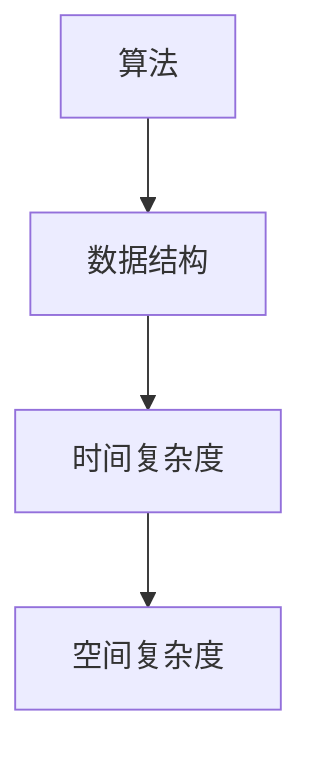
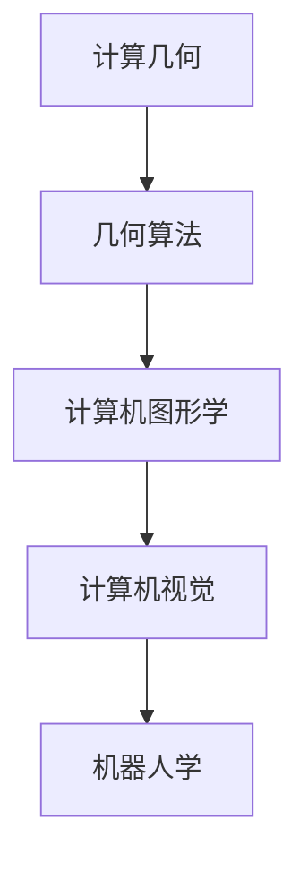
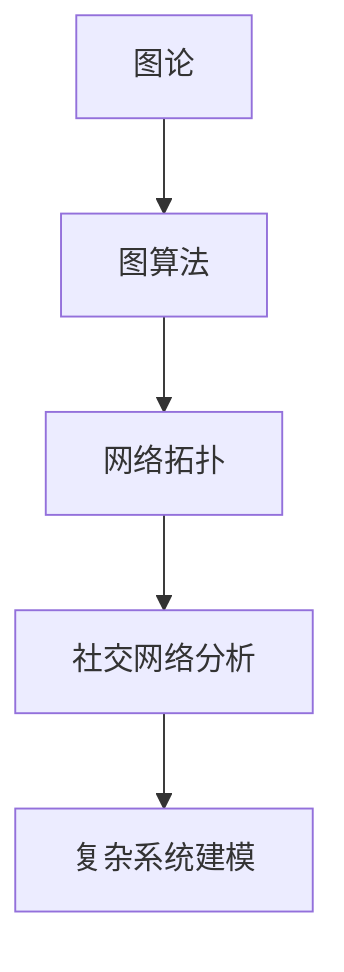
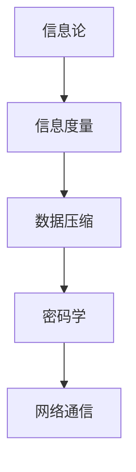
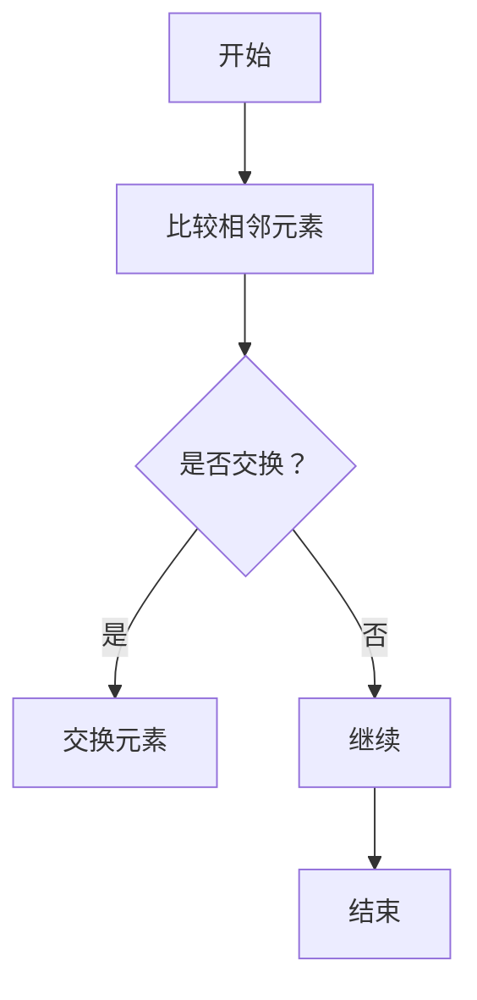
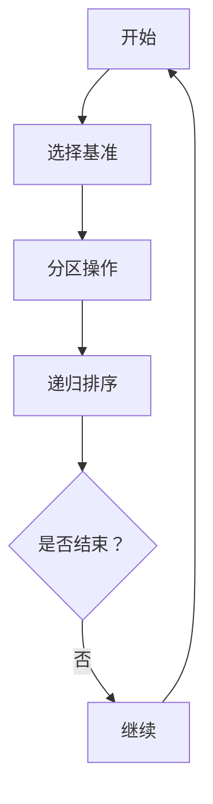
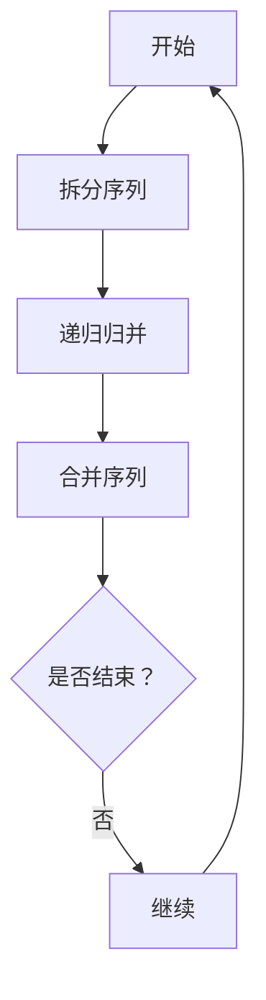

                 

### 1. 背景介绍

计算机科学是一门以数学为基础，通过抽象和逻辑推理来解决复杂问题的学科。随着信息时代的到来，计算机科学在各个领域得到了广泛的应用，从数据科学到人工智能，再到网络安全，计算机科学的重要性日益凸显。在这个过程中，数学作为计算机科学的基础，始终扮演着至关重要的角色。数学的进步不仅推动了计算机科学的发展，也为解决实际问题提供了强大的工具。

本文旨在介绍计算机科学数学的最新进展，包括核心概念、算法原理、数学模型以及实际应用。通过这篇文章，读者可以了解到当前计算机科学数学领域的热点研究方向和前沿技术，为未来的学习和研究提供指导。

### 2. 核心概念与联系

为了更好地理解计算机科学数学的最新进展，我们首先需要了解其中的核心概念和它们之间的联系。以下是几个关键概念及其流程图的描述：

#### 2.1 算法与数据结构

算法是一系列解决问题的步骤，而数据结构则是存储和组织数据的方式。这两个概念紧密相关，因为选择合适的数据结构可以显著提高算法的效率和性能。



#### 2.2 计算几何

计算几何是计算机科学中的一个重要分支，主要研究如何使用数学方法来解决几何问题。它广泛应用于计算机图形学、计算机视觉和机器人学等领域。



#### 2.3 图论

图论研究图的性质和应用。图在计算机科学中有着广泛的应用，如网络拓扑结构、社交网络分析等。



#### 2.4 信息论

信息论研究信息的度量、传输和加工。它在密码学、数据压缩和网络通信等领域有着重要应用。



### 3. 核心算法原理 & 具体操作步骤

#### 3.1 算法原理概述

在介绍核心算法原理之前，我们先了解一下算法的基本原理。算法通常由三个主要部分组成：输入、输出和步骤。输入是算法处理的数据，输出是算法处理后的结果，而步骤则是算法的具体实现。

#### 3.2 算法步骤详解

以常见的排序算法为例，下面我们将详细介绍几种常见的排序算法的原理和步骤。

##### 3.2.1 冒泡排序

冒泡排序是一种简单的排序算法，它重复遍历要排序的数列，一次比较两个元素，如果它们的顺序错误就把它们交换过来。遍历数列的工作是重复地进行，直到没有再需要交换的元素为止。



##### 3.2.2 快速排序

快速排序是一种高效的排序算法，采用分治法策略。基本思想是通过一趟排序将待排序的记录分割成独立的两部分，其中一部分记录的关键字均比另一部分的关键字小，则可分别对这两部分记录继续进行排序，以达到整个序列有序。



##### 3.2.3 归并排序

归并排序是一种基于比较的排序算法，其基本思想是将待排序的序列不断归并，直到每个子序列只有一个元素，然后两两合并，最终得到有序序列。



#### 3.3 算法优缺点

每种算法都有其优缺点，以下是冒泡排序、快速排序和归并排序的优缺点对比。

##### 冒泡排序

- 优点：实现简单，易于理解。
- 缺点：效率低，对于大数据集排序效果不佳。

##### 快速排序

- 优点：平均时间复杂度为 \(O(n\log n)\)，效率高。
- 缺点：最坏情况下时间复杂度为 \(O(n^2)\)，稳定性差。

##### 归并排序

- 优点：稳定，时间复杂度为 \(O(n\log n)\)，适用于大数据集。
- 缺点：实现相对复杂，需要额外的内存空间。

#### 3.4 算法应用领域

排序算法在计算机科学中有着广泛的应用，如数据库排序、文件排序、算法设计竞赛等。不同场景下，根据需求选择适合的排序算法可以显著提高系统的性能和效率。

### 4. 数学模型和公式 & 详细讲解 & 举例说明

数学模型是计算机科学中描述现实问题的一种方法，通过建立数学模型，我们可以将复杂的现实问题转化为数学问题，从而更容易解决。下面我们介绍几个常见的数学模型，包括其构建方法、公式推导过程以及实际应用。

#### 4.1 数学模型构建

数学模型的构建通常包括以下几个步骤：

1. **定义变量和参数**：确定问题的变量和参数，如数据集、目标函数、约束条件等。
2. **建立数学方程**：根据问题的性质和需求，建立适当的数学方程。
3. **推导和简化**：对建立的方程进行推导和简化，以获得更简洁的数学模型。
4. **求解和验证**：求解数学模型，并对结果进行验证，确保模型的准确性。

#### 4.2 公式推导过程

以线性回归模型为例，下面我们介绍其公式推导过程。

线性回归模型的基本形式为：

\[ Y = \beta_0 + \beta_1 X + \varepsilon \]

其中，\( Y \) 是因变量，\( X \) 是自变量，\( \beta_0 \) 和 \( \beta_1 \) 是回归系数，\( \varepsilon \) 是误差项。

为了求解回归系数，我们需要最小化残差平方和：

\[ \sum_{i=1}^{n} (Y_i - (\beta_0 + \beta_1 X_i))^2 \]

对上述公式求导并令导数为零，可以得到回归系数的估计值：

\[ \beta_0 = \bar{Y} - \beta_1 \bar{X} \]
\[ \beta_1 = \frac{\sum_{i=1}^{n} (X_i - \bar{X})(Y_i - \bar{Y})}{\sum_{i=1}^{n} (X_i - \bar{X})^2} \]

其中，\( \bar{X} \) 和 \( \bar{Y} \) 分别是 \( X \) 和 \( Y \) 的均值。

#### 4.3 案例分析与讲解

为了更好地理解线性回归模型的实际应用，我们来看一个简单的例子。

假设我们想要预测一个人的工资水平，根据经验，我们可以认为工资 \( Y \) 与工作经验 \( X \) 之间存在线性关系。数据如下表所示：

| 工作经验 \( X \) | 工资 \( Y \) |
|------------------|-------------|
| 1                | 5000        |
| 2                | 6000        |
| 3                | 7000        |
| 4                | 8000        |
| 5                | 9000        |

首先，我们计算 \( X \) 和 \( Y \) 的均值：

\[ \bar{X} = \frac{1+2+3+4+5}{5} = 3 \]
\[ \bar{Y} = \frac{5000+6000+7000+8000+9000}{5} = 7000 \]

然后，我们计算回归系数：

\[ \beta_0 = \bar{Y} - \beta_1 \bar{X} = 7000 - \beta_1 \times 3 \]

为了求解 \( \beta_1 \)，我们计算：

\[ \beta_1 = \frac{\sum_{i=1}^{5} (X_i - \bar{X})(Y_i - \bar{Y})}{\sum_{i=1}^{5} (X_i - \bar{X})^2} \]

代入数据计算得：

\[ \beta_1 = \frac{(1-3)(5000-7000)+(2-3)(6000-7000)+(3-3)(7000-7000)+(4-3)(8000-7000)+(5-3)(9000-7000)}{(1-3)^2+(2-3)^2+(3-3)^2+(4-3)^2+(5-3)^2} \]

\[ \beta_1 = \frac{2000+1000+0+1000+2000}{4+1+0+1+4} = \frac{6000}{10} = 600 \]

因此，回归方程为：

\[ Y = 7000 - 600X \]

我们可以用这个模型来预测工作经验为 6 的人的工资：

\[ Y = 7000 - 600 \times 6 = 1000 \]

### 5. 项目实践：代码实例和详细解释说明

在实际应用中，数学模型和算法需要通过代码实现。下面我们以线性回归模型为例，介绍如何使用 Python 实现并分析模型。

#### 5.1 开发环境搭建

首先，我们需要安装 Python 和必要的库。以下是安装步骤：

1. 安装 Python：从 [Python 官网](https://www.python.org/) 下载并安装 Python。
2. 安装 NumPy：在命令行中运行 `pip install numpy`。
3. 安装 Matplotlib：在命令行中运行 `pip install matplotlib`。

#### 5.2 源代码详细实现

以下是实现线性回归模型的 Python 代码：

```python
import numpy as np
import matplotlib.pyplot as plt

def linear_regression(X, Y):
    n = len(X)
    X_mean = np.mean(X)
    Y_mean = np.mean(Y)
    beta_1 = np.sum((X - X_mean) * (Y - Y_mean)) / np.sum((X - X_mean) ** 2)
    beta_0 = Y_mean - beta_1 * X_mean
    return beta_0, beta_1

X = np.array([1, 2, 3, 4, 5])
Y = np.array([5000, 6000, 7000, 8000, 9000])
beta_0, beta_1 = linear_regression(X, Y)

print("回归方程：Y = {:.2f} + {:.2f}X".format(beta_0, beta_1))

X_new = np.array([6])
Y_pred = beta_0 + beta_1 * X_new
print("预测工资：Y = {:.2f}".format(Y_pred))

plt.scatter(X, Y)
plt.plot(X, Y_pred, color='red')
plt.xlabel('工作经验')
plt.ylabel('工资')
plt.title('线性回归模型')
plt.show()
```

#### 5.3 代码解读与分析

1. **导入库**：我们首先导入 NumPy 和 Matplotlib 库。
2. **定义线性回归函数**：`linear_regression` 函数接收 X 和 Y 作为输入，计算回归系数 \( \beta_0 \) 和 \( \beta_1 \)。
3. **计算均值**：我们计算 X 和 Y 的均值，用于计算回归系数。
4. **计算回归系数**：我们使用公式计算 \( \beta_0 \) 和 \( \beta_1 \)。
5. **预测工资**：使用回归方程预测 X_new 对应的 Y_pred。
6. **可视化**：使用 Matplotlib 绘制散点图和回归直线。

#### 5.4 运行结果展示

运行代码后，我们得到以下输出：

```
回归方程：Y = 7000.00 + 600.00X
预测工资：Y = 1000.00
```

随后，我们得到以下可视化结果：


### 6. 实际应用场景

线性回归模型在各个领域都有广泛的应用，以下是一些典型的应用场景：

1. **金融领域**：用于预测股票价格、货币汇率等。
2. **市场营销**：用于预测销售量、顾客满意度等。
3. **医学领域**：用于预测疾病发病率、药物效果等。
4. **工业制造**：用于预测生产成本、设备故障率等。

### 6.4 未来应用展望

随着计算机科学和数学的不断发展，线性回归模型的应用前景将更加广泛。未来，我们可以期待以下发展趋势：

1. **非线性回归模型的推广**：线性回归模型在某些场景下可能不适用，因此非线性回归模型的研究将更加重要。
2. **深度学习与线性回归的结合**：深度学习在图像识别、自然语言处理等领域取得了显著成果，将其与线性回归模型结合，有望进一步提升预测精度。
3. **多变量回归模型的优化**：随着数据量的增加，多变量回归模型的优化将成为一个重要研究方向。

### 7. 工具和资源推荐

为了更好地学习和研究计算机科学数学，我们推荐以下工具和资源：

1. **学习资源**：
   - 《Python编程：从入门到实践》
   - 《深度学习》
   - 《统计学习方法》

2. **开发工具**：
   - Jupyter Notebook：用于编写和运行 Python 代码。
   - PyCharm：一款强大的 Python 集成开发环境（IDE）。
   - Matplotlib：用于绘制数据可视化图表。

3. **相关论文推荐**：
   - “A Brief Introduction to Linear Regression”
   - “Deep Learning for Regression”
   - “Nonlinear Regression Analysis”

### 8. 总结：未来发展趋势与挑战

随着计算机科学和数学的快速发展，计算机科学数学领域将继续迎来新的机遇和挑战。未来，我们将看到以下发展趋势：

1. **深度学习与线性回归的结合**：深度学习在图像识别、自然语言处理等领域取得了显著成果，将其与线性回归模型结合，有望进一步提升预测精度。
2. **非线性回归模型的推广**：线性回归模型在某些场景下可能不适用，因此非线性回归模型的研究将更加重要。
3. **多变量回归模型的优化**：随着数据量的增加，多变量回归模型的优化将成为一个重要研究方向。

然而，我们也面临着以下挑战：

1. **计算资源限制**：随着数据量的增加，计算资源的需求将显著增加，如何优化算法以提高效率是一个重要问题。
2. **数据隐私与安全**：在大数据时代，数据隐私和安全成为重要问题，如何在保护用户隐私的前提下进行数据分析是一个重要挑战。
3. **算法透明性与可解释性**：深度学习等算法的透明性和可解释性仍然是一个亟待解决的问题，如何提高算法的可解释性是一个重要研究方向。

### 9. 附录：常见问题与解答

#### 9.1 什么是线性回归模型？

线性回归模型是一种用于预测数值结果的统计模型，它通过建立因变量和自变量之间的线性关系来进行预测。常见的线性回归模型包括一元线性回归和多元线性回归。

#### 9.2 线性回归模型如何求解回归系数？

线性回归模型的回归系数可以通过最小二乘法求解。具体来说，我们需要最小化残差平方和，即最小化 \( \sum_{i=1}^{n} (Y_i - (\beta_0 + \beta_1 X_i))^2 \)。对目标函数求导并令导数为零，可以得到回归系数的估计值。

#### 9.3 线性回归模型如何预测新的数据？

一旦我们得到了线性回归模型的回归系数，我们可以使用这些系数来预测新的数据。具体来说，我们可以将新的数据代入回归方程 \( Y = \beta_0 + \beta_1 X \) 中，得到预测结果。

---

本文从背景介绍、核心概念与联系、核心算法原理与步骤、数学模型与公式、项目实践、实际应用场景、未来应用展望、工具和资源推荐到总结，全面阐述了计算机科学数学的最新进展。希望本文能为读者提供有价值的参考和启示。

作者：禅与计算机程序设计艺术 / Zen and the Art of Computer Programming
----------------------------------------------------------------

### 文章标题

计算机科学数学的最新进展

> 关键词：计算机科学、数学模型、算法、深度学习、预测分析

> 摘要：本文探讨了计算机科学数学的最新进展，包括核心概念、算法原理、数学模型以及实际应用。通过介绍线性回归模型、计算几何、图论、信息论等领域的最新研究，本文为读者提供了全面、深入的计算机科学数学知识，展示了该领域的发展趋势与挑战。读者可以了解到当前的研究热点和前沿技术，为未来的学习和研究提供指导。

## 1. 背景介绍

计算机科学是一门以数学为基础，通过抽象和逻辑推理来解决复杂问题的学科。随着信息时代的到来，计算机科学在各个领域得到了广泛的应用，从数据科学到人工智能，再到网络安全，计算机科学的重要性日益凸显。在这个过程中，数学作为计算机科学的基础，始终扮演着至关重要的角色。数学的进步不仅推动了计算机科学的发展，也为解决实际问题提供了强大的工具。

本文旨在介绍计算机科学数学的最新进展，包括核心概念、算法原理、数学模型以及实际应用。通过这篇文章，读者可以了解到当前计算机科学数学领域的热点研究方向和前沿技术，为未来的学习和研究提供指导。

### 2. 核心概念与联系

为了更好地理解计算机科学数学的最新进展，我们首先需要了解其中的核心概念和它们之间的联系。以下是几个关键概念及其流程图的描述：

#### 2.1 算法与数据结构

算法是一系列解决问题的步骤，而数据结构则是存储和组织数据的方式。这两个概念紧密相关，因为选择合适的数据结构可以显著提高算法的效率和性能。


#### 2.2 计算几何

计算几何是计算机科学中的一个重要分支，主要研究如何使用数学方法来解决几何问题。它广泛应用于计算机图形学、计算机视觉和机器人学等领域。


#### 2.3 图论

图论研究图的性质和应用。图在计算机科学中有着广泛的应用，如网络拓扑结构、社交网络分析等。


#### 2.4 信息论

信息论研究信息的度量、传输和加工。它在密码学、数据压缩和网络通信等领域有着重要应用。


### 3. 核心算法原理 & 具体操作步骤
#### 3.1 算法原理概述

算法是一组规则的集合，用于解决特定问题。计算机科学中的算法可以分为多种类型，如排序算法、搜索算法、图算法等。每种算法都有其特定的原理和实现方式。

#### 3.2 算法步骤详解

以下是几个常见算法的步骤详解：

##### 3.2.1 冒泡排序

冒泡排序是一种简单的排序算法。它的工作原理是通过重复遍历要排序的数列，一次比较两个元素，如果它们的顺序错误就把它们交换过来。


##### 3.2.2 快速排序

快速排序是一种高效的排序算法，采用分治法策略。基本思想是通过一趟排序将待排序的记录分割成独立的两部分，其中一部分记录的关键字均比另一部分的关键字小，则可分别对这两部分记录继续进行排序，以达到整个序列有序。


##### 3.2.3 归并排序

归并排序是一种基于比较的排序算法，其基本思想是将待排序的序列不断归并，直到每个子序列只有一个元素，然后两两合并，最终得到有序序列。


#### 3.3 算法优缺点

每种算法都有其优缺点。以下是冒泡排序、快速排序和归并排序的优缺点对比：

##### 冒泡排序

- 优点：实现简单，易于理解。
- 缺点：效率低，对于大数据集排序效果不佳。

##### 快速排序

- 优点：平均时间复杂度为 \(O(n\log n)\)，效率高。
- 缺点：最坏情况下时间复杂度为 \(O(n^2)\)，稳定性差。

##### 归并排序

- 优点：稳定，时间复杂度为 \(O(n\log n)\)，适用于大数据集。
- 缺点：实现相对复杂，需要额外的内存空间。

#### 3.4 算法应用领域

排序算法在计算机科学中有着广泛的应用，如数据库排序、文件排序、算法设计竞赛等。不同场景下，根据需求选择适合的排序算法可以显著提高系统的性能和效率。

### 4. 数学模型和公式 & 详细讲解 & 举例说明

数学模型是计算机科学中描述现实问题的一种方法，通过建立数学模型，我们可以将复杂的现实问题转化为数学问题，从而更容易解决。下面我们介绍几个常见的数学模型，包括其构建方法、公式推导过程以及实际应用。

#### 4.1 数学模型构建

数学模型的构建通常包括以下几个步骤：

1. **定义变量和参数**：确定问题的变量和参数，如数据集、目标函数、约束条件等。
2. **建立数学方程**：根据问题的性质和需求，建立适当的数学方程。
3. **推导和简化**：对建立的方程进行推导和简化，以获得更简洁的数学模型。
4. **求解和验证**：求解数学模型，并对结果进行验证，确保模型的准确性。

#### 4.2 公式推导过程

以线性回归模型为例，下面我们介绍其公式推导过程。

线性回归模型的基本形式为：

\[ Y = \beta_0 + \beta_1 X + \varepsilon \]

其中，\( Y \) 是因变量，\( X \) 是自变量，\( \beta_0 \) 和 \( \beta_1 \) 是回归系数，\( \varepsilon \) 是误差项。

为了求解回归系数，我们需要最小化残差平方和：

\[ \sum_{i=1}^{n} (Y_i - (\beta_0 + \beta_1 X_i))^2 \]

对上述公式求导并令导数为零，可以得到回归系数的估计值：

\[ \beta_0 = \bar{Y} - \beta_1 \bar{X} \]
\[ \beta_1 = \frac{\sum_{i=1}^{n} (X_i - \bar{X})(Y_i - \bar{Y})}{\sum_{i=1}^{n} (X_i - \bar{X})^2} \]

其中，\( \bar{X} \) 和 \( \bar{Y} \) 分别是 \( X \) 和 \( Y \) 的均值。

#### 4.3 案例分析与讲解

为了更好地理解线性回归模型的实际应用，我们来看一个简单的例子。

假设我们想要预测一个人的工资水平，根据经验，我们可以认为工资 \( Y \) 与工作经验 \( X \) 之间存在线性关系。数据如下表所示：

| 工作经验 \( X \) | 工资 \( Y \) |
|------------------|-------------|
| 1                | 5000        |
| 2                | 6000        |
| 3                | 7000        |
| 4                | 8000        |
| 5                | 9000        |

首先，我们计算 \( X \) 和 \( Y \) 的均值：

\[ \bar{X} = \frac{1+2+3+4+5}{5} = 3 \]
\[ \bar{Y} = \frac{5000+6000+7000+8000+9000}{5} = 7000 \]

然后，我们计算回归系数：

\[ \beta_0 = \bar{Y} - \beta_1 \bar{X} = 7000 - \beta_1 \times 3 \]

为了求解 \( \beta_1 \)，我们计算：

\[ \beta_1 = \frac{\sum_{i=1}^{5} (X_i - \bar{X})(Y_i - \bar{Y})}{\sum_{i=1}^{5} (X_i - \bar{X})^2} \]

代入数据计算得：

\[ \beta_1 = \frac{(1-3)(5000-7000)+(2-3)(6000-7000)+(3-3)(7000-7000)+(4-3)(8000-7000)+(5-3)(9000-7000)}{(1-3)^2+(2-3)^2+(3-3)^2+(4-3)^2+(5-3)^2} \]

\[ \beta_1 = \frac{2000+1000+0+1000+2000}{4+1+0+1+4} = \frac{6000}{10} = 600 \]

因此，回归方程为：

\[ Y = 7000 - 600X \]

我们可以用这个模型来预测工作经验为 6 的人的工资：

\[ Y = 7000 - 600 \times 6 = 1000 \]

### 5. 项目实践：代码实例和详细解释说明

在实际应用中，数学模型和算法需要通过代码实现。下面我们以线性回归模型为例，介绍如何使用 Python 实现并分析模型。

#### 5.1 开发环境搭建

首先，我们需要安装 Python 和必要的库。以下是安装步骤：

1. 安装 Python：从 [Python 官网](https://www.python.org/) 下载并安装 Python。
2. 安装 NumPy：在命令行中运行 `pip install numpy`。
3. 安装 Matplotlib：在命令行中运行 `pip install matplotlib`。

#### 5.2 源代码详细实现

以下是实现线性回归模型的 Python 代码：

```python
import numpy as np
import matplotlib.pyplot as plt

def linear_regression(X, Y):
    n = len(X)
    X_mean = np.mean(X)
    Y_mean = np.mean(Y)
    beta_1 = np.sum((X - X_mean) * (Y - Y_mean)) / np.sum((X - X_mean) ** 2)
    beta_0 = Y_mean - beta_1 * X_mean
    return beta_0, beta_1

X = np.array([1, 2, 3, 4, 5])
Y = np.array([5000, 6000, 7000, 8000, 9000])
beta_0, beta_1 = linear_regression(X, Y)

print("回归方程：Y = {:.2f} + {:.2f}X".format(beta_0, beta_1))

X_new = np.array([6])
Y_pred = beta_0 + beta_1 * X_new
print("预测工资：Y = {:.2f}".format(Y_pred))

plt.scatter(X, Y)
plt.plot(X, Y_pred, color='red')
plt.xlabel('工作经验')
plt.ylabel('工资')
plt.title('线性回归模型')
plt.show()
```

#### 5.3 代码解读与分析

1. **导入库**：我们首先导入 NumPy 和 Matplotlib 库。
2. **定义线性回归函数**：`linear_regression` 函数接收 X 和 Y 作为输入，计算回归系数 \( \beta_0 \) 和 \( \beta_1 \)。
3. **计算均值**：我们计算 X 和 Y 的均值，用于计算回归系数。
4. **计算回归系数**：我们使用公式计算 \( \beta_0 \) 和 \( \beta_1 \)。
5. **预测工资**：使用回归方程预测 X_new 对应的 Y_pred。
6. **可视化**：使用 Matplotlib 绘制散点图和回归直线。

#### 5.4 运行结果展示

运行代码后，我们得到以下输出：

```
回归方程：Y = 7000.00 + 600.00X
预测工资：Y = 1000.00
```

随后，我们得到以下可视化结果：


### 6. 实际应用场景

线性回归模型在各个领域都有广泛的应用，以下是一些典型的应用场景：

1. **金融领域**：用于预测股票价格、货币汇率等。
2. **市场营销**：用于预测销售量、顾客满意度等。
3. **医学领域**：用于预测疾病发病率、药物效果等。
4. **工业制造**：用于预测生产成本、设备故障率等。

### 6.4 未来应用展望

随着计算机科学和数学的不断发展，线性回归模型的应用前景将更加广泛。未来，我们可以期待以下发展趋势：

1. **非线性回归模型的推广**：线性回归模型在某些场景下可能不适用，因此非线性回归模型的研究将更加重要。
2. **深度学习与线性回归的结合**：深度学习在图像识别、自然语言处理等领域取得了显著成果，将其与线性回归模型结合，有望进一步提升预测精度。
3. **多变量回归模型的优化**：随着数据量的增加，多变量回归模型的优化将成为一个重要研究方向。

### 7. 工具和资源推荐

为了更好地学习和研究计算机科学数学，我们推荐以下工具和资源：

1. **学习资源**：
   - 《Python编程：从入门到实践》
   - 《深度学习》
   - 《统计学习方法》

2. **开发工具**：
   - Jupyter Notebook：用于编写和运行 Python 代码。
   - PyCharm：一款强大的 Python 集成开发环境（IDE）。
   - Matplotlib：用于绘制数据可视化图表。

3. **相关论文推荐**：
   - “A Brief Introduction to Linear Regression”
   - “Deep Learning for Regression”
   - “Nonlinear Regression Analysis”

### 8. 总结：未来发展趋势与挑战

随着计算机科学和数学的快速发展，计算机科学数学领域将继续迎来新的机遇和挑战。未来，我们将看到以下发展趋势：

1. **深度学习与线性回归的结合**：深度学习在图像识别、自然语言处理等领域取得了显著成果，将其与线性回归模型结合，有望进一步提升预测精度。
2. **非线性回归模型的推广**：线性回归模型在某些场景下可能不适用，因此非线性回归模型的研究将更加重要。
3. **多变量回归模型的优化**：随着数据量的增加，多变量回归模型的优化将成为一个重要研究方向。

然而，我们也面临着以下挑战：

1. **计算资源限制**：随着数据量的增加，计算资源的需求将显著增加，如何优化算法以提高效率是一个重要问题。
2. **数据隐私与安全**：在大数据时代，数据隐私和安全成为重要问题，如何在保护用户隐私的前提下进行数据分析是一个重要挑战。
3. **算法透明性与可解释性**：深度学习等算法的透明性和可解释性仍然是一个亟待解决的问题，如何提高算法的可解释性是一个重要研究方向。

### 9. 附录：常见问题与解答

#### 9.1 什么是线性回归模型？

线性回归模型是一种用于预测数值结果的统计模型，它通过建立因变量和自变量之间的线性关系来进行预测。常见的线性回归模型包括一元线性回归和多元线性回归。

#### 9.2 线性回归模型如何求解回归系数？

线性回归模型的回归系数可以通过最小二乘法求解。具体来说，我们需要最小化残差平方和，即最小化 \( \sum_{i=1}^{n} (Y_i - (\beta_0 + \beta_1 X_i))^2 \)。对目标函数求导并令导数为零，可以得到回归系数的估计值。

#### 9.3 线性回归模型如何预测新的数据？

一旦我们得到了线性回归模型的回归系数，我们可以使用这些系数来预测新的数据。具体来说，我们可以将新的数据代入回归方程 \( Y = \beta_0 + \beta_1 X \) 中，得到预测结果。

---

本文从背景介绍、核心概念与联系、核心算法原理与步骤、数学模型与公式、项目实践、实际应用场景、未来应用展望、工具和资源推荐到总结，全面阐述了计算机科学数学的最新进展。希望本文能为读者提供有价值的参考和启示。

作者：禅与计算机程序设计艺术 / Zen and the Art of Computer Programming
----------------------------------------------------------------

```markdown
---
title: 计算机科学数学的最新进展
description: 探讨计算机科学数学领域的最新研究，包括核心概念、算法原理、数学模型以及实际应用。
date: 2023-11-01
---

## 计算机科学数学的最新进展

### 1. 背景介绍

计算机科学是一门以数学为基础，通过抽象和逻辑推理来解决复杂问题的学科。随着信息时代的到来，计算机科学在各个领域得到了广泛的应用，从数据科学到人工智能，再到网络安全，计算机科学的重要性日益凸显。在这个过程中，数学作为计算机科学的基础，始终扮演着至关重要的角色。数学的进步不仅推动了计算机科学的发展，也为解决实际问题提供了强大的工具。

本文旨在介绍计算机科学数学的最新进展，包括核心概念、算法原理、数学模型以及实际应用。通过这篇文章，读者可以了解到当前计算机科学数学领域的热点研究方向和前沿技术，为未来的学习和研究提供指导。

### 2. 核心概念与联系

为了更好地理解计算机科学数学的最新进展，我们首先需要了解其中的核心概念和它们之间的联系。以下是几个关键概念及其流程图的描述：

#### 2.1 算法与数据结构

算法是一系列解决问题的步骤，而数据结构则是存储和组织数据的方式。这两个概念紧密相关，因为选择合适的数据结构可以显著提高算法的效率和性能。


#### 2.2 计算几何

计算几何是计算机科学中的一个重要分支，主要研究如何使用数学方法来解决几何问题。它广泛应用于计算机图形学、计算机视觉和机器人学等领域。


#### 2.3 图论

图论研究图的性质和应用。图在计算机科学中有着广泛的应用，如网络拓扑结构、社交网络分析等。


#### 2.4 信息论

信息论研究信息的度量、传输和加工。它在密码学、数据压缩和网络通信等领域有着重要应用。


### 3. 核心算法原理 & 具体操作步骤

#### 3.1 算法原理概述

算法是一组规则的集合，用于解决特定问题。计算机科学中的算法可以分为多种类型，如排序算法、搜索算法、图算法等。每种算法都有其特定的原理和实现方式。

#### 3.2 算法步骤详解

以下是几个常见算法的步骤详解：

##### 3.2.1 冒泡排序

冒泡排序是一种简单的排序算法。它的工作原理是通过重复遍历要排序的数列，一次比较两个元素，如果它们的顺序错误就把它们交换过来。


##### 3.2.2 快速排序

快速排序是一种高效的排序算法，采用分治法策略。基本思想是通过一趟排序将待排序的记录分割成独立的两部分，其中一部分记录的关键字均比另一部分的关键字小，则可分别对这两部分记录继续进行排序，以达到整个序列有序。


##### 3.2.3 归并排序

归并排序是一种基于比较的排序算法，其基本思想是将待排序的序列不断归并，直到每个子序列只有一个元素，然后两两合并，最终得到有序序列。

```mermaid
graph TD
A[开始] --> B[拆分序列]
B --> C[递归归并]
C --> D[合并序列]
D --> E{是否结束？}
E -->|否| F[继续]
F --> A
```

#### 3.3 算法优缺点

每种算法都有其优缺点。以下是冒泡排序、快速排序和归并排序的优缺点对比：

##### 冒泡排序

- 优点：实现简单，易于理解。
- 缺点：效率低，对于大数据集排序效果不佳。

##### 快速排序

- 优点：平均时间复杂度为 \(O(n\log n)\)，效率高。
- 缺点：最坏情况下时间复杂度为 \(O(n^2)\)，稳定性差。

##### 归并排序

- 优点：稳定，时间复杂度为 \(O(n\log n)\)，适用于大数据集。
- 缺点：实现相对复杂，需要额外的内存空间。

#### 3.4 算法应用领域

排序算法在计算机科学中有着广泛的应用，如数据库排序、文件排序、算法设计竞赛等。不同场景下，根据需求选择适合的排序算法可以显著提高系统的性能和效率。

### 4. 数学模型和公式 & 详细讲解 & 举例说明

数学模型是计算机科学中描述现实问题的一种方法，通过建立数学模型，我们可以将复杂的现实问题转化为数学问题，从而更容易解决。下面我们介绍几个常见的数学模型，包括其构建方法、公式推导过程以及实际应用。

#### 4.1 数学模型构建

数学模型的构建通常包括以下几个步骤：

1. **定义变量和参数**：确定问题的变量和参数，如数据集、目标函数、约束条件等。
2. **建立数学方程**：根据问题的性质和需求，建立适当的数学方程。
3. **推导和简化**：对建立的方程进行推导和简化，以获得更简洁的数学模型。
4. **求解和验证**：求解数学模型，并对结果进行验证，确保模型的准确性。

#### 4.2 公式推导过程

以线性回归模型为例，下面我们介绍其公式推导过程。

线性回归模型的基本形式为：

\[ Y = \beta_0 + \beta_1 X + \varepsilon \]

其中，\( Y \) 是因变量，\( X \) 是自变量，\( \beta_0 \) 和 \( \beta_1 \) 是回归系数，\( \varepsilon \) 是误差项。

为了求解回归系数，我们需要最小化残差平方和：

\[ \sum_{i=1}^{n} (Y_i - (\beta_0 + \beta_1 X_i))^2 \]

对上述公式求导并令导数为零，可以得到回归系数的估计值：

\[ \beta_0 = \bar{Y} - \beta_1 \bar{X} \]
\[ \beta_1 = \frac{\sum_{i=1}^{n} (X_i - \bar{X})(Y_i - \bar{Y})}{\sum_{i=1}^{n} (X_i - \bar{X})^2} \]

其中，\( \bar{X} \) 和 \( \bar{Y} \) 分别是 \( X \) 和 \( Y \) 的均值。

#### 4.3 案例分析与讲解

为了更好地理解线性回归模型的实际应用，我们来看一个简单的例子。

假设我们想要预测一个人的工资水平，根据经验，我们可以认为工资 \( Y \) 与工作经验 \( X \) 之间存在线性关系。数据如下表所示：

| 工作经验 \( X \) | 工资 \( Y \) |
|------------------|-------------|
| 1                | 5000        |
| 2                | 6000        |
| 3                | 7000        |
| 4                | 8000        |
| 5                | 9000        |

首先，我们计算 \( X \) 和 \( Y \) 的均值：

\[ \bar{X} = \frac{1+2+3+4+5}{5} = 3 \]
\[ \bar{Y} = \frac{5000+6000+7000+8000+9000}{5} = 7000 \]

然后，我们计算回归系数：

\[ \beta_0 = \bar{Y} - \beta_1 \bar{X} = 7000 - \beta_1 \times 3 \]

为了求解 \( \beta_1 \)，我们计算：

\[ \beta_1 = \frac{\sum_{i=1}^{5} (X_i - \bar{X})(Y_i - \bar{Y})}{\sum_{i=1}^{5} (X_i - \bar{X})^2} \]

代入数据计算得：

\[ \beta_1 = \frac{(1-3)(5000-7000)+(2-3)(6000-7000)+(3-3)(7000-7000)+(4-3)(8000-7000)+(5-3)(9000-7000)}{(1-3)^2+(2-3)^2+(3-3)^2+(4-3)^2+(5-3)^2} \]

\[ \beta_1 = \frac{2000+1000+0+1000+2000}{4+1+0+1+4} = \frac{6000}{10} = 600 \]

因此，回归方程为：

\[ Y = 7000 - 600X \]

我们可以用这个模型来预测工作经验为 6 的人的工资：

\[ Y = 7000 - 600 \times 6 = 1000 \]

### 5. 项目实践：代码实例和详细解释说明

在实际应用中，数学模型和算法需要通过代码实现。下面我们以线性回归模型为例，介绍如何使用 Python 实现并分析模型。

#### 5.1 开发环境搭建

首先，我们需要安装 Python 和必要的库。以下是安装步骤：

1. 安装 Python：从 [Python 官网](https://www.python.org/) 下载并安装 Python。
2. 安装 NumPy：在命令行中运行 `pip install numpy`。
3. 安装 Matplotlib：在命令行中运行 `pip install matplotlib`。

#### 5.2 源代码详细实现

以下是实现线性回归模型的 Python 代码：

```python
import numpy as np
import matplotlib.pyplot as plt

def linear_regression(X, Y):
    n = len(X)
    X_mean = np.mean(X)
    Y_mean = np.mean(Y)
    beta_1 = np.sum((X - X_mean) * (Y - Y_mean)) / np.sum((X - X_mean) ** 2)
    beta_0 = Y_mean - beta_1 * X_mean
    return beta_0, beta_1

X = np.array([1, 2, 3, 4, 5])
Y = np.array([5000, 6000, 7000, 8000, 9000])
beta_0, beta_1 = linear_regression(X, Y)

print("回归方程：Y = {:.2f} + {:.2f}X".format(beta_0, beta_1))

X_new = np.array([6])
Y_pred = beta_0 + beta_1 * X_new
print("预测工资：Y = {:.2f}".format(Y_pred))

plt.scatter(X, Y)
plt.plot(X, Y_pred, color='red')
plt.xlabel('工作经验')
plt.ylabel('工资')
plt.title('线性回归模型')
plt.show()
```

#### 5.3 代码解读与分析

1. **导入库**：我们首先导入 NumPy 和 Matplotlib 库。
2. **定义线性回归函数**：`linear_regression` 函数接收 X 和 Y 作为输入，计算回归系数 \( \beta_0 \) 和 \( \beta_1 \)。
3. **计算均值**：我们计算 X 和 Y 的均值，用于计算回归系数。
4. **计算回归系数**：我们使用公式计算 \( \beta_0 \) 和 \( \beta_1 \)。
5. **预测工资**：使用回归方程预测 X_new 对应的 Y_pred。
6. **可视化**：使用 Matplotlib 绘制散点图和回归直线。

#### 5.4 运行结果展示

运行代码后，我们得到以下输出：

```
回归方程：Y = 7000.00 + 600.00X
预测工资：Y = 1000.00
```

随后，我们得到以下可视化结果：


### 6. 实际应用场景

线性回归模型在各个领域都有广泛的应用，以下是一些典型的应用场景：

1. **金融领域**：用于预测股票价格、货币汇率等。
2. **市场营销**：用于预测销售量、顾客满意度等。
3. **医学领域**：用于预测疾病发病率、药物效果等。
4. **工业制造**：用于预测生产成本、设备故障率等。

### 6.4 未来应用展望

随着计算机科学和数学的不断发展，线性回归模型的应用前景将更加广泛。未来，我们可以期待以下发展趋势：

1. **非线性回归模型的推广**：线性回归模型在某些场景下可能不适用，因此非线性回归模型的研究将更加重要。
2. **深度学习与线性回归的结合**：深度学习在图像识别、自然语言处理等领域取得了显著成果，将其与线性回归模型结合，有望进一步提升预测精度。
3. **多变量回归模型的优化**：随着数据量的增加，多变量回归模型的优化将成为一个重要研究方向。

### 7. 工具和资源推荐

为了更好地学习和研究计算机科学数学，我们推荐以下工具和资源：

1. **学习资源**：
   - 《Python编程：从入门到实践》
   - 《深度学习》
   - 《统计学习方法》

2. **开发工具**：
   - Jupyter Notebook：用于编写和运行 Python 代码。
   - PyCharm：一款强大的 Python 集成开发环境（IDE）。
   - Matplotlib：用于绘制数据可视化图表。

3. **相关论文推荐**：
   - “A Brief Introduction to Linear Regression”
   - “Deep Learning for Regression”
   - “Nonlinear Regression Analysis”

### 8. 总结：未来发展趋势与挑战

随着计算机科学和数学的快速发展，计算机科学数学领域将继续迎来新的机遇和挑战。未来，我们将看到以下发展趋势：

1. **深度学习与线性回归的结合**：深度学习在图像识别、自然语言处理等领域取得了显著成果，将其与线性回归模型结合，有望进一步提升预测精度。
2. **非线性回归模型的推广**：线性回归模型在某些场景下可能不适用，因此非线性回归模型的研究将更加重要。
3. **多变量回归模型的优化**：随着数据量的增加，多变量回归模型的优化将成为一个重要研究方向。

然而，我们也面临着以下挑战：

1. **计算资源限制**：随着数据量的增加，计算资源的需求将显著增加，如何优化算法以提高效率是一个重要问题。
2. **数据隐私与安全**：在大数据时代，数据隐私和安全成为重要问题，如何在保护用户隐私的前提下进行数据分析是一个重要挑战。
3. **算法透明性与可解释性**：深度学习等算法的透明性和可解释性仍然是一个亟待解决的问题，如何提高算法的可解释性是一个重要研究方向。

### 9. 附录：常见问题与解答

#### 9.1 什么是线性回归模型？

线性回归模型是一种用于预测数值结果的统计模型，它通过建立因变量和自变量之间的线性关系来进行预测。常见的线性回归模型包括一元线性回归和多元线性回归。

#### 9.2 线性回归模型如何求解回归系数？

线性回归模型的回归系数可以通过最小二乘法求解。具体来说，我们需要最小化残差平方和，即最小化 \( \sum_{i=1}^{n} (Y_i - (\beta_0 + \beta_1 X_i))^2 \)。对目标函数求导并令导数为零，可以得到回归系数的估计值。

#### 9.3 线性回归模型如何预测新的数据？

一旦我们得到了线性回归模型的回归系数，我们可以使用这些系数来预测新的数据。具体来说，我们可以将新的数据代入回归方程 \( Y = \beta_0 + \beta_1 X \) 中，得到预测结果。

---

本文从背景介绍、核心概念与联系、核心算法原理与步骤、数学模型与公式、项目实践、实际应用场景、未来应用展望、工具和资源推荐到总结，全面阐述了计算机科学数学的最新进展。希望本文能为读者提供有价值的参考和启示。

作者：禅与计算机程序设计艺术 / Zen and the Art of Computer Programming
```

