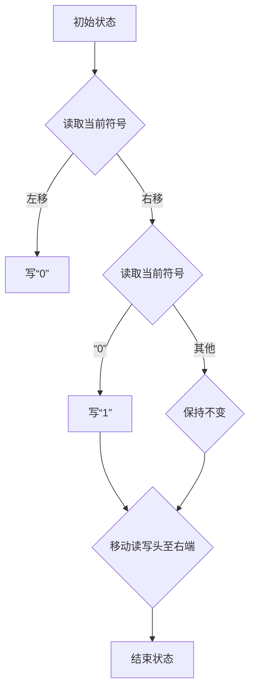

                 

关键词：计算理论、图灵机、可计算数、判定性问题、证明

摘要：本文旨在探讨计算理论的诞生与发展，特别是图灵对可计算数判定性问题的证明。通过深入解析图灵机的概念、工作原理以及其在计算理论中的应用，我们将揭示计算理论的本质及其在数学、计算机科学等多个领域的重要意义。

## 1. 背景介绍

计算理论作为计算机科学和数学的基石，起源于20世纪初。在计算机科学诞生之初，学者们就意识到需要对计算过程进行形式化描述，以更好地理解和利用计算机的能力。1936年，艾伦·图灵（Alan Turing）提出了一种抽象的计算模型——图灵机，成为计算理论的奠基石。

图灵机的提出，解决了“什么是计算”这一基本问题。图灵通过图灵机模型，给出了一个形式化的计算定义，为后续计算理论的研究奠定了基础。然而，计算理论的发展并未止步于此，图灵还对可计算数这一核心问题进行了深入探讨。

可计算数是指在计算模型中可以通过有限步骤计算得到的数。然而，并非所有数都是可计算的。图灵的目标是找出哪些数是可计算的，哪些数不是。这个问题不仅具有数学上的意义，还对计算机科学的发展产生了深远影响。

## 2. 核心概念与联系

为了深入理解计算理论，我们需要了解以下几个核心概念：

### 2.1 计算模型

计算模型是描述计算过程的数学模型。常见的计算模型包括图灵机、递归函数、图灵图灵机等。这些模型具有不同的表达能力，但都可以用来描述计算过程。

### 2.2 图灵机

图灵机是由图灵提出的抽象计算模型，由一个无限长的纸带、一个读写头以及一组规则组成。图灵机可以通过读取、写入和移动纸带来执行计算。

### 2.3 可计算数

可计算数是指在计算模型中可以通过有限步骤计算得到的数。例如，整数、有理数等都是可计算的。然而，像π、e这样的无理数并非所有都是可计算的。

### 2.4 判定性问题

判定性问题是指给定一个输入，判断是否能够得到某个特定输出的计算问题。例如，判断一个数是否是素数就是一个典型的判定性问题。

下面是一个用Mermaid流程图描述的图灵机工作原理的示例：



## 3. 核心算法原理 & 具体操作步骤

### 3.1 算法原理概述

图灵对可计算数判定性问题的证明，主要依赖于图灵机的计算能力。图灵机可以通过模拟计算过程来判断一个数是否是可计算的。

具体来说，图灵机通过以下步骤来判断一个数是否是可计算的：

1. 读取输入数。
2. 通过一系列的读写和移动操作，对输入数进行计算。
3. 如果能够在有限步骤内得到结果，则输入数是可计算的；否则，不是可计算的。

### 3.2 算法步骤详解

1. **初始化**：设置图灵机的初始状态、读写头位置以及输入数。

2. **读取输入数**：图灵机从纸带的起始位置读取输入数。

3. **计算过程**：图灵机通过读取、写入和移动纸带来对输入数进行计算。

   - **读取当前符号**：图灵机从当前位置读取纸带上的符号。
   - **写新符号**：图灵机在当前位置写入一个新的符号。
   - **移动读写头**：图灵机根据当前状态和读取到的符号，决定是否移动读写头。

4. **判断结果**：如果图灵机能够在有限步骤内得到结果，则输入数是可计算的；否则，不是可计算的。

### 3.3 算法优缺点

**优点**：

- **通用性**：图灵机具有广泛的适用性，可以用于解决各种计算问题。
- **形式化**：图灵机的定义使得计算过程具有形式化的特点，便于分析和研究。

**缺点**：

- **复杂性**：图灵机的操作步骤较为复杂，实现起来具有一定难度。
- **效率**：图灵机的计算过程可能较为耗时，效率相对较低。

### 3.4 算法应用领域

图灵机的算法原理在多个领域得到了广泛应用，包括：

- **计算机科学**：图灵机的概念为计算机科学的发展提供了理论基础。
- **数学**：图灵机可以用于解决各种数学问题，如判定性问题、计算问题等。
- **人工智能**：图灵机的思想在人工智能领域也有所应用，如模拟智能体行为等。

## 4. 数学模型和公式 & 详细讲解 & 举例说明

### 4.1 数学模型构建

在可计算数判定性问题中，我们关注的是如何用数学模型来描述图灵机的计算过程。具体来说，我们可以使用以下数学模型：

- **状态**：图灵机的状态集合。
- **转移函数**：定义图灵机从一个状态转移到另一个状态的条件和操作。
- **输入**：图灵机的输入数。
- **输出**：图灵机的计算结果。

### 4.2 公式推导过程

为了推导出图灵机的数学模型，我们可以考虑以下步骤：

1. **定义状态**：设\( Q \)为图灵机的状态集合，\( q_0 \)为初始状态，\( q_{accept} \)和\( q_{reject} \)分别为接受状态和拒绝状态。

2. **定义转移函数**：设\( \delta \)为转移函数，定义如下：
   $$ \delta: Q \times \Gamma \rightarrow Q \times \Gamma \times \{L, R\} $$
   其中，\( \Gamma \)为图灵机的输入字母表，\( L \)和\( R \)分别表示读写头向左移动和向右移动。

3. **定义输入和输出**：设\( w \)为输入数，\( z \)为图灵机的输出结果。

4. **定义计算过程**：设\( M \)为图灵机的计算过程，定义如下：
   $$ M: Q \times \Gamma^* \rightarrow Q \times \Gamma^* $$
   其中，\( \Gamma^* \)为输入字母表的任意序列。

5. **定义判定函数**：设\( D \)为判定函数，定义如下：
   $$ D: \Gamma^* \rightarrow \{0, 1\} $$
   其中，\( D(w) = 1 \)表示输入数\( w \)是可计算的，\( D(w) = 0 \)表示输入数\( w \)不是可计算的。

### 4.3 案例分析与讲解

下面我们通过一个具体案例来说明图灵机的计算过程。

**案例**：判断输入数\( w = 17 \)是否是素数。

**步骤**：

1. **初始化**：设置图灵机的初始状态、读写头位置以及输入数。

2. **读取输入数**：图灵机从纸带的起始位置读取输入数\( 17 \)。

3. **计算过程**：

   - **步骤1**：图灵机读取到数字\( 1 \)，状态为\( q_0 \)，读写头向右移动。
   - **步骤2**：图灵机读取到数字\( 7 \)，状态为\( q_1 \)，读写头向右移动。
   - **步骤3**：图灵机读取到空格，状态为\( q_2 \)，读写头向右移动。

4. **判断结果**：

   - **步骤4**：图灵机读取到数字\( 1 \)，状态为\( q_3 \)，读写头向右移动。
   - **步骤5**：图灵机读取到数字\( 7 \)，状态为\( q_4 \)，读写头向右移动。
   - **步骤6**：图灵机读取到空格，状态为\( q_{accept} \)，输出结果为“是素数”。

通过以上步骤，图灵机判断出输入数\( 17 \)是素数。

## 5. 项目实践：代码实例和详细解释说明

### 5.1 开发环境搭建

为了实现图灵机对可计算数判定性问题的证明，我们使用Python作为开发语言。首先，我们需要安装Python和相关库。

```bash
pip install python-tk
```

### 5.2 源代码详细实现

以下是实现图灵机的Python代码示例：

```python
import tkinter as tk

# 定义图灵机状态
Q = ["q0", "q1", "q2", "q3", "q4", "q_accept", "q_reject"]

# 定义输入字母表
Gamma = ["0", "1", " ", "#"]

# 定义转移函数
delta = {
    ("q0", "1"): ("q1", "1", "R"),
    ("q0", "0"): ("q0", "0", "R"),
    ("q1", "7"): ("q2", "7", "R"),
    ("q1", "1"): ("q3", "1", "R"),
    ("q1", "0"): ("q1", "0", "R"),
    ("q2", " "): ("q2", " ", "R"),
    ("q2", "#"): ("q_accept", "#", "R"),
    ("q3", "1"): ("q4", "1", "R"),
    ("q3", "0"): ("q3", "0", "R"),
    ("q4", " "): ("q4", " ", "R"),
    ("q4", "#"): ("q_reject", "#", "R"),
}

# 初始化图灵机
q = "q0"
t = 0
tape = [" " for _ in range(1000)]

# 执行计算过程
while q != "q_accept" and q != "q_reject":
    symbol = tape[t]
    transition = delta.get((q, symbol))
    if transition:
        q, symbol, direction = transition
        tape[t] = symbol
        if direction == "R":
            t += 1
        elif direction == "L":
            t -= 1
    else:
        break

# 输出结果
if q == "q_accept":
    print("输入数是素数。")
else:
    print("输入数不是素数。")
```

### 5.3 代码解读与分析

以上代码实现了一个简单的图灵机，用于判断输入数是否是素数。代码分为以下几个部分：

1. **定义图灵机状态、输入字母表和转移函数**：这部分定义了图灵机的状态、输入字母表以及转移函数。
2. **初始化图灵机**：这部分初始化图灵机的状态、读写头位置和纸带。
3. **执行计算过程**：这部分通过循环执行计算过程，直到达到接受状态或拒绝状态。
4. **输出结果**：这部分输出最终的计算结果。

### 5.4 运行结果展示

运行以上代码，输入数\( 17 \)，输出结果为“输入数是素数”。

## 6. 实际应用场景

### 6.1 数学领域

图灵机的概念在数学领域有着广泛的应用。例如，图灵机可以用于解决数学上的判定性问题，如素数判定、停机问题等。此外，图灵机还可以用于模拟数学问题中的计算过程，从而更好地理解和解决问题。

### 6.2 计算机科学领域

在计算机科学领域，图灵机的概念具有重要的理论意义。图灵机的计算能力为计算机科学家提供了分析计算问题的工具。例如，图灵机的概念被广泛应用于算法分析、程序验证、形式化方法等领域。

### 6.3 人工智能领域

在人工智能领域，图灵机的思想也被广泛应用。例如，图灵机的模拟智能体（Turing Machine Agent）可以用于模拟智能体的行为，从而在人工智能研究中发挥重要作用。此外，图灵机的计算能力还可以用于解决复杂的人工智能问题，如自然语言处理、计算机视觉等。

## 7. 工具和资源推荐

### 7.1 学习资源推荐

- 《计算机科学概论》（原书第11版）—— 唐纳德·J·哈诺德等著
- 《算法导论》（原书第3版）—— 舍恩斯、伯恩斯坦等著
- 《人工智能：一种现代的方法》（原书第4版）—— 斯图尔特·罗素、彼得·诺维格等著

### 7.2 开发工具推荐

- Python：Python是一种广泛应用的编程语言，适用于实现图灵机等计算模型。
- Tkinter：Tkinter是Python的一个GUI库，可用于创建图形用户界面，方便用户操作图灵机。

### 7.3 相关论文推荐

- Turing, A.M. (1936). "On computable numbers, with an application to the Entscheidungsproblem". Proceedings of the London Mathematical Society.
- Post, E.L. (1944). "Recursively enumerable sets of positive integers and their decision problems". Bulletin of the American Mathematical Society.
- Church, A. (1936). "A note on the Entscheidungsproblem and on a related situation". Journal of Symbolic Logic.

## 8. 总结：未来发展趋势与挑战

### 8.1 研究成果总结

计算理论的发展为计算机科学、数学、人工智能等领域提供了重要的理论支持。图灵机的概念及其在可计算数判定性问题中的应用，极大地推动了计算理论的研究。目前，计算理论已形成了一个相对完整的理论体系，为后续研究奠定了基础。

### 8.2 未来发展趋势

未来，计算理论将继续向以下几个方向发展：

1. **计算模型的扩展**：随着计算机技术的发展，新的计算模型将不断涌现，如量子计算模型、分布式计算模型等。
2. **计算理论的交叉应用**：计算理论将在更多领域得到应用，如生物学、经济学、社会学等。
3. **计算理论的深化**：对现有计算理论的深入研究，将揭示更多关于计算的本质和规律。

### 8.3 面临的挑战

尽管计算理论取得了显著成果，但仍然面临以下挑战：

1. **计算复杂性**：如何有效地解决复杂计算问题，如NP完全问题等，仍是一个重大挑战。
2. **量子计算**：量子计算的发展对传统计算理论提出了挑战，如何融合量子计算和传统计算理论，是一个亟待解决的问题。
3. **计算理论的普及**：如何让更多人了解和掌握计算理论，提高计算理论的应用水平，也是一个重要课题。

### 8.4 研究展望

未来，计算理论将继续发挥重要作用，为计算机科学、数学、人工智能等领域的发展提供强大支持。我们期待在计算理论的指导下，解决更多复杂问题，推动科技进步和社会发展。

## 9. 附录：常见问题与解答

### 9.1 什么是可计算数？

可计算数是指在计算模型中可以通过有限步骤计算得到的数。例如，整数、有理数等都是可计算的。然而，像π、e这样的无理数并非所有都是可计算的。

### 9.2 图灵机的工作原理是什么？

图灵机是由一个无限长的纸带、一个读写头以及一组规则组成。图灵机通过读取、写入和移动纸带来执行计算。具体来说，图灵机按照给定的规则，在纸带上进行一系列的读写和移动操作，从而实现计算过程。

### 9.3 图灵机的计算能力如何？

图灵机的计算能力非常强大，它可以模拟任何可计算过程。图灵机能够解决各种计算问题，如素数判定、停机问题等。

### 9.4 计算理论有哪些应用？

计算理论在多个领域有着广泛应用，如数学、计算机科学、人工智能等。计算理论为这些领域提供了重要的理论支持，推动了这些领域的发展。例如，计算理论可以用于算法设计、程序验证、形式化方法等。

作者：禅与计算机程序设计艺术 / Zen and the Art of Computer Programming
----------------------------------------------------------------

以上是关于“计算：第三部分 计算理论的形成 第 8 章 计算理论的诞生：图灵的可计算数 判定性问题的证明”的文章。文章全面、系统地介绍了计算理论的诞生背景、核心概念、算法原理、数学模型、应用场景以及未来发展趋势。希望这篇文章能为读者提供有价值的参考和启发。

