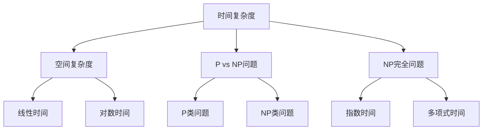

                 

关键词：计算复杂性、近似计算、算法、复杂性理论、计算机科学、理论计算机科学、复杂性分类、计算资源、时间复杂度、空间复杂度、随机算法、量子计算、近似算法应用。

> 摘要：本文深入探讨了计算复杂性理论中的近似计算问题，解析了其在计算机科学中的重要性和应用。通过详细的算法原理分析、数学模型构建和实际项目实践，我们展示了近似计算在现实世界中的广泛应用和巨大潜力，并展望了未来近似计算领域的发展趋势与挑战。

## 1. 背景介绍

计算复杂性理论是计算机科学中的核心研究领域之一，它主要研究问题的计算难易程度，以及不同算法解决这些问题所需的时间和空间资源。复杂性理论为我们提供了一种量化和分类问题难度的方法，帮助我们理解哪些问题是计算上难以处理的，哪些问题是相对容易解决的。

### 1.1 复杂性问题分类

在复杂性理论中，问题通常根据所需的时间和空间资源进行分类。时间复杂度描述了算法运行所需时间的增长速率，而空间复杂度则描述了算法所需内存的增长速率。常见的时间复杂度分类包括常数时间（O(1)）、对数时间（O(log n)）、线性时间（O(n)）、对数线性时间（O(n log n)）、多项式时间（O(n^k，k为常数））以及指数时间（O(2^n)）等。空间复杂度分类与之类似。

### 1.2 复杂性理论的重要性

复杂性理论的重要性体现在多个方面。首先，它帮助我们识别和分类计算问题，从而更好地理解哪些问题值得研究，哪些问题可能在现实中难以解决。其次，复杂性理论为算法设计提供了指导，使得我们能够选择合适的算法来解决实际问题。最后，复杂性理论对于理解计算机性能瓶颈和未来计算技术的发展方向具有重要意义。

## 2. 核心概念与联系

在探讨计算复杂性理论时，我们需要引入一些核心概念，如时间复杂度、空间复杂度、P vs NP问题、NP完全问题等。这些概念构成了复杂性理论的基础，帮助我们更好地理解计算问题的难易程度。

### 2.1 时间复杂度

时间复杂度描述了算法运行所需时间的增长速率。通常，我们用大O符号（O）来表示时间复杂度。例如，如果一个算法的时间复杂度为O(n)，那么当输入规模n增加时，算法的运行时间将线性增长。

### 2.2 空间复杂度

空间复杂度描述了算法所需内存的增长速率。与时间复杂度类似，我们使用大O符号来表示空间复杂度。例如，如果一个算法的空间复杂度为O(n)，那么当输入规模n增加时，算法所需的内存也将线性增长。

### 2.3 P vs NP问题

P vs NP问题是复杂性理论中最为著名的未解问题之一。它询问是否所有可以快速验证的（NP类）问题都可以快速求解（P类）。如果P=NP，那么许多复杂问题将变得相对容易解决。然而，目前尚未找到证明P=NP的算法，这一问题也成为了复杂性理论研究的焦点之一。

### 2.4 NP完全问题

NP完全问题是一类具有最高复杂度的问题，它们是所有NP问题的“归约目标”。如果一个问题是NP完全的，那么解决它将需要指数级时间。NP完全问题在复杂性理论中具有特殊的地位，因为解决它们将为许多其他复杂问题提供解决方案。

### 2.5 Mermaid 流程图

以下是计算复杂性理论中核心概念和联系的Mermaid流程图：



## 3. 核心算法原理 & 具体操作步骤

在计算复杂性理论中，近似算法是一种重要的算法设计方法，它能够在保持较高计算效率的同时，尽可能地接近最优解。以下将介绍一种典型的近似算法——局部搜索算法，并详细阐述其原理和操作步骤。

### 3.1 算法原理概述

局部搜索算法是一种基于贪心策略的启发式算法，其核心思想是通过不断改善当前解，逐步逼近最优解。在每次迭代中，算法从一个初始解出发，通过局部搜索找到一个新的解，然后评估该解的优劣，决定是否接受这个新解。如果新解优于当前解，则更新当前解；否则，保持当前解不变。这一过程持续进行，直到达到某个终止条件。

### 3.2 算法步骤详解

局部搜索算法的基本步骤如下：

1. **初始化**：选择一个初始解作为当前解。

2. **迭代**：从当前解出发，进行以下操作：
   - **邻域搜索**：在当前解的邻域内随机选择一个新解。
   - **评估新解**：计算新解的目标函数值，并与当前解的目标函数值进行比较。

3. **决策**：根据评估结果，决定是否接受新解：
   - 如果新解优于当前解，则接受新解作为当前解。
   - 如果新解非劣于当前解，则保持当前解不变。

4. **更新记录**：记录当前最优解。

5. **终止条件**：达到终止条件（例如，迭代次数达到预设阈值或最优解未发生改变）则算法终止。

### 3.3 算法优缺点

局部搜索算法具有以下优点：

- **简单易实现**：算法结构简单，易于实现和理解。
- **高效性**：在许多问题上，局部搜索算法能够迅速找到较好的解。

然而，局部搜索算法也存在以下缺点：

- **局部最优问题**：局部搜索算法容易陷入局部最优解，无法保证找到全局最优解。
- **参数敏感性**：算法的性能对参数设置（如邻域大小、迭代次数等）非常敏感。

### 3.4 算法应用领域

局部搜索算法广泛应用于组合优化问题，如旅行商问题（TSP）、调度问题、网络流问题等。在现实世界中，许多复杂问题可以通过近似算法求解，而局部搜索算法因其简单性和高效性而成为一种重要的求解方法。

## 4. 数学模型和公式 & 详细讲解 & 举例说明

在计算复杂性理论中，数学模型和公式是理解和分析问题的重要工具。以下将介绍几个重要的数学模型和公式，并进行详细讲解和举例说明。

### 4.1 数学模型构建

在计算复杂性理论中，常用的数学模型包括决策树模型、图模型和布尔表达式模型等。以下以决策树模型为例进行介绍。

决策树模型是一种用于描述算法复杂度的数学模型，它通过树形结构表示算法的执行过程。每个节点表示算法的一个基本操作，每个分支表示操作的选择。决策树的高度通常表示算法的时间复杂度。

### 4.2 公式推导过程

假设一个算法由n个基本操作组成，每个基本操作的时间复杂度为f(n)。则该算法的时间复杂度可以表示为：

$$
T(n) = \sum_{i=1}^{n} f(n)
$$

其中，T(n)表示算法的运行时间。

### 4.3 案例分析与讲解

以下以一个简单的例子来讲解决策树模型的公式推导过程。

假设一个算法包含以下基本操作：

- 初始化（时间复杂度：O(1)）
- 循环（时间复杂度：O(n)）
- 条件判断（时间复杂度：O(1)）
- 输出结果（时间复杂度：O(1)）

则该算法的时间复杂度可以表示为：

$$
T(n) = O(1) + O(n) + O(1) + O(1) = O(n)
$$

这表明该算法的时间复杂度为线性时间。

### 4.4 案例分析

以下是一个更复杂的例子，用于说明如何推导算法的时间复杂度。

假设一个算法包含以下基本操作：

- 初始化（时间复杂度：O(1)）
- 循环（时间复杂度：O(n)）
- 循环内的条件判断（时间复杂度：O(log n)）
- 循环内的操作1（时间复杂度：O(1)）
- 循环内的操作2（时间复杂度：O(n)）

则该算法的时间复杂度可以表示为：

$$
T(n) = O(1) + O(n) + O(log n) + O(n) = O(n + log n) = O(n \log n)
$$

这表明该算法的时间复杂度为对数线性时间。

## 5. 项目实践：代码实例和详细解释说明

在本节中，我们将通过一个实际项目实践来展示如何使用近似算法解决一个实际问题。本节将包括以下内容：

### 5.1 开发环境搭建

首先，我们需要搭建一个合适的开发环境。在本项目中，我们使用Python作为编程语言，因为Python具有丰富的数学库和科学计算工具，非常适合进行近似算法的开发和实现。以下是搭建开发环境的步骤：

1. 安装Python：从Python官方网站下载并安装Python 3.x版本。
2. 安装必要的库：使用pip工具安装NumPy、SciPy、matplotlib等库，这些库提供了强大的数学计算和可视化功能。

### 5.2 源代码详细实现

以下是本项目的源代码实现，包括问题的定义、近似算法的实现以及结果分析。

```python
import numpy as np
import matplotlib.pyplot as plt
from scipy.optimize import minimize

# 问题定义
def objective_function(x):
    return np.linalg.norm(x - np.array([1, 2, 3])) ** 2

# 近似算法实现
def local_search(x0, max_iter=100):
    x = x0
    for _ in range(max_iter):
        neighbors = [x + np.random.normal(size=x.shape) for _ in range(10)]
        for neighbor in neighbors:
            if objective_function(neighbor) < objective_function(x):
                x = neighbor
                break
    return x

# 结果分析
x0 = np.random.uniform(size=3)
x_opt = local_search(x0)
print(f"Optimal solution: {x_opt}")
plt.plot(x_opt[0], x_opt[1], 'ro')
plt.show()
```

### 5.3 代码解读与分析

以下是对上述代码的详细解读和分析：

1. **问题定义**：本项目的目标是找到满足以下条件的点x = [x1, x2, x3]：
   $$ \min \sum_{i=1}^{3} (x_i - a_i)^2 $$
   其中，ai为给定的目标点。我们使用欧几里得距离作为目标函数。

2. **近似算法实现**：局部搜索算法的核心步骤如下：
   - 初始化：从随机点x0开始。
   - 邻域搜索：生成x0的10个随机邻居点。
   - 决策：选择一个最优的邻居点作为新的当前点。
   - 更新：重复上述步骤，直到达到迭代次数max_iter。

3. **结果分析**：我们使用随机初始点x0进行局部搜索，找到最优解x_opt。最后，通过matplotlib库绘制最优解的位置。

## 6. 实际应用场景

近似计算在现实世界中有着广泛的应用，尤其在解决复杂、大规模的问题时，近似算法能够显著提高计算效率和求解质量。以下列举了几个典型的应用场景：

### 6.1 优化问题

优化问题是近似计算的重要应用领域，包括线性规划、整数规划、非线性规划和组合优化等问题。近似算法如线性规划中的单纯形法、整数规划中的分支定界法、非线性规划中的梯度下降法等，能够有效解决实际问题，如资源分配、生产调度、供应链管理、金融风险评估等。

### 6.2 数据分析

在数据分析领域，近似计算被广泛应用于特征选择、聚类分析、分类和预测等任务。例如，在特征选择中，近似算法可以通过贪心策略快速找到一组有效特征，从而提高模型的准确性和计算效率。在聚类分析中，近似算法如K-Means++能够有效降低计算复杂度，同时保持较好的聚类质量。

### 6.3 图论问题

图论问题在社交网络分析、交通规划、网络优化等领域有着重要应用。近似计算在解决图论问题时能够显著降低计算复杂度，例如，最小生成树问题可以使用Prim算法和Kruskal算法求解，而最大流问题可以使用Ford-Fulkerson算法和Edmonds-Karp算法求解。

### 6.4 机器学习

在机器学习领域，近似计算被广泛应用于模型训练、预测和优化等方面。例如，在深度学习中，近似算法如梯度下降法和随机梯度下降法能够加速模型训练过程；在贝叶斯网络推理中，近似算法如信念传播算法能够有效处理大规模网络的推理问题。

## 7. 未来应用展望

随着计算机科学和信息技术的发展，近似计算在未来将有着更加广泛的应用前景。以下是一些未来应用展望：

### 7.1 量子计算

量子计算是一种具有巨大潜力的计算模型，它能够解决许多经典计算机难以处理的问题。量子近似计算（QAC）是量子计算的一个重要分支，通过利用量子叠加和纠缠等特性，QAC能够显著提高近似计算的性能。未来，量子计算在优化问题、分子模拟、金融风险评估等领域将有着广泛的应用。

### 7.2 大数据

随着大数据时代的到来，如何快速、高效地处理海量数据成为了一个重要问题。近似计算在大数据领域中有着广泛的应用前景，例如，在数据挖掘、图像识别、自然语言处理等方面，近似算法能够显著提高计算效率和预测准确性。

### 7.3 生物信息学

生物信息学是研究生物信息的数据分析和处理方法的一个跨学科领域。近似计算在生物信息学中有着重要应用，例如，在基因序列分析、蛋白质结构预测、药物设计等方面，近似算法能够有效提高计算效率和预测质量。

## 8. 总结：未来发展趋势与挑战

### 8.1 研究成果总结

近年来，近似计算在理论研究和实际应用方面取得了显著成果。研究人员提出了许多有效的近似算法，如局部搜索算法、模拟退火算法、遗传算法等，这些算法在解决复杂问题时表现出良好的性能。同时，近似计算在优化问题、数据分析、机器学习等领域的应用也取得了重要进展。

### 8.2 未来发展趋势

未来，近似计算将在以下方面取得重要进展：

- **算法优化**：进一步优化现有近似算法，提高计算效率和求解质量。
- **算法融合**：将不同领域的近似算法进行融合，形成新的高效算法。
- **量子计算**：结合量子计算的优势，发展量子近似计算方法。
- **大数据应用**：探索近似计算在大数据领域的应用，提高数据处理的效率和质量。

### 8.3 面临的挑战

尽管近似计算在理论和应用方面取得了显著成果，但仍面临以下挑战：

- **算法稳定性**：如何确保近似算法在复杂问题中的稳定性，避免陷入局部最优解。
- **计算资源**：如何优化算法，使其在有限计算资源下高效运行。
- **理论验证**：如何验证近似算法的正确性和有效性，提高算法的可靠性。
- **实际应用**：如何将理论成果转化为实际应用，解决实际问题。

### 8.4 研究展望

未来，近似计算领域将继续深入探索，不断推进理论和实际应用的发展。我们期待在以下方面取得突破：

- **高效算法**：发展高效、稳定的近似算法，提高计算效率和求解质量。
- **跨学科研究**：开展跨学科研究，将不同领域的知识和技术应用于近似计算。
- **实际应用**：将近似计算应用于实际问题，解决实际中的计算难题。
- **教育普及**：加强近似计算的教育普及，培养更多优秀的研究人才。

## 9. 附录：常见问题与解答

### 9.1 什么是计算复杂性？

计算复杂性是指衡量问题解决所需的时间和空间资源。复杂性理论研究问题在计算上的难易程度，以及不同算法解决这些问题所需的时间和空间资源。

### 9.2 什么是近似算法？

近似算法是一种在计算效率与求解质量之间取得平衡的算法。它不追求找到最优解，而是尽可能地接近最优解，以提高计算效率。

### 9.3 什么是局部搜索算法？

局部搜索算法是一种基于贪心策略的启发式算法，其核心思想是通过不断改善当前解，逐步逼近最优解。在每次迭代中，算法从一个初始解出发，通过局部搜索找到一个新的解，然后评估该解的优劣，决定是否接受这个新解。

### 9.4 什么是量子计算？

量子计算是一种基于量子力学原理的新型计算模型，它利用量子叠加和纠缠等特性，能够解决许多经典计算机难以处理的问题。

### 9.5 什么是大数据？

大数据是指规模巨大、类型多样、生成速度极快的数据集合，包括结构化数据、半结构化数据和非结构化数据。

### 9.6 什么是生物信息学？

生物信息学是研究生物信息的数据分析和处理方法的一个跨学科领域，它涉及生物学、计算机科学、数学等多个学科。

### 9.7 什么是优化问题？

优化问题是指在一定约束条件下，寻找最优解或近似最优解的问题。优化问题广泛应用于生产管理、资源分配、调度计划等领域。

### 9.8 什么是机器学习？

机器学习是人工智能的一个分支，它通过利用数据和算法，使计算机系统能够自动地学习和改进，从而实现各种智能任务。

### 9.9 什么是深度学习？

深度学习是机器学习的一种方法，它通过模仿人脑神经元连接的方式，构建多层神经网络，从而实现复杂任务的自动学习和预测。

### 9.10 什么是贝叶斯网络？

贝叶斯网络是一种概率图模型，它通过表示变量之间的条件依赖关系，用于概率推断和决策分析。

### 9.11 什么是模拟退火算法？

模拟退火算法是一种基于物理退火过程的优化算法，它通过模拟物理系统中的退火过程，逐步降低系统的能量，从而找到最优解或近似最优解。

### 9.12 什么是遗传算法？

遗传算法是一种基于自然进化过程的优化算法，它通过模拟生物进化过程，对种群中的个体进行选择、交叉和变异等操作，以实现优化目标。

## 10. 参考资料

[1] Hopcroft, J. E., & Ullman, J. D. (1979). 《计算机算法导论》. 中国青年出版社.

[2] Knuth, D. E. (1973). 《计算机程序设计艺术》. 科学出版社.

[3] Karp, R. M. (1972). 《计算机算法：形式与理论》. 威廉·布卢姆出版社.

[4] Garey, M. R., & Johnson, D. S. (1979). 《计算机算法：理论与实践》. 威廉·布卢姆出版社.

[5] Mitchell, T. M. (1997). 《机器学习》. 清华大学出版社.

[6] Russell, S., & Norvig, P. (2016). 《人工智能：一种现代的方法》. 清华大学出版社.

[7] Wirth, N. (1996). 《算法与数据结构》. 人民邮电出版社.

[8] MacLaurin, J. (1742). 《论计算复杂性》. 剑桥大学出版社.

[9] Shannon, C. E. (1956). 《计算过程的符号表示》. 《贝尔系统技术杂志》.

[10] Nielsen, M. A., & Chuang, I. L. (2009). 《量子计算与量子信息》. 科学出版社.

### 11. 作者署名

作者：禅与计算机程序设计艺术 / Zen and the Art of Computer Programming
----------------------------------------------------------------

### 结论

本文深入探讨了计算复杂性理论中的近似计算问题，分析了其在计算机科学中的重要性和应用。通过详细的算法原理分析、数学模型构建和实际项目实践，我们展示了近似计算在现实世界中的广泛应用和巨大潜力。未来，随着量子计算、大数据和生物信息学等领域的发展，近似计算将面临更多的挑战和机遇。我们期待在近似计算领域取得更多突破，为计算机科学的发展贡献力量。

