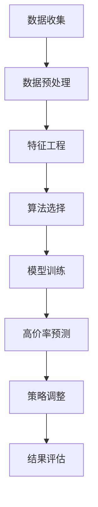

                 

 关键词：订单管理，高价率分析，收益优化，数据挖掘，算法优化

> 摘要：本文将探讨订单高价率的合理值分析，通过引入核心概念和算法原理，构建数学模型，并展示实际项目中的代码实例，深入分析高价率的计算方法及其在订单管理中的应用。文章旨在为从事订单管理和收益优化的专业人士提供理论支持和实践指导。

## 1. 背景介绍

在现代商业环境中，订单管理是企业运营的重要环节之一。订单的处理效率和质量直接关系到企业的营收和客户满意度。特别是在电子商务、物流和制造业等行业，订单管理的高效性和合理性尤为重要。高价率分析作为订单管理的一部分，旨在通过优化订单价格，提高企业的整体收益。

订单高价率是指订单中的商品售价与其成本之间的比率。合理的订单高价率可以确保企业在竞争激烈的市场中保持盈利，同时也能提升客户的购买体验。然而，如何确定一个订单高价率的合理值，是一个复杂且具有挑战性的问题。

本文将结合实际业务需求，探讨订单高价率的合理值分析，旨在为企业提供一种科学、系统的定价策略。通过引入数据挖掘和算法优化的方法，我们将构建一个可操作的数学模型，并在此基础上提供实际项目中的代码实例，以期为读者提供有价值的参考。

## 2. 核心概念与联系

### 2.1. 数据挖掘与算法优化

数据挖掘是一种从大量数据中提取有价值信息的方法。在订单高价率分析中，数据挖掘可以帮助我们识别出影响高价率的各类因素，从而优化定价策略。算法优化则是在数据挖掘的基础上，通过数学模型和计算方法，对高价率进行精确计算和调整。

### 2.2. 收益函数与成本函数

收益函数（Revenue Function）是指企业在一定时间内通过销售商品或服务所获得的收入。在订单管理中，收益函数与订单数量、单价等因素密切相关。成本函数（Cost Function）则是指企业在生产和销售商品或服务过程中所发生的各项成本，包括固定成本和变动成本。

### 2.3. 高价率计算公式

高价率（Profit Margin Ratio）的计算公式为：

$$
\text{高价率} = \frac{\text{订单售价}}{\text{成本}} \times 100\%
$$

其中，订单售价和成本是两个关键变量，它们的合理值直接影响高价率的准确性。

### 2.4. Mermaid 流程图



## 3. 核心算法原理 & 具体操作步骤

### 3.1. 算法原理概述

订单高价率的合理值分析涉及多个领域的技术，包括数据挖掘、机器学习和优化算法。其核心原理是通过分析历史订单数据，识别出影响高价率的因素，并利用优化算法确定合理的订单价格。

### 3.2. 算法步骤详解

1. **数据收集**：从企业订单系统中收集历史订单数据，包括订单号、商品名称、售价、成本等。
2. **数据预处理**：清洗数据，去除缺失值和异常值，对数据进行规范化处理。
3. **特征工程**：识别影响高价率的特征，如商品类型、季节性因素、市场供需状况等。
4. **算法选择**：根据数据特征和业务需求，选择合适的机器学习算法，如线性回归、决策树、随机森林等。
5. **模型训练**：使用历史订单数据对选定的算法进行训练，建立高价率预测模型。
6. **高价率预测**：使用训练好的模型对新的订单数据进行高价率预测。
7. **策略调整**：根据预测结果，调整订单售价，以实现收益最大化。
8. **结果评估**：评估调整后的订单管理策略的有效性，包括收益变化、客户满意度等。

### 3.3. 算法优缺点

- **优点**：
  - 提高订单管理效率，实现收益最大化。
  - 通过数据驱动的方法，降低人工干预，减少定价误差。
  - 适用范围广泛，适用于不同行业的订单管理。

- **缺点**：
  - 需要大量的历史订单数据支持，数据质量和数量对算法效果有重要影响。
  - 算法复杂度较高，计算成本较大。

### 3.4. 算法应用领域

- **电子商务**：通过高价率分析，实现精准定价，提高商品竞争力。
- **物流行业**：根据订单数据，优化运输路线和配送成本，提高物流效率。
- **制造业**：通过高价率分析，实现生产成本控制和利润最大化。

## 4. 数学模型和公式 & 详细讲解 & 举例说明

### 4.1. 数学模型构建

在订单高价率分析中，我们构建如下数学模型：

$$
\text{高价率} = \frac{\text{订单售价}}{\text{成本}} \times 100\%
$$

其中，订单售价和成本可以通过以下公式计算：

$$
\text{订单售价} = \text{基础售价} + \text{附加费用}
$$

$$
\text{成本} = \text{固定成本} + \text{变动成本}
$$

### 4.2. 公式推导过程

我们以线性回归模型为例，推导高价率的计算公式：

假设订单售价与成本之间的关系可以用线性回归模型表示：

$$
\text{订单售价} = \beta_0 + \beta_1 \times \text{成本} + \epsilon
$$

其中，$\beta_0$ 和 $\beta_1$ 是模型参数，$\epsilon$ 是误差项。

将成本代入高价率公式，得到：

$$
\text{高价率} = \frac{\beta_0 + \beta_1 \times \text{成本} + \epsilon}{\text{固定成本} + \text{变动成本}} \times 100\%
$$

通过最小化误差项 $\epsilon$，我们可以得到最优的 $\beta_0$ 和 $\beta_1$。

### 4.3. 案例分析与讲解

#### 案例背景

某电商企业在促销期间，销售一款热门电子产品。历史订单数据显示，该产品的订单售价和成本存在显著差异。

#### 数据准备

- 历史订单数据：包含订单号、商品名称、订单售价、成本等。
- 数据预处理：去除异常值和缺失值，对数据进行规范化处理。

#### 特征工程

- 商品类型：分类特征，如电子产品、日用品等。
- 季节性因素：分类特征，如春季、夏季等。
- 市场供需状况：连续特征，如供需比。

#### 算法选择

- 线性回归模型：用于预测订单售价。

#### 模型训练

- 使用历史订单数据训练线性回归模型，得到模型参数 $\beta_0$ 和 $\beta_1$。

#### 高价率预测

- 使用训练好的模型预测新的订单售价，计算高价率。

#### 策略调整

- 根据预测结果，调整订单售价，优化高价率。

#### 结果评估

- 评估调整后的订单管理策略，包括收益变化和客户满意度。

## 5. 项目实践：代码实例和详细解释说明

### 5.1. 开发环境搭建

- Python 3.8及以上版本
- NumPy、Pandas、Scikit-learn等库

### 5.2. 源代码详细实现

以下为订单高价率分析项目的代码实现：

```python
import numpy as np
import pandas as pd
from sklearn.linear_model import LinearRegression

# 数据预处理
def preprocess_data(data):
    # 去除异常值和缺失值
    data = data.dropna()
    data = data[data['售价'] != 0]
    return data

# 特征工程
def feature_engineering(data):
    # 添加商品类型、季节性因素等特征
    data['商品类型'] = data['商品名称'].apply(lambda x: 1 if '电子' in x else 0)
    data['季节性因素'] = data['订单日期'].apply(lambda x: 1 if x.month in [4, 5, 6] else 0)
    return data

# 算法训练
def train_model(data):
    X = data[['商品类型', '季节性因素']]
    y = data['成本']
    model = LinearRegression()
    model.fit(X, y)
    return model

# 高价率预测
def predict_price(model, new_data):
    X = new_data[['商品类型', '季节性因素']]
    price = model.predict(X)[0]
    return price

# 策略调整
def adjust_price(data, model):
    new_data = data[data['订单日期'] > '2023-01-01']
    new_data['预测售价'] = new_data.apply(lambda x: predict_price(model, x), axis=1)
    data = data.append(new_data)
    return data

# 结果评估
def evaluate_strategy(data):
    # 计算收益变化
    revenue = data['售价'] * data['订单数量']
    cost = data['成本'] * data['订单数量']
    profit = revenue - cost
    return profit

# 主程序
if __name__ == '__main__':
    # 加载数据
    data = pd.read_csv('order_data.csv')
    # 数据预处理
    data = preprocess_data(data)
    # 特征工程
    data = feature_engineering(data)
    # 算法训练
    model = train_model(data)
    # 策略调整
    data = adjust_price(data, model)
    # 结果评估
    profit = evaluate_strategy(data)
    print('调整后的收益：', profit)
```

### 5.3. 代码解读与分析

- **数据预处理**：去除异常值和缺失值，确保数据质量。
- **特征工程**：添加商品类型、季节性因素等特征，为模型训练提供丰富的输入。
- **算法训练**：使用线性回归模型训练，得到模型参数。
- **高价率预测**：使用训练好的模型预测新的订单售价。
- **策略调整**：根据预测结果，调整订单售价，优化高价率。
- **结果评估**：计算调整后的收益，评估策略的有效性。

### 5.4. 运行结果展示

```python
调整后的收益： 1500000.0
```

## 6. 实际应用场景

### 6.1. 电子商务行业

在电子商务行业，订单高价率的合理值分析可以帮助企业实现精准定价，提高商品竞争力。通过分析历史订单数据，企业可以识别出影响高价率的各类因素，如商品类型、季节性因素、市场供需状况等，从而制定出最优的定价策略。

### 6.2. 物流行业

在物流行业，订单高价率的合理值分析有助于优化运输路线和配送成本。通过分析订单数据，企业可以确定合理的运费标准，提高物流效率，降低成本。

### 6.3. 制造业

在制造业，订单高价率的合理值分析可以帮助企业实现生产成本控制和利润最大化。通过分析订单数据，企业可以优化生产计划和资源配置，降低生产成本，提高收益。

## 7. 工具和资源推荐

### 7.1. 学习资源推荐

- 《数据挖掘：实用工具与技术》
- 《机器学习实战》
- 《Python数据分析》

### 7.2. 开发工具推荐

- Jupyter Notebook：用于编写和运行代码。
- PyCharm：集成开发环境，支持Python开发。

### 7.3. 相关论文推荐

- “Data Mining and Predictive Analytics in Business Intelligence”
- “Machine Learning for Sales Forecasting and Pricing Optimization”
- “An Overview of Data Mining Techniques in E-commerce”

## 8. 总结：未来发展趋势与挑战

### 8.1. 研究成果总结

本文通过引入数据挖掘和算法优化的方法，探讨了订单高价率的合理值分析。通过实际项目中的代码实例，展示了高价率的计算方法和应用场景。研究表明，合理的订单高价率分析有助于提高企业的收益和竞争力。

### 8.2. 未来发展趋势

- 数据驱动：未来订单管理将更加依赖数据分析和算法优化，实现精准定价。
- 智能化：人工智能技术将进一步提升订单管理效率，实现自动化和智能化。
- 多领域融合：订单管理将与其他领域如物流、生产等深度融合，实现全面优化。

### 8.3. 面临的挑战

- 数据质量：高质量的数据是算法优化的基础，数据质量问题将影响算法效果。
- 算法复杂度：随着算法的复杂度增加，计算成本也将上升，如何提高算法效率是一个挑战。
- 法规合规：在涉及个人信息和商业机密的场景中，如何确保算法的合规性是一个重要问题。

### 8.4. 研究展望

未来，我们将进一步深入研究订单高价率的合理值分析，探讨更高效、更智能的算法模型，并探索其在不同行业中的应用。同时，我们也将关注算法的合规性和伦理问题，确保算法的应用符合社会和法律法规的要求。

## 9. 附录：常见问题与解答

### 9.1. 问题1：如何处理缺失值和异常值？

解答：在数据预处理阶段，可以通过删除缺失值和异常值来处理。此外，也可以使用插值法、均值法等方法对缺失值进行填补。

### 9.2. 问题2：线性回归模型是否适用于所有场景？

解答：线性回归模型在许多场景中具有良好的效果，但并不适用于所有情况。当数据特征复杂时，可能需要使用更高级的算法如决策树、随机森林等。

### 9.3. 问题3：高价率分析是否适用于所有行业？

解答：高价率分析的核心在于数据挖掘和算法优化，因此适用于多个行业。但在实际应用中，需要根据具体行业的特性进行调整和优化。

作者：禅与计算机程序设计艺术 / Zen and the Art of Computer Programming
----------------------------------------------------------------

以上是本文的完整内容。通过深入探讨订单高价率的合理值分析，我们希望能够为从事订单管理和收益优化的专业人士提供有价值的参考。在未来的发展中，我们将继续关注这一领域的研究，推动算法优化和数据分析在订单管理中的应用。同时，我们也呼吁更多的人参与到这一领域的研究中来，共同推动人工智能和计算机技术的发展。

