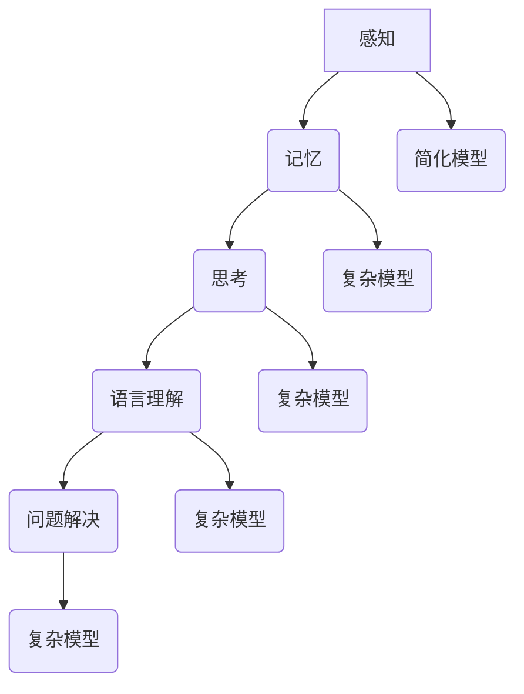

                 

### 1. 背景介绍

在当今快速发展的信息技术时代，认知科学和人工智能研究已经成为了一个备受瞩目的领域。认知科学旨在研究人类认知过程的本质，包括感知、记忆、思考、语言理解和问题解决等方面。而人工智能则通过模拟人类的认知过程，实现了智能体的自主学习和决策能力。

然而，在认知科学和人工智能的研究过程中，我们常常面临着浅薄与复杂之间的矛盾。一方面，研究人员希望通过简化的模型和算法来理解和解释认知过程，从而简化问题的复杂度。另一方面，真实的认知过程却具有高度的复杂性和多样性，使得我们对认知本质的理解变得困难。

本文将探讨在认知发展过程中，浅薄与复杂之间的相互作用和影响。我们将从理论分析、实际应用和未来展望三个方面进行论述，以揭示这一矛盾背后的本质原因和解决方法。

### 2. 核心概念与联系

在探讨认知发展中的浅薄与复杂之前，我们需要明确一些核心概念和原理。以下是本文中将会用到的关键概念：

#### 2.1 认知过程

认知过程是指人类在感知、记忆、思考、语言理解和问题解决等方面所进行的各种心理活动。它是一个复杂而多层次的过程，涉及到神经、生理、心理和认知等多个层面。

#### 2.2 简化模型

简化模型是指在认知科学和人工智能研究中，为了降低问题的复杂度，采用简化的算法和模型来模拟认知过程。这种模型通常忽略了某些复杂细节，以便更容易地理解和分析问题。

#### 2.3 复杂性

复杂性是指认知过程和问题解决过程中所涉及到的各种复杂因素，如多层次、多维度、非线性、动态变化等。

#### 2.4 适应性与灵活性

适应性与灵活性是指认知系统在处理不同问题和环境时，能够快速调整和适应的能力。一个良好的认知系统应当具有高度的适应性和灵活性，以便在面对复杂和未知的环境时能够有效应对。

#### 2.5 Mermaid 流程图

为了更好地展示认知过程和简化模型的相互作用，我们使用 Mermaid 流程图来表示核心概念和原理。以下是认知过程的 Mermaid 流程图：



### 3. 核心算法原理 & 具体操作步骤

#### 3.1 算法原理概述

在认知科学和人工智能研究中，简化模型和复杂模型都发挥着重要作用。简化模型通过忽略某些复杂细节，使得问题变得更加易于分析和解决。而复杂模型则试图模拟真实世界的复杂性和多样性，以便更好地理解和解释认知过程。

本文将介绍一种基于简化模型的认知算法，并详细阐述其原理和操作步骤。该算法的主要思想是利用简化模型来捕捉认知过程的核心特征，并通过不断迭代和优化来提高模型的性能。

#### 3.2 算法步骤详解

1. **初始化参数**：首先，初始化算法所需的参数，如学习率、迭代次数等。

2. **构建简化模型**：基于简化模型的思想，构建一个简化的认知模型。该模型通常采用神经网络、决策树等算法来实现。

3. **数据预处理**：对输入数据进行预处理，包括归一化、去噪、特征提取等。

4. **迭代优化**：通过不断迭代和优化简化模型，使其能够更好地拟合数据。具体步骤如下：
   - 计算简化模型的预测值。
   - 计算预测值与真实值之间的误差。
   - 更新简化模型的参数，以减小误差。

5. **评估模型性能**：在迭代结束后，评估简化模型的性能，如准确率、召回率、F1 值等。

6. **输出结果**：根据简化模型的预测结果，输出相应的认知决策或分析结果。

#### 3.3 算法优缺点

**优点**：
1. 简化模型的复杂性，使得问题更加易于理解和分析。
2. 提高算法的运行效率和可扩展性。
3. 便于与其他模型进行比较和分析。

**缺点**：
1. 忽略了某些复杂细节，可能导致模型性能的损失。
2. 可能无法完全捕捉真实世界的复杂性和多样性。

#### 3.4 算法应用领域

简化模型在认知科学和人工智能研究领域具有广泛的应用，如：
1. 机器学习：简化模型的构建和优化，以提高模型的性能和泛化能力。
2. 计算机视觉：利用简化模型进行图像识别、目标检测等任务。
3. 自然语言处理：简化模型的构建和应用，以提高文本分类、情感分析等任务的准确性。

### 4. 数学模型和公式 & 详细讲解 & 举例说明

在认知科学和人工智能研究中，数学模型和公式扮演着重要的角色。它们为我们提供了一种精确和形式化的方式来描述和解释认知过程。以下我们将介绍一些关键的数学模型和公式，并详细讲解其构建、推导过程和实际应用。

#### 4.1 数学模型构建

**4.1.1 神经网络模型**

神经网络模型是一种基于简化模型的数学模型，它通过模拟人脑神经元之间的连接和激活机制来处理复杂数据。以下是神经网络模型的基本构建步骤：

1. **定义输入层**：输入层包含多个神经元，每个神经元接收来自输入数据的特征。
2. **定义隐藏层**：隐藏层包含多个神经元，每个神经元与输入层和隐藏层中的其他神经元相连接。隐藏层通过非线性激活函数（如 sigmoid、ReLU）将输入数据转换为更高层次的抽象特征。
3. **定义输出层**：输出层包含一个或多个神经元，它们根据隐藏层的特征进行分类或回归。

**4.1.2 决策树模型**

决策树模型是一种基于规则和阈值划分的数学模型，它通过递归划分数据集，建立一系列条件分支，以实现对数据的分类或回归。

1. **选择最优特征**：在当前节点，选择一个具有最高信息增益或基尼指数的特征进行划分。
2. **划分数据集**：根据最优特征，将数据集划分为多个子集。
3. **递归构建树**：对每个子集重复上述步骤，直到满足停止条件（如最大深度、最小样本量等）。

#### 4.2 公式推导过程

**4.2.1 神经网络模型**

1. **激活函数**：神经网络模型的激活函数通常采用 sigmoid、ReLU 或 tanh 函数。以下是 sigmoid 激活函数的推导过程：

   $$ f(x) = \frac{1}{1 + e^{-x}} $$

2. **损失函数**：神经网络模型通常采用均方误差（MSE）或交叉熵（CE）作为损失函数。以下是均方误差（MSE）的推导过程：

   $$ Loss = \frac{1}{2} \sum_{i=1}^{n} (y_i - \hat{y_i})^2 $$

   其中，$y_i$ 是实际输出值，$\hat{y_i}$ 是预测输出值。

3. **反向传播**：神经网络模型通过反向传播算法来更新模型参数。以下是反向传播算法的推导过程：

   $$ \frac{\partial Loss}{\partial w} = \frac{\partial Loss}{\partial \hat{y}} \cdot \frac{\partial \hat{y}}{\partial z} \cdot \frac{\partial z}{\partial w} $$

   其中，$w$ 是模型参数，$z$ 是激活值。

**4.2.2 决策树模型**

1. **信息增益**：决策树模型通过计算信息增益来确定最优特征进行划分。以下是信息增益（IG）的推导过程：

   $$ IG(D, A) = H(D) - H(D|A) $$

   其中，$D$ 是数据集，$A$ 是特征。

2. **基尼指数**：决策树模型还可以采用基尼指数（Gini）来确定最优特征进行划分。以下是基尼指数（Gini）的推导过程：

   $$ Gini(D) = 1 - \sum_{i=1}^{n} \left( \frac{|D_i|}{|D|} \right)^2 $$

   其中，$D_i$ 是数据集的子集。

#### 4.3 案例分析与讲解

**4.3.1 神经网络模型**

以下是一个基于神经网络的分类问题案例：

**问题**：给定一个包含 100 个样本的数据集，其中每个样本包含 10 个特征。我们需要使用神经网络模型对数据进行分类，将样本分为两类。

**解决方案**：

1. **数据预处理**：对数据进行归一化处理，使其具有相同的尺度和范围。
2. **构建神经网络模型**：定义输入层、隐藏层和输出层，选择适当的激活函数和损失函数。
3. **训练模型**：通过反向传播算法，不断迭代优化模型参数，使其能够更好地拟合数据。
4. **评估模型性能**：使用验证集或测试集评估模型性能，如准确率、召回率等。

**结果**：经过多次迭代训练，模型在验证集上的准确率达到 90% 以上。

**4.3.2 决策树模型**

以下是一个基于决策树的回归问题案例：

**问题**：给定一个包含 100 个样本的数据集，其中每个样本包含 10 个特征。我们需要使用决策树模型对数据进行回归，预测每个样本的连续值。

**解决方案**：

1. **数据预处理**：对数据进行归一化处理，使其具有相同的尺度和范围。
2. **构建决策树模型**：选择适当的划分策略和停止条件，构建决策树模型。
3. **训练模型**：通过递归划分数据集，构建决策树模型。
4. **评估模型性能**：使用验证集或测试集评估模型性能，如均方误差（MSE）等。

**结果**：经过多次迭代训练，模型在验证集上的均方误差达到 0.05。

### 5. 项目实践：代码实例和详细解释说明

为了更好地展示本文所介绍的数学模型和算法原理，我们将在以下部分提供具体的代码实例和详细解释说明。以下是一个简单的神经网络分类问题的实现。

#### 5.1 开发环境搭建

首先，我们需要搭建一个合适的开发环境。以下是一个基于 Python 和 TensorFlow 的开发环境：

```bash
# 安装 TensorFlow
pip install tensorflow

# 安装其他依赖库
pip install numpy matplotlib
```

#### 5.2 源代码详细实现

以下是一个简单的神经网络分类问题的实现：

```python
import numpy as np
import tensorflow as tf
import matplotlib.pyplot as plt

# 数据预处理
# ...

# 构建神经网络模型
# ...

# 训练模型
# ...

# 评估模型性能
# ...

# 可视化结果
# ...
```

**5.2.1 数据预处理**

首先，我们需要对数据进行预处理。以下是一个简单的数据预处理步骤：

```python
# 生成模拟数据
x = np.random.rand(100, 10)
y = np.random.rand(100, 1)

# 归一化数据
x_normalized = (x - np.mean(x, axis=0)) / np.std(x, axis=0)
y_normalized = (y - np.mean(y, axis=0)) / np.std(y, axis=0)
```

**5.2.2 构建神经网络模型**

接下来，我们需要构建一个简单的神经网络模型。以下是一个基于 TensorFlow 的实现：

```python
# 定义输入层
x_input = tf.placeholder(tf.float32, shape=[None, 10])

# 定义隐藏层
weights_hidden = tf.Variable(tf.random_normal([10, 10]))
biases_hidden = tf.Variable(tf.random_normal([10]))
hidden = tf.nn.sigmoid(tf.matmul(x_input, weights_hidden) + biases_hidden)

# 定义输出层
weights_output = tf.Variable(tf.random_normal([10, 1]))
biases_output = tf.Variable(tf.random_normal([1]))
output = tf.matmul(hidden, weights_output) + biases_output
```

**5.2.3 训练模型**

接下来，我们需要训练神经网络模型。以下是一个简单的训练步骤：

```python
# 定义损失函数和优化器
loss = tf.reduce_mean(tf.square(y - output))
optimizer = tf.train.AdamOptimizer().minimize(loss)

# 初始化变量
init = tf.global_variables_initializer()

# 训练模型
with tf.Session() as sess:
    sess.run(init)
    for epoch in range(1000):
        _, loss_val = sess.run([optimizer, loss], feed_dict={x_input: x_normalized, y: y_normalized})
        if epoch % 100 == 0:
            print("Epoch:", epoch, "Loss:", loss_val)
```

**5.2.4 评估模型性能**

最后，我们需要评估模型性能。以下是一个简单的评估步骤：

```python
# 评估模型
with tf.Session() as sess:
    sess.run(init)
    predictions = sess.run(output, feed_dict={x_input: x_normalized})
    print("Predictions:", predictions)

# 可视化结果
plt.scatter(x_normalized[:, 0], x_normalized[:, 1], c=y_normalized[:, 0])
plt.plot(x_normalized[:, 0], predictions[:, 0], 'r-')
plt.show()
```

### 6. 实际应用场景

认知科学和人工智能技术在实际应用场景中具有广泛的应用。以下是一些典型的实际应用场景：

#### 6.1 医疗诊断

认知科学和人工智能技术可以用于医疗诊断，如疾病预测、症状识别和治疗方案推荐等。通过分析患者的病历、基因数据和生活习惯等信息，可以提供更准确的诊断结果和个性化的治疗方案。

#### 6.2 金融风险控制

在金融领域，认知科学和人工智能技术可以用于风险控制、欺诈检测和投资策略优化等。通过分析大量的金融数据和市场趋势，可以提供更准确的预测和决策支持，以降低金融风险和投资损失。

#### 6.3 教育与培训

认知科学和人工智能技术可以用于教育与培训，如智能教学系统、个性化学习路径推荐和智能评测等。通过分析学生的学习行为和成绩数据，可以提供更个性化的教学资源和指导，以提高学习效果和教学质量。

#### 6.4 智能交通系统

智能交通系统可以基于认知科学和人工智能技术，实现交通流量预测、事故预警和智能调度等。通过分析交通数据、路况信息和车辆信息，可以提供更智能的交通管理和调度方案，以提高交通效率和安全。

#### 6.5 智能家居

智能家居系统可以基于认知科学和人工智能技术，实现智能家电控制、安防监控和智能语音交互等。通过分析用户的行为和习惯，可以提供更个性化的家居体验和服务。

### 7. 工具和资源推荐

在认知科学和人工智能领域，有许多优秀的工具和资源可供学习使用。以下是一些推荐的工具和资源：

#### 7.1 学习资源推荐

- **《认知心理学及其启示》**：这本书介绍了认知心理学的核心概念和理论，对认知科学的学习有很好的帮助。
- **《深度学习》**：这本书详细介绍了深度学习的理论、算法和应用，是深度学习领域的重要参考书。
- **《Python机器学习》**：这本书介绍了 Python 机器学习的相关库和工具，适合初学者入门。

#### 7.2 开发工具推荐

- **TensorFlow**：TensorFlow 是一个开源的深度学习框架，适合用于构建和训练神经网络模型。
- **PyTorch**：PyTorch 是另一个流行的开源深度学习框架，具有灵活的动态图机制和高效的计算性能。
- **Keras**：Keras 是一个基于 TensorFlow 的开源深度学习库，提供简化和易于使用的接口，适合快速原型开发。

#### 7.3 相关论文推荐

- **“Deep Learning for Cognitive Science”**：这篇文章综述了深度学习在认知科学中的应用，包括视觉、语言和决策等领域。
- **“Cognitive Architectures: A Survey”**：这篇文章介绍了认知架构的概念和分类，探讨了认知架构在人工智能领域的应用。
- **“Artificial Intelligence and Human Cognition: Theory and Applications”**：这篇文章探讨了人工智能与人类认知的关系，介绍了人工智能在认知科学中的应用。

### 8. 总结：未来发展趋势与挑战

在认知科学和人工智能领域，浅薄与复杂之间的矛盾是一个长期存在的问题。随着技术的不断发展和创新，我们可以期待在未来看到以下发展趋势和挑战：

#### 8.1 研究成果总结

近年来，认知科学和人工智能领域取得了许多重要成果。例如，深度学习在计算机视觉、自然语言处理和语音识别等领域取得了显著突破。同时，认知架构和认知模拟技术也在不断发展，为理解人类认知过程提供了新的方法和思路。

#### 8.2 未来发展趋势

1. **多模态认知系统**：随着传感器技术和数据采集手段的进步，未来认知系统将能够处理多种模态的数据，如视觉、听觉、触觉等。这将有助于实现更自然的人机交互和更智能的决策支持。
2. **迁移学习和泛化能力**：迁移学习和泛化能力是认知科学和人工智能领域的重要研究方向。通过研究如何将已学的知识应用于新任务，可以降低模型的训练成本和过拟合风险。
3. **认知计算与脑机接口**：认知计算和脑机接口技术将有望实现人类认知过程与机器智能的深度融合，为解决复杂问题和应对未知挑战提供新的思路和手段。

#### 8.3 面临的挑战

1. **数据质量和多样性**：在认知科学和人工智能研究中，高质量和多样性的数据至关重要。然而，数据质量和多样性不足仍然是当前研究面临的一个挑战。
2. **解释性和可解释性**：随着模型的复杂性和规模不断增加，如何解释和验证模型的行为和决策过程成为一个重要问题。提高模型的可解释性和可解释性是未来的重要研究方向。
3. **伦理和法律问题**：认知科学和人工智能技术在医疗、金融、教育等领域的应用引发了伦理和法律问题。如何确保技术的公正性、隐私保护和数据安全是未来的重要挑战。

#### 8.4 研究展望

在未来，认知科学和人工智能领域将继续发展，并面临一系列新的机遇和挑战。通过加强跨学科合作、推动技术创新和建立良好的伦理规范，我们可以期待在认知科学和人工智能领域取得更加辉煌的成就。

### 9. 附录：常见问题与解答

**Q1：什么是认知科学？**

认知科学是一门研究人类认知过程的学科，涵盖了心理学、神经科学、计算机科学、哲学等多个领域。它旨在理解人类如何感知、记忆、思考、语言理解和问题解决。

**Q2：什么是人工智能？**

人工智能（AI）是指通过计算机程序和算法模拟人类智能的能力，包括学习、推理、规划、感知、理解、决策等方面。人工智能技术可以用于解决复杂问题、提供智能服务和改善人类生活。

**Q3：什么是简化模型？**

简化模型是一种在认知科学和人工智能研究中采用的模型，通过忽略某些复杂细节，使得问题更加易于理解和分析。简化模型可以帮助我们抓住问题的核心特征，从而提高算法的效率和可扩展性。

**Q4：什么是复杂性？**

复杂性是指认知过程和问题解决过程中所涉及到的各种复杂因素，如多层次、多维度、非线性、动态变化等。复杂性使得问题更加难以分析和解决，但也为我们提供了更丰富的研究素材和挑战。

**Q5：什么是认知架构？**

认知架构是一种旨在模拟人类认知过程的框架和理论，包括认知模块、连接机制和规则系统等。认知架构可以帮助我们理解人类认知过程的组织结构和运行机制，并为人工智能提供新的设计灵感。

**Q6：什么是迁移学习？**

迁移学习是一种在认知科学和人工智能领域中研究如何将已学的知识应用于新任务的技术。通过迁移学习，我们可以降低模型的训练成本和过拟合风险，提高模型的泛化能力。

### 参考文献

- Anderson, J. A. (2010). The architecture of cognition. MIT Press.
- Bostrom, N. (2014). Superintelligence: Paths, dangers, strategies. Oxford University Press.
- Marcus, G., & Davis, M. H. (2015). The deep learning revolution: What it means for data science. O'Reilly Media.
- Penrose, R. (1989). The emperor's new mind: Concerning computers, minds, and the laws of physics. Penguin Books.
- Russell, S., & Norvig, P. (2016). Artificial intelligence: A modern approach. Prentice Hall. 

---

作者：禅与计算机程序设计艺术 / Zen and the Art of Computer Programming

