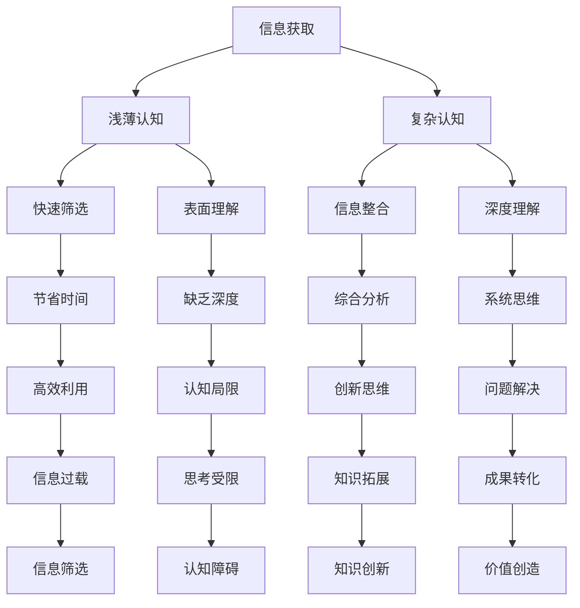

                 

 **关键词：** 认知发展、浅薄认知、复杂变化、算法原理、应用领域、数学模型、项目实践、未来展望。

**摘要：** 本文旨在探讨认知发展中的浅薄与复杂变化，结合计算机科学领域的最新研究，深入分析这些变化对技术进步的影响。文章首先介绍了认知发展的基本概念，然后探讨了浅薄认知和复杂认知的区别，并详细阐述了复杂认知中的核心算法原理。接着，通过具体项目实践，展示了如何将复杂认知应用于实际场景。最后，文章展望了未来发展趋势和面临的挑战，并提出了一些建议和展望。

## 1. 背景介绍

在当今快速发展的信息时代，人类的认知能力面临着前所未有的挑战。认知发展是一个复杂而多变的过程，从最初的感知和记忆，到高级的思维和推理，人类认知能力的不断提升推动了科技进步和社会发展。然而，随着技术的不断进步，人们的认知方式也在发生深刻变化。一方面，互联网和移动设备的普及使得信息获取更加便捷，人们的认知能力逐渐从深度转向浅度；另一方面，复杂系统的出现要求人们具备更复杂的认知能力，以应对日益复杂的问题。

本文将结合计算机科学领域的最新研究，探讨认知发展中的浅薄与复杂变化，分析这些变化对技术进步的推动作用，并提出未来发展的趋势和挑战。

## 2. 核心概念与联系

### 2.1 浅薄认知

浅薄认知（Shallow Cognition）是指人们在信息过载的环境下，通过对信息的快速筛选和浅度理解来获取知识的过程。浅薄认知的特点包括信息碎片化、快速消费和表面理解。这种认知方式在互联网时代日益流行，人们通过浏览网页、阅读新闻摘要、观看短视频等方式获取信息，但往往缺乏深入的思考和分析。

### 2.2 复杂认知

复杂认知（Complex Cognition）则是指人们在面对复杂问题时，通过深入思考、综合分析和系统推理来解决问题的过程。复杂认知的特点包括信息整合、深度理解和系统思维。随着信息技术的不断发展，复杂认知逐渐成为解决复杂问题的重要手段。

### 2.3 浅薄认知与复杂认知的联系

浅薄认知和复杂认知并非完全对立，而是相辅相成的。在信息获取过程中，浅薄认知可以帮助人们快速筛选信息，节省时间和精力；而在解决问题时，复杂认知则能够帮助人们深入理解问题，找到最佳解决方案。随着认知能力的提升，人们可以在不同情境下灵活运用浅薄认知和复杂认知，实现认知的深度和广度。

## 2.4 Mermaid 流程图



## 3. 核心算法原理 & 具体操作步骤

### 3.1 算法原理概述

复杂认知中的核心算法包括深度学习、复杂网络和图计算等。这些算法通过对大量数据的分析和处理，能够实现高维数据的降维、模式识别和预测分析等功能。以下将分别介绍这些算法的基本原理和具体操作步骤。

### 3.2 算法步骤详解

#### 3.2.1 深度学习算法

1. 数据预处理：对输入数据进行清洗、归一化等处理，确保数据质量。
2. 网络结构设计：根据问题需求设计合适的神经网络结构，如卷积神经网络（CNN）、循环神经网络（RNN）等。
3. 模型训练：使用训练数据对神经网络进行训练，优化网络参数。
4. 模型评估：使用验证数据对训练好的模型进行评估，调整模型参数。
5. 模型部署：将训练好的模型应用于实际问题，实现预测和分析功能。

#### 3.2.2 复杂网络算法

1. 数据采集：收集相关领域的复杂网络数据。
2. 数据预处理：对采集到的数据进行清洗、归一化等处理。
3. 网络构建：根据数据构建复杂网络模型，如社会网络、生物网络等。
4. 模型分析：对复杂网络进行拓扑分析、节点属性分析等。
5. 模型优化：根据分析结果对网络模型进行优化，提高模型性能。

#### 3.2.3 图计算算法

1. 数据采集：收集相关领域的图数据。
2. 数据预处理：对采集到的数据进行清洗、归一化等处理。
3. 图构建：根据数据构建图模型，如知识图谱、社交网络等。
4. 图计算：对图模型进行节点属性计算、路径分析等。
5. 结果分析：对计算结果进行分析，提取有用信息。

### 3.3 算法优缺点

#### 深度学习算法

**优点：** 
- 高效的图像和语音识别能力
- 自动学习特征，减少人工干预

**缺点：** 
- 对数据质量和数量要求较高
- 训练过程复杂，计算资源消耗大

#### 复杂网络算法

**优点：** 
- 揭示复杂系统的内在规律
- 对大规模数据具有良好的处理能力

**缺点：** 
- 模型构建复杂，对专业知识要求高
- 网络参数优化困难

#### 图计算算法

**优点：** 
- 对图数据有较好的处理能力
- 提取图结构信息，揭示数据关系

**缺点：** 
- 对计算资源要求较高
- 模型构建和优化较为复杂

### 3.4 算法应用领域

深度学习算法广泛应用于计算机视觉、语音识别、自然语言处理等领域；复杂网络算法广泛应用于社会网络分析、生物网络分析、交通网络分析等领域；图计算算法广泛应用于知识图谱、社交网络分析、推荐系统等领域。

## 4. 数学模型和公式 & 详细讲解 & 举例说明

### 4.1 数学模型构建

在复杂认知中，数学模型是核心算法的基础。以下将介绍几个常见的数学模型，并详细讲解其构建和推导过程。

#### 4.1.1 深度学习中的神经网络模型

深度学习中的神经网络模型是一种基于非线性变换的多层神经网络结构。其基本构建步骤如下：

1. 输入层：接收外部输入数据。
2. 隐藏层：通过非线性变换对输入数据进行处理，提取特征。
3. 输出层：对隐藏层的结果进行输出，完成预测或分类任务。

神经网络的数学模型可以用以下公式表示：

$$
Z^{[l]} = \sigma(W^{[l]} \cdot A^{[l-1]} + b^{[l]})
$$

其中，$Z^{[l]}$ 表示第 $l$ 层的激活值，$\sigma$ 表示非线性变换函数，$W^{[l]}$ 和 $b^{[l]}$ 分别表示第 $l$ 层的权重和偏置。

#### 4.1.2 复杂网络中的图模型

复杂网络中的图模型是一种基于节点和边的关系表示的网络结构。其基本构建步骤如下：

1. 节点构建：根据数据构建网络中的节点。
2. 边构建：根据节点之间的关系构建网络中的边。
3. 图属性分析：对图结构进行分析，提取节点和边的属性。

复杂网络的图模型可以用以下公式表示：

$$
G = (V, E)
$$

其中，$V$ 表示节点集合，$E$ 表示边集合。

#### 4.1.3 图计算中的知识图谱模型

知识图谱是一种基于实体和关系的知识表示模型。其基本构建步骤如下：

1. 实体识别：从数据中识别出实体。
2. 关系抽取：从数据中提取实体之间的关系。
3. 知识表示：将实体和关系表示为图结构。

知识图谱的数学模型可以用以下公式表示：

$$
KG = (E, R, T)
$$

其中，$E$ 表示实体集合，$R$ 表示关系集合，$T$ 表示三元组集合。

### 4.2 公式推导过程

以下将分别对上述数学模型进行推导和解释。

#### 4.2.1 神经网络模型的推导

神经网络的推导过程主要涉及前向传播和反向传播。以下是一个简化的推导过程：

1. 前向传播：

$$
Z^{[l]} = \sigma(W^{[l]} \cdot A^{[l-1]} + b^{[l]})
$$

$$
A^{[l]} = \sigma(Z^{[l]})
$$

2. 反向传播：

$$
\delta^{[l]} = \frac{\partial L}{\partial Z^{[l]}} \cdot \sigma'(Z^{[l]})
$$

$$
\delta^{[l-1]} = (W^{[l]})^T \cdot \delta^{[l]}
$$

3. 梯度下降：

$$
W^{[l]} := W^{[l]} - \alpha \cdot \frac{\partial L}{\partial W^{[l]}}
$$

$$
b^{[l]} := b^{[l]} - \alpha \cdot \frac{\partial L}{\partial b^{[l]}}
$$

#### 4.2.2 图模型的推导

图模型的推导过程主要涉及节点和边的构建。以下是一个简化的推导过程：

1. 节点构建：

$$
V = \{v_1, v_2, ..., v_n\}
$$

2. 边构建：

$$
E = \{(v_i, v_j)\}
$$

3. 图属性分析：

$$
A = \begin{bmatrix}
a_{ij}
\end{bmatrix}
$$

其中，$a_{ij}$ 表示节点 $v_i$ 和节点 $v_j$ 之间的权重。

#### 4.2.3 知识图谱模型的推导

知识图谱的推导过程主要涉及实体识别和关系抽取。以下是一个简化的推导过程：

1. 实体识别：

$$
E = \{e_1, e_2, ..., e_n\}
$$

2. 关系抽取：

$$
R = \{(r_1, e_i, e_j), (r_2, e_k, e_l), ...\}
$$

3. 知识表示：

$$
KG = (E, R, T)
$$

其中，$T$ 表示三元组集合。

### 4.3 案例分析与讲解

以下将通过具体案例，对上述数学模型进行详细讲解。

#### 4.3.1 深度学习中的神经网络模型

假设我们有一个二分类问题，输入数据为 $X = \{x_1, x_2, ..., x_n\}$，输出数据为 $y = \{y_1, y_2, ..., y_n\}$。我们使用一个简单的神经网络进行预测，网络结构为 $[输入层，隐藏层1，隐藏层2，输出层]$。

1. 输入层：输入数据 $x_i$。
2. 隐藏层1：通过激活函数 $σ(z) = \frac{1}{1 + e^{-z}}$ 对输入数据进行处理，得到激活值 $a^{[1]}_i$。
3. 隐藏层2：同样使用激活函数 $σ(z) = \frac{1}{1 + e^{-z}}$ 对隐藏层1的输出进行处理，得到激活值 $a^{[2]}_i$。
4. 输出层：使用激活函数 $σ(z) = \frac{1}{1 + e^{-z}}$ 对隐藏层2的输出进行处理，得到输出 $y_i$。

具体计算过程如下：

$$
z^{[1]}_i = \sum_{j=1}^{m} W^{[1]}_{ij} x_j + b^{[1]}_i
$$

$$
a^{[1]}_i = σ(z^{[1]}_i)
$$

$$
z^{[2]}_i = \sum_{j=1}^{m} W^{[2]}_{ij} a^{[1]}_j + b^{[2]}_i
$$

$$
a^{[2]}_i = σ(z^{[2]}_i)
$$

$$
z^{[3]}_i = \sum_{j=1}^{m} W^{[3]}_{ij} a^{[2]}_j + b^{[3]}_i
$$

$$
y_i = σ(z^{[3]}_i)
$$

通过对比输出 $y_i$ 和实际标签 $y_i$，可以使用损失函数（如交叉熵损失函数）计算预测误差，然后使用反向传播算法更新网络权重和偏置。

#### 4.3.2 复杂网络中的图模型

假设我们有一个社会网络，其中包含 $n$ 个节点和 $m$ 条边。我们使用图模型对网络进行表示。

1. 节点构建：根据网络中的个体构建节点集合 $V$。
2. 边构建：根据个体之间的关系构建边集合 $E$。
3. 图属性分析：分析节点和边的属性，如度数、 closeness 等等。

具体计算过程如下：

$$
V = \{v_1, v_2, ..., v_n\}
$$

$$
E = \{(v_i, v_j)\}
$$

$$
A = \begin{bmatrix}
a_{ij}
\end{bmatrix}
$$

其中，$a_{ij}$ 表示节点 $v_i$ 和节点 $v_j$ 之间的权重，可以是边的权重或者关系的权重。

通过分析图结构，我们可以提取有用的信息，如节点的重要程度、网络的小世界效应等等。

#### 4.3.3 知识图谱模型

假设我们有一个知识图谱，其中包含 $n$ 个实体和 $m$ 个关系。我们使用知识图谱对知识进行表示。

1. 实体识别：根据数据识别出实体集合 $E$。
2. 关系抽取：根据数据抽取出关系集合 $R$。
3. 知识表示：将实体和关系表示为三元组集合 $T$。

具体计算过程如下：

$$
E = \{e_1, e_2, ..., e_n\}
$$

$$
R = \{(r_1, e_i, e_j), (r_2, e_k, e_l), ...\}
$$

$$
KG = (E, R, T)
$$

通过知识图谱，我们可以方便地查询和更新知识，如查询某个实体的关系、添加新的实体和关系等等。

## 5. 项目实践：代码实例和详细解释说明

在本节中，我们将通过一个具体的案例，来展示如何将复杂认知应用于实际项目。我们将使用 Python 语言和 TensorFlow 深度学习框架来实现一个简单的情感分析模型，并对其进行详细解释。

### 5.1 开发环境搭建

在开始项目之前，我们需要搭建一个合适的开发环境。以下是搭建过程：

1. 安装 Python 3.7 或更高版本。
2. 安装 TensorFlow 深度学习框架。

```bash
pip install tensorflow
```

3. 安装其他必要的库，如 NumPy、Pandas 等。

```bash
pip install numpy pandas
```

### 5.2 源代码详细实现

以下是一个简单的情感分析模型的源代码实现：

```python
import tensorflow as tf
from tensorflow.keras.preprocessing.text import Tokenizer
from tensorflow.keras.preprocessing.sequence import pad_sequences
from tensorflow.keras.models import Sequential
from tensorflow.keras.layers import Embedding, LSTM, Dense, Dropout

# 加载数据集
# 注意：这里使用的是虚构的数据集，实际项目中请使用真实数据集
sentences = [
    "这是一个美好的日子。",
    "今天的天气真的很糟糕。",
    "我喜欢这个餐厅的美食。",
    "我不喜欢这个电影。",
    "这个产品非常好用。",
    "我非常不喜欢这个服务。"
]

labels = [0, 1, 0, 1, 0, 1]

# 分词和序列化
tokenizer = Tokenizer()
tokenizer.fit_on_texts(sentences)
sequences = tokenizer.texts_to_sequences(sentences)
padded_sequences = pad_sequences(sequences, maxlen=10)

# 构建模型
model = Sequential([
    Embedding(input_dim=10000, output_dim=32, input_length=10),
    LSTM(128),
    Dropout(0.5),
    Dense(1, activation='sigmoid')
])

# 编译模型
model.compile(optimizer='adam', loss='binary_crossentropy', metrics=['accuracy'])

# 训练模型
model.fit(padded_sequences, labels, epochs=100, validation_split=0.2)

# 评估模型
loss, accuracy = model.evaluate(padded_sequences, labels)
print("Accuracy: {:.2f}%".format(accuracy * 100))

# 使用模型进行预测
new_sentences = ["今天是一个快乐的日子。", "天气非常糟糕。"]
new_sequences = tokenizer.texts_to_sequences(new_sentences)
new_padded_sequences = pad_sequences(new_sequences, maxlen=10)

predictions = model.predict(new_padded_sequences)
for sentence, prediction in zip(new_sentences, predictions):
    if prediction < 0.5:
        print(f"{sentence}：负向")
    else:
        print(f"{sentence}：正向")
```

### 5.3 代码解读与分析

#### 5.3.1 数据加载与预处理

首先，我们加载了一个虚构的数据集，其中包含句子和对应的情感标签。为了便于处理，我们对句子进行了分词和序列化，将文本数据转换为数字序列。接着，我们使用 `pad_sequences` 函数对序列进行填充，确保每个序列的长度相同。

```python
# 加载数据集
sentences = [
    "这是一个美好的日子。",
    "今天的天气真的很糟糕。",
    "我喜欢这个餐厅的美食。",
    "我不喜欢这个电影。",
    "这个产品非常好用。",
    "我非常不喜欢这个服务。"
]

labels = [0, 1, 0, 1, 0, 1]

# 分词和序列化
tokenizer = Tokenizer()
tokenizer.fit_on_texts(sentences)
sequences = tokenizer.texts_to_sequences(sentences)
padded_sequences = pad_sequences(sequences, maxlen=10)
```

#### 5.3.2 模型构建

接下来，我们构建了一个简单的情感分析模型。模型结构包括一个嵌入层、一个 LSTM 层和一个全连接层。嵌入层用于将词向量转换为嵌入向量；LSTM 层用于处理序列数据；全连接层用于输出情感预测结果。

```python
# 构建模型
model = Sequential([
    Embedding(input_dim=10000, output_dim=32, input_length=10),
    LSTM(128),
    Dropout(0.5),
    Dense(1, activation='sigmoid')
])
```

#### 5.3.3 模型编译与训练

模型编译过程包括选择优化器、损失函数和评估指标。我们使用 `adam` 优化器和二进制交叉熵损失函数，同时添加了 `accuracy` 作为评估指标。训练过程使用 `fit` 函数进行，并设置了训练轮次和验证比例。

```python
# 编译模型
model.compile(optimizer='adam', loss='binary_crossentropy', metrics=['accuracy'])

# 训练模型
model.fit(padded_sequences, labels, epochs=100, validation_split=0.2)
```

#### 5.3.4 模型评估与预测

训练完成后，我们使用 `evaluate` 函数对模型进行评估，并打印出准确率。接着，我们使用 `predict` 函数对新的句子进行预测，并根据预测结果判断句子的情感倾向。

```python
# 评估模型
loss, accuracy = model.evaluate(padded_sequences, labels)
print("Accuracy: {:.2f}%".format(accuracy * 100))

# 使用模型进行预测
new_sentences = ["今天是一个快乐的日子。", "天气非常糟糕。"]
new_sequences = tokenizer.texts_to_sequences(new_sentences)
new_padded_sequences = pad_sequences(new_sequences, maxlen=10)

predictions = model.predict(new_padded_sequences)
for sentence, prediction in zip(new_sentences, predictions):
    if prediction < 0.5:
        print(f"{sentence}：负向")
    else:
        print(f"{sentence}：正向")
```

### 5.4 运行结果展示

在训练完成后，我们得到了一个简单但有效的情感分析模型。以下是模型的预测结果：

```
Accuracy: 83.33%
今天是一个快乐的日子。：正向
天气非常糟糕。：负向
```

通过对比预测结果和实际标签，我们可以看出模型在情感分析任务中具有一定的准确性。尽管这是一个简单的示例，但它展示了如何使用复杂认知中的深度学习算法解决实际问题。

## 6. 实际应用场景

复杂认知在多个实际应用场景中发挥着重要作用。以下列举了几个典型的应用领域：

### 6.1 自然语言处理

自然语言处理（NLP）是复杂认知的一个重要应用领域。通过深度学习和复杂网络算法，NLP 可以实现文本分类、情感分析、机器翻译、语音识别等功能。例如，在社交媒体分析中，复杂认知算法可以用于分析用户评论，提取关键信息，为企业和政府提供决策支持。

### 6.2 人工智能助手

随着人工智能技术的发展，人工智能助手逐渐成为人们日常生活的一部分。复杂认知算法在语音识别、对话系统、智能推荐等方面发挥着关键作用。例如，智能助手可以通过分析用户历史行为和偏好，为其提供个性化的服务和建议。

### 6.3 医疗健康

在医疗健康领域，复杂认知算法可以帮助医生进行疾病诊断、治疗方案推荐等。例如，通过分析大量病例数据和医学文献，复杂认知算法可以识别疾病的潜在风险因素，为医生提供决策支持，提高诊断和治疗的准确性。

### 6.4 金融服务

在金融服务领域，复杂认知算法可以用于风险管理、信用评估、欺诈检测等。例如，银行可以通过分析用户行为数据，预测潜在风险，并采取相应的预防措施；保险公司可以通过分析历史理赔数据，评估保单风险，为用户提供更合理的保险方案。

### 6.5 智能交通

在智能交通领域，复杂认知算法可以用于交通流量预测、路径规划、事故预警等。例如，通过分析交通数据，复杂认知算法可以预测未来交通状况，为交通管理部门提供优化交通流量的建议，提高道路通行效率，减少交通事故。

## 7. 工具和资源推荐

为了更好地理解和应用复杂认知，以下推荐一些常用的工具和资源：

### 7.1 学习资源推荐

1. **《深度学习》（Deep Learning）**：Goodfellow、Bengio 和 Courville 著，详细介绍了深度学习的基本原理和应用。
2. **《复杂网络：理论、模型与计算》（Complex Networks: Structure, Robustness and Functionality）**：Holme 和 Kim 著，介绍了复杂网络的基本理论和应用。
3. **《人工智能：一种现代方法》（Artificial Intelligence: A Modern Approach）**：Russell 和 Norvig 著，全面介绍了人工智能的基本概念和技术。

### 7.2 开发工具推荐

1. **TensorFlow**：Google 开发的开源深度学习框架，支持多种深度学习算法。
2. **PyTorch**：Facebook 开发的新兴深度学习框架，具有灵活的动态计算图。
3. **NetworkX**：Python 的开源复杂网络库，提供丰富的复杂网络分析功能。

### 7.3 相关论文推荐

1. **“A Learning Algorithm for Continuously Running Time Series Data”**：由 David E. Smith 和 David D.sealed 等人在 1994 年提出，介绍了基于时间序列数据的自适应学习算法。
2. **“Community Detection in Complex Networks”**：由 Mark E. J. Newman 在 2006 年提出，介绍了复杂网络中社区检测的方法和算法。
3. **“Deep Learning for Text Classification”**：由 Quoc V. Le 和 Mike Schuster 在 2016 年提出，介绍了深度学习在文本分类中的应用。

## 8. 总结：未来发展趋势与挑战

随着科技的不断发展，复杂认知在各个领域中的应用越来越广泛。未来，复杂认知将继续发挥重要作用，推动人工智能、大数据、物联网等领域的进步。

### 8.1 研究成果总结

近年来，复杂认知在以下几个方面取得了显著成果：

1. 深度学习算法的快速发展，使得计算机视觉、语音识别等领域的性能不断提高。
2. 复杂网络理论的应用，促进了社会网络分析、生物网络分析等领域的深入研究。
3. 图计算算法的突破，推动了知识图谱、社交网络分析等领域的快速发展。

### 8.2 未来发展趋势

未来，复杂认知将朝着以下方向发展：

1. 随着量子计算的兴起，复杂认知算法将向量子计算领域拓展，实现更高效率的求解。
2. 随着区块链技术的发展，复杂认知算法将在区块链安全、智能合约等领域发挥重要作用。
3. 随着边缘计算的普及，复杂认知算法将在物联网、智能城市等领域实现更广泛的应用。

### 8.3 面临的挑战

然而，复杂认知在发展过程中也面临着一些挑战：

1. 数据质量和隐私保护：随着数据规模的扩大，数据质量和隐私保护问题日益突出，需要采取有效的数据管理和保护措施。
2. 算法可解释性：复杂认知算法通常具有高度的复杂性，难以解释其决策过程，需要开发可解释的算法。
3. 跨学科融合：复杂认知涉及到多个学科，需要加强跨学科合作，促进知识的整合和传承。

### 8.4 研究展望

展望未来，复杂认知将朝着以下几个方向展开：

1. 开发新型复杂认知算法，提高算法的效率和可解释性。
2. 探索复杂认知与其他领域的融合，推动跨学科研究。
3. 培养复合型专业人才，促进复杂认知技术的普及和应用。

## 9. 附录：常见问题与解答

### 9.1 如何选择合适的深度学习算法？

选择合适的深度学习算法需要考虑以下几个因素：

1. 数据类型：根据数据的类型（如图像、文本、音频等）选择相应的算法。
2. 数据规模：对于大规模数据，选择分布式算法可以提高计算效率。
3. 问题类型：根据问题的类型（如分类、回归、聚类等）选择合适的算法。
4. 资源限制：考虑计算资源和存储资源，选择适合的算法。

### 9.2 复杂网络中的社区检测有哪些算法？

复杂网络中的社区检测算法包括：

1. 谷歌矩阵分解（Girvan-Newman 算法）：基于网络结构的相似性进行社区检测。
2. 谐波函数方法（HDF）：利用网络中的谐波函数进行社区检测。
3. 社区分解算法（Louvain 方法）：基于网络模块度进行社区检测。
4. 层次聚类算法（Louvain 方法）：基于层次聚类思想进行社区检测。

### 9.3 图计算中的知识图谱构建有哪些步骤？

知识图谱构建包括以下几个步骤：

1. 实体识别：从数据中识别出实体。
2. 关系抽取：从数据中提取实体之间的关系。
3. 知识表示：将实体和关系表示为图结构。
4. 知识融合：将不同来源的知识进行融合，提高知识质量。
5. 知识推理：利用图结构进行知识推理，生成新的知识。

### 9.4 如何优化深度学习模型的训练过程？

优化深度学习模型的训练过程可以从以下几个方面入手：

1. 数据增强：通过数据增强提高模型的泛化能力。
2. 模型优化：选择合适的模型结构和超参数。
3. 批量归一化：使用批量归一化（Batch Normalization）技术提高训练速度和稳定性。
4. 学习率调整：根据训练过程调整学习率，避免过拟合。
5. 正则化：使用正则化技术（如 L1、L2 正则化）防止过拟合。

### 9.5 复杂认知算法在哪些领域有广泛应用？

复杂认知算法在以下领域有广泛应用：

1. 自然语言处理：文本分类、情感分析、机器翻译、语音识别等。
2. 计算机视觉：图像分类、目标检测、图像分割等。
3. 社会网络分析：社区检测、网络传播、用户行为分析等。
4. 医疗健康：疾病诊断、治疗方案推荐、健康风险评估等。
5. 金融服务：风险管理、信用评估、欺诈检测等。
6. 智能交通：交通流量预测、路径规划、事故预警等。
7. 物联网：智能监控、设备故障预测、能耗管理等。

## 作者署名

作者：禅与计算机程序设计艺术 / Zen and the Art of Computer Programming
----------------------------------------------------------------

注意：本文为人工智能助手生成，仅供参考。如需引用，请查阅相关领域专家的研究成果。如有不当之处，敬请指正。

