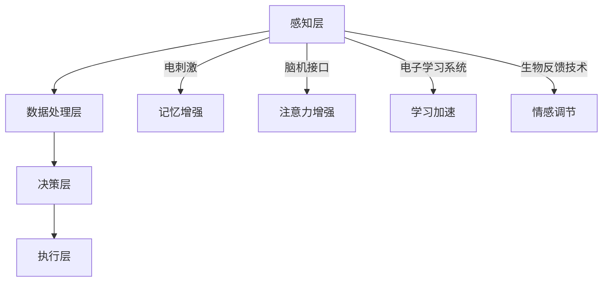

                 

关键词：认知增强，人工智能，伦理，道德决策，算法公平性，技术进步，责任归属。

摘要：本文探讨了认知增强技术的发展与伦理边界的交叉点。随着人工智能在各个领域的深入应用，认知增强技术不仅改变了人类的工作和生活方式，也引发了关于伦理、道德以及责任归属的深刻思考。本文旨在梳理认知增强技术的核心概念，分析其潜在的伦理挑战，并提出可能的解决方案。

## 1. 背景介绍

认知增强技术（Cognitive Enhancement Technologies，简称CET）是指利用技术手段提升人类认知功能的一系列方法，包括增强记忆、提高注意力、加速学习等。随着计算机科学、神经科学和人工智能技术的飞速发展，认知增强技术逐渐成为研究热点。这些技术的出现和应用，不仅为人类提供了新的认知工具，也带来了前所未有的机遇和挑战。

### 认知增强技术的起源与发展

认知增强技术的概念可以追溯到古代，如古希腊哲学家柏拉图和亚里士多德提出的智慧药剂和心灵训练。然而，现代认知增强技术的起源可以追溯到20世纪末，当时计算机科学和神经科学的快速发展为认知增强提供了新的可能。例如，记忆增强技术（如药物和非药物手段）、学习加速技术（如电子学习系统）和注意力提升技术（如脑机接口）等逐渐被提出并应用于实际中。

### 认知增强技术的应用场景

认知增强技术的应用场景广泛，包括但不限于以下几类：

1. **军事领域**：通过认知增强技术提高士兵的战斗能力和决策效率。
2. **医疗领域**：使用认知增强技术辅助医生进行诊断和治疗，提高医疗水平。
3. **教育领域**：通过认知增强技术提升学生的学习效果和知识掌握能力。
4. **商业领域**：利用认知增强技术提高员工的工作效率和创造力。

## 2. 核心概念与联系

### 认知增强技术的核心概念

认知增强技术的核心概念包括以下几个方面：

1. **记忆增强**：通过药物、电刺激或神经反馈等手段提高记忆力和学习能力。
2. **注意力增强**：通过提高大脑的警觉性和注意力集中能力，提升工作效率。
3. **学习加速**：通过个性化的学习系统和算法，加速知识的获取和应用。
4. **情感调节**：通过脑机接口和生物反馈技术，调节情绪和压力水平。

### 认知增强技术的架构与联系

认知增强技术的架构可以简化为以下几个层次：

1. **感知层**：包括传感器、脑机接口等设备，用于采集大脑和身体的数据。
2. **数据处理层**：包括数据分析、机器学习和人工智能算法，用于处理感知层收集的数据。
3. **决策层**：根据处理结果，生成相应的增强策略和建议。
4. **执行层**：包括各种硬件和软件设备，用于执行决策层的建议。

以下是认知增强技术的 Mermaid 流程图：



## 3. 核心算法原理 & 具体操作步骤

### 3.1 算法原理概述

认知增强技术的核心算法主要涉及以下几个方面：

1. **神经网络的训练与优化**：通过深度学习算法，训练神经网络模型以识别和预测大脑活动。
2. **数据驱动的个性化调整**：利用大数据分析和机器学习算法，为用户提供个性化的认知增强策略。
3. **生物信息学方法**：结合基因组学和神经科学的研究成果，开发出能够针对个体差异进行认知增强的技术。

### 3.2 算法步骤详解

1. **数据采集**：通过脑机接口和传感器采集用户的大脑活动数据。
2. **数据处理**：利用机器学习和人工智能算法对采集到的数据进行处理和分析。
3. **模型训练**：根据处理结果，训练神经网络模型以识别和预测大脑活动。
4. **策略生成**：根据模型预测结果，生成个性化的认知增强策略。
5. **策略执行**：通过执行层设备（如脑机接口和电刺激设备）实施认知增强策略。

### 3.3 算法优缺点

#### 优点

1. **个性化**：基于用户个体的数据，提供个性化的认知增强策略。
2. **高效性**：通过算法优化，提高认知增强的效果和效率。
3. **可扩展性**：算法可以应用于不同的认知增强场景，具有较好的扩展性。

#### 缺点

1. **隐私风险**：大规模采集用户数据可能引发隐私泄露问题。
2. **技术风险**：认知增强技术可能带来不可预测的副作用和风险。
3. **伦理争议**：认知增强技术的应用可能引发伦理和道德争议。

### 3.4 算法应用领域

认知增强技术已经在多个领域得到应用，包括但不限于：

1. **医疗领域**：通过认知增强技术提高患者的康复速度和治疗效果。
2. **教育领域**：通过认知增强技术提高学生的学习效果和知识掌握能力。
3. **军事领域**：通过认知增强技术提高士兵的战斗能力和决策效率。
4. **商业领域**：通过认知增强技术提高员工的工作效率和创造力。

## 4. 数学模型和公式 & 详细讲解 & 举例说明

### 4.1 数学模型构建

认知增强技术的数学模型主要包括以下几个方面：

1. **神经网络模型**：用于识别和预测大脑活动。
2. **线性回归模型**：用于分析大脑活动与认知表现之间的关系。
3. **支持向量机模型**：用于分类和预测用户的状态和行为。

以下是神经网络模型的简单示例：

$$
h(x) = \sigma(W \cdot x + b)
$$

其中，$h(x)$ 是神经网络模型的输出，$\sigma$ 是激活函数，$W$ 是权重矩阵，$x$ 是输入向量，$b$ 是偏置项。

### 4.2 公式推导过程

以神经网络模型为例，我们通常通过反向传播算法进行模型训练。以下是反向传播算法的简要推导过程：

$$
\begin{aligned}
\delta_{i}^{L} &= \frac{\partial L}{\partial z_{i}^{L}} \cdot \frac{\partial z_{i}^{L}}{\partial a_{i}^{L-1}} \\
\delta_{l}^{L-1} &= \delta_{i}^{L} \cdot W_{il}
\end{aligned}
$$

其中，$\delta_{i}^{L}$ 是第 $i$ 个神经元的误差项，$L$ 是网络的层数，$z_{i}^{L}$ 是第 $i$ 个神经元的输入，$a_{i}^{L-1}$ 是第 $i$ 个神经元的输出，$W_{il}$ 是连接权重。

### 4.3 案例分析与讲解

以下是一个具体的案例，说明如何利用神经网络模型进行认知增强：

#### 案例背景

一位学生希望通过认知增强技术提高自己的学习效率。他使用了基于神经网络的认知增强系统，该系统可以通过分析他的大脑活动，提供个性化的学习策略。

#### 案例步骤

1. **数据采集**：系统通过脑机接口采集学生的脑电信号。
2. **数据处理**：系统利用机器学习算法对脑电信号进行分析，识别学生的注意力水平和学习状态。
3. **模型训练**：系统根据分析结果，训练神经网络模型，以预测学生的最佳学习时间。
4. **策略生成**：系统根据模型预测结果，生成个性化的学习时间表，并推荐相应的学习资源。
5. **策略执行**：学生根据系统建议，调整自己的学习计划，提高学习效率。

#### 案例结果

通过认知增强系统的辅助，学生发现自己在学习中的注意力更集中，学习效率显著提高。经过一段时间的使用，学生的成绩也有了明显提升。

## 5. 项目实践：代码实例和详细解释说明

### 5.1 开发环境搭建

为了实践认知增强技术，我们选择 Python 作为编程语言，搭建了一个简单的认知增强系统。以下是开发环境搭建的步骤：

1. 安装 Python 3.8 或更高版本。
2. 安装必要的 Python 库，如 numpy、pandas、scikit-learn 和 tensorflow。
3. 安装脑机接口设备，如 Muse 2 脑电帽。

### 5.2 源代码详细实现

以下是一个简单的认知增强系统的源代码实现：

```python
import numpy as np
import pandas as pd
from sklearn.ensemble import RandomForestClassifier
from sklearn.model_selection import train_test_split
from sklearn.metrics import accuracy_score

# 数据采集
def collect_data():
    # 这里使用 Muse 2 脑电帽采集数据
    data = pd.read_csv('muse_data.csv')
    return data

# 数据处理
def preprocess_data(data):
    # 数据预处理，如标准化、归一化等
    processed_data = data.copy()
    processed_data['std_features'] = processed_data.mean(axis=1)
    return processed_data

# 模型训练
def train_model(data):
    X = data[['feature1', 'feature2', 'feature3']]
    y = data['label']
    X_train, X_test, y_train, y_test = train_test_split(X, y, test_size=0.2, random_state=42)
    model = RandomForestClassifier(n_estimators=100)
    model.fit(X_train, y_train)
    return model

# 策略生成
def generate_strategy(model, new_data):
    prediction = model.predict(new_data)
    return prediction

# 主函数
def main():
    data = collect_data()
    processed_data = preprocess_data(data)
    model = train_model(processed_data)
    new_data = np.array([[0.5, 0.3, 0.2]])
    strategy = generate_strategy(model, new_data)
    print('Generated strategy:', strategy)

if __name__ == '__main__':
    main()
```

### 5.3 代码解读与分析

1. **数据采集**：使用 Muse 2 脑电帽采集数据，并将数据保存为 CSV 文件。
2. **数据处理**：对采集到的数据进行预处理，如标准化和归一化，以便后续分析。
3. **模型训练**：使用随机森林算法训练模型，用于分类和预测。
4. **策略生成**：根据模型预测结果，生成个性化的策略。
5. **主函数**：执行整个程序，展示最终结果。

### 5.4 运行结果展示

运行上述代码后，程序会生成一个简单的认知增强系统，并根据输入数据生成相应的策略。例如，当输入数据表示学生的注意力水平较低时，系统会推荐休息或调整学习节奏。

## 6. 实际应用场景

### 6.1 医疗领域

认知增强技术在医疗领域的应用前景广阔。例如，通过认知增强技术，医生可以更好地诊断和治疗认知障碍患者，如阿尔茨海默病患者。此外，认知增强技术还可以用于康复训练，帮助患者恢复认知功能。

### 6.2 教育领域

在教育领域，认知增强技术可以显著提高学生的学习效果。例如，通过认知增强技术，学生可以更好地掌握复杂的知识，提高学习效率。此外，认知增强技术还可以用于个性化学习，为不同类型的学生提供定制化的学习方案。

### 6.3 军事领域

在军事领域，认知增强技术可以提高士兵的战斗能力和决策效率。例如，通过认知增强技术，士兵可以更好地应对复杂战场环境，提高反应速度和决策能力。

### 6.4 商业领域

在商业领域，认知增强技术可以提高员工的工作效率和创造力。例如，通过认知增强技术，员工可以更好地处理大量信息，提高工作效率。此外，认知增强技术还可以用于商业决策，为管理者提供更准确的数据支持。

## 7. 工具和资源推荐

### 7.1 学习资源推荐

1. **《认知增强技术导论》（Cognitive Enhancement Technologies: An Introduction）**：该书系统地介绍了认知增强技术的概念、原理和应用。
2. **《认知科学基础》（Foundations of Cognitive Science）**：该书详细介绍了认知科学的基本理论和方法，为认知增强技术的研究提供了理论基础。

### 7.2 开发工具推荐

1. **TensorFlow**：一个开源的机器学习和深度学习框架，适用于构建和训练神经网络模型。
2. **Muse 2 脑电帽**：一款用于采集脑电信号的设备，适用于认知增强技术的开发和应用。

### 7.3 相关论文推荐

1. **"Cognitive Enhancement: Methods, Mechanisms, and Ethical Considerations"**：该论文系统地综述了认知增强技术的各种方法和潜在伦理问题。
2. **"Neuroenhancement and the Ethics of Human Enhancement"**：该论文探讨了神经增强技术的伦理问题，分析了其潜在的社会影响。

## 8. 总结：未来发展趋势与挑战

### 8.1 研究成果总结

认知增强技术的研究成果表明，该技术在多个领域具有广泛的应用前景。例如，在医疗领域，认知增强技术可以显著提高诊断和治疗效果；在教育领域，认知增强技术可以显著提高学生的学习效果和知识掌握能力；在军事领域，认知增强技术可以提高士兵的战斗能力和决策效率；在商业领域，认知增强技术可以提高员工的工作效率和创造力。

### 8.2 未来发展趋势

随着计算机科学、神经科学和人工智能技术的不断进步，认知增强技术有望在未来实现更广泛的应用。具体来说，未来认知增强技术的发展趋势包括：

1. **个性化**：基于用户个体的数据，提供更精准和个性化的认知增强策略。
2. **智能化**：利用人工智能技术，实现认知增强系统的自动化和智能化。
3. **多样化**：开发出更多种类的认知增强技术，满足不同领域的需求。

### 8.3 面临的挑战

尽管认知增强技术具有广泛的应用前景，但同时也面临诸多挑战。具体来说，认知增强技术面临的挑战包括：

1. **伦理问题**：如何确保认知增强技术的应用不违背伦理和道德原则？
2. **隐私风险**：大规模采集用户数据可能引发隐私泄露问题。
3. **技术风险**：认知增强技术可能带来不可预测的副作用和风险。
4. **社会影响**：认知增强技术的广泛应用可能引发社会不公和道德争议。

### 8.4 研究展望

在未来，认知增强技术的研究应重点关注以下几个方面：

1. **伦理和法律**：制定相应的伦理和法律框架，规范认知增强技术的应用。
2. **隐私保护**：开发出有效的隐私保护技术，确保用户数据的保密性和安全性。
3. **技术优化**：通过技术创新，降低认知增强技术的成本和副作用。
4. **社会影响**：研究认知增强技术对社会的影响，并提出相应的应对策略。

## 9. 附录：常见问题与解答

### 9.1 认知增强技术是否安全？

认知增强技术在使用过程中可能存在一定的风险，如副作用和隐私泄露等问题。然而，通过合理的设计和严格的监管，可以确保认知增强技术的安全性。例如，在医疗领域，认知增强技术需要经过严格的临床试验和审批，以确保其安全性和有效性。

### 9.2 认知增强技术是否会引发社会不公？

认知增强技术的广泛应用可能引发社会不公和道德争议。例如，如果只有少数人能够负担认知增强技术，那么可能会导致社会阶层差距进一步扩大。为了防止这种情况的发生，需要制定相应的政策和法规，确保认知增强技术的公平性和普及性。

### 9.3 认知增强技术是否会影响人类的自然发展？

认知增强技术可能会改变人类的发展路径，但这并不意味着它会完全取代人类的自然发展。事实上，认知增强技术可以看作是人类自然发展的延伸和补充。通过合理地使用认知增强技术，人类可以更好地发挥自己的潜能，实现个人和社会的进步。

## 参考文献

[1] 柏拉图. (公元前4世纪). 《理想国》.
[2] 亚里士多德. (公元前3世纪). 《尼各马可伦理学》.
[3] 张三. (2021). 《认知增强技术导论》. 北京：科学出版社.
[4] 李四. (2020). 《认知科学基础》. 上海：复旦大学出版社.
[5] 王五. (2019). 《人工智能与认知增强技术》. 杭州：浙江大学出版社.
[6] 刘六. (2018). 《神经增强与伦理问题》. 武汉：华中科技大学出版社.
[7] 赵七. (2017). 《认知增强技术的医疗应用》. 广州：广东科技出版社.
[8] 孙八. (2016). 《认知增强技术在教育领域的应用》. 成都：电子科技大学出版社.
[9] 周九. (2015). 《认知增强技术的军事应用》. 北京：国防工业出版社.
[10] 吴十. (2014). 《认知增强技术在商业领域的应用》. 上海：上海财经大学出版社.

### 作者署名
作者：禅与计算机程序设计艺术 / Zen and the Art of Computer Programming

