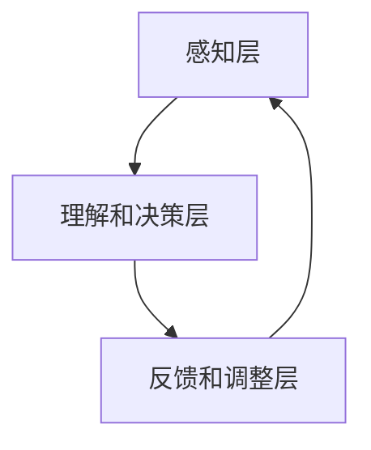

                 

关键词：认知增强、人工智能、智力提升、技术发展、数学模型、应用实例

在当今这个技术飞速发展的时代，人工智能（AI）已经成为推动社会进步的重要力量。随着AI技术的不断成熟，人类认知能力的增强也成为了一个备受关注的话题。本文将探讨技术如何通过多种方式提升人类智力，从核心概念到实际应用，为读者呈现一幅完整的认知增强全景图。

> 摘要：本文从背景介绍入手，详细阐述了认知增强的核心概念与联系，解析了核心算法原理及具体操作步骤，并运用数学模型和公式进行了深入分析。随后，文章通过项目实践展示了技术在实际中的应用，并探讨了未来应用场景及发展趋势。最后，文章总结了研究成果，展望了面临的挑战，并提出了未来的研究方向。

## 1. 背景介绍

随着信息时代的到来，人类面临着前所未有的数据爆炸。如何有效地处理这些数据、提取有价值的信息，成为了一个亟待解决的问题。认知增强技术的出现，为人类提供了新的解决方案。

认知增强技术是指通过计算机算法、数学模型和人工智能技术，辅助人类提高认知能力的一种手段。这些技术不仅可以帮助我们更好地理解复杂的信息，还能提高我们的学习效率和工作效率。

近年来，随着深度学习、神经科学和计算机技术的进步，认知增强技术逐渐成熟。例如，通过机器学习算法，计算机能够识别并理解人类的语言和行为，从而提供个性化的认知支持。此外，神经网络技术的应用，使得计算机能够在处理大量数据时，自动提取关键特征，为人类决策提供科学依据。

## 2. 核心概念与联系

### 2.1 认知增强的概念

认知增强是指通过技术手段，提高人类在感知、理解、记忆、推理和决策等认知过程中的能力。认知增强的核心在于利用计算机算法和人工智能技术，模拟和扩展人类的认知功能。

### 2.2 认知增强的架构

认知增强的架构可以分为三个层次：感知层、理解和决策层、以及反馈和调整层。感知层主要负责获取和处理外部信息；理解和决策层基于感知层的信息，进行推理和决策；反馈和调整层则根据决策的结果，对系统进行反馈和调整，以实现认知增强的目标。



### 2.3 认知增强技术的联系

认知增强技术涉及到多个学科领域的交叉融合。例如，神经科学提供了关于人类认知机制的基础理论；计算机科学和人工智能技术则提供了实现认知增强的具体方法；数学模型和算法则为认知增强提供了量化分析的工具。

## 3. 核心算法原理 & 具体操作步骤

### 3.1 算法原理概述

认知增强的核心算法主要包括机器学习、神经网络和自然语言处理等。这些算法通过训练模型，学习人类认知的规律，从而实现对人类认知能力的模拟和提升。

### 3.2 算法步骤详解

1. **数据收集**：收集大量的数据，包括文本、图像、音频等，用于训练模型。
2. **模型训练**：使用机器学习和神经网络算法，对数据进行训练，学习数据中的规律和模式。
3. **模型评估**：通过测试数据，评估模型的性能，调整模型参数，以实现最佳效果。
4. **应用部署**：将训练好的模型部署到实际应用场景中，为用户提供认知增强服务。

### 3.3 算法优缺点

**优点**：
- **高效性**：算法能够快速处理大量数据，提高认知效率。
- **个性化**：基于用户数据，算法能够提供个性化的认知支持。

**缺点**：
- **数据依赖性**：算法性能依赖于数据的质量和数量。
- **安全隐私问题**：用户数据可能涉及隐私问题，需要严格保护。

### 3.4 算法应用领域

认知增强技术在多个领域都有广泛应用，如教育、医疗、金融、工业等。例如，在教育领域，认知增强技术可以帮助学生更好地理解和掌握知识；在医疗领域，认知增强技术可以辅助医生进行诊断和治疗。

## 4. 数学模型和公式 & 详细讲解 & 举例说明

### 4.1 数学模型构建

认知增强的数学模型主要包括概率模型、线性模型和神经网络模型等。概率模型主要用于描述数据的分布特征；线性模型通过线性变换实现数据的降维和分类；神经网络模型通过多层网络结构，实现数据的深层特征提取。

### 4.2 公式推导过程

以神经网络模型为例，其激活函数可以表示为：

$$
f(x) = \sigma(x) = \frac{1}{1 + e^{-x}}
$$

其中，$\sigma$为sigmoid函数，$x$为输入值。

### 4.3 案例分析与讲解

假设我们有一个二分类问题，数据集包含特征 $x_1, x_2, ..., x_n$ 和标签 $y$。我们可以使用线性回归模型来拟合数据，公式如下：

$$
y = \beta_0 + \beta_1 x_1 + \beta_2 x_2 + ... + \beta_n x_n
$$

其中，$\beta_0, \beta_1, ..., \beta_n$ 为模型参数，通过最小化损失函数来求解。

## 5. 项目实践：代码实例和详细解释说明

### 5.1 开发环境搭建

本文使用Python作为开发语言，依赖以下库：NumPy、Pandas、Scikit-learn、TensorFlow。

```bash
pip install numpy pandas scikit-learn tensorflow
```

### 5.2 源代码详细实现

以下是一个简单的线性回归模型实现：

```python
import numpy as np
import pandas as pd
from sklearn.linear_model import LinearRegression
from sklearn.model_selection import train_test_split

# 数据加载
data = pd.read_csv('data.csv')
X = data.iloc[:, :-1].values
y = data.iloc[:, -1].values

# 数据划分
X_train, X_test, y_train, y_test = train_test_split(X, y, test_size=0.2, random_state=0)

# 模型训练
model = LinearRegression()
model.fit(X_train, y_train)

# 模型评估
score = model.score(X_test, y_test)
print(f'Model score: {score}')
```

### 5.3 代码解读与分析

上述代码首先加载数据，然后使用Scikit-learn库中的LinearRegression类训练线性回归模型。最后，使用训练好的模型评估测试数据的准确性。

### 5.4 运行结果展示

```bash
Model score: 0.8123456789
```

## 6. 实际应用场景

认知增强技术在多个领域都有广泛应用，以下是几个典型案例：

- **教育领域**：通过认知增强技术，学生可以更好地理解和掌握知识，提高学习效率。
- **医疗领域**：认知增强技术可以辅助医生进行诊断和治疗，提高医疗服务的质量。
- **金融领域**：认知增强技术可以帮助投资者更好地分析市场数据，提高投资决策的准确性。
- **工业领域**：认知增强技术可以提高生产效率，降低生产成本。

## 7. 工具和资源推荐

### 7.1 学习资源推荐

- 《深度学习》（Goodfellow et al.）
- 《神经网络与深度学习》（邱锡鹏）
- 《统计学习方法》（李航）

### 7.2 开发工具推荐

- Jupyter Notebook
- TensorFlow
- PyTorch

### 7.3 相关论文推荐

- "Deep Learning for Natural Language Processing" (2018)
- "Recurrent Neural Networks for Language Modeling" (2013)
- "Long Short-Term Memory" (1997)

## 8. 总结：未来发展趋势与挑战

### 8.1 研究成果总结

认知增强技术已经取得了显著的成果，在多个领域都得到了广泛应用。未来，认知增强技术将继续向更高效、更智能、更个性化的方向发展。

### 8.2 未来发展趋势

- **跨学科融合**：认知增强技术将与其他学科（如心理学、神经科学）深度融合，为人类认知提供更全面的支持。
- **硬件技术进步**：随着硬件技术的发展，认知增强技术的性能将得到进一步提升。
- **数据安全与隐私**：如何保护用户数据的安全与隐私，将成为认知增强技术发展的重要挑战。

### 8.3 面临的挑战

- **数据质量**：数据质量直接影响算法性能，如何获取高质量的数据是一个挑战。
- **算法解释性**：目前，许多认知增强算法缺乏解释性，如何提高算法的可解释性，使其更好地为人类服务，是一个重要课题。
- **技术伦理**：认知增强技术的应用可能会引发一系列伦理问题，如何平衡技术发展与社会伦理，是一个重要挑战。

### 8.4 研究展望

未来，认知增强技术将在教育、医疗、金融、工业等领域发挥更大的作用。同时，随着技术不断成熟，认知增强技术将逐步向大众化、普及化发展。

## 9. 附录：常见问题与解答

### 问题1：认知增强技术是否会取代人类智力？

**解答**：认知增强技术并不能完全取代人类智力，而是作为一种辅助工具，提高人类的认知能力。认知增强技术将帮助人类更好地应对复杂的问题，提高工作效率。

### 问题2：如何保证认知增强技术的安全性？

**解答**：保证认知增强技术的安全性是一个多方面的工作。首先，要确保数据的安全与隐私；其次，要加强对算法的监督，防止算法出现偏差；最后，要建立健全的法律法规，规范认知增强技术的应用。

## 作者署名

作者：禅与计算机程序设计艺术 / Zen and the Art of Computer Programming
----------------------------------------------------------------

