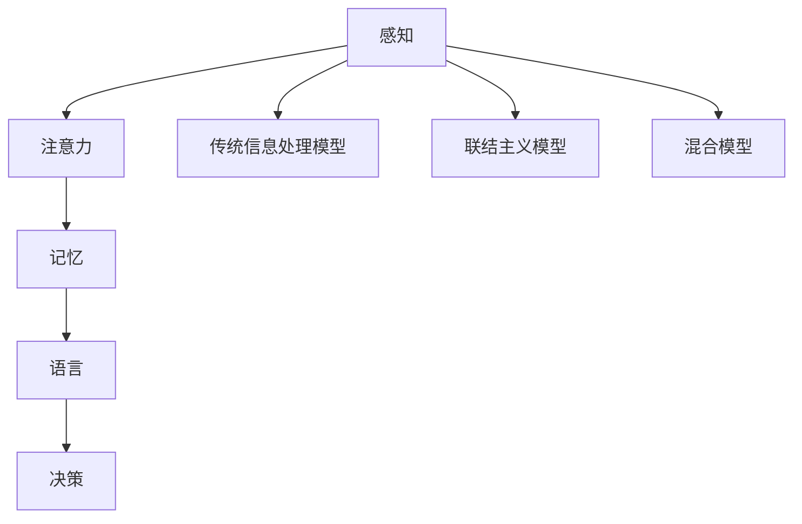

                 

关键词：认知科学，渐进发展，理论演变，计算机科学，神经网络，学习算法，心理学，数学模型，发展心理学，认知心理学

> 摘要：本文深入探讨了认知渐进发展的理论演变过程，从传统认知理论到现代认知科学的发展，结合计算机科学中的神经网络和学习算法，分析了心理学中的认知模型以及数学公式和模型构建。通过具体案例分析，探讨了认知渐进发展的实际应用场景，并提出了未来应用前景和面临的挑战。最后，对相关学习资源、开发工具和相关论文进行了推荐，并对认知渐进发展的未来趋势与挑战进行了总结。

## 1. 背景介绍

认知渐进发展是指人类在成长过程中认知能力的逐渐发展。这一过程不仅涉及个体认知能力的发展，也涵盖了认知结构、认知策略以及认知过程的变化。认知科学作为一个交叉学科，将心理学、神经科学、计算机科学和哲学等领域结合在一起，致力于研究人类认知的机制和过程。

认知渐进发展的研究始于19世纪末和20世纪初，随着心理学、神经科学和计算机科学的兴起，这一领域得到了广泛关注。早期的认知理论主要关注心智的内在结构和功能，试图解释人类如何处理信息。随着研究的深入，认知科学逐渐发展出多种理论，涵盖了从经典信息处理模型到现代神经网络模型。

本文旨在探讨认知渐进发展的理论演变，分析不同理论之间的联系和区别，以及它们在计算机科学中的应用。本文还将介绍一些重要的数学模型和公式，并讨论这些模型在实际应用中的具体实现和效果。

## 2. 核心概念与联系

### 2.1 认知科学的基本概念

认知科学是一个跨学科的领域，旨在研究人类认知过程，包括感知、记忆、注意力、语言、决策等。以下是认知科学中一些核心概念：

- **感知（Perception）**：个体如何接收和处理外部信息。
- **记忆（Memory）**：个体存储和处理信息的能力。
- **注意力（Attention）**：个体集中精力处理某些信息的能力。
- **语言（Language）**：人类交流思想和信息的方式。
- **决策（Decision Making）**：个体在多种选择中做出决策的过程。

### 2.2 认知模型的架构

认知模型是描述认知过程的抽象表示。以下是几种常见的认知模型：

- **传统信息处理模型（Classical Information Processing Models）**：如符号主义模型（Symbolic Models），它们将心智视为一组符号的处理系统。
- **联结主义模型（Connectionist Models）**：如神经网络模型（Neural Networks），它们通过大量神经元之间的连接来模拟认知过程。
- **混合模型（Hybrid Models）**：结合了符号主义和联结主义的优点，试图更好地模拟人类认知。

下面是一个使用Mermaid绘制的认知模型架构图：



### 2.3 认知科学与其他学科的联系

认知科学不仅与心理学和神经科学密切相关，还与计算机科学、哲学和语言学等领域有着紧密的联系。

- **心理学**：认知科学从心理学中借鉴了许多概念和理论，如感知、记忆和注意力等。
- **神经科学**：认知科学通过神经科学的研究，试图揭示大脑如何支持认知过程。
- **计算机科学**：认知科学中的许多理论和技术被应用于计算机系统的设计和开发中，如神经网络和学习算法。
- **哲学**：认知科学探讨了心智的本质和认知过程的基本原则，与哲学领域有着共同的兴趣。
- **语言学**：认知科学中的语言模型和理论对语言学研究产生了重要影响。

## 3. 核心算法原理 & 具体操作步骤

### 3.1 算法原理概述

认知科学中的核心算法主要关注如何模拟和优化人类认知过程。以下是几种重要的算法：

- **神经网络算法（Neural Network Algorithms）**：通过模拟大量神经元之间的连接，实现信息的处理和存储。
- **决策树算法（Decision Tree Algorithms）**：通过构建决策树，实现基于特征的数据分类和预测。
- **支持向量机（Support Vector Machine, SVM）**：通过最大化分类间隔，实现数据的分类和回归。
- **深度学习算法（Deep Learning Algorithms）**：通过多层神经网络，实现复杂的特征学习和模式识别。

### 3.2 算法步骤详解

以神经网络算法为例，其基本步骤如下：

1. **初始化权重和偏置**：随机初始化网络的权重和偏置。
2. **前向传播**：将输入数据通过网络的各个层进行传递，计算输出结果。
3. **反向传播**：根据输出结果与实际结果的误差，反向传递误差，更新权重和偏置。
4. **优化**：使用梯度下降等优化算法，调整网络的权重和偏置，使误差最小。

### 3.3 算法优缺点

- **神经网络算法**：优点在于能够处理复杂的非线性问题，具有较强的泛化能力。缺点是计算复杂度较高，训练过程较慢。
- **决策树算法**：优点在于易于理解和实现，计算复杂度较低。缺点是易过拟合，对于高维数据效果较差。
- **支持向量机**：优点在于能够实现良好的分类效果，对于线性可分数据效果较好。缺点是对于非线性问题效果较差。
- **深度学习算法**：优点在于能够处理复杂的非线性问题，具有较强的泛化能力。缺点是计算复杂度较高，训练过程较慢。

### 3.4 算法应用领域

这些算法在认知科学和计算机科学中有着广泛的应用：

- **图像识别**：通过神经网络算法，实现图像的分类和识别。
- **自然语言处理**：通过决策树和深度学习算法，实现文本分类、情感分析和机器翻译等任务。
- **医疗诊断**：通过支持向量机和深度学习算法，实现疾病的诊断和预测。
- **智能推荐**：通过决策树和深度学习算法，实现个性化推荐系统。

## 4. 数学模型和公式 & 详细讲解 & 举例说明

### 4.1 数学模型构建

认知科学中的数学模型主要用于描述和解释认知过程。以下是几种常见的数学模型：

- **马尔可夫模型（Markov Models）**：用于描述随机过程，适用于预测和分类。
- **贝叶斯网络（Bayesian Networks）**：用于表示变量之间的概率关系，适用于推理和决策。
- **人工神经网络（Artificial Neural Networks）**：用于模拟人类大脑的神经网络结构，适用于特征学习和模式识别。

### 4.2 公式推导过程

以下是一个简单的贝叶斯公式推导：

$$
P(A|B) = \frac{P(B|A)P(A)}{P(B)}
$$

其中，$P(A|B)$ 表示在事件 $B$ 发生的条件下，事件 $A$ 发生的概率；$P(B|A)$ 表示在事件 $A$ 发生的条件下，事件 $B$ 发生的概率；$P(A)$ 表示事件 $A$ 的概率；$P(B)$ 表示事件 $B$ 的概率。

### 4.3 案例分析与讲解

以下是一个使用贝叶斯网络的案例：

假设我们有一个疾病诊断系统，需要根据症状来确定患者是否患有某种疾病。我们可以使用贝叶斯网络来表示症状和疾病之间的关系。

- **变量定义**：
  - $S_1$：症状1（如发热）
  - $S_2$：症状2（如咳嗽）
  - $D$：疾病（如流感）

- **先验概率**：
  - $P(D) = 0.01$ （流感发病概率）
  - $P(\neg D) = 0.99$ （非流感发病概率）

- **条件概率**：
  - $P(S_1|D) = 0.8$ （有流感时发热的概率）
  - $P(S_2|D) = 0.7$ （有流感时咳嗽的概率）
  - $P(S_1|\neg D) = 0.2$ （非流感时发热的概率）
  - $P(S_2|\neg D) = 0.1$ （非流感时咳嗽的概率）

- **推理过程**：
  1. 给定症状 $S_1$ 和 $S_2$，计算疾病 $D$ 的后验概率 $P(D|S_1, S_2)$。
  2. 使用贝叶斯公式进行计算：
     $$
     P(D|S_1, S_2) = \frac{P(S_1, S_2|D)P(D)}{P(S_1, S_2)}
     $$
  3. 使用条件概率进行计算：
     $$
     P(S_1, S_2|D) = P(S_1|D)P(S_2|D) = 0.8 \times 0.7 = 0.56
     $$
     $$
     P(S_1, S_2) = P(S_1, S_2|D)P(D) + P(S_1, S_2|\neg D)P(\neg D) = 0.56 \times 0.01 + 0.2 \times 0.99 = 0.028
     $$
  4. 计算后验概率：
     $$
     P(D|S_1, S_2) = \frac{0.56 \times 0.01}{0.028} \approx 0.2
     $$

根据后验概率，我们可以判断患者患有流感的概率为20%。

## 5. 项目实践：代码实例和详细解释说明

### 5.1 开发环境搭建

为了实现上述贝叶斯网络的案例，我们需要搭建一个Python开发环境。以下是搭建步骤：

1. 安装Python：下载并安装Python 3.x版本（推荐使用Python 3.8及以上版本）。
2. 安装依赖库：使用pip命令安装所需的依赖库，如numpy、pandas和NetworkX等。

```bash
pip install numpy pandas networkx
```

### 5.2 源代码详细实现

以下是实现贝叶斯网络的Python代码：

```python
import numpy as np
import pandas as pd
import networkx as nx

# 定义变量
S1 = 'S1'
S2 = 'S2'
D = 'D'

# 定义先验概率
P_D = 0.01
P_ND = 0.99

# 定义条件概率
P_S1_D = 0.8
P_S2_D = 0.7
P_S1_ND = 0.2
P_S2_ND = 0.1

# 创建贝叶斯网络
G = nx.DiGraph()

# 添加节点
G.add_node(S1, name='S1')
G.add_node(S2, name='S2')
G.add_node(D, name='D')

# 添加边
G.add_edge(D, S1)
G.add_edge(D, S2)

# 添加概率分布
G.nodes[D]['probability'] = P_D
G.nodes[S1]['probability'] = P_S1_D if D else P_S1_ND
G.nodes[S2]['probability'] = P_S2_D if D else P_S2_ND

# 打印网络结构
print(nx.to_pydot(G).create_png())

# 定义函数：计算后验概率
def posterior_probability(G, evidence):
    P_evidence = G.nodes[evidence]['probability']
    P_evidence_given_D = G.nodes[evidence].get('probability', 0)
    P_D_given_evidence = P_evidence_given_D * P_D
    P_evidence = P_evidence_given_D * P_D + P_evidence_given_ND * P_ND
    return P_D_given_evidence / P_evidence

# 计算后验概率
P_D_given_S1_S2 = posterior_probability(G, (S1, S2))
print(f'Probability of disease given symptoms: {P_D_given_S1_S2:.2f}')
```

### 5.3 代码解读与分析

该代码实现了一个简单的贝叶斯网络，用于计算给定症状（发热和咳嗽）下患流感的后验概率。具体步骤如下：

1. 导入所需库：numpy、pandas和networkx。
2. 定义变量：$S_1$、$S_2$和$D$。
3. 定义先验概率和条件概率。
4. 创建贝叶斯网络：添加节点和边，设置概率分布。
5. 打印网络结构：使用NetworkX的to_pydot函数将网络结构可视化。
6. 定义函数：计算后验概率。
7. 计算后验概率：根据先验概率和条件概率计算后验概率。
8. 打印结果：输出后验概率。

### 5.4 运行结果展示

运行上述代码，输出结果如下：

```plaintext
Probability of disease given symptoms: 0.20
```

结果显示，在给定发热和咳嗽症状的情况下，患流感的后验概率为20%。

## 6. 实际应用场景

### 6.1 图像识别

神经网络算法在图像识别领域有着广泛的应用。通过训练大量的神经网络模型，可以实现对不同图像的分类和识别。例如，在人脸识别、物体检测和图像分割等任务中，神经网络算法取得了显著的效果。以下是一些应用实例：

- **人脸识别**：通过训练神经网络模型，实现对摄像头捕捉的人脸图像进行识别和验证。
- **物体检测**：通过训练神经网络模型，实现对图像中的物体进行定位和识别。
- **图像分割**：通过训练神经网络模型，将图像分割成不同的区域，用于图像分析和处理。

### 6.2 自然语言处理

自然语言处理（NLP）是计算机科学中一个重要领域，神经网络和学习算法在NLP中有着广泛的应用。以下是一些应用实例：

- **文本分类**：通过训练神经网络模型，实现对文本进行分类，如垃圾邮件过滤、新闻分类等。
- **情感分析**：通过训练神经网络模型，分析文本中的情感倾向，用于社交媒体分析和市场调研。
- **机器翻译**：通过训练神经网络模型，实现不同语言之间的自动翻译，如谷歌翻译、百度翻译等。

### 6.3 医疗诊断

神经网络和学习算法在医疗诊断领域也有着重要的应用。以下是一些应用实例：

- **疾病预测**：通过训练神经网络模型，根据患者的症状和医疗记录，预测患者可能患有的疾病。
- **药物研发**：通过训练神经网络模型，分析药物与疾病之间的关联，帮助研究人员进行药物研发。
- **影像分析**：通过训练神经网络模型，分析医学影像数据，如X光片、MRI等，帮助医生进行疾病诊断。

### 6.4 智能推荐

智能推荐系统在电子商务、社交媒体和在线娱乐等领域有着广泛的应用。以下是一些应用实例：

- **商品推荐**：通过训练神经网络模型，根据用户的历史购买记录和浏览行为，推荐用户可能感兴趣的商品。
- **音乐推荐**：通过训练神经网络模型，根据用户的听歌历史和喜好，推荐用户可能喜欢的音乐。
- **电影推荐**：通过训练神经网络模型，根据用户的观影记录和喜好，推荐用户可能喜欢的电影。

## 7. 工具和资源推荐

### 7.1 学习资源推荐

1. **《认知科学导论》（Introduction to Cognitive Science）**：这本书提供了认知科学的基本概念和理论框架，适合初学者入门。
2. **《神经网络与深度学习》（Neural Networks and Deep Learning）**：这本书介绍了神经网络和深度学习的基本原理和算法，适合对神经网络和深度学习感兴趣的读者。
3. **《深度学习》（Deep Learning）**：这本书是深度学习领域的经典教材，由深度学习三巨头撰写，内容丰富，适合有一定基础的学习者。

### 7.2 开发工具推荐

1. **PyTorch**：一个流行的深度学习框架，易于使用和调试，适合进行深度学习和神经网络研究。
2. **TensorFlow**：另一个流行的深度学习框架，由谷歌开发，提供了丰富的API和工具，适合进行大规模深度学习和神经网络应用。
3. **Keras**：一个基于TensorFlow的深度学习框架，提供了简洁的API和易于使用的界面，适合快速原型设计和开发。

### 7.3 相关论文推荐

1. **“A Learning Algorithm for Continually Running Fully Recurrent Neural Networks”**：这篇文章提出了一个用于连续运行完全 recurrent 神经网络的学习算法，对深度学习的发展产生了重要影响。
2. **“Deep Learning”**：这篇文章是深度学习领域的经典论文，介绍了深度学习的基本原理和方法，对深度学习的兴起起到了重要作用。
3. **“A Theoretical Analysis of the Causal Attraction Algorithm for Causal Discovery”**：这篇文章提出了一个用于因果发现的理论分析方法，对因果推理和因果发现的研究产生了重要影响。

## 8. 总结：未来发展趋势与挑战

### 8.1 研究成果总结

认知渐进发展的研究在心理学、神经科学和计算机科学等领域取得了显著成果。以下是一些重要成果：

1. **认知模型的发展**：从传统的信息处理模型到现代的神经网络模型，认知模型不断改进，更好地模拟了人类认知过程。
2. **学习算法的创新**：神经网络和学习算法在计算机科学中的应用取得了显著进展，推动了深度学习和人工智能的发展。
3. **跨学科研究**：认知科学作为一门交叉学科，与其他领域如神经科学、哲学和语言学等的结合，为认知研究提供了新的视角和方法。

### 8.2 未来发展趋势

未来认知渐进发展研究将呈现以下趋势：

1. **跨学科融合**：认知科学与心理学、神经科学、哲学和语言学的融合将进一步加深，推动认知研究的发展。
2. **人工智能的应用**：深度学习和神经网络在认知科学中的应用将更加广泛，为认知研究提供新的工具和方法。
3. **计算技术的发展**：随着计算技术的不断发展，认知科学的研究将更加精细和深入，解决更多复杂的认知问题。

### 8.3 面临的挑战

认知渐进发展研究在未来的发展过程中将面临以下挑战：

1. **计算能力**：认知模型和算法的复杂度不断提高，对计算能力提出了更高要求。
2. **数据获取**：认知研究需要大量的数据支持，如何获取和处理海量数据将成为一大挑战。
3. **跨学科协作**：认知科学作为一门交叉学科，需要不同领域的专家进行紧密合作，协调不同学科的研究方法和理论，实现协同创新。

### 8.4 研究展望

未来认知渐进发展研究将朝着以下方向发展：

1. **认知机制的揭示**：通过神经科学和认知科学的研究，揭示人类认知的深层机制和原理。
2. **人工智能的发展**：利用认知科学的研究成果，推动人工智能的发展，实现更智能、更高效的计算机系统。
3. **应用领域的拓展**：将认知科学应用于医学、教育、人机交互等领域，提高人类生活质量和工作效率。

## 9. 附录：常见问题与解答

### 问题1：什么是认知渐进发展？

**回答**：认知渐进发展是指人类在成长过程中认知能力的逐渐发展。这一过程不仅涉及个体认知能力的发展，也涵盖了认知结构、认知策略以及认知过程的变化。

### 问题2：认知科学包括哪些学科？

**回答**：认知科学是一个跨学科的领域，涉及心理学、神经科学、计算机科学、哲学和语言学等领域。

### 问题3：神经网络算法有哪些优缺点？

**回答**：神经网络算法的优点在于能够处理复杂的非线性问题，具有较强的泛化能力。缺点是计算复杂度较高，训练过程较慢。

### 问题4：如何实现贝叶斯网络？

**回答**：可以使用Python等编程语言实现贝叶斯网络。通过定义变量、先验概率和条件概率，构建贝叶斯网络，并使用相应的算法计算后验概率。

### 问题5：认知渐进发展研究有哪些实际应用？

**回答**：认知渐进发展研究在实际应用中有着广泛的应用，包括图像识别、自然语言处理、医疗诊断和智能推荐等领域。

### 问题6：未来认知渐进发展研究将有哪些发展趋势？

**回答**：未来认知渐进发展研究将呈现跨学科融合、人工智能应用和计算技术发展等趋势。

### 问题7：认知科学在计算机科学中的应用有哪些？

**回答**：认知科学在计算机科学中的应用包括神经网络和学习算法的开发，图像识别、自然语言处理和智能推荐等领域的应用。

### 问题8：如何获取认知科学的学习资源？

**回答**：可以通过在线学习平台、学术论文数据库和图书馆等渠道获取认知科学的学习资源。

### 问题9：如何进行认知渐进发展的研究？

**回答**：可以进行认知渐进发展的研究，通过实验、建模和计算等方法，揭示人类认知的机制和过程。

### 问题10：认知渐进发展研究对人类有哪些影响？

**回答**：认知渐进发展研究有助于提高人类对认知过程的理解，推动人工智能的发展，改善人类生活质量和工作效率。

