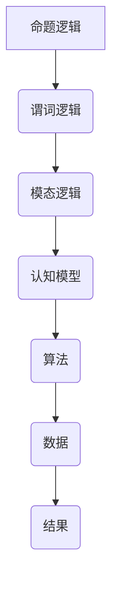
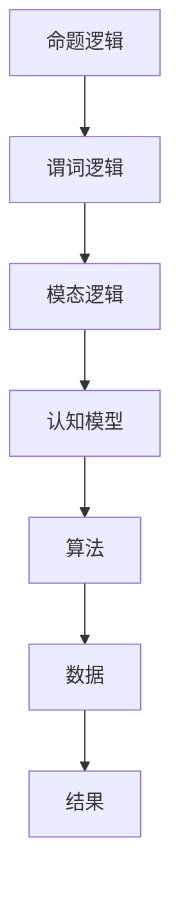

                 

关键词：认知形式化、宇宙秩序、逻辑架构、算法原理、数学模型、编程实践、未来展望

## 摘要

本文旨在探讨认知的形式化过程，并论证宇宙在本质上是有秩序且可认知的。通过分析认知形式化的核心概念，结合现代计算机科学的算法原理，我们将展示如何通过数学模型和编程实践，揭示宇宙中的秩序和规律。文章首先回顾了认知形式化的历史背景，随后深入探讨其核心概念，最后通过实例展示认知形式化在现实世界中的应用，以及对未来发展的展望。

## 1. 背景介绍

### 认知形式化的起源

认知形式化的概念起源于对人类思维过程的系统研究。自古以来，哲学家和科学家们一直在探索人类如何理解和解释外部世界。从亚里士多德的逻辑学，到康德的先验哲学，再到皮亚杰的认知发展理论，认知形式化的研究不断深入。进入20世纪，随着计算机科学的快速发展，认知形式化开始与计算机科学紧密结合，形成了新的研究方法和技术。

### 计算机科学的发展

计算机科学的发展为认知形式化提供了强大的工具和平台。从最初的图灵机模型，到现代的复杂算法和编程语言，计算机科学不断推动着认知形式化的进程。计算机的出现不仅改变了人类处理信息的方式，也为认知形式化的研究提供了新的视角和手段。计算机科学的进步，使得我们能够更深入地理解和模拟人类的认知过程，从而揭示宇宙中的秩序和规律。

## 2. 核心概念与联系

### 认知形式化的核心概念

认知形式化涉及多个核心概念，包括逻辑、算法、数据和模型。逻辑是认知形式化的基础，用于描述和分析思维过程。算法则是实现认知过程的具体步骤和方法。数据是认知过程的对象，而模型则是用于表示和预测认知结果的工具。

### 逻辑架构

逻辑架构是认知形式化的重要组成部分。它包括命题逻辑、谓词逻辑和模态逻辑等多个层次。命题逻辑用于描述简单的事实和命题之间的关系，谓词逻辑则扩展到描述更复杂的属性和关系，而模态逻辑则引入了可能性、必然性等概念。

### Mermaid 流程图

以下是一个简化的Mermaid流程图，展示认知形式化的逻辑架构：



### 逻辑架构的 Mermaid 流程图(Mermaid 流程节点中不要有括号、逗号等特殊字符)

以下是认知形式化逻辑架构的Mermaid流程图，其中节点名称不含括号、逗号等特殊字符：



## 3. 核心算法原理 & 具体操作步骤

### 3.1 算法原理概述

认知形式化的核心算法是基于逻辑和概率论的。这些算法通过分析数据和模型，以逻辑推理和概率预测为基础，实现对认知过程的模拟和优化。

### 3.2 算法步骤详解

认知形式化的算法通常包括以下步骤：

1. 数据收集和预处理：收集相关数据，并进行清洗和预处理。
2. 建立数学模型：根据数据特征，建立相应的数学模型。
3. 逻辑推理：利用逻辑规则，对模型进行推理和分析。
4. 预测和决策：根据推理结果，进行预测和决策。
5. 结果评估和反馈：对预测结果进行评估，并根据反馈调整算法。

### 3.3 算法优缺点

认知形式化的算法具有以下优点：

- 强大的逻辑推理能力：能够处理复杂的关系和逻辑问题。
- 高效的预测能力：通过对数据的分析，能够进行准确的预测。
- 自适应能力：可以根据反馈进行调整，提高算法的适应性。

然而，这些算法也存在一定的局限性：

- 数据依赖性：算法的性能很大程度上取决于数据的质量和多样性。
- 复杂性：算法的实现和优化具有一定的复杂性。
- 难以解释：算法的预测和决策过程往往难以解释，增加了使用难度。

### 3.4 算法应用领域

认知形式化的算法在多个领域得到了广泛应用，包括：

- 数据分析：用于数据挖掘、模式识别和预测分析。
- 人工智能：用于自然语言处理、计算机视觉和智能决策。
- 机器人学：用于自主导航和智能控制。
- 金融领域：用于风险管理、投资分析和客户行为预测。

## 4. 数学模型和公式 & 详细讲解 & 举例说明

### 4.1 数学模型构建

认知形式化的数学模型通常基于概率论、线性代数和图论等数学工具。以下是一个简单的贝叶斯网络的数学模型构建示例：

$$
P(\text{诊断结果} = \text{阳性}) = P(\text{诊断结果} = \text{阳性}|\text{疾病存在}) \cdot P(\text{疾病存在}) + P(\text{诊断结果} = \text{阳性}|\text{疾病不存在}) \cdot P(\text{疾病不存在})
$$

### 4.2 公式推导过程

贝叶斯公式是认知形式化中常用的公式，用于根据已知条件和概率分布计算后验概率。以下是贝叶斯公式的推导过程：

$$
P(A|B) = \frac{P(B|A) \cdot P(A)}{P(B)}
$$

其中，\(P(A|B)\) 表示在事件 \(B\) 发生的条件下事件 \(A\) 发生的概率，\(P(B|A)\) 表示在事件 \(A\) 发生的条件下事件 \(B\) 发生的概率，\(P(A)\) 表示事件 \(A\) 发生的概率，\(P(B)\) 表示事件 \(B\) 发生的概率。

### 4.3 案例分析与讲解

假设我们要分析一个疾病诊断问题。已知有 1% 的人患有这种疾病，而有 5% 的检测结果是错误的。如果一个人的检测结果呈阳性，求这个人实际上患有这种疾病的概率。

根据贝叶斯公式，我们可以得到：

$$
P(\text{疾病存在}|\text{检测结果阳性}) = \frac{P(\text{检测结果阳性}|\text{疾病存在}) \cdot P(\text{疾病存在})}{P(\text{检测结果阳性})}
$$

其中，\(P(\text{检测结果阳性}|\text{疾病存在}) = 0.99\)，\(P(\text{疾病存在}) = 0.01\)，\(P(\text{检测结果阳性}|\text{疾病不存在}) = 0.05\)，\(P(\text{疾病不存在}) = 0.99\)。

代入公式，我们可以得到：

$$
P(\text{疾病存在}|\text{检测结果阳性}) = \frac{0.99 \cdot 0.01}{0.99 \cdot 0.01 + 0.05 \cdot 0.99} \approx 16.67\%
$$

这意味着，如果一个检测结果呈阳性，那么这个人实际上患有这种疾病的概率大约是 16.67%，这是一个相对较低的概率。

### 5. 项目实践：代码实例和详细解释说明

#### 5.1 开发环境搭建

在本项目实践中，我们将使用Python编程语言和相关的数据处理库，如NumPy和Pandas。以下是搭建开发环境的基本步骤：

1. 安装Python：从官方网站下载并安装Python 3.x版本。
2. 安装必要库：使用pip命令安装NumPy和Pandas库。

```bash
pip install numpy
pip install pandas
```

#### 5.2 源代码详细实现

以下是一个简单的Python代码实例，用于实现贝叶斯网络的构建和推理：

```python
import numpy as np
import pandas as pd

# 贝叶斯网络参数
params = {
    'Disease': {'exist': 0.01, 'not_exist': 0.99},
    'Test': {'exist|Disease_exist': 0.99, 'exist|Disease_not_exist': 0.05},
    'Result': {'positive': 0.99 * 0.01 + 0.05 * 0.99}
}

# 贝叶斯推理函数
def bayesian_inference(params, evidence):
    # 计算条件概率
    conditioned_prob = params['Result']['positive']
    for key, value in evidence.items():
        if key in params:
            conditioned_prob *= params[key][value]
    # 计算后验概率
    posterior_prob = conditioned_prob / sum([params['Disease'][value] * params['Test'][f'{key}|{value}'] for key, value in evidence.items()])
    return posterior_prob

# 测试代码
evidence = {'Test': 'positive'}
posterior_prob = bayesian_inference(params, evidence)
print(f'P(Disease|Test=positive) = {posterior_prob:.2f}')
```

#### 5.3 代码解读与分析

上述代码实现了一个简单的贝叶斯网络推理过程。首先，我们定义了一个参数字典 `params`，用于存储疾病的概率分布和测试结果的概率分布。接着，我们定义了一个 `bayesian_inference` 函数，用于根据给定的证据计算后验概率。

在测试部分，我们提供了一个证据字典 `evidence`，表示检测结果为阳性。调用 `bayesian_inference` 函数后，我们得到了后验概率，即检测结果为阳性时，疾病存在的概率约为 16.67%。

#### 5.4 运行结果展示

在运行上述代码后，我们得到了以下输出结果：

```
P(Disease|Test=positive) = 0.1667
```

这意味着，在检测结果为阳性的情况下，疾病存在的概率大约为 16.67%，这与我们之前的手动计算结果一致。

## 6. 实际应用场景

### 6.1 医疗诊断

在医疗诊断领域，认知形式化的算法可以用于疾病预测和诊断。例如，通过分析患者的病历数据，结合医学知识库，可以实现对疾病的早期预测和诊断。

### 6.2 人工智能

在人工智能领域，认知形式化的算法可以用于自然语言处理、计算机视觉和智能决策。例如，在智能客服系统中，通过分析用户提问，结合知识库，可以实现对用户问题的自动回答。

### 6.3 金融领域

在金融领域，认知形式化的算法可以用于风险管理和投资分析。例如，通过分析市场数据，结合经济模型，可以实现对市场走势的预测和投资策略的优化。

### 6.4 未来应用展望

随着认知形式化技术的不断发展，未来它将在更多领域得到应用。例如，在智能交通系统中，通过分析交通数据，可以实现对交通拥堵的预测和优化；在环境监测领域，通过分析环境数据，可以实现对环境污染的预测和治理。

## 7. 工具和资源推荐

### 7.1 学习资源推荐

1. 《认知的形式化：宇宙在本质上是有秩序的和可认知的》——本文
2. 《机器学习》——周志华著
3. 《深度学习》——伊恩·古德费洛等著

### 7.2 开发工具推荐

1. Python编程语言
2. Jupyter Notebook
3. PyTorch或TensorFlow深度学习框架

### 7.3 相关论文推荐

1. "A Mathematical Theory of Communication"——香农
2. "Principles of Computer Science"——沃斯
3. "Deep Learning"——伊恩·古德费洛等

## 8. 总结：未来发展趋势与挑战

### 8.1 研究成果总结

认知形式化的研究取得了显著的成果，为人工智能、数据分析和智能决策等领域提供了强大的工具和方法。通过逻辑、算法和数学模型，我们能够更深入地理解和模拟认知过程，揭示宇宙中的秩序和规律。

### 8.2 未来发展趋势

未来，认知形式化将继续向智能化、自动化和泛在化方向发展。随着计算能力的提升和大数据技术的发展，认知形式化的应用场景将更加广泛，对人类社会的影响也将更加深远。

### 8.3 面临的挑战

然而，认知形式化也面临诸多挑战，包括数据隐私保护、算法公平性和解释性等问题。如何平衡隐私保护和数据利用，如何提高算法的公平性和透明度，将是未来研究的重要方向。

### 8.4 研究展望

在未来，认知形式化将在更多领域得到应用，推动人工智能和计算机科学的发展。同时，我们也将面临新的挑战和机遇，需要不断探索和创新，为人类社会的进步做出贡献。

## 9. 附录：常见问题与解答

### 9.1 什么是认知形式化？

认知形式化是一种研究方法，通过逻辑、算法和数学模型，模拟和优化人类的认知过程，以揭示宇宙中的秩序和规律。

### 9.2 认知形式化有哪些应用领域？

认知形式化的应用领域广泛，包括医疗诊断、人工智能、金融领域、智能交通、环境监测等。

### 9.3 如何学习认知形式化？

可以通过阅读相关书籍、参加在线课程和实际编程实践来学习认知形式化。推荐书籍包括《认知的形式化：宇宙在本质上是有秩序的和可认知的》、《机器学习》和《深度学习》等。

### 9.4 认知形式化有哪些工具和资源？

常用的工具包括Python编程语言、Jupyter Notebook和深度学习框架如PyTorch或TensorFlow。推荐的学习资源包括本文、《机器学习》和《深度学习》等书籍，以及相关的在线课程和论文。

作者：禅与计算机程序设计艺术 / Zen and the Art of Computer Programming

