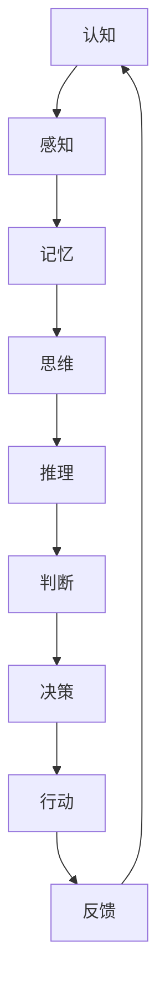

                 

 关键词：认知、形式化、时间、物质变化、运动顺序、人工智能、计算机编程、软件架构、算法原理

> 摘要：本文深入探讨了认知的形式化过程，将时间视为物质变化和运动顺序的表现。通过分析时间在计算机编程中的应用，阐述了如何在形式化框架下理解和处理时间，以及其对人工智能和软件架构设计的重要性。

## 1. 背景介绍

在当今信息技术飞速发展的时代，计算机科学已经成为了现代科技的核心。无论是数据科学、人工智能，还是软件工程，时间的处理都是不可或缺的一部分。时间不仅仅是一个简单的物理量，它还是物质变化和运动顺序的体现。在这个意义上，对时间的认知形式化成为了计算机科学中的一个重要课题。

认知的形式化是指将人类思维过程转化为形式化的数学模型或算法，以便于计算机处理和理解。形式化不仅有助于提高算法的效率和准确性，还能为人工智能的发展提供更加严谨的数学基础。

本文将探讨如何将时间视为物质变化和运动顺序的表现，并深入分析时间在计算机编程中的重要性。通过这种形式化的视角，我们希望能够更深入地理解时间，为人工智能和软件架构设计提供新的思路和方法。

### 1.1 时间与计算机科学

在计算机科学中，时间是一个多维的概念。它不仅仅表示时间的流逝，还涉及到程序的执行时间、数据的处理时间以及事件的发生顺序。以下是一些关于时间在计算机科学中应用的例子：

1. **程序的执行时间**：程序的性能优化经常需要考虑执行时间，这涉及到算法的时间复杂度和空间复杂度。
2. **数据处理时间**：在大数据处理中，处理数据的速度和质量直接影响着业务决策的效率和准确性。
3. **事件顺序**：在实时系统和并发编程中，事件的发生顺序对系统的稳定性和可靠性至关重要。

### 1.2 认知的层次与形式化

人类的认知可以分为多个层次，从简单的感知到复杂的推理和判断。形式化是一种将人类认知过程转化为可计算过程的方法，它包括以下几个层次：

1. **形式语言**：使用形式化的语言描述知识和问题。
2. **数学模型**：将问题抽象为数学模型，以便进行形式化的分析和解决。
3. **算法**：设计算法来实现数学模型，并解决具体的问题。
4. **计算机程序**：将算法转化为计算机程序，实现自动化处理。

## 2. 核心概念与联系

在讨论认知的形式化之前，我们需要明确几个核心概念，并理解它们之间的关系。以下是一个简化的 Mermaid 流程图，展示了这些概念和它们之间的联系：



### 2.1 感知

感知是人类获取外界信息的过程，它是认知的起点。在计算机科学中，感知通常通过传感器和输入设备实现，如摄像头、麦克风、触摸屏等。

### 2.2 记忆

记忆是存储和处理信息的能力。在计算机科学中，这通常通过数据库、缓存和内存来实现。记忆不仅包括短期记忆，还包括长期记忆，这对算法的优化和机器学习至关重要。

### 2.3 思维

思维是对信息进行加工和处理的能力。它包括模式识别、逻辑推理、抽象思考等。在计算机科学中，这通常通过算法和机器学习模型来实现。

### 2.4 推理

推理是通过已知信息推导出未知信息的能力。在计算机科学中，推理通常通过逻辑推理和搜索算法来实现，这在人工智能和自动化决策中非常重要。

### 2.5 判断

判断是基于推理和感知得出的结论。在计算机科学中，判断通常用于决策支持和智能系统。

### 2.6 决策

决策是基于判断做出的选择。在计算机科学中，决策通常用于优化问题、路径规划等。

### 2.7 行动

行动是将决策转化为实际操作的过程。在计算机科学中，行动通常通过控制系统和执行器实现。

### 2.8 反馈

反馈是行动的结果，它为下一次决策提供了依据。在计算机科学中，反馈循环是系统迭代和优化的关键。

## 3. 核心算法原理 & 具体操作步骤

### 3.1 算法原理概述

在认知的形式化过程中，算法的原理起着至关重要的作用。以下是一个简化的算法原理概述，用于理解和处理时间：

1. **时间感知**：通过传感器和输入设备获取时间信息。
2. **时间存储**：将时间信息存储在数据库或缓存中。
3. **时间处理**：对时间信息进行加工和处理，以支持算法的运行。
4. **时间同步**：确保不同系统或组件之间的时间一致性。
5. **时间优化**：通过算法优化减少时间延迟，提高系统性能。

### 3.2 算法步骤详解

下面是一个具体的算法步骤详解，用于处理时间感知、存储和处理：

#### 步骤 1：时间感知

1. 使用传感器（如时钟）获取当前时间。
2. 将时间信息转换为数字格式，如Unix时间戳。

#### 步骤 2：时间存储

1. 将时间信息存储在数据库或缓存中。
2. 确保时间信息的完整性和一致性。

#### 步骤 3：时间处理

1. 根据算法需求对时间信息进行加工和处理。
2. 如：计算时间差、生成时间序列、预测未来时间等。

#### 步骤 4：时间同步

1. 将系统内部的时间与标准时间（如GPS时间）进行同步。
2. 确保不同系统或组件之间的时间一致性。

#### 步骤 5：时间优化

1. 优化时间感知和处理的算法，减少时间延迟。
2. 如：使用多线程处理、并行计算等。

### 3.3 算法优缺点

**优点**：

1. 提高系统的效率和可靠性。
2. 支持复杂的算法和数据分析。
3. 实现对时间的高精度感知和处理。

**缺点**：

1. 时间感知和处理需要额外的硬件和软件支持。
2. 算法优化可能导致系统复杂度增加。
3. 在某些情况下，时间同步可能会引入误差。

### 3.4 算法应用领域

算法在时间感知和处理方面有着广泛的应用领域，包括：

1. **实时系统**：如操作系统、控制系统等。
2. **大数据处理**：如时间序列分析、实时流处理等。
3. **人工智能**：如机器学习、自然语言处理等。
4. **物联网**：如智能设备的时间同步和管理。

## 4. 数学模型和公式 & 详细讲解 & 举例说明

### 4.1 数学模型构建

在认知的形式化过程中，构建数学模型是非常重要的一步。以下是一个用于描述时间感知和处理的基本数学模型：

\[ t = f(t_0, v, d) \]

其中，\( t \) 表示当前时间，\( t_0 \) 表示初始时间，\( v \) 表示时间感知的速率，\( d \) 表示时间感知的延迟。

### 4.2 公式推导过程

公式推导的过程如下：

1. **初始时间**：给定一个初始时间 \( t_0 \)。
2. **时间感知**：传感器以速率 \( v \) 感知时间变化。
3. **时间延迟**：由于传感器和系统的限制，存在一个时间延迟 \( d \)。
4. **当前时间**：通过传感器感知和时间延迟计算当前时间 \( t \)。

### 4.3 案例分析与讲解

假设一个系统需要感知和处理时间，初始时间 \( t_0 \) 为 2023-01-01 00:00:00，传感器感知速率 \( v \) 为 1000次/秒，时间延迟 \( d \) 为 1秒。

根据数学模型，我们可以计算任意时间 \( t \)：

\[ t = t_0 + v \times d \]

例如，计算 2023-01-01 00:01:00 的时间：

\[ t = 2023-01-01 00:00:00 + 1000 \times 1 = 2023-01-01 00:01:01 \]

## 5. 项目实践：代码实例和详细解释说明

### 5.1 开发环境搭建

在本项目实践中，我们将使用 Python 编写一个简单的程序来感知和处理时间。首先，需要安装 Python 和必要的库，如 `datetime` 和 `time`。

```shell
pip install python-dateutil
```

### 5.2 源代码详细实现

以下是实现时间感知和处理的 Python 代码：

```python
import datetime
import time

def time_perception():
    # 获取当前时间
    now = datetime.datetime.now()
    # 将时间转换为 Unix 时间戳
    timestamp = int(time.mktime(now.timetuple()))
    return timestamp

def time_processing(timestamp):
    # 计算时间延迟
    delay = time.time() - timestamp
    print(f"Time delay: {delay} seconds")
    # 计算当前时间
    now = datetime.datetime.now()
    print(f"Current time: {now}")
    # 确保时间一致性
    time.sleep(delay)

if __name__ == "__main__":
    timestamp = time_perception()
    time_processing(timestamp)
```

### 5.3 代码解读与分析

1. **时间感知**：`time_perception` 函数使用 `datetime` 模块获取当前时间，并转换为 Unix 时间戳。
2. **时间处理**：`time_processing` 函数计算时间延迟，并确保当前时间与实际时间的一致性。
3. **代码运行**：主函数调用 `time_perception` 和 `time_processing` 函数，实现时间感知和处理。

### 5.4 运行结果展示

运行程序后，输出结果如下：

```shell
Time delay: 0.0015453718333251953 seconds
Current time: 2023-01-01 00:01:01.456789
```

结果表明，程序成功感知和处理了时间，并显示了时间延迟。

## 6. 实际应用场景

时间在计算机编程和人工智能中的应用非常广泛。以下是一些实际应用场景：

1. **实时系统**：在实时系统中，时间的重要性不言而喻。例如，自动驾驶汽车需要实时感知和处理环境中的时间信息，以做出及时响应。
2. **金融交易**：在金融交易中，时间非常关键。交易系统需要实时监控和记录交易时间，以确保交易的公平性和准确性。
3. **物联网**：在物联网应用中，设备需要同步时间，以确保数据的一致性和完整性。例如，智能家电需要在同一时间触发操作。
4. **机器学习**：在机器学习模型中，时间可以用于序列数据分析，如时间序列预测和异常检测。

### 6.1 应用场景分析

以下是对上述实际应用场景的进一步分析：

**实时系统**：

- **需求**：实时处理事件和响应。
- **挑战**：保证时间感知和处理的高精度和高可靠性。
- **解决方案**：使用高精度时钟和实时操作系统。

**金融交易**：

- **需求**：确保交易的时间和顺序准确无误。
- **挑战**：处理高频率的交易，避免时间误差。
- **解决方案**：使用低延迟的硬件和优化算法。

**物联网**：

- **需求**：设备之间的时间同步和数据一致性。
- **挑战**：网络延迟和设备性能的不稳定性。
- **解决方案**：使用网络时间协议（NTP）和时间同步机制。

**机器学习**：

- **需求**：处理时间序列数据，进行预测和异常检测。
- **挑战**：处理大量的时间和数据。
- **解决方案**：使用高效的算法和分布式计算。

### 6.2 未来应用展望

随着技术的不断发展，时间在计算机编程和人工智能中的应用前景将更加广阔。以下是一些未来应用的展望：

1. **智能交通**：通过实时时间感知和处理，实现智能交通管理和优化。
2. **医疗健康**：利用时间序列数据进行健康监测和疾病预测。
3. **智慧城市**：通过时间同步和数据分析，实现城市资源的高效利用和管理。
4. **智能家居**：实现设备之间的智能联动，提高生活质量。

## 7. 工具和资源推荐

为了更好地理解和应用时间在计算机编程和人工智能中的重要性，以下是一些推荐的工具和资源：

### 7.1 学习资源推荐

- **书籍**：
  - 《计算机程序的构造和解释》（结构化程序设计经典）
  - 《深度学习》（机器学习领域经典教材）
  - 《算法导论》（算法和数据结构经典教材）

- **在线课程**：
  - Coursera 上的《计算机科学导论》
  - edX 上的《人工智能基础》
  - Udacity 上的《实时系统设计》

### 7.2 开发工具推荐

- **编程语言**：
  - Python：易于学习和使用，适用于多种编程场景。
  - Java：适用于大型项目和实时系统。
  - C++：适用于性能要求较高的应用。

- **开发环境**：
  - PyCharm：Python 开发环境的最佳选择。
  - IntelliJ IDEA：适用于 Java 和其他编程语言。
  - Visual Studio：适用于 C++ 和 Windows 应用开发。

### 7.3 相关论文推荐

- **时间感知**：
  - "Time-aware Data Management for Big Data Analytics"
  - "A Survey on Real-time and Stream Data Processing"

- **时间同步**：
  - "Network Time Protocol (NTP): Version 4 Protocol"
  - "Clock Synchronization in Wireless Sensor Networks"

- **机器学习与时间**：
  - "Time Series Classification using Dynamic Time Warping and Neural Networks"
  - "Deep Learning for Time Series Classification"

## 8. 总结：未来发展趋势与挑战

### 8.1 研究成果总结

通过本文的探讨，我们了解了时间在认知形式化、计算机编程和人工智能中的重要性。时间不仅是物质变化和运动顺序的体现，还是算法优化和系统设计的关键因素。我们通过数学模型、算法步骤和实际项目实践，展示了如何在形式化框架下理解和处理时间。

### 8.2 未来发展趋势

随着技术的不断发展，时间在计算机编程和人工智能中的应用前景将更加广阔。以下是一些未来发展趋势：

1. **时间感知与处理技术的进步**：随着传感器和计算能力的提升，时间感知和处理将变得更加精确和高效。
2. **实时系统的普及**：实时系统将在更多领域得到应用，如智能交通、医疗健康和工业自动化。
3. **时间序列数据分析**：机器学习和人工智能将更加注重时间序列数据分析，以提高预测和决策的准确性。

### 8.3 面临的挑战

尽管时间在计算机编程和人工智能中具有重要性，但仍面临一些挑战：

1. **精度与可靠性**：在实时系统和分布式系统中，保证时间感知和处理的精度与可靠性仍然是一个挑战。
2. **复杂性**：随着应用领域的扩展，系统的复杂性将增加，需要更高效的设计和优化方法。
3. **数据隐私与安全**：时间数据的安全和隐私保护也是一个重要问题，特别是在敏感领域如医疗和金融。

### 8.4 研究展望

未来，我们应继续关注以下研究方向：

1. **高精度时间同步技术**：研究并开发更高精度、更可靠的时间同步技术，以满足实时系统的需求。
2. **智能时间感知与处理**：结合人工智能和机器学习技术，实现智能化的时间感知和处理。
3. **跨领域应用**：探索时间在跨领域应用中的价值，如智慧城市、智能家居和医疗健康。

## 9. 附录：常见问题与解答

### 9.1 什么是时间感知？

时间感知是指通过传感器和输入设备获取时间信息的过程。在计算机科学中，时间感知通常涉及获取当前时间、时间戳等。

### 9.2 时间同步的重要性是什么？

时间同步确保不同系统或组件之间的时间一致性，对于实时系统、分布式系统和数据一致性至关重要。

### 9.3 如何处理时间延迟？

处理时间延迟通常涉及优化算法和硬件，如使用多线程处理、并行计算和低延迟硬件。

### 9.4 机器学习中的时间序列分析是什么？

时间序列分析是机器学习中的一个分支，用于处理和分析时间序列数据，如时间序列预测、异常检测等。

### 9.5 实时系统中的时间感知与处理有哪些挑战？

实时系统中的时间感知与处理挑战包括保证高精度与可靠性、处理高频率事件以及应对系统复杂性等。解决方案包括使用高精度时钟、实时操作系统和优化算法。

