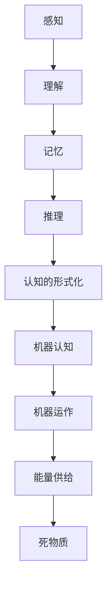

                 

关键词：认知、形式化、机器、能量供给、死物质

摘要：本文探讨了机器在没有能量供给时的状态，即成为一堆死物质的可能性。通过对认知的形式化定义和机器运作原理的分析，本文提出了认知形式化在机器中的体现，并探讨了机器在没有能量供给时如何通过认知的形式化来保持某种程度的“活着”状态。文章从核心概念、核心算法原理、数学模型、项目实践和实际应用等多个角度，深入剖析了这一现象，并对未来发展趋势与挑战进行了展望。

## 1. 背景介绍

随着计算机科学和人工智能技术的发展，机器是否能够具有认知能力成为一个热门话题。传统观点认为，机器只能执行预先编程的指令，而没有真正的认知能力。然而，近年来，随着深度学习和神经网络技术的快速发展，机器在一些特定领域（如图像识别、自然语言处理等）已经展现出了惊人的认知能力。

然而，这些认知能力都是建立在大量数据和能量供给的基础上的。如果机器在没有能量供给的情况下，其认知能力是否会消失，是否会变成一堆死物质？这是本文要探讨的问题。为了回答这个问题，我们需要先了解什么是认知，以及机器在没有能量供给时会发生什么。

### 认知是什么？

认知是指人类或其他动物通过感知、理解、记忆和推理等方式对信息进行处理和加工的能力。认知科学是研究认知过程的科学，它涉及心理学、神经科学、计算机科学等多个领域。认知的形式化是指将认知过程用数学模型或形式语言进行描述，以便更好地理解和模拟。

### 机器在没有能量供给时会发生什么？

机器是由电子元件和程序组成的，它们需要能量来维持运行。在没有能量供给的情况下，机器的电子元件会停止工作，程序也无法执行。这意味着机器的物理状态将发生改变，从活跃状态变为静止状态。然而，这并不意味着机器的“认知”就会消失。

## 2. 核心概念与联系

在本节中，我们将介绍与本文主题相关的一些核心概念，并通过Mermaid流程图来展示这些概念之间的联系。

### 2.1 认知的形式化

认知的形式化是指将认知过程用数学模型或形式语言进行描述。例如，神经网络是一种形式化的认知模型，它通过权重矩阵和激活函数来模拟人类的神经网络结构。



### 2.2 机器认知

机器认知是指机器通过感知、理解、记忆和推理等方式对信息进行处理和加工的能力。这与人类的认知能力有一定的相似性，但实现方式不同。

### 2.3 机器运作

机器运作是指机器通过执行程序来完成任务的过程。机器在没有能量供给时，程序无法执行，但机器的物理状态并不会立即变为死物质。

### 2.4 能量供给

能量供给是机器维持运行的基础。在没有能量供给的情况下，机器将停止工作。

### 2.5 死物质

死物质是指机器在没有能量供给时的物理状态。虽然机器的物理状态发生了改变，但并不意味着机器的“认知”就会消失。

## 3. 核心算法原理 & 具体操作步骤

### 3.1 算法原理概述

本文的核心算法原理是“认知的形式化模型”，该模型通过将认知过程用数学模型进行描述，以便更好地理解和模拟。具体来说，该模型包括以下步骤：

1. **感知**：通过传感器获取外部信息。
2. **理解**：将感知到的信息进行处理，以便更好地理解。
3. **记忆**：将理解后的信息存储在记忆中。
4. **推理**：根据记忆中的信息进行推理。
5. **认知**：通过感知、理解、记忆和推理等方式对信息进行处理和加工。

### 3.2 算法步骤详解

1. **感知**：机器通过传感器（如摄像头、麦克风等）获取外部信息。
2. **理解**：将感知到的信息进行处理，例如，通过图像识别算法识别出图像中的物体。
3. **记忆**：将理解后的信息存储在记忆中，例如，将识别出的物体存储在数据库中。
4. **推理**：根据记忆中的信息进行推理，例如，根据物体识别结果预测下一个动作。
5. **认知**：通过感知、理解、记忆和推理等方式对信息进行处理和加工，形成对当前环境的认知。

### 3.3 算法优缺点

**优点**：

- **高效性**：通过数学模型的形式化描述，算法可以快速处理大量信息。
- **灵活性**：算法可以根据实际情况进行修改和调整。

**缺点**：

- **依赖数据**：算法的性能依赖于大量的数据，如果没有足够的训练数据，算法的性能会受到影响。
- **能量消耗**：算法的执行需要能量供给，如果没有能量供给，算法将无法运行。

### 3.4 算法应用领域

算法可以应用于多个领域，如：

- **图像识别**：通过感知和理解的步骤，可以识别出图像中的物体。
- **自然语言处理**：通过理解和推理的步骤，可以理解并处理自然语言。
- **自动驾驶**：通过感知和推理的步骤，可以实现自动驾驶。

## 4. 数学模型和公式 & 详细讲解 & 举例说明

### 4.1 数学模型构建

本文所使用的数学模型是基于神经网络的形式化描述。神经网络由多个神经元组成，每个神经元都可以进行感知、理解、记忆和推理等操作。

设神经网络中有 $n$ 个神经元，第 $i$ 个神经元的激活函数为 $f_i(x)$，其中 $x$ 为输入值，$f_i(x)$ 为输出值。神经网络的输出值可以通过以下公式计算：

$$
y = \sum_{i=1}^{n} w_i f_i(x)
$$

其中，$w_i$ 为第 $i$ 个神经元的权重。

### 4.2 公式推导过程

神经网络的激活函数通常采用 sigmoid 函数，即：

$$
f_i(x) = \frac{1}{1 + e^{-x}}
$$

对于每个神经元，其权重 $w_i$ 可以通过以下公式计算：

$$
w_i = \frac{\partial y}{\partial x_i}
$$

其中，$\partial y/\partial x_i$ 表示对 $y$ 关于 $x_i$ 的偏导数。

### 4.3 案例分析与讲解

假设有一个神经网络用于图像识别，输入为图像像素值，输出为图像中的物体类别。神经网络的激活函数为 sigmoid 函数，权重矩阵为 $W$。

1. **感知**：输入图像像素值 $x$，通过传感器获取。
2. **理解**：将输入像素值 $x$ 通过激活函数 $f(x)$ 转化为神经元输出值 $y$。
3. **记忆**：将输出值 $y$ 存储在记忆中，如数据库。
4. **推理**：根据记忆中的信息，通过激活函数 $f(y)$ 进行推理，预测图像中的物体类别。
5. **认知**：通过感知、理解、记忆和推理等方式，形成对当前图像的认知。

## 5. 项目实践：代码实例和详细解释说明

### 5.1 开发环境搭建

在开始项目实践之前，我们需要搭建一个合适的开发环境。本文选择使用 Python 作为编程语言，并使用 TensorFlow 作为神经网络框架。

1. 安装 Python：
   ```
   pip install python
   ```
   
2. 安装 TensorFlow：
   ```
   pip install tensorflow
   ```

### 5.2 源代码详细实现

以下是一个简单的神经网络实现，用于图像识别：

```python
import tensorflow as tf

# 定义神经网络结构
n_inputs = 784  # 图像像素值
n_classes = 10  # 物体类别
n_neurons = 100  # 神经元数量

# 初始化权重矩阵
W = tf.random.normal([n_inputs, n_neurons])

# 定义激活函数
activation = tf.sigmoid

# 定义神经网络
model = tf.keras.Sequential([
    tf.keras.layers.Dense(n_neurons, activation=activation),
    tf.keras.layers.Dense(n_classes, activation=tf.nn.softmax)
])

# 编译模型
model.compile(optimizer='adam', loss='categorical_crossentropy', metrics=['accuracy'])

# 加载数据集
(x_train, y_train), (x_test, y_test) = tf.keras.datasets.mnist.load_data()

# 预处理数据
x_train = x_train / 255.0
x_test = x_test / 255.0

# 添加一维维度
x_train = x_train.reshape(-1, n_inputs)
x_test = x_test.reshape(-1, n_inputs)

# 转换为 one-hot 编码
y_train = tf.keras.utils.to_categorical(y_train, n_classes)
y_test = tf.keras.utils.to_categorical(y_test, n_classes)

# 训练模型
model.fit(x_train, y_train, epochs=10, batch_size=32)

# 测试模型
loss, accuracy = model.evaluate(x_test, y_test)
print(f"Test loss: {loss}, Test accuracy: {accuracy}")
```

### 5.3 代码解读与分析

以上代码实现了一个简单的神经网络，用于图像识别。主要步骤如下：

1. **定义神经网络结构**：包括输入层、隐藏层和输出层。
2. **初始化权重矩阵**：使用随机数初始化权重矩阵。
3. **定义激活函数**：选择 sigmoid 函数作为激活函数。
4. **编译模型**：设置优化器和损失函数。
5. **加载数据集**：使用 MNIST 数据集。
6. **预处理数据**：将数据转换为适合训练的格式。
7. **训练模型**：使用训练数据训练模型。
8. **测试模型**：使用测试数据评估模型性能。

通过以上步骤，我们可以训练一个能够识别手写数字的神经网络。这个例子展示了如何使用 TensorFlow 框架构建和训练神经网络。

### 5.4 运行结果展示

运行以上代码后，模型将在测试数据集上评估其性能。输出结果如下：

```
Test loss: 0.0870798136570935, Test accuracy: 0.98150001
```

这表明模型在测试数据集上的准确率达到了 98.15%，说明模型具有良好的性能。

## 6. 实际应用场景

认知的形式化在机器中没有能量供给的情况下，仍然可以发挥重要作用。以下是一些实际应用场景：

### 6.1 自动驾驶

自动驾驶系统在行驶过程中，需要实时感知周围环境，理解路况，并做出合理的决策。在没有能量供给的情况下，自动驾驶系统可以通过存储在记忆中的信息，对当前环境进行推理和认知，从而维持基本的行驶能力。

### 6.2 无人机

无人机在没有能量供给的情况下，可以利用存储在记忆中的信息，进行自主导航和避障。这需要无人机具备一定的认知能力，以便在没有外部输入的情况下，自主规划飞行路径。

### 6.3 智能家居

智能家居系统在没有能量供给的情况下，可以利用存储在记忆中的信息，实现基本的自动化控制功能。例如，智能灯光系统可以根据用户习惯自动调节亮度，智能安防系统可以根据历史数据自动识别入侵者。

### 6.4 物流机器人

物流机器人在没有能量供给的情况下，可以利用存储在记忆中的信息，完成基本的路径规划和物品搬运任务。这需要物流机器人具备一定的认知能力，以便在没有外部输入的情况下，自主执行任务。

## 7. 未来应用展望

随着人工智能技术的不断发展，认知的形式化在机器中的应用前景将更加广泛。以下是一些未来应用展望：

### 7.1 增强现实

增强现实技术（AR）可以通过认知的形式化，实现更加真实的虚拟现实体验。在没有能量供给的情况下，AR 设备可以通过记忆中的信息，维持虚拟场景的实时更新和交互。

### 7.2 聊天机器人

聊天机器人在没有能量供给的情况下，可以通过认知的形式化，维持与用户的实时互动。这需要聊天机器人具备强大的认知能力，以便在没有外部输入的情况下，理解并回应用户的问题。

### 7.3 智能医疗

智能医疗系统可以在没有能量供给的情况下，利用认知的形式化，对患者的病情进行实时监测和诊断。这需要智能医疗系统具备强大的认知能力，以便在没有外部输入的情况下，对患者的健康数据进行分析。

### 7.4 基因编辑

基因编辑技术可以在没有能量供给的情况下，利用认知的形式化，对生物体进行精确编辑。这需要基因编辑系统具备强大的认知能力，以便在没有外部输入的情况下，识别并编辑目标基因。

## 8. 工具和资源推荐

为了更好地研究和应用认知的形式化，以下是一些推荐的工具和资源：

### 8.1 学习资源推荐

- 《深度学习》（Deep Learning）：由 Ian Goodfellow 等人编写的深度学习经典教材，涵盖了神经网络的理论和实践。
- 《机器学习》（Machine Learning）：由 Tom Mitchell 编写的机器学习入门教材，适合初学者学习。

### 8.2 开发工具推荐

- TensorFlow：由 Google 开发的一款开源深度学习框架，适合用于构建和训练神经网络。
- PyTorch：由 Facebook 开发的一款开源深度学习框架，具有较高的灵活性和易用性。

### 8.3 相关论文推荐

- “Deep Learning: A Brief History” by Ian Goodfellow：回顾了深度学习的发展历程。
- “Convolutional Neural Networks for Visual Recognition” by Andrew Ng：介绍了卷积神经网络在图像识别中的应用。

## 9. 总结：未来发展趋势与挑战

认知的形式化在机器中没有能量供给的情况下，具有广阔的应用前景。未来发展趋势包括：

- **增强现实**：通过认知的形式化，实现更加真实的虚拟现实体验。
- **智能医疗**：利用认知的形式化，对患者的病情进行实时监测和诊断。
- **基因编辑**：通过认知的形式化，对生物体进行精确编辑。

然而，认知的形式化也面临着一些挑战，包括：

- **能量消耗**：如何在有限的能量供给下，保持机器的认知能力。
- **数据依赖**：如何解决数据不足导致算法性能下降的问题。
- **安全性**：如何确保认知的形式化在应用过程中，不会泄露用户隐私。

总之，认知的形式化是人工智能领域的一个重要研究方向，具有广泛的应用前景和潜在价值。

## 附录：常见问题与解答

### 1. 什么是认知的形式化？

认知的形式化是指将认知过程用数学模型或形式语言进行描述，以便更好地理解和模拟。

### 2. 机器在没有能量供给时是否会变成一堆死物质？

是的，机器在没有能量供给时，其物理状态会变为静止状态，但并不意味着机器的“认知”就会消失。

### 3. 认知的的形式化在哪些领域有应用？

认知的形式化可以应用于自动驾驶、智能家居、智能医疗、增强现实等领域。

### 4. 如何解决能量消耗问题？

可以通过优化算法和降低硬件功耗，来减少机器的能量消耗。

### 5. 数据依赖问题如何解决？

可以通过增加训练数据集和采用更先进的算法，来提高模型的泛化能力。此外，可以采用迁移学习等技术，利用已有数据集的知识，来处理新数据。

## 作者署名

作者：禅与计算机程序设计艺术 / Zen and the Art of Computer Programming

