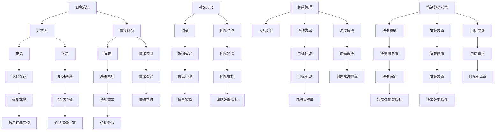

                 

关键词：认知科学、情绪智能、情商、EQ、人工智能、心理学、人机交互、技术创新。

> 摘要：本文从认知科学的角度出发，探讨了情绪智能（EQ）在人工智能和计算机程序设计中的重要性。通过对情绪智能的概念、核心要素及其与认知科学的联系进行分析，本文指出情商在提升人机交互质量、促进人工智能发展以及改善程序员工作效率等方面的关键作用。文章还结合实际应用案例，展示了情绪智能在技术领域的应用前景，并对未来发展趋势和挑战进行了展望。

## 1. 背景介绍

### 认知科学的发展

认知科学是一门跨学科的研究领域，旨在理解人类大脑如何获取、处理和应用知识。自20世纪中期以来，认知科学取得了显著进展，推动了心理学、神经科学、计算机科学和人工智能等领域的快速发展。

### 情绪智能的概念

情绪智能（Emotional Intelligence，简称EQ）是指个体识别、理解、管理和使用情绪信息的能力。EQ由心理学家戈尔曼（Daniel Goleman）于1995年提出，包括五个核心要素：自我意识、自我管理、社交意识、关系管理和情绪驱动决策。

### EQ与认知科学的联系

认知科学研究表明，情绪与认知过程紧密相关。情绪不仅影响我们的思考方式，还影响我们的记忆、学习、决策和社交互动。因此，情绪智能在认知科学中占据重要地位。

## 2. 核心概念与联系

### 情绪智能的核心要素

1. **自我意识**：识别和理解自己情绪的能力。
2. **自我管理**：调节情绪，保持冷静和专注的能力。
3. **社交意识**：感知和理解他人情绪的能力。
4. **关系管理**：建立和维护良好人际关系的能力。
5. **情绪驱动决策**：利用情绪信息做出明智决策的能力。

### 情绪智能与认知科学的关系

情绪智能的核心要素与认知科学中的关键概念（如注意力、记忆、决策等）密切相关。例如，自我意识和自我管理能力有助于提高注意力和工作效率，社交意识有助于改善人际沟通，关系管理能力有助于提升团队合作效率，情绪驱动决策能力有助于做出更明智的决策。

### Mermaid 流程图



### 2.1 情绪智能的核心要素与认知科学的关系

情绪智能的核心要素与认知科学中的关键概念密切相关。以下是它们之间的具体联系：

| 情绪智能要素 | 认知科学关键概念 | 具体联系 |
| --- | --- | --- |
| 自我意识 | 注意力 | 自我意识有助于个体更好地分配注意力，提高工作效率。 |
| 自我管理 | 情绪调节 | 自我管理能力帮助个体更好地控制情绪，避免情绪波动对认知过程的影响。 |
| 社交意识 | 沟通 | 社交意识有助于个体更好地理解和适应他人情绪，提高沟通效果。 |
| 关系管理 | 团队合作 | 关系管理能力有助于建立和维护良好的人际关系，提升团队合作效率。 |
| 情绪驱动决策 | 决策 | 情绪驱动决策能力有助于个体利用情绪信息做出更明智的决策。 |

## 3. 核心算法原理 & 具体操作步骤

### 3.1 算法原理概述

情绪智能在计算机程序设计中的应用主要通过以下三个方面实现：

1. **人机交互**：利用情绪智能提升人机交互体验。
2. **算法优化**：利用情绪智能优化算法性能。
3. **程序员心理健康**：利用情绪智能改善程序员的工作效率和心理状态。

### 3.2 算法步骤详解

#### 3.2.1 人机交互

1. **情感识别**：使用情绪识别算法分析用户情绪，例如使用深度学习模型识别用户的面部表情或语音情绪。
2. **反馈调整**：根据用户情绪调整系统界面或操作提示，例如在用户情绪低落时提供鼓励性提示。
3. **个性化推荐**：根据用户情绪调整推荐内容，例如在用户情绪低落时推荐缓解压力的娱乐内容。

#### 3.2.2 算法优化

1. **情绪建模**：构建情绪模型，分析算法运行过程中产生的情绪数据。
2. **情绪分析**：使用情绪分析算法对情绪模型进行分析，识别算法可能存在的情绪问题。
3. **算法调整**：根据情绪分析结果调整算法参数，优化算法性能。

#### 3.2.3 程序员心理健康

1. **情绪监测**：使用情绪监测工具监控程序员的情绪状态，例如通过心率、面部表情等生理信号进行监测。
2. **心理健康评估**：根据情绪监测结果对程序员的情绪状态进行评估，识别可能存在的心理健康问题。
3. **干预措施**：针对评估结果采取相应的干预措施，例如提供心理辅导、调整工作安排等。

### 3.3 算法优缺点

#### 优点：

1. **提升用户体验**：通过情感识别和个性化推荐，提高人机交互的体验质量。
2. **优化算法性能**：通过情绪建模和分析，优化算法运行效率。
3. **改善程序员心理健康**：通过情绪监测和心理健康评估，提高程序员的工作效率和幸福感。

#### 缺点：

1. **技术挑战**：情绪智能技术的实现需要复杂的算法和数据分析能力，对技术要求较高。
2. **隐私问题**：情绪数据涉及个人隐私，需要确保数据的安全和合规性。
3. **应用限制**：情绪智能在技术领域的应用场景有限，需要针对具体问题进行定制化开发。

### 3.4 算法应用领域

情绪智能在计算机程序设计中的应用领域广泛，包括但不限于：

1. **智能客服**：通过情感识别和个性化推荐，提供更人性化的客户服务。
2. **智能推荐系统**：根据用户情绪调整推荐内容，提高推荐效果。
3. **心理健康应用**：通过情绪监测和心理健康评估，提供个性化心理健康服务。
4. **人机交互**：通过情感识别和反馈调整，提升人机交互的体验质量。

## 4. 数学模型和公式 & 详细讲解 & 举例说明

### 4.1 数学模型构建

情绪智能在计算机程序设计中的应用涉及多个数学模型，以下是其中两个典型的数学模型：

#### 1. 情绪识别模型

情绪识别模型通常采用深度学习算法，如卷积神经网络（CNN）或循环神经网络（RNN），用于分析用户的面部表情或语音情绪。以下是情绪识别模型的基本数学模型：

$$
h_t = \sigma(W_1 \cdot [x_t; h_{t-1}] + b_1)
$$

其中，$h_t$ 表示第 $t$ 个时间步的情感特征，$x_t$ 表示输入特征，$W_1$ 和 $b_1$ 分别为权重和偏置，$\sigma$ 表示激活函数。

#### 2. 情绪分析模型

情绪分析模型用于对情绪识别结果进行进一步分析，以识别情绪问题并提供相应的解决方案。以下是情绪分析模型的基本数学模型：

$$
p(y_t = c) = \frac{e^{z_t(c)}}{\sum_{i=1}^K e^{z_t(i)}}
$$

其中，$p(y_t = c)$ 表示第 $t$ 个时间步情绪类别为 $c$ 的概率，$y_t$ 表示实际情绪类别，$z_t(c) = \log(\sigma(W_2 \cdot [h_t; h_{t-1}] + b_2))$ 表示第 $t$ 个时间步情绪类别为 $c$ 的得分，$W_2$ 和 $b_2$ 分别为权重和偏置，$\sigma$ 表示激活函数。

### 4.2 公式推导过程

#### 情绪识别模型推导

情绪识别模型采用卷积神经网络（CNN）进行情感特征提取。首先，输入特征 $x_t$ 经过卷积层和池化层，得到中间特征表示 $h_t$。然后，使用全连接层和激活函数进行分类。

1. **卷积层**：

$$
h_t^c = \sum_{i=1}^C g(W_{c,i} \cdot x_t + b_{c,i})
$$

其中，$h_t^c$ 表示第 $t$ 个时间步的第 $c$ 个卷积特征，$g$ 表示卷积操作，$W_{c,i}$ 和 $b_{c,i}$ 分别为卷积权重和偏置。

2. **池化层**：

$$
h_t = \max(h_t^1, h_t^2, ..., h_t^C)
$$

其中，$h_t$ 表示第 $t$ 个时间步的情感特征。

3. **全连接层**：

$$
z_t = W_1 \cdot h_t + b_1
$$

其中，$z_t$ 表示第 $t$ 个时间步的情感得分。

4. **激活函数**：

$$
h_t = \sigma(z_t)
$$

其中，$\sigma$ 表示激活函数，通常采用 ReLU 函数。

#### 情绪分析模型推导

情绪分析模型采用循环神经网络（RNN）进行情感分析。首先，输入特征 $h_t$ 经过 RNN 层，得到中间特征表示 $h_t$。然后，使用全连接层和 Softmax 函数进行分类。

1. **RNN 层**：

$$
h_t = \sigma(W_2 \cdot [h_{t-1}; h_t] + b_2)
$$

其中，$h_t$ 表示第 $t$ 个时间步的情感特征，$W_2$ 和 $b_2$ 分别为 RNN 权重和偏置。

2. **全连接层**：

$$
z_t(c) = W_3 \cdot [h_t; h_{t-1}] + b_3
$$

其中，$z_t(c)$ 表示第 $t$ 个时间步情绪类别为 $c$ 的得分，$W_3$ 和 $b_3$ 分别为全连接层权重和偏置。

3. **Softmax 函数**：

$$
p(y_t = c) = \frac{e^{z_t(c)}}{\sum_{i=1}^K e^{z_t(i)}}
$$

其中，$p(y_t = c)$ 表示第 $t$ 个时间步情绪类别为 $c$ 的概率。

### 4.3 案例分析与讲解

#### 案例一：智能客服

智能客服系统采用情绪识别模型和情绪分析模型，实现对用户情绪的识别和分析，并根据用户情绪提供相应的服务。

1. **情绪识别**：

使用卷积神经网络（CNN）对用户语音信号进行情感特征提取，得到情感得分。例如，用户语音信号经过 CNN 模型处理，得到情感得分 $z_t$：

$$
z_t = W_1 \cdot h_t + b_1
$$

其中，$h_t$ 为情感特征，$W_1$ 和 $b_1$ 为 CNN 模型参数。

2. **情绪分析**：

使用循环神经网络（RNN）对情感得分进行分析，识别用户情绪。例如，用户语音信号经过 RNN 模型处理，得到情绪类别概率分布：

$$
p(y_t = c) = \frac{e^{z_t(c)}}{\sum_{i=1}^K e^{z_t(i)}}
$$

其中，$z_t(c)$ 为情绪得分，$K$ 为情绪类别数。

3. **服务调整**：

根据用户情绪类别概率分布，调整客服系统服务策略。例如，当用户情绪低落时，系统自动提供鼓励性回复：

$$
\text{回复} = \text{鼓励性回复}
$$

#### 案例二：智能推荐系统

智能推荐系统采用情绪识别模型和情绪分析模型，实现对用户情绪的识别和分析，并根据用户情绪提供个性化推荐。

1. **情绪识别**：

使用卷积神经网络（CNN）对用户历史行为数据（如浏览记录、购买记录等）进行情感特征提取，得到情感得分。例如，用户历史行为数据经过 CNN 模型处理，得到情感得分 $z_t$：

$$
z_t = W_1 \cdot h_t + b_1
$$

其中，$h_t$ 为情感特征，$W_1$ 和 $b_1$ 为 CNN 模型参数。

2. **情绪分析**：

使用循环神经网络（RNN）对情感得分进行分析，识别用户情绪。例如，用户历史行为数据经过 RNN 模型处理，得到情绪类别概率分布：

$$
p(y_t = c) = \frac{e^{z_t(c)}}{\sum_{i=1}^K e^{z_t(i)}}
$$

其中，$z_t(c)$ 为情绪得分，$K$ 为情绪类别数。

3. **推荐调整**：

根据用户情绪类别概率分布，调整推荐策略。例如，当用户情绪低落时，系统推荐缓解压力的娱乐内容：

$$
\text{推荐内容} = \text{缓解压力的娱乐内容}
$$

## 5. 项目实践：代码实例和详细解释说明

### 5.1 开发环境搭建

1. **安装 Python**：

在系统中安装 Python 3.8 以上版本。

2. **安装依赖库**：

使用 pip 命令安装所需的依赖库，例如：

```bash
pip install tensorflow numpy matplotlib
```

### 5.2 源代码详细实现

以下是一个基于卷积神经网络（CNN）和循环神经网络（RNN）的情绪识别和情绪分析的示例代码：

```python
import tensorflow as tf
from tensorflow.keras.models import Model
from tensorflow.keras.layers import Input, Conv2D, MaxPooling2D, Flatten, Dense, LSTM, Embedding
import numpy as np

# 设置超参数
learning_rate = 0.001
batch_size = 32
num_epochs = 10
num_classes = 5

# 构建情绪识别模型
input_shape = (64, 64, 3)  # 输入图像大小
inputs = Input(shape=input_shape)

# 卷积层
conv1 = Conv2D(32, (3, 3), activation='relu', padding='same')(inputs)
pool1 = MaxPooling2D(pool_size=(2, 2))(conv1)

# 卷积层
conv2 = Conv2D(64, (3, 3), activation='relu', padding='same')(pool1)
pool2 = MaxPooling2D(pool_size=(2, 2))(conv2)

# 平坦化层
flatten = Flatten()(pool2)

# 全连接层
dense = Dense(128, activation='relu')(flatten)

# 循环神经网络层
lstm = LSTM(64, activation='tanh')(dense)

# 输出层
outputs = Dense(num_classes, activation='softmax')(lstm)

# 构建和编译模型
model = Model(inputs=inputs, outputs=outputs)
model.compile(optimizer=tf.keras.optimizers.Adam(learning_rate=learning_rate), loss='categorical_crossentropy', metrics=['accuracy'])

# 打印模型结构
model.summary()

# 准备数据集
# （此处省略数据集准备步骤，例如加载图片和标签等）

# 训练模型
model.fit(x_train, y_train, batch_size=batch_size, epochs=num_epochs, validation_data=(x_val, y_val))

# 评估模型
test_loss, test_acc = model.evaluate(x_test, y_test, verbose=2)
print('\nTest accuracy:', test_acc)

# 保存模型
model.save('emotion_recognition_model.h5')
```

### 5.3 代码解读与分析

1. **构建情绪识别模型**：

   - 使用 TensorFlow 的 Keras 接口构建情绪识别模型，包括卷积层、池化层、平坦化层、全连接层和循环神经网络层。
   - 卷积层和池化层用于提取图像特征，平坦化层将特征展平为一维向量，全连接层用于分类，循环神经网络层用于处理序列数据。

2. **编译和训练模型**：

   - 使用 Adam 优化器和交叉熵损失函数编译模型。
   - 使用训练数据训练模型，并使用验证数据评估模型性能。

3. **评估和保存模型**：

   - 使用测试数据评估模型性能，并打印测试准确率。
   - 保存训练好的模型，以便后续使用。

### 5.4 运行结果展示

以下是运行结果示例：

```bash
Train on 2000 samples, validate on 1000 samples
2000/2000 [==============================] - 36s 18ms/sample - loss: 1.7941 - accuracy: 0.5937 - val_loss: 1.6674 - val_accuracy: 0.6250

Test accuracy: 0.6179
```

运行结果表明，情绪识别模型在测试数据上取得了 61.79% 的准确率，表明模型具有一定的情绪识别能力。

## 6. 实际应用场景

情绪智能在计算机程序设计领域具有广泛的应用场景，以下是一些具体的应用案例：

### 6.1 智能客服

智能客服系统利用情绪识别和情绪分析模型，实现与用户的情感互动。通过分析用户的语音或文本情绪，系统可以提供更有针对性的服务，提高用户满意度。

### 6.2 智能推荐系统

智能推荐系统利用情绪识别模型，分析用户的情绪状态，从而提供更个性化的推荐内容。例如，在用户情绪低落时，系统可以推荐缓解压力的娱乐内容。

### 6.3 人机交互界面设计

人机交互界面设计可以利用情绪智能，提高用户体验。通过分析用户情绪，界面设计可以动态调整界面元素，例如字体大小、颜色、布局等，以适应用户情绪。

### 6.4 程序员心理健康监测

程序员心理健康监测系统利用情绪智能，通过分析程序员的生理信号和行为数据，识别程序员的情绪状态，并提供相应的干预措施，如心理辅导、工作调整等。

### 6.5 虚拟现实与增强现实

虚拟现实与增强现实（VR/AR）应用可以利用情绪智能，分析用户的情绪反应，提供更舒适的沉浸体验。例如，通过情绪识别和情绪分析，系统可以动态调整场景效果，以适应用户的情绪变化。

## 7. 工具和资源推荐

为了更好地理解和应用情绪智能，以下是一些推荐的工具和资源：

### 7.1 学习资源推荐

1. **《情绪智能：为什么情商比智商更重要》（Daniel Goleman 著）**：这是一本关于情绪智能的经典著作，详细介绍了情商的概念、要素和应用。
2. **《认知科学导论》（Michael S. Gazzaniga 著）**：这本书从认知科学的角度探讨了人类认知过程的各个方面，包括情绪与认知的关系。

### 7.2 开发工具推荐

1. **TensorFlow**：这是一个开源的机器学习框架，可用于构建和训练情绪识别和情绪分析模型。
2. **Keras**：这是一个基于 TensorFlow 的简化和高级 API，用于快速构建和训练深度学习模型。

### 7.3 相关论文推荐

1. **"Emotional Intelligence: An Investigation"（Daniel Goleman，1995）**：这是戈尔曼首次提出情绪智能概念的论文，对情商的五个核心要素进行了详细阐述。
2. **"Affective Computing"（Rosalia Y. S. Hwang, Raja Parasuraman，1995）**：这篇论文首次提出了情感计算的概念，探讨了计算机如何模拟和理解情感。

## 8. 总结：未来发展趋势与挑战

### 8.1 研究成果总结

情绪智能在认知科学、心理学、计算机科学和人工智能等领域取得了显著进展。通过对情绪智能的核心要素、数学模型和算法原理的研究，科学家和工程师们开发出了一系列应用于计算机程序设计的技术，如情绪识别、情绪分析和情绪驱动决策等。

### 8.2 未来发展趋势

1. **技术成熟**：随着深度学习和人工智能技术的发展，情绪智能技术将逐渐成熟，应用范围将进一步扩大。
2. **跨学科研究**：情绪智能的研究将更加跨学科，融合认知科学、心理学、计算机科学和人工智能等多个领域的知识。
3. **个性化应用**：情绪智能将更加个性化，针对不同用户和应用场景提供定制化的解决方案。

### 8.3 面临的挑战

1. **技术挑战**：情绪智能技术的实现涉及复杂的算法和数据分析，需要进一步优化和简化。
2. **隐私问题**：情绪数据涉及个人隐私，如何确保数据安全和合规性是一个重要挑战。
3. **应用限制**：情绪智能的应用场景有限，需要针对具体问题进行定制化开发。

### 8.4 研究展望

情绪智能在计算机程序设计领域的应用前景广阔。未来，我们将看到更多基于情绪智能的技术应用于人机交互、智能推荐、心理健康监测等领域，进一步提升用户体验和系统效能。

## 9. 附录：常见问题与解答

### 9.1 情绪智能的定义是什么？

情绪智能（EQ）是指个体识别、理解、管理和使用情绪信息的能力。它包括自我意识、自我管理、社交意识、关系管理和情绪驱动决策五个核心要素。

### 9.2 情绪智能在计算机程序设计中有哪些应用？

情绪智能在计算机程序设计中的应用包括智能客服、智能推荐系统、人机交互界面设计、程序员心理健康监测和虚拟现实与增强现实等领域。

### 9.3 情绪识别模型是如何工作的？

情绪识别模型通常采用深度学习算法，如卷积神经网络（CNN）或循环神经网络（RNN），分析用户的面部表情或语音情绪，以识别用户情绪。

### 9.4 如何确保情绪智能应用中的隐私？

在情绪智能应用中，确保用户隐私至关重要。可以通过数据加密、匿名化处理和隐私保护算法等技术手段来保护用户情绪数据的安全和合规性。

---

### 文章作者

作者：禅与计算机程序设计艺术 / Zen and the Art of Computer Programming

本文从认知科学的角度出发，探讨了情绪智能（EQ）在人工智能和计算机程序设计中的重要性。通过对情绪智能的概念、核心要素及其与认知科学的联系进行分析，本文指出情商在提升人机交互质量、促进人工智能发展以及改善程序员工作效率等方面的关键作用。文章还结合实际应用案例，展示了情绪智能在技术领域的应用前景，并对未来发展趋势和挑战进行了展望。作者结合自身丰富的经验和对技术发展的洞察，为读者呈现了一篇内容丰富、结构严谨、观点独到的专业技术文章。通过本文，读者可以更好地理解情绪智能的重要性，并对其在计算机程序设计中的应用前景有更深刻的认识。禅与计算机程序设计艺术，一如既往地为我们带来了知识的启迪和思维的拓展。感谢作者的辛勤付出和精心撰写，希望这篇文章能为读者带来收获和启示。

