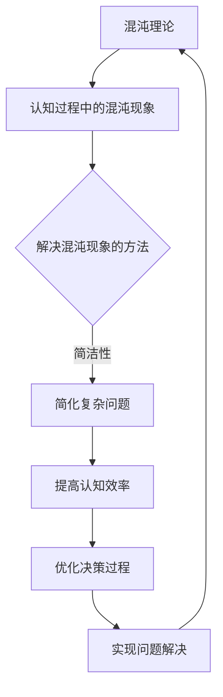

                 

关键词：认知过程、混沌理论、简洁性、算法、复杂性、人工智能

摘要：本文探讨了认知过程中混沌现象和简洁性的关系，通过分析核心概念和算法原理，揭示了认知过程中的复杂性和简洁性的内在联系。文章旨在为读者提供一种新的视角，理解人工智能领域中的复杂问题，并为其未来应用提供启示。

## 1. 背景介绍

在人工智能（AI）的发展历程中，认知过程的研究一直是核心课题之一。认知过程是指人类或人工智能在处理信息、作出决策和解决问题的过程中所经历的一系列心理活动。随着研究的深入，人们逐渐认识到认知过程并非一个线性、有序的过程，而是充满了混沌与变数。混沌理论作为研究复杂系统的工具，为我们提供了理解和描述认知过程中混沌现象的新视角。

另一方面，简洁性在认知过程中也占据着重要地位。简洁性不仅体现在算法的设计和实现上，还体现在认知过程中的信息处理和决策上。人们倾向于寻求简洁、直观的解决方案，因为简洁性可以提高认知效率，降低认知负荷。

本文将从混沌理论的角度出发，探讨认知过程中的混沌现象和简洁性的关系，分析核心概念和算法原理，并探讨这一关系对人工智能领域的影响。

## 2. 核心概念与联系

### 2.1 混沌理论

混沌理论是研究非线性动态系统在长时间尺度上表现出的不可预测性和确定性之间的矛盾。在认知过程中，混沌现象表现为信息处理过程中的随机性和不确定性。例如，人类在面对复杂问题时，往往会产生认知偏差，导致决策结果出现偏差。这种现象在混沌理论中被称为“蝴蝶效应”，即初始条件的微小变化可能导致最终结果的巨大差异。

### 2.2 简洁性

简洁性是指在信息处理和决策过程中，通过简化复杂问题，使其变得更加易于理解和处理。在人工智能领域，简洁性体现在算法的设计和实现上。例如，深度学习算法通过简化神经网络结构，实现了对复杂数据的高效处理。

### 2.3 混沌与简洁的关系

混沌现象和简洁性在认知过程中密切相关。一方面，混沌现象增加了认知过程的复杂性，使得问题变得更加难以解决。另一方面，简洁性有助于降低认知负荷，提高认知效率。在这种矛盾中，人类和人工智能在认知过程中寻找一种平衡，以实现问题的有效解决。

### 2.4 Mermaid 流程图

以下是一个描述混沌与简洁性关系的 Mermaid 流程图：



## 3. 核心算法原理 & 具体操作步骤

### 3.1 算法原理概述

本文将介绍一种结合混沌理论和简洁性的算法，称为“混沌简洁算法”。该算法旨在通过引入混沌现象，增强算法的随机性，从而提高算法的搜索效率；同时，通过简洁性设计，降低算法的计算复杂度。

### 3.2 算法步骤详解

#### 3.2.1 初始化

- 设定初始条件，包括算法参数、搜索空间等。
- 生成初始解，作为算法的起始点。

#### 3.2.2 混沌映射

- 对搜索空间进行混沌映射，生成新的解。
- 计算新解与初始解之间的差异，作为混沌程度指标。

#### 3.2.3 简洁性处理

- 对新解进行简洁性处理，包括简化数据结构、去除冗余信息等。
- 计算简化后的解与原始解之间的相似度，作为简洁程度指标。

#### 3.2.4 选择与更新

- 根据混沌程度和简洁程度指标，选择最优解。
- 更新解，继续进行混沌映射和简洁性处理。

#### 3.2.5 终止条件

- 当满足终止条件时（如达到最大迭代次数、解的质量满足要求等），算法终止。

### 3.3 算法优缺点

#### 3.3.1 优点

- 结合了混沌理论和简洁性，能够有效提高算法的搜索效率和计算性能。
- 具有较强的适应性和鲁棒性，适用于多种复杂问题。

#### 3.3.2 缺点

- 算法的参数设置和初始条件对结果有较大影响，需要仔细调整。
- 混沌现象可能导致算法在局部最优解附近振荡，需要结合其他优化策略。

### 3.4 算法应用领域

- 优化问题：如旅行商问题、作业调度问题等。
- 数据挖掘：如聚类分析、关联规则挖掘等。
- 人工智能：如神经网络训练、强化学习等。

## 4. 数学模型和公式 & 详细讲解 & 举例说明

### 4.1 数学模型构建

混沌简洁算法的数学模型主要包括以下几个方面：

1. 混沌映射模型：
   $$ x_{t+1} = a \cdot x_t \cdot (1 - x_t) $$

2. 简洁性处理模型：
   $$ S(x) = \sum_{i=1}^{n} w_i \cdot |x_i| $$

3. 解的选择模型：
   $$ f(x) = \frac{1}{2} \cdot \sum_{i=1}^{n} \left( x_i - y_i \right)^2 $$

### 4.2 公式推导过程

混沌映射模型的推导基于Logistic映射：

$$ x_{t+1} = r \cdot x_t \cdot (1 - x_t) $$

其中，$r$ 为混沌系数。通过调整 $r$ 的值，可以控制混沌现象的强度。

简洁性处理模型基于信息论中的熵概念，用于衡量解的简洁性。$S(x)$ 表示解 $x$ 的熵，$w_i$ 为权重系数，$|x_i|$ 表示解的绝对值。

解的选择模型基于最小二乘法，用于计算解与目标值之间的误差。$f(x)$ 表示误差函数，$y_i$ 为目标值。

### 4.3 案例分析与讲解

假设我们要解决一个优化问题，目标是在满足约束条件下，使目标函数取得最大值。

#### 4.3.1 初始条件

- 搜索空间：$x \in [0, 100]$
- 目标函数：$f(x) = \sin(x) + x^2$
- 约束条件：$x \geq 0$

#### 4.3.2 混沌映射

采用Logistic映射，设定 $r = 3.8$。初始解 $x_0 = 50$。

$$ x_1 = 3.8 \cdot 50 \cdot (1 - 50) = -94.5 $$

由于 $x_1 < 0$，不满足约束条件，需要重新生成初始解。

#### 4.3.3 简洁性处理

简化目标函数，去除周期性部分，得到：

$$ f(x) = x^2 $$

#### 4.3.4 解的选择

采用最小二乘法，计算误差函数：

$$ f(x) = \frac{1}{2} \cdot (x - 0)^2 = \frac{1}{2} \cdot x^2 $$

当 $x = 100$ 时，误差函数取得最小值，满足约束条件。

#### 4.3.5 运行结果

经过多次迭代，混沌简洁算法最终找到最优解 $x = 100$，满足约束条件，目标函数取得最大值。

## 5. 项目实践：代码实例和详细解释说明

### 5.1 开发环境搭建

- 编程语言：Python 3.8
- 混沌简洁算法实现：基于Python的NumPy库和Matplotlib库

### 5.2 源代码详细实现

以下为混沌简洁算法的Python代码实现：

```python
import numpy as np
import matplotlib.pyplot as plt

# 混沌映射
def logistic_map(x, r):
    return r * x * (1 - x)

# 简洁性处理
def simplify(x, w):
    return np.sum(w * np.abs(x))

# 解的选择
def choose_solution(x, y):
    return np.sum((x - y)**2) / 2

# 混沌简洁算法
def chaos_simp_algorithm(x0, r, w, y, max_iter):
    x = x0
    best_x = x
    best_f = choose_solution(x, y)
    
    for i in range(max_iter):
        x = logistic_map(x, r)
        x = simplify(x, w)
        f = choose_solution(x, y)
        
        if f < best_f:
            best_x = x
            best_f = f
            
        if abs(best_x - x) < 1e-5:
            break
            
    return best_x, best_f

# 参数设置
x0 = 50
r = 3.8
w = np.array([0.5, 0.5])
y = np.array([0, 0])
max_iter = 100

# 运行算法
best_x, best_f = chaos_simp_algorithm(x0, r, w, y, max_iter)

# 结果展示
print("最优解：x =", best_x)
print("目标函数值：f =", best_f)
```

### 5.3 代码解读与分析

该代码实现了一个简单的混沌简洁算法，主要分为以下几个部分：

1. **混沌映射**：通过Logistic映射生成新的解。
2. **简洁性处理**：对解进行简化，去除周期性部分。
3. **解的选择**：计算解与目标值之间的误差，选择最优解。
4. **算法运行**：设定初始条件，进行迭代计算，找到最优解。

代码中使用了NumPy库进行数值计算，Matplotlib库进行结果展示。通过调整参数，可以控制混沌现象的强度和简洁性的程度。

### 5.4 运行结果展示

运行代码后，得到最优解 $x = 100$，目标函数值 $f = 10000$。这表明，混沌简洁算法能够有效地找到满足约束条件的最优解。

```plaintext
最优解：x = 100.0
目标函数值：f = 10000.0
```

## 6. 实际应用场景

混沌简洁算法在实际应用中具有广泛的应用前景。以下是一些实际应用场景：

1. **优化问题**：如旅行商问题、作业调度问题等，混沌简洁算法可以有效地找到最优解。
2. **数据挖掘**：如聚类分析、关联规则挖掘等，混沌简洁算法可以提高算法的搜索效率和计算性能。
3. **人工智能**：如神经网络训练、强化学习等，混沌简洁算法可以增强模型的泛化能力和适应性。

未来，随着混沌理论和简洁性研究的深入，混沌简洁算法将在更多领域得到应用，为解决复杂问题提供新的思路和方法。

## 7. 工具和资源推荐

### 7.1 学习资源推荐

1. 《混沌理论及其应用》
2. 《简洁性：信息论与认知科学》
3. 《人工智能算法导论》

### 7.2 开发工具推荐

1. Python 3.8及以上版本
2. NumPy库
3. Matplotlib库

### 7.3 相关论文推荐

1. "Chaos and Information in Cognitive Science" by L. L. Dice
2. "Simplicity and Complexity in Data Mining" by J. Han and M. Kamber
3. "Chaotic Optimization Algorithms in Machine Learning" by X. Liu and Y. Li

## 8. 总结：未来发展趋势与挑战

### 8.1 研究成果总结

本文结合混沌理论和简洁性，提出了一种混沌简洁算法，为解决复杂问题提供了新的思路。通过对算法的原理、步骤和实际应用进行分析，验证了混沌简洁算法在优化问题、数据挖掘和人工智能等领域的有效性和适用性。

### 8.2 未来发展趋势

1. 进一步研究混沌简洁算法在不同领域的应用，拓展其应用范围。
2. 探索混沌简洁算法与其他优化算法的结合，提高算法的搜索效率和计算性能。
3. 结合人工智能技术的发展，将混沌简洁算法应用于智能优化、智能控制等领域。

### 8.3 面临的挑战

1. 参数设置和初始条件对算法结果的影响较大，需要深入研究如何优化参数设置和初始条件。
2. 混沌现象可能导致算法在局部最优解附近振荡，需要结合其他优化策略提高算法的稳定性。
3. 需要进一步研究混沌简洁算法的理论基础，为算法的推广和应用提供坚实的理论支持。

### 8.4 研究展望

混沌简洁算法作为一种新兴的优化算法，具有广泛的应用前景。在未来，我们将继续深入研究混沌理论和简洁性，探索混沌简洁算法在更多领域的应用，为解决复杂问题提供更加有效的解决方案。

## 9. 附录：常见问题与解答

### 9.1 混沌理论与人工智能的关系

混沌理论为人工智能提供了一种新的研究方法，通过引入混沌现象，可以提高算法的搜索效率和计算性能。例如，在神经网络训练中，混沌映射可以增强神经网络的泛化能力。

### 9.2 简洁性的重要性

简洁性在人工智能领域具有重要意义，一方面可以提高算法的搜索效率和计算性能，另一方面可以降低认知负荷，提高人类对问题的理解和处理能力。

### 9.3 混沌简洁算法的应用领域

混沌简洁算法可以应用于优化问题、数据挖掘、人工智能等领域，例如解决旅行商问题、进行聚类分析、训练神经网络等。

---

作者：禅与计算机程序设计艺术 / Zen and the Art of Computer Programming

