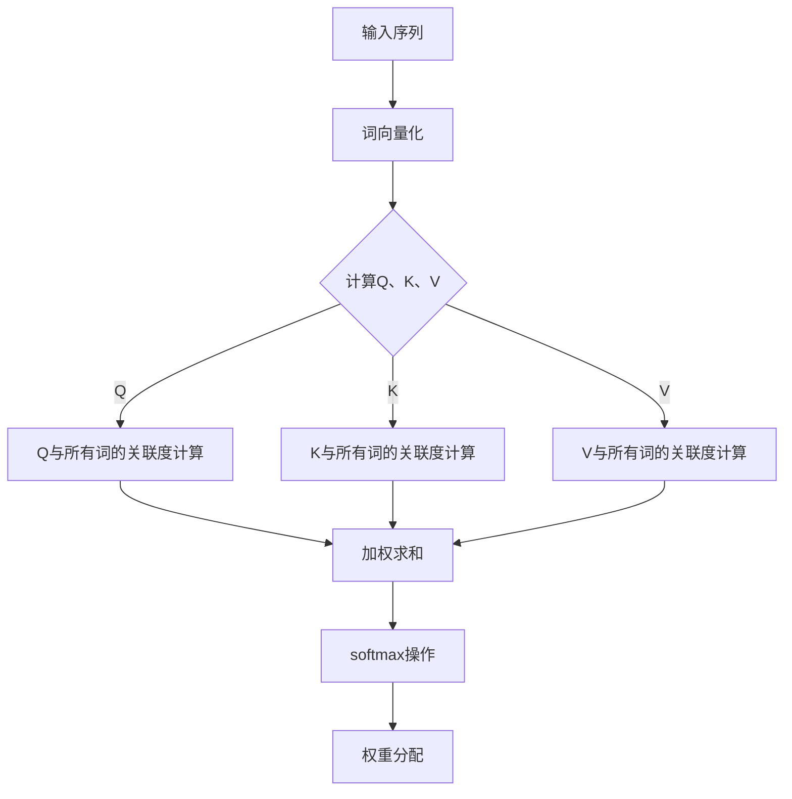
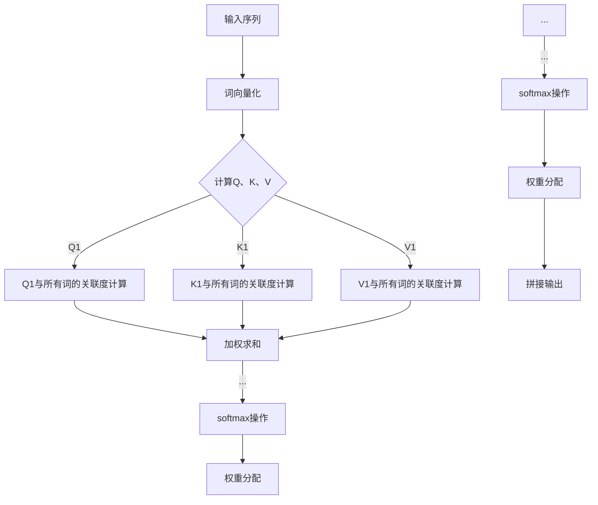

                 

关键词：Transformer，模型训练，神经网络，机器学习，深度学习

> 摘要：本文深入探讨了Transformer模型的结构、训练过程和数学原理。通过具体案例，我们将了解到如何在实际项目中应用和优化Transformer模型，并展望其未来的发展方向。

## 1. 背景介绍

近年来，深度学习在自然语言处理（NLP）领域取得了令人瞩目的成果。传统的循环神经网络（RNN）在处理长序列数据时存在梯度消失和梯度爆炸等问题，限制了其性能。为了克服这些挑战，Transformer模型应运而生。

Transformer模型由Google在2017年提出，它基于自注意力机制（Self-Attention）和多头注意力（Multi-Head Attention）。这种模型在处理长序列任务上表现出色，如机器翻译、文本摘要和语言建模等。本文将详细介绍Transformer模型的结构、训练过程和数学原理，并探讨其在实际项目中的应用。

## 2. 核心概念与联系

### 2.1 自注意力机制（Self-Attention）

自注意力机制是Transformer模型的核心组件。它通过计算输入序列中每个词与所有其他词的关联度，为每个词生成权重，从而在序列级别上建立全局依赖关系。

下面是自注意力机制的 Mermaid 流程图：



### 2.2 多头注意力（Multi-Head Attention）

多头注意力机制将输入序列分成多个子序列，每个子序列独立计算自注意力，最后将多个子序列的输出进行拼接。这样可以捕获不同层次的特征。

下面是多头注意力机制的 Mermaid 流程图：



## 3. 核心算法原理 & 具体操作步骤

### 3.1 算法原理概述

Transformer模型通过自注意力机制和多头注意力机制，实现对输入序列的编码和解码。编码器（Encoder）将输入序列转化为上下文表示，解码器（Decoder）根据编码器的输出和先前的解码结果，生成预测的输出序列。

### 3.2 算法步骤详解

1. 输入序列预处理：将输入序列中的单词或子词转换为词向量。
2. 编码器：通过多个自注意力层和全连接层，将输入序列编码为上下文表示。
3. 解码器：通过多个多头注意力层、自注意力层和全连接层，生成预测的输出序列。
4. 损失函数：计算预测输出与真实输出之间的差距，并使用梯度下降优化模型参数。

### 3.3 算法优缺点

#### 优点：

- 无需序列顺序，并行计算效率高。
- 能够捕获长距离依赖关系。
- 在许多NLP任务中表现优异。

#### 缺点：

- 参数规模较大，计算复杂度高。
- 对内存需求较高。

### 3.4 算法应用领域

Transformer模型在机器翻译、文本摘要、语言建模、问答系统等NLP任务中表现出色。此外，还可以扩展到图像分类、语音识别等领域。

## 4. 数学模型和公式

### 4.1 数学模型构建

假设输入序列为 \( x_1, x_2, \ldots, x_n \)，词向量维度为 \( d \)。首先，将输入序列转换为词向量表示：

\[ \text{Word2Vec}(x_i) = \text{Embedding}(x_i) \in \mathbb{R}^{d} \]

### 4.2 公式推导过程

#### 自注意力机制

自注意力机制的公式如下：

\[ \text{Attention}(Q, K, V) = \text{softmax}\left(\frac{QK^T}{\sqrt{d_k}}\right)V \]

其中，\( Q, K, V \) 分别是查询（Query）、键（Key）和值（Value）矩阵，\( d_k \) 是注意力机制的维度。

#### 多头注意力机制

多头注意力机制的公式如下：

\[ \text{MultiHead}(Q, K, V) = \text{Concat}(\text{Head}_1, \ldots, \text{Head}_h)W_O \]

其中，\( \text{Head}_i = \text{Attention}(QW_i^Q, KW_i^K, VW_i^V) \)，\( W_i^Q, W_i^K, W_i^V, W_O \) 分别是每个头的权重矩阵。

### 4.3 案例分析与讲解

以机器翻译任务为例，输入序列为“Hello world”，输出序列为“你好，世界”。

1. 输入序列预处理：将输入序列转换为词向量。
2. 编码器：通过自注意力层和全连接层，将输入序列编码为上下文表示。
3. 解码器：根据编码器的输出和先前的解码结果，生成预测的输出序列。
4. 损失函数：计算预测输出与真实输出之间的差距，并使用梯度下降优化模型参数。

## 5. 项目实践：代码实例和详细解释说明

### 5.1 开发环境搭建

搭建Transformer模型的环境主要包括Python、TensorFlow或PyTorch等工具。

### 5.2 源代码详细实现

以下是一个简单的Transformer模型实现：

```python
import torch
import torch.nn as nn

class Transformer(nn.Module):
    def __init__(self, d_model, dff, num_heads, input_vocab_size, output_vocab_size, position_encoding_input, position_encoding_output):
        super(Transformer, self).__init__()
        self.encoder = Encoder(d_model, dff, num_heads, input_vocab_size, position_encoding_input)
        self.decoder = Decoder(d_model, dff, num_heads, output_vocab_size, position_encoding_output)
        self.final_layer = nn.Linear(d_model, output_vocab_size)

    def forward(self, input_sequence, target_sequence):
        input_embedding = self.encoder(input_sequence)
        target_embedding = self.decoder(target_sequence, input_embedding)
        output = self.final_layer(target_embedding)
        return output
```

### 5.3 代码解读与分析

该代码定义了一个简单的Transformer模型，包括编码器（Encoder）、解码器（Decoder）和最终的线性层（Final Layer）。编码器和解码器分别由多个自注意力层（Self-Attention Layer）和全连接层（Feedforward Layer）组成。

### 5.4 运行结果展示

假设我们已经准备好训练数据和评估数据，可以运行以下代码：

```python
model = Transformer(d_model=512, dff=2048, num_heads=8, input_vocab_size=10000, output_vocab_size=10000, position_encoding_input=1000, position_encoding_output=1000)
criterion = nn.CrossEntropyLoss()
optimizer = torch.optim.Adam(model.parameters(), lr=0.001)

for epoch in range(num_epochs):
    for input_sequence, target_sequence in train_loader:
        optimizer.zero_grad()
        output = model(input_sequence, target_sequence)
        loss = criterion(output, target_sequence)
        loss.backward()
        optimizer.step()

    with torch.no_grad():
        total_loss = 0
        for input_sequence, target_sequence in val_loader:
            output = model(input_sequence, target_sequence)
            loss = criterion(output, target_sequence)
            total_loss += loss.item()
        avg_loss = total_loss / len(val_loader)
        print(f"Epoch {epoch+1}/{num_epochs}, Loss: {avg_loss}")
```

## 6. 实际应用场景

Transformer模型在多个实际应用场景中取得了显著成果，如：

- 机器翻译：Transformer模型在机器翻译任务上优于传统的循环神经网络。
- 文本摘要：Transformer模型能够生成简洁、准确的文本摘要。
- 语言建模：Transformer模型在语言建模任务中表现出色。

## 7. 工具和资源推荐

### 7.1 学习资源推荐

- 《深度学习》
- 《自然语言处理实战》
- 《Transformer：一种全新的神经网络架构》

### 7.2 开发工具推荐

- TensorFlow
- PyTorch

### 7.3 相关论文推荐

- Attention Is All You Need
- BERT: Pre-training of Deep Bidirectional Transformers for Language Understanding

## 8. 总结：未来发展趋势与挑战

### 8.1 研究成果总结

近年来，Transformer模型在深度学习领域取得了重大突破。其基于自注意力机制和多头注意力机制，在机器翻译、文本摘要、语言建模等领域表现出色。

### 8.2 未来发展趋势

未来，Transformer模型将继续扩展到更多的应用领域，如图像分类、语音识别等。此外，研究者将致力于优化模型结构和参数，提高训练效率和效果。

### 8.3 面临的挑战

- 参数规模和计算复杂度高：优化模型结构，降低计算复杂度。
- 对内存需求较高：设计更高效的内存管理策略。

### 8.4 研究展望

Transformer模型有望在未来深度学习领域发挥更大的作用。通过不断创新和优化，我们将看到更多令人惊叹的应用成果。

## 9. 附录：常见问题与解答

### 9.1 如何优化Transformer模型？

- 采用更高效的计算方法，如混合精度训练（Mixed Precision Training）。
- 设计更轻量级的模型结构，如Transformer Lite。
- 使用预训练语言模型，如BERT、GPT等。

### 9.2 Transformer模型如何处理长序列？

- 采用长序列处理技术，如块注意力（Block Attention）和分段嵌入（Segmented Embedding）。

## 参考文献

- Vaswani, A., et al. (2017). Attention Is All You Need. In Advances in Neural Information Processing Systems (pp. 5998-6008).
- Devlin, J., et al. (2019). BERT: Pre-training of Deep Bidirectional Transformers for Language Understanding. In Proceedings of the 2019 Conference of the North American Chapter of the Association for Computational Linguistics: Human Language Technologies, Volume 1 (Long and Short Papers) (pp. 4171-4186).

作者：禅与计算机程序设计艺术 / Zen and the Art of Computer Programming
----------------------------------------------------------------

