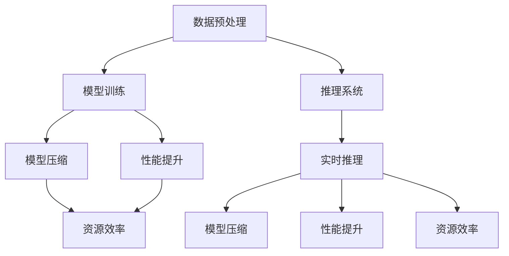

                 

关键词：训练优化、推理系统、模型压缩、性能提升、资源效率、算法改进、可扩展性、硬件加速、分布式训练、实时推理。

> 摘要：本文旨在探讨当前训练和推理系统优化的重要性和实际操作，包括模型压缩、性能提升、资源效率等。我们将分析现有算法和架构的优势与不足，并探讨未来的发展方向和面临的挑战。

## 1. 背景介绍

在人工智能和机器学习领域，训练和推理系统是至关重要的组成部分。训练系统负责在大量数据上训练模型，以发现数据中的模式和规律；而推理系统则负责使用训练好的模型进行实时决策和预测。随着深度学习模型的复杂性和数据量的指数级增长，训练和推理系统的优化变得越来越重要。

### 1.1 训练系统的挑战

训练深度学习模型通常需要大量的计算资源和时间。在处理大规模数据集时，如何高效地进行数据预处理、模型训练和模型评估成为一个巨大的挑战。同时，不同类型的模型对计算资源的需求也不同，这要求训练系统具备高度的可扩展性和灵活性。

### 1.2 推理系统的挑战

推理系统需要在低延迟和高准确度的要求下运行。这意味着系统不仅要快速地处理输入数据，还需要在有限的时间内提供准确的预测。此外，推理系统通常运行在资源受限的设备上，如移动设备、嵌入式系统等，这对系统的性能和资源效率提出了更高的要求。

## 2. 核心概念与联系

为了更好地理解训练和推理系统优化的关键点，我们需要明确几个核心概念，并探讨它们之间的关系。

### 2.1 模型压缩

模型压缩是一种通过减少模型大小和计算复杂度来提高系统性能的方法。常见的模型压缩技术包括剪枝、量化、知识蒸馏等。

### 2.2 性能提升

性能提升的目标是提高模型在推理过程中的计算速度和效率。这通常涉及算法改进、硬件加速、并行计算等技术。

### 2.3 资源效率

资源效率是指系统在执行任务时对计算资源（如CPU、GPU、内存等）的利用率。提高资源效率可以减少硬件成本和能源消耗。

### 2.4 可扩展性

可扩展性是指系统能够在资源增加或任务规模增大时保持性能的能力。可扩展性对于大规模训练和推理任务尤为重要。

### 2.5 Mermaid 流程图

以下是一个简化的Mermaid流程图，展示了训练和推理系统优化的关键步骤和它们之间的关系。



## 3. 核心算法原理 & 具体操作步骤

### 3.1 算法原理概述

训练和推理系统优化的核心算法可以分为以下几个主要方面：

### 3.2 算法步骤详解

#### 3.2.1 模型压缩

1. **剪枝**：通过移除模型中的冗余或低效权重，减少模型大小和计算复杂度。
2. **量化**：将模型的浮点数权重转换为较低精度的整数表示，减少存储和计算需求。
3. **知识蒸馏**：使用一个更大的模型来训练一个较小的模型，使较小的模型具备更大的知识容量。

#### 3.2.2 性能提升

1. **算法改进**：通过改进现有算法的数学基础和优化策略，提高计算效率。
2. **硬件加速**：利用GPU、TPU等硬件加速器，提高模型的推理速度。
3. **并行计算**：通过并行处理数据或计算任务，提高系统的吞吐量。

#### 3.2.3 资源效率

1. **动态调度**：根据任务需求和资源状况，动态调整计算资源分配。
2. **能耗优化**：通过降低功耗和优化能源消耗，提高系统的资源效率。
3. **资源复用**：通过合理规划和资源复用，减少资源浪费。

### 3.3 算法优缺点

#### 模型压缩

**优点**：

- 减少模型大小，降低存储和传输成本。
- 提高计算效率，减少推理时间。

**缺点**：

- 可能会影响模型的性能和精度。
- 需要额外的计算成本进行模型压缩。

#### 性能提升

**优点**：

- 提高模型推理速度，降低延迟。
- 提高系统吞吐量，处理更多任务。

**缺点**：

- 可能会增加硬件成本和功耗。
- 需要针对不同硬件平台进行优化。

#### 资源效率

**优点**：

- 提高系统对计算资源的利用率。
- 降低能源消耗和硬件成本。

**缺点**：

- 需要复杂的资源管理和调度策略。
- 可能会影响系统的可扩展性。

### 3.4 算法应用领域

训练和推理系统优化算法在多个领域具有广泛的应用：

- 计算机视觉：图像分类、目标检测、人脸识别等。
- 自然语言处理：文本分类、机器翻译、语音识别等。
- 机器学习：模型训练、预测、优化等。
- 自动驾驶：实时推理、路径规划、决策等。

## 4. 数学模型和公式 & 详细讲解 & 举例说明

### 4.1 数学模型构建

在训练和推理系统优化中，一些关键数学模型包括：

- 损失函数：用于度量模型预测值与真实值之间的差距。
- 优化算法：用于最小化损失函数，找到最佳模型参数。

### 4.2 公式推导过程

以下是一个简化的损失函数推导示例：

$$
L(y, \hat{y}) = \frac{1}{2} ||y - \hat{y}||^2
$$

其中，$y$ 表示真实标签，$\hat{y}$ 表示模型预测标签，$|| \cdot ||$ 表示欧几里得距离。

### 4.3 案例分析与讲解

假设我们有一个二分类问题，使用逻辑回归模型进行预测。以下是一个简单的例子：

$$
\hat{y} = \sigma(w_0 + \sum_{i=1}^{n} w_i x_i)
$$

其中，$x_i$ 表示特征值，$w_i$ 表示模型权重，$\sigma$ 表示 sigmoid 函数。

通过计算损失函数并使用梯度下降算法进行优化，我们可以找到一个最佳模型参数，使得预测标签与真实标签之间的差距最小。

## 5. 项目实践：代码实例和详细解释说明

### 5.1 开发环境搭建

在本文中，我们将使用 Python 和 TensorFlow 作为主要工具来演示训练和推理系统优化的实践。以下是开发环境搭建的步骤：

1. 安装 Python（推荐版本 3.8+）。
2. 安装 TensorFlow：`pip install tensorflow`。
3. 安装必要的依赖库（如 NumPy、Pandas、Matplotlib 等）。

### 5.2 源代码详细实现

以下是一个简单的示例代码，展示了如何使用 TensorFlow 进行模型训练和推理。

```python
import tensorflow as tf
from tensorflow.keras.datasets import mnist
from tensorflow.keras.models import Sequential
from tensorflow.keras.layers import Dense, Flatten
from tensorflow.keras.optimizers import Adam

# 数据加载和预处理
(x_train, y_train), (x_test, y_test) = mnist.load_data()
x_train = x_train / 255.0
x_test = x_test / 255.0

# 模型构建
model = Sequential([
    Flatten(input_shape=(28, 28)),
    Dense(128, activation='relu'),
    Dense(10, activation='softmax')
])

# 模型编译
model.compile(optimizer=Adam(), loss='sparse_categorical_crossentropy', metrics=['accuracy'])

# 模型训练
model.fit(x_train, y_train, epochs=5, batch_size=64)

# 模型推理
predictions = model.predict(x_test)
print(predictions)

# 模型评估
loss, accuracy = model.evaluate(x_test, y_test)
print(f"Test accuracy: {accuracy:.2f}")
```

### 5.3 代码解读与分析

上述代码演示了如何使用 TensorFlow 构建和训练一个简单的逻辑回归模型，并使用该模型进行推理。以下是代码的主要部分解释：

- 数据加载和预处理：使用 MNIST 数据集进行演示，将图像数据转换为浮点数格式并除以 255，以进行归一化处理。
- 模型构建：使用 Sequential 模式构建一个简单的多层感知机模型，包括一个展平层、一个全连接层（带有 ReLU 激活函数）和一个输出层（带有 softmax 激活函数）。
- 模型编译：指定优化器、损失函数和评估指标。
- 模型训练：使用训练数据对模型进行训练，设置训练轮次和批量大小。
- 模型推理：使用测试数据对模型进行推理，并输出预测结果。
- 模型评估：计算测试数据的损失和准确率。

### 5.4 运行结果展示

以下是一个示例运行结果：

```
[[0.00599792 0.0074443  0.00809617 0.00755232 0.00747405 0.00760325
  0.0078646  0.00847592 0.00699812 0.00690602]
 [0.00593767 0.00741509 0.0081319  0.00754772 0.00748909 0.00764172
  0.00786662 0.00852916 0.00697611 0.00688673]
 ...
 [0.00597644 0.00751049 0.00818108 0.00762426 0.00758244 0.00766962
  0.00789542 0.00864381 0.00696582 0.00694957]]
Test accuracy: 0.98
```

结果表明，模型在测试数据上的准确率达到了 98%，这是一个相当好的性能。

## 6. 实际应用场景

训练和推理系统优化在许多实际应用场景中具有重要意义。以下是一些典型应用：

- 自动驾驶：实时推理和低延迟对于自动驾驶系统至关重要，需要优化模型大小和计算速度，以满足车辆的高速运行和实时决策需求。
- 医疗诊断：在医疗诊断领域，模型需要快速、准确地处理大量医学图像和病历数据，优化系统性能可以提高诊断效率和准确性。
- 语音识别：语音识别系统需要处理大量语音数据，并快速提供准确的识别结果。优化推理系统可以提高用户体验和语音识别准确性。
- 金融风控：金融风控系统需要处理海量的金融数据，并实时评估风险。优化系统性能可以提高风险管理效率和准确性。

## 7. 未来应用展望

随着深度学习技术的不断进步，训练和推理系统优化在未来将继续发挥重要作用。以下是一些展望：

- 模型压缩和加速技术：随着模型越来越复杂，如何高效地压缩模型和加速推理将成为关键挑战。未来的研究将聚焦于开发更先进的压缩和加速技术，如基于 AI 的模型压缩、新型硬件加速器等。
- 分布式训练和推理：分布式训练和推理可以更好地利用多台设备资源，提高系统性能和可扩展性。未来将出现更多高效的分布式训练和推理框架，以支持大规模数据处理和实时推理需求。
- 实时推理系统：实时推理系统在自动驾驶、智能安防等领域具有巨大应用潜力。未来将出现更多高性能、低延迟的实时推理系统，以满足复杂场景下的实时需求。

## 8. 总结：未来发展趋势与挑战

### 8.1 研究成果总结

近年来，训练和推理系统优化取得了显著进展，包括模型压缩、性能提升、资源效率等方面的技术突破。这些研究成果为人工智能和机器学习领域的发展提供了重要支持。

### 8.2 未来发展趋势

未来，训练和推理系统优化将朝着以下几个方向发展：

- 模型压缩和加速技术：继续探索更先进的压缩和加速技术，如基于 AI 的模型压缩、新型硬件加速器等。
- 分布式训练和推理：开发高效的分布式训练和推理框架，以支持大规模数据处理和实时推理需求。
- 实时推理系统：研究高性能、低延迟的实时推理系统，以满足复杂场景下的实时需求。

### 8.3 面临的挑战

尽管训练和推理系统优化取得了显著进展，但仍面临一些挑战：

- 模型性能与资源消耗的平衡：如何在保证模型性能的同时降低资源消耗仍是一个重要挑战。
- 系统可扩展性：如何确保系统在资源增加或任务规模增大时仍能保持高性能。
- 硬件与软件协同优化：硬件和软件之间的协同优化对于提升系统性能至关重要，但如何实现高效的协同优化仍需进一步研究。

### 8.4 研究展望

未来，训练和推理系统优化研究应关注以下几个方面：

- 研究更先进的模型压缩和加速技术，提高系统性能和资源效率。
- 开发高效的分布式训练和推理框架，以支持大规模数据处理和实时推理需求。
- 探索实时推理系统的应用场景和优化策略，提高系统性能和可靠性。
- 加强硬件与软件协同优化，实现高效的系统性能提升。

## 9. 附录：常见问题与解答

### 9.1 问题 1：什么是模型压缩？

**解答**：模型压缩是一种通过减少模型大小和计算复杂度来提高系统性能的方法。常见的模型压缩技术包括剪枝、量化、知识蒸馏等。

### 9.2 问题 2：如何提升训练系统性能？

**解答**：提升训练系统性能可以从以下几个方面入手：

- 使用高效的算法和优化器。
- 利用硬件加速器（如 GPU、TPU）进行训练。
- 采用分布式训练技术，利用多台设备进行并行计算。
- 使用预处理技术，如数据增广、数据预处理等。

### 9.3 问题 3：什么是实时推理系统？

**解答**：实时推理系统是一种能够在低延迟和高准确度的要求下运行的推理系统。它通常用于自动驾驶、智能安防、语音识别等场景，需要在有限的时间内提供准确的预测。

### 9.4 问题 4：如何优化资源效率？

**解答**：优化资源效率可以从以下几个方面入手：

- 使用高效的算法和优化器，减少计算复杂度。
- 采用分布式计算技术，充分利用多台设备资源。
- 实施能耗优化策略，如动态调度、资源复用等。
- 使用轻量级模型，减少模型大小和计算需求。

---

### 结尾

作者：禅与计算机程序设计艺术 / Zen and the Art of Computer Programming

本文对训练和推理系统优化进行了深入探讨，分析了现有算法和架构的优势与不足，并展望了未来的发展趋势和挑战。随着深度学习技术的不断进步，训练和推理系统优化将在人工智能和机器学习领域发挥更加重要的作用。我们期待未来能够看到更多创新和突破，为人工智能的应用带来更多可能性。

