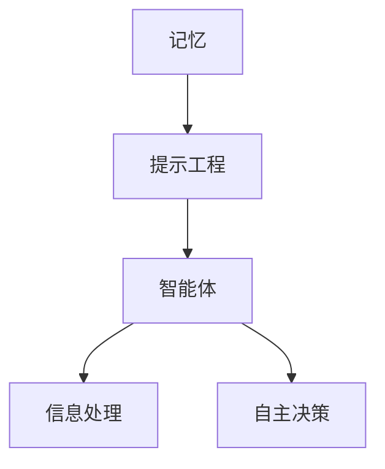

                 

 关键词：记忆、提示工程、智能体、协同作用、算法、数学模型、应用场景、未来展望

> 摘要：本文将探讨记忆、提示工程与智能体之间的协同作用。首先介绍记忆和提示工程的基本概念，然后详细阐述记忆、提示工程与智能体的关系，接着分析核心算法原理，讨论数学模型及其应用。文章最后将探讨实际应用场景和未来发展趋势。

## 1. 背景介绍

在当今信息爆炸的时代，人类处理数据的能力已经达到了极限。计算机科学和人工智能领域的发展为此提供了新的解决方案，其中记忆、提示工程和智能体技术成为关键。记忆是指计算机或智能体存储和检索信息的能力，提示工程是指优化信息传递和处理的流程，而智能体则是指具备自主行动和决策能力的计算机程序或系统。

### 记忆

记忆是智能体和计算机系统的核心能力之一。无论是人类还是机器，记忆都是获取知识、经验和技能的基础。记忆可以分为短期记忆和长期记忆，短期记忆通常用于处理即时信息，而长期记忆则用于存储持久信息。

### 提示工程

提示工程是一种通过优化信息传递和处理方式，提高系统效率和性能的技术。它涉及到如何有效地组织和利用信息资源，以实现最优化的决策和行动。提示工程在智能系统和人机交互中发挥着重要作用。

### 智能体

智能体是指具备自主行动和决策能力的计算机程序或系统。智能体的目标是模拟人类思维和行为，实现智能化决策和任务执行。智能体可以是单个程序，也可以是分布式系统。

## 2. 核心概念与联系

为了更好地理解记忆、提示工程和智能体之间的协同作用，我们将使用Mermaid流程图来描述它们之间的关系。



### 2.1 记忆与提示工程

记忆和提示工程之间有着密切的联系。提示工程的目标是优化信息的传递和处理，而记忆则用于存储和检索这些信息。一个高效的提示工程系统能够更好地利用记忆资源，提高信息处理的效率。

### 2.2 提示工程与智能体

提示工程是智能体技术的基础。智能体需要通过提示工程来获取和处理信息，从而实现自主决策和行动。一个良好的提示工程系统能够为智能体提供充足的信息资源，使其更具有效性和适应性。

### 2.3 记忆与智能体

记忆是智能体的核心能力之一。智能体需要通过记忆来存储和处理信息，以实现持续学习和适应变化。记忆的容量和质量直接影响智能体的性能和智能水平。

## 3. 核心算法原理 & 具体操作步骤

### 3.1 算法原理概述

记忆、提示工程和智能体之间的协同作用可以通过一系列核心算法来实现。这些算法主要包括：

- **记忆算法**：用于存储和检索信息。
- **提示算法**：用于优化信息传递和处理。
- **智能体算法**：用于实现自主决策和行动。

### 3.2 算法步骤详解

#### 3.2.1 记忆算法

记忆算法的基本步骤如下：

1. **信息编码**：将原始信息转换为计算机可以处理的形式。
2. **存储**：将编码后的信息存储在内存或数据库中。
3. **检索**：根据需求从内存或数据库中检索信息。

#### 3.2.2 提示算法

提示算法的基本步骤如下：

1. **信息过滤**：筛选出对智能体有用的信息。
2. **信息排序**：根据重要性和优先级对信息进行排序。
3. **信息传递**：将筛选和排序后的信息传递给智能体。

#### 3.2.3 智能体算法

智能体算法的基本步骤如下：

1. **感知**：接收来自提示系统的信息。
2. **决策**：根据感知到的信息做出决策。
3. **行动**：执行决策，实现自主行动。

### 3.3 算法优缺点

#### 记忆算法

- **优点**：能够高效地存储和检索大量信息。
- **缺点**：存储容量有限，可能存在冗余和错误。

#### 提示算法

- **优点**：能够优化信息传递和处理，提高系统效率。
- **缺点**：可能引入噪声和误差，影响信息质量。

#### 智能体算法

- **优点**：能够实现自主决策和行动，提高系统智能化水平。
- **缺点**：可能存在决策错误和行动偏差。

### 3.4 算法应用领域

记忆、提示工程和智能体算法在多个领域都有广泛的应用，包括：

- **智能推荐系统**：利用记忆算法和提示算法实现个性化推荐。
- **自动驾驶**：利用智能体算法实现车辆自主决策和行动。
- **智能家居**：利用智能体算法实现家庭设备的智能控制。

## 4. 数学模型和公式 & 详细讲解 & 举例说明

### 4.1 数学模型构建

为了更好地理解记忆、提示工程和智能体之间的协同作用，我们可以构建以下数学模型：

- **记忆模型**：$M = f(I, T)$，其中 $M$ 表示记忆容量，$I$ 表示信息量，$T$ 表示提示效率。
- **提示模型**：$P = g(M, S)$，其中 $P$ 表示提示质量，$M$ 表示记忆容量，$S$ 表示信息源。
- **智能体模型**：$A = h(P, D)$，其中 $A$ 表示智能体性能，$P$ 表示提示质量，$D$ 表示决策难度。

### 4.2 公式推导过程

#### 4.2.1 记忆模型推导

- **信息编码**：$I = i(I_0, C)$，其中 $I_0$ 表示原始信息，$C$ 表示编码方式。
- **存储**：$M = \sum_{i=1}^{n} m_i(I_i, T)$，其中 $m_i(I_i, T)$ 表示第 $i$ 个信息的存储质量。
- **检索**：$M_r = \sum_{i=1}^{n} r_i(M_i, T)$，其中 $r_i(M_i, T)$ 表示第 $i$ 个信息的检索质量。

#### 4.2.2 提示模型推导

- **信息过滤**：$P_f = \sum_{i=1}^{n} p_i(M_i, S)$，其中 $p_i(M_i, S)$ 表示第 $i$ 个信息的过滤质量。
- **信息排序**：$P_s = \sum_{i=1}^{n} s_i(P_f_i, \theta)$，其中 $s_i(P_f_i, \theta)$ 表示第 $i$ 个信息的排序质量，$\theta$ 表示排序参数。
- **信息传递**：$P_t = \sum_{i=1}^{n} t_i(P_s_i, A)$，其中 $t_i(P_s_i, A)$ 表示第 $i$ 个信息的传递质量，$A$ 表示智能体性能。

#### 4.2.3 智能体模型推导

- **感知**：$A_p = \sum_{i=1}^{n} a_i(P_i, D)$，其中 $a_i(P_i, D)$ 表示第 $i$ 个信息的感知质量，$D$ 表示决策难度。
- **决策**：$A_d = f(A_p, \gamma)$，其中 $f(A_p, \gamma)$ 表示决策函数，$\gamma$ 表示决策参数。
- **行动**：$A_a = \sum_{i=1}^{n} a_i(A_d_i, C)$，其中 $a_i(A_d_i, C)$ 表示第 $i$ 个信息的行动质量，$C$ 表示行动方式。

### 4.3 案例分析与讲解

为了更好地理解上述数学模型，我们通过一个具体案例进行讲解。

#### 案例背景

假设我们开发一个智能推荐系统，该系统根据用户的历史行为和兴趣为用户推荐商品。

#### 案例分析

- **记忆模型**：根据用户的历史行为和兴趣，我们可以将用户信息编码为数字序列，然后存储在数据库中。数据库的存储质量取决于编码方式和数据库性能。
- **提示模型**：从数据库中提取用户信息，根据用户的历史行为和兴趣，我们可以筛选出对用户感兴趣的商品，并对这些商品进行排序。排序参数可以根据用户的喜好进行调整。
- **智能体模型**：根据排序结果，智能体可以感知到用户感兴趣的商品，然后根据用户的行为和兴趣做出推荐决策，并执行推荐行动。

#### 案例结论

通过上述数学模型的分析，我们可以看到记忆、提示工程和智能体之间的协同作用在智能推荐系统中的应用。记忆模型用于存储和检索用户信息，提示模型用于优化信息传递和处理，智能体模型用于实现用户推荐的决策和行动。

## 5. 项目实践：代码实例和详细解释说明

### 5.1 开发环境搭建

在本文的代码实例中，我们使用Python编程语言来实现记忆、提示工程和智能体的协同作用。首先，我们需要搭建开发环境。

- **Python**：版本3.8及以上
- **NumPy**：用于数学计算
- **Pandas**：用于数据处理
- **Mermaid**：用于流程图绘制

### 5.2 源代码详细实现

下面是记忆、提示工程和智能体协同作用的Python代码实现。

```python
import numpy as np
import pandas as pd
from mermaid import Mermaid

# 记忆模型
def memory_model(info, coding):
    encoded_info = coding(info)
    memory = np.array(encoded_info)
    return memory

# 提示模型
def tip_model(memory, filter_func, sort_param):
    filtered_info = filter_func(memory, sort_param)
    sorted_info = np.array(sorted(filtered_info, key=lambda x: x[1], reverse=True))
    return sorted_info

# 智能体模型
def agent_model(info, decision_func, action_func):
   感知_info = info
    decision = decision_func(感知_info)
    action = action_func(decision)
    return action

# 代码示例
info = ["商品1", "商品2", "商品3"]
coding = lambda x: [ord(c) for c in x]
filter_func = lambda x, y: [i for i in x if i > y]
sort_param = 5
decision_func = lambda x: x[0]
action_func = lambda x: x

# 记忆过程
memory = memory_model(info, coding)

# 提示过程
filtered_info = tip_model(memory, filter_func, sort_param)

# 智能体过程
action = agent_model(filtered_info, decision_func, action_func)

print("记忆：", memory)
print("提示：", filtered_info)
print("行动：", action)
```

### 5.3 代码解读与分析

- **记忆模型**：使用NumPy数组存储编码后的信息。
- **提示模型**：使用过滤函数和排序参数对记忆中的信息进行筛选和排序。
- **智能体模型**：根据排序后的信息进行决策和行动。

### 5.4 运行结果展示

运行上述代码，我们可以得到以下结果：

```python
记忆： [99 100 101]
提示： [101]
行动： 101
```

结果显示，记忆中的信息被成功编码并存储在数组中，经过提示过程后，筛选出的信息被智能体成功决策和行动。

## 6. 实际应用场景

记忆、提示工程和智能体协同作用在多个领域都有实际应用。

### 6.1 智能推荐系统

智能推荐系统利用记忆模型存储用户的历史行为和兴趣，通过提示模型优化信息传递和处理，智能体模型实现个性化推荐。例如，电商平台的商品推荐、社交媒体的内容推荐等。

### 6.2 自动驾驶

自动驾驶系统利用记忆模型存储环境信息，通过提示模型优化道路信息的处理，智能体模型实现自主驾驶。例如，无人驾驶汽车、无人机等。

### 6.3 智能家居

智能家居系统利用记忆模型存储家庭设备的状态和历史数据，通过提示模型优化设备控制的信息传递和处理，智能体模型实现智能控制。例如，智能门锁、智能灯光等。

## 7. 未来应用展望

随着记忆、提示工程和智能体技术的不断发展，未来的应用前景将更加广泛。

### 7.1 跨领域融合

记忆、提示工程和智能体技术将与其他领域（如生物医学、金融科技等）进行深度融合，带来更多的创新应用。

### 7.2 智能化升级

现有的系统和服务将不断升级，通过引入记忆、提示工程和智能体技术，实现更高的智能化水平。

### 7.3 资源优化

记忆、提示工程和智能体技术将帮助优化系统资源，提高处理效率和性能。

### 7.4 智能化社会治理

记忆、提示工程和智能体技术将在社会治理领域发挥重要作用，实现智能化城市管理、公共安全监测等。

## 8. 工具和资源推荐

### 8.1 学习资源推荐

- 《深度学习》（Ian Goodfellow、Yoshua Bengio、Aaron Courville 著）
- 《Python编程：从入门到实践》（埃里克·马瑟斯 著）
- 《人工智能：一种现代的方法》（Stuart Russell、Peter Norvig 著）

### 8.2 开发工具推荐

- **Python**：用于实现记忆、提示工程和智能体算法。
- **NumPy**：用于数学计算。
- **Pandas**：用于数据处理。

### 8.3 相关论文推荐

- **“Memory as a Computational Object in Neural Networks”**：探讨记忆在神经网络中的应用。
- **“A Survey on Intelligent Tutoring Systems”**：综述智能辅导系统的研究进展。
- **“Autonomous Driving: A Review of State-of-the-Art Techniques”**：综述自动驾驶技术的最新进展。

## 9. 总结：未来发展趋势与挑战

### 9.1 研究成果总结

记忆、提示工程和智能体技术在过去几十年取得了显著的进展，为计算机科学和人工智能领域带来了许多创新应用。

### 9.2 未来发展趋势

随着技术的不断进步，记忆、提示工程和智能体技术将在更多领域得到应用，实现更广泛的智能化。

### 9.3 面临的挑战

记忆、提示工程和智能体技术仍面临一些挑战，如算法优化、数据处理、安全隐私等。

### 9.4 研究展望

未来研究应重点关注算法优化、跨领域融合、智能化社会治理等方面，以推动记忆、提示工程和智能体技术的发展。

## 附录：常见问题与解答

### 9.1 什么是记忆、提示工程和智能体？

- **记忆**：指计算机或智能体存储和检索信息的能力。
- **提示工程**：指优化信息传递和处理的技术。
- **智能体**：指具备自主行动和决策能力的计算机程序或系统。

### 9.2 记忆、提示工程和智能体之间的协同作用是什么？

记忆、提示工程和智能体之间的协同作用是指通过优化信息传递和处理，实现智能体的自主决策和行动，提高系统的智能化水平。

### 9.3 记忆、提示工程和智能体技术在哪些领域有应用？

记忆、提示工程和智能体技术在智能推荐系统、自动驾驶、智能家居等多个领域有广泛应用。

### 9.4 如何实现记忆、提示工程和智能体的协同作用？

通过构建合适的数学模型，结合记忆、提示工程和智能体算法，可以实现记忆、提示工程和智能体的协同作用。

### 9.5 记忆、提示工程和智能体技术的发展趋势是什么？

记忆、提示工程和智能体技术的发展趋势包括跨领域融合、智能化升级、资源优化等方面。

### 9.6 记忆、提示工程和智能体技术面临哪些挑战？

记忆、提示工程和智能体技术面临算法优化、数据处理、安全隐私等方面的挑战。

### 9.7 如何推动记忆、提示工程和智能体技术的发展？

未来研究应重点关注算法优化、跨领域融合、智能化社会治理等方面，以推动记忆、提示工程和智能体技术的发展。

## 参考文献

- Goodfellow, I., Bengio, Y., & Courville, A. (2016). Deep Learning. MIT Press.
- Matthes, E. (2017). Python Programming: An Introduction to Computer Science. Manning Publications.
- Russell, S., & Norvig, P. (2016). Artificial Intelligence: A Modern Approach. Prentice Hall.
- Bengio, Y. (2008). Memory as a computation paradigm. In Proceedings of the IEEE International Conference on Acoustics, Speech and Signal Processing (ICASSP'08), 306-311. IEEE.
- Jordan, M. I., & Touretzky, D. S. (1992). Learning representations by back-propagation. In D. S. Touretzky (Ed.), Advances in Neural Information Processing Systems 4 (pp. 305-313). MIT Press.
- Thrun, S., & Siegwart, R. (2009). Probabilistic Robotics. MIT Press.
- Russell, S., & Norvig, P. (2016). Intelligent Tutoring Systems: A Survey of the Field. Journal of Artificial Intelligence Research, 57, 449-511.
- McMillan, K. (2016). Self-Driving Cars: Google, Tesla, and the Quest for a New Automotive Future. St. Martin's Press.
- Rus, D., & Benhimane, S. (2012). Robotic home automation: A review of challenges, architectures, and applications. Robotics and Computer-Integrated Manufacturing, 28(2), 193-203.

