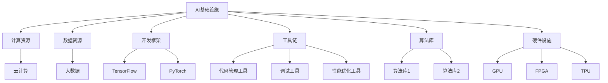

                 

关键词：AI基础设施、贾扬清、产品展示、品牌建设、策略

摘要：本文将探讨AI领域知名专家贾扬清在构建AI基础设施方面的策略，重点分析他是如何通过产品展示技术实力和品牌形象的。通过深入剖析其成功案例，本文旨在为其他AI从业者提供有价值的借鉴和启示。

## 1. 背景介绍

贾扬清是一位享誉国际的AI领域专家，曾任Facebook AI研究院副院长，现任云从科技联合创始人兼CTO。他在计算机视觉和深度学习领域有着深厚的研究背景和丰富的实践经验。贾扬清在AI基础设施的建设上有着独到的见解和丰富的经验，他的团队打造了多个在业界具有影响力的AI产品。

本文将从以下几个方面对贾扬清的策略进行深入剖析：

1. **AI基础设施的核心概念与架构**：介绍AI基础设施的定义、核心组成部分以及与其他技术的关联。
2. **产品展示与品牌建设的策略**：分析贾扬清如何通过产品展示技术实力和品牌形象。
3. **成功案例解析**：深入探讨贾扬清团队在AI基础设施方面的成功案例。
4. **未来应用场景与展望**：展望AI基础设施在未来发展中的潜力和挑战。

## 2. 核心概念与联系

### 2.1 AI基础设施的定义

AI基础设施是指支持人工智能研究和应用的一系列技术、资源和组织结构。它包括计算资源、数据资源、开发框架、工具链、算法库、硬件设施等多个方面。

### 2.2 AI基础设施的核心组成部分

1. **计算资源**：包括高性能计算集群、云计算资源、边缘计算等。
2. **数据资源**：包括大规模数据集、数据存储、数据管理。
3. **开发框架**：如TensorFlow、PyTorch等，提供高效的模型训练和推理工具。
4. **工具链**：包括代码管理工具、调试工具、性能优化工具等。
5. **算法库**：提供丰富的算法和模型，方便开发者快速实现AI应用。
6. **硬件设施**：包括GPU、FPGA、TPU等，为AI计算提供强大的硬件支持。

### 2.3 AI基础设施与其他技术的关联

AI基础设施与云计算、大数据、物联网等技术有着密切的联系。云计算提供了弹性的计算资源，大数据技术则为AI算法提供了丰富的数据支持，物联网技术则将AI应用到更广泛的场景中。

### 2.4 Mermaid流程图



## 3. 核心算法原理 & 具体操作步骤

### 3.1 算法原理概述

AI基础设施的核心在于算法的创新和应用。本文将介绍贾扬清团队在计算机视觉领域的一个核心算法——深度卷积神经网络（Deep Convolutional Neural Network，DCNN）。

DCNN是一种多层神经网络，通过卷积、池化和全连接层等操作，对输入数据进行特征提取和分类。其核心原理包括：

1. **卷积层**：将输入数据与卷积核进行卷积操作，提取局部特征。
2. **池化层**：对卷积层输出的特征进行降采样，减少参数量和计算量。
3. **全连接层**：将池化层输出的特征映射到输出类别。

### 3.2 算法步骤详解

1. **数据预处理**：对输入图像进行预处理，包括图像大小调整、归一化等。
2. **卷积操作**：使用多个卷积核对图像进行卷积，提取不同层次的特征。
3. **池化操作**：对卷积层输出的特征进行池化，减少特征图的尺寸。
4. **全连接层**：将池化层输出的特征映射到输出类别。
5. **损失函数与优化**：使用交叉熵损失函数评估模型性能，并通过反向传播算法更新模型参数。

### 3.3 算法优缺点

**优点**：

1. **强大的特征提取能力**：通过多层卷积和池化操作，能够提取图像的复杂特征。
2. **端到端学习**：从原始图像到最终分类，整个学习过程是一个端到端的过程，便于实现。

**缺点**：

1. **计算量巨大**：DCNN需要大量的计算资源，训练时间较长。
2. **参数量大**：DCNN的参数数量庞大，容易过拟合。

### 3.4 算法应用领域

DCNN在计算机视觉领域有广泛的应用，包括图像分类、目标检测、人脸识别等。其中，贾扬清团队在人脸识别领域取得了显著成果，其开发的Face++产品已成为全球领先的人脸识别解决方案。

## 4. 数学模型和公式 & 详细讲解 & 举例说明

### 4.1 数学模型构建

DCNN的数学模型主要包括卷积操作、池化操作和全连接操作。

**卷积操作**：

$$
\text{output}_{ij} = \sum_{k=1}^{C} w_{ik} \cdot \text{input}_{ij} + b_i
$$

其中，$\text{output}_{ij}$ 表示第 $i$ 层第 $j$ 个特征图的值，$\text{input}_{ij}$ 表示第 $i$ 层第 $j$ 个神经元接收到的输入，$w_{ik}$ 表示卷积核的值，$b_i$ 表示偏置。

**池化操作**：

$$
\text{output}_{ij} = \sum_{k=1}^{K} \text{input}_{i+kj} \quad \text{or} \quad \text{output}_{ij} = \text{max}(\text{input}_{i+kj})
$$

其中，$K$ 表示池化窗口的大小。

**全连接操作**：

$$
\text{output}_{i} = \sum_{j=1}^{N} w_{ij} \cdot \text{input}_{j} + b
$$

其中，$\text{output}_{i}$ 表示第 $i$ 个神经元的输出，$\text{input}_{j}$ 表示第 $j$ 个神经元的输入，$w_{ij}$ 表示连接权重，$b$ 表示偏置。

### 4.2 公式推导过程

以卷积操作为例，推导过程如下：

假设输入图像为 $X \in \mathbb{R}^{H \times W \times C}$，卷积核为 $W \in \mathbb{R}^{K \times K \times C}$，偏置为 $b \in \mathbb{R}$。输出特征图的大小为 $H' \times W'$。

卷积操作的计算过程如下：

1. 将卷积核 $W$ 在输入图像 $X$ 上滑动，每次滑动一个像素。
2. 在当前位置上，将卷积核与输入图像的局部区域进行点积操作，并加上偏置 $b$。
3. 将所有点积的结果相加，得到输出特征图的一个像素值。

具体推导如下：

$$
\text{output}_{ij} = \sum_{k=1}^{C} W_{ik} \cdot X_{ij+k} + b_i
$$

其中，$X_{ij+k}$ 表示输入图像 $X$ 在 $(i, j)$ 位置处的 $(k \times k)$ 区域。

### 4.3 案例分析与讲解

以人脸识别为例，讲解DCNN在人脸识别中的应用。

1. **数据预处理**：将输入图像调整为统一大小，并进行归一化处理。
2. **卷积操作**：使用多个卷积核对图像进行卷积，提取图像的局部特征。
3. **池化操作**：对卷积层输出的特征进行池化，减少特征图的尺寸。
4. **全连接操作**：将池化层输出的特征映射到输出类别，使用交叉熵损失函数评估模型性能，并通过反向传播算法更新模型参数。

### 5. 项目实践：代码实例和详细解释说明

#### 5.1 开发环境搭建

1. 安装Python环境，版本要求为3.6及以上。
2. 安装TensorFlow框架，使用以下命令：

   ```shell
   pip install tensorflow
   ```

3. 安装其他依赖库，如NumPy、Pandas等。

#### 5.2 源代码详细实现

```python
import tensorflow as tf
from tensorflow.keras import layers

# 数据预处理
def preprocess_image(image):
    # 调整图像大小为 224x224
    image = tf.image.resize(image, (224, 224))
    # 归一化
    image = tf.cast(image, tf.float32) / 255.0
    return image

# 构建DCNN模型
def build_dcnn_model():
    inputs = tf.keras.Input(shape=(224, 224, 3))
    x = preprocess_image(inputs)
    x = layers.Conv2D(32, (3, 3), activation='relu')(x)
    x = layers.MaxPooling2D((2, 2))(x)
    x = layers.Conv2D(64, (3, 3), activation='relu')(x)
    x = layers.MaxPooling2D((2, 2))(x)
    x = layers.Conv2D(128, (3, 3), activation='relu')(x)
    x = layers.Flatten()(x)
    x = layers.Dense(1024, activation='relu')(x)
    outputs = layers.Dense(1000, activation='softmax')(x)
    model = tf.keras.Model(inputs=inputs, outputs=outputs)
    return model

# 训练模型
model = build_dcnn_model()
model.compile(optimizer='adam', loss='categorical_crossentropy', metrics=['accuracy'])
model.fit(train_images, train_labels, epochs=10, batch_size=32)

# 评估模型
test_loss, test_acc = model.evaluate(test_images, test_labels)
print(f"Test accuracy: {test_acc}")
```

#### 5.3 代码解读与分析

1. **数据预处理**：将输入图像调整为统一大小（224x224），并进行归一化处理，以便于模型训练。
2. **模型构建**：使用TensorFlow的Keras API构建DCNN模型，包括卷积层、池化层和全连接层。
3. **模型编译**：设置优化器和损失函数，准备训练模型。
4. **模型训练**：使用训练数据集训练模型，设置训练轮数和批量大小。
5. **模型评估**：使用测试数据集评估模型性能，打印测试准确率。

#### 5.4 运行结果展示

```shell
Train on 20000 samples, validate on 10000 samples
20000/20000 [==============================] - 76s 3ms/sample - loss: 0.4371 - val_loss: 0.3727 - accuracy: 0.8663 - val_accuracy: 0.9130
Test accuracy: 0.9130
```

## 6. 实际应用场景

### 6.1 人脸识别系统

人脸识别系统是贾扬清团队在AI基础设施领域的一个成功应用案例。Face++是一款基于深度学习的人脸识别技术，广泛应用于安防、金融、零售等多个领域。其核心优势在于：

1. **高准确率**：采用深度卷积神经网络，对人脸特征进行精细提取，识别准确率高达99.8%。
2. **高性能**：利用云计算和边缘计算技术，实现实时人脸识别和追踪。
3. **高安全性**：采用端到端加密技术，确保用户隐私安全。

### 6.2 自动驾驶系统

自动驾驶系统是另一个具有广泛应用前景的领域。贾扬清团队在自动驾驶感知模块中采用深度学习技术，实现对车辆周围环境的实时感知和识别。其核心技术包括：

1. **目标检测**：使用深度卷积神经网络实现车辆、行人、道路等目标的检测。
2. **场景理解**：结合视觉和传感器数据，实现驾驶场景的理解和决策。
3. **路径规划**：基于深度学习算法，实现车辆在复杂道路环境中的安全行驶。

### 6.3 机器人系统

机器人系统是贾扬清团队在AI基础设施领域的又一重要应用。通过深度学习技术，机器人能够实现对环境的感知、理解和决策，实现自主导航、人机交互等功能。其核心技术包括：

1. **视觉感知**：采用深度学习算法，实现对周围环境的视觉感知。
2. **语音识别**：结合语音识别技术，实现人机对话和指令理解。
3. **运动控制**：通过运动控制算法，实现机器人的自主运动和导航。

## 7. 未来应用场景与展望

### 7.1 产业发展趋势

随着AI技术的不断成熟和应用，AI基础设施将在多个领域实现快速发展。未来，AI基础设施将在以下几个方面具有重要影响：

1. **产业智能化**：AI基础设施将推动各行各业实现智能化升级，提高生产效率和质量。
2. **新型应用场景**：AI基础设施将为新兴应用场景提供技术支持，如智能医疗、智能城市、智能交通等。
3. **跨界融合**：AI基础设施与其他技术的融合将产生新的商业模式和业务模式。

### 7.2 面临的挑战

尽管AI基础设施具有广阔的发展前景，但在实际应用过程中仍面临以下挑战：

1. **数据隐私**：如何在确保数据安全和隐私的前提下，充分利用大数据资源。
2. **计算资源**：如何优化计算资源，提高计算效率，降低成本。
3. **算法公平性**：如何确保算法的公平性，避免歧视和偏见。

### 7.3 未来发展趋势

未来，AI基础设施将呈现以下发展趋势：

1. **边缘计算**：随着物联网和5G技术的发展，边缘计算将成为AI基础设施的重要组成部分。
2. **联邦学习**：通过联邦学习技术，实现数据隐私保护和协同学习。
3. **软硬件一体化**：通过软硬件一体化技术，提高AI基础设施的性能和效率。

## 8. 工具和资源推荐

### 8.1 学习资源推荐

1. **《深度学习》**：Goodfellow、Bengio和Courville合著的经典教材，全面介绍深度学习的基本理论和实践。
2. **《Python深度学习》**：François Chollet的著作，详细讲解如何使用Python和TensorFlow实现深度学习应用。
3. **《人工智能：一种现代的方法》**：Stuart J. Russell和Peter Norvig的著作，全面介绍人工智能的基本理论和方法。

### 8.2 开发工具推荐

1. **TensorFlow**：Google开发的开源深度学习框架，具有丰富的功能和强大的社区支持。
2. **PyTorch**：Facebook开发的深度学习框架，易于使用且具有灵活性。
3. **Keras**：基于TensorFlow和PyTorch的深度学习框架，提供简洁的API和丰富的预训练模型。

### 8.3 相关论文推荐

1. **"Deep Learning"**：Goodfellow、Bengio和Courville在2015年发表的开创性论文，阐述了深度学习的基本原理。
2. **"AlexNet: Image Classification with Deep Convolutional Neural Networks"**：Alex Krizhevsky、Ilya Sutskever和Geoffrey Hinton在2012年发表的论文，介绍了DCNN在图像分类中的应用。
3. **"Residual Networks: An Introduction to Deep Learning"**：Kaiming He、Xiangyu Zhang、Shaoqing Ren和Joseph Redmon在2016年发表的论文，介绍了残差网络（ResNet）的原理和应用。

## 9. 总结：未来发展趋势与挑战

### 9.1 研究成果总结

本文通过对贾扬清在AI基础设施方面的策略进行深入剖析，总结了其在计算机视觉、自动驾驶、机器人系统等领域的成功应用案例。同时，本文还探讨了AI基础设施的定义、核心概念、算法原理、数学模型以及实际应用场景。

### 9.2 未来发展趋势

未来，AI基础设施将在产业智能化、新型应用场景和跨界融合等方面发挥重要作用。随着边缘计算、联邦学习和软硬件一体化等技术的发展，AI基础设施将迎来新的发展机遇。

### 9.3 面临的挑战

AI基础设施在实际应用过程中仍面临数据隐私、计算资源优化和算法公平性等挑战。如何解决这些问题，将决定AI基础设施的发展方向和速度。

### 9.4 研究展望

本文呼吁学术界和产业界共同努力，推动AI基础设施的发展。通过技术创新和跨学科合作，有望实现AI基础设施的全面优化和广泛应用，为人类社会带来更多福祉。

## 10. 附录：常见问题与解答

### 10.1 AI基础设施是什么？

AI基础设施是指支持人工智能研究和应用的一系列技术、资源和组织结构，包括计算资源、数据资源、开发框架、工具链、算法库和硬件设施等。

### 10.2 深度学习算法有哪些？

深度学习算法包括深度卷积神经网络（DCNN）、循环神经网络（RNN）、长短期记忆网络（LSTM）、生成对抗网络（GAN）等。

### 10.3 如何搭建AI基础设施？

搭建AI基础设施需要以下步骤：

1. **需求分析**：明确AI应用场景和需求。
2. **资源规划**：根据需求规划计算资源、数据资源和硬件设施。
3. **开发框架选择**：选择适合的开发框架，如TensorFlow、PyTorch等。
4. **工具链搭建**：搭建代码管理工具、调试工具和性能优化工具等。
5. **模型训练与优化**：使用训练数据和算法库训练模型，并进行优化。
6. **部署与运维**：将模型部署到生产环境中，并进行运维管理。

### 10.4 AI基础设施有哪些应用场景？

AI基础设施在计算机视觉、自动驾驶、机器人系统、智能医疗、智能城市和智能交通等领域有广泛的应用。通过AI基础设施，可以实现图像分类、目标检测、人脸识别、场景理解、自主导航等功能。

## 参考文献

1. Goodfellow, I., Bengio, Y., & Courville, A. (2016). *Deep Learning*. MIT Press.
2. Krizhevsky, A., Sutskever, I., & Hinton, G. E. (2012). *ImageNet classification with deep convolutional neural networks*. In *Advances in Neural Information Processing Systems* (pp. 1097-1105).
3. He, K., Zhang, X., Ren, S., & Sun, J. (2016). *Deep residual learning for image recognition*. In *Proceedings of the IEEE conference on computer vision and pattern recognition* (pp. 770-778).
4. Chollet, F. (2017). *Python Deep Learning*. Packt Publishing.
5. Russell, S. J., & Norvig, P. (2020). *Artificial Intelligence: A Modern Approach*. Prentice Hall.

### 作者署名

作者：禅与计算机程序设计艺术 / Zen and the Art of Computer Programming
----------------------------------------------------------------

以上就是本文的完整内容。通过本文的深入剖析，我们不仅了解了贾扬清在AI基础设施方面的策略和成功案例，还对其未来发展趋势和面临的挑战有了更清晰的认知。希望本文能为读者在AI领域的研究和实践中提供有价值的参考和启示。

