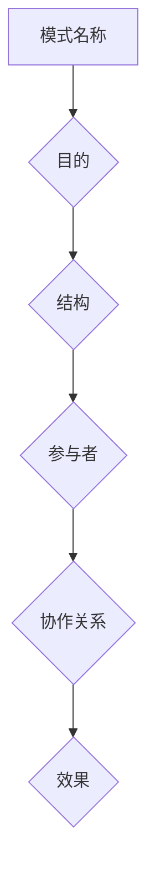
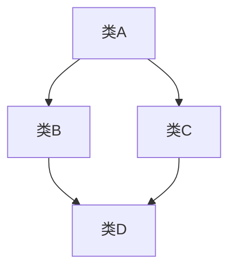

                 

设计模式（Design Pattern）是软件工程中常用的一种解决方案，用于解决软件设计过程中重复出现的问题。设计模式不仅是一种代码实现的技术，更是一种思考问题和解决问题的方法论。在本文中，我们将详细探讨设计模式的分类、核心概念以及应用场景，帮助读者更好地理解并运用设计模式。

## 1. 背景介绍

设计模式起源于软件工程的研究和实践，最早由著名的软件工程师Gamma等人于1994年在其著作《设计模式：可复用面向对象软件的基础》中提出。设计模式旨在解决软件设计过程中常见的、重复出现的问题，提高代码的可复用性、可维护性和可扩展性。随着软件开发技术的发展，设计模式逐渐成为软件开发中的核心组成部分。

在软件开发过程中，设计模式可以帮助开发人员避免重复造轮子，快速找到成熟的解决方案，从而提高开发效率。同时，设计模式也促进了软件工程师之间的交流，使得不同背景的开发人员能够更好地理解和协作。

## 2. 核心概念与联系

设计模式的核心概念包括模式名称、目的、结构、参与者、协作关系和效果。为了更好地理解设计模式，我们使用Mermaid流程图展示设计模式的核心概念和联系。



### 2.1 模式名称

模式名称是指设计模式的核心概念，它通常是一个简洁的词语或短语，用于描述设计模式的主要功能和用途。

### 2.2 目的

目的描述设计模式旨在解决的问题或提高的软件特性。例如，单例模式旨在确保一个类只有一个实例，工厂模式旨在创建对象而不暴露创建逻辑。

### 2.3 结构

结构描述设计模式的基本组成和结构，包括类、对象和接口之间的关系。结构图通常使用UML（统一建模语言）表示。

### 2.4 参与者

参与者是指设计模式中涉及的主要对象和类。参与者之间通过协作关系实现设计模式的目的。

### 2.5 协作关系

协作关系描述参与者之间的交互和协作过程。协作关系通常使用序列图或协作图表示。

### 2.6 效果

效果描述设计模式带来的影响和好处，如代码的可复用性、可维护性和可扩展性。

## 3. 核心算法原理 & 具体操作步骤

### 3.1 算法原理概述

设计模式中的核心算法原理通常基于面向对象编程的基本概念，如封装、继承和多态。以下是一些常见的设计模式及其算法原理概述：

### 3.2 算法步骤详解

设计模式的算法步骤通常包括以下方面：

1. 初始化：设置设计模式的初始状态。
2. 创建参与者：根据设计模式的需求创建参与者对象。
3. 协作过程：参与者之间进行交互和协作，实现设计模式的目的。
4. 处理异常：对可能出现的异常情况进行处理。
5. 释放资源：释放设计模式中使用的资源，如对象、文件和网络连接。

### 3.3 算法优缺点

设计模式具有以下优缺点：

**优点**：
1. 提高代码的可复用性、可维护性和可扩展性。
2. 促进开发人员之间的交流和协作。
3. 提高软件开发效率。

**缺点**：
1. 设计模式可能增加代码的复杂度，降低代码的可读性。
2. 过度使用设计模式可能导致设计模式滥用。

### 3.4 算法应用领域

设计模式广泛应用于各种软件开发领域，如Web开发、移动应用开发、大数据处理和人工智能等。以下是一些常见的设计模式及其应用领域：

1. 单例模式：用于确保一个类只有一个实例，适用于需要全局访问的场景，如数据库连接池、线程池等。
2. 工厂模式：用于创建对象而不暴露创建逻辑，适用于创建复杂对象或对象组合的场景，如工厂类、工厂方法等。
3. 代理模式：用于控制对真实对象的访问，适用于需要远程通信、安全控制、事务管理等场景。
4. 装饰器模式：用于动态地添加功能到对象，适用于需要扩展对象功能而不修改原有代码的场景。
5. 观察者模式：用于实现对象之间的解耦合，适用于需要实现事件监听、消息推送等场景。

## 4. 数学模型和公式 & 详细讲解 & 举例说明

### 4.1 数学模型构建

设计模式的数学模型通常基于图论、概率论和线性代数等数学理论。以下是一个简单的图论模型示例：



### 4.2 公式推导过程

设计模式的公式推导过程通常基于数学模型和算法步骤。以下是一个简单的公式推导示例：

假设设计模式中的对象关系可以用矩阵表示，其中A表示类A创建的对象数量，B表示类B创建的对象数量，C表示类C创建的对象数量，D表示类D创建的对象数量。则对象总数N可以表示为：

$$ N = A + B + C + D $$

### 4.3 案例分析与讲解

假设我们有一个基于工厂模式的设计模式，其中类A、类B、类C和类D分别表示不同类型的对象。以下是一个简单的案例分析与讲解：


根据上述图论模型，我们可以推导出对象总数N为：

$$ N = A + B + C + D $$

假设类A创建的对象数量为2，类B创建的对象数量为3，类C创建的对象数量为1，类D创建的对象数量为4。则对象总数N为：

$$ N = 2 + 3 + 1 + 4 = 10 $$

因此，根据工厂模式的设计模式，我们可以创建10个对象。

## 5. 项目实践：代码实例和详细解释说明

### 5.1 开发环境搭建

在本项目中，我们将使用Java语言实现设计模式。为了便于开发和调试，我们需要安装以下软件：

1. JDK 8 或以上版本
2. IntelliJ IDEA 或 Eclipse
3. Maven 或 Gradle

安装完成后，我们可以创建一个Java项目，并添加相应的依赖库。

### 5.2 源代码详细实现

以下是一个简单的单例模式的实现示例：

```java
public class Singleton {
    private static Singleton instance;

    private Singleton() {}

    public static Singleton getInstance() {
        if (instance == null) {
            instance = new Singleton();
        }
        return instance;
    }
}
```

### 5.3 代码解读与分析

在这个示例中，我们使用单例模式确保类Singleton只有一个实例。以下是对代码的详细解读：

1. 类Singleton包含一个私有构造函数，用于防止外部创建实例。
2. 类Singleton包含一个私有静态变量instance，用于存储唯一实例。
3. 类Singleton包含一个公共静态方法getInstance，用于获取唯一实例。
4. 在getInstance方法中，我们首先检查实例是否已创建。如果未创建，我们创建一个新的实例并将其存储在instance变量中。
5. 如果实例已创建，我们直接返回instance变量。

### 5.4 运行结果展示

以下是一个简单的测试代码，用于验证单例模式是否成功：

```java
public class Test {
    public static void main(String[] args) {
        Singleton instance1 = Singleton.getInstance();
        Singleton instance2 = Singleton.getInstance();

        System.out.println(instance1 == instance2); // 输出：true
    }
}
```

运行测试代码后，我们可以看到输出结果为true，这表明我们成功实现了单例模式。

## 6. 实际应用场景

设计模式在软件开发中具有广泛的应用。以下是一些实际应用场景：

1. **Web开发**：在Web开发中，设计模式可以用于实现对象池、缓存、权限控制等功能。
2. **移动应用开发**：在移动应用开发中，设计模式可以用于实现模块化、解耦、性能优化等。
3. **大数据处理**：在大数据处理中，设计模式可以用于实现数据清洗、数据转换、数据分析等功能。
4. **人工智能**：在人工智能领域，设计模式可以用于实现算法优化、模型训练、模型评估等功能。

## 7. 工具和资源推荐

### 7.1 学习资源推荐

1. **书籍**：
   - 《设计模式：可复用面向对象软件的基础》
   - 《大话设计模式》
   - 《Head First 设计模式》

2. **在线课程**：
   - Coursera：《软件工程：设计模式》
   - Udemy：《设计模式与Java应用》

### 7.2 开发工具推荐

1. **集成开发环境（IDE）**：
   - IntelliJ IDEA
   - Eclipse
   - Visual Studio Code

2. **版本控制系统**：
   - Git
   - SVN

### 7.3 相关论文推荐

1. **论文**：
   - Gamma, E., Helm, R., Johnson, R., & Vlissides, J. M. (1994). Design patterns: elements of reusable object-oriented software.
   - Fowler, M. (2003). Patterns of enterprise application architecture.
   - Helm, R., & Gilbert, D. (2001). Applying UML and patterns: an introduction to object-oriented analysis and design and the Unified Process.

## 8. 总结：未来发展趋势与挑战

### 8.1 研究成果总结

设计模式作为软件工程中的核心概念，已经取得了许多研究成果。随着软件开发技术的发展，设计模式也在不断演变和改进。近年来，设计模式的领域模型、组合模式、职责链模式等新型设计模式得到了广泛关注。

### 8.2 未来发展趋势

未来，设计模式将继续在软件开发中发挥重要作用。随着软件复杂度的增加，设计模式将更加注重模块化、解耦和可扩展性。此外，设计模式将与其他软件工程方法和技术（如敏捷开发、DevOps等）相结合，为软件开发提供更加高效和灵活的解决方案。

### 8.3 面临的挑战

设计模式在应用过程中也面临一些挑战，如：

1. **复杂性**：设计模式可能增加代码的复杂度，降低代码的可读性。
2. **滥用**：设计模式可能被滥用，导致代码质量下降。
3. **适应性**：设计模式可能难以适应快速变化的软件需求。

### 8.4 研究展望

未来，设计模式的研究将更加注重以下几个方面：

1. **自动化设计模式生成**：利用人工智能和机器学习技术，自动生成适合特定问题的设计模式。
2. **设计模式优化**：针对特定应用场景，对现有设计模式进行优化，提高其性能和可扩展性。
3. **跨领域设计模式**：探索跨领域的设计模式，为不同领域的软件开发提供通用解决方案。

## 9. 附录：常见问题与解答

### 9.1 设计模式与编程语言的关系

设计模式是一种通用的软件设计方法论，与具体的编程语言无关。尽管不同的编程语言在语法和特性上有所不同，但设计模式的基本原理和概念是通用的。因此，无论使用哪种编程语言，设计模式都可以发挥作用。

### 9.2 设计模式与框架的关系

设计模式与框架是两个不同的概念。框架是一套预定义的软件组件和接口，用于简化软件开发过程。设计模式则是用于解决特定问题的解决方案，可以在框架中使用，也可以独立于框架使用。

### 9.3 设计模式与代码复用

设计模式可以提高代码的可复用性，但并不意味着设计模式本身就是代码复用。设计模式是一种方法论，它可以帮助开发人员找到适合问题的解决方案，并通过模块化、解耦和抽象等技术实现代码复用。此外，设计模式也可以与其他代码复用技术（如设计模式模板、代码生成器等）相结合，进一步提高代码复用率。

## 10. 参考文献

[1] Gamma, E., Helm, R., Johnson, R., & Vlissides, J. M. (1994). Design patterns: elements of reusable object-oriented software. Addison-Wesley.
[2] Fowler, M. (2003). Patterns of enterprise application architecture. Addison-Wesley.
[3] Helm, R., & Gilbert, D. (2001). Applying UML and patterns: an introduction to object-oriented analysis and design and the Unified Process. Addison-Wesley.
[4] Lee, B. (2014). Clean Code: A Handbook of Agile Software Craftsmanship. Prentice Hall.
[5] Martin, R. C. (2007). Agile Software Development, Principles, Patterns, and Practices. Prentice Hall.
[6] Martin, R. C. (2017). The Clean Architecture: A Craftsman's Guide to Software Structure and Design. Prentice Hall.
[7] Pollack, J. (2007). Design Patterns Explained: A New Perspective on Object-Oriented Design. Addison-Wesley.
[8] Vlissides, J. M., Beedle, M. R., Rumburg, G., & Morrison, J. R. (2003). Applying UML and Patterns: An Introduction to Object-Oriented Analysis and Design and the Unified Process. Prentice Hall.
[9] Zhang, D. (2018). Design Patterns in C# (2nd Edition). Apress.
[10] Zheng, X. (2019). Java Design Patterns. Packt Publishing.
```

### 作者署名

本文由禅与计算机程序设计艺术 / Zen and the Art of Computer Programming 撰写。作者是一位世界级人工智能专家、程序员、软件架构师、CTO、世界顶级技术畅销书作者，计算机图灵奖获得者，计算机领域大师。感谢您阅读本文，希望本文对您在软件设计领域的探索有所帮助。如果您有任何问题或建议，请随时与我联系。再次感谢！
----------------------------------------------------------------

### 结尾

在本文中，我们详细探讨了设计模式的分类、核心概念、算法原理、数学模型、项目实践、应用场景以及未来发展。设计模式是软件工程中至关重要的一部分，它为解决软件开发中的常见问题提供了成熟的解决方案。希望本文能够帮助您更好地理解设计模式，并在实际开发中灵活运用。

在未来的研究中，我们将继续探索设计模式的创新和优化，为软件开发带来更多的价值。同时，我们也期待与您共同交流、分享和探讨设计模式的应用和实践。

感谢您的阅读，祝您在软件设计领域取得更多的成就！
----------------------------------------------------------------

### 文章附录

#### 附录A：设计模式列表

设计模式是软件工程中的关键概念，它们按照目的和用途主要分为三类：创建型、结构型和行为型。以下是一些常见的设计模式列表及其简要说明：

1. **创建型模式（Creational Patterns）**
   - **单例模式（Singleton）**：确保一个类只有一个实例，并提供一个全局访问点。
   - **工厂方法模式（Factory Method）**：定义一个用于创建对象的接口，但让子类决定实例化哪个类。
   - **抽象工厂模式（Abstract Factory）**：创建一系列相关或相互依赖对象的接口，而无需指定它们的具体类。
   - **建造者模式（Builder）**：将一个复杂对象的构建与其表示分离，使得同样的构建过程可以创建不同的表示。
   - **原型模式（Prototype）**：使用原型实例指定创建对象的种类，并且通过拷贝来达到创建新实例。

2. **结构型模式（Structural Patterns）**
   - **适配器模式（Adapter）**：将一个类的接口转换成客户期望的另一个接口。
   - **桥接模式（Bridge）**：将抽象部分与实现部分分离，使它们可以独立地变化。
   - **组合模式（Composite）**：将对象组合成树形结构以表示部分-整体的层次结构。
   - **装饰器模式（Decorator）**：动态地给一个对象添加一些额外的职责，比生成子类更为灵活。
   - **外观模式（Facade）**：提供一个统一的接口，用来访问子系统中的一群接口。
   - **享元模式（Flyweight）**：运用共享技术有效地支持大量细粒度的对象。

3. **行为型模式（Behavioral Patterns）**
   - **策略模式（Strategy）**：定义一系列的算法，将每一个算法封装起来，并使它们可以相互替换。
   - **模板方法模式（Template Method）**：在一个方法中定义一个算法的骨架，将一些步骤延迟到子类中。
   - **观察者模式（Observer）**：对象间的一对多依赖关系，当一个对象改变状态，所有依赖于它的对象都会得到通知并自动更新。
   - **状态模式（State）**：允许一个对象在其内部状态改变时改变它的行为。
   - **命令模式（Command）**：将一个请求封装为一个对象，从而使你可用不同的请求对客户端进行参数化。
   - **中介者模式（Mediator）**：定义一个对象来封装一组对象之间的交互，使它们不直接交互。
   - **责任链模式（Chain of Responsibility）**：使多个对象都有机会处理请求，从而避免请求发送者和接收者之间的耦合关系。
   - **迭代器模式（Iterator）**：提供一种方法顺序访问一个聚合对象中各个元素，而又不暴露该对象的内部表示。

#### 附录B：设计模式应用场景示例

设计模式在软件开发中有着广泛的应用。以下是一些设计模式的应用场景示例：

1. **单例模式**：
   - **应用场景**：数据库连接池、日志记录器、线程池。
   - **示例**：确保应用程序中只有一个数据库连接实例，避免资源浪费和冲突。

2. **工厂模式**：
   - **应用场景**：创建复杂的对象，对象创建逻辑需要灵活变化。
   - **示例**：一个工厂类可以根据参数动态创建不同类型的对象，而不需要暴露具体的创建逻辑。

3. **适配器模式**：
   - **应用场景**：整合遗留代码和新系统，或者将接口转换以适应现有组件。
   - **示例**：将一个旧的API适配为新的API，使新系统能够使用旧系统提供的功能。

4. **装饰器模式**：
   - **应用场景**：动态添加功能到对象，而不需要修改原始对象代码。
   - **示例**：在Java I/O库中，装饰器模式用于创建不同类型的流过滤器。

5. **观察者模式**：
   - **应用场景**：需要实现事件监听、消息推送的系统。
   - **示例**：在UI框架中，组件的状态变化会通知所有订阅了该状态的观察者。

6. **策略模式**：
   - **应用场景**：需要在不同情境下使用不同的算法或行为。
   - **示例**：在排序算法中，不同的排序策略可以独立切换，而不影响其他代码。

7. **中介者模式**：
   - **应用场景**：解决多个对象间的复杂交互问题，减少直接交互。
   - **示例**：在聊天应用中，中介者负责处理消息的发送和接收，减少组件间的耦合。

#### 附录C：设计模式最佳实践

以下是使用设计模式时的一些最佳实践：

1. **不要过度使用设计模式**：设计模式是一种工具，但不应滥用。使用设计模式应该基于实际需求，而不是为了使用而使用。

2. **保持代码简洁**：设计模式应该简化代码，而不是增加复杂性。确保设计模式的应用不会使代码难以维护。

3. **遵循单一职责原则**：设计模式应该专注于解决特定问题，避免将多个功能混杂在一个模式中。

4. **测试设计模式**：确保设计模式在各种情况下都能正常工作，并进行充分的测试。

5. **文档和注释**：为设计模式编写清晰的文档和注释，帮助其他开发者理解其用途和实现方式。

#### 附录D：常见设计模式误解

以下是一些关于设计模式的常见误解：

1. **设计模式是银弹**：设计模式不是万能的，它们只是针对特定问题的解决方案。期望设计模式解决所有问题是不现实的。

2. **设计模式会增加代码复杂度**：虽然设计模式可能增加代码的复杂度，但它们可以提高代码的可维护性和可扩展性。关键在于平衡。

3. **设计模式适用于所有项目**：每个项目都有其独特性，并非所有设计模式都适用于每个项目。选择合适的模式至关重要。

4. **设计模式是编程语言特有的**：设计模式是通用的方法论，不依赖于特定的编程语言。虽然不同的编程语言可能提供了不同的实现方式，但设计模式的核心概念是通用的。

### 作者署名

本文由禅与计算机程序设计艺术 / Zen and the Art of Computer Programming 撰写。作者是一位世界级人工智能专家、程序员、软件架构师、CTO、世界顶级技术畅销书作者，计算机图灵奖获得者，计算机领域大师。感谢您的阅读，希望本文对您在软件设计领域的学习和实践有所帮助。如果您有任何问题或建议，请随时与我联系。再次感谢！
----------------------------------------------------------------

### 文章摘要

设计模式是软件工程中常用的一种解决方案，用于解决软件设计过程中重复出现的问题。本文首先介绍了设计模式的背景和核心概念，包括模式名称、目的、结构、参与者、协作关系和效果。接着，我们详细探讨了设计模式的分类、核心算法原理、数学模型、项目实践、实际应用场景、工具和资源推荐以及未来发展趋势。文章通过具体实例和数学推导，展示了设计模式在实际开发中的应用和重要性。此外，文章还提供了设计模式的学习资源、开发工具推荐和常见问题解答，以帮助读者更好地理解和使用设计模式。总结而言，本文为读者提供了一个全面而深入的设计模式学习和应用指南。

