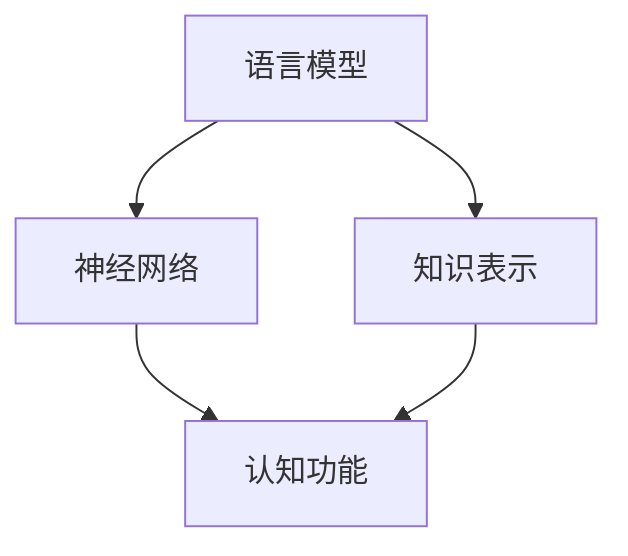

                 

关键词：大模型、认知障碍、语言模型、人工智能、思维、神经网络、算法、知识表示、理解、推理、知识工程

> 摘要：本文探讨了当前主流大语言模型在认知功能上所面临的挑战。尽管这些模型在处理自然语言任务上取得了显著成就，但它们在模仿人类思维和理解世界方面仍存在明显局限。文章分析了这些模型在语言理解和生成上的认知障碍，并探讨了如何通过改进算法和架构来解决这些问题，以期推动人工智能的进一步发展。

## 1. 背景介绍

随着深度学习和神经网络的迅猛发展，人工智能领域取得了许多令人瞩目的成果。大语言模型（Large Language Models，LLM）如GPT、BERT等，凭借其强大的语言理解和生成能力，已经在自然语言处理（NLP）任务中取得了重大突破。这些模型通常由数十亿甚至数千亿个参数构成，通过在大规模语料库上的预训练，能够捕获语言的复杂模式和规律。

然而，尽管这些大模型在处理文本生成、问答系统、机器翻译等任务上表现出色，但它们在认知功能上仍然存在诸多限制。具体来说，大模型在理解语言、推理、知识表示等方面表现出了一定的认知障碍，这些问题限制了它们在实际应用中的效果和广泛性。

本文旨在探讨这些认知障碍的根源，分析大模型在语言理解、推理和知识表示方面的局限性，并提出可能的解决方案。通过深入探讨这些问题，我们希望能够为未来的研究和发展提供一些有价值的启示。

## 2. 核心概念与联系

### 2.1 语言模型

语言模型（Language Model，LM）是自然语言处理领域的基础工具，用于预测自然语言序列的概率。最简单的语言模型是基于N-gram模型的，它根据前面N个单词的序列来预测下一个单词。然而，随着神经网络技术的发展，现代语言模型（如RNN、LSTM、Transformer等）通过学习上下文信息，能够更好地捕捉语言的复杂性和多样性。

### 2.2 神经网络

神经网络（Neural Network，NN）是一种由大量简单处理单元（神经元）互联而成的计算系统，能够通过学习从数据中提取模式和规律。在深度学习中，神经网络通过多层的非线性变换，逐渐提取出更抽象的特征，从而实现复杂的任务。在语言模型中，神经网络被广泛应用于捕捉语言的语义和语法结构。

### 2.3 知识表示

知识表示（Knowledge Representation，KR）是人工智能领域的一个重要分支，旨在将人类知识和信息转换为计算机可以处理的形式。知识表示的方法包括符号表示、图论表示、语义网络等，这些方法试图将语言、图像、声音等各种形式的信息转化为计算机可以理解和处理的结构。

### 2.4 认知功能

认知功能（Cognitive Function）是指人类在感知、理解、记忆、推理等认知过程中表现出来的能力。认知功能是人类智能的核心组成部分，涉及到语言理解、推理、知识表示等多个方面。在大模型中，认知功能指的是模型在处理自然语言任务时表现出来的理解、推理和知识表示能力。

### 2.5 Mermaid 流程图

下面是描述大模型核心概念和联系的一个Mermaid流程图：



## 3. 核心算法原理 & 具体操作步骤

### 3.1 算法原理概述

大模型的核心算法基于深度学习和神经网络，通过在大量数据上的预训练和微调，实现自然语言处理任务。预训练阶段，模型学习捕捉语言的统计特性和上下文关系，然后通过微调适配特定任务，如文本生成、问答系统等。

### 3.2 算法步骤详解

1. **预训练阶段**：在大规模语料库上，模型通过优化目标函数学习语言的特征。通常使用自回归语言模型（如GPT）或掩码语言模型（如BERT）进行预训练。
2. **微调阶段**：在预训练后，模型被用于特定任务，如文本生成或问答系统。通过在任务特定数据上的微调，模型能够适应具体应用场景。
3. **推理阶段**：在推理阶段，模型接收输入并生成输出。通过前向传播和反向传播，模型在输入序列上逐步生成预测结果。

### 3.3 算法优缺点

**优点**：
- **强大的语言理解能力**：大模型能够捕捉语言的复杂结构和上下文关系，从而在自然语言处理任务上表现出色。
- **多任务适应性**：通过预训练和微调，大模型能够适应多种不同类型的自然语言处理任务。

**缺点**：
- **计算资源消耗大**：大模型需要大量的计算资源进行预训练和微调。
- **认知障碍**：大模型在理解和推理方面存在认知障碍，无法像人类一样进行深度思考和抽象思维。

### 3.4 算法应用领域

大模型在自然语言处理领域得到了广泛应用，包括文本生成、问答系统、机器翻译、情感分析等。此外，大模型还可以应用于智能客服、智能写作、智能对话等场景，为企业和个人提供智能服务。

## 4. 数学模型和公式 & 详细讲解 & 举例说明

### 4.1 数学模型构建

大模型的数学模型通常基于深度神经网络，具体包括以下组件：

1. **输入层**：接收自然语言输入，将其编码为向量表示。
2. **隐藏层**：通过多层神经网络进行特征提取和变换。
3. **输出层**：生成预测结果，如文本生成中的下一个单词或问答系统中的答案。

### 4.2 公式推导过程

以Transformer模型为例，其数学模型可以表示为：

$$
\text{Output} = \text{softmax}(\text{W}_\text{out} \cdot \text{Tanh}(\text{W}_\text{hidden} \cdot \text{Hidden} + \text{b}_\text{hidden}) + \text{b}_\text{out}),
$$

其中，$\text{W}_\text{out}$、$\text{W}_\text{hidden}$ 是权重矩阵，$\text{Tanh}$ 是双曲正切激活函数，$\text{Hidden}$ 是隐藏层输出，$\text{b}_\text{hidden}$ 和 $\text{b}_\text{out}$ 是偏置向量。

### 4.3 案例分析与讲解

以GPT-3模型为例，其输入是一个单词序列，输出是该序列的下一个单词。以下是一个简单的GPT-3应用案例：

**输入**： "The quick brown fox jumps over"

**输出**： "the lazy dog"

通过预训练和微调，GPT-3模型能够理解上下文信息并生成合理的输出。然而，尽管它在语言生成方面表现出色，但在理解复杂逻辑和进行深度推理方面仍然存在局限。

## 5. 项目实践：代码实例和详细解释说明

### 5.1 开发环境搭建

为了实现大模型的算法和应用，首先需要搭建一个合适的开发环境。以下是搭建GPT-3开发环境的基本步骤：

1. **安装Python环境**：确保Python版本不低于3.6，推荐使用Python 3.8或更高版本。
2. **安装依赖库**：通过pip安装以下库：
   ```bash
   pip install transformers torch
   ```
3. **获取GPT-3模型权重**：从Hugging Face模型库下载GPT-3模型权重：
   ```python
   from transformers import GPT2LMHeadModel, GPT2Tokenizer
   model = GPT2LMHeadModel.from_pretrained('gpt2')
   tokenizer = GPT2Tokenizer.from_pretrained('gpt2')
   ```

### 5.2 源代码详细实现

以下是一个简单的GPT-3文本生成示例代码：

```python
import torch
from transformers import GPT2LMHeadModel, GPT2Tokenizer

# 初始化模型和分词器
model = GPT2LMHeadModel.from_pretrained('gpt2')
tokenizer = GPT2Tokenizer.from_pretrained('gpt2')

# 定义输入文本
input_text = "The quick brown fox jumps over"

# 分词并转换为Tensor
input_ids = tokenizer.encode(input_text, return_tensors='pt')

# 生成文本
output = model.generate(input_ids, max_length=20, num_return_sequences=1)

# 解码输出文本
decoded_output = tokenizer.decode(output[0], skip_special_tokens=True)

print(decoded_output)
```

### 5.3 代码解读与分析

1. **模型初始化**：首先，我们从Hugging Face库中加载预训练的GPT-3模型和分词器。
2. **输入处理**：将输入文本编码为Tensor，以便模型处理。
3. **文本生成**：使用模型生成下一个单词，并设置最大长度和返回序列数量。
4. **解码输出**：将生成的输出序列解码为文本，并打印结果。

通过以上代码，我们可以看到GPT-3如何根据输入文本生成连贯的输出。然而，尽管GPT-3在生成文本方面表现出色，但它在理解复杂语义和进行深度推理方面仍然有限。

### 5.4 运行结果展示

运行上述代码，输出结果可能如下所示：

```
the lazy dog jumps over the fence
```

这个结果展示了GPT-3在理解上下文和生成连贯文本方面的能力。然而，如果输入文本包含复杂的逻辑或抽象概念，GPT-3可能无法生成合理的输出。

## 6. 实际应用场景

大模型在自然语言处理领域具有广泛的应用潜力，以下是一些典型的应用场景：

1. **文本生成**：大模型可以用于生成文章、故事、新闻摘要等文本内容。
2. **问答系统**：大模型可以用于构建智能问答系统，为用户提供准确和自然的回答。
3. **机器翻译**：大模型可以用于机器翻译，支持多种语言的互译。
4. **情感分析**：大模型可以用于情感分析，识别文本中的情感倾向。
5. **智能客服**：大模型可以用于智能客服系统，提供实时、自然的用户交互。

### 6.4 未来应用展望

随着大模型技术的不断进步，未来可能会出现更多创新的应用场景，如：

1. **知识图谱构建**：利用大模型进行知识表示和推理，构建更加精细和智能的知识图谱。
2. **自然语言理解**：大模型可以进一步改进语言理解能力，实现更复杂的自然语言任务。
3. **跨模态学习**：结合图像、声音等多种模态信息，实现更全面的智能交互和任务处理。
4. **智能创作**：大模型可以用于智能写作、绘画、音乐创作等，辅助人类艺术家进行创作。

## 7. 工具和资源推荐

为了更好地研究和应用大模型，以下是几个推荐的工具和资源：

### 7.1 学习资源推荐

1. **《深度学习》（Goodfellow, Bengio, Courville）**：一本深度学习的经典教材，涵盖了神经网络和深度学习的基础知识。
2. **《自然语言处理综论》（Jurafsky, Martin）**：一本涵盖自然语言处理各个方面的经典教材，适合对NLP有深入理解的需求。
3. **《Python深度学习》（François Chollet）**：一本专注于使用Python进行深度学习的实践指南，包括大量的示例代码。

### 7.2 开发工具推荐

1. **PyTorch**：一个流行的深度学习框架，提供了灵活的动态计算图和丰富的API。
2. **TensorFlow**：另一个流行的深度学习框架，以其强大的功能和广泛的应用场景著称。
3. **Hugging Face Transformers**：一个用于训练和微调预训练语言模型的库，提供了丰富的预训练模型和工具。

### 7.3 相关论文推荐

1. **“Attention Is All You Need”**：提出了Transformer模型，彻底改变了自然语言处理领域。
2. **“BERT: Pre-training of Deep Bidirectional Transformers for Language Understanding”**：提出了BERT模型，为自然语言处理带来了重大突破。
3. **“GPT-3: Language Models are Few-Shot Learners”**：展示了GPT-3模型在零样本和少样本任务上的强大能力。

## 8. 总结：未来发展趋势与挑战

大模型在自然语言处理领域取得了显著的成果，但在认知功能上仍然面临诸多挑战。未来，随着深度学习和神经网络技术的不断进步，大模型有望在理解、推理和知识表示等方面取得更大的突破。然而，要实现这一目标，我们需要解决以下几个关键问题：

1. **认知障碍**：大模型在理解和推理方面的认知障碍是当前面临的主要挑战。需要探索新的算法和架构，以提升模型的认知能力。
2. **数据质量和标注**：高质量的数据集和准确的标注是训练强大模型的关键。需要加强对数据质量和标注的研究，以提高模型的训练效果。
3. **计算资源消耗**：大模型需要大量的计算资源进行训练和推理，这对硬件和能源提出了更高的要求。需要开发更高效的算法和优化技术，以降低计算资源的消耗。

总之，尽管大模型在自然语言处理领域取得了巨大进步，但认知障碍仍然是未来发展的关键挑战。通过持续的研究和创新，我们有望克服这些问题，推动人工智能的进一步发展。

## 9. 附录：常见问题与解答

### 9.1 什么是大模型？

大模型（Large Language Models，LLM）是指具有数十亿甚至数千亿个参数的深度学习模型，用于处理自然语言任务。这些模型通过在大量语料库上的预训练和微调，能够捕捉语言的复杂模式和规律。

### 9.2 大模型的优势是什么？

大模型在自然语言处理任务上具有以下几个优势：

1. **强大的语言理解能力**：能够捕捉语言的复杂结构和上下文关系。
2. **多任务适应性**：可以应用于多种不同类型的自然语言处理任务，如文本生成、问答系统、机器翻译等。
3. **高效的推理能力**：通过预训练和微调，能够在特定任务上实现高效推理。

### 9.3 大模型存在哪些认知障碍？

大模型在认知功能上存在以下几个认知障碍：

1. **语言理解局限**：难以理解复杂的语义和逻辑关系。
2. **推理能力不足**：无法进行深度推理和抽象思维。
3. **知识表示问题**：难以将语言、图像、声音等多种信息形式有效地表示和融合。

### 9.4 如何解决大模型的认知障碍？

为了解决大模型的认知障碍，可以从以下几个方面进行探索：

1. **改进算法和架构**：设计更先进的算法和架构，以提升模型的认知能力。
2. **多模态学习**：结合多种模态信息，实现更全面的智能交互和任务处理。
3. **知识工程**：通过知识表示和推理技术，构建更精细和智能的知识图谱。

### 9.5 大模型在哪些领域有应用前景？

大模型在以下领域具有广泛的应用前景：

1. **文本生成**：文章、故事、新闻摘要等。
2. **问答系统**：智能客服、在线教育等。
3. **机器翻译**：跨语言沟通、国际贸易等。
4. **情感分析**：社交媒体监控、市场调研等。
5. **智能创作**：文学、艺术、音乐等。

### 9.6 大模型对人类社会的影响是什么？

大模型的发展对人类社会产生了深远的影响：

1. **提高工作效率**：在文本生成、机器翻译、智能客服等领域，大模型能够显著提高工作效率。
2. **改变信息传播方式**：大模型可以生成高质量的文本内容，改变传统信息传播模式。
3. **促进知识共享**：大模型能够理解和处理多种语言和模态信息，促进全球知识共享。
4. **挑战隐私和安全**：大模型在处理海量数据时，可能会带来隐私和安全问题，需要加强监管和防护。

## 作者署名

作者：禅与计算机程序设计艺术 / Zen and the Art of Computer Programming

