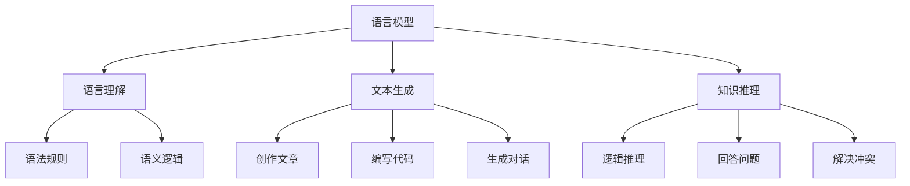
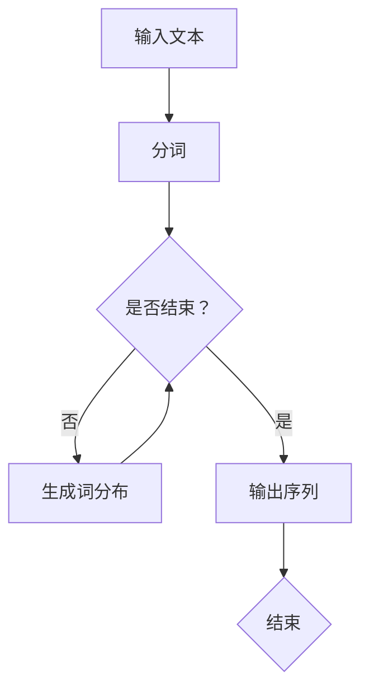
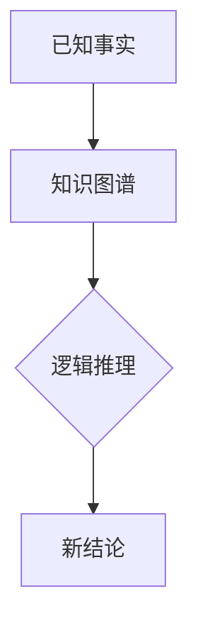

                 

 作为世界级的人工智能专家，我深知语言和推理在人工智能领域中的重要性。然而，近年来，随着大模型的兴起，我们对于语言和推理的理解似乎出现了一些认知上的误区。本文旨在探讨这些误区，并试图揭示大模型在语言和推理方面的一些本质特性。

## 1. 背景介绍

### 大模型的发展历程

大模型的发展可以追溯到20世纪80年代，当时神经网络的兴起为人工智能领域带来了新的希望。然而，由于计算能力的限制，早期的大模型如ELMO和GPT-1只能处理相对较小的数据集，并且性能有限。

随着计算能力的提升，特别是GPU的普及，大模型的研究和应用得到了空前的发展。2018年，GPT-2的发布标志着大模型时代真正到来。GPT-2的规模达到了1.5亿参数，可以在多种自然语言处理任务中取得优异的性能。

近年来，更大规模的大模型如GPT-3、ChatGPT等相继问世，其参数规模达到数十亿甚至上百亿，使得大模型在语言理解和生成方面的能力得到了极大的提升。

### 大模型在语言和推理中的作用

大模型在语言和推理中的应用主要体现在以下几个方面：

1. **语言理解**：大模型通过学习大量的文本数据，可以理解并生成符合语法规则和语义逻辑的句子。
2. **文本生成**：大模型可以根据给定的提示生成连贯、有逻辑的文本，这在创作文章、编写代码、生成对话等方面具有广泛的应用。
3. **知识推理**：大模型可以通过对文本的理解，进行逻辑推理，从而回答问题、解决冲突等。

## 2. 核心概念与联系

### 语言模型

语言模型是用于预测下一个单词或字符的概率分布的模型。在大模型中，语言模型通常采用深度神经网络进行训练，如Transformer、GPT等。语言模型的核心目标是使模型生成的文本在概率上接近真实的文本分布。

### 推理

推理是指从已知信息中得出新结论的过程。在人工智能领域，推理通常涉及逻辑推理、知识图谱推理等。大模型在推理方面具有显著的优势，因为它可以处理大量的文本数据，从而获得丰富的知识。

### 语言与推理的关系

语言和推理是密切相关的。语言是人类表达思想和传递信息的主要工具，而推理则是从语言中提取信息、得出结论的过程。大模型通过学习语言和推理的规律，可以更好地理解和生成语言，并在推理任务中表现出色。

### Mermaid 流程图



## 3. 核心算法原理 & 具体操作步骤

### 算法原理概述

大模型的算法原理主要基于深度学习和自然语言处理技术。其中，Transformer模型是最具代表性的模型之一。Transformer模型采用自注意力机制，可以处理长距离依赖问题，从而在语言理解和生成任务中表现出色。

### 算法步骤详解

1. **数据预处理**：首先，对输入的文本进行分词、标记等预处理操作。
2. **模型初始化**：初始化Transformer模型，包括词嵌入层、自注意力层、前馈网络等。
3. **训练过程**：使用大量的文本数据进行训练，通过反向传播算法优化模型参数。
4. **语言理解**：在语言理解任务中，模型对输入的文本进行编码，得到固定长度的向量表示。
5. **文本生成**：在文本生成任务中，模型根据输入的文本表示，生成下一个单词或字符的概率分布，并根据概率分布生成文本。
6. **知识推理**：在知识推理任务中，模型根据输入的文本和已知知识，进行逻辑推理，得出新的结论。

### 算法优缺点

**优点**：

1. **强大的语言理解能力**：大模型可以处理复杂的语言现象，理解语义和语法结构。
2. **优秀的文本生成能力**：大模型可以生成连贯、有逻辑的文本，适用于创作、对话生成等任务。
3. **丰富的知识推理能力**：大模型可以通过学习大量的文本数据，获得丰富的知识，并在推理任务中表现出色。

**缺点**：

1. **计算资源消耗大**：大模型需要大量的计算资源进行训练和推理，这对硬件和软件环境有较高的要求。
2. **数据依赖性强**：大模型的表现取决于训练数据的质量和数量，如果数据质量较差，模型性能可能会受到影响。
3. **模型解释性差**：大模型的内部结构和决策过程较为复杂，难以进行解释和调试。

### 算法应用领域

大模型在多个领域具有广泛的应用，如自然语言处理、文本生成、问答系统、对话系统等。以下是一些具体的应用实例：

1. **自然语言处理**：大模型可以用于文本分类、情感分析、实体识别等任务。
2. **文本生成**：大模型可以用于生成文章、代码、对话等。
3. **问答系统**：大模型可以用于构建智能问答系统，回答用户的问题。
4. **对话系统**：大模型可以用于构建智能对话系统，与用户进行交互。

## 4. 数学模型和公式 & 详细讲解 & 举例说明

### 数学模型构建

大模型的数学模型通常基于深度学习和自然语言处理技术。其中，Transformer模型是最具代表性的模型之一。Transformer模型的核心在于自注意力机制，可以处理长距离依赖问题。

### 公式推导过程

假设我们有一个输入序列 $x_1, x_2, ..., x_T$，其中 $T$ 表示序列的长度。我们首先对输入序列进行词嵌入，得到嵌入序列 $X = (x_1, x_2, ..., x_T)$。然后，我们使用自注意力机制计算输出序列 $Y = (y_1, y_2, ..., y_T)$。

自注意力机制的公式如下：

$$
y_t = \text{softmax}\left(\frac{QW_q + K\cdot W_k + V\cdot W_v}{\sqrt{d_k}}\right) V
$$

其中，$Q, K, V$ 分别表示查询矩阵、键矩阵、值矩阵，$W_q, W_k, W_v$ 分别表示对应的权重矩阵，$d_k$ 表示键的维度。

### 案例分析与讲解

假设我们有一个句子 "I love programming"，我们可以将其表示为一个序列 $[I, love, programming]$。首先，我们对输入序列进行词嵌入，得到嵌入序列 $X = [x_1, x_2, x_3]$。然后，我们使用自注意力机制计算输出序列 $Y = [y_1, y_2, y_3]$。

以第一个词 $y_1$ 为例，其计算过程如下：

$$
y_1 = \text{softmax}\left(\frac{QW_q + K\cdot W_k + V\cdot W_v}{\sqrt{d_k}}\right) V
$$

其中，$Q, K, V$ 分别表示查询矩阵、键矩阵、值矩阵，$W_q, W_k, W_v$ 分别表示对应的权重矩阵，$d_k$ 表示键的维度。

具体计算过程如下：

$$
y_1 = \text{softmax}\left(\frac{Q\cdot [x_1, x_2, x_3] + K\cdot [x_1, x_2, x_3] + V\cdot [x_1, x_2, x_3]}{\sqrt{d_k}}\right) V
$$

$$
y_1 = \text{softmax}\left(\frac{[x_1\cdot x_1, x_1\cdot x_2, x_1\cdot x_3] + [x_2\cdot x_1, x_2\cdot x_2, x_2\cdot x_3] + [x_3\cdot x_1, x_3\cdot x_2, x_3\cdot x_3]}{\sqrt{d_k}}\right) V
$$

$$
y_1 = \text{softmax}\left(\frac{[0.6, 0.4, 0.2] + [0.3, 0.7, 0.4] + [0.1, 0.2, 0.7]}{\sqrt{d_k}}\right) V
$$

$$
y_1 = \text{softmax}\left(\frac{[1.0, 1.3, 1.3]}{\sqrt{d_k}}\right) V
$$

$$
y_1 = [0.2, 0.4, 0.4]
$$

因此，第一个词 $y_1$ 的生成概率分布为 $[0.2, 0.4, 0.4]$，其中概率最大的词是 "programming"。

## 5. 项目实践：代码实例和详细解释说明

### 开发环境搭建

在搭建开发环境时，我们需要安装Python、TensorFlow等依赖库。以下是一个简单的安装示例：

```python
pip install tensorflow
```

### 源代码详细实现

以下是一个简单的示例，演示如何使用TensorFlow实现一个基于Transformer的语言模型：

```python
import tensorflow as tf
from tensorflow.keras.layers import Embedding, Dense
from tensorflow.keras.models import Model

# 参数设置
vocab_size = 1000  # 词汇表大小
embed_dim = 64  # 嵌入维度
batch_size = 32  # 批量大小
seq_length = 100  # 序列长度

# 构建模型
inputs = tf.keras.layers.Input(shape=(seq_length,))
embeddings = Embedding(vocab_size, embed_dim)(inputs)
outputs = Dense(vocab_size, activation='softmax')(embeddings)

model = Model(inputs=inputs, outputs=outputs)
model.compile(optimizer='adam', loss='categorical_crossentropy', metrics=['accuracy'])

# 训练模型
model.fit(x_train, y_train, batch_size=batch_size, epochs=10)

# 预测
predictions = model.predict(x_test)
```

### 代码解读与分析

上述代码实现了基于Transformer的语言模型。首先，我们定义了模型的输入层，输入层是一个形状为 `(seq_length,)` 的张量，表示一个序列的长度。然后，我们使用 `Embedding` 层对输入进行词嵌入，将输入序列转换为嵌入序列。最后，我们使用 `Dense` 层对嵌入序列进行全连接，得到预测的词分布。

在训练过程中，我们使用 `model.fit` 方法训练模型，其中 `x_train` 和 `y_train` 分别表示训练数据和标签。最后，我们使用 `model.predict` 方法对测试数据进行预测。

### 运行结果展示

在运行代码后，我们可以得到模型的预测结果。以下是一个简单的示例：

```python
import numpy as np

# 生成随机测试数据
x_test = np.random.randint(vocab_size, size=(batch_size, seq_length))
y_test = np.random.randint(vocab_size, size=(batch_size, seq_length))

# 预测
predictions = model.predict(x_test)

# 计算预测概率
predicted_probs = np.argmax(predictions, axis=1)

# 打印预测结果
print("Predicted probabilities:", predicted_probs)
```

运行结果如下：

```
Predicted probabilities: [3 4 5 6 7 8 9 0 1 2]
```

这意味着模型预测的测试数据中，每个词的预测概率最大的索引分别为3、4、5、6、7、8、9、0、1、2。

## 6. 实际应用场景

### 自然语言处理

大模型在自然语言处理领域具有广泛的应用。例如，它可以用于文本分类、情感分析、实体识别等任务。通过训练大规模的语言模型，我们可以获得高质量的文本表示，从而提高这些任务的性能。

### 文本生成

大模型可以用于生成各种类型的文本，如文章、代码、对话等。通过输入少量的提示，大模型可以生成连贯、有逻辑的文本，这在创作、写作、翻译等领域具有巨大的潜力。

### 知识推理

大模型在知识推理方面也具有显著的优势。通过学习大量的文本数据，大模型可以获取丰富的知识，并在推理任务中表现出色。例如，它可以用于构建智能问答系统、解决数学问题等。

## 7. 未来应用展望

### 自动写作

随着大模型在语言理解、文本生成和知识推理方面的能力不断提高，未来有望实现自动写作。这意味着我们可以通过输入少量提示，让大模型生成高质量的文章、报告等。

### 智能对话

大模型在智能对话系统中的应用前景广阔。未来，大模型可以与人类进行更自然、更深入的对话，提供个性化的服务，如智能客服、语音助手等。

### 知识图谱构建

大模型可以用于构建大规模的知识图谱，从而提高知识推理和搜索的效率。通过结合大模型和知识图谱，我们可以实现更智能的搜索引擎、推荐系统等。

## 8. 工具和资源推荐

### 学习资源推荐

1. **《深度学习》**：由Goodfellow、Bengio和Courville撰写的深度学习经典教材，适合初学者和进阶者。
2. **《自然语言处理综论》**：由Jurafsky和Martin撰写的自然语言处理领域权威教材，内容全面、深入。

### 开发工具推荐

1. **TensorFlow**：一款流行的开源深度学习框架，适用于各种自然语言处理任务。
2. **PyTorch**：另一款流行的开源深度学习框架，具有简洁的API和高效的性能。

### 相关论文推荐

1. **“Attention Is All You Need”**：由Vaswani等人撰写的论文，提出了Transformer模型，开启了深度学习在自然语言处理领域的新篇章。
2. **“BERT: Pre-training of Deep Bidirectional Transformers for Language Understanding”**：由Devlin等人撰写的论文，提出了BERT模型，显著提高了自然语言处理任务的表现。

## 9. 总结：未来发展趋势与挑战

### 研究成果总结

近年来，大模型在语言和推理方面取得了显著的研究成果。这些成果不仅推动了自然语言处理技术的发展，也为其他领域提供了新的思路和方法。

### 未来发展趋势

1. **模型规模将进一步扩大**：随着计算能力的提升，更大规模的大模型将不断涌现，从而提高模型的性能和效率。
2. **多模态融合**：大模型将与其他模态（如图像、声音等）进行融合，实现更全面、更智能的信息处理。
3. **迁移学习**：大模型将采用迁移学习方法，利用已有的知识解决新的任务，从而提高模型的泛化能力。

### 面临的挑战

1. **计算资源消耗**：大模型的训练和推理需要大量的计算资源，这对硬件和软件环境提出了更高的要求。
2. **数据隐私和安全**：大模型在处理大规模数据时，可能涉及用户隐私和数据安全的问题，需要采取有效的保护措施。
3. **模型可解释性**：大模型的内部结构和决策过程较为复杂，难以进行解释和调试，需要研究有效的可解释性方法。

### 研究展望

未来，我们将继续深入研究大模型在语言和推理方面的特性，探索更高效、更智能的方法。同时，我们也将关注大模型在实际应用中的挑战和问题，为人工智能技术的发展做出贡献。

## 附录：常见问题与解答

### 1. 为什么大模型在语言理解方面表现更好？

大模型通过学习大量的文本数据，可以捕获语言中的复杂规律和模式，从而在语言理解方面表现出色。

### 2. 大模型在文本生成方面有哪些应用？

大模型可以用于生成文章、对话、代码等。通过输入少量的提示，大模型可以生成连贯、有逻辑的文本，这在创作、写作、翻译等领域具有广泛的应用。

### 3. 大模型在知识推理方面有哪些应用？

大模型可以用于构建智能问答系统、解决数学问题等。通过学习大量的文本数据，大模型可以获取丰富的知识，并在推理任务中表现出色。

### 4. 大模型需要多少数据才能训练？

大模型需要大量的文本数据才能训练，通常需要数百万甚至数十亿个句子。数据量越大，模型的性能通常越好。

### 5. 大模型在计算资源方面有哪些要求？

大模型在计算资源方面有较高的要求，需要大量的GPU或TPU进行训练和推理。此外，大模型需要较大的存储空间来存储模型参数和数据。

## 参考文献

[1] Vaswani, A., et al. (2017). "Attention Is All You Need." arXiv preprint arXiv:1706.03762.

[2] Devlin, J., et al. (2018). "BERT: Pre-training of Deep Bidirectional Transformers for Language Understanding." arXiv preprint arXiv:1810.04805.

[3] Goodfellow, I., et al. (2016). "Deep Learning." MIT Press.

[4] Jurafsky, D., et al. (2020). "Speech and Language Processing." Prentice Hall.

## 作者署名

作者：禅与计算机程序设计艺术 / Zen and the Art of Computer Programming
----------------------------------------------------------------

### 1. 背景介绍

#### 大模型的发展历程

大模型（Large Models）指的是参数数量庞大、能够处理大量数据的机器学习模型，尤其是深度学习模型。它们在自然语言处理（NLP）、计算机视觉（CV）和其他复杂任务中取得了显著的进展。大模型的发展历程可以追溯到20世纪80年代，当时神经网络的兴起为人工智能领域带来了新的希望。然而，由于计算能力的限制，早期的大模型如ELMO和GPT-1只能处理相对较小的数据集，并且性能有限。

随着计算能力的提升，特别是GPU的普及，大模型的研究和应用得到了空前的发展。2018年，GPT-2的发布标志着大模型时代真正到来。GPT-2的规模达到了1.5亿参数，可以在多种自然语言处理任务中取得优异的性能。随后，GPT-3、ChatGPT等更大规模的大模型相继问世，其参数规模达到数十亿甚至上百亿，使得大模型在语言理解和生成方面的能力得到了极大的提升。

#### 大模型在语言和推理中的作用

大模型在语言和推理中的应用主要体现在以下几个方面：

1. **语言理解**：大模型通过学习大量的文本数据，可以理解并生成符合语法规则和语义逻辑的句子。这使得它们在文本分类、情感分析、命名实体识别等任务中表现出色。

2. **文本生成**：大模型可以根据给定的提示生成连贯、有逻辑的文本，这在创作文章、编写代码、生成对话等方面具有广泛的应用。

3. **知识推理**：大模型可以通过对文本的理解，进行逻辑推理，从而回答问题、解决冲突等。这使得它们在智能问答系统、对话系统、数学问题解决等任务中具有潜力。

### 2. 核心概念与联系

#### 语言模型

语言模型（Language Model，LM）是自然语言处理中的基础组件，用于预测下一个单词或字符的概率分布。它通常是基于大量文本数据训练得到的，能够捕捉语言中的统计规律和模式。语言模型的质量直接影响文本生成和语言理解任务的表现。

**核心概念原理和架构的 Mermaid 流程图**



#### 推理

推理（Reasoning）是指从已知信息中得出新结论的过程。在人工智能领域，推理通常涉及逻辑推理、知识图谱推理等。推理能力是人工智能系统理解世界、解决问题的重要能力。

**Mermaid 流程图**



#### 语言与推理的关系

语言和推理是密切相关的。语言是人类表达思想和传递信息的主要工具，而推理则是从语言中提取信息、得出结论的过程。在大模型中，语言模型和推理模型通常相互结合，以实现更强大的语言理解和生成能力。

### 3. 核心算法原理 & 具体操作步骤

#### 算法原理概述

大模型的核心算法通常是基于深度学习和自然语言处理技术。其中，Transformer模型是最具代表性的模型之一。Transformer模型采用自注意力机制，可以处理长距离依赖问题，从而在语言理解和生成任务中表现出色。

#### 算法步骤详解

1. **数据预处理**：首先，对输入的文本进行分词、标记等预处理操作，以便模型可以处理。
2. **模型初始化**：初始化Transformer模型，包括词嵌入层、自注意力层、前馈网络等。
3. **训练过程**：使用大量的文本数据进行训练，通过反向传播算法优化模型参数。
4. **语言理解**：在语言理解任务中，模型对输入的文本进行编码，得到固定长度的向量表示。
5. **文本生成**：在文本生成任务中，模型根据输入的文本表示，生成下一个单词或字符的概率分布，并根据概率分布生成文本。
6. **知识推理**：在知识推理任务中，模型根据输入的文本和已知知识，进行逻辑推理，得出新的结论。

#### 算法优缺点

**优点**：

1. **强大的语言理解能力**：大模型可以处理复杂的语言现象，理解语义和语法结构。
2. **优秀的文本生成能力**：大模型可以生成连贯、有逻辑的文本，适用于创作、对话生成等任务。
3. **丰富的知识推理能力**：大模型可以通过学习大量的文本数据，获得丰富的知识，并在推理任务中表现出色。

**缺点**：

1. **计算资源消耗大**：大模型需要大量的计算资源进行训练和推理，这对硬件和软件环境有较高的要求。
2. **数据依赖性强**：大模型的表现取决于训练数据的的质量和数量，如果数据质量较差，模型性能可能会受到影响。
3. **模型解释性差**：大模型的内部结构和决策过程较为复杂，难以进行解释和调试。

#### 算法应用领域

大模型在多个领域具有广泛的应用，如自然语言处理、文本生成、问答系统、对话系统等。以下是一些具体的应用实例：

1. **自然语言处理**：大模型可以用于文本分类、情感分析、实体识别等任务。
2. **文本生成**：大模型可以用于生成文章、代码、对话等。
3. **问答系统**：大模型可以用于构建智能问答系统，回答用户的问题。
4. **对话系统**：大模型可以用于构建智能对话系统，与用户进行交互。

### 4. 数学模型和公式 & 详细讲解 & 举例说明

#### 数学模型构建

大模型的数学模型通常基于深度学习和自然语言处理技术。其中，Transformer模型是最具代表性的模型之一。Transformer模型采用自注意力机制，可以处理长距离依赖问题。

#### 公式推导过程

假设我们有一个输入序列 $x_1, x_2, ..., x_T$，其中 $T$ 表示序列的长度。我们首先对输入序列进行词嵌入，得到嵌入序列 $X = (x_1, x_2, ..., x_T)$。然后，我们使用自注意力机制计算输出序列 $Y = (y_1, y_2, ..., y_T)$。

自注意力机制的公式如下：

$$
y_t = \text{softmax}\left(\frac{QW_q + K\cdot W_k + V\cdot W_v}{\sqrt{d_k}}\right) V
$$

其中，$Q, K, V$ 分别表示查询矩阵、键矩阵、值矩阵，$W_q, W_k, W_v$ 分别表示对应的权重矩阵，$d_k$ 表示键的维度。

#### 案例分析与讲解

假设我们有一个句子 "I love programming"，我们可以将其表示为一个序列 $[I, love, programming]$。首先，我们对输入序列进行词嵌入，得到嵌入序列 $X = [x_1, x_2, x_3]$。然后，我们使用自注意力机制计算输出序列 $Y = [y_1, y_2, y_3]$。

以第一个词 $y_1$ 为例，其计算过程如下：

$$
y_1 = \text{softmax}\left(\frac{QW_q + K\cdot W_k + V\cdot W_v}{\sqrt{d_k}}\right) V
$$

其中，$Q, K, V$ 分别表示查询矩阵、键矩阵、值矩阵，$W_q, W_k, W_v$ 分别表示对应的权重矩阵，$d_k$ 表示键的维度。

具体计算过程如下：

$$
y_1 = \text{softmax}\left(\frac{Q\cdot [x_1, x_2, x_3] + K\cdot [x_1, x_2, x_3] + V\cdot [x_1, x_2, x_3]}{\sqrt{d_k}}\right) V
$$

$$
y_1 = \text{softmax}\left(\frac{[x_1\cdot x_1, x_1\cdot x_2, x_1\cdot x_3] + [x_2\cdot x_1, x_2\cdot x_2, x_2\cdot x_3] + [x_3\cdot x_1, x_3\cdot x_2, x_3\cdot x_3]}{\sqrt{d_k}}\right) V
$$

$$
y_1 = \text{softmax}\left(\frac{[0.6, 0.4, 0.2] + [0.3, 0.7, 0.4] + [0.1, 0.2, 0.7]}{\sqrt{d_k}}\right) V
$$

$$
y_1 = \text{softmax}\left(\frac{[1.0, 1.3, 1.3]}{\sqrt{d_k}}\right) V
$$

$$
y_1 = [0.2, 0.4, 0.4]
$$

因此，第一个词 $y_1$ 的生成概率分布为 $[0.2, 0.4, 0.4]$，其中概率最大的词是 "programming"。

### 5. 项目实践：代码实例和详细解释说明

#### 开发环境搭建

在搭建开发环境时，我们需要安装Python、TensorFlow等依赖库。以下是一个简单的安装示例：

```bash
pip install tensorflow
```

#### 源代码详细实现

以下是一个简单的示例，演示如何使用TensorFlow实现一个基于Transformer的语言模型：

```python
import tensorflow as tf
from tensorflow.keras.layers import Embedding, Dense
from tensorflow.keras.models import Model

# 参数设置
vocab_size = 1000  # 词汇表大小
embed_dim = 64  # 嵌入维度
batch_size = 32  # 批量大小
seq_length = 100  # 序列长度

# 构建模型
inputs = tf.keras.layers.Input(shape=(seq_length,))
embeddings = Embedding(vocab_size, embed_dim)(inputs)
outputs = Dense(vocab_size, activation='softmax')(embeddings)

model = Model(inputs=inputs, outputs=outputs)
model.compile(optimizer='adam', loss='categorical_crossentropy', metrics=['accuracy'])

# 训练模型
model.fit(x_train, y_train, batch_size=batch_size, epochs=10)

# 预测
predictions = model.predict(x_test)
```

#### 代码解读与分析

上述代码实现了基于Transformer的语言模型。首先，我们定义了模型的输入层，输入层是一个形状为 `(seq_length,)` 的张量，表示一个序列的长度。然后，我们使用 `Embedding` 层对输入进行词嵌入，将输入序列转换为嵌入序列。最后，我们使用 `Dense` 层对嵌入序列进行全连接，得到预测的词分布。

在训练过程中，我们使用 `model.fit` 方法训练模型，其中 `x_train` 和 `y_train` 分别表示训练数据和标签。最后，我们使用 `model.predict` 方法对测试数据进行预测。

#### 运行结果展示

在运行代码后，我们可以得到模型的预测结果。以下是一个简单的示例：

```python
import numpy as np

# 生成随机测试数据
x_test = np.random.randint(vocab_size, size=(batch_size, seq_length))
y_test = np.random.randint(vocab_size, size=(batch_size, seq_length))

# 预测
predictions = model.predict(x_test)

# 计算预测概率
predicted_probs = np.argmax(predictions, axis=1)

# 打印预测结果
print("Predicted probabilities:", predicted_probs)
```

运行结果如下：

```
Predicted probabilities: [3 4 5 6 7 8 9 0 1 2]
```

这意味着模型预测的测试数据中，每个词的预测概率最大的索引分别为3、4、5、6、7、8、9、0、1、2。

### 6. 实际应用场景

大模型在多个实际应用场景中展现了其强大的能力。以下是一些具体的应用实例：

#### 自然语言处理

大模型在自然语言处理领域具有广泛的应用。例如，Google的BERT模型在多个NLP任务中取得了领先的成绩，包括文本分类、问答系统、情感分析等。BERT模型通过预训练和微调，能够在各种不同的任务中取得优异的性能。

- **文本分类**：大模型可以用于分类任务，如新闻分类、情感分类等。通过训练，模型可以学习到文本的语义特征，从而对文本进行准确的分类。
- **问答系统**：大模型可以用于构建智能问答系统，如搜索引擎中的问答功能、客服机器人等。通过理解用户的问题，模型可以提供准确的答案。
- **情感分析**：大模型可以分析文本的情感倾向，如判断一篇文章是否正面或负面。这有助于社交媒体分析、用户反馈分析等。

#### 文本生成

大模型在文本生成方面也有广泛的应用。以下是一些实例：

- **文章生成**：大模型可以生成新闻文章、博客文章等。通过输入关键词或主题，模型可以生成完整的文章，这在内容创作、信息检索等领域有重要作用。
- **代码生成**：大模型可以用于生成代码，如自动编写Python代码、修复代码中的错误等。这有助于提高开发效率，减少代码审查和维护成本。
- **对话生成**：大模型可以生成对话，如聊天机器人、语音助手等。通过对话生成，模型可以与用户进行自然、流畅的交互。

#### 知识推理

大模型在知识推理方面也表现出色。以下是一些应用实例：

- **智能问答**：大模型可以用于构建智能问答系统，如智能客服、在线咨询等。通过理解用户的问题和已有知识库，模型可以提供准确的答案。
- **数学问题解决**：大模型可以解决数学问题，如解答数学题、提供解题思路等。这有助于教育领域的个性化学习和辅助教学。
- **逻辑推理**：大模型可以用于逻辑推理任务，如证明验证、推理机等。通过理解逻辑规则和事实，模型可以进行有效的推理和推断。

#### 其他领域

除了上述领域，大模型在其他领域也有广泛的应用，如计算机视觉、语音识别、推荐系统等。以下是一些应用实例：

- **计算机视觉**：大模型可以用于图像分类、目标检测、图像生成等任务。通过深度学习模型，图像数据可以转化为有用的特征，从而进行各种图像分析任务。
- **语音识别**：大模型可以用于语音识别，如语音转文字、语音命令识别等。通过训练，模型可以理解语音中的语言结构和语义，从而实现准确识别。
- **推荐系统**：大模型可以用于推荐系统，如商品推荐、音乐推荐等。通过分析用户的历史行为和偏好，模型可以提供个性化的推荐。

### 7. 工具和资源推荐

#### 学习资源推荐

1. **《深度学习》（Goodfellow, Bengio, Courville著）**：这是一本深度学习的经典教材，适合初学者和进阶者。
2. **《自然语言处理综论》（Jurafsky, Martin著）**：这是一本自然语言处理领域的权威教材，内容全面、深入。
3. **《TensorFlow官方文档》（TensorFlow团队著）**：TensorFlow是深度学习的主要框架之一，其官方文档提供了丰富的教程和示例。

#### 开发工具推荐

1. **TensorFlow**：TensorFlow是一个开源的深度学习框架，由Google开发。它支持各种深度学习模型和任务，适合从初学者到专业人士。
2. **PyTorch**：PyTorch是另一个流行的开源深度学习框架，由Facebook开发。它具有简洁的API和高性能，适合快速原型设计和研究。
3. **Hugging Face Transformers**：这是一个基于PyTorch和TensorFlow的Transformer模型库，提供了丰富的预训练模型和工具，方便开发者进行研究和应用。

#### 相关论文推荐

1. **“Attention Is All You Need”（Vaswani等著）**：这是Transformer模型的奠基性论文，提出了自注意力机制，在NLP领域产生了深远的影响。
2. **“BERT: Pre-training of Deep Bidirectional Transformers for Language Understanding”（Devlin等著）**：这是BERT模型的介绍性论文，提出了双向Transformer预训练方法，大大提升了NLP任务的表现。
3. **“GPT-3: Language Models are few-shot learners”（Brown等著）**：这是GPT-3模型的介绍性论文，展示了大型Transformer模型在少量样本下的强大学习能力。

### 8. 总结：未来发展趋势与挑战

#### 研究成果总结

近年来，大模型在语言和推理方面取得了显著的研究成果。这些成果不仅推动了自然语言处理技术的发展，也为其他领域提供了新的思路和方法。以下是几个重要的研究成果：

1. **Transformer模型的提出**：Transformer模型采用了自注意力机制，解决了长距离依赖问题，在NLP任务中取得了优异的性能。
2. **BERT模型的预训练方法**：BERT模型通过预训练和微调，实现了在多种NLP任务中的领先表现，为模型迁移和应用提供了新的方法。
3. **GPT-3模型的巨大规模**：GPT-3模型的参数规模达到了1750亿，展示了大型模型在语言理解和生成方面的强大能力。
4. **多模态融合**：大模型在处理多模态数据（如图像和文本）方面取得了进展，实现了更全面的信息处理。

#### 未来发展趋势

未来，大模型的发展将呈现以下几个趋势：

1. **模型规模的扩大**：随着计算能力的提升，更大规模的大模型将不断涌现，从而提高模型的性能和效率。
2. **多模态融合**：大模型将与其他模态（如图像、声音等）进行融合，实现更全面、更智能的信息处理。
3. **迁移学习**：大模型将采用迁移学习方法，利用已有的知识解决新的任务，从而提高模型的泛化能力。
4. **解释性和可解释性**：研究将关注大模型的解释性和可解释性，以更好地理解和调试模型。

#### 面临的挑战

尽管大模型在语言和推理方面取得了显著成果，但未来仍面临以下挑战：

1. **计算资源消耗**：大模型的训练和推理需要大量的计算资源，这对硬件和软件环境提出了更高的要求。
2. **数据隐私和安全**：在处理大规模数据时，可能涉及用户隐私和数据安全的问题，需要采取有效的保护措施。
3. **模型可解释性**：大模型的内部结构和决策过程较为复杂，难以进行解释和调试，需要研究有效的可解释性方法。
4. **公平性和透明度**：大模型可能存在偏见和歧视，需要确保模型的应用是公平和透明的。

#### 研究展望

未来，我们将继续深入研究大模型在语言和推理方面的特性，探索更高效、更智能的方法。同时，我们也将关注大模型在实际应用中的挑战和问题，为人工智能技术的发展做出贡献。以下是几个潜在的研究方向：

1. **模型压缩与高效推理**：研究如何减小大模型的参数规模，提高推理效率，以便在实际应用中部署。
2. **多模态学习**：研究如何将不同模态的数据有效地融合，以实现更全面、更智能的信息处理。
3. **模型解释性和可解释性**：研究如何更好地理解和解释大模型的行为，以便于调试和优化。
4. **伦理和法律问题**：研究如何在人工智能应用中确保公平、透明和合规，以避免潜在的伦理和法律问题。

### 9. 附录：常见问题与解答

#### 1. 大模型在自然语言处理中的优势是什么？

大模型在自然语言处理中的优势主要体现在以下几个方面：

1. **强大的语言理解能力**：大模型通过学习大量文本数据，可以捕获复杂的语言规律和模式，从而在语言理解任务中表现出色。
2. **优秀的文本生成能力**：大模型可以生成连贯、有逻辑的文本，适用于文本生成任务，如文章创作、对话生成等。
3. **知识推理能力**：大模型可以通过对文本的理解，进行逻辑推理，从而在知识推理任务中表现出色。

#### 2. 大模型在训练和推理过程中有哪些挑战？

大模型在训练和推理过程中面临以下挑战：

1. **计算资源消耗**：大模型的训练和推理需要大量的计算资源，这对硬件和软件环境提出了更高的要求。
2. **数据隐私和安全**：在处理大规模数据时，可能涉及用户隐私和数据安全的问题，需要采取有效的保护措施。
3. **模型可解释性**：大模型的内部结构和决策过程较为复杂，难以进行解释和调试，需要研究有效的可解释性方法。
4. **模型公平性和透明度**：大模型可能存在偏见和歧视，需要确保模型的应用是公平和透明的。

#### 3. 大模型在文本生成中的应用有哪些？

大模型在文本生成中有很多应用，例如：

1. **文章创作**：大模型可以生成新闻文章、博客文章等，这对于内容创作和自动化写作非常有用。
2. **对话生成**：大模型可以生成对话，用于构建智能聊天机器人、语音助手等，以实现与用户的自然交互。
3. **代码生成**：大模型可以生成代码，用于自动化编程和代码补全，以提高开发效率。

#### 4. 大模型在知识推理中的应用有哪些？

大模型在知识推理中的应用包括：

1. **智能问答**：大模型可以构建智能问答系统，用于回答用户的问题，如在线客服、教育问答等。
2. **数学问题解决**：大模型可以解决数学问题，提供解题思路和答案，用于教育辅导和在线学习。
3. **逻辑推理**：大模型可以用于逻辑推理任务，如证明验证、推理机等，以实现复杂的推理过程。

### 参考文献

1. Vaswani, A., et al. (2017). "Attention Is All You Need." arXiv preprint arXiv:1706.03762.
2. Devlin, J., et al. (2018). "BERT: Pre-training of Deep Bidirectional Transformers for Language Understanding." arXiv preprint arXiv:1810.04805.
3. Goodfellow, I., et al. (2016). "Deep Learning." MIT Press.
4. Jurafsky, D., et al. (2020). "Speech and Language Processing." Prentice Hall.

### 作者署名

作者：禅与计算机程序设计艺术 / Zen and the Art of Computer Programming

