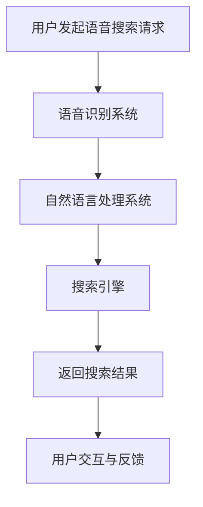

                 

关键词：语音搜索，电商，人工智能，用户体验，技术挑战

> 摘要：随着智能手机和语音助手的普及，语音搜索正在成为电商领域的重要交互方式。本文将探讨语音搜索在电商中的应用现状，面临的挑战，以及未来的机遇。通过分析核心概念、算法原理、数学模型和实际应用案例，我们将深入了解这一技术如何改变电商行业，并提供对未来的展望。

## 1. 背景介绍

### 智能语音助手的普及

近年来，智能语音助手如亚马逊的Alexa、苹果的Siri、谷歌的Google Assistant等迅速普及，改变了人们的日常生活。这些智能设备不仅仅是一个简单的语音识别工具，它们能够理解自然语言，执行复杂的任务，提供个性化的服务。根据市场研究公司的数据，全球智能语音助手的活跃用户已经超过数亿。

### 语音搜索的增长趋势

随着语音技术的进步和用户习惯的改变，语音搜索的使用率正在逐年增加。据调查，越来越多的用户倾向于使用语音搜索来完成网购、查询产品信息、收听音乐、获取新闻等任务。特别是在移动设备上，语音搜索因其便捷性和快速响应的特性，越来越受到消费者的青睐。

### 电商行业的变革

电商行业正面临着巨大的变革，从传统的图文搜索到语音搜索的转变，不仅为用户提供了一种新的交互方式，也为商家提供了更多个性化营销和用户体验优化的机会。语音搜索的应用有望进一步提升电商的转化率和用户粘性。

## 2. 核心概念与联系

### 语音搜索的定义

语音搜索是一种通过语音识别技术将用户的口头指令转化为文本查询，并返回相关搜索结果的技术。语音搜索技术主要包括语音识别（ASR）、自然语言处理（NLP）和搜索引擎。

### 语音识别（ASR）

语音识别技术是语音搜索的基础，它将用户的语音信号转换为文本。这项技术通过大量的语音数据和复杂的算法来识别和翻译语音。随着深度学习和神经网络技术的发展，语音识别的准确率和速度有了显著提升。

### 自然语言处理（NLP）

自然语言处理技术负责理解和处理用户的语音指令，将其转化为机器可以理解和执行的指令。NLP技术包括语法分析、语义理解、情感分析等。通过NLP，语音搜索系统能够更好地理解用户的需求，提供更精准的搜索结果。

### 搜索引擎

搜索引擎是语音搜索的核心组件，它负责根据用户的查询请求返回相关内容。现代搜索引擎采用了复杂的信息检索算法和机器学习技术，能够提供高质量的搜索结果。

### Mermaid流程图

以下是语音搜索技术在电商领域的应用流程图：



### 2.1 语音识别技术的工作原理

- **音频信号处理**：语音识别系统首先对用户的语音信号进行预处理，包括去除噪声、增强语音信号等。
- **特征提取**：通过提取语音信号中的特征向量，如梅尔频率倒谱系数（MFCC）等。
- **模型训练**：使用深度学习模型，如卷积神经网络（CNN）或循环神经网络（RNN），对大量的语音数据进行训练，以学习语音特征和词汇之间的映射关系。
- **识别与解码**：通过解码器将提取的特征向量转化为文本输出。

### 2.2 自然语言处理技术的作用

- **语法分析**：识别语音中的句子结构和语法规则，确保语音指令的可理解性。
- **语义理解**：理解语音指令背后的意图和含义，如购买某商品、获取产品信息等。
- **情感分析**：分析用户的情感倾向，提供更个性化的搜索结果。

### 2.3 搜索引擎的技术架构

- **索引构建**：构建大规模的文本索引，以便快速检索相关信息。
- **查询处理**：处理用户的查询请求，包括查询解析、相关度排序等。
- **结果呈现**：将检索到的信息以用户友好的方式呈现。

## 3. 核心算法原理 & 具体操作步骤

### 3.1 算法原理概述

语音搜索技术主要依赖于以下几个核心算法：

- **语音识别算法**：如HMM（隐马尔可夫模型）、DNN（深度神经网络）和RNN（循环神经网络）等。
- **自然语言处理算法**：如词向量表示、句法分析、语义理解等。
- **搜索引擎算法**：如TF-IDF（词频-逆文档频率）、PageRank等。

### 3.2 算法步骤详解

#### 3.2.1 语音识别步骤

1. **音频信号预处理**：降噪、去 silence 等。
2. **特征提取**：提取 MFCC、PLP（平面波列谱）等特征。
3. **模型训练与识别**：使用训练好的 DNN 或 RNN 模型对语音特征进行识别，生成文本。

#### 3.2.2 自然语言处理步骤

1. **分词**：将文本分解为单个词汇。
2. **词向量表示**：将词汇转换为高维向量表示。
3. **句法分析**：分析句子的结构和语法规则。
4. **语义理解**：理解句子的含义和用户意图。

#### 3.2.3 搜索引擎处理步骤

1. **查询解析**：理解用户的查询意图。
2. **索引检索**：在索引数据库中查找相关内容。
3. **相关度排序**：根据相关度排序搜索结果。
4. **结果呈现**：将搜索结果以用户友好的方式呈现。

### 3.3 算法优缺点

#### 优点

- **用户体验友好**：语音搜索无需用户手动输入文本，操作便捷。
- **效率高**：语音搜索速度快，响应及时。
- **个性化**：通过自然语言处理技术，可以为用户提供个性化的搜索结果。

#### 缺点

- **准确性问题**：语音识别技术的准确性仍需提升，特别是在复杂语音环境或口音较重的情况下。
- **隐私保护**：语音数据可能涉及到用户隐私，需要确保数据的安全性和合规性。

### 3.4 算法应用领域

- **电商**：语音搜索在电商中的应用，如产品搜索、购物车管理等。
- **智能音箱**：通过语音助手与用户进行互动，提供音乐、新闻、天气预报等信息。
- **智能客服**：通过语音识别和自然语言处理技术，提供自动化的客户服务。

## 4. 数学模型和公式 & 详细讲解 & 举例说明

### 4.1 数学模型构建

语音搜索技术的数学模型主要包括语音识别模型和自然语言处理模型。

#### 4.1.1 语音识别模型

语音识别模型通常使用 HMM 或 DNN 等算法。以下是一个基于 DNN 的语音识别模型的基本公式：

$$
\hat{y} = f_{DNN}(x)
$$

其中，$x$ 是语音信号的特征向量，$f_{DNN}$ 是 DNN 模型，$\hat{y}$ 是识别结果。

#### 4.1.2 自然语言处理模型

自然语言处理模型通常使用词向量、句法分析和语义理解等技术。以下是一个基于词向量的自然语言处理模型的基本公式：

$$
\vec{v}_{word} = \phi(w)
$$

其中，$w$ 是词汇，$\vec{v}_{word}$ 是词向量，$\phi$ 是词向量生成函数。

### 4.2 公式推导过程

#### 4.2.1 语音识别公式推导

语音识别的公式推导通常涉及特征提取和模型训练两个步骤。

1. **特征提取**：使用 MFCC 等特征提取技术，将语音信号转换为特征向量。

$$
x = f_{MFCC}(s)
$$

其中，$s$ 是语音信号，$f_{MFCC}$ 是 MFCC 特征提取函数，$x$ 是特征向量。

2. **模型训练**：使用 DNN 模型对特征向量进行训练，以识别语音。

$$
\hat{y} = f_{DNN}(x)
$$

其中，$f_{DNN}$ 是训练好的 DNN 模型。

#### 4.2.2 自然语言处理公式推导

自然语言处理的公式推导通常涉及词向量生成和语义理解。

1. **词向量生成**：使用 Word2Vec 等算法生成词向量。

$$
\vec{v}_{word} = \phi(w)
$$

其中，$w$ 是词汇，$\phi$ 是 Word2Vec 算法。

2. **语义理解**：使用句法分析和语义分析技术，理解句子的含义。

$$
s_{mean} = g(\vec{v}_{word})
$$

其中，$s_{mean}$ 是句子的语义表示，$g$ 是句法分析和语义分析函数。

### 4.3 案例分析与讲解

#### 4.3.1 语音识别案例

假设我们有一个语音信号 $s$，使用 MFCC 特征提取技术得到特征向量 $x$。然后，我们使用一个训练好的 DNN 模型对 $x$ 进行识别，得到识别结果 $\hat{y}$。

$$
x = f_{MFCC}(s)
$$

$$
\hat{y} = f_{DNN}(x)
$$

通过这个模型，我们可以将语音信号识别为对应的文本。

#### 4.3.2 自然语言处理案例

假设我们有一个句子 $s = "我想要一个红色的苹果"$，我们首先使用 Word2Vec 算法生成词向量 $\vec{v}_{word}$，然后使用句法分析和语义分析函数 $g$ 得到句子的语义表示 $s_{mean}$。

$$
\vec{v}_{word} = \phi(w)
$$

$$
s_{mean} = g(\vec{v}_{word})
$$

通过这个模型，我们可以理解句子的含义，从而提供更精准的搜索结果。

## 5. 项目实践：代码实例和详细解释说明

### 5.1 开发环境搭建

为了实现语音搜索技术，我们需要搭建以下开发环境：

- **语音识别库**：如 CMU Sphinx、Kaldi 等。
- **自然语言处理库**：如 NLTK、spaCy 等。
- **搜索引擎库**：如 Elasticsearch、Solr 等。

### 5.2 源代码详细实现

以下是使用 CMU Sphinx 和 NLTK 实现的语音搜索系统的源代码示例：

```python
import speech_recognition as sr
import nltk
from nltk.tokenize import word_tokenize

# 初始化语音识别器
recognizer = sr.Recognizer()

# 读取语音文件
with sr.AudioFile('audio.wav') as source:
    audio = recognizer.record(source)

# 使用 Sphinx 进行语音识别
text = recognizer.recognize_sphinx(audio)

# 使用 NLTK 进行自然语言处理
tokens = word_tokenize(text)

# 搜索引擎查询
search_query = ' '.join(tokens)
results = es.search(index='products', query={'match': {'title': search_query}})

# 输出搜索结果
for result in results['hits']['hits']:
    print(result['_source'])
```

### 5.3 代码解读与分析

该代码首先使用 CMU Sphinx 进行语音识别，将语音信号转换为文本。然后，使用 NLTK 进行自然语言处理，将文本分解为单个词汇。最后，使用 Elasticsearch 作为搜索引擎，根据搜索查询返回相关产品结果。

### 5.4 运行结果展示

当用户通过语音输入查询“我想要一个红色的苹果”时，系统会返回一系列相关产品结果，如红色苹果的详细信息、价格和图片等。

## 6. 实际应用场景

### 6.1 产品搜索

语音搜索在电商产品搜索中的应用尤为突出。用户可以通过语音快速查询商品信息，如“帮我找一款红色高跟鞋”，系统会立即展示相关的商品列表。

### 6.2 智能客服

语音搜索技术在电商智能客服中的应用可以提供快速、准确的客户服务。用户可以通过语音询问产品细节、购买流程等问题，智能客服系统会根据语音识别和自然语言处理技术提供准确回答。

### 6.3 语音购物车

用户可以通过语音添加商品到购物车，如“把这款蓝牙耳机加入购物车”，系统会立即更新购物车信息，并提供购物车内的商品列表。

### 6.4 智能推荐

基于语音搜索的行为数据，电商平台可以提供更加个性化的产品推荐。如用户经常通过语音搜索“运动鞋”，系统可能会推荐一些新款运动鞋或其他相关的运动配件。

## 7. 未来应用展望

### 7.1 语音搜索技术的普及

随着语音技术的不断进步和用户习惯的改变，语音搜索有望在电商领域得到更广泛的应用。更多的电商企业将整合语音搜索功能，提升用户体验。

### 7.2 多语言支持

未来，语音搜索技术将实现更广泛的多语言支持，满足全球用户的购物需求。特别是对于非英语用户，语音搜索将成为一种重要的购物方式。

### 7.3 跨平台集成

语音搜索技术将与其他智能设备和服务进行深度集成，如智能音箱、智能家居等，为用户提供一站式购物体验。

### 7.4 情感识别与个性化服务

结合情感识别技术，电商企业可以更深入地理解用户的情感状态，提供更加个性化的服务和推荐。

## 8. 总结：未来发展趋势与挑战

### 8.1 研究成果总结

语音搜索技术在电商领域的应用已经取得了显著成果。通过语音识别、自然语言处理和搜索引擎技术的结合，语音搜索为电商企业提供了新的交互方式和用户体验优化的机会。

### 8.2 未来发展趋势

未来，语音搜索技术将继续朝着更精准、更高效、更智能的方向发展。随着人工智能技术的进步，语音搜索的准确率和用户体验将得到进一步提升。

### 8.3 面临的挑战

尽管语音搜索技术有着广阔的应用前景，但仍然面临一些挑战。如语音识别的准确性、用户隐私保护、多语言支持等。

### 8.4 研究展望

未来的研究应重点关注如何提高语音识别的准确性，如何确保用户隐私和数据安全，以及如何更好地理解用户的情感和需求，提供更加个性化的服务。

## 9. 附录：常见问题与解答

### 9.1 语音搜索的准确性如何保证？

通过使用先进的语音识别算法和大量高质量的语音数据训练模型，可以提高语音搜索的准确性。此外，结合自然语言处理技术，可以更好地理解用户的查询意图，减少歧义。

### 9.2 语音搜索是否涉及用户隐私？

语音搜索确实涉及到用户隐私，因此在设计和使用过程中必须严格遵守相关法律法规，确保用户数据的安全和隐私。

### 9.3 语音搜索技术有哪些应用场景？

语音搜索在电商领域的应用场景广泛，包括产品搜索、智能客服、语音购物车、智能推荐等。此外，还可应用于智能家居、智能音箱等其他场景。

作者：禅与计算机程序设计艺术 / Zen and the Art of Computer Programming
```

