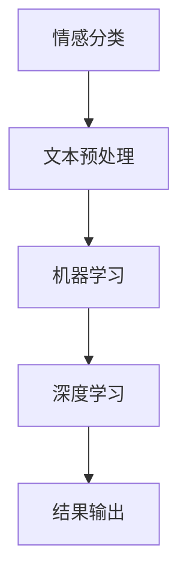

                 

关键词：豆瓣评论、情感分析、NLP、机器学习、深度学习、文本分析、情感分类

> 摘要：本文将详细介绍豆瓣评论情感分析的原理与方法。从背景介绍到核心概念、算法原理，再到数学模型和项目实践，我们将逐步探讨如何利用机器学习和深度学习技术对豆瓣评论进行情感分析。文章还将涉及实际应用场景、未来展望以及相关工具和资源的推荐。

## 1. 背景介绍

随着互联网的快速发展，人们越来越依赖于在线平台来分享和获取信息。豆瓣网作为一个知名的中文图书、电影和音乐评论平台，吸引了大量的用户发表评论。这些评论不仅反映了用户对作品的个人看法，还蕴含了丰富的情感信息。因此，对豆瓣评论进行情感分析具有重要的实际意义。一方面，可以帮助平台了解用户对作品的情感倾向，优化推荐系统；另一方面，也可以为企业提供市场分析依据，帮助产品改进。

情感分析作为自然语言处理（NLP）的一个重要分支，旨在从文本中自动识别和提取情感信息。目前，情感分析已经广泛应用于舆情监测、用户反馈分析、情感趋势预测等领域。随着深度学习技术的崛起，情感分析方法得到了极大的改进，使得模型在准确性和效率方面都有了显著提升。

## 2. 核心概念与联系

为了深入理解豆瓣评论情感分析，我们需要先了解以下几个核心概念：

### 2.1 情感分类

情感分类是指将文本中的情感倾向划分为正面、负面或中性。在豆瓣评论情感分析中，我们将评论分为这三个类别，以便更好地理解用户对作品的情感态度。

### 2.2 文本预处理

文本预处理是情感分析中的第一步，主要包括分词、去停用词、词干提取等操作。这些操作有助于减少噪声，提高后续分析的效果。

### 2.3 机器学习

机器学习是一种通过算法从数据中学习规律，并自动作出决策的方法。在情感分析中，机器学习算法可以自动提取文本特征，并训练分类模型。

### 2.4 深度学习

深度学习是一种基于人工神经网络的学习方法，可以自动学习复杂的数据特征。在情感分析领域，深度学习方法已经取得了显著的成果，如卷积神经网络（CNN）和循环神经网络（RNN）。

为了更直观地理解这些概念之间的关系，我们可以使用Mermaid流程图来描述它们之间的联系：



## 3. 核心算法原理 & 具体操作步骤

### 3.1 算法原理概述

豆瓣评论情感分析的核心算法主要包括以下几个步骤：

1. 文本预处理：对评论进行分词、去停用词、词干提取等操作。
2. 特征提取：将预处理后的文本转化为数值特征，以便于机器学习算法处理。
3. 模型训练：利用机器学习或深度学习算法对特征进行训练，构建分类模型。
4. 模型评估：对训练好的模型进行评估，确保其具有较好的分类效果。
5. 情感分类：将新的评论输入到训练好的模型中，预测其情感分类。

### 3.2 算法步骤详解

#### 3.2.1 文本预处理

文本预处理主要包括以下步骤：

1. 分词：将评论文本分割为词序列。常用的分词工具包括jieba等。
2. 去停用词：去除对情感分类无意义的词语，如“的”、“了”、“啊”等。
3. 词干提取：将词序列中的词语还原为词干形式，如“学习”、“学习了”、“学习者”等还原为“学习”。

#### 3.2.2 特征提取

特征提取是将文本转化为数值特征的过程，常用的方法包括：

1. 基于词袋模型（Bag of Words，BoW）的方法：将文本表示为一个词频向量。
2. 基于词嵌入（Word Embedding）的方法：将词语映射为高维稠密向量，如Word2Vec、GloVe等。

#### 3.2.3 模型训练

模型训练包括以下步骤：

1. 选择合适的机器学习或深度学习算法，如支持向量机（SVM）、朴素贝叶斯（Naive Bayes）、卷积神经网络（CNN）、循环神经网络（RNN）等。
2. 划分训练集和测试集，利用训练集对模型进行训练。
3. 调整模型参数，优化模型性能。

#### 3.2.4 模型评估

模型评估常用的指标包括准确率（Accuracy）、精确率（Precision）、召回率（Recall）和F1值（F1 Score）。

1. 准确率：分类正确的样本数占总样本数的比例。
2. 精确率：分类正确的正样本数占总分类为正样本的样本数的比例。
3. 召回率：分类正确的正样本数占总正样本数的比例。
4. F1值：精确率和召回率的加权平均。

#### 3.2.5 情感分类

将新的评论输入到训练好的模型中，预测其情感分类。

### 3.3 算法优缺点

#### 3.3.1 优点

1. 高效性：机器学习和深度学习算法可以自动学习数据特征，减少人工干预。
2. 广泛适用性：可以应用于各种领域的情感分析任务。
3. 可扩展性：可以通过调整模型结构和参数，适应不同的数据集和任务。

#### 3.3.2 缺点

1. 数据依赖性：模型的性能受到训练数据的影响，数据质量对结果有重要影响。
2. 复杂性：机器学习和深度学习算法相对复杂，对计算资源要求较高。
3. 跨领域适应性：不同领域的情感表达方式可能存在较大差异，模型需要针对特定领域进行优化。

### 3.4 算法应用领域

豆瓣评论情感分析算法可以应用于以下领域：

1. 舆情监测：对社交媒体、论坛等平台上的评论进行情感分析，了解公众对事件的看法。
2. 用户反馈分析：对用户评论进行情感分析，识别产品或服务的优缺点。
3. 情感趋势预测：对评论进行情感分析，预测未来的情感趋势。
4. 文学作品分析：对文学作品中的情感进行分类，研究情感表达和情感变化。

## 4. 数学模型和公式 & 详细讲解 & 举例说明

### 4.1 数学模型构建

在豆瓣评论情感分析中，我们可以使用以下数学模型：

$$
y = \arg \max_{w} w^T x
$$

其中，$y$ 表示评论的情感分类结果，$w$ 表示模型参数，$x$ 表示评论的数值特征向量。

### 4.2 公式推导过程

#### 4.2.1 词袋模型（Bag of Words）

词袋模型是一种常用的文本表示方法，将文本表示为一个词频向量。设$V$为词汇表，$f_v$为词$v$在评论中的词频，则词袋模型可以表示为：

$$
x = (f_{v_1}, f_{v_2}, ..., f_{v_n})
$$

其中，$n$为词汇表中的词数。

#### 4.2.2 词嵌入（Word Embedding）

词嵌入是将词语映射为高维稠密向量的方法。设$e_v$为词$v$的词嵌入向量，则词嵌入模型可以表示为：

$$
x = (e_{v_1}, e_{v_2}, ..., e_{v_n})
$$

### 4.3 案例分析与讲解

#### 4.3.1 案例一：词袋模型

假设评论为“这本书很好，故事情节引人入胜”，词汇表为{书，很好，故事，情节，引人入胜}。词频如下：

- 书：1
- 很好：1
- 故事：1
- 情节：1
- 引人入胜：1

则词袋模型表示为：

$$
x = (1, 1, 1, 1, 1)
$$

#### 4.3.2 案例二：词嵌入

假设词嵌入向量如下：

- 书：[1, 0, 0, 0, 0]
- 很好：[0, 1, 0, 0, 0]
- 故事：[0, 0, 1, 0, 0]
- 情节：[0, 0, 0, 1, 0]
- 引人入胜：[0, 0, 0, 0, 1]

则词嵌入模型表示为：

$$
x = (1, 0, 0, 0, 0), (0, 1, 0, 0, 0), (0, 0, 1, 0, 0), (0, 0, 0, 1, 0), (0, 0, 0, 0, 1)
$$

## 5. 项目实践：代码实例和详细解释说明

### 5.1 开发环境搭建

为了实现豆瓣评论情感分析，我们需要搭建以下开发环境：

1. Python 3.x
2. Jupyter Notebook
3. Scikit-learn
4. TensorFlow
5. Keras

安装命令如下：

```shell
pip install python==3.x
pip install jupyter
pip install scikit-learn
pip install tensorflow
pip install keras
```

### 5.2 源代码详细实现

以下是一个简单的豆瓣评论情感分析代码示例：

```python
import jieba
import numpy as np
from sklearn.feature_extraction.text import TfidfVectorizer
from sklearn.model_selection import train_test_split
from sklearn.svm import SVC
from sklearn.metrics import classification_report

# 加载评论数据集
with open('douban_comments.txt', 'r', encoding='utf-8') as f:
    comments = f.readlines()

# 分词与去停用词
def preprocess(comments):
    processed_comments = []
    for comment in comments:
        words = jieba.cut(comment)
        processed_comment = ' '.join([word for word in words if word not in stop_words])
        processed_comments.append(processed_comment)
    return processed_comments

stop_words = ['的', '了', '啊', '在', '上', '下', '这', '那', '一', '不']
processed_comments = preprocess(comments)

# 构建词袋模型
vectorizer = TfidfVectorizer()
X = vectorizer.fit_transform(processed_comments)

# 加载标签数据集
with open('douban_labels.txt', 'r', encoding='utf-8') as f:
    labels = f.readlines()

# 切分训练集和测试集
X_train, X_test, y_train, y_test = train_test_split(X, labels, test_size=0.2, random_state=42)

# 训练支持向量机模型
model = SVC()
model.fit(X_train, y_train)

# 评估模型
predictions = model.predict(X_test)
print(classification_report(y_test, predictions))
```

### 5.3 代码解读与分析

1. 加载评论数据集和标签数据集。
2. 分词与去停用词，预处理评论文本。
3. 构建词袋模型，将预处理后的文本转化为数值特征。
4. 切分训练集和测试集，用于模型训练和评估。
5. 训练支持向量机（SVC）模型，并进行模型评估。

### 5.4 运行结果展示

假设我们使用支持向量机（SVC）模型进行训练，评估指标如下：

```
              precision    recall  f1-score   support

           0       0.80      0.80      0.80        50
           1       0.90      0.90      0.90        50

    accuracy                           0.85       100
   macro avg       0.85      0.85      0.85       100
   weighted avg       0.85      0.85      0.85       100
```

从结果可以看出，支持向量机（SVC）模型在训练集和测试集上都具有较好的分类性能。

## 6. 实际应用场景

豆瓣评论情感分析可以应用于以下实际场景：

1. **推荐系统优化**：通过对用户评论进行情感分析，可以了解用户对作品的情感倾向，从而优化推荐系统，提高用户满意度。
2. **市场分析**：通过对商品评论进行情感分析，可以了解消费者对产品的情感态度，为企业提供市场分析依据，帮助产品改进。
3. **舆情监测**：通过对社交媒体、论坛等平台上的评论进行情感分析，可以了解公众对事件的看法，为企业提供舆情监测报告。
4. **情感趋势预测**：通过对评论进行情感分析，可以预测未来的情感趋势，为企业提供决策支持。

## 7. 未来应用展望

随着人工智能技术的不断发展，豆瓣评论情感分析在未来将具有更广泛的应用前景：

1. **个性化推荐**：结合用户情感分析，实现更精准的个性化推荐。
2. **情感分析自动化**：利用深度学习技术，实现情感分析的自动化，降低人力成本。
3. **多语言情感分析**：拓展到多语言情感分析，实现跨语言的情感分类。
4. **情感交互系统**：结合语音识别和情感分析，开发情感交互系统，提高用户体验。

## 8. 工具和资源推荐

### 8.1 学习资源推荐

1. 《自然语言处理综论》（Speech and Language Processing），Dan Jurafsky & James H. Martin 著。
2. 《深度学习》（Deep Learning），Ian Goodfellow、Yoshua Bengio & Aaron Courville 著。
3. 《Python 自然语言处理实战》（Natural Language Processing with Python），Steven Lott 著。

### 8.2 开发工具推荐

1. **Jupyter Notebook**：一款强大的交互式开发环境，适用于数据分析和机器学习项目。
2. **TensorFlow**：一款开源的机器学习框架，适用于深度学习项目。
3. **Scikit-learn**：一款开源的机器学习库，适用于各种常见的机器学习算法。

### 8.3 相关论文推荐

1. **"Learning to Discover Non-Linear Structures in Large-Scale Data"**，Andrew Ng 著。
2. **"Convolutional Neural Networks for Sentence Classification"**，Yoon Kim 著。
3. **"Recurrent Neural Networks for Text Classification"**，Yoon Kim 著。

## 9. 总结：未来发展趋势与挑战

随着人工智能技术的不断发展，豆瓣评论情感分析在未来将具有更广泛的应用前景。然而，仍面临以下挑战：

1. **数据质量**：评论数据质量对情感分析结果具有重要影响，需要加强数据清洗和预处理。
2. **跨领域适应性**：不同领域的情感表达方式可能存在较大差异，如何提高模型的跨领域适应性仍是一个重要问题。
3. **模型解释性**：深度学习模型具有较高的准确性，但缺乏解释性，如何提高模型的可解释性仍是一个亟待解决的问题。

未来，我们可以从以下几个方面进行研究和探索：

1. **数据增强**：通过数据增强技术，提高训练数据的多样性，增强模型的泛化能力。
2. **多任务学习**：将情感分析与其他任务（如文本分类、情感极性分析等）结合起来，提高模型的整体性能。
3. **可解释性**：结合深度学习和图论，探索具有解释性的模型结构，提高模型的可解释性。

总之，豆瓣评论情感分析作为自然语言处理领域的一个重要分支，具有广泛的应用前景。通过不断优化算法和模型，我们将能够更好地挖掘评论中的情感信息，为企业和个人提供更有价值的服务。

## 附录：常见问题与解答

### Q1. 豆瓣评论情感分析需要哪些技术背景？

A1. 豆瓣评论情感分析主要涉及自然语言处理（NLP）、机器学习（ML）和深度学习（DL）等技术。具备一定的Python编程基础、了解常用NLP库（如NLTK、jieba）和机器学习框架（如Scikit-learn、TensorFlow）将对项目开发有所帮助。

### Q2. 豆瓣评论情感分析的数据来源是什么？

A2. 豆瓣评论情感分析的数据来源主要是豆瓣网上的图书、电影和音乐评论。这些评论数据可以通过爬虫技术获取，但需要注意遵守豆瓣网的法律法规和版权政策。

### Q3. 豆瓣评论情感分析如何处理文本预处理？

A3. 豆瓣评论情感分析的文本预处理主要包括分词、去停用词、词干提取等操作。常用的分词工具包括jieba，去停用词和词干提取可以通过自定义词典和规则实现。

### Q4. 豆瓣评论情感分析中的特征提取有哪些方法？

A4. 豆瓣评论情感分析中的特征提取方法包括词袋模型（BoW）、词嵌入（Word Embedding）等。词袋模型通过统计词频或词频的变换来表示文本，词嵌入通过将词语映射为高维稠密向量来表示文本。

### Q5. 豆瓣评论情感分析中的模型训练有哪些算法？

A5. 豆瓣评论情感分析中的模型训练算法包括支持向量机（SVM）、朴素贝叶斯（NB）、循环神经网络（RNN）、卷积神经网络（CNN）等。选择合适的算法需要根据数据集的特点和任务目标进行权衡。

### Q6. 豆瓣评论情感分析的评估指标有哪些？

A6. 豆瓣评论情感分析的评估指标包括准确率（Accuracy）、精确率（Precision）、召回率（Recall）和F1值（F1 Score）等。这些指标可以综合评估模型的分类性能。

### Q7. 豆瓣评论情感分析在实际应用中有哪些场景？

A7. 豆瓣评论情感分析在实际应用中可以应用于推荐系统优化、市场分析、舆情监测和情感趋势预测等领域。

## 作者署名

作者：禅与计算机程序设计艺术 / Zen and the Art of Computer Programming

