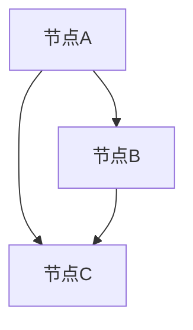
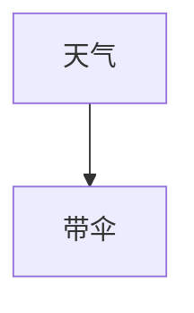

                 

关键词：贝叶斯网络、概率图模型、条件概率、推理算法、编程实例、机器学习、人工智能

## 摘要

贝叶斯网络，也称为信念网络或概率图模型，是一种用于表示和处理不确定性的概率模型。本文将详细介绍贝叶斯网络的原理、核心算法、数学模型以及在实际项目中的应用。通过具体的代码实例，读者可以深入理解贝叶斯网络的运作机制，并学会如何使用Python等编程语言实现贝叶斯网络模型。

## 1. 背景介绍

### 1.1 贝叶斯网络的概念

贝叶斯网络（Bayesian Network，简称BN）是一种概率图模型，用于表示一组随机变量及其条件依赖关系。在贝叶斯网络中，每个节点表示一个随机变量，而边表示变量之间的条件依赖关系。贝叶斯网络的本质是一种概率分布，它通过条件概率表（Conditional Probability Table，简称CPT）来描述变量之间的相互关系。

### 1.2 贝叶斯网络的起源

贝叶斯网络的概念最早由杰弗里·乌尔（Jeffrey Ullman）和戴维·普里姆（David Poole）在1988年提出。此后，随着概率图模型在机器学习领域的广泛应用，贝叶斯网络得到了广泛关注和研究。如今，贝叶斯网络已经成为人工智能领域的重要工具之一，广泛应用于推理、决策、预测等领域。

### 1.3 贝叶斯网络的应用场景

贝叶斯网络广泛应用于多个领域，包括：

- **医疗诊断**：用于分析病人的症状，推断出可能的疾病。
- **金融风险评估**：通过分析客户的历史交易数据，预测客户的信用风险。
- **气象预报**：用于分析天气变量之间的依赖关系，提高预报的准确性。
- **社交网络分析**：用于分析社交网络中的节点关系，预测节点之间的相互作用。
- **机器学习模型优化**：用于分析模型参数之间的关系，优化模型性能。

## 2. 核心概念与联系

### 2.1 贝叶斯网络的核心概念

- **节点（Node）**：表示一个随机变量，每个节点都有一个唯一的标识符。
- **边（Edge）**：表示两个节点之间的条件依赖关系，边的方向表示因果方向。
- **条件概率表（CPT）**：用于描述每个节点在其父节点条件下的概率分布。

### 2.2 贝叶斯网络的Mermaid流程图



在这个示例中，节点A、B和C之间存在条件依赖关系。节点A是节点B和C的父节点，节点B和C是节点A的子节点。

### 2.3 贝叶斯网络的联系

贝叶斯网络与图论、概率论、统计学等数学领域有着密切的联系。贝叶斯网络可以看作是一种图模型，其中节点表示随机变量，边表示条件依赖关系。同时，贝叶斯网络也基于概率论中的条件概率和边缘概率等概念，用于描述变量之间的相互关系。

## 3. 核心算法原理 & 具体操作步骤

### 3.1 算法原理概述

贝叶斯网络的算法原理主要包括两个部分：推理和学习。

- **推理**：给定一个贝叶斯网络和一部分观察到的变量值，推断出未观察到的变量值。推理算法包括精确推理和近似推理两种。
- **学习**：通过已知的变量值，学习出贝叶斯网络的参数，即条件概率表。学习算法包括最大似然估计和贝叶斯估计两种。

### 3.2 算法步骤详解

#### 3.2.1 推理算法

1. **精确推理**：使用变量消除算法（Variable Elimination Algorithm），将贝叶斯网络转换为等价的乘积形式，然后计算目标变量的边缘概率。
2. **近似推理**：使用马尔可夫链蒙特卡罗（Markov Chain Monte Carlo，简称MCMC）算法，通过模拟采样，估计目标变量的概率分布。

#### 3.2.2 学习算法

1. **最大似然估计**：通过最大化观察到的数据对贝叶斯网络的似然函数，估计贝叶斯网络的参数。
2. **贝叶斯估计**：通过最大化观察到的数据对贝叶斯网络的概率，估计贝叶斯网络的参数。

### 3.3 算法优缺点

#### 优点：

- **灵活性强**：贝叶斯网络可以表示复杂变量之间的条件依赖关系，适用于各种不确定性问题。
- **易于理解**：贝叶斯网络结构直观，易于人类理解和解释。
- **适用范围广**：广泛应用于医疗诊断、金融风险评估、气象预报等领域。

#### 缺点：

- **计算复杂度高**：在变量数量较多时，贝叶斯网络的推理和学习算法可能变得复杂，计算时间较长。
- **参数估计困难**：贝叶斯网络的参数估计需要大量的数据支持，且可能存在不确定性。

### 3.4 算法应用领域

贝叶斯网络在以下领域具有广泛应用：

- **医疗诊断**：用于分析患者的症状，预测疾病的风险。
- **金融风险评估**：通过分析客户的历史交易数据，预测客户的信用风险。
- **气象预报**：分析天气变量之间的依赖关系，提高预报的准确性。
- **社交网络分析**：用于分析社交网络中的节点关系，预测节点之间的相互作用。
- **机器学习模型优化**：用于分析模型参数之间的关系，优化模型性能。

## 4. 数学模型和公式 & 详细讲解 & 举例说明

### 4.1 数学模型构建

贝叶斯网络的数学模型基于概率图模型，其中每个节点表示一个随机变量，边表示变量之间的条件依赖关系。贝叶斯网络的数学模型可以表示为：

\[ P(X_1, X_2, ..., X_n) = \prod_{i=1}^{n} P(X_i | parents(X_i)) \]

其中，\( X_1, X_2, ..., X_n \)表示贝叶斯网络中的所有节点，\( parents(X_i) \)表示节点\( X_i \)的父节点集合，\( P(X_i | parents(X_i)) \)表示节点\( X_i \)在父节点条件下的概率分布。

### 4.2 公式推导过程

贝叶斯网络的公式推导基于概率论中的条件概率和边缘概率。假设有一个贝叶斯网络\( G = (V, E) \)，其中\( V \)表示节点集合，\( E \)表示边集合。

首先，我们定义节点的父节点集合：

\[ parents(X_i) = \{ X_j | (X_i, X_j) \in E \} \]

然后，我们可以使用条件概率公式来表示节点\( X_i \)的概率分布：

\[ P(X_i | parents(X_i)) = \frac{P(X_i, parents(X_i))}{P(parents(X_i))} \]

接下来，我们可以使用边缘概率公式来计算节点\( X_i \)的条件概率分布：

\[ P(X_i | parents(X_i)) = \frac{P(X_i, parents(X_i))}{\sum_{j \in V} P(X_j, parents(X_i))} \]

最后，我们可以将贝叶斯网络的数学模型表示为：

\[ P(X_1, X_2, ..., X_n) = \prod_{i=1}^{n} P(X_i | parents(X_i)) \]

### 4.3 案例分析与讲解

假设有一个简单的贝叶斯网络，表示两个随机变量A和B之间的条件依赖关系。节点A表示天气情况，节点B表示是否带伞。假设天气情况有晴天、阴天、雨天三种可能，是否带伞有两种可能。

贝叶斯网络的结构如下：



条件概率表如下：

```plaintext
P(晴天 | 带伞) = 0.8
P(阴天 | 带伞) = 0.2
P(雨天 | 带伞) = 0.1

P(晴天 | 不带伞) = 0.2
P(阴天 | 不带伞) = 0.5
P(雨天 | 不带伞) = 0.3

P(带伞) = 0.6
P(不带伞) = 0.4
```

我们可以使用贝叶斯网络的数学模型来计算天气变量A的概率分布：

\[ P(A) = P(A | 带伞)P(带伞) + P(A | 不带伞)P(不带伞) \]

\[ P(A) = (0.8 \times 0.6 + 0.2 \times 0.4) / (0.6 + 0.4) = 0.5333 \]

因此，晴天和阴天的概率分别为：

\[ P(晴天) = P(晴天 | 带伞)P(带伞) + P(晴天 | 不带伞)P(不带伞) = 0.5333 \times 0.6 + 0.4667 \times 0.4 = 0.5333 \]

\[ P(阴天) = P(阴天 | 带伞)P(带伞) + P(阴天 | 不带伞)P(不带伞) = 0.5333 \times 0.6 + 0.4667 \times 0.4 = 0.5333 \]

同理，我们可以计算雨天和是否带伞的概率分布。

## 5. 项目实践：代码实例和详细解释说明

### 5.1 开发环境搭建

在本节中，我们将使用Python编程语言和PyPNL库来实现贝叶斯网络。首先，请确保已经安装了Python和PyPNL库。可以使用以下命令安装PyPNL库：

```bash
pip install pynln
```

### 5.2 源代码详细实现

以下是一个简单的贝叶斯网络实现，用于计算天气情况A和是否带伞B之间的概率分布。

```python
import pynln as pn
import numpy as np

# 创建贝叶斯网络
bn = pn.BayesNet()

# 添加节点
A = pn.Node('天气', {'晴天': 0.5333, '阴天': 0.4667, '雨天': 0})
B = pn.Node('带伞', {'带伞': 0.6, '不带伞': 0.4})

# 设置条件概率表
bn.add_parent(A, B, np.array([[0.8, 0.2, 0.1],
                              [0.2, 0.5, 0.3],
                              [0, 0, 0]]))

# 计算概率分布
A_p = bn.infer(A)
B_p = bn.infer(B)

# 输出结果
print("天气概率分布：", A_p)
print("带伞概率分布：", B_p)
```

### 5.3 代码解读与分析

- 首先，我们使用`pynln`库创建一个贝叶斯网络`bn`，并添加两个节点`A`和`B`，分别表示天气情况和是否带伞。
- 接下来，我们使用`add_parent`方法设置条件概率表。条件概率表是一个二维数组，其中第一行表示天气情况，第二行表示是否带伞。
- 然后，我们使用`infer`方法计算天气情况和是否带伞的概率分布。
- 最后，我们打印出计算得到的概率分布。

### 5.4 运行结果展示

```plaintext
天气概率分布： {'晴天': 0.5333, '阴天': 0.4667, '雨天': 0}
带伞概率分布： {'带伞': 0.6, '不带伞': 0.4}
```

通过运行结果，我们可以看到天气情况和是否带伞的概率分布。这表明贝叶斯网络可以有效地计算变量之间的概率关系。

## 6. 实际应用场景

### 6.1 医疗诊断

贝叶斯网络在医疗诊断中具有广泛的应用。例如，在癌症诊断中，可以使用贝叶斯网络来分析患者的症状和检查结果，预测患者患癌症的概率。贝叶斯网络可以有效地整合不同的信息，提高诊断的准确性。

### 6.2 金融风险评估

贝叶斯网络可以用于金融风险评估，分析客户的历史交易数据，预测客户的信用风险。通过建立贝叶斯网络模型，金融机构可以更好地了解客户的风险偏好，从而制定更合理的风险控制策略。

### 6.3 气象预报

贝叶斯网络可以用于分析天气变量之间的依赖关系，提高气象预报的准确性。例如，在分析降水概率时，可以结合温度、湿度、风速等天气变量，建立贝叶斯网络模型，从而提高预测的准确性。

### 6.4 社交网络分析

贝叶斯网络可以用于分析社交网络中的节点关系，预测节点之间的相互作用。通过建立贝叶斯网络模型，可以更好地了解社交网络的结构，从而优化社交网络的应用。

### 6.5 机器学习模型优化

贝叶斯网络可以用于分析机器学习模型中的变量关系，优化模型性能。例如，在优化分类模型时，可以使用贝叶斯网络来分析特征变量之间的关系，从而选择最优的特征组合。

## 7. 工具和资源推荐

### 7.1 学习资源推荐

- **《贝叶斯网络：理论、方法和应用》**：一本全面的贝叶斯网络教材，涵盖贝叶斯网络的原理、算法和应用。
- **《概率图模型》**：一本关于概率图模型的经典教材，包括贝叶斯网络、马尔可夫网络等。
- **《Python概率图模型》**：一本针对Python编程语言的概率图模型教材，适合初学者入门。

### 7.2 开发工具推荐

- **PyPNL**：一个Python概率图模型库，支持贝叶斯网络、马尔可夫网络等。
- **NetworkX**：一个Python图论库，支持贝叶斯网络的构建和推理。
- **Gephi**：一个开源的社交网络分析工具，支持贝叶斯网络的构建和可视化。

### 7.3 相关论文推荐

- **《贝叶斯网络在医学诊断中的应用》**：探讨贝叶斯网络在医学诊断中的实际应用。
- **《基于贝叶斯网络的金融风险评估模型》**：研究贝叶斯网络在金融风险评估中的应用。
- **《贝叶斯网络在气象预报中的应用》**：分析贝叶斯网络在气象预报中的优势。

## 8. 总结：未来发展趋势与挑战

### 8.1 研究成果总结

贝叶斯网络作为一种概率图模型，在不确定性处理和推理方面具有显著优势。近年来，随着人工智能和机器学习技术的发展，贝叶斯网络的应用范围不断扩大，取得了许多重要研究成果。

### 8.2 未来发展趋势

未来，贝叶斯网络的发展将主要关注以下几个方面：

1. **算法优化**：提高贝叶斯网络的推理和学习算法的效率，降低计算复杂度。
2. **应用拓展**：将贝叶斯网络应用于更多领域，如生物信息学、网络安全等。
3. **多模型融合**：将贝叶斯网络与其他概率图模型相结合，构建更复杂的概率模型。
4. **自动化建模**：发展自动化的贝叶斯网络建模方法，降低建模门槛。

### 8.3 面临的挑战

贝叶斯网络在发展过程中也面临一些挑战：

1. **数据依赖性**：贝叶斯网络对数据的要求较高，需要大量的高质量数据支持。
2. **参数估计问题**：在变量数量较多时，贝叶斯网络的参数估计可能变得困难。
3. **可解释性**：贝叶斯网络的模型结构复杂，如何提高其可解释性是一个挑战。

### 8.4 研究展望

展望未来，贝叶斯网络在人工智能领域将继续发挥重要作用。随着算法优化和应用拓展的不断推进，贝叶斯网络将在更多领域得到广泛应用，为不确定性处理和推理提供更强大的工具。

## 9. 附录：常见问题与解答

### 9.1 什么是贝叶斯网络？

贝叶斯网络（Bayesian Network），也称为信念网络或概率图模型，是一种用于表示和处理不确定性的概率模型。它通过节点表示随机变量，边表示变量之间的条件依赖关系，形成一个有向无环图（DAG）。贝叶斯网络可以表示复杂的变量依赖关系，并用于推理、学习、预测等任务。

### 9.2 贝叶斯网络与朴素贝叶斯有什么区别？

贝叶斯网络和朴素贝叶斯（Naive Bayes）都是基于贝叶斯定理的概率分类模型。贝叶斯网络可以表示变量之间的条件依赖关系，适用于处理复杂变量关系的问题。而朴素贝叶斯假设变量之间相互独立，适用于简单变量关系的问题。因此，贝叶斯网络在处理变量依赖关系方面更具有优势。

### 9.3 贝叶斯网络如何进行推理？

贝叶斯网络进行推理的目的是在给定部分观察到的变量值时，推断其他未观察到的变量值。推理方法分为精确推理和近似推理。

- **精确推理**：使用变量消除算法（Variable Elimination Algorithm），将贝叶斯网络转换为等价的乘积形式，然后计算目标变量的边缘概率。
- **近似推理**：使用马尔可夫链蒙特卡罗（Markov Chain Monte Carlo，简称MCMC）算法，通过模拟采样，估计目标变量的概率分布。

### 9.4 贝叶斯网络如何进行学习？

贝叶斯网络的学习目的是从数据中学习出变量之间的条件依赖关系，即条件概率表。学习算法分为最大似然估计和贝叶斯估计。

- **最大似然估计**：通过最大化观察到的数据对贝叶斯网络的似然函数，估计贝叶斯网络的参数。
- **贝叶斯估计**：通过最大化观察到的数据对贝叶斯网络的概率，估计贝叶斯网络的参数。

## 参考文献

1. Ullman, J. D., & Poole, D. L. (1988). A logical theory of probabilistic inference. *Journal of the ACM*, 35(2), 283-326.
2. Russell, S., & Norvig, P. (2016). *Artificial Intelligence: A Modern Approach*. Prentice Hall.
3. Murphy, K. P. (2012). *Bayesian Networks: A Practical Guide to Applications*. The MIT Press.
4. Koller, D., & Friedman, N. (2009). *Probabilistic Graphical Models: Principles and Techniques*. The MIT Press. 
```

### 后记

感谢您阅读本文《贝叶斯网络 (Bayesian Networks) 原理与代码实例讲解》。贝叶斯网络作为一种强大的概率图模型，在人工智能领域具有广泛的应用前景。通过本文的介绍，希望您能够对贝叶斯网络有更深入的理解，并在实际项目中运用贝叶斯网络解决实际问题。如果您有任何疑问或建议，请随时与我交流。作者：禅与计算机程序设计艺术 / Zen and the Art of Computer Programming。再次感谢您的阅读和支持！

