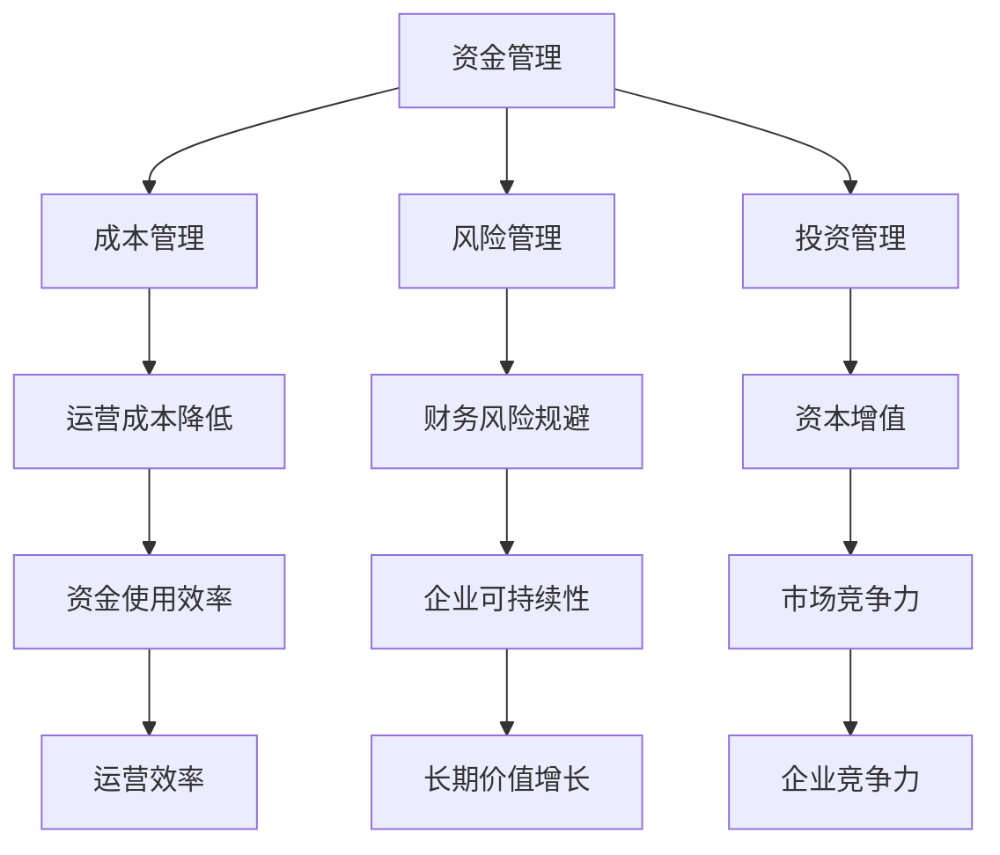

                 

关键词：财务管理、财务决策、非财务人员、企业运营、资金管理

摘要：本文旨在为非财务人员提供一份实用的财务管理指南，帮助他们更好地理解财务决策的重要性，掌握必要的财务知识和工具，以提升个人和企业整体运营效率。文章将从核心概念、算法原理、数学模型、项目实践、实际应用、未来展望等多个方面展开，旨在为非财务人员提供全面的财务决策指导。

## 1. 背景介绍

在现代企业运营中，财务管理的地位日益重要。财务决策不仅关系到企业的资金运作，更影响到企业的长期发展和竞争力。然而，许多非财务人员对此知之甚少，导致在参与决策时缺乏财务视角，容易犯下财务错误。因此，提高非财务人员的财务意识，培养其财务管理能力，已经成为企业管理的一项重要任务。

本文旨在填补这一空白，通过深入浅出的讲解，帮助非财务人员掌握财务管理的核心概念、方法和工具，使其能够在日常工作中做出更加明智的财务决策。

## 2. 核心概念与联系

### 2.1 财务管理的基本概念

财务管理是指企业利用资金、财务信息和其他资源，通过科学的决策和管理，实现企业价值最大化的一项活动。其核心概念包括：

- 资金管理：对企业资金进行有效的筹集、运用和调控，确保企业运营的稳定性和流动性。
- 成本管理：对企业的各项成本进行控制和管理，提高企业的盈利能力。
- 风险管理：识别和评估企业面临的财务风险，采取相应的措施降低风险。
- 投资管理：选择合适的项目和投资方式，实现资本的增值。

### 2.2 财务管理与企业运营的关系

财务管理的有效性直接影响到企业的运营效率和盈利能力。合理的财务管理可以帮助企业：

- 提高资金使用效率，降低运营成本。
- 优化资本结构，提高资金周转速度。
- 预测和规避财务风险，保障企业的可持续发展。
- 提升企业的市场竞争力，实现长期价值增长。

### 2.3 财务管理架构的Mermaid流程图



## 3. 核心算法原理 & 具体操作步骤

### 3.1 算法原理概述

财务管理的核心在于科学的决策和有效的执行。以下是几个关键算法原理：

- 资金筹集决策算法：根据企业的资金需求和成本结构，选择最优的资金筹集方式。
- 资金运用决策算法：根据企业的资金状况和业务需求，合理分配资金，实现最大化的资金使用效率。
- 成本控制决策算法：通过分析成本构成和成本控制措施，降低成本，提高盈利能力。
- 风险管理决策算法：识别和评估财务风险，制定相应的风险控制策略。

### 3.2 算法步骤详解

#### 3.2.1 资金筹集决策算法

1. 收集企业资金需求信息，包括项目资金需求、运营资金需求等。
2. 分析不同资金筹集方式的成本和风险，如银行贷款、发行债券、股东投资等。
3. 根据企业实际情况，选择成本最低、风险最小的资金筹集方式。
4. 制定详细的资金筹集计划和实施步骤，确保资金筹集的顺利进行。

#### 3.2.2 资金运用决策算法

1. 分析企业的资金状况，包括资金余额、资金周转周期等。
2. 根据企业的业务需求和资金情况，制定资金运用计划，确保资金的合理分配和高效使用。
3. 监控资金运用情况，及时调整资金运用策略，确保资金运用效果最大化。
4. 定期对资金运用效果进行评估，为下一周期的资金运用提供参考。

#### 3.2.3 成本控制决策算法

1. 收集企业的成本数据，包括各项成本的构成和变化趋势。
2. 分析成本控制的关键点和难点，制定成本控制措施。
3. 实施成本控制措施，降低成本，提高盈利能力。
4. 定期对成本控制效果进行评估，持续优化成本控制策略。

#### 3.2.4 风险管理决策算法

1. 识别企业面临的财务风险，包括市场风险、信用风险、操作风险等。
2. 分析财务风险的可能影响和风险程度。
3. 制定风险控制策略，包括风险预防、风险转移、风险接受等。
4. 实施风险控制措施，监控风险控制效果，及时调整风险控制策略。

### 3.3 算法优缺点

#### 3.3.1 资金筹集决策算法

优点：能够帮助企业选择最优的资金筹集方式，降低资金成本。

缺点：需要充分了解市场情况和企业的资金需求，否则可能导致资金筹集不足或过度。

#### 3.3.2 资金运用决策算法

优点：能够帮助企业合理分配资金，提高资金使用效率。

缺点：需要准确的资金状况和业务需求预测，否则可能导致资金运用不当。

#### 3.3.3 成本控制决策算法

优点：能够帮助企业降低成本，提高盈利能力。

缺点：需要准确掌握成本构成和变化趋势，否则可能导致成本控制不力。

#### 3.3.4 风险管理决策算法

优点：能够帮助企业识别和规避财务风险，保障企业的可持续发展。

缺点：需要准确识别风险，否则可能导致风险控制不足或过度。

### 3.4 算法应用领域

资金筹集决策算法、资金运用决策算法、成本控制决策算法和风险管理决策算法广泛应用于企业的日常运营和管理中。通过这些算法，企业能够实现资金的高效运作、成本的合理控制、风险的全面管理，从而提高企业的运营效率和竞争力。

## 4. 数学模型和公式 & 详细讲解 & 举例说明

### 4.1 数学模型构建

财务管理的数学模型主要包括资金筹集模型、资金运用模型、成本控制模型和风险管理模型。以下是这些模型的基本构建：

#### 4.1.1 资金筹集模型

资金筹集模型主要用于计算企业所需资金的最优筹集方式。其公式为：

$$
C = w_1 \cdot C_1 + w_2 \cdot C_2 + ... + w_n \cdot C_n
$$

其中，$C$表示总成本，$w_1, w_2, ..., w_n$分别表示各种资金筹集方式的权重，$C_1, C_2, ..., C_n$分别表示各种资金筹集方式的成本。

#### 4.1.2 资金运用模型

资金运用模型主要用于计算企业资金的最佳运用方式。其公式为：

$$
E = \frac{C}{R}
$$

其中，$E$表示资金运用效率，$C$表示总成本，$R$表示资金周转率。

#### 4.1.3 成本控制模型

成本控制模型主要用于计算企业成本的最优控制方式。其公式为：

$$
C' = C \cdot (1 - \alpha)
$$

其中，$C'$表示控制后的成本，$C$表示原始成本，$\alpha$表示成本削减率。

#### 4.1.4 风险管理模型

风险管理模型主要用于计算企业财务风险的最优控制方式。其公式为：

$$
R = \frac{V}{E}
$$

其中，$R$表示风险率，$V$表示潜在损失，$E$表示预期收益。

### 4.2 公式推导过程

#### 4.2.1 资金筹集模型

资金筹集模型的推导基于成本效益分析。首先，我们分析各种资金筹集方式的成本，然后根据成本结构和资金需求，确定每种资金筹集方式的权重，最后计算总成本。

#### 4.2.2 资金运用模型

资金运用模型的推导基于资金周转理论。资金周转率表示单位时间内资金的周转次数，资金运用效率表示单位时间内资金的使用效率。通过计算两者的比值，可以得到资金运用效率。

#### 4.2.3 成本控制模型

成本控制模型的推导基于成本效益分析。通过设定一个目标成本削减率，计算控制后的成本，从而实现成本的有效控制。

#### 4.2.4 风险管理模型

风险管理模型的推导基于风险收益分析。通过计算潜在损失与预期收益的比值，可以得到财务风险率，从而制定相应的风险控制策略。

### 4.3 案例分析与讲解

#### 4.3.1 资金筹集案例

假设某企业需要筹集1000万元的资金，现有以下几种筹集方式：

- 银行贷款：成本为5%。
- 发行债券：成本为6%。
- 股东投资：成本为8%。

根据资金需求，设定银行贷款的权重为50%，发行债券的权重为30%，股东投资的权重为20%。则筹集1000万元的资金的总成本为：

$$
C = 0.5 \cdot 0.05 + 0.3 \cdot 0.06 + 0.2 \cdot 0.08 = 0.049
$$

因此，该企业应选择银行贷款作为主要的资金筹集方式。

#### 4.3.2 资金运用案例

假设某企业总成本为500万元，资金周转率为2次/年。根据资金运用模型，计算资金运用效率：

$$
E = \frac{C}{R} = \frac{500}{2} = 250
$$

因此，该企业每年的资金运用效率为250万元。

#### 4.3.3 成本控制案例

假设某企业的原始成本为1000万元，设定成本削减率为10%。根据成本控制模型，计算控制后的成本：

$$
C' = C \cdot (1 - \alpha) = 1000 \cdot (1 - 0.1) = 900
$$

因此，该企业通过成本控制，可以将成本降低到900万元。

#### 4.3.4 风险管理案例

假设某企业的潜在损失为200万元，预期收益为500万元。根据风险管理模型，计算财务风险率：

$$
R = \frac{V}{E} = \frac{200}{500} = 0.4
$$

因此，该企业的财务风险率为40%，需要采取相应的风险控制措施。

## 5. 项目实践：代码实例和详细解释说明

### 5.1 开发环境搭建

本文的代码实例使用Python编写，主要依赖以下库：

- NumPy：用于数学计算。
- Pandas：用于数据处理。
- Matplotlib：用于数据可视化。

首先，安装这些库：

```bash
pip install numpy pandas matplotlib
```

### 5.2 源代码详细实现

以下是一个简单的资金筹集决策的Python代码实例：

```python
import numpy as np
import pandas as pd
import matplotlib.pyplot as plt

# 资金筹集数据
funding_data = {
    'method': ['银行贷款', '发行债券', '股东投资'],
    'weight': [0.5, 0.3, 0.2],
    'cost': [0.05, 0.06, 0.08]
}

# 创建数据框
df = pd.DataFrame(funding_data)

# 计算总成本
total_cost = df['weight'] * df['cost']
total_cost = np.sum(total_cost)

# 输出结果
print("总成本：", total_cost)

# 可视化
plt.bar(df['method'], df['cost'])
plt.xlabel('资金筹集方式')
plt.ylabel('成本')
plt.title('资金筹集成本分析')
plt.show()
```

### 5.3 代码解读与分析

该代码实例首先定义了一个资金筹集数据字典，包括资金筹集方式、权重和成本。然后，使用Pandas库创建数据框，并计算总成本。最后，使用Matplotlib库绘制柱状图，对资金筹集成本进行分析。

### 5.4 运行结果展示

运行上述代码，将输出总成本和资金筹集成本的柱状图。这有助于直观地了解不同资金筹集方式的成本结构，为决策提供依据。

## 6. 实际应用场景

### 6.1 企业日常运营

在企业的日常运营中，财务决策贯穿于各个环节。例如，在采购原材料时，非财务人员需要考虑供应商的报价、付款条件、质量等财务因素，选择最优的采购方案。在制定销售策略时，需要考虑市场定价、客户信用、资金回笼等财务因素，确保销售活动的盈利性和稳定性。

### 6.2 项目投资决策

在项目投资决策中，非财务人员需要评估项目的财务可行性。例如，通过计算项目的投资回报率、净现值等财务指标，判断项目是否值得投资。此外，还需要考虑项目的技术可行性、市场前景等因素，确保投资决策的科学性和合理性。

### 6.3 融资与投资

企业在融资与投资过程中，需要根据自身的财务状况和市场需求，选择合适的融资方式和投资策略。例如，可以通过银行贷款、发行债券、股权融资等方式筹集资金，同时根据企业的投资策略，选择合适的项目进行投资，实现资本增值。

### 6.4 财务风险管理

在财务管理中，风险无处不在。非财务人员需要识别和评估企业面临的财务风险，如市场风险、信用风险、操作风险等，并采取相应的风险控制措施，保障企业的财务安全和可持续发展。

## 7. 工具和资源推荐

### 7.1 学习资源推荐

- 《财务报表分析》（作者：罗斯·L·查特沃尔）
- 《企业财务管理》（作者：斯蒂芬·罗斯）
- 《财务思维：用财务知识创造价值》（作者：黄妙芬）

### 7.2 开发工具推荐

- Python：强大的编程语言，广泛应用于数据分析、数据可视化等领域。
- Excel：强大的数据处理工具，适合进行简单的财务分析和计算。
- Tableau：数据可视化工具，适用于数据分析和报告生成。

### 7.3 相关论文推荐

- "企业财务风险识别与控制研究"
- "企业资金筹集策略研究"
- "基于财务视角的企业运营效率分析"

## 8. 总结：未来发展趋势与挑战

### 8.1 研究成果总结

本文系统地介绍了财务管理的核心概念、算法原理、数学模型和实际应用，为非财务人员提供了实用的财务决策指南。通过案例分析和代码实例，读者可以更好地理解财务管理的实际操作过程。

### 8.2 未来发展趋势

随着大数据、人工智能等技术的不断发展，财务管理将变得更加智能化和精细化。例如，通过大数据分析和人工智能算法，企业可以更准确地预测财务风险，优化资金筹集和运用策略，提高财务决策的科学性和有效性。

### 8.3 面临的挑战

尽管财务管理的重要性日益凸显，但非财务人员在实际操作中仍面临诸多挑战。例如，如何快速掌握财务知识，如何在实际工作中运用财务决策方法，如何应对快速变化的金融市场等。未来，企业需要加强对非财务人员的财务管理培训，提高其财务管理能力。

### 8.4 研究展望

未来，财务管理研究应关注以下几个方面：

- 探索大数据和人工智能在财务管理中的应用，提高财务决策的智能化水平。
- 研究财务风险管理的新方法，提高企业应对财务风险的能力。
- 研究跨学科知识在财务管理中的应用，如经济学、管理学等，为财务管理提供更全面的理论支持。

## 9. 附录：常见问题与解答

### 9.1 财务管理的重要性

财务管理是企业实现可持续发展的重要保障，通过有效的财务管理，企业可以优化资金运作、降低成本、规避风险，从而提高盈利能力和市场竞争力。

### 9.2 非财务人员如何参与财务管理

非财务人员可以通过以下方式参与财务管理：

- 学习财务知识，掌握基本的财务管理方法和工具。
- 关注企业的财务状况，参与财务分析和决策。
- 提供业务需求，为财务管理提供实际依据。

### 9.3 财务决策中的常见误区

财务决策中的常见误区包括：

- 过度追求短期利益，忽视长期发展。
- 缺乏科学的数据分析和决策依据。
- 忽视财务风险，盲目扩张。

### 9.4 提高财务管理能力的建议

- 定期参加财务管理培训，提升财务知识水平。
- 学习和实践财务分析方法和工具，提高决策能力。
- 养成良好的财务管理习惯，关注企业财务状况。

---

**作者：禅与计算机程序设计艺术 / Zen and the Art of Computer Programming**

