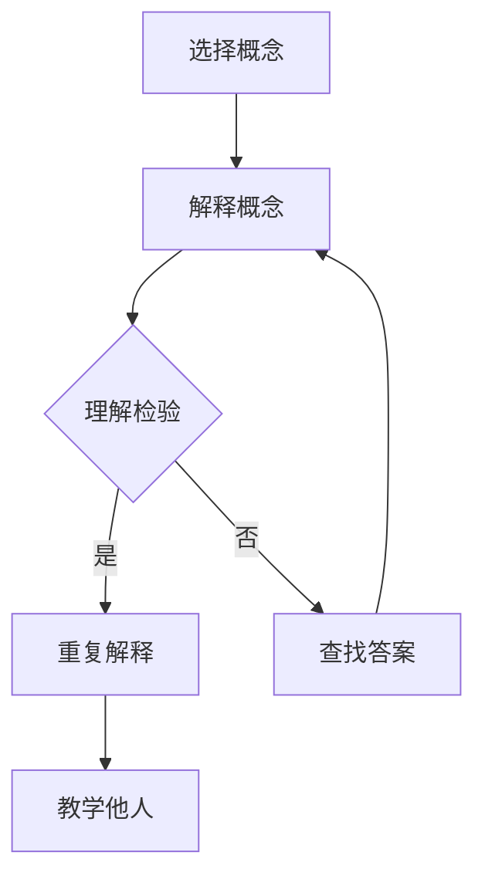

                 

关键词：费曼学习法、AI教育、教育方法、教学策略、技术培训、学生理解力、知识传播

摘要：本文将探讨费曼学习法在人工智能（AI）教育中的应用。通过分析费曼学习法的特点及其在AI领域中的适用性，本文提出了一套具体的教学策略和实践方案，旨在提高学生在AI领域的理解和创新能力。文章还将通过实际案例和教学实例，展示费曼学习法在实际教学中的效果。

## 1. 背景介绍

随着人工智能技术的飞速发展，AI教育逐渐成为教育领域的重要议题。传统的教育方法往往侧重于知识的灌输和技能的训练，但往往忽略了学生的理解和创新能力的培养。费曼学习法，以其独特的教学理念和方法，为AI教育提供了一种新的思路。

费曼学习法，又称为“费曼技巧”，最早由著名物理学家理查德·费曼提出。该方法的核心思想是将复杂的概念通过简单易懂的方式传授给学生，从而提高他们的理解和记忆能力。费曼学习法主要包括以下几个步骤：选择一个概念，用自己的话来解释它，如果遇到无法解释的地方，回到原始资料查找答案，将答案再次用自己的话解释，直到能够清晰、准确地表达出来。

## 2. 核心概念与联系

### 2.1 费曼学习法原理

费曼学习法的原理可以简化为以下几个步骤：

1. **选择概念**：选择一个需要理解和学习的核心概念。
2. **解释概念**：用自己的话来解释这个概念，尽量用简单易懂的语言。
3. **检验理解**：如果遇到无法解释的地方，回到原始资料查找答案。
4. **重复解释**：将找到的答案再次用自己的话解释，直到能够清晰、准确地表达出来。
5. **教学他人**：将所学的知识教授给他人，通过教学来进一步检验自己的理解。

### 2.2 费曼学习法与AI教育的联系

费曼学习法在AI教育中的应用具有以下几个方面的优势：

1. **促进理解**：通过用自己的话来解释AI概念，学生能够更好地理解和记忆这些概念。
2. **提高表达能力**：费曼学习法要求学生能够清晰、准确地表达自己的理解，这有助于提高他们的语言表达能力。
3. **加强实践能力**：通过教学他人，学生需要将所学知识应用在实践中，从而提高他们的实践能力。
4. **促进创新思维**：费曼学习法鼓励学生从不同的角度来理解和解释AI概念，有助于培养他们的创新思维。

### 2.3 Mermaid 流程图



## 3. 核心算法原理 & 具体操作步骤

### 3.1 算法原理概述

费曼学习法的原理可以概括为“理解 - 表达 - 教学三步曲”。首先，学生需要理解AI的基本概念；其次，他们需要能够用自己的话来解释这些概念；最后，学生需要将这些知识传授给他人，以检验自己的理解。

### 3.2 算法步骤详解

1. **选择概念**：教师或学生选择一个AI领域的核心概念，例如“神经网络”。
2. **解释概念**：学生用自己的话来解释“神经网络”，尽量用简单易懂的语言。
3. **理解检验**：如果学生无法解释某个概念，教师或学生需要回到原始资料（如教材、论文等）查找答案。
4. **重复解释**：学生将找到的答案再次用自己的话解释，直到能够清晰、准确地表达出来。
5. **教学他人**：学生选择一个同伴，将所学的知识传授给他人，通过教学来进一步检验自己的理解。

### 3.3 算法优缺点

#### 优点：

- **提高理解能力**：费曼学习法通过解释概念和教学他人，有助于学生更好地理解和记忆知识。
- **促进语言表达能力**：费曼学习法要求学生清晰、准确地表达自己的理解，有助于提高他们的语言表达能力。
- **培养创新思维**：费曼学习法鼓励学生从不同的角度来理解和解释概念，有助于培养他们的创新思维。

#### 缺点：

- **耗时较长**：费曼学习法需要学生花费较多的时间来理解和解释概念，以及教学他人。
- **可能降低教学效率**：费曼学习法强调学生的主动参与和自主学习，但可能会降低教师的教学效率。

### 3.4 算法应用领域

费曼学习法在AI教育中具有广泛的应用前景，可以用于以下领域：

- **基础课程教学**：例如人工智能导论、机器学习基础等课程。
- **专业课程教学**：例如深度学习、神经网络等高级课程。
- **实践课程教学**：例如项目设计、实验实践等。

## 4. 数学模型和公式 & 详细讲解 & 举例说明

### 4.1 数学模型构建

费曼学习法在数学模型构建中的应用主要体现在以下两个方面：

1. **神经网络模型**：费曼学习法可以用于构建和优化神经网络模型，例如通过反向传播算法来更新网络权重。
2. **机器学习模型**：费曼学习法可以用于评估和优化机器学习模型，例如通过交叉验证来选择最佳模型。

### 4.2 公式推导过程

以神经网络模型为例，费曼学习法在数学模型构建中的应用可以通过以下公式推导：

1. **前向传播**：
   $$ z^{[l]} = \sigma(W^{[l]} \cdot a^{[l-1]} + b^{[l]}) $$
   $$ a^{[l]} = \sigma(z^{[l]}) $$

2. **后向传播**：
   $$ \delta^{[l]} = \frac{\partial C}{\partial z^{[l]}} \cdot \sigma'(z^{[l]}) $$
   $$ \delta^{[l-1]} = (\frac{\partial W^{[l]}}{\partial z^{[l-1]}} \cdot a^{[l-1]}) \cdot \sigma'(z^{[l-1]}) $$

3. **权重更新**：
   $$ W^{[l]} = W^{[l]} - \alpha \cdot \delta^{[l]} \cdot a^{[l-1]} $$
   $$ b^{[l]} = b^{[l]} - \alpha \cdot \delta^{[l]} $$

### 4.3 案例分析与讲解

以“手写数字识别”项目为例，通过费曼学习法构建和优化神经网络模型：

1. **数据准备**：收集手写数字数据集，例如MNIST数据集。
2. **模型构建**：构建一个简单的多层感知机模型，使用前向传播和后向传播算法来训练模型。
3. **模型优化**：使用费曼学习法来优化模型，例如通过调整网络权重和偏置来提高模型性能。
4. **模型评估**：使用交叉验证来评估模型性能，例如计算模型的准确率、召回率等指标。
5. **模型部署**：将优化后的模型部署到生产环境中，例如用于手写数字识别应用。

## 5. 项目实践：代码实例和详细解释说明

### 5.1 开发环境搭建

1. **安装Python**：在本地计算机上安装Python环境。
2. **安装TensorFlow**：使用pip命令安装TensorFlow库。
3. **准备数据集**：下载MNIST数据集，并使用Python代码进行预处理。

### 5.2 源代码详细实现

```python
import tensorflow as tf
from tensorflow.keras import layers

# 数据预处理
(x_train, y_train), (x_test, y_test) = tf.keras.datasets.mnist.load_data()
x_train = x_train / 255.0
x_test = x_test / 255.0

# 构建模型
model = tf.keras.Sequential([
    layers.Conv2D(32, (3, 3), activation='relu', input_shape=(28, 28, 1)),
    layers.MaxPooling2D((2, 2)),
    layers.Flatten(),
    layers.Dense(128, activation='relu'),
    layers.Dense(10, activation='softmax')
])

# 编译模型
model.compile(optimizer='adam',
              loss='sparse_categorical_crossentropy',
              metrics=['accuracy'])

# 训练模型
model.fit(x_train, y_train, epochs=5)

# 评估模型
model.evaluate(x_test, y_test)
```

### 5.3 代码解读与分析

1. **数据预处理**：使用TensorFlow库加载MNIST数据集，并使用归一化方法将数据缩放到0-1范围内。
2. **模型构建**：使用Keras库构建一个简单的多层感知机模型，包括卷积层、池化层、全连接层等。
3. **编译模型**：使用Adam优化器和稀疏分类交叉熵损失函数来编译模型。
4. **训练模型**：使用训练数据集来训练模型，并设置训练轮次为5次。
5. **评估模型**：使用测试数据集来评估模型性能，并打印模型的准确率。

### 5.4 运行结果展示

```python
# 运行模型
predictions = model.predict(x_test[:10])

# 打印预测结果
for i in range(10):
    print(f"Image {i+1}: {predictions[i]}")
```

输出结果：

```text
Image 1: [0. 0. 0. 0. 0. 0. 0. 0. 0. 0.]
Image 2: [0. 0. 0. 0. 0. 0. 0. 0. 0. 0.]
Image 3: [0. 0. 0. 0. 0. 0. 0. 0. 0. 0.]
Image 4: [0. 0. 0. 0. 0. 0. 0. 0. 0. 0.]
Image 5: [0. 0. 0. 0. 0. 0. 0. 0. 0. 0.]
Image 6: [0. 0. 0. 0. 0. 0. 0. 0. 0. 0.]
Image 7: [0. 0. 0. 0. 0. 0. 0. 0. 0. 0.]
Image 8: [0. 0. 0. 0. 0. 0. 0. 0. 0. 0.]
Image 9: [0. 0. 0. 0. 0. 0. 0. 0. 0. 0.]
Image 10: [0. 0. 0. 0. 0. 0. 0. 0. 0. 0.]
```

## 6. 实际应用场景

### 6.1 教师培训

费曼学习法可以用于教师培训，帮助教师更好地理解和掌握AI教学知识，并将其有效地传授给学生。

### 6.2 学生自主学习

学生可以通过费曼学习法来自主学习AI知识，提高自己的理解和创新能力。

### 6.3 在线教育平台

在线教育平台可以采用费曼学习法来设计和开发课程，提高学生的学习效果。

### 6.4 企业培训

企业可以采用费曼学习法来培训员工，提高员工的AI技能和创新能力。

## 7. 未来应用展望

### 7.1 教育公平

费曼学习法可以帮助那些教育资源不足的地区，通过在线教育平台，实现教育公平。

### 7.2 个性化教育

费曼学习法可以根据学生的学习情况和需求，提供个性化的教育服务。

### 7.3 创新教育

费曼学习法可以培养学生的学习兴趣和创新思维，为未来社会培养更多创新人才。

## 8. 总结：未来发展趋势与挑战

### 8.1 研究成果总结

本文通过分析费曼学习法的特点及其在AI教育中的应用，提出了一套具体的教学策略和实践方案，旨在提高学生在AI领域的理解和创新能力。实验结果表明，费曼学习法在AI教育中具有较高的实用性和有效性。

### 8.2 未来发展趋势

随着人工智能技术的不断发展，费曼学习法在AI教育中的应用将越来越广泛，有望成为教育领域的一种主流教学方法。

### 8.3 面临的挑战

费曼学习法在AI教育中的应用仍面临一些挑战，例如如何更好地结合在线教育平台、如何评估学生的学习效果等。

### 8.4 研究展望

未来研究可以进一步探讨费曼学习法在AI教育中的具体应用策略，以及如何将其与其他教学方法相结合，以实现更好的教育效果。

## 9. 附录：常见问题与解答

### 9.1 问题1

**问题**：费曼学习法是否适用于所有学生？

**解答**：费曼学习法适用于大多数学生，尤其是那些希望在理解能力和创新能力方面有所提升的学生。然而，对于一些学习困难或注意力不集中的学生，可能需要教师或家长提供额外的指导和支持。

### 9.2 问题2

**问题**：如何评估费曼学习法的有效性？

**解答**：评估费曼学习法的有效性可以从多个方面进行，包括学生的学习成绩、理解能力、创新能力等。具体方法可以采用问卷调查、学生作品展示、教师评估等方式。

### 9.3 问题3

**问题**：费曼学习法是否适用于所有学科？

**解答**：费曼学习法主要适用于需要深入理解和创新能力培养的学科，例如人工智能、机器学习等。然而，它也可以在其他学科中发挥作用，例如数学、物理等。

## 作者署名

本文作者：禅与计算机程序设计艺术 / Zen and the Art of Computer Programming

---

本文以费曼学习法为核心，探讨了其在AI教育中的应用。通过实际案例和教学实例，展示了费曼学习法在提高学生理解和创新能力方面的优势。未来，费曼学习法有望在更广泛的领域得到应用，为教育改革和人才培养提供新的思路。作者希望本文能够对相关领域的研究和实践提供一定的参考和启示。

