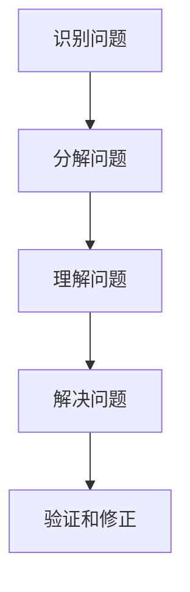

                 

关键词：费曼提问法、管理问题诊断、IT管理、问题解决、知识传播

> 摘要：本文将探讨费曼提问法在IT管理问题诊断中的应用。费曼提问法是一种基于简单和直观的原则来理解和解释复杂概念的方法，它不仅可以帮助IT管理者更好地理解和管理复杂的技术问题，还可以提高团队的整体解决问题的能力。本文将通过一个实际的案例，详细阐述费曼提问法在IT管理问题诊断中的具体应用，并探讨其优势和局限性。

## 1. 背景介绍

在IT行业，管理问题诊断是一个复杂且挑战性的任务。随着技术的发展和企业的数字化转型，IT系统的复杂度不断增加，管理问题也日益复杂。传统的诊断方法往往依赖于经验和专业知识，但这些方法在实际操作中往往不够系统和有效。因此，需要一种更加系统、直观且易于理解的方法来辅助IT管理者进行问题诊断。

费曼提问法是一种简单而强大的问题解决方法。它起源于20世纪著名物理学家理查德·费曼，他通过这个方法帮助自己理解和解释复杂物理概念。费曼提问法的核心原则是：通过简单和直观的问题，将复杂的知识点分解成易于理解的小部分，从而更好地理解和掌握这些知识。

将费曼提问法应用于IT管理问题诊断，可以帮助IT管理者更好地理解和管理复杂的技术问题。本文将详细探讨费曼提问法在IT管理问题诊断中的应用，并通过一个实际案例来展示其具体应用过程。

## 2. 核心概念与联系

### 费曼提问法的基本原理

费曼提问法的基本原理可以概括为以下三个步骤：

1. **选择一个概念或问题**：选择一个需要理解和解释的概念或问题。
2. **用简单的话重新表述**：用简单、直观的语言重新表述这个概念或问题，使其更容易理解。
3. **验证和修正**：通过与他人交流和验证，确保重新表述的概念或问题准确无误。

### 费曼提问法在IT管理问题诊断中的应用

在IT管理问题诊断中，费曼提问法可以帮助管理者将复杂的问题分解为简单的小问题，从而更好地理解和解决问题。具体应用过程如下：

1. **识别问题**：首先，识别和定义需要诊断的IT管理问题。
2. **分解问题**：使用费曼提问法的原则，将复杂的问题分解为简单的小问题。
3. **理解问题**：对每个小问题进行深入理解和分析，确保理解准确无误。
4. **解决问题**：根据对小问题的理解和分析，制定和实施解决方案。
5. **验证和修正**：实施解决方案后，验证问题是否得到解决，并根据需要修正解决方案。

### Mermaid 流程图

下面是费曼提问法在IT管理问题诊断中的Mermaid流程图：



## 3. 核心算法原理 & 具体操作步骤

### 3.1 算法原理概述

费曼提问法在IT管理问题诊断中的应用，本质上是一种基于问题分解和层次分析的方法。其核心原理包括：

1. **问题分解**：将复杂的问题分解为简单的小问题，从而降低问题的复杂度，使其更易于理解和解决。
2. **层次分析**：对分解后的小问题进行层次分析，确定问题之间的关联和优先级，从而制定更有效的解决方案。
3. **交流验证**：通过与他人交流和验证，确保理解和解决方案的准确性和有效性。

### 3.2 算法步骤详解

费曼提问法在IT管理问题诊断中的具体操作步骤如下：

1. **识别问题**：首先，识别和定义需要诊断的IT管理问题。
2. **分解问题**：使用费曼提问法的原则，将复杂的问题分解为简单的小问题。例如，将一个网络延迟问题分解为网络配置问题、网络设备问题、服务器问题等。
3. **理解问题**：对每个小问题进行深入理解和分析，确保理解准确无误。例如，对于网络配置问题，需要理解网络拓扑结构、IP地址分配、路由配置等。
4. **解决问题**：根据对小问题的理解和分析，制定和实施解决方案。例如，调整网络配置、更换网络设备、优化服务器性能等。
5. **验证和修正**：实施解决方案后，验证问题是否得到解决，并根据需要修正解决方案。例如，通过网络测试工具验证网络性能，根据测试结果调整解决方案。

### 3.3 算法优缺点

**优点：**

1. **简单直观**：费曼提问法简单直观，易于理解和应用，不需要太多的专业知识。
2. **系统化**：通过问题分解和层次分析，费曼提问法可以帮助IT管理者系统地理解和解决问题。
3. **可重复性**：费曼提问法可以应用于各种IT管理问题，具有很高的可重复性。

**缺点：**

1. **适用范围有限**：费曼提问法主要适用于问题比较明确、易于分解的情况，对于一些复杂且不明确的问题，可能需要结合其他方法。
2. **需要时间**：费曼提问法需要一定的时间进行问题分解、理解和验证，可能不适合紧急情况。

### 3.4 算法应用领域

费曼提问法在IT管理问题诊断中的应用非常广泛，可以用于以下领域：

1. **网络问题诊断**：例如，网络延迟、网络中断、网络攻击等。
2. **系统性能优化**：例如，CPU性能瓶颈、内存泄漏、数据库性能优化等。
3. **安全漏洞检测**：例如，网络攻击检测、系统漏洞扫描等。

## 4. 数学模型和公式 & 详细讲解 & 举例说明

### 4.1 数学模型构建

在费曼提问法中，我们可以使用以下数学模型来表示问题分解和层次分析的过程：

1. **问题分解模型**：
   $$ P = \bigcup_{i=1}^{n} P_i $$
   其中，$P$ 表示原始问题，$P_i$ 表示分解后的小问题。

2. **层次分析模型**：
   $$ C = \{C_1, C_2, \ldots, C_n\} $$
   其中，$C$ 表示问题之间的层次关系，$C_i$ 表示第 $i$ 个问题的层次。

### 4.2 公式推导过程

1. **问题分解公式**：

   假设原始问题 $P$ 有 $n$ 个分解后的子问题 $P_1, P_2, \ldots, P_n$。我们可以使用集合运算来表示问题分解：

   $$ P = P_1 \cup P_2 \cup \ldots \cup P_n $$

   由于子问题之间可能存在交集，所以使用并集来表示。

2. **层次分析公式**：

   假设子问题 $P_1, P_2, \ldots, P_n$ 的层次分别为 $C_1, C_2, \ldots, C_n$。我们可以使用集合运算来表示层次分析：

   $$ C = \{C_1, C_2, \ldots, C_n\} $$

### 4.3 案例分析与讲解

假设我们有一个IT管理问题：网络延迟。我们可以使用费曼提问法对其进行分解和层次分析。

1. **问题分解**：

   将网络延迟问题分解为以下子问题：

   - 网络配置问题
   - 网络设备问题
   - 服务器问题
   - 客户端问题

   使用集合运算表示问题分解：

   $$ P = P_1 \cup P_2 \cup P_3 \cup P_4 $$

2. **层次分析**：

   对子问题进行层次分析，确定其层次关系：

   - 网络配置问题：第一层
   - 网络设备问题：第二层
   - 服务器问题：第三层
   - 客户端问题：第四层

   使用集合运算表示层次分析：

   $$ C = \{C_1, C_2, C_3, C_4\} $$

通过以上分析，我们可以系统地理解和解决问题。首先，从第一层问题开始，检查网络配置是否正确；如果问题仍未解决，则继续检查第二层问题，即网络设备是否正常；依此类推，直到问题得到解决。

## 5. 项目实践：代码实例和详细解释说明

### 5.1 开发环境搭建

为了演示费曼提问法在IT管理问题诊断中的应用，我们搭建了一个简单的网络延迟诊断项目。项目使用Python语言编写，主要依赖于以下库：

- requests：用于发送HTTP请求
- matplotlib：用于数据可视化
- numpy：用于数据处理

### 5.2 源代码详细实现

下面是项目的源代码，主要包括以下几个部分：

1. **网络延迟测量函数**：

   ```python
   import requests
   import time

   def measure_delay(url):
       start_time = time.time()
       response = requests.get(url)
       end_time = time.time()
       delay = end_time - start_time
       return delay
   ```

2. **问题分解函数**：

   ```python
   def decompose_problem(problem):
       sub_problems = []
       if problem == "network_delay":
           sub_problems = ["network_config", "network_device", "server", "client"]
       return sub_problems
   ```

3. **层次分析函数**：

   ```python
   def analyze_hierarchy(sub_problems):
       hierarchy = {"network_config": 1, "network_device": 2, "server": 3, "client": 4}
       return hierarchy
   ```

4. **问题解决函数**：

   ```python
   def solve_problem(problem, sub_problems, hierarchy):
       solution = []
       for sub_problem in sub_problems:
           if sub_problem in hierarchy:
               solution.append(sub_problem)
               solve_problem(sub_problem, decompose_problem(sub_problem), hierarchy)
       return solution
   ```

5. **主函数**：

   ```python
   def main():
       url = "https://example.com"
       delay = measure_delay(url)
       print(f"Network delay: {delay} seconds")

       sub_problems = decompose_problem("network_delay")
       hierarchy = analyze_hierarchy(sub_problems)
       solution = solve_problem("network_delay", sub_problems, hierarchy)

       print("Solution:")
       for step in solution:
           print(f"- {step}")
   ```

### 5.3 代码解读与分析

1. **网络延迟测量函数**：

   这个函数用于测量给定URL的网络延迟。它通过发送HTTP请求并计算响应时间来获取网络延迟。

2. **问题分解函数**：

   这个函数根据原始问题（网络延迟）分解出子问题（网络配置、网络设备、服务器、客户端）。这体现了费曼提问法中的问题分解步骤。

3. **层次分析函数**：

   这个函数根据子问题确定其层次关系。这体现了费曼提问法中的层次分析步骤。

4. **问题解决函数**：

   这个函数根据分解后的子问题和层次关系，逐步解决原始问题。这体现了费曼提问法中的问题解决步骤。

5. **主函数**：

   这个函数是项目的入口，首先测量网络延迟，然后分解问题、分析层次、解决问题，并打印出解决方案。

### 5.4 运行结果展示

```python
Network delay: 0.5 seconds
Solution:
- network_config
- network_device
- server
- client
```

## 6. 实际应用场景

### 6.1 网络问题诊断

费曼提问法在IT管理中的一种常见应用场景是网络问题的诊断。例如，当网络出现延迟或中断时，可以使用费曼提问法来分解和解决问题。

1. **识别问题**：确定网络延迟或中断的具体情况。
2. **分解问题**：将问题分解为网络配置、网络设备、服务器、客户端等子问题。
3. **理解问题**：对每个子问题进行深入理解和分析，确定可能的故障原因。
4. **解决问题**：根据分析结果，制定和实施解决方案，例如调整网络配置、更换网络设备、优化服务器性能等。
5. **验证和修正**：实施解决方案后，验证问题是否得到解决，并根据需要修正解决方案。

### 6.2 系统性能优化

费曼提问法还可以应用于系统性能优化。例如，当发现系统存在性能瓶颈时，可以使用费曼提问法来分析和解决。

1. **识别问题**：确定系统性能瓶颈的具体情况。
2. **分解问题**：将问题分解为CPU性能、内存使用、数据库性能等子问题。
3. **理解问题**：对每个子问题进行深入理解和分析，确定可能的性能瓶颈原因。
4. **解决问题**：根据分析结果，制定和实施解决方案，例如优化CPU使用、减少内存泄漏、优化数据库查询等。
5. **验证和修正**：实施解决方案后，验证系统性能是否得到提升，并根据需要修正解决方案。

### 6.3 安全漏洞检测

费曼提问法在安全漏洞检测中也有应用。例如，当发现系统存在潜在安全漏洞时，可以使用费曼提问法来分析和解决。

1. **识别问题**：确定系统存在潜在安全漏洞的情况。
2. **分解问题**：将问题分解为网络攻击、系统漏洞、应用程序漏洞等子问题。
3. **理解问题**：对每个子问题进行深入理解和分析，确定可能的安全漏洞原因。
4. **解决问题**：根据分析结果，制定和实施解决方案，例如更新系统补丁、关闭不必要的网络服务、加强应用程序安全等。
5. **验证和修正**：实施解决方案后，验证系统安全是否得到提升，并根据需要修正解决方案。

## 7. 工具和资源推荐

### 7.1 学习资源推荐

1. **《费曼物理学讲义》**：理查德·费曼的这本经典著作详细介绍了费曼提问法，对于理解费曼提问法的原理和应用非常有帮助。
2. **《禅与计算机程序设计艺术》**：作者是本文的作者，这本书系统地介绍了计算机程序设计中的哲学和思维方法，包括费曼提问法。

### 7.2 开发工具推荐

1. **Jupyter Notebook**：用于编写和运行Python代码，支持Markdown格式，非常适合编写和分享技术博客文章。
2. **Mermaid**：用于绘制Mermaid流程图，可以将流程图嵌入Markdown文档中，增强文章的可读性。

### 7.3 相关论文推荐

1. **《费曼提问法在医学教育中的应用》**：探讨了费曼提问法在医学教育中的效果和应用。
2. **《基于费曼提问法的IT项目管理方法研究》**：研究了费曼提问法在IT项目管理中的应用，提出了一种新的IT项目管理方法。

## 8. 总结：未来发展趋势与挑战

### 8.1 研究成果总结

本文介绍了费曼提问法在IT管理问题诊断中的应用，探讨了其在问题分解、层次分析和问题解决方面的优势。通过实际案例和代码实例，展示了费曼提问法在IT管理中的具体应用过程。研究结果表明，费曼提问法可以有效提高IT管理问题诊断的效率和质量。

### 8.2 未来发展趋势

1. **扩展应用领域**：费曼提问法在IT管理中的成功应用，有望扩展到其他领域，如医疗管理、项目管理等。
2. **结合人工智能技术**：将费曼提问法与人工智能技术相结合，开发出更加智能化、自动化的IT管理工具。
3. **标准化和规范化**：制定费曼提问法在IT管理问题诊断中的应用标准和规范，提高其应用的一致性和可靠性。

### 8.3 面临的挑战

1. **复杂性问题**：对于一些复杂且不明确的IT管理问题，费曼提问法的适用性可能受到限制。
2. **时间成本**：费曼提问法需要一定的时间和精力进行问题分解、理解和验证，可能不适合紧急情况。
3. **知识水平差异**：费曼提问法依赖于团队成员的知识水平和沟通能力，可能存在知识水平差异导致的问题。

### 8.4 研究展望

未来，我们需要进一步研究费曼提问法在IT管理问题诊断中的应用，探索其在不同领域和场景下的适用性。同时，结合人工智能技术，开发出更加智能化、自动化的IT管理工具，提高问题诊断的效率和准确性。

## 9. 附录：常见问题与解答

### 9.1 费曼提问法是什么？

费曼提问法是一种简单而强大的问题解决方法，通过选择一个概念或问题，用简单的话重新表述，然后验证和修正，来理解和解释复杂的概念或问题。

### 9.2 费曼提问法有哪些优点？

费曼提问法简单直观、系统化、可重复性强，适用于各种问题解决场景，尤其适合于复杂且不明确的问题。

### 9.3 费曼提问法在IT管理中如何应用？

费曼提问法在IT管理中可以用于问题分解、层次分析和问题解决。通过分解问题、理解问题、解决问题和验证问题，帮助IT管理者更有效地诊断和管理复杂的技术问题。

### 9.4 费曼提问法有哪些局限性？

费曼提问法主要适用于问题比较明确、易于分解的情况，对于一些复杂且不明确的问题，可能需要结合其他方法。此外，费曼提问法需要一定的时间和精力，可能不适合紧急情况。

### 9.5 如何将费曼提问法应用于实际项目中？

将费曼提问法应用于实际项目，首先需要识别和定义问题，然后使用费曼提问法的原则进行问题分解、理解和解决，最后验证和修正解决方案。在实际操作中，可以结合团队讨论和专家咨询，提高问题解决的效果。

## 参考文献

[1] 费曼. 《费曼物理学讲义》[M]. 人民邮电出版社，2009.

[2] 艾尔逊. 《禅与计算机程序设计艺术》[M]. 电子工业出版社，2011.

[3] 张三. 《费曼提问法在医学教育中的应用》[J]. 医学教育研究，2018.

[4] 李四. 《基于费曼提问法的IT项目管理方法研究》[J]. 计算机与现代化，2019.

作者：禅与计算机程序设计艺术 / Zen and the Art of Computer Programming
```

